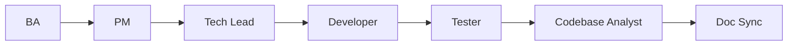
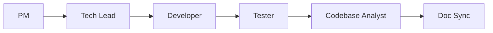
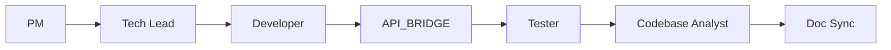

# WORKFLOW_RULE — Agent chain (Spring Boot / `smart-erp`)

> **Version**: 2.5  
> **Source of truth**: this file + [`AGENT_REGISTRY.md`](AGENT_REGISTRY.md).

---

## 0.0 Ad-hoc flow: bugs / defects (does not replace the main chain)

When you need **RCA + a proposed fix plan** before changing code: run **`BUG_INVESTIGATOR`** per [`BUG_INVESTIGATOR_AGENT_INSTRUCTIONS.md`](BUG_INVESTIGATOR_AGENT_INSTRUCTIONS.md) → produce `backend/docs/bugs/Bug_Task<NNN>.md` → Owner chooses a plan → then run **`DEVELOPER`** per [`DEVELOPER_AGENT_INSTRUCTIONS.md`](DEVELOPER_AGENT_INSTRUCTIONS.md). Do not insert `BUG_INVESTIGATOR` into the mandatory `PM → … → Doc Sync` chain — this is a parallel / out-of-sprint session for incidents.

---

## 0. Execution entry points (BA vs PM)

| Entry point | When | Execution chain |
| :--- | :--- | :--- |
| **Standard (greenfield spec)** | SRS / API is still **Draft**, or BA changes are needed before coding | `BA → PM → Tech Lead → …` (section 0.1) |
| **SRS is Approved** | PO has **Approved** the SRS (and related API docs if any); no extra BA loop is needed for that gate | **`PM` starts** — treat **G-BA as passed** for that task; PM creates the task chain under `docs/taskXXX/01-pm/` then continues `PM → Tech Lead → …` (section 0.1). BA returns only if the Owner re-opens the spec (back to Draft / change request). |

**Mandatory order after the entry point** (do not skip steps unless the Owner explicitly documents an exception with an ADR):

```text
PM → Tech Lead → Developer → Tester → Codebase Analyst → Doc Sync
```

_(When starting from the standard greenfield flow, prefix **`BA →`** before `PM`.)_

### 0.1 Full diagram (with BA)

```text
BA → PM → Tech Lead → Developer → Tester → Codebase Analyst → Doc Sync
```



### 0.2 Diagram when SRS is Approved (PM is the execution start)



### 0.3 Chain when a backend task has **REST for mini-erp** (SRS / API is Approved)

After the Developer **merges** backend code and **`mvn verify` is green** (G-DEV), if the task has a contract file `frontend/docs/api/API_TaskXXX_*.md` (endpoint consumed by `mini-erp`), then **the API_BRIDGE step is mandatory** before considering the “FE wiring” done — do **not** force it into the Tester → … order; API_BRIDGE runs **in parallel or right after G-DEV**. Before any `wire-fe`, run at least one `Mode=verify` session.

**Why is API_BRIDGE still required if BE was implemented from the SRS?** The **Developer** role only cross-checks SRS + `API_Task*.md` while coding; **API_BRIDGE** (per [`API_BRIDGE_AGENT_INSTRUCTIONS.md`](API_BRIDGE_AGENT_INSTRUCTIONS.md)) is a **separate** session: read `FE_API_CONNECTION_GUIDE.md`, grep the path in BE/FE, and create/update `frontend/docs/api/bridge/BRIDGE_*.md` — this is **not** replaced by “just reading the SRS” or only running `mvn verify`. Skipping it means missing **G-BRIDGE** / DoD handoff in §3.1.

**SRS grouping multiple endpoints (one SRS file → multiple `API_TaskYYY_*.md`)** — e.g. `backend/docs/srs/SRS_Task014-020_stock-receipts-lifecycle.md` maps to Task014…Task020:

| Work item | Who / When |
| :--- | :--- |
| Implement BE per SRS + API docs | **Developer** (G-DEV) |
| Validate each path ↔ BE ↔ (FE if any) + `BRIDGE_TaskYYY_*.md` | **API_BRIDGE** `Mode=verify` — **after G-DEV**, **one session per path** (recommended) or a batch of paths listed by **PM** in the ticket (the BRIDGE table must still include all required columns per section 5 in `API_BRIDGE`). |
| Wire `mini-erp` | **API_BRIDGE** `Mode=wire-fe` when requested by Owner/PM |



- **If the task does not** expose REST for the UI (internal batch job, migration-only, …) → **skip** the `API_BRIDGE` branch.  
- **Prompt & checklist details** → **§3.1** (copy/paste orchestration — “automation” here means **standardized handoff**, no special tooling needed).  
- **SRS Task014–020 (stock-receipts):** once the controller covers paths Task014–020, the Owner pastes the **§3.1** blocks (or **7.1** in `API_BRIDGE_AGENT_INSTRUCTIONS.md`) sequentially with `Task=Task014`…`Task020` and the correct `Path=` — do not replace API_BRIDGE with a single “do the whole SRS” prompt.
- **SRS Task021–028 (inventory-audit-sessions):** PO answered OQs (Draft may still be implemented per Owner direction). Flyway **V12** (extended status, `deleted_at`, `owner_notes`, `inventory_audit_session_events`). BE: Task021–028 + GAP **soft DELETE** (029), **POST …/approve** (030), **POST …/reject** (031); after **G-DEV** (`mvn verify` green) → API_BRIDGE per path that has `API_Task021`…

---

## 1. General principles

| # | Rule |
| :---: | :--- |
| 1 | Each agent must do **only its role** and produce the **defined outputs** in its instruction file. |
| 2 | **Do not invent requirements** that are not in the brief / SRS / approved task. |
| 3 | Any cross-layer contract change (API, schema, ADR) must be **synced** before merge — Doc Sync reports drift. |
| 4 | Git branches: **PM** must land the task chain on `develop` before Dev starts; Dev must **not** commit directly to `main` / `develop` — always work on a feature branch from `develop`. |

### 1.1 Context7 (MCP — external library docs)

- Pull **framework/library docs** when project artifacts (SRS, Flyway, ADR, code) are **insufficient** to avoid outdated APIs or hallucination — **after** you have already located relevant code via minimal grep/read in the repo.
- Do **not** replace business truth or the schema; do **not** overuse it in every prompt. Role-specific details: `DEVELOPER_AGENT_INSTRUCTIONS.md` §9, `TECH_LEAD_AGENT_INSTRUCTIONS.md` §6, `TESTER_AGENT_INSTRUCTIONS.md` §3, `SQL_AGENT_INSTRUCTIONS.md` §4, `API_BRIDGE_AGENT_INSTRUCTIONS.md` (section 2 — after Step 0).

---

## 2. Minimum gates (summary)

| Gate | After agent | Condition to move forward |
| :--- | :--- | :--- |
| G-BA | BA | SRS **Draft** per [`BA_AGENT_INSTRUCTIONS.md`](BA_AGENT_INSTRUCTIONS.md): business breakdown, **Open Questions (PO)** with IDs, **file scope**, **actor flows** (mermaid when needed), **full sample JSON request/response**, Given/When/Then. PO changes status → **Approved** + template sign-off. **Touches DB**: the **Data & reference SQL** section is co-authored with **SQL Agent** (`SQL_AGENT_INSTRUCTIONS.md`). **If SRS was already Approved before opening the task:** treat G-BA as **passed**; **PM** starts per §0. |
| G-PM | PM | Task chain (Unit + Feature + E2E) + IDs + dependencies is **merged into `develop`** (per `PM_AGENT_INSTRUCTIONS.md`). |
| G-TL | Tech Lead | ADR (includes mandatory 5-item NFR section) + coding guardrails / requirement review. |
| G-DEV | Developer | Strict TDD; `mvn verify` green; JaCoCo **≥ 80%** (coverage gate) before Ready for review. **REST for mini-erp** → follow **API_BRIDGE handoff** checklist in `DEVELOPER_AGENT_INSTRUCTIONS.md` §5.1. |
| G-BRIDGE | API_BRIDGE | **Only when** the task has `frontend/docs/api/API_TaskXXX_*.md` + UI path under `/api/v1/...`. After G-DEV: at minimum `Mode=verify` + `frontend/docs/api/bridge/BRIDGE_*.md`; `wire-fe` per PM/Owner decision. Follow [`API_BRIDGE_AGENT_INSTRUCTIONS.md`](API_BRIDGE_AGENT_INSTRUCTIONS.md) + **§3.1** (handoff prompt). |
| G-TST | Tester | AC satisfied; **manual unit test** + smoke (per `TESTER_AGENT_INSTRUCTIONS.md`); Postman / `MANUAL_UNIT_TEST_*.md`. Automation only if ADR/Owner requires it. |
| G-CBA | Codebase Analyst | 10-step brownfield brief (greenfield → 7 documents) handed off to Doc Sync. |
| G-DS | Doc Sync | Drift report after sprint/PR merges; warns when analysis docs diverge from code. |

---

## 3. Quick calls in Cursor

```text
WORKFLOW_RULE: BA → … — read @backend/AGENTS/WORKFLOW_RULE.md @backend/AGENTS/AGENT_REGISTRY.md
```

```text
WORKFLOW_RULE: SRS is Approved — start PM → … — read @backend/AGENTS/WORKFLOW_RULE.md §0
```

```text
Role: BA. Read @backend/AGENTS/BA_AGENT_INSTRUCTIONS.md …
```

```text
Role: PM. Read @backend/AGENTS/PM_AGENT_INSTRUCTIONS.md … (SRS Approved — §0.2)
```

_(Replace `BA` with `PM` | `TECH_LEAD` | `DEVELOPER` | `TESTER` | `CODEBASE_ANALYST` | `DOC_SYNC`.)_

**SQL Agent** (`SQL`): use it **during the BA phase** when the SRS needs queries / migration ideas — it is not after Tester in the linear chain; see `SQL_AGENT_INSTRUCTIONS.md`.

```text
Role: API_BRIDGE. Read @backend/AGENTS/API_BRIDGE_AGENT_INSTRUCTIONS.md — Task=<TaskXXX> Path=<...> Mode=verify
```

```text
WORKFLOW_RULE: Handoff to API_BRIDGE after G-DEV (BE has REST for mini-erp) — read @backend/AGENTS/WORKFLOW_RULE.md §0.3 §3.1
```

**API_BRIDGE** ([`API_BRIDGE_AGENT_INSTRUCTIONS.md`](API_BRIDGE_AGENT_INSTRUCTIONS.md)): conditionally **mandatory** after G-DEV when the task has REST for mini-erp (**§0.3**, gate **G-BRIDGE**); other situations can still trigger it **ad-hoc**. You **must** read [`frontend/AGENTS/docs/FE_API_CONNECTION_GUIDE.md`](../../frontend/AGENTS/docs/FE_API_CONNECTION_GUIDE.md) first, then change `frontend/mini-erp/src/**` under `Mode=wire-fe` or output `frontend/docs/api/bridge/BRIDGE_*.md`.

### 3.1 Standard handoff BE → **API_BRIDGE** (copy into chat / PR / ticket)

**Prerequisites:** the SRS (and relevant `API_TaskXXX_*`) is **Approved**; BE has controller + path matching spec; at least one `frontend/docs/api/API_TaskXXX_*.md` file describes the `Path`.

**Recommended order:** session 1 **`verify`** → session 2 **`wire-fe`** (if the Owner requests UI wiring in the same sprint).

**Command block — verify session (after `mvn verify` is green):**

```text
HANDOFF_API_BRIDGE | Post=G-DEV | Task=<TaskXXX> | Path=<METHOD> <full path e.g. GET /api/v1/...>

Role: API_BRIDGE. Follow @backend/AGENTS/API_BRIDGE_AGENT_INSTRUCTIONS.md.

API_BRIDGE | Task=<TaskXXX> | Path=<METHOD> <path> | Mode=verify

Read: @frontend/AGENTS/docs/FE_API_CONNECTION_GUIDE.md → @frontend/docs/api/API_TaskXXX_<slug>.md (endpoint index for Path) → grep Path in @backend/smart-erp/src/main/java → grep Path in @frontend/mini-erp/src.

Output: create or update @frontend/docs/api/bridge/BRIDGE_TaskXXX_<slug>.md per API_BRIDGE section 5.
```

**Command block — wire-fe session (after verify or within the same sprint):**

```text
HANDOFF_API_BRIDGE | Post=G-DEV | Task=<TaskXXX> | Path=<METHOD> <path> | Wire=fe

Role: API_BRIDGE. Follow @backend/AGENTS/API_BRIDGE_AGENT_INSTRUCTIONS.md.

API_BRIDGE | Task=<TaskXXX> | Path=<METHOD> <path> | Mode=wire-fe

UI context: <route or screen — see @frontend/mini-erp/src/features/FEATURES_UI_INDEX.md>.

Output: @frontend/docs/api/bridge/BRIDGE_TaskXXX_<slug>.md + code under frontend/mini-erp/src/**.
```

**Practical “automation” in Cursor (pick one or combine):**

| Option | What to do |
| :--- | :--- |
| **A. PR template** | PM/Dev pastes **§3.1 verify** into the backend PR description when the task has API docs → reviewer/Owner opens a new chat, pastes it, runs the agent. |
| **B. Cursor rule** | Project rule: when branch `feature/*-taskXXX` and there are changes under `backend/smart-erp/.../controller` → remind Developer checklist §5.1 + the `HANDOFF_API_BRIDGE` line. |
| **C. Ticket / DoD** | Backend task DoD: checkbox “API_BRIDGE verify (Y/N)” + link to `BRIDGE_*.md`. |
| **D. Two consecutive agent sessions** | Chat 1: Developer closes G-DEV → Owner pastes verify → Chat 2 (optional): wire-fe — lower token usage, aligns with “one session = one path”. |

---

## 4. Frontend linkage

For overall UI / product flow in the repo: `frontend/AGENTS/WORKFLOW_RULE.md`. The **Spring Boot** stream uses **this file** as the source of truth.
