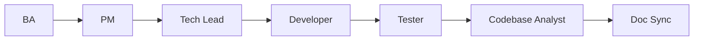
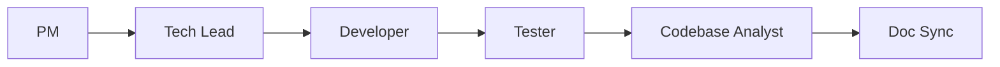

# WORKFLOW_RULE — Chuỗi Agent (Spring Boot / `smart-erp`)

> **Phiên bản**: 2.1  
> **Nguồn chân lý**: file này + [`AGENT_REGISTRY.md`](AGENT_REGISTRY.md).

---

## 0. Điểm vào thực thi (BA vs PM)

| Điểm vào | Khi nào | Chuỗi thực thi |
| :--- | :--- | :--- |
| **Chuẩn (greenfield spec)** | SRS / API còn **Draft** hoặc cần BA chỉnh trước khi code | `BA → PM → Tech Lead → …` (mục 0.1) |
| **SRS đã Approved** | PO đã **Approved** SRS (và API liên quan nếu có); không cần vòng BA thêm cho gate đó | **`PM` khởi tạo** — coi **G-BA đã đạt** cho task đó; PM tạo chuỗi task trong `docs/taskXXX/01-pm/` rồi tiếp tục `PM → Tech Lead → …` (mục 0.1). BA chỉ quay lại nếu Owner mở lại spec (đổi Draft / CR). |

**Thứ tự bắt buộc sau điểm vào** (không nhảy bước trừ khi Owner ghi rõ ngoại lệ có ADR):

```text
PM → Tech Lead → Developer → Tester → Codebase Analyst → Doc Sync
```

_(Khi bắt đầu từ chuẩn greenfield, thêm tiền tố **`BA →`** phía trước `PM`.)_

### 0.1 Sơ đồ đầy đủ (có BA)

```text
BA → PM → Tech Lead → Developer → Tester → Codebase Analyst → Doc Sync
```



### 0.2 Sơ đồ khi SRS đã Approved (PM là bước đầu thực thi)



---

## 1. Nguyên tắc chung

| # | Quy tắc |
| :---: | :--- |
| 1 | Mỗi agent chỉ làm **đúng vai** và **output** đã định nghĩa trong file hướng dẫn tương ứng. |
| 2 | **Không phát minh yêu cầu** không có trong brief / SRS / task đã duyệt. |
| 3 | Mọi thay đổi hợp đồng đa tầng (API, schema, ADR) phải **đồng bộ** trước merge — Doc Sync báo drift. |
| 4 | Nhánh git: **PM** cam kết task lên `develop` trước khi Dev bắt đầu; Dev **không** commit trực tiếp `main` / `develop` — luôn nhánh feature từ `develop`. |

---

## 2. Gate tối thiểu (tóm tắt)

| Gate | Sau agent | Điều kiện chuyển bước |
| :--- | :--- | :--- |
| G-BA | BA | SRS / spec kỹ thuật **Draft** đủ Given/When/Then; PO đổi trạng thái file → **Approved** (xem `BA_AGENT_INSTRUCTIONS.md`). **Nếu use case đụng DB**: SRS có mục **Dữ liệu & SQL tham chiếu** đã đồng soạn / rà với **Agent SQL** (`SQL_AGENT_INSTRUCTIONS.md`). **Nếu SRS đã Approved trước khi mở task:** coi G-BA **đạt**; **PM** bắt đầu theo §0. |
| G-PM | PM | Chuỗi task (Unit + Feature + E2E) + ID + phụ thuộc đã **merge vào `develop`** (theo `PM_AGENT_INSTRUCTIONS.md`). |
| G-TL | Tech Lead | ADR (có mục NFR bắt buộc 5 mục) + rào chắn mã / review yêu cầu. |
| G-DEV | Developer | TDD; `mvn verify` xanh; JaCoCo **≥ 80%** (cổng coverage) trước Ready for review. |
| G-TST | Tester | AC đạt; **manual unit test** + smoke (theo `TESTER_AGENT_INSTRUCTIONS.md`); Postman / `MANUAL_UNIT_TEST_*.md`. Auto test chỉ khi ADR/Owner yêu cầu. |
| G-CBA | Codebase Analyst | Bản brownfield 10 bước (greenfield → 7 tài liệu) bàn giao cho Doc Sync. |
| G-DS | Doc Sync | Báo cáo drift sau sprint/PR merge; cảnh báo khi tài liệu phân tích lệch code. |

---

## 3. Gọi nhanh trong Cursor

```text
WORKFLOW_RULE: BA → … — đọc @backend/AGENTS/WORKFLOW_RULE.md @backend/AGENTS/AGENT_REGISTRY.md
```

```text
WORKFLOW_RULE: SRS đã Approved — bắt đầu PM → … — đọc @backend/AGENTS/WORKFLOW_RULE.md §0
```

```text
Vai trò: BA. Đọc @backend/AGENTS/BA_AGENT_INSTRUCTIONS.md …
```

```text
Vai trò: PM. Đọc @backend/AGENTS/PM_AGENT_INSTRUCTIONS.md … (SRS Approved — §0.2)
```

_(Thay `BA` bằng `PM` | `TECH_LEAD` | `DEVELOPER` | `TESTER` | `CODEBASE_ANALYST` | `DOC_SYNC`.)_

**Agent SQL** (`SQL`): dùng **cùng giai đoạn BA** khi SRS cần truy vấn / migration ý tưởng — không nằm sau Tester trong chuỗi tuyến tính; xem `SQL_AGENT_INSTRUCTIONS.md`.

---

## 4. Liên kết frontend

Luồng UI / product tổng thể repo: `frontend/AGENTS/WORKFLOW_RULE.md`. Nhánh **Spring Boot** dùng **file này** làm chuẩn.
