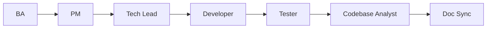
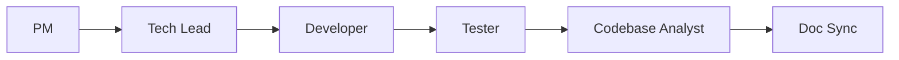
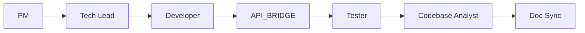

# WORKFLOW_RULE — Chuỗi Agent (Spring Boot / `smart-erp`)

> **Phiên bản**: 2.5  
> **Nguồn chân lý**: file này + [`AGENT_REGISTRY.md`](AGENT_REGISTRY.md).

---

## 0.0 Luồng ad-hoc: lỗi / defect (không thay chuỗi chính)

Khi cần **RCA + phương án** trước khi sửa mã: **`BUG_INVESTIGATOR`** theo [`BUG_INVESTIGATOR_AGENT_INSTRUCTIONS.md`](BUG_INVESTIGATOR_AGENT_INSTRUCTIONS.md) → xuất `backend/docs/bugs/Bug_Task<NNN>.md` → Owner chốt phương án → **`DEVELOPER`** theo [`DEVELOPER_AGENT_INSTRUCTIONS.md`](DEVELOPER_AGENT_INSTRUCTIONS.md). Không chen `BUG_INVESTIGATOR` vào thứ tự bắt buộc `PM → … → Doc Sync` — đây là phiên song song / ngoài sprint khi có incident.

---

## 0. Điểm vào thực thi (BA vs PM)

| Điểm vào | Khi nào | Chuỗi thực thi |
| :--- | :--- | :--- |
| **Chuẩn (greenfield spec)** | SRS / API còn **Draft** hoặc cần BA chỉnh trước khi code | `BA → PM → Tech Lead → …` (mục 0.1) |
| **SRS đã Approved** | PO đã **Approved** SRS (và API liên quan nếu có); không cần vòng BA thêm cho gate đó | **`PM` khởi tạo** — coi **G-BA đã đạt** cho task đó; PM tạo chuỗi task trong `docs/taskXXX/01-pm/` rồi tiếp tục `PM → Tech Lead → …` (mục 0.1). BA chỉ quay lại nếu Owner mở lại spec (đổi Draft / CR). |

**Thứ tự bắt buộc sau điểm vào** (không nhảy bước trừ khi Owner ghi rõ ngoại lệ có ADR):

```text
PM → Tech Lead → Developer → Tester → Codebase Analyst → Doc Sync
```

_(Khi bắt đầu từ chuẩn greenfield, thêm tiền tố **`BA →`** phía trước `PM`.)_

### 0.1 Sơ đồ đầy đủ (có BA)

```text
BA → PM → Tech Lead → Developer → Tester → Codebase Analyst → Doc Sync
```



### 0.2 Sơ đồ khi SRS đã Approved (PM là bước đầu thực thi)



### 0.3 Chuỗi khi task BE có **REST cho mini-erp** (SRS / API đã Approved)

Sau khi Developer **merge** mã BE và **`mvn verify` xanh** (G-DEV), nếu task có hợp đồng `frontend/docs/api/API_TaskXXX_*.md` (endpoint gọi từ `mini-erp`) thì **bắt buộc có bước API_BRIDGE** trước khi coi phần “nối dây FE” hoàn tất — **không** chen vào thứ tự Tester → …; API_BRIDGE chạy **song song hoặc ngay sau G-DEV**, trước `wire-fe` nên chạy `Mode=verify` một phiên.

**Vì sao triển khai BE từ SRS vẫn phải tách API_BRIDGE?** Vai **Developer** chỉ đối chiếu SRS + `API_Task*.md` khi code; **API_BRIDGE** (theo [`API_BRIDGE_AGENT_INSTRUCTIONS.md`](API_BRIDGE_AGENT_INSTRUCTIONS.md)) là phiên **riêng**: đọc `FE_API_CONNECTION_GUIDE.md`, grep Path BE/FE, xuất/cập nhật `frontend/docs/api/bridge/BRIDGE_*.md` — **không** thay thế bằng “chỉ đọc SRS” hay chỉ `mvn verify`. Bỏ qua bước này = thiếu **G-BRIDGE** / DoD handoff §3.1.

**SRS gom nhiều endpoint (một file SRS → nhiều `API_TaskYYY_*.md`)** — ví dụ `backend/docs/srs/SRS_Task014-020_stock-receipts-lifecycle.md` ánh xạ Task014…Task020:

| Việc | Ai / Khi |
| :--- | :--- |
| Code BE theo SRS + API doc | **Developer** (G-DEV) |
| Đối chiếu từng Path ↔ BE ↔ (FE nếu có) + `BRIDGE_TaskYYY_*.md` | **API_BRIDGE** `Mode=verify` — **sau G-DEV**, **mỗi Path một phiên** (khuyến nghị) hoặc theo lô Path do **PM** liệt kê trong ticket (một bảng BRIDGE vẫn phải đủ cột theo mục 5 file API_BRIDGE). |
| Nối `mini-erp` | **API_BRIDGE** `Mode=wire-fe` khi Owner/PM yêu cầu |



- **Nếu task không** có REST cho UI (batch nội bộ, migration-only, …) → **bỏ** nhánh `API_BRIDGE`.  
- **Chi tiết prompt & checklist** → **§3.1** (copy-paste điều phối — đây là “tự động hoá” theo nghĩa **chuẩn hoá handoff**, không cần công cụ riêng).  
- **SRS Task014–020 (stock-receipts):** sau khi controller đủ Path Task014–020, Owner dán lần lượt các khối **§3.1** (hoặc mục **7.1** trong `API_BRIDGE_AGENT_INSTRUCTIONS.md`) với `Task=Task014`…`Task020` và đúng `Path=` — không gộp một prompt “làm hết SRS” thay cho API_BRIDGE.
- **SRS Task021–028 (inventory-audit-sessions):** PO đã trả lời OQ (Draft vẫn triển khai theo chỉ đạo Owner). Flyway **V12** (status mở rộng, `deleted_at`, `owner_notes`, `inventory_audit_session_events`). BE: Task021–028 + GAP **DELETE** soft (029), **POST …/approve** (030), **POST …/reject** (031); sau **G-DEV** (`mvn verify` xanh) → API_BRIDGE từng Path có `API_Task021`…

---

## 1. Nguyên tắc chung

| # | Quy tắc |
| :---: | :--- |
| 1 | Mỗi agent chỉ làm **đúng vai** và **output** đã định nghĩa trong file hướng dẫn tương ứng. |
| 2 | **Không phát minh yêu cầu** không có trong brief / SRS / task đã duyệt. |
| 3 | Mọi thay đổi hợp đồng đa tầng (API, schema, ADR) phải **đồng bộ** trước merge — Doc Sync báo drift. |
| 4 | Nhánh git: **PM** cam kết task lên `develop` trước khi Dev bắt đầu; Dev **không** commit trực tiếp `main` / `develop` — luôn nhánh feature từ `develop`. |

### 1.1 Context7 (MCP — tài liệu thư viện ngoài repo)

- Bổ sung **doc framework / thư viện** khi artifact dự án (SRS, Flyway, ADR, code) **không đủ** để tránh API cũ hoặc bịa — **sau** khi đã định vị bằng grep/read tối thiểu trong repo.
- **Không** thay chân lý nghiệp vụ hay schema; **không** lạm dụng cho mọi prompt. Chi tiết theo vai: `DEVELOPER_AGENT_INSTRUCTIONS.md` §9, `TECH_LEAD_AGENT_INSTRUCTIONS.md` §6, `TESTER_AGENT_INSTRUCTIONS.md` §3, `SQL_AGENT_INSTRUCTIONS.md` §4, `API_BRIDGE_AGENT_INSTRUCTIONS.md` (mục 2 — sau Bước 0).

---

## 2. Gate tối thiểu (tóm tắt)

| Gate | Sau agent | Điều kiện chuyển bước |
| :--- | :--- | :--- |
| G-BA | BA | SRS **Draft** theo [`BA_AGENT_INSTRUCTIONS.md`](BA_AGENT_INSTRUCTIONS.md): bóc tách nghiệp vụ, **Open Questions (PO)** có ID, **scope tệp**, **luồng actor** (mermaid khi cần), **JSON request/response mẫu đầy đủ**, Given/When/Then. PO đổi trạng thái → **Approved** + sign-off template. **Đụng DB**: mục **Dữ liệu & SQL tham chiếu** đồng soạn **Agent SQL** (`SQL_AGENT_INSTRUCTIONS.md`). **SRS đã Approved trước khi mở task:** coi G-BA **đạt**; **PM** bắt đầu theo §0. |
| G-PM | PM | Chuỗi task (Unit + Feature + E2E) + ID + phụ thuộc đã **merge vào `develop`** (theo `PM_AGENT_INSTRUCTIONS.md`). |
| G-TL | Tech Lead | ADR (có mục NFR bắt buộc 5 mục) + rào chắn mã / review yêu cầu. |
| G-DEV | Developer | TDD; `mvn verify` xanh; JaCoCo **≥ 80%** (cổng coverage) trước Ready for review. **Có REST cho mini-erp** → checklist **handoff API_BRIDGE** trong `DEVELOPER_AGENT_INSTRUCTIONS.md` §5.1. |
| G-BRIDGE | API_BRIDGE | **Chỉ khi** task có `frontend/docs/api/API_TaskXXX_*.md` + Path `/api/v1/...` cho UI. Sau G-DEV: tối thiểu `Mode=verify` + file `frontend/docs/api/bridge/BRIDGE_*.md`; `wire-fe` theo quyết định PM/Owner. Tuân [`API_BRIDGE_AGENT_INSTRUCTIONS.md`](API_BRIDGE_AGENT_INSTRUCTIONS.md) + mục **§3.1** (handoff prompt). |
| G-TST | Tester | AC đạt; **manual unit test** + smoke (theo `TESTER_AGENT_INSTRUCTIONS.md`); Postman / `MANUAL_UNIT_TEST_*.md`. Auto test chỉ khi ADR/Owner yêu cầu. |
| G-CBA | Codebase Analyst | Bản brownfield 10 bước (greenfield → 7 tài liệu) bàn giao cho Doc Sync. |
| G-DS | Doc Sync | Báo cáo drift sau sprint/PR merge; cảnh báo khi tài liệu phân tích lệch code. |

---

## 3. Gọi nhanh trong Cursor

```text
WORKFLOW_RULE: BA → … — đọc @backend/AGENTS/WORKFLOW_RULE.md @backend/AGENTS/AGENT_REGISTRY.md
```

```text
WORKFLOW_RULE: SRS đã Approved — bắt đầu PM → … — đọc @backend/AGENTS/WORKFLOW_RULE.md §0
```

```text
Vai trò: BA. Đọc @backend/AGENTS/BA_AGENT_INSTRUCTIONS.md …
```

```text
Vai trò: PM. Đọc @backend/AGENTS/PM_AGENT_INSTRUCTIONS.md … (SRS Approved — §0.2)
```

_(Thay `BA` bằng `PM` | `TECH_LEAD` | `DEVELOPER` | `TESTER` | `CODEBASE_ANALYST` | `DOC_SYNC`.)_

**Agent SQL** (`SQL`): dùng **cùng giai đoạn BA** khi SRS cần truy vấn / migration ý tưởng — không nằm sau Tester trong chuỗi tuyến tính; xem `SQL_AGENT_INSTRUCTIONS.md`.

```text
Vai trò: API_BRIDGE. Đọc @backend/AGENTS/API_BRIDGE_AGENT_INSTRUCTIONS.md — Task=<TaskXXX> Path=<...> Mode=verify
```

```text
WORKFLOW_RULE: Handoff API_BRIDGE sau G-DEV (BE có REST mini-erp) — đọc @backend/AGENTS/WORKFLOW_RULE.md §0.3 §3.1
```

**API_BRIDGE** ([`API_BRIDGE_AGENT_INSTRUCTIONS.md`](API_BRIDGE_AGENT_INSTRUCTIONS.md)): **bắt buộc có điều kiện** sau G-DEV khi task có REST cho mini-erp (**§0.3**, gate **G-BRIDGE**); các trường hợp khác vẫn có thể triệu hồi **ad-hoc**. **Bắt buộc** đọc trước [`frontend/AGENTS/docs/FE_API_CONNECTION_GUIDE.md`](../../frontend/AGENTS/docs/FE_API_CONNECTION_GUIDE.md), sau đó chỉnh `frontend/mini-erp/src/**` theo `Mode=wire-fe` hoặc xuất `frontend/docs/api/bridge/BRIDGE_*.md`.

### 3.1 Handoff chuẩn BE → **API_BRIDGE** (copy vào chat / PR / ticket)

**Điều kiện:** SRS (và `API_TaskXXX_*` liên quan) **Approved**; BE đã có controller + path đúng spec; ít nhất một file `frontend/docs/api/API_TaskXXX_*.md` mô tả `Path`.

**Thứ tự khuyến nghị:** phiên 1 **`verify`** → phiên 2 **`wire-fe`** (nếu Owner yêu cầu nối UI trong cùng sprint).

**Khối lệnh — phiên verify (sau `mvn verify` xanh):**

```text
HANDOFF_API_BRIDGE | Post=G-DEV | Task=<TaskXXX> | Path=<METHOD> <path đầy đủ ví dụ GET /api/v1/...>

Vai trò: API_BRIDGE. Tuân @backend/AGENTS/API_BRIDGE_AGENT_INSTRUCTIONS.md.

API_BRIDGE | Task=<TaskXXX> | Path=<METHOD> <path> | Mode=verify

Đọc: @frontend/AGENTS/docs/FE_API_CONNECTION_GUIDE.md → @frontend/docs/api/API_TaskXXX_<slug>.md (chỉ mục endpoint Path) → grep Path trong @backend/smart-erp/src/main/java → grep Path trong @frontend/mini-erp/src.

Output: tạo hoặc cập nhật @frontend/docs/api/bridge/BRIDGE_TaskXXX_<slug>.md đúng mục 5 API_BRIDGE.
```

**Khối lệnh — phiên wire-fe (sau verify hoặc cùng sprint):**

```text
HANDOFF_API_BRIDGE | Post=G-DEV | Task=<TaskXXX> | Path=<METHOD> <path> | Wire=fe

Vai trò: API_BRIDGE. Tuân @backend/AGENTS/API_BRIDGE_AGENT_INSTRUCTIONS.md.

API_BRIDGE | Task=<TaskXXX> | Path=<METHOD> <path> | Mode=wire-fe

Context UI: <route hoặc màn — tra @frontend/mini-erp/src/features/FEATURES_UI_INDEX.md>.

Output: @frontend/docs/api/bridge/BRIDGE_TaskXXX_<slug>.md + code dưới frontend/mini-erp/src/**.
```

**“Tự động hoá” thực tế trong Cursor (chọn một hoặc kết hợp):**

| Cách | Việc làm |
| :--- | :--- |
| **A. Mẫu PR** | PM/Dev dán khối **§3.1 verify** vào mô tả PR BE khi task có API doc → reviewer/Owner mở chat mới, paste, chạy agent. |
| **B. Rule Cursor** | Rule dự án: khi branch `feature/*-taskXXX` và có thay đổi dưới `backend/smart-erp/.../controller` → nhắc checklist §5.1 Developer + dòng `HANDOFF_API_BRIDGE`. |
| **C. Ticket / DoD** | Definition of Done task BE: ô “API_BRIDGE verify (Y/N)” + link `BRIDGE_*.md`. |
| **D. Hai agent liên tiếp** | Chat 1: Developer đóng G-DEV → Owner paste verify → Chat 2 (tuỳ chọn): wire-fe — tách token, đúng “một phiên = một Path”. |

---

## 4. Liên kết frontend

Luồng UI / product tổng thể repo: `frontend/AGENTS/WORKFLOW_RULE.md`. Nhánh **Spring Boot** dùng **file này** làm chuẩn.
