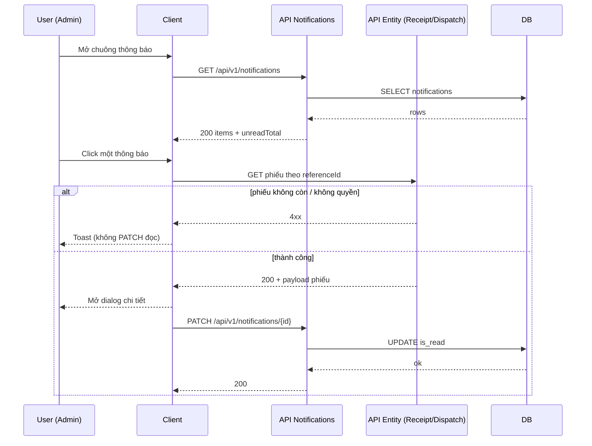

# SRS — Thông báo Admin: mở dialog nghiệp vụ (phiếu nhập / phiếu xuất) — PRD phiên làm việc

> **File (Spring / `smart-erp`):** `backend/docs/srs/SRS_PRD_admin-notifications-entity-dialogs.md`  
> **Người soạn:** Agent BA (theo `backend/AGENTS/BA_AGENT_INSTRUCTIONS.md`)  
> **Ngày:** 02/05/2026  
> **Trạng thái:** `Approved`  
> **PO duyệt:** PO — 02/05/2026 *(§4 OQ đã chốt; §13 sign-off)*

---

## 0. Đầu vào & traceability

| Nguồn | Đường dẫn / ghi chú |
| :--- | :--- |
| PRD / brief (phiên làm việc + trả lời PO) | (1) Dialog giống nghiệp vụ hiện có; (2) ba loại đầu: duyệt phiếu nhập kho, duyệt phiếu xuất kho, thiếu hàng khi xuất kho; (3) toast khi thông báo/phiếu **hết hiệu lực**; (4) có đánh dấu đã đọc; (5) payload **`notificationType` + `referenceType` + `referenceId`** (Option B, phù hợp codebase). |
| Quyết định PO (§4) | **Approved** 02/05/2026: OQ-1 **(a)** enum Flyway; OQ-2 phiếu nhập → Admin only; OQ-3 PATCH sau GET phiếu OK; OQ-4 dialog đầy đủ action. |
| API đã triển khai + tài liệu markdown | `GET`/`PATCH`/`POST mark-all-read` — [`../../smart-erp/src/main/java/com/example/smart_erp/notifications/controller/NotificationsController.java`](../../smart-erp/src/main/java/com/example/smart_erp/notifications/controller/NotificationsController.java); spec: [`../../../frontend/docs/api/API_PRD_notifications_list_mark_read.md`](../../../frontend/docs/api/API_PRD_notifications_list_mark_read.md) |
| FE đang gọi API | [`../../../frontend/mini-erp/src/features/notifications/api/notificationsApi.ts`](../../../frontend/mini-erp/src/features/notifications/api/notificationsApi.ts), [`../../../frontend/mini-erp/src/components/shared/layout/Header.tsx`](../../../frontend/mini-erp/src/components/shared/layout/Header.tsx) |
| Envelope JSON | [`../../../frontend/docs/api/API_RESPONSE_ENVELOPE.md`](../../../frontend/docs/api/API_RESPONSE_ENVELOPE.md) |
| Flyway — bảng `notifications` | [`../../smart-erp/src/main/resources/db/migration/V1__baseline_smart_inventory.sql`](../../smart-erp/src/main/resources/db/migration/V1__baseline_smart_inventory.sql) (§23); mở rộng CHECK [`V31__notifications_add_password_reset_request_type.sql`](../../smart-erp/src/main/resources/db/migration/V31__notifications_add_password_reset_request_type.sql) |
| Gửi thông báo phiếu xuất (hiện trạng) | [`../../smart-erp/src/main/java/com/example/smart_erp/inventory/dispatch/StockDispatchNotifier.java`](../../smart-erp/src/main/java/com/example/smart_erp/inventory/dispatch/StockDispatchNotifier.java), [`OrderLinkedDispatchService`](../../smart-erp/src/main/java/com/example/smart_erp/inventory/dispatch/OrderLinkedDispatchService.java) |
| UI index — dialog nghiệp vụ | [`../../../frontend/mini-erp/src/features/FEATURES_UI_INDEX.md`](../../../frontend/mini-erp/src/features/FEATURES_UI_INDEX.md) — `ReceiptDetailDialog`, `DispatchDetailDialog` |
| UC / DB spec (tham chiếu) | [`../../../frontend/docs/UC/Database_Specification.md`](../../../frontend/docs/UC/Database_Specification.md) — đối chiếu khi SQL Agent bổ sung §10 |

---

## 1. Tóm tắt điều hành

- **Vấn đề:** Người dùng (Admin) xem danh sách thông báo trên Header nhưng **chưa** mở được dialog chi tiết phiếu nhập / phiếu xuất giống luồng nghiệp vụ. Hai tình huống phiếu xuất (**chờ duyệt** vs **thiếu tồn**) hiện dùng chung `SystemAlert` + `StockDispatch` — sau khi triển khai §4, phải tách bằng **`notification_type` riêng** (Flyway).
- **Mục tiêu nghiệp vụ:** Ba loại PRD map ổn định: `StockReceiptPendingApproval` → phiếu nhập; `StockDispatchPendingApproval` / `StockDispatchShortage` → phiếu xuất. Admin **mở đúng dialog** với **đúng id**; **đánh dấu đã đọc chỉ sau khi** API chi tiết phiếu trả thành công (**OQ-3**); nếu phiếu không còn hợp lệ / không quyền → **toast**, **không** PATCH đọc (giữ unread để có thể xử lý sau). Backend **phát** thông báo phiếu nhập chờ duyệt tới **Admin only** (**OQ-2**). Dialog mở từ chuông **cùng đầy đủ hành động** như trên trang Inbound/Dispatch (**OQ-4**).
- **Đối tượng:** User đăng nhập xem thông báo của chính mình qua API; **người nhận** thông báo nghiệp vụ phiếu nhập chờ duyệt: **chỉ Admin** (đồng bộ `findActiveAdminUserIds`). Phiếu xuất chờ duyệt: giữ policy hiện có **Owner + Admin** trừ khi PO mở CR riêng; phiếu xuất thiếu tồn: **Admin** (code hiện tại).

### 1.1 Giao diện Mini-ERP

| Nhãn menu / vùng | Route | Page (export) | Component / vùng chính | File (dưới `frontend/mini-erp/src/features/`) |
| :--- | :--- | :--- | :--- | :--- |
| *(global)* — chuông **Thông báo** trên Header | *(không route riêng)* | *(layout)* | `Header` (dropdown thông báo; **bổ sung** mở dialog theo `referenceType`/`notificationType`) | [`components/shared/layout/Header.tsx`](../../../frontend/mini-erp/src/components/shared/layout/Header.tsx) |
| Nhập kho | `/inventory/inbound` | `InboundPage` | `ReceiptDetailDialog` (reuse khi mở từ thông báo) | [`inventory/pages/InboundPage.tsx`](../../../frontend/mini-erp/src/features/inventory/pages/InboundPage.tsx) |
| Xuất / điều phối | `/inventory/dispatch` | `DispatchPage` | `DispatchDetailDialog` | [`inventory/pages/DispatchPage.tsx`](../../../frontend/mini-erp/src/features/inventory/pages/DispatchPage.tsx) |

**GAP-UI-1:** `FEATURES_UI_INDEX.md` chưa liệt kê feature `notifications/` + `Header` — sau khi PRD triển khai, cập nhật index (hoặc ghi vào appendix UI).

---

## 2. Bóc tách nghiệp vụ (capabilities)

| # | Capability | Kích hoạt bởi | Kết quả mong đợi | Ghi chú |
| :---: | :--- | :--- | :--- | :--- |
| C1 | Liệt kê thông báo của **chính user** đăng nhập | `GET /api/v1/notifications` | `200` + `items` kèm `notificationType`, `referenceType`, `referenceId` | Đã có |
| C2 | Đếm **chưa đọc** toàn tài khoản | Cùng response | `unreadTotal` | Đã có |
| C3 | Đánh dấu **một** thông báo đã đọc | `PATCH /api/v1/notifications/{id}` | `200`; không đổi nội dung nếu đã đọc (idempotent theo row) | Đã có (`forceMarkOwnedAsRead`) |
| C4 | Đánh dấu đọc **tất cả** | `POST /api/v1/notifications/mark-all-read` | `200` | Đã có |
| C5 | **Phát** thông báo “phiếu nhập chờ duyệt” tới **Admin only** | Sự kiện submit phiếu nhập chờ duyệt | INSERT `notifications` với `notification_type = StockReceiptPendingApproval`, `reference_type = StockReceipt`, `reference_id = receipt_id` | **Thiếu** — Dev triển khai |
| C6 | **Phân loại máy** hai kịch bản phiếu xuất | INSERT notifications | `StockDispatchPendingApproval` vs `StockDispatchShortage` + `reference_type = StockDispatch` | **Cần** migration + sửa notifier (thay `SystemAlert` cũ) |
| C7 | Payload cho FE map dialog | Mỗi item list | `notificationType` + `referenceType` + `referenceId` đủ mở `ReceiptDetailDialog` / `DispatchDetailDialog` | Bám Option B PRD |
| C8 | “Hết hiệu lực” khi mở chi tiết | `GET` phiếu nhập/xuất theo id (API hiện có) hoặc thông báo không tồn tại | `404`/`403`/`409` — FE hiển thị **toast** nghiệp vụ, **không** mount dialog | Không bắt buộc endpoint mới nếu FE dùng API phiếu |

---

## 3. Phạm vi

### 3.1 In-scope

- **BE:** Bổ sung phát sinh thông báo phiếu nhập chờ duyệt (C5); migration CHECK + insert `StockDispatchPendingApproval` / `StockDispatchShortage`; notifier phiếu nhập dùng **Admin only**; cập nhật `StockDispatchNotifier` / `OrderLinkedDispatchService`.
- **FE:** Click item → `GET` chi tiết phiếu theo `referenceType`/`referenceId` → nếu **200** mở dialog + **`PATCH` đã đọc**; nếu **4xx** chỉ toast, **không** PATCH (OQ-3).
- **Tài liệu API:** Tạo `frontend/docs/api/API_PRD_notifications_*.md` (hoặc gán TaskXXX) mô tả đủ §8 — **GAP-API-1**.

### 3.2 Out-of-scope (v1 PRD)

- WebSocket / push real-time.
- Màn hình route riêng `/notifications` (có thể v1.1).
- Thay đổi quyền **đọc** thông báo cross-user (global inbox).
- Read-only dialog khi mở từ chuông — **đã loại** theo OQ-4 (dialog đầy đủ hành động).

---

## 4. Câu hỏi làm rõ cho PO (Open Questions — **đã đóng**, archive)

| ID | Câu hỏi | Ảnh hưởng nếu không trả lời | Blocker? |
| :--- | :--- | :--- | :---: |
| **OQ-1** | Phân biệt “chờ duyệt” vs “thiếu tồn” (cùng `StockDispatch`): **(a)** thêm giá trị `notification_type` mới trong CHECK Flyway, **(b)** cột phụ / JSONB, hay **(c)** FE parse `title`? | FE không map ổn định | **Đã đóng** |
| **OQ-2** | Thông báo “phiếu nhập chờ duyệt” gửi **Admin only** hay **Owner + Admin**? | Sai danh sách người nhận | **Đã đóng** |
| **OQ-3** | **PATCH** đã đọc **trước** hay **sau** khi tải phiếu thành công? | UX khi phiếu lỗi | **Đã đóng** |
| **OQ-4** | Dialog từ chuông: **cùng** hành động duyệt/từ chối/sửa như trang nghiệp vụ? | RBAC + audit | **Đã đóng** |

**Trả lời PO (đã chốt):**

| ID | Quyết định PO | Ngày |
| :--- | :--- | :--- |
| **OQ-1** | **Phương án (a)** — bổ sung trên Flyway các giá trị `notification_type`: `StockReceiptPendingApproval`, `StockDispatchPendingApproval`, `StockDispatchShortage` (PascalCase, đồng bộ chuỗi CHECK hiện tại). *Ghi chú BA: bản nháp PO ghi `q`; nếu ý định là (b) hoặc (c), mở CR sửa §9/§10.* | 02/05/2026 |
| **OQ-2** | Thông báo **phiếu nhập chờ duyệt** chỉ gửi tới user có role **Admin** (không gửi Owner). Phiếu xuất **chờ duyệt** giữ cơ chế hiện có **Owner + Admin** (không đổi trong SRS này trừ CR sau). | 02/05/2026 |
| **OQ-3** | **Sau khi** `GET` chi tiết phiếu **thành công** mới gọi `PATCH` đánh dấu đã đọc; nếu tải phiếu lỗi thì **không** PATCH (giữ chưa đọc). | 02/05/2026 |
| **OQ-4** | **Có** — dialog mở từ thông báo cho phép **đầy đủ** thao tác như trên `InboundPage` / `DispatchPage` (Admin thực hiện action trên dialog). | 02/05/2026 |

---

## 5. Phân tích scope tệp & bằng chứng

### 5.1 Tài liệu / mã đã đối chiếu (read)

- `BA_AGENT_INSTRUCTIONS.md`, `SRS_TEMPLATE.md`, `API_RESPONSE_ENVELOPE.md`
- `NotificationsController`, `NotificationsService`, `NotificationJdbcRepository`, `NotificationItemData`, `NotificationsPageData`
- `StockDispatchNotifier`, `OrderLinkedDispatchService`
- FE: `notificationsApi.ts`, `Header.tsx`, `FEATURES_UI_INDEX.md` (inventory)

### 5.2 Mã / migration dự kiến (write / verify)

- **Flyway:** migration mới — `ALTER` CHECK `notifications_notification_type_check` bổ sung: `StockReceiptPendingApproval`, `StockDispatchPendingApproval`, `StockDispatchShortage`; repository method `insert…(notificationType, …)` hoặc tương đương — không hard-code sai loại.
- **Java:** service/submit phiếu nhập (Task014–020 — package inventory receipts) gọi notifier mới; chỉnh `StockDispatchNotifier` / `OrderLinkedDispatchService` để insert đúng `notification_type`.
- **FE:** `Header.tsx` (+ có thể hook `useNotificationEntityDialog` trong `features/notifications/`) import dialog hoặc lift state lên layout; map bảng §9 **BR-MAP**.
- **API markdown:** tạo mới + cập nhật `API_RESPONSE_ENVELOPE` §3.3 nếu thêm mã `error` mới (tránh nếu dùng lỗi sẵn có của API phiếu).

### 5.3 Rủi ro phát hiện sớm

- `reference_id` kiểu **INT** — trùng với giới hạn id phiếu (hiện code đã `Math.toIntExact` cho dispatch). Id phiếu vượt `Integer.MAX_VALUE` sẽ lỗi — ghi nợ kỹ thuật nếu hệ thống lớn.
- Hai thông báo cùng phiếu (duplicate) nếu retry transaction — cần idempotency key hoặc chấp nhận trùng (PO).

---

## 6. Persona & RBAC

| Vai trò | Quyền / điều kiện | HTTP / hành vi khi từ chối |
| :--- | :--- | :--- |
| User đã đăng nhập | `GET`/`PATCH`/`POST mark-all` notifications của **chính mình** (`jwt.sub` = `user_id`) | `401` nếu không JWT (theo controller hiện tại) |
| User khác | Không đọc được `PATCH` thông báo của người khác | `404` “Không tìm thấy thông báo” (đã có) |
| Admin (nghiệp vụ phiếu) | Xem phiếu qua API nhập/xuất nếu RBAC cho phép | `403` theo policy phiếu — FE toast |

**Chốt PO (OQ-2 / OQ-4):** Thông báo **phiếu nhập chờ duyệt** chỉ insert cho **Admin** (`findActiveAdminUserIds`). Thông báo **phiếu xuất chờ duyệt** giữ **Owner + Admin** như `OrderLinkedDispatchService` hiện tại. Dialog từ chuông **không** giảm quyền so với màn nghiệp vụ — kiểm tra JWT/claim giữ nguyên theo API phiếu.

**Ghi chú:** SRS này **không** đổi RBAC list notifications (list theo `user_id` JWT) trừ khi PO mở CR.

---

## 7. Actor & luồng nghiệp vụ

### 7.1 Danh sách actor

| Actor | Mô tả ngắn |
| :--- | :--- |
| Admin / Owner | Người nhận thông báo và mở dialog |
| Client | Mini-ERP SPA |
| API | `smart-erp` — notifications + stock receipts + stock dispatch |
| DB | PostgreSQL — `notifications`, phiếu nhập/xuất |

### 7.2 Luồng chính (narrative)

1. Hệ thống ghi nhận sự kiện nghiệp vụ → INSERT `notifications` với `notification_type` đúng (**§9 BR-MAP**) và `reference_*` tương ứng.  
2. Admin mở chuông → `GET /api/v1/notifications` → hiển thị danh sách.  
3. Admin click một dòng → Client gọi **GET chi tiết phiếu** theo `referenceType` + `referenceId`.  
4. Nếu **thành công** → mở `ReceiptDetailDialog` / `DispatchDetailDialog` (đầy đủ action — OQ-4) → `PATCH /api/v1/notifications/{id}` → refetch → `unreadTotal` cập nhật (OQ-3).  
5. Nếu **thất bại** → toast nghiệp vụ; **không** mở dialog; **không** PATCH (giữ chưa đọc).

### 7.3 Sơ đồ



---

## 8. Hợp đồng HTTP & ví dụ JSON

> **Tham chiếu triển khai:** `NotificationsController`. Giá trị `notificationType` cho ba loại PRD: **`StockReceiptPendingApproval`**, **`StockDispatchPendingApproval`**, **`StockDispatchShortage`** (sau migration Flyway — GAP-BE-2).

### 8.1 Tổng quan endpoint (đã có)

| Thuộc tính | Giá trị |
| :--- | :--- |
| List | `GET /api/v1/notifications` — query: `page` (default 1), `limit` (default 20, max 100), `unreadOnly` (optional `true`) |
| Mark one read | `PATCH /api/v1/notifications/{id}` |
| Mark all read | `POST /api/v1/notifications/mark-all-read` |
| Auth | Bearer JWT (`sub` = user id) |

### 8.2 `GET /api/v1/notifications` — schema `data`

| Field | Kiểu | Mô tả |
| :--- | :--- | :--- |
| `items` | array | Danh sách thông báo |
| `items[].id` | number | id thông báo |
| `items[].notificationType` | string | CHECK DB: gồm các loại legacy (`SystemAlert`, …) và ba loại PRD (**§9**) sau migration |
| `items[].title` | string | Tiêu đề |
| `items[].message` | string | Nội dung |
| `items[].read` | boolean | Đã đọc |
| `items[].referenceType` | string \| null | Vd. `StockDispatch`, `StockReceipt`, `StaffPasswordResetRequest`, … |
| `items[].referenceId` | number \| null | id thực thể (phiếu, …) |
| `items[].createdAt` | string (ISO-8601) | Thời điểm tạo |
| `page` | number | Trang hiện tại |
| `limit` | number | Kích thước trang |
| `total` | number | Tổng (theo filter `unreadOnly`) |
| `unreadTotal` | number | Tổng chưa đọc (mọi trang) |

### 8.3 `GET` — ví dụ JSON thành công (`200`)

```json
{
  "success": true,
  "data": {
    "items": [
      {
        "id": 42,
        "notificationType": "StockDispatchShortage",
        "title": "Phiếu xuất thiếu tồn",
        "message": "PX-2026-000012: SP-A · thiếu 3",
        "read": false,
        "referenceType": "StockDispatch",
        "referenceId": 12,
        "createdAt": "2026-05-02T08:15:30Z"
      },
      {
        "id": 41,
        "notificationType": "StockReceiptPendingApproval",
        "title": "Phiếu nhập chờ duyệt",
        "message": "PN-2026-000007 cần duyệt.",
        "read": true,
        "referenceType": "StockReceipt",
        "referenceId": 7,
        "createdAt": "2026-05-02T07:00:00Z"
      }
    ],
    "page": 1,
    "limit": 20,
    "total": 2,
    "unreadTotal": 1
  },
  "message": "Thành công"
}
```

*(Thêm ví dụ `StockDispatchPendingApproval` trong tài liệu API khi Dev hoàn tất notifier chờ duyệt.)*

### 8.4 `PATCH /api/v1/notifications/{id}` — request

| Field / param | Vị trí | Kiểu | Bắt buộc |
| :--- | :--- | :--- | :---: |
| `id` | path | integer > 0 | Có |

Không có body.

### 8.5 `PATCH` — ví dụ JSON thành công (`200`)

```json
{
  "success": true,
  "data": {},
  "message": "Đã đánh dấu đã đọc"
}
```

### 8.6 `PATCH` — lỗi `404 NOT_FOUND`

```json
{
  "success": false,
  "error": "NOT_FOUND",
  "message": "Không tìm thấy thông báo"
}
```

### 8.7 `POST /api/v1/notifications/mark-all-read` — ví dụ thành công (`200`)

```json
{
  "success": true,
  "data": {},
  "message": "Đã đọc hết"
}
```

### 8.8 `GET` — lỗi validation `400 BAD_REQUEST` (ví dụ `page` < 1)

```json
{
  "success": false,
  "error": "BAD_REQUEST",
  "message": "Dữ liệu không hợp lệ",
  "details": {
    "list.page": "page phải >= 1"
  }
}
```

### 8.9 Ghi chú envelope

- Khớp [`API_RESPONSE_ENVELOPE.md`](../../../frontend/docs/api/API_RESPONSE_ENVELOPE.md).
- **GAP-API-1:** Đã có [`API_PRD_notifications_list_mark_read.md`](../../../frontend/docs/api/API_PRD_notifications_list_mark_read.md) (Draft).

---

## 9. Quy tắc nghiệp vụ (bảng)

| Mã | Điều kiện | Hành động / kết quả |
| :--- | :--- | :--- |
| BR-1 | `referenceType = StockReceipt` và `referenceId` khác null | FE mở `ReceiptDetailDialog` với id đó |
| BR-2 | `referenceType = StockDispatch` và `referenceId` khác null | FE mở `DispatchDetailDialog` với id đó |
| BR-3 | `referenceType` / `referenceId` null (thông báo hệ thống chung) | FE chỉ mark read / không mở dialog nghiệp vụ |
| BR-4 | Hai loại phiếu xuất phân biệt bằng `notification_type` **`StockDispatchPendingApproval`** vs **`StockDispatchShortage`** (cùng `reference_type = StockDispatch`) | Đã chốt OQ-1 **(a)** — migration + notifier |
| BR-5 | Người dùng không có quyền xem phiếu | API phiếu trả `403` — FE toast theo `message` an toàn |

**BR-MAP (FE / contract — bắt buộc sau migration):**

| `notificationType` | `referenceType` | Dialog |
| :--- | :--- | :--- |
| `StockReceiptPendingApproval` | `StockReceipt` | `ReceiptDetailDialog` |
| `StockDispatchPendingApproval` | `StockDispatch` | `DispatchDetailDialog` |
| `StockDispatchShortage` | `StockDispatch` | `DispatchDetailDialog` |

---

## 10. Dữ liệu & SQL tham chiếu (phối hợp Agent SQL)

### 10.1 Bảng / quan hệ (Flyway)

| Bảng | Read / Write | Ghi chú |
| :--- | :--- | :--- |
| `notifications` | R: list/count; W: insert (notifier), update mark read | Cột: `user_id`, `notification_type`, `title`, `message`, `is_read`, `reference_type`, `reference_id`, `created_at`, `read_at` |
| Phiếu nhập / xuất | R (API chi tiết) | FK logic qua `reference_id` — không bắt buộc FK DB tới phiếu |

### 10.2 SQL / ranh giới transaction

```sql
-- Đọc một trang thông báo của user (đã có trong NotificationJdbcRepository.loadPage)
SELECT id, notification_type, title, message, is_read, reference_type, reference_id, created_at
FROM notifications
WHERE user_id = :userId
ORDER BY created_at DESC
LIMIT :limit OFFSET :offset;

-- Đánh dấu đã đọc một bản ghi thuộc user
UPDATE notifications
SET is_read = TRUE, read_at = COALESCE(read_at, CURRENT_TIMESTAMP)
WHERE id = :notificationId AND user_id = :userId;
```

### 10.3 Index & hiệu năng

- Đã có `idx_notif_user_unread` trên `(user_id, is_read)` — đủ cho badge + filter unread.

### 10.4 Kiểm chứng dữ liệu cho Tester

- Tạo phiếu xuất thiếu tồn → Admin khác nhận `StockDispatch` + id đúng.
- Submit phiếu nhập chờ duyệt → nhận `StockReceipt` + id đúng (sau khi Dev triển khai C5).
- `PATCH` id thông báo của user khác → `404`.

---

## 11. Acceptance criteria (Given / When / Then)

```text
Given Admin đã đăng nhập và có ít nhất một thông báo chưa đọc gắn StockReceipt hợp lệ
When Admin mở chuông và bấm vào thông báo đó
Then Client gọi GET phiếu nhập thành công, mở ReceiptDetailDialog, rồi PATCH đánh dấu đã đọc (OQ-3)
  Và unreadTotal giảm sau refetch
```

```text
Given thông báo gắn StockDispatch id không còn tồn tại (đã xóa / sai môi trường)
When Admin bấm mở
Then Client gọi API chi tiết phiếu xuất và nhận 404/403/409
  Và hiển thị toast tiếng Việt nghiệp vụ (không mở dialog, không PATCH đọc)
```

```text
Given hai thông báo cùng StockDispatch nhưng một “chờ duyệt” và một “thiếu tồn”
When BE đã triển khai migration OQ-1 (a)
Then `notificationType` lần lượt là `StockDispatchPendingApproval` và `StockDispatchShortage` và FE mở cùng `DispatchDetailDialog` theo `referenceId`
```

```text
Given nhân viên không phải Admin nhưng có thông báo PasswordResetRequest
When PATCH mark read
Then 200 và không bắt buộc mở dialog phiếu kho
```

---

## 12. GAP & giả định

| GAP / Giả định | Tác động | Hành động đề xuất |
| :--- | :--- | :--- |
| **GAP-API-1** | ~~Thiếu markdown~~ | Đã bổ sung `API_PRD_notifications_list_mark_read.md` (Draft) |
| **GAP-UI-1** | ~~Index~~ | Đã cập nhật `FEATURES_UI_INDEX.md` (chuông + `notifications/`) |
| **GAP-BE-1** | Chưa insert thông báo phiếu nhập chờ duyệt | Dev + test theo C5 |
| **GAP-BE-2** | Code hiện vẫn insert `SystemAlert` cho xuất — chưa khớp **BR-4** | Dev: migration + đổi `StockDispatchNotifier` / `OrderLinkedDispatchService` |
| Giả định | `reference_id` đủ cho id phiếu trong v1 | Ghi nợ nếu chuyển BIGINT |

---

## 13. PO sign-off (chỉ điền khi Approved)

- [x] Đã trả lời / đóng các **OQ** (OQ-1 chuẩn hóa **(a)**; OQ-2–4 đã ghi §4)
- [x] JSON request/response khớp ý đồ sản phẩm (§8; triển khai BE/FE + GAP-API-1)
- [x] Phạm vi In/Out đã đồng ý (§3)

**Chữ ký / nhãn PR:** PO — SRS Approved 02/05/2026
