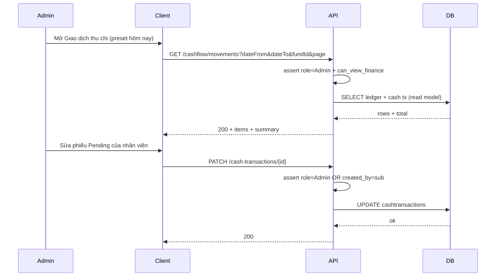

# SRS — PRD: Giao dịch thu chi (Admin, đa quỹ, đồng bộ sổ, mặc định hôm nay)

> **File (Spring / `smart-erp`):** `backend/docs/srs/SRS_PRD_cash-transactions-admin-unified-multi-fund.md`  
> **Người soạn:** Agent BA (theo `backend/AGENTS/BA_AGENT_INSTRUCTIONS.md`)  
> **Ngày:** 02/05/2026  
> **Trạng thái:** `Approved`  
> **PO duyệt (khi Approved):** PO — 02/05/2026

---

## 0. Đầu vào & traceability

| Nguồn | Đường dẫn / ghi chú |
| :--- | :--- |
| PRD / brief (phiên làm việc — chốt PO) | (1) **Ưu tiên persona** `JWT role` = **`Admin`** cho phạm vi mở rộng release này; (2) dữ liệu thu/chi **phải khớp** toàn bộ nghiệp vụ đã ghi **`FinanceLedger`** (đọc thống nhất, không “tách sổ”); (3) trường **`category`** giữ **tự do** (chuỗi, không bắt danh mục master); (4) **nhiều quỹ** (tiền mặt, ngân hàng, …); (5) **mặc định kỳ xem** = **ngày hôm nay** (theo timezone server hoặc OQ). |
| SRS nền (Approved) — thu chi thủ công | [`SRS_Task064-068_cash-transactions-api.md`](SRS_Task064-068_cash-transactions-api.md) — RBAC **`can_view_finance`**; ghi PATCH/DELETE **chỉ người tạo** (**BR-9**, **mở rộng Admin** theo **§0.2** tài liệu đó); POST chỉ `Pending`; hoàn tất → `FinanceLedger` + `finance_ledger_id`. |
| SRS nền — sổ cái | [`SRS_Task063_finance-ledger-get-list.md`](SRS_Task063_finance-ledger-get-list.md) |
| API hiện hành (cần amend / bổ sung) | `API_Task064` … `API_Task068` trong [`../../../frontend/docs/api/`](../../../frontend/docs/api/); `API_Task063` |
| UC / DB | [`../../../frontend/docs/UC/Database_Specification.md`](../../../frontend/docs/UC/Database_Specification.md) §12, §12.1 — `FinanceLedger.reference_type` / `reference_id` |
| Flyway thực tế | [`../../smart-erp/src/main/resources/db/migration/V1__baseline_smart_inventory.sql`](../../smart-erp/src/main/resources/db/migration/V1__baseline_smart_inventory.sql) — `CashTransactions`, `FinanceLedger`; [`V25__task064_068_cash_tx_performed_by_staff_finance.sql`](../../smart-erp/src/main/resources/db/migration/V25__task064_068_cash_tx_performed_by_staff_finance.sql) — `performed_by`, index |
| Envelope | [`../../../frontend/docs/api/API_RESPONSE_ENVELOPE.md`](../../../frontend/docs/api/API_RESPONSE_ENVELOPE.md) |
| UI index | [`../../../frontend/mini-erp/src/features/FEATURES_UI_INDEX.md`](../../../frontend/mini-erp/src/features/FEATURES_UI_INDEX.md) — `cashflow/` |

---

## 1. Tóm tắt điều hành

- **Vấn đề:** Màn **Giao dịch thu chi** hiện chủ yếu phản ánh **`CashTransactions`** (phiếu thủ công); thống kê nhanh trên UI dễ **lệch** vì chỉ tổng theo trang; **chưa** có mô hình **đa quỹ**; các bút toán **tự động** từ bán/mua/… nằm ở **`FinanceLedger`** — PO yêu cầu **một góc nhìn nghiệp vụ khớp toàn bộ** và ưu tiên vận hành bởi **Admin**.
- **Mục tiêu nghiệp vụ:** Admin (và sau này các role khác nếu mở) xem **dòng tiền trong ngày mặc định** gồm cả **phiếu thủ công** và **bút toán sổ cái**; lập phiếu thủ công gắn **quỹ**; tổng thu/chi/số dư **theo bộ lọc kỳ + quỹ**, không chỉ theo trang; **`category`** nhập **tự do** (giữ giới hạn độ dài như hiện tại).
- **Đối tượng:** **`GET /api/v1/cashflow/movements`** — **chỉ** user JWT **`role` = `Admin`** (và `can_view_finance` nếu vẫn kiểm tra module). **Cấu hình quỹ** (`POST`/`PATCH /cash-funds`) — **chỉ Admin**. **`GET /api/v1/cash-funds`** (đọc danh sách để chọn quỹ) — **`can_view_finance`** (đồng bộ **§4.1** với OQ-6 bắt buộc `fundId`). **PATCH/DELETE** phiếu người khác tạo — **Admin** theo **BR-3** / **GAP-1** (đã chấp nhận §13).

### 1.1 Giao diện Mini-ERP

| Nhãn menu (Sidebar) | Route | Page (export) | Component / vùng chính | File (dưới `frontend/mini-erp/src/features/`) |
| :--- | :--- | :--- | :--- | :--- |
| Giao dịch thu chi (nhóm Thu chi) | `/cashflow/transactions` | `TransactionsPage` | `TransactionToolbar`, `TransactionTable`, `TransactionFormDialog`, `TransactionDetailDialog` | `cashflow/pages/TransactionsPage.tsx` |
| Sổ cái tài chính | `/cashflow/ledger` | `LedgerPage` | Drill-down từ movement → ledger / chứng từ (khi FE wire) | `cashflow/pages/LedgerPage.tsx` |

**UI GAP (ghi nhận):** Toolbar chưa có **chọn quỹ** + **mặc định ngày hôm nay** + nguồn **thống nhất** (`/cashflow/movements`) — cần wire theo API khi có `API_Task*` / bridge tương ứng.

---

## 2. Bóc tách nghiệp vụ (capabilities)

| # | Capability | Kích hoạt bởi | Kết quả mong đợi | Ghi chú |
| :---: | :--- | :--- | :--- | :--- |
| C1 | Đọc **danh sách quỹ** | `GET /api/v1/cash-funds` (mới) | `200` + danh sách quỹ active | **`can_view_finance`**; **mutate** quỹ (`POST`/`PATCH`) — **chỉ Admin** — **§4.1** |
| C2 | **Tạo / vô hiệu hóa** quỹ | `POST` / `PATCH` quỹ (mới) | `201` / `200` | Migration bảng master quỹ — §10 |
| C3 | **Liệt kê dòng tiền thống nhất** trong kỳ | `GET /api/v1/cashflow/movements` (mới) | `200` + `items` đã sort, phân trang, discriminator `sourceKind` | Hợp nhất **ít nhất**: hàng `FinanceLedger` + phiếu `CashTransactions` (mọi trạng thái hiển thị theo BR); **chỉ Admin** gọi endpoint — **OQ-1 đã chốt** |
| C4 | Lọc mặc định **ngày hôm nay** | Query `dateFrom`/`dateTo` | Khi **thiếu cả hai** query → server gán `dateFrom` = `dateTo` = **ngày hiện tại** theo clock DB (**OQ-4 đã chốt**) | Timezone: **server local / DB date** — mở CR nếu cần timezone cửa hàng |
| C5 | Lọc **theo quỹ** | Query `fundId` trên movements | Áp dụng trên cả dòng có `fund_id` sau **OQ-5** | **`FinanceLedger.fund_id`** backfill + gán mặc định khi insert tự động |
| C6 | **Tổng hợp** thu/chi/số dư theo filter (không chỉ trang) | `GET …/movements/summary` (mới, tùy chọn) **hoặc** meta trong list | `200` + `totalIncome`, `totalExpense`, `net` | Tránh FE cộng 20 dòng; khớp PRD |
| C7 | **POST** phiếu thủ công có `fundId` | `POST /api/v1/cash-transactions` (amend body) | `201` | **`fundId` bắt buộc** — **OQ-6 đã chốt**; thiếu → **400** |
| C8 | **PATCH / DELETE** phiếu thủ công | Task067/068 | Admin được **ghi** lên phiếu **do người khác tạo** khi thỏa BR — **supersede một phần** SRS064–068 §6 | **GAP-1** so với SRS Approved |
| C9 | **Không** sửa/xóa bản ghi `FinanceLedger` đã tồn tại | Mọi endpoint | Giữ immutability Task063 / DB spec | Chỉ **xem / drill** |
| C10 | Phiếu **Pending** / **Cancelled** | Hiển thị trong movements | Trạng thái rõ; Completed đã có ledger line (tránh double nếu join) — **BR-3** | |
| C11 | **Category** tự do | POST/PATCH | Validate độ dài + trim; **không** FK danh mục | **OQ-7 đã chốt:** nới cột **`category`** tối thiểu **`VARCHAR(500)`** (hoặc `TEXT` nếu SQL Agent đề xuất) |

---

## 3. Phạm vi

### 3.1 In-scope

- Thiết kế **bổ sung / amend** để đáp ứng PRD: **đa quỹ**, **read model thống nhất** với `FinanceLedger`, **mặc định kỳ hôm nay**, **Admin-first** cho cấu hình quỹ và quyền ghi đặc biệt trên phiếu thủ công.
- Migration mới: bảng master **quỹ** + FK từ `cashtransactions` (tên vật lý Flyway: `cashtransactions` — §10).
- API mới / mở rộng: xem §8; cập nhật `API_Task064`–`065`–`067`–`068` và thêm file `API_Task*` cho quỹ + movements (sau khi API Agent/PM gán số).

### 3.2 Out-of-scope

- Sửa nội dung / xóa dòng **`FinanceLedger`** đã post (giữ nguyên).
- Import CSV, đối soát ngân hàng file, đa tenant / multi-store (trừ khi PO mở OQ riêng).
- Thay đổi luồng sinh ledger từ **SalesOrder** / **StockReceipt** / … (chỉ **đọc** phục vụ movements).

---

## 4. Câu hỏi làm rõ cho PO (Open Questions)

| ID | Câu hỏi | Ảnh hưởng nếu không trả lời | Blocker? |
| :--- | :--- | :--- | :---: |
| **OQ-1** | User **Owner** / **Staff** có `can_view_finance` có được xem **`/cashflow/movements`** giống Admin hay **chỉ Admin** trong release đầu? | RBAC §6 không chốt | **Đã đóng** |
| **OQ-2** | **`GET /cash-funds`**: mở cho mọi ai có `can_view_finance` hay **chỉ Admin**? | FE ẩn/hiện dropdown quỹ | **Đã đóng** (xem **§4.1**) |
| **OQ-3** | Unified feed: **một endpoint** `GET /cashflow/movements` hay **ghép ở FE** từ Task064 + Task063? | Kiến trúc + caching | **Đã đóng** |
| **OQ-4** | Mặc định “hôm nay”: **server** tự gán khi thiếu query hay **bắt buộc client** gửi `dateFrom`/`dateTo`? | Khác nhau khi cache CDN / timezone | **Đã đóng** |
| **OQ-5** | Bút toán **tự động** trong `FinanceLedger` **chưa** có `fund_id`: hiển thị ở **“Tất cả quỹ”** only, hay PO chấp nhận **backfill** quỹ mặc định (vd. Tiền mặt)? | UX lọc theo quỹ | **Đã đóng** |
| **OQ-6** | `fundId` trên POST phiếu thủ công: **bắt buộc** hay optional với default = quỹ **mặc định** của cửa hàng? | Validation 400 | **Đã đóng** |
| **OQ-7** | Giữ **`category` 100 ký tự** hay nới rộng cho PRD “tự do” dài hơn? | Migration | **Đã đóng** |

**Trả lời PO (đã chốt — 02/05/2026):**

| ID | Quyết định PO | Ngày |
| :--- | :--- | :--- |
| **OQ-1** | Chỉ user có **`role` = `Admin`** được gọi **`GET /api/v1/cashflow/movements`** (Owner/Staff dù có `can_view_finance` → **403**). | 02/05/2026 |
| **OQ-2** | PO ghi *«Chỉ ADMIN»* — **đồng bộ kỹ thuật (§4.1):** **`POST` / `PATCH /api/v1/cash-funds`** chỉ **Admin**; **`GET /api/v1/cash-funds`** mở cho **`can_view_finance`** để mọi role được phép lập phiếu thủ công vẫn chọn **`fundId`** (OQ-6 bắt buộc). | 02/05/2026 |
| **OQ-3** | **Một endpoint riêng** `GET /api/v1/cashflow/movements`. | 02/05/2026 |
| **OQ-4** | **Server** tự gán `dateFrom` = `dateTo` = **hôm nay** khi client **không** gửi cả hai tham số. | 02/05/2026 |
| **OQ-5** | **Tự động:** thêm **`fund_id`** trên `financeledger` (nullable → backfill **quỹ mặc định** `is_default = true`), các luồng **INSERT** ledger tự động gán `fund_id` mặc định nếu chưa chỉ định. | 02/05/2026 |
| **OQ-6** | **`fundId` bắt buộc** trên `POST /api/v1/cash-transactions`. | 02/05/2026 |
| **OQ-7** | **Nới** độ dài **`category`** tối thiểu **`VARCHAR(500)`** (Flyway `ALTER` + validation BE/FE đồng bộ). | 02/05/2026 |

### 4.1 Ghi chú đồng bộ BA — OQ-2 vs OQ-6

Một **`GET /cash-funds` chỉ Admin** nghĩa đen sẽ khiến Staff không tải được danh sách quỹ trong khi **`fundId` bắt buộc** — mâu thuẫn vận hành. **Chốt SRS:** tách **đọc** (dropdown) vs **ghi** (tạo/sửa/deactivate quỹ): bảng §6.

---

## 5. Phân tích scope tệp & bằng chứng (Evidence scope)

### 5.1 Tài liệu đã đối chiếu (read)

- `BA_AGENT_INSTRUCTIONS.md`; `SRS_TEMPLATE.md`; PRD bullet (phiên chat); `SRS_Task064-068_cash-transactions-api.md`; `SRS_Task063_finance-ledger-get-list.md`; `Database_Specification.md` §12; Flyway **V1** (`CashTransactions`, `FinanceLedger`), **V25**; `API_RESPONSE_ENVELOPE.md`; `FEATURES_UI_INDEX.md`.

### 5.2 Mã / migration dự kiến (write / verify)

- **Flyway mới:** bảng `cash_funds`, seed ít nhất **Tiền mặt** (`is_default=true`) + **Ngân hàng**; `ALTER cashtransactions ADD fund_id INT NOT NULL` FK → `cash_funds`; `ALTER financeledger ADD fund_id INT NULL REFERENCES cash_funds(id)` + **UPDATE** backfill quỹ mặc định; mọi **INSERT** ledger tự động gán `fund_id` (mặc định nếu thiếu); `ALTER … ALTER COLUMN category TYPE VARCHAR(500)` (hoặc tương đương PostgreSQL) + validation BE.
- **Java:** `CashFundsController` + service/repository; service **movements** đọc `FinanceLedger` + `CashTransactions` (JOIN users nếu cần hiển thị); amend `CashTransactionService` / repository cho `fundId` + rule Admin (**GAP-1**).
- **RBAC:** kiểm tra `Jwt` claim `role` = `Admin` (chuỗi khớp `Roles.name` trong DB) cho endpoint quỹ và cho **nới quyền** PATCH/DELETE phiếu thủ công.
- **FE:** `TransactionsPage.tsx`, `cashTransactionsApi.ts`, component toolbar (preset ngày, chọn quỹ); có thể thêm page hoặc tab “Dòng tiền” — quyết định UI trong ticket FE.
- **API markdown:** tạo/cập nhật file dưới `frontend/docs/api/` (movements, cash-funds, amend Task064–065).

### 5.3 Rủi ro phát hiện sớm

- **Double counting:** một `CashTransaction` **Completed** vừa có dòng ledger — movements phải **một trong hai** nguồn hiển thị (ưu tiên hiển thị **ledger line** + link ngược phiếu, **hoặc** chỉ hiển thị phiếu — **BR-3**).
- ~~**Mâu thuẫn SRS064–068**~~ — **GAP-1** đã được PO chấp nhận qua **§13**; cần cập nhật chéo [`SRS_Task064-068_cash-transactions-api.md`](SRS_Task064-068_cash-transactions-api.md) **§0.2 / §6**.

---

## 6. Persona & RBAC

| Vai trò / điều kiện | `GET /cashflow/movements` | `GET /cash-funds` | `POST` / `PATCH /cash-funds` | `GET/POST/PATCH/DELETE` `/cash-transactions` (Task064–068) |
| :--- | :--- | :--- | :--- | :--- |
| Chưa JWT | 401 | 401 | 401 | 401 |
| `can_view_finance` = false | 403 | 403 | 403 | 403 |
| **Owner / Staff** (`can_view_finance` = true, `role` ≠ Admin) | **403** | **200** | **403** | Theo **SRS_Task064-068** (GET 200; POST 201; PATCH/DELETE **chỉ người tạo** → 403 nếu không phải người tạo) |
| **`role` = `Admin`** + `can_view_finance` | **200** | **200** | **200** / **201** | **200** / **201**; PATCH/DELETE phiếu thủ công: **người tạo HOẶC Admin** nếu thỏa BR (**BR-3**, **GAP-1**) |

`message` 403 (không đủ quyền module): *Bạn không có quyền thực hiện thao tác này.*  
`message` 403 (non-Admin gọi **movements**): *Bạn không có quyền thực hiện thao tác này.*  
`message` 403 (không phải người tạo — **non-Admin** trên PATCH/DELETE cash-tx): *Chỉ người tạo phiếu mới được thực hiện thao tác này.*  
`message` 403 (non-Admin **POST/PATCH quỹ**): *Chỉ quản trị viên mới được thực hiện thao tác này.*

---

## 7. Actor & luồng nghiệp vụ

### 7.1 Danh sách actor

| Actor | Mô tả ngắn |
| :--- | :--- |
| Admin | Người vận hành PRD — cấu hình quỹ, xem dòng tiền thống nhất, chỉnh/sửa phiếu thủ công theo policy |
| Client | Mini-ERP |
| API | `smart-erp` |
| DB | PostgreSQL — `cashtransactions`, `financeledger`, `cash_funds` (mới) |

### 7.2 Luồng chính (narrative) — tải màn ngày hôm nay

1. Client gửi `GET /api/v1/cashflow/movements?…` (có thể **bỏ** `dateFrom`/`dateTo` → server gán **hôm nay** — **OQ-4**).  
2. API xác thực JWT, assert **`role` = `Admin`** và `can_view_finance`.  
3. API đọc DB: union/read-model từ `FinanceLedger` + `CashTransactions` theo **BR-1** / **BR-2**, sort theo ngày nghiệp vụ giảm dần.  
4. Trả `200` + `items` + meta phân trang + **`summary`** (bắt buộc trong phạm vi PRD — **C6**).

### 7.3 Sơ đồ



---

## 8. Hợp đồng HTTP & ví dụ JSON

> **Ghi chú:** Đây là **hợp đồng đích** cho các Task API mới / amend — chưa có file `API_Task*` đến khi API Agent sinh spec chi tiết. Shape bám [`API_RESPONSE_ENVELOPE.md`](../../../frontend/docs/api/API_RESPONSE_ENVELOPE.md).

### 8.1 Tổng quan endpoint (đề xuất)

| Thuộc tính | Giá trị |
| :--- | :--- |
| `GET /api/v1/cash-funds` | Auth Bearer; đọc danh sách quỹ |
| `POST /api/v1/cash-funds` | Bearer; **`role` = Admin** |
| `PATCH /api/v1/cash-funds/{id}` | Bearer; **Admin** (vd. `isActive`) |
| `GET /api/v1/cashflow/movements` | Bearer; **`role` = Admin** + `can_view_finance`; query: `dateFrom?`, `dateTo?` (mặc định server: hôm nay), `fundId?`, `search?`, `page`, `limit` |
| `GET /api/v1/cashflow/movements/summary` | **Đã gộp** vào `data.summary` của response list (**C6**); không bắt buộc endpoint riêng |
| Amend | `POST/PATCH /api/v1/cash-transactions` thêm body/query **`fundId`** |

### 8.2 `GET /api/v1/cash-funds` — schema (logic)

| Field | Vị trí | Kiểu | Bắt buộc | Ghi chú |
| :--- | :--- | :--- | :---: | :--- |
| — | — | — | — | Không query; hoặc `includeInactive` boolean — OQ |

### 8.3 `GET /api/v1/cash-funds` — response **200** (ví dụ đầy đủ)

```json
{
  "success": true,
  "data": {
    "items": [
      {
        "id": 1,
        "code": "CASH",
        "name": "Tiền mặt quỹ chính",
        "isDefault": true,
        "isActive": true
      },
      {
        "id": 2,
        "code": "BANK-001",
        "name": "TK ngân hàng A",
        "isDefault": false,
        "isActive": true
      }
    ]
  },
  "message": "Thao tác thành công"
}
```

### 8.4 `POST /api/v1/cash-funds` — request body (ví dụ đầy đủ)

```json
{
  "code": "E-WALLET-01",
  "name": "Ví điện tử M",
  "isDefault": false
}
```

### 8.5 `POST /api/v1/cash-funds` — response **201**

```json
{
  "success": true,
  "data": {
    "id": 3,
    "code": "E-WALLET-01",
    "name": "Ví điện tử M",
    "isDefault": false,
    "isActive": true
  },
  "message": "Đã tạo quỹ"
}
```

### 8.6 `GET /api/v1/cashflow/movements` — query (logic)

| Param | Kiểu | Bắt buộc | Validation |
| :--- | :--- | :---: | :--- |
| `dateFrom` | string `YYYY-MM-DD` | Không | Nếu **cả** `dateFrom` và `dateTo` đều absent → server set cả hai = **ngày hiện tại**; nếu chỉ một bên → **400** hoặc coi thiếu = cùng ngày còn lại — **Dev chọn một hành vi**, ghi rõ trong `API_Task*` |
| `dateTo` | string `YYYY-MM-DD` | Không | ≥ `dateFrom` sau khi gán mặc định |
| `fundId` | integer | Không | Lọc theo `fund_id`; absent = **mọi quỹ** (sau OQ-5 mọi dòng ledger có `fund_id`) |
| `page`, `limit` | integer | Không | Giống Task064 |

### 8.7 `GET /api/v1/cashflow/movements` — response **200** (ví dụ đầy đủ)

```json
{
  "success": true,
  "data": {
    "items": [
      {
        "id": "ledger:901",
        "sourceKind": "Ledger",
        "transactionDate": "2026-05-02",
        "amount": 1500000,
        "direction": "Income",
        "description": "Doanh thu bán lẻ — SO-2026-0042",
        "referenceType": "SalesOrder",
        "referenceId": 42,
        "fundId": 1,
        "fundCode": "CASH",
        "cashTransactionId": null,
        "status": null,
        "category": null
      },
      {
        "id": "cash:17",
        "sourceKind": "CashTransaction",
        "transactionDate": "2026-05-02",
        "amount": 200000,
        "direction": "Expense",
        "description": "Mua văn phòng phẩm",
        "referenceType": null,
        "referenceId": null,
        "fundId": 1,
        "fundCode": "CASH",
        "cashTransactionId": 17,
        "status": "Pending",
        "category": "Chi văn phòng"
      }
    ],
    "page": 1,
    "limit": 20,
    "total": 2,
    "summary": {
      "totalIncome": 1500000,
      "totalExpense": 200000,
      "net": 1300000
    }
  },
  "message": "Thao tác thành công"
}
```

### 8.8 `POST /api/v1/cash-transactions` — **bổ sung** field (ví dụ body đầy đủ)

```json
{
  "direction": "Expense",
  "amount": 200000,
  "category": "Chi văn phòng",
  "transactionDate": "2026-05-02",
  "paymentMethod": "Cash",
  "description": "Mua văn phòng phẩm",
  "fundId": 1
}
```

### 8.9 Response lỗi — ví dụ JSON đầy đủ

**400 — validation**

```json
{
  "success": false,
  "error": "BAD_REQUEST",
  "message": "Ngày bắt đầu không được sau ngày kết thúc.",
  "details": {
    "fields": ["dateFrom", "dateTo"]
  }
}
```

**403 — không đủ quyền tài chính**

```json
{
  "success": false,
  "error": "FORBIDDEN",
  "message": "Bạn không có quyền thực hiện thao tác này.",
  "details": {}
}
```

**403 — non-Admin sửa phiếu người khác (giữ BR-9)**

```json
{
  "success": false,
  "error": "FORBIDDEN",
  "message": "Chỉ người tạo phiếu mới được thực hiện thao tác này.",
  "details": {}
}
```

**404 — quỹ / giao dịch**

```json
{
  "success": false,
  "error": "NOT_FOUND",
  "message": "Không tìm thấy quỹ được chọn.",
  "details": {}
}
```

**400 — thiếu `fundId` (POST cash-transactions, OQ-6)**

```json
{
  "success": false,
  "error": "BAD_REQUEST",
  "message": "Vui lòng chọn quỹ cho giao dịch.",
  "details": {
    "fields": ["fundId"]
  }
}
```

### 8.10 Ghi chú envelope

- Dùng `success` / `data` / `message` / `error` / `details` như [`API_RESPONSE_ENVELOPE.md`](../../../frontend/docs/api/API_RESPONSE_ENVELOPE.md).  
- **`id` dạng string** trong movements (`ledger:` / `cash:`) là **gợi ý** — Dev có thể chọn integer + `sourceKind` riêng miễn **ổn định** và document trong `API_Task*`.

---

## 9. Quy tắc nghiệp vụ (bảng)

| Mã | Điều kiện | Hành động / kết quả |
| :--- | :--- | :--- |
| BR-1 | `CashTransaction.status = Completed` và đã có `finance_ledger_id` | Trong feed **movements**: **không** nhân đôi với dòng `FinanceLedger` cùng bút toán — chỉ hiển thị **một** dòng nguồn chân lý (ưu tiên **Ledger** + `cashTransactionId` optional) |
| BR-2 | `CashTransaction` Pending / Cancelled | Hiển thị trong movements với `sourceKind = CashTransaction`; **không** có dòng ledger tương ứng |
| BR-3 | Admin **PATCH/DELETE** phiếu thủ công | Được phép khi **`role` = Admin`** và cùng điều kiện trạng thái như Task067/068 (Pending/Cancelled rule, không xóa Completed đã ghi sổ) |
| BR-4 | `category` | Chuỗi tự do sau trim; tối đa **500** ký tự (migration + validation đồng bộ **OQ-7**) |
| BR-5 | Quỹ inactive | Không cho chọn trên POST phiếu mới; phiếu cũ vẫn hiển thị read-only mã quỹ |
| BR-6 | `GET /cashflow/movements` | **`role` = Admin** bắt buộc (kèm `can_view_finance`) |

---

## 10. Dữ liệu & SQL tham chiếu (phối hợp Agent SQL)

> BA giữ owner mục; **SQL Agent** bổ sung DDL chi tiết, index, transaction boundary.

### 10.1 Bảng / quan hệ (tên logic — chờ Flyway)

| Bảng | Read / Write | Ghi chú |
| :--- | :--- | :--- |
| `cash_funds` (mới) | **R:** `can_view_finance`; **W (POST/PATCH):** chỉ **Admin** — **§4.1** | `code` unique case-insensitive hoặc upper — PO/Dev |
| `cashtransactions` | R + W | Thêm **`fund_id`** FK → `cash_funds` |
| `financeledger` | R + **W** trên insert từ module nghiệp vụ | Thêm **`fund_id`**; backfill + gán mặc định — **OQ-5 đã chốt** |

### 10.2 SQL / ranh giới transaction

```sql
-- placeholder — SQL Agent điền: seed quỹ mặc định, ALTER cashtransactions,
-- index (transaction_date, fund_id), query movements (CTE union) tránh double BR-1.
SELECT 1;
```

### 10.3 Index & hiệu năng

- Index gợi ý: `(transaction_date DESC, fund_id)` trên `cashtransactions`; reuse `idx_finance_date` trên ledger; composite theo kết quả EXPLAIN.

### 10.4 Kiểm chứng dữ liệu cho Tester

- Seed: ít nhất 2 quỹ; vài phiếu thủ công gắn quỹ khác nhau; vài dòng ledger từ SO/SR.  
- So sánh tổng **summary** movements với tổng thủ công + ledger **không** double; sau backfill **mọi** dòng ledger seed có **`fund_id`**.

---

## 11. Acceptance criteria (Given / When / Then)

```text
Given user có can_view_finance (Admin hoặc Staff)
When GET /api/v1/cash-funds
Then 200 và items có ít nhất một quỹ active, trong đó một quỹ isDefault=true
```

```text
Given ngày hệ thống 2026-05-02 và có dữ liệu ledger + cash tx trong ngày
When GET /api/v1/cashflow/movements với dateFrom=2026-05-02 và dateTo=2026-05-02
Then 200, mỗi bút toán Completed chỉ xuất hiện một lần theo BR-1, summary.net = totalIncome - totalExpense
```

```text
Given phiếu cash Pending do Staff A tạo và Admin B đăng nhập
When Admin PATCH hợp lệ theo Task067
Then 200 (GAP-1 đã triển khai); Staff B (không phải Admin) PATCH cùng phiếu Then 403
```

```text
Given non-Admin không có quyền Admin
When POST /api/v1/cash-funds
Then 403 và message chỉ quản trị viên
```

```text
Given POST cash-transactions thiếu fundId khi PO đã chốt OQ-6 bắt buộc
When POST
Then 400 và message nêu rõ cần chọn quỹ
```

```text
Given Staff có can_view_finance nhưng role không phải Admin
When GET /api/v1/cashflow/movements
Then 403
```

```text
Given Staff có can_view_finance
When GET /api/v1/cash-funds
Then 200 và có thể chọn quỹ cho POST cash-transactions
```

---

## 12. GAP & giả định

| GAP / Giả định | Tác động | Hành động đề xuất |
| :--- | :--- | :--- |
| **GAP-1** | SRS064–068 **Approved** quy định PATCH/DELETE **chỉ người tạo** | **Đã chấp nhận** (§13): Admin được ngoại lệ; cập nhật [`SRS_Task064-068_cash-transactions-api.md`](SRS_Task064-068_cash-transactions-api.md) **§0.2 / §6** |
| **GAP-2** | Chưa có `API_Task*` cho `cash-funds` / `cashflow/movements` | API Agent sinh spec + bridge |
| **GAP-3** | ~~`FinanceLedger` chưa có `fund_id`~~ | **Đã chốt OQ-5** — triển khai cột + backfill trong Flyway |

---

## 13. PO sign-off (chỉ điền khi Approved)

- [x] Đã trả lời / đóng các **OQ** (§4), gồm blocker **OQ-1**, **OQ-3**
- [x] JSON request/response khớp ý đồ sản phẩm
- [x] Phạm vi In/Out đã đồng ý; **GAP-1** (amend BR-9 cho Admin) đã chấp nhận

**Chữ ký / nhãn PR:** PO — 02/05/2026
