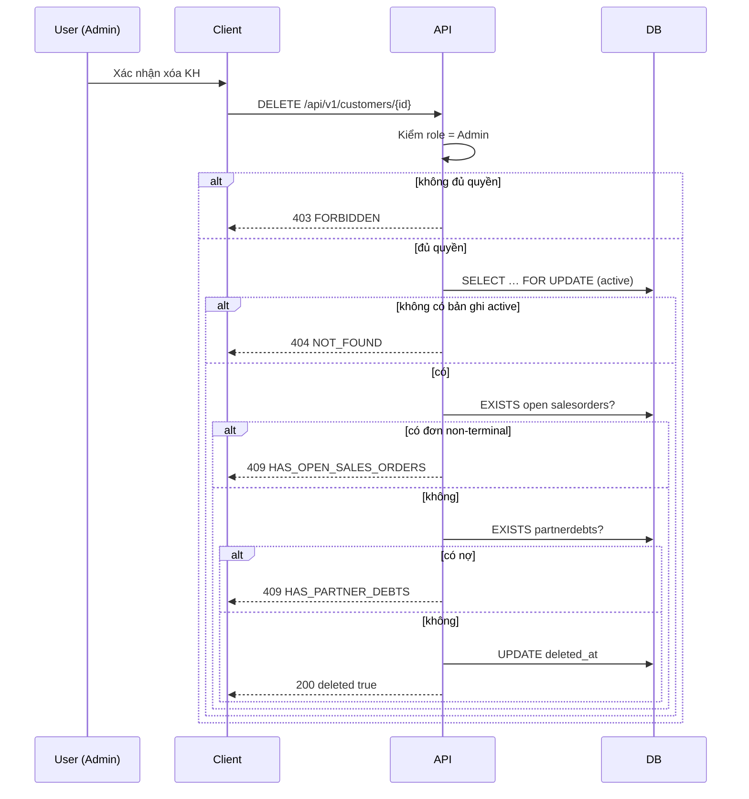

# SRS — Xóa mềm khách hàng (Admin, đơn lẻ, điều kiện đơn mở) — PRD bổ sung Task052

> **File (Spring / `smart-erp`):** `backend/docs/srs/SRS_PRD_customers-admin-soft-delete-single.md`  
> **Người soạn:** Agent BA (theo `backend/AGENTS/BA_AGENT_INSTRUCTIONS.md`)  
> **Ngày:** 02/05/2026  
> **Trạng thái:** `Approved`  
> **PO duyệt:** PO — 02/05/2026 *(amendment Task052; §13 sign-off)*

---

## 0. Đầu vào & traceability

| Nguồn | Đường dẫn / ghi chú |
| :--- | :--- |
| PRD / brief (phiên làm việc) | Chốt PO: (1) chỉ **role Admin** xóa; (2) chặn khi còn đơn **chưa hoàn tất**; (3) không khôi phục; (4) không cho trùng `customer_code` với bản đã xóa mềm; (5) chỉ **xoá từng bản ghi** (không mở rộng bulk cho Admin trong story). |
| SRS nền (đã **amend** mục Task052 đơn — vẫn Approved) | [`SRS_Task048-053_customers-management.md`](SRS_Task048-053_customers-management.md) — §0.2 + C6 + §6 footnote đồng bộ với tài liệu này. |
| API Task052 (đã đồng bộ bản Draft spec) | [`../../../frontend/docs/api/API_Task052_customers_delete.md`](../../../frontend/docs/api/API_Task052_customers_delete.md) |
| API nhóm KH (list/get/patch — lọc `deleted_at`) | `API_Task048` … `API_Task051` trong [`../../../frontend/docs/api/`](../../../frontend/docs/api/) |
| Envelope | [`../../../frontend/docs/api/API_RESPONSE_ENVELOPE.md`](../../../frontend/docs/api/API_RESPONSE_ENVELOPE.md) |
| UC / DB tham chiếu | [`../../../frontend/docs/UC/Database_Specification.md`](../../../frontend/docs/UC/Database_Specification.md) §4 — **đối chiếu Flyway** |
| Flyway thực tế | [`../../smart-erp/src/main/resources/db/migration/V1__baseline_smart_inventory.sql`](../../smart-erp/src/main/resources/db/migration/V1__baseline_smart_inventory.sql) — bảng `Customers` / thực thi PostgreSQL **`customers`**: `customer_code` **UNIQUE**, quan hệ `salesorders.customer_id`, `partnerdebts.customer_id` (**RESTRICT**) |
| Seed trạng thái đơn (tham chiếu domain) | [`../../smart-erp/src/main/resources/db/migration/V21__seed_sales_orders_wholesale_60.sql`](../../smart-erp/src/main/resources/db/migration/V21__seed_sales_orders_wholesale_60.sql) — `status` ∈ `Pending`, `Processing`, `Partial`, `Shipped`, `Delivered`, `Cancelled` |
| UI index | [`../../../frontend/mini-erp/src/features/FEATURES_UI_INDEX.md`](../../../frontend/mini-erp/src/features/FEATURES_UI_INDEX.md) |

---

## 1. Tóm tắt điều hành

- **Vấn đề:** SRS/API Task052 hiện mô tả **xóa cứng** và **chỉ Owner**; PRD yêu cầu **xóa mềm**, **chỉ Admin**, và chỉ chặn khi còn đơn **chưa hoàn tất** (trạng thái non-terminal). Cần SRS backend đo được để Dev/SQL/PM triển khai và **sửa đổi có kiểm soát** tài liệu Task052 + mâu thuẫn với **OQ-1(a)** đã Approved trong Task048–053.
- **Mục tiêu nghiệp vụ:** Admin có thể **ẩn** khách hàng khỏi vận hành hàng ngày (soft delete) mà vẫn giữ dòng DB phục vụ toàn vẹn FK; không cho xóa mềm khi còn đơn đang xử lý; không tái sử dụng mã KH đã gắn bản ghi đã xóa mềm; không cung cấp khôi phục.
- **Đối tượng:** User JWT có **`role` = `Admin`** (claim chuẩn hóa theo token hiện hành — xem §6); các role khác **không** được gọi `DELETE` thành công.

### 1.1 Giao diện Mini-ERP

| Nhãn menu (Sidebar) | Route | Page (export) | Component / vùng chính | File (dưới `frontend/mini-erp/src/features/`) |
| :--- | :--- | :--- | :--- | :--- |
| Khách hàng | `/products/customers` | `CustomersPage` | `CustomerTable` (nút xóa + xác nhận), `CustomerDetailDialog` (nếu có thao tác xóa), `ConfirmDialog` | `product-management/pages/CustomersPage.tsx` |

*(Khớp `FEATURES_UI_INDEX.md` — nhóm `product-management/` — Khách.)*

---

## 2. Bóc tách nghiệp vụ (capabilities)

| # | Capability | Kích hoạt bởi | Kết quả mong đợi | Ghi chú |
| :---: | :--- | :--- | :--- | :--- |
| C1 | Xác thực quyền xóa | `DELETE /api/v1/customers/{id}` + Bearer | `403` nếu `role` ≠ **Admin** | Đã amend [`SRS_Task048-053`](SRS_Task048-053_customers-management.md) §0.2 — Task052 đơn **Admin-only** |
| C2 | Khóa bản ghi & kiểm tồn tại “đang hoạt động” | DELETE | `404` nếu không có dòng `customers` với `id` và **`deleted_at IS NULL`** | GET list/detail đồng bộ filter |
| C3 | Chặn nếu còn **đơn chưa hoàn tất** | DELETE | `409` + `details.reason` = **`HAS_OPEN_SALES_ORDERS`** | Định nghĩa §9 **BR-2** |
| C4 | Chặn nếu còn **công nợ đối tác** | DELETE | `409` + **`HAS_PARTNER_DEBTS`** | Giữ toàn vẹn như SRS gốc — **BR-3** |
| C5 | Thực hiện **soft delete** | DELETE thành công | `200` + `{ id, deleted: true }` | `UPDATE customers SET deleted_at = now()` — **không** cột `deleted_by` (**OQ-1** đã chốt) |
| C6 | Ẩn KH đã xóa mềm khỏi read API thông thường | `GET` list / `GET` by id / aggregates | Không trả bản ghi có `deleted_at` set | Dev: Task048–051 + repository — **GAP-2** (triển khai; spec API bổ sung khi Dev mở ticket) |
| C7 | Không trùng `customer_code` cho KH “đang hoạt động” | `POST` / `PATCH` | Trùng với mã của bản **đã** xóa mềm → **409** (hoặc validation tương đương) | Partial unique index — §10 |

---

## 3. Phạm vi

### 3.1 In-scope

- Đổi hành vi **`DELETE /api/v1/customers/{id}`** theo **C1–C7**.
- Migration: cột **`deleted_at`** (nullable timestamptz). **Không** thêm `deleted_by` — **OQ-1** đã chốt.
- Thay **UNIQUE** toàn phần trên `customer_code` bằng **ràng buộc duy nhất có điều kiện** chỉ áp dụng khi `deleted_at IS NULL` (PostgreSQL partial unique index) **hoặc** tương đương đạt **BR-4**.
- Cập nhật repository: mọi SELECT list/detail cho UI **phải** `WHERE deleted_at IS NULL`.
- Điều kiện đơn: EXISTS `salesorders` với `customer_id` và `status` **không thuộc** tập terminal §9 **BR-2**.

### 3.2 Out-of-scope

- API **khôi phục** (undelete).
- Mở quyền **Admin** cho **`POST …/bulk-delete`** (Task053) — **không** trong story. **OQ-2 (chốt):** Task053 **giữ Owner-only**; UI Mini-ERP **ẩn** xóa hàng loạt trong phạm vi release này.
- Thay đổi mô hình đơn hàng: **OQ-3** — PO đồng ý sau này bổ sung trạng thái terminal (vd. `Closed`) vào whitelist **BR-2** qua CR.

---

## 4. Câu hỏi làm rõ cho PO (Open Questions)

| ID | Câu hỏi | Ảnh hưởng nếu không trả lời | Blocker? |
| :--- | :--- | :--- | :---: |
| **OQ-0** | PO **phê duyệt sửa đổi** so với [`SRS_Task048-053`](SRS_Task048-053_customers-management.md): thu hồi **OQ-1(a) chỉ Owner xóa** **chỉ cho** `DELETE` đơn lẻ; thay bằng **chỉ Admin** + **soft delete** + điều kiện đơn non-terminal? | Dev không được merge logic mâu thuẫn hai SRS “Approved” | **Đã đóng** |
| **OQ-1** | Có ghi **`deleted_by`** (user id thực hiện xóa) để audit hay chỉ **`deleted_at`**? | Ảnh hưởng migration + cột | Không |
| **OQ-2** | Task053 bulk-delete: giữ **Owner-only** như cũ, **vô hiệu hóa** trên UI, hay đổi policy trong cùng release? | FE/BE diverge | Không |
| **OQ-3** | Nếu sau này có thêm trạng thái đơn **terminal** (vd. `Closed`), PO có bổ sung vào whitelist cùng `Delivered` / `Cancelled` không? | Cần CR nhỏ khi có enum mới | Không |

**Trả lời PO (đã chốt):**

| ID | Quyết định PO | Ngày |
| :--- | :--- | :--- |
| **OQ-0** | **Đồng ý** — Task052 `DELETE /api/v1/customers/{id}`: **Admin-only**, **soft delete** (`deleted_at`), chặn đơn non-terminal + `partnerdebts`; supersede mô tả OQ-1(a) trong SRS_Task048–053 **chỉ** cho endpoint xóa **đơn**. SRS_Task048–053 cập nhật §0.2 + C6 + §6. | 02/05/2026 |
| **OQ-1** | Chỉ **`deleted_at`** — không thêm `deleted_by`. | 02/05/2026 |
| **OQ-2** | Phản hồi gốc của PO (*«Owner cũng là user có role ADMIN»*) **không** trả lời trực tiếp phương án bulk. **Chốt kỹ thuật đồng bộ (PO + BA 02/05/2026):** Task053 **giữ Owner-only**; UI **ẩn** xóa hàng loạt. RBAC Task052 vẫn **`role` = `Admin`** (JWT `Owner` ≠ `Admin` trong hệ thống). | 02/05/2026 |
| **OQ-3** | **Có** — khi có trạng thái terminal mới, bổ sung whitelist **BR-2** qua CR. | 02/05/2026 |

---

## 5. Phân tích scope tệp & bằng chứng

### 5.1 Tài liệu đã đối chiếu (read)

- `SRS_TEMPLATE.md`; `BA_AGENT_INSTRUCTIONS.md`; PRD (bullet user); `SRS_Task048-053_customers-management.md` (mục Task052/053, RBAC, BR-2); `API_Task052_customers_delete.md`; `API_RESPONSE_ENVELOPE.md`; Flyway **V1** (`customers`, quan hệ); **V21** (giá trị `salesorders.status` mẫu).

### 5.2 Mã / migration dự kiến (write / verify)

- **Flyway:** migration mới — `ALTER TABLE customers ADD deleted_at …`; drop/replace constraint `customer_code` unique; tạo `CREATE UNIQUE INDEX … WHERE deleted_at IS NULL`.
- **Java:** `CustomerService.delete`, `CustomerJdbcRepository` (`deleteCustomer` → UPDATE, `findListPage` / `findDetailById` / `existsCustomerCode` + `existsCustomerId` filter `deleted_at`); `CustomersController`.
- **Policy:** thay `StockReceiptAccessPolicy.assertOwnerOnly` (Task052) bằng kiểm tra **`role`** claim = **Admin** (helper mới hoặc reuse pattern `StockDispatchAccessPolicy` / JWT role — **ADR Tech Lead**).
- **Query mới:** `existsOpenSalesOrderForCustomer` thay cho “có bất kỳ đơn”.
- **FE:** `CustomersPage` / `customersApi` — map `HAS_OPEN_SALES_ORDERS`; `canDelete` = Admin; **ẩn** bulk delete (OQ-2).
- **API markdown:** `API_Task052_customers_delete.md` đã đồng bộ với SRS Approved (02/05/2026).

### 5.3 Rủi ro phát hiện sớm

- Thiếu `deleted_at IS NULL` ở **một** query (báo cáo, POS search KH, join khác) → lộ KH đã xóa mềm hoặc cho chọn sai KH.
- ~~Hai SRS mâu thuẫn~~ — đã amend `SRS_Task048-053` §0.2; triển khai phải đọc cả hai tài liệu.

---

## 6. Persona & RBAC

| Vai trò / điều kiện | `DELETE /api/v1/customers/{id}` | Ghi chú |
| :--- | :--- | :--- |
| **Admin** | **Được** khi thỏa **BR-2**, **BR-3**, bản ghi active | Kiểm JWT claim `role` — giá trị chuỗi **`Admin`** (đồng bộ `UserRole` FE / seed `users`) |
| **Owner** | **403** | Task052 đơn **Admin-only** (đã amend SRS_Task048–053) |
| **Staff**, **Manager**, **Warehouse**, … | **403** | |
| Thiếu / sai JWT | **401** | |
| Có `can_manage_customers` nhưng không phải Admin | **403** trên DELETE | Quyền đọc/ghi Task048–051 vẫn theo claim `can_manage_customers` như SRS gốc — **không** thay đổi trong tài liệu này trừ khi PO yêu cầu |

---

## 7. Actor & luồng nghiệp vụ

### 7.1 Actor

| Actor | Mô tả |
| :--- | :--- |
| User (Admin) | Thao tác xóa mềm trên màn Khách hàng |
| Client | SPA `mini-erp` |
| API | `smart-erp` |
| DB | PostgreSQL |

### 7.2 Luồng chính (narrative)

1. Admin xác nhận xóa một KH trên Client.  
2. Client gửi `DELETE /api/v1/customers/{id}` kèm Bearer.  
3. API: không phải Admin → **403**.  
4. API: `SELECT … FROM customers WHERE id = :id AND deleted_at IS NULL FOR UPDATE` — không có → **404**.  
5. API: EXISTS đơn **non-terminal** (§9 **BR-2**) → **409** `HAS_OPEN_SALES_ORDERS`.  
6. API: EXISTS `partnerdebts` theo `customer_id` → **409** `HAS_PARTNER_DEBTS`.  
7. API: `UPDATE customers SET deleted_at = CURRENT_TIMESTAMP` → **200** `{ id, deleted: true }`.

### 7.3 Sơ đồ



---

## 8. Hợp đồng HTTP & ví dụ JSON

### 8.1 Tổng quan endpoint

| Thuộc tính | Giá trị |
| :--- | :--- |
| Method + path | `DELETE /api/v1/customers/{id}` |
| Auth | Bearer JWT |
| Content-Type | *(không có body)* |

### 8.2 Request — schema logic

| Field / param | Vị trí | Kiểu | Bắt buộc | Validation | Ghi chú |
| :--- | :--- | :--- | :---: | :--- | :--- |
| `id` | path | integer | Có | `> 0` | |

### 8.3 Request — ví dụ JSON đầy đủ

**Không có body** cho `DELETE` — không gửi `Content-Type: application/json` có payload.

### 8.4 Response thành công — ví dụ JSON đầy đủ (`200`)

```json
{
  "success": true,
  "data": {
    "id": 42,
    "deleted": true
  },
  "message": "Đã xóa khách hàng"
}
```

### 8.5 Response lỗi — ví dụ JSON đầy đủ

**401 — UNAUTHORIZED**

```json
{
  "success": false,
  "error": "UNAUTHORIZED",
  "message": "Phiên đăng nhập đã hết hạn. Vui lòng đăng nhập lại."
}
```

**403 — FORBIDDEN** (không phải Admin)

```json
{
  "success": false,
  "error": "FORBIDDEN",
  "message": "Bạn không có quyền thực hiện thao tác này."
}
```

**404 — NOT_FOUND** (không có KH **đang hoạt động** với `id`)

```json
{
  "success": false,
  "error": "NOT_FOUND",
  "message": "Không tìm thấy khách hàng"
}
```

**409 — CONFLICT** (còn đơn chưa hoàn tất)

```json
{
  "success": false,
  "error": "CONFLICT",
  "message": "Không thể xóa khách hàng vì còn đơn hàng chưa hoàn tất.",
  "details": {
    "reason": "HAS_OPEN_SALES_ORDERS"
  }
}
```

**409 — CONFLICT** (còn công nợ đối tác)

```json
{
  "success": false,
  "error": "CONFLICT",
  "message": "Không thể xóa khách hàng đang có công nợ.",
  "details": {
    "reason": "HAS_PARTNER_DEBTS"
  }
}
```

**500 — INTERNAL_SERVER_ERROR**

```json
{
  "success": false,
  "error": "INTERNAL_SERVER_ERROR",
  "message": "Không thể hoàn tất thao tác. Vui lòng thử lại sau hoặc liên hệ quản trị viên."
}
```

### 8.6 Ghi chú envelope

- Bám [`API_RESPONSE_ENVELOPE.md`](../../../frontend/docs/api/API_RESPONSE_ENVELOPE.md); `message` tiếng Việt, không lộ chi tiết kỹ thuật.
- **`details.reason`:** FE map toast; mã **`HAS_OPEN_SALES_ORDERS`** — đã ghi trong `API_Task052_customers_delete.md`.

---

## 9. Quy tắc nghiệp vụ (bảng)

| Mã | Điều kiện | Hành động / kết quả |
| :--- | :--- | :--- |
| **BR-1** | Caller `role` ≠ `Admin` | **403** |
| **BR-2** | Tồn tại `salesorders` với `customer_id = :id` và `status` **không** thuộc `{ Delivered, Cancelled }` (so sánh **không phân biệt hoa thường** nếu DB lưu mixed case — khuyến nghị normalize khi insert). **OQ-3:** sau này có thêm trạng thái terminal (vd. `Closed`) → bổ sung vào tập này qua CR. | **409**, `reason` = `HAS_OPEN_SALES_ORDERS` |
| **BR-3** | Tồn tại `partnerdebts` với `customer_id = :id` | **409**, `reason` = `HAS_PARTNER_DEBTS` |
| **BR-4** | Mọi bản ghi `customers` có cùng `customer_code` và `deleted_at IS NULL` | Tối đa **một** bản ghi (partial unique) |
| **BR-5** | `deleted_at IS NOT NULL` | Bản ghi **không** xuất hiện trong `GET` list / `GET` by id cho luồng vận hành; coi như **404** khi client gọi chi tiết theo id cũ |

---

## 10. Dữ liệu & SQL tham chiếu (phối hợp Agent SQL)

> SQL Agent bổ sung migration đầy đủ, index, transaction boundary — xem `backend/AGENTS/SQL_AGENT_INSTRUCTIONS.md`.

### 10.1 Bảng / quan hệ

| Bảng | Read / Write | Ghi chú |
| :--- | :--- | :--- |
| `customers` | R/W | Thêm **`deleted_at`**; soft delete = **UPDATE** (không `deleted_by`) |
| `salesorders` | Read (EXISTS) | Điều kiện **BR-2** |
| `partnerdebts` | Read (EXISTS) | **BR-3** |

### 10.2 SQL / ranh giới transaction (logic — không nối chuỗi)

```sql
-- Khóa bản ghi KH đang hoạt động
SELECT id FROM customers WHERE id = :id AND deleted_at IS NULL FOR UPDATE;

-- Đơn chưa hoàn tất (non-terminal)
SELECT 1 FROM salesorders so
WHERE so.customer_id = :id
  AND lower(so.status) NOT IN ('delivered', 'cancelled')
LIMIT 1;

-- Công nợ
SELECT 1 FROM partnerdebts WHERE customer_id = :id LIMIT 1;

-- Soft delete
UPDATE customers SET deleted_at = CURRENT_TIMESTAMP WHERE id = :id AND deleted_at IS NULL;
```

### 10.3 Index & hiệu năng

- Index trên `(customer_id)` tại `salesorders` (đã có theo FK) — xác nhận trong migration review.
- Partial unique: `customer_code` WHERE `deleted_at IS NULL`.

### 10.4 Kiểm chứng cho Tester

- Admin + KH không đơn / chỉ đơn `Delivered`/`Cancelled` + không nợ → **200**, list không còn KH.
- Admin + KH có đơn `Pending` → **409** `HAS_OPEN_SALES_ORDERS`.
- Owner gọi DELETE → **403**.
- Tạo KH mới trùng `customer_code` với bản đã `deleted_at` set → **409** (hoặc lỗi unique tương đương).

---

## 11. Acceptance criteria (Given / When /Then)

```text
Given JWT role Admin và KH id=1 tồn tại, deleted_at null, không salesorders non-terminal, không partnerdebts
When DELETE /api/v1/customers/1
Then HTTP 200, data.deleted true, customers.deleted_at không null, GET list không còn id 1
```

```text
Given JWT role Owner (hoặc Staff)
When DELETE /api/v1/customers/1
Then HTTP 403, error FORBIDDEN
```

```text
Given JWT Admin và KH có salesorders.status = 'Pending'
When DELETE /api/v1/customers/{id}
Then HTTP 409, details.reason = HAS_OPEN_SALES_ORDERS
```

```text
Given JWT Admin và KH chỉ có salesorders.status IN ('Delivered','Cancelled'), có partnerdebts.customer_id trỏ tới KH
When DELETE /api/v1/customers/{id}
Then HTTP 409, details.reason = HAS_PARTNER_DEBTS
```

```text
Given KH id=1 đã soft delete
When GET /api/v1/customers/1
Then HTTP 404
```

```text
Given customer_code 'KH00001' đã gắn bản ghi deleted_at đã set
When POST /api/v1/customers với customerCode KH00001 (KH mới)
Then HTTP 409 (trùng mã với bản đã xóa mềm không được phép)
```

---

## 12. GAP & giả định

| ID | GAP / Giả định | Tác động | Hành động đề xuất |
| :--- | :--- | :--- | :--- |
| **GAP-1** | ~~Mâu thuẫn SRS_Task048–053 vs PRD~~ | — | **Đã đóng:** OQ-0 + §0.2 trong `SRS_Task048-053` + `API_Task052` đã đồng bộ. |
| **GAP-2** | `API_Task048`–`051` chưa mô tả filter `deleted_at` | FE list lộ bản ghi đã xóa | Dev bổ sung spec + query khi triển khai migration `deleted_at`. |
| **GAP-3** | ~~`API_Task052` lệch contract~~ | — | **Đã đóng** — cập nhật 02/05/2026. |

---

## 13. PO sign-off (chỉ điền khi Approved)

- [x] **OQ-0** đã chốt (sửa đổi so với SRS_Task048–053 Approved — Task052 đơn)
- [x] JSON / `details.reason` khớp ý đồ sản phẩm
- [x] Phạm vi In/Out (§3) đã đồng ý

**Chữ ký / nhãn PR:** PO — amendment Task052 / PRD Khách hàng — 02/05/2026
