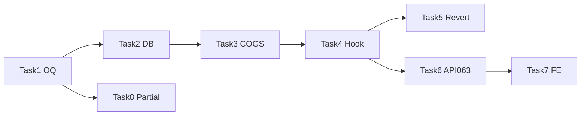

# SRS — PRD: Sổ cái tài chính — nguồn ghi đầy đủ theo nghiệp vụ (xuất kho, đơn hàng, thu chi, nhập kho)

> **File:** `backend/docs/srs/SRS_PRD_finance-ledger-unified-business-postings.md`  
> **Người soạn:** Agent `AI_PLANNER` (theo `AGENTS/AI_PLANNER_AGENT_INSTRUCTIONS.md` §4)  
> **Ngày:** 02/05/2026  
> **Trạng thái:** `Draft` — chờ PO duyệt  
> **Lựa chọn kiến trúc:** PO ủy quyền **chọn phương án tối ưu** → **Phương án B (khuyến nghị)** — chi tiết §5.3; task breakdown §4.4 theo B.

---

## 0. Traceability & bối cảnh

| Nguồn | Ghi chú |
| :--- | :--- |
| Yêu cầu chủ sở hữu (phiên chat) | (1) Mọi **doanh thu / tiền ra vào** từ **các nghiệp vụ** phản ánh được trên **Sổ cái tài chính**; (2) **Phiếu xuất kho** trạng thái **đã giao** hiện **không** sinh dòng sổ — cần quy tắc rõ; (3) Đồng bộ với **đa quỹ** / immutability sổ cái đã có trong hệ thống. |
| SRS nền — đọc sổ cái | [`SRS_Task063_finance-ledger-get-list.md`](SRS_Task063_finance-ledger-get-list.md) |
| SRS — thu chi & quỹ | [`SRS_PRD_cash-transactions-admin-unified-multi-fund.md`](SRS_PRD_cash-transactions-admin-unified-multi-fund.md) |
| API FE tham chiếu | `frontend/docs/api/API_Task063_finance_ledger_get_list.md` |
| Hiện trạng triển khai (tóm tắt) | Đã có ghi `FinanceLedger` từ: **Thu chi Completed**, **Nhập kho duyệt (PurchaseCost)**, **Đơn bán (SalesRevenue / Refund)** theo mã nguồn gần đây; **Phiếu xuất / dispatch** chưa có `INSERT` sổ cái. |

---

## 4.1. Project Overview

**Core goal:** Thiết lập **một nguồn sự thật đọc** (`FinanceLedger`) cho **mọi biến động tiền / giá trị kinh tế** mà PO coi là phải thấy trên **Sổ cái tài chính**, gồm bổ sung quy tắc cho **phiếu xuất kho hoàn tất (đã giao)** và các **khoảng trống** còn lại (thanh toán từng phần, nợ phát sinh thanh toán, v.v.) theo **phương án B**, tránh **trùng doanh thu** với đơn đã ghi sổ, đảm bảo **idempotent** theo cặp `(reference_type, reference_id, business_key)` và khớp **`fund_id`** với PRD đa quỹ.

**Target users:** **Admin** (xem sổ cái — đã ràng buộc role trong triển khai gần đây); kế toán / chủ cửa hàng có **`can_view_finance`** khi PO mở lại quyền đọc; hệ thống tự động ghi sổ theo luồng nghiệp vụ (không UI).

---

## 4.2. Specifications

### 4.2.1 Functional requirements

**FR-1 — Phạm vi “có trên sổ cái”**  
Mỗi nghiệp vụ dưới đây phải có **ít nhất một** bản ghi `FinanceLedger` khi điều kiện kích hoạt thỏa (trừ khi §FR-8 “cấm trùng”):

| Mã | Nghiệp vụ | Điều kiện kích hoạt | `transaction_type` (CHECK hiện tại) | `reference_type` đề xuất |
| :--- | :--- | :--- | :--- | :--- |
| FR-1a | Thu/chi thủ công | `CashTransactions.status = Completed` | `SalesRevenue` hoặc `OperatingExpense` | `CashTransaction` |
| FR-1b | Nhập kho đã duyệt | Phiếu nhập Approved | `PurchaseCost` | `StockReceipt` |
| FR-1c | Bán lẻ POS | Checkout thành công | `SalesRevenue` | `SalesOrder` |
| FR-1d | Bán buôn / trả hàng | `paymentStatus` chuyển / tạo **Paid** (theo quy tắc đã code hoặc amend) | `SalesRevenue` / `Refund` | `SalesOrder` |
| FR-1e | **Xuất kho hoàn tất** | Trạng thái phiếu xuất **Delivered** (hoặc tên trạng thái tương đương trong DB — cần khóa chính xác theo schema) | **`OperatingExpense`** (đại diện **COGS / giá vốn hàng bán**) | **`StockDispatch`** (mới — polymorphic FK) |

**FR-2 — Phiếu xuất (FR-1e) không tạo “doanh thu tiền mặt”**  
- Ghi nhận **giá trị vốn** (chi phí) xuất kho, **số âm** trên cột `amount` (quy ước Task063: âm = chi).  
- **Không** ghi thêm `SalesRevenue` nếu **cùng một đợt giao hàng** đã được ghi doanh thu trên `SalesOrder` **trừ khi** PO chọn phương án A (§5.1).

**FR-3 — Tính COGS cho FR-1e**  
- **MVP (B):** COGS = tổng `quantity × đơn giá vốn bình quân` (hoặc cost layer đang có trong DB — **chỉ đọc** tồn/inventory cost đã triển khai). Nếu **thiếu giá vốn** cho dòng: **OQ-1** — không ghi sổ + log cảnh báo **hoặc** ghi dòng `amount = 0` + `description` cảnh báo (PO chọn một).

**FR-4 — Idempotency**  
- Mỗi `(reference_type, reference_id)` + **business key** (ví dụ `dispatch_id` + `version` hoặc hash dòng) tối đa **một** bút toán COGS cho mỗi lần **chuyển trạng thái Delivered**; chuyển ngược (hủy giao) → **không xóa** dòng cũ; nếu cần đảo: thêm dòng **`Refund`** hoặc **`OperatingExpense`** có dấu đối ứng (immutability).

**FR-5 — Đa quỹ**  
- Dòng sổ từ xuất kho gắn **`fund_id`**: **mặc định quỹ POS / quỹ kho** theo PRD đa quỹ — **OQ-2** (ưu tiên: cùng quỹ với đơn bán nếu `order_id` khác null; không thì quỹ mặc định).

**FR-6 — Đọc sổ cái (Task063)**  
- Mở rộng filter `referenceType` cho **`StockDispatch`**; FE hiển thị nhãn tiếng Việt.  
- `search`: mở rộng **ILIKE** trên `description` **và** `transaction_code` hiển thị (nếu có mã phiếu xuất) — **OQ-3**.

**FR-7 — Thanh toán từng phần (Wholesale)**  
- Khi `Partial` → không ghi full `final_amount` một lần; chỉ ghi **số tiền thực thu từng đợt** — cần **bảng sự kiện thanh toán** hoặc bút toán bổ sung — **Phase 2** trong §4.4 (task tách).

**FR-8 — Trùng doanh thu**  
- Nếu xuất kho gắn `SalesOrder` đã có `SalesRevenue` cho đơn: **chỉ** ghi COGS (B), không ghi thêm doanh thu.

### 4.2.2 Non-functional requirements (NFR)

| ID | Tiêu chí | Mục tiêu đo được |
| :--- | :--- | :--- |
| NFR-1 | `GET /api/v1/finance-ledger` p95 | **< 1 giây** với `limit ≤ 100`, DB dev có ≥ 10k dòng `financeledger`, filter 90 ngày. |
| NFR-2 | Nhất quán giao dịch | Ghi sổ trong **cùng transaction** với chuyển trạng thái phiếu xuất / đơn; rollback toàn phần nếu insert ledger thất bại. |
| NFR-3 | Tỷ lệ lỗi server | **5xx** cho luồng ghi sổ tự động **< 0,1%** (đo qua log sau release). |
| NFR-4 | Audit | Mỗi dòng `created_by` = user thực hiện thao tác hoặc system user (nếu job — **OQ-4**). |
| NFR-5 | Immutability | Không `UPDATE/DELETE` `financeledger`; chỉ bù bằng dòng mới. |

---

## 4.3. Tech stack

- **Frontend / UI:** Mini-ERP React (`LedgerPage`, `LedgerTable`, filter `referenceType` bổ sung `StockDispatch`; nhãn COGS).  
- **Backend / business logic:** Spring Boot `smart-erp`, service xuất kho (dispatch lifecycle) gọi tầng ghi sổ; tái sử dụng pattern `insert…FinanceLedger` như `StockReceipt` / `SalesOrder`.  
- **Database & storage:** PostgreSQL; có thể cần **Flyway** mở rộng CHECK `transaction_type` **chỉ khi** PO chọn loại bút toán ngoài tập hiện tại (hiện đủ với `OperatingExpense` cho COGS); cột `financeledger.reference_type` chấp nhận giá trị mới `StockDispatch` (application-layer đã cho polymorphic).

---

## 5. Kiến trúc — phương án & khuyến nghị (trước §4.4)

### 5.1 Phương án A — “Doanh thu khi giao hàng”

- **Ý tưởng:** Mỗi lần xuất Delivered ghi **SalesRevenue** (dương) theo giá bán dòng phiếu.  
- **Ưu:** Dễ hiểu “có tiền vào” trên sổ khi giao.  
- **Nhược:** Trùng với đơn **Paid** đã ghi `SalesRevenue`; đối soát kế toán phức tạp.  
- **Khi chọn:** Không có lớp ghi sổ theo đơn hàng.

### 5.2 Phương án C — “Chỉ liên kết, không số tiền”

- **Ý tưởng:** Dòng sổ `amount = 0`, chỉ mô tả tham chiếu xuất kho.  
- **Ưu:** Không đụng cost.  
- **Nhược:** Không đáp ứng kỳ vọng “có tiền / có giá trị” trên sổ.  
- **Khi chọn:** Chỉ cần audit trail, không COGS.

### 5.3 Phương án B — “COGS khi xuất; doanh thu theo đơn/thu chi” *(khuyến nghị)*

- **Ý tưởng:** Delivered → một bút **`OperatingExpense`** (COGS) **âm** theo vốn; doanh thu vẫn từ **SalesOrder** / thu chi.  
- **Ưu:** Khớp kế toán cơ bản; tránh double revenue.  
- **Nhược:** Cần nguồn **giá vốn** đủ tin cậy; xử lý OQ khi thiếu cost.  
- **Rủi ro:** Sai cost layer → sai COGS; cần test với tồn kho thật.  
- **Khuyến nghị:** Chọn **B** vì phù hợp câu hỏi “tại sao xuất không có tiền” — **tiền mặt / doanh thu** không đi qua xuất; **giá trị vốn** mới đi qua xuất.

---

## 4.4. Task breakdown & dependency graph

**Thứ tự phụ thuộc:** DB/OQ chốt → BE dispatch → BE ledger read/filter → FE nhãn & filter → QA.

- [ ] **Task 1 — Chốt OQ với PO**
  - **Description:** Trả lời OQ-1 (thiếu giá vốn), OQ-2 (mapping `fund_id`), OQ-3 (mở rộng search), OQ-4 (system user hay bắt buộc user).
  - **Input/Output:** Input: workshop 30 phút / comment PRD; Output: bảng quyết định gắn vào §4.2.
  - **Acceptance Criteria:** Mỗi OQ có **một** lựa chọn đã ghi; không còn “TBD” trong FR-3/FR-5/FR-6.

- [ ] **Task 2 — DB: `reference_type` + index (nếu cần)**
  - **Description:** Đảm bảo `financeledger.reference_type` chấp nhận `StockDispatch`; thêm index partial nếu query theo `reference_type` tăng tải.
  - **Input/Output:** Input: schema hiện tại; Output: Flyway mới + rollback script.
  - **Acceptance Criteria:** `flyway migrate` thành công; không phá CHECK `transaction_type` hiện có.

- [ ] **Task 3 — Domain: tính COGS từ phiếu xuất**
  - **Description:** Service thuần: input `dispatchId`, output `BigDecimal totalCogs`, danh sách dòng (để log).
  - **Input/Output:** Input: ID phiếu Delivered; Output: DTO nội bộ + lỗi domain nếu thiếu dữ liệu theo OQ-1.
  - **Acceptance Criteria:** Unit test ≥ 5 case: đủ cost, thiếu cost, nhiều dòng, đơn vị quy đổi (nếu có), quantity 0.

- [ ] **Task 4 — Ghi `FinanceLedger` khi dispatch → Delivered**
  - **Description:** Hook sau cập nhật trạng thái; `INSERT` idempotent theo FR-4; `fund_id` theo FR-5.
  - **Input/Output:** Input: lifecycle dispatch; Output: `financeledger.id` (không bắt buộc trả API).
  - **Acceptance Criteria:** Integration test: Delivered → đúng 1 dòng; lặp lại idempotent không nhân đôi; rollback khi INSERT fail.

- [ ] **Task 5 — Đảo bút khi hủy giao / revert** *(nếu nghiệp vụ cho phép)*
  - **Description:** Theo FR-4: dòng đối ứng `Refund` hoặc `OperatingExpense` dấu ngược.
  - **Input/Output:** Input: sự kiện revert; Output: dòng sổ mới.
  - **Acceptance Criteria:** Tổng `amount` theo `reference_id` dispatch sau revert khớp kỳ vọng test.

- [ ] **Task 6 — API Task063 + SRS063 amend**
  - **Description:** Cho phép `referenceType=StockDispatch`; mở rộng search theo FR-6.
  - **Input/Output:** Input: contract cũ; Output: tài liệu API + envelope không đổi.
  - **Acceptance Criteria:** WebMvc test filter; OpenAPI/MD đồng bộ.

- [ ] **Task 7 — FE Sổ cái**
  - **Description:** Nhãn `StockDispatch` / COGS; cột mô tả rõ “Giá vốn xuất kho”.
  - **Input/Output:** Input: API mới; Output: PR UI.
  - **Acceptance Criteria:** E2E: tạo xuất Delivered → Admin thấy dòng mới trong 90 ngày mặc định.

- [ ] **Task 8 — Phase 2: Thanh toán từng phần (FR-7)**
  - **Description:** Thiết kế bảng `sales_order_payments` hoặc tương đương; ghi `SalesRevenue` theo từng đợt.
  - **Input/Output:** Input: PRD bổ sung; Output: migration + service.
  - **Acceptance Criteria:** Kịch bản Partial→Paid không double full `final_amount`.

**Dependency graph (mermaid):**

---

## 6. Open Questions (gom vào Task 1)

| ID | Câu hỏi |
| :--- | :--- |
| OQ-1 | Thiếu đơn giá vốn cho dòng xuất: **bỏ qua** / **0 đồng** / **chặn Delivered**? |
| OQ-2 | `fund_id` lấy từ đâu khi xuất có/không `order_id`? |
| OQ-3 | Mở rộng `search` sang mã phiếu xuất — scope cột DB? |
| OQ-4 | `created_by` khi job nền: user hệ thống? |

---

**Tổng kết**

- **Đã làm:** PRD Markdown mới (`SRS_PRD_finance-ledger-unified-business-postings.md`) theo §4.1–4.4 + phương án A/B/C và khuyến nghị **B**.  
- **Còn:** PO duyệt Draft, chốt OQ Task 1, rồi chuyển cho API/BE/FE agent theo §4.4.  
- **Rủi ro:** COGS phụ thuộc chất lượng dữ liệu tồn/giá vốn; Partial payment cần Phase 2 để tránh sai lệch.
