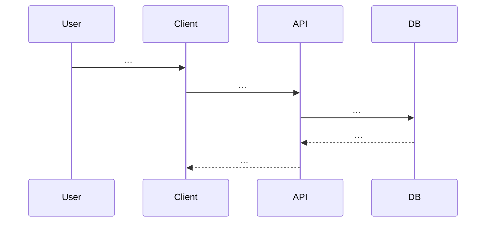

# SRS — `<Tên tính năng / endpoint>` — TaskXXX

> **File (Spring / `smart-erp`):** `backend/docs/srs/SRS_TaskXXX_<slug-kebab>.md`  
> **Người soạn:** Agent BA (+ SQL khi đụng DB)  
> **Ngày:** `<DD/MM/YYYY>`  
> **Trạng thái:** `Draft` | `Approved`  
> **PO duyệt (khi Approved):** `<tên>`, `<ngày>`

---

## 0. Đầu vào & traceability

| Nguồn | Đường dẫn / ghi chú |
| :--- | :--- |
| API spec (nếu có) | `frontend/docs/api/API_TaskXXX_*.md` |
| UC / DB spec | `frontend/docs/UC/Database_Specification.md` (mục §…) |
| Flyway thực tế | `backend/smart-erp/src/main/resources/db/migration/V*.sql` |
| Brief / ticket / họp | `<link hoặc mô tả ngắn>` |

---

## 1. Tóm tắt điều hành

- **Vấn đề:** …
- **Mục tiêu nghiệp vụ:** …
- **Đối tượng / persona:** …

---

## 2. Bóc tách nghiệp vụ (capabilities)

Liệt kê **những việc hệ thống phải làm** (động từ + đối tượng + điều kiện), không nhảy thẳng vào SQL.

| # | Capability | Kích hoạt bởi | Kết quả mong đợi | Ghi chú |
| :---: | :--- | :--- | :--- | :--- |
| C1 | … | … | … | … |

---

## 3. Phạm vi

### 3.1 In-scope

- …

### 3.2 Out-of-scope

- …

---

## 4. Câu hỏi làm rõ cho PO (Open Questions)

> BA **không** tự chốt thay PO. Mỗi mục có ID để PO trả lời trong PR/ticket.

| ID | Câu hỏi | Ảnh hưởng nếu không trả lời | Blocker? |
| :--- | :--- | :--- | :---: |
| OQ-1 | … | … | Có / Không |

**Trả lời PO (điền khi chốt):**

| ID | Quyết định PO | Ngày |
| :--- | :--- | :--- |
| OQ-1 | … | … |

---

## 5. Phân tích scope tệp & bằng chứng (Evidence scope)

> BA mô tả **đã đọc gì** và **dự kiến Dev/Tester đụng đâu** — không thay Tech Lead chọn ADR.

### 5.1 Tài liệu đã đối chiếu (read)

- …

### 5.2 Mã / migration dự kiến (write / verify)

- …

### 5.3 Rủi ro phát hiện sớm

- …

---

## 6. Persona & RBAC

| Vai trò | Quyền / điều kiện | HTTP khi từ chối |
| :--- | :--- | :--- |
| … | … | 403 / … |

---

## 7. Actor & luồng nghiệp vụ

### 7.1 Danh sách actor

| Actor | Mô tả ngắn |
| :--- | :--- |
| End user | … |
| Client (FE / mobile) | … |
| API (`smart-erp`) | … |
| Database | … |
| Hệ thống ngoài (nếu có) | … |

### 7.2 Luồng chính (narrative)

1. …
2. …

### 7.3 Sơ đồ (bắt buộc khi ≥ 2 bước hệ thống)



_(Hoặc `flowchart` nếu hợp hơn — ghi chú lý do.)_

---

## 8. Hợp đồng HTTP & ví dụ JSON

### 8.1 Tổng quan endpoint

| Thuộc tính | Giá trị |
| :--- | :--- |
| Method + path | `POST /api/v1/...` |
| Auth | Bearer / … |
| Content-Type | `application/json` |

### 8.2 Request — schema logic (field-level)

| Field / param | Vị trí (path / query / header / body) | Kiểu | Bắt buộc | Validation | Ghi chú |
| :--- | :--- | :--- | :---: | :--- | :--- |

### 8.3 Request — **ví dụ JSON đầy đủ** (body, nếu có)

```json
{
  "example": true
}
```

### 8.4 Response thành công — **ví dụ JSON đầy đủ** (`200`)

```json
{
  "success": true,
  "data": {},
  "message": "Thành công"
}
```

### 8.5 Response lỗi — **ví dụ JSON đầy đủ** (mỗi mã áp dụng)

**400 — validation / bad request**

```json
{
  "success": false,
  "error": "BAD_REQUEST",
  "message": "…",
  "details": {}
}
```

**401 / 403 / 404 / 409 / 500** — lặp cấu trúc tương tự, **một khối JSON mẫu cho mỗi mã** mà nghiệp vụ cần.

### 8.6 Ghi chú envelope

- Khóa `success`, `error`, `message`, `details`, `data` — bám convention dự án; nếu lệch API markdown → ghi **GAP**.

---

## 9. Quy tắc nghiệp vụ (bảng)

| Mã | Điều kiện | Hành động / kết quả |
| :--- | :--- | :--- |
| BR-1 | … | … |

---

## 10. Dữ liệu & SQL tham chiếu (phối hợp Agent SQL)

> BA giữ owner mục; SQL bổ sung query, index, transaction — xem `backend/AGENTS/SQL_AGENT_INSTRUCTIONS.md`.

### 10.1 Bảng / quan hệ (tên Flyway)

| Bảng | Read / Write | Ghi chú |
| :--- | :--- | :--- |

### 10.2 SQL / ranh giới transaction

```sql
-- placeholder :param, không nối chuỗi
SELECT 1;
```

### 10.3 Index & hiệu năng (nếu có)

- …

### 10.4 Kiểm chứng dữ liệu cho Tester

- …

---

## 11. Acceptance criteria (Given / When /Then)

```text
Given …
When …
Then …
```

_(Lặp cho happy path + từng nhánh lỗi chính.)_

---

## 12. GAP & giả định

| GAP / Giả định | Tác động | Hành động đề xuất |
| :--- | :--- | :--- |

---

## 13. PO sign-off (chỉ điền khi Approved)

- [ ] Đã trả lời / đóng các **OQ blocker**
- [ ] JSON request/response khớp ý đồ sản phẩm
- [ ] Phạm vi In/Out đã đồng ý

**Chữ ký / nhãn PR:** …

---

**Phụ lục UI (nếu task chủ yếu là màn Mini-ERP):** có thể bổ sung mục UI theo [`../../../frontend/docs/srs/SRS_TEMPLATE.md`](../../../frontend/docs/srs/SRS_TEMPLATE.md) — không bắt buộc cho SRS thuần API/backend.
