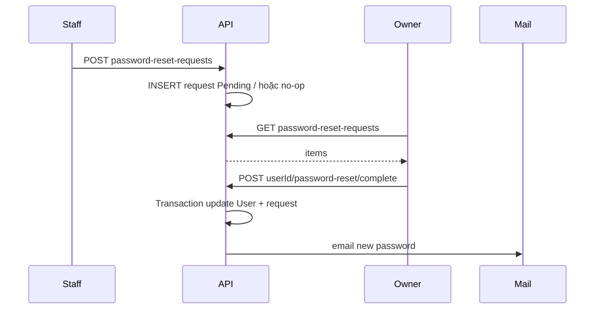

# SRS — Đặt lại mật khẩu nhân viên qua Owner (Staff → Owner → Email)

> **File**: `backend/docs/srs/SRS_Task004_staff-owner-password-reset.md`  
> **Người viết**: Agent BA_SQL (Draft)  
> **Ngày cập nhật**: 24/04/2026  
> **Trạng thái**: Draft

**Traceability:** API [`../../../frontend/docs/api/API_Task004_staff_owner_password_reset.md`](../../../frontend/docs/api/API_Task004_staff_owner_password_reset.md) · UC schema [`../../../frontend/docs/UC/schema.sql`](../../../frontend/docs/UC/schema.sql) (`StaffPasswordResetRequests`, `Users`) · Flyway [`../../smart-erp/src/main/resources/db/migration/V1__baseline_smart_inventory.sql`](../../smart-erp/src/main/resources/db/migration/V1__baseline_smart_inventory.sql)

---

## 1. Tóm tắt

- **Vấn đề**: Nhân viên quên mật khẩu / không đăng nhập được; **không** có self-service reset qua email trên màn đăng nhập.
- **Mục tiêu**: Staff gửi yêu cầu (public) → Owner xem hàng chờ → Owner hoàn tất → hệ thống cập nhật `password_hash`, gửi mật khẩu mới qua email, thu hồi phiên Staff.
- **Đối tượng**: **Staff** (màn đăng nhập / form yêu cầu), **Owner** (danh sách + hoàn tất).

---

## 2. Phạm vi

### 2.1 In-scope

- Ba endpoint theo API Task004: `POST /api/v1/auth/password-reset-requests`, `GET /api/v1/users/password-reset-requests`, `POST /api/v1/users/{userId}/password-reset/complete`.
- Hành vi bảo mật: message 200 thống nhất (§1), không trả plaintext mật khẩu trong JSON (§3).
- Triển khai **Spring Boot** (`smart-erp`): controller, service, mail, transaction, revoke refresh (Task002).

### 2.2 Out-of-scope

- Owner/Admin tự reset mật khẩu qua luồng này (policy: Owner quên MK — kênh khác, xem Open Questions).
- Nội dung template email chi tiết (chỉ yêu cầu “có email, không lộ MK trong log/API JSON”).
- **Chi tiết UI** Mini-ERP: tham chiếu `frontend/mini-erp` + `FEATURES_UI_INDEX` khi Dev/API_BRIDGE nối dây — không duplicate toàn bộ UI spec tại đây.

---

## 3. Persona & Quyền (RBAC)

| Hành động | Role |
| :--- | :--- |
| Gửi yêu cầu (§1) | Public (chưa đăng nhập) |
| Xem hàng chờ (§2) | **Owner** (API cho phép mở rộng Admin — theo policy dự án) |
| Hoàn tất reset (§3) | **Owner** |

- **Staff** chỉ được tạo yêu cầu khi user tồn tại và policy role = Staff (join `Users` ↔ `Roles.name`).

---

## 4. User Stories

- **US1**: Là **Staff**, tôi muốn gửi `username` + `message` (tuỳ chọn) để Owner nhận yêu cầu reset, **mà không bị lộ** việc tài khoản có tồn tại hay không (cùng message 200).
- **US2**: Là **Owner**, tôi muốn xem danh sách yêu cầu `Pending` (lọc/trang) để chọn xử lý.
- **US3**: Là **Owner**, tôi muốn hoàn tất một yêu cầu (`requestId`) để hệ thống đổi mật khẩu, gửi email cho Staff và vô hiệu phiên cũ.

---

## 5. Luồng nghiệp vụ (Business Flow)

Bám sequence trong API Task004 mục 0 (Staff → API → Owner → API → Mail → Staff).



---

## 6. Quy tắc nghiệp vụ (Business Rules)

- **§1**: Username bắt buộc; user không tồn tại → vẫn **200** + message chung. User không phải Staff (theo `Roles.name`) → không tạo bản ghi (hoặc policy 403 — **[CẦN CHỐT]** với PO; API khuyến nghị chỉ Staff).
- **§3**: Một transaction: validate `requestId` ↔ `userId`, trạng thái `Pending`, sinh MK đủ mạnh, `UPDATE Users.password_hash`, đánh dấu request `Processed`, gửi email; **nếu SMTP lỗi** → rollback, không đổi mật khẩu (theo API).
- **Session**: Sau hoàn tất, thu hồi refresh/session Staff (đồng bộ Task002 — spec API §3).

---

## 7. API / Controller (Backend)

- §1–§3 map 1:1 `AuthController` / `UserController` (hoặc module tách theo ADR team) — path/method đúng `API_Task004`.
- Envelope lỗi 400/401/403/404/5xx theo [`API_RESPONSE_ENVELOPE.md`](../../../frontend/docs/api/API_RESPONSE_ENVELOPE.md).

---

## 8. Edge Cases

- Trùng nhiều yêu cầu `Pending` cho cùng user → **requestId** bắt buộc trên §3 (API).
- Owner gọi §2/§3 khi access hết hạn → client refresh (Task003) rồi retry (phía FE).
- Rate limit §1 (429) — nếu triển khai, AC: sau N lần/IP trả 429 rõ ràng.

---

## 9. Gợi ý tích hợp FE (tham chiếu, không phải phạm vi SRS backend)

| API | Gợi ý |
| :--- | :--- |
| §1 | `mini-erp` `LoginForm` / `authApi` |
| §2, §3 | Owner UI + `apiJson` Bearer — route do PM chốt |

---

## 10. Dữ liệu & SQL tham chiếu (PostgreSQL)

**Bảng (Flyway V1 / UC schema — tên CamelCase trong DDL; JDBC/Hibernate map theo entity team):** `Users`, `StaffPasswordResetRequests`, `Roles`, `RefreshTokens` (revoke), `SystemLogs` (ghi action, không plaintext password).

### 10.1 §1 — Kiểm tra user + tạo yêu cầu (mẫu)

```sql
SELECT u.id, u.status, r.name AS role_name
FROM Users u
JOIN Roles r ON r.id = u.role_id
WHERE u.username = :username;

INSERT INTO StaffPasswordResetRequests (user_id, message, status)
VALUES (:user_id, :message, 'Pending');
```

### 10.2 §2 — Danh sách Owner

```sql
SELECT r.id, r.user_id, u.username, u.full_name, r.message, r.status, r.created_at
FROM StaffPasswordResetRequests r
JOIN Users u ON u.id = r.user_id
WHERE r.status = COALESCE(:status, 'Pending')
ORDER BY r.created_at DESC
LIMIT :limit OFFSET ((:page - 1) * :limit);
```

Index: `idx_sp_reset_user_status` trên `(user_id, status)`.

### 10.3 §3 — Hoàn tất (trong một transaction)

```sql
SELECT id, user_id, status
FROM StaffPasswordResetRequests
WHERE id = :request_id AND user_id = :user_id
FOR UPDATE;

UPDATE Users
SET password_hash = :bcrypt_hash, updated_at = CURRENT_TIMESTAMP
WHERE id = :user_id;

UPDATE StaffPasswordResetRequests
SET status = 'Processed', processed_by = :owner_id, processed_at = CURRENT_TIMESTAMP
WHERE id = :request_id;

DELETE FROM RefreshTokens WHERE user_id = :user_id;
```

**Transaction:** toàn bộ §3 trong **một** `@Transactional`; nếu gửi email fail sau bước hash → **rollback** (theo API §3.2).

---

## 11. Acceptance Criteria (Given / When / Then)

### 11.1 §1 Happy

```text
Given Staff chưa đăng nhập và biết username hợp lệ
When POST /api/v1/auth/password-reset-requests với username (+ message tuỳ chọn)
Then HTTP 200 và message thành công thống nhất; DB có bản ghi Pending (nếu user Staff Active)
```

### 11.2 §1 — User không tồn tại

```text
Given username không khớp Users
When POST §1
Then HTTP 200 và cùng message thành công; không INSERT yêu cầu
```

### 11.3 §2 — Owner xem danh sách

```text
Given Owner đã đăng nhập (Bearer hợp lệ)
When GET /api/v1/users/password-reset-requests?status=Pending
Then HTTP 200 và items không chứa password_hash
```

### 11.4 §3 — Hoàn tất

```text
Given Có request Pending đúng userId và Owner đăng nhập
When POST /api/v1/users/{userId}/password-reset/complete với requestId hợp lệ
Then HTTP 200; password_hash đổi; email gửi; request Processed; refresh staff bị thu hồi
```

### 11.5 §3 — SMTP lỗi

```text
Given SMTP trả lỗi khi gửi email
When POST §3
Then HTTP 5xx theo API; Users.password_hash không đổi; request vẫn Pending
```

---

## 12. Open Questions

- **Owner quên mật khẩu**: kênh xử lý ngoài Task004 (API đã ghi ngoài phạm vi).
- **Admin** có được quyền như Owner trên §2/§3 hay không — PO chốt.
- **SRS_Task001_login-authentication.md** tại `backend/docs/srs/` — hiện repo tham chiếu nhưng file chưa khởi tạo; cần đồng bộ khi bổ sung.
