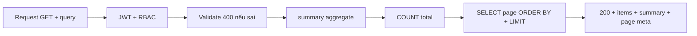

# SRS — Task005 — `GET /api/v1/inventory` — Danh sách tồn kho + KPI (list)

> **File:** `backend/docs/srs/SRS_Task005_inventory-get-list.md`  
> **Người viết:** Agent BA + SQL (Draft)  
> **Ngày:** 25/04/2026  
> **Trạng thái:** Approved

**Traceability:** UC6 — màn Tồn kho (StockPage) · **API** [`../../../frontend/docs/api/API_Task005_inventory_get_list.md`](../../../frontend/docs/api/API_Task005_inventory_get_list.md) · Thiết kế API [`../../../frontend/docs/api/API_PROJECT_DESIGN.md`](../../../frontend/docs/api/API_PROJECT_DESIGN.md) (§4.7 nếu tồn tại) · Uỷ quyển mô tả cột/UC [`../../../frontend/docs/UC/Database_Specification.md`](../../../frontend/docs/UC/Database_Specification.md) (§16 tồn, §5–8 kho/SP) · **Flyway** [`../../smart-erp/src/main/resources/db/migration/V1__baseline_smart_inventory.sql`](../../smart-erp/src/main/resources/db/migration/V1__baseline_smart_inventory.sql) · **Out of scope API:** Task006 (chi tiết dòng), Task007/008/010 (ghi), Task009 (KPI tách) — theo tài liệu API.

---

## 1. Tóm tắt

- **Vấn đề:** FE cần thay **mock tồn** bằng dữ liệu đọc thống nhất: bảng phân trang + bốn KPI (`summary`) trong **một** `GET` (hoặc tách Task009 theo tài liệu).
- **Mục tiêu:** Cung cấp **hợp đồng** `GET /api/v1/inventory` (query lọc/tìm, phân trang, tổng bản ghi) và trường tính toán read-model (`isLowStock`, `isExpiringSoon`, `totalValue`) từ join **Inventory + Products + WarehouseLocations + ProductUnits (base) + ProductPriceHistory (bản mới nhất theo `effective_date` / `id`)** khớp migration.
- **Đối tượng:** vận hành kho theo phân quyền màn UC6 (Owner / Staff / Admin theo tài liệu API; chi tiết quyền theo dự án — mục 3).

---

## 2. Phạm vi

### 2.1 In-scope

- Endpoint: **`GET /api/v1/inventory`**, `Authorization: Bearer` bắt buộc.
- Query: `search`, `stockLevel`, `locationId`, `categoryId`, `page`, `limit`, `sort` — theo bảng §5.2 tài liệu API; validation **400** + `details` khi sai; **200** theo envelope thành công (Task005 API §7).
- Dữ liệu trả về: `data.summary` (4 chỉ số), `data.items` (cột tối thiểu như mẫu API), `page`, `limit`, `total`.
- Lỗi: **400 / 401 / 403 / 500** theo mẫu tài liệu API; **404** “không áp dụng” cho list path cố định (theo API).

### 2.2 Out-of-scope

- Một bản ghi tồn theo `id` path — Task006.
- Endpoint KPI cache riêng — Task009.
- Cập nhật số lượng / meta từ màn tồn — Task007, 008, 010.
- Báo cáo tài chính / dashboard tổng hợp cấp cao (chỉ phục vụ UC6 list).

---

## 3. Persona & RBAC

| Nguồn | Nội dung |
| :--- | :--- |
| Tài liệu API (§4) | Owner, Staff, Admin — **chỉ đọc** tồn trong **phạm vi tenant / quyền UC6** |
| Tài liệu API (§8.1) | 401 nếu token thiếu/invalid/hết hạn; 403 nếu không đủ quyền |

**Ghi chú tích hợp dự án (Task101):** Quyền màn tồn theo *role* — thường qua claim `mp` (ví dụ `can_manage_inventory`), map với cột `Roles.permissions` trong DB. Một *role* có quyền thì cùng quy tắc cho cả *đọc* lẫn *thay đổi* trên màn tồn, không tách nhiều tầng endpoint riêng ở SRS này. Chi tiết ánh xạ khi triển khai xem bảng quyền thực tế.

- **Xử lý 403 (UI):** toast/ thông điệp tương ứng envelope `FORBIDDEN` (tài liệu API mục 9).

---

## 4. User stories

- **US1:** Là nhân sự kho, tôi muốn **xem danh sách tồn** theo trang, lọc còn hàng / sắp hết / hết hàng và tìm theo tên hoặc mã SP, để vận hành theo thực tế từng dòng tồn.
- **US2:** Cùng người dùng, tôi muốn **KPI ổn định** (`summary`) tính trên **cùng bộ lọc, toàn bộ tập** (không thu hẹp theo trang hiện tại) để ưu tiên xử lý.

---

## 5. Luồng nghiệp vụ (tóm tắt)

**Read-only:** xác thực → (RBAC) → validate query → tổng hợp `summary` → `COUNT` phân trang → `SELECT` trang → map JSON. Không ghi DB.



---

## 6. Quy tắc nghiệp vụ (bám API Task005)

| Mã / trường | Quy tắc (theo tài liệu API) |
| :--- | :--- |
| `stockLevel` = `in_stock` | `quantity > min_quantity` |
| `low_stock` | `0 < quantity <= min_quantity` |
| `out_of_stock` | `quantity = 0` |
| `all` (mặc định) | Không thêm ràng `stockLevel` tương ứng 3 tình huống trên |
| `search` (nếu có) | `ILIKE` trên `Products.name` **hoặc** `Products.sku_code` (chiến lược OR — giữ cùng API) |
| `isLowStock` (response) | Tương đương mệnh đề: `0 < quantity <= min_quantity` |
| `isExpiringSoon` | `expiry_date` không null, `expiry_date <= current_date + 30 days`, `quantity > 0` (theo mô tả read-model API) |
| `totalValue` (dòng) | `quantity * costPrice` (giá vốn từ bản ghi mới nhất; **CẦN CHỐT** số thập phân/rounding) |
| `summary.totalSkus` | Cùng ý nghĩa với `data.total` khi cùng bộ lọc: tổng số dòng tồn (một dòng = một tổ hợp sản phẩm–vị trí–lô). *Chỉ bàn lại* nếu Product Owner muốn “tổng mặt hàng” đếm theo `product_id` thay vì theo dòng. |
| `summary` vs `page` | Cùng bộ lọc; `summary` **không** giới hạn `LIMIT`/`page`; `data.total` = tổng số bản ghi dùng cho phân trang (cùng `WHERE` với list) |

**Phạm vi bảo mật dữ liệu (WHERE “RBAC”):** tài liệu API mô tả bước “+ WHERE phạm vi quyền (ví dụ lọc kho theo user nếu policy)”. Trên schema V1, **không** có cột `owner_id` / `tenant_id` trên `Inventory` / `Products` / `WarehouseLocations`— **phạm vi mặc định** đồ án: **một cửa hàng / toàn bảng**; nếu sau này đa-tenant, chuyển thành migration + CR — ghi **GAP** khi triển khai khác mặc định.

**`WarehouseLocations.status`:** Mặc định **vẫn lấy** cả vị trí `Active` / `Maintenance` / `Inactive` (một kệ bảo trì vẫn còn tồn thì cần thấy trên bảng). Tùy chọn lọc theo trạng thái vị trí: chỉ nếu PO/FE bổ sung.

---

## 7. Ràng buộc DB (đối chiếu V1, không bịa)

- **`Inventory`:** `quantity >= 0`; `UNIQUE (product_id, location_id, batch_number)`; FK `product_id` → `Products.id`, `location_id` → `WarehouseLocations.id` (RESTRICT vị trí khi xóa).
- **`ProductUnits`:** đúng **1** dòng `is_base_unit = TRUE` mỗi `product_id` (comment V1) — dùng join đó cho giá/đơn vị tính từ tồn theo *đơn vị cơ sở* (cùng API mô tả LATERAL `ProductPriceHistory` theo `product_id` + `unit_id` = đơn vị cơ sở).
- **`ProductPriceHistory` (V1):** cột `cost_price`, `sale_price`, `effective_date` (kiểu `DATE`), `created_at`; bản mới nhất: `ORDER BY effective_date DESC, id DESC` (cùng gợi ý API).

---

## 8. Technical mapping (hợp đồng tối thiểu)

- **Envelope thành công:** theo dự án (Task005 API §7): `success`, `data` (cấu trúc như mẫu), `message` “Thành công” khi 200.
- **Query → JSON:** ánh xạ tên cột/field như tài liệu API; ngày giờ `updatedAt` ISO-8601 (UTC) nếu theo mẫu; `expiryDate` theo trường `DATE` từ DB.
- **FE (Zod):** tham chiếu tài liệu API Task005 §10 — không bắt buộc nằm trong phạm vi BE nhưng đồng bộ hợp lệ số/enum.

---

## 9. Dữ liệu & SQL tham chiếu (Agent SQL — PostgreSQL, theo V1 + Task005 API)

> Mục đích: **hợp đồng tham chiếu** cho Dev/Tester; tham số bảo vệ (`:...`), không nối chuỗi tự do. Điều kiện lọc “RBAC/tenant” tại **\[CẦN CHỐT]** — placeholder `/* rbac */`.

### 9.1 Bảng tham gia (tên từ Flyway)

| Bảng | Mục đích trong Task005 |
| :--- | :--- |
| `Inventory` | Số từng dòng, `min_quantity`, `location_id`, `expiry_date`, `batch_number`, `updated_at` |
| `Products` | `name`, `sku_code`, `barcode`, `category_id` |
| `WarehouseLocations` | `warehouse_code`, `shelf_code` |
| `ProductUnits` | `is_base_unit = TRUE` → `unit_name`, `id` |
| `ProductPriceHistory` | Bản mới nhất: `cost_price` (dùng cho vốn / `totalValue`); *không* dùng bịa tên cột ngoài V1 |

**Index đã có (V1) gợi ý hưởng nghiệm:** `idx_inv_product`, `idx_inv_expiry_date` trên `Inventory`; `idx_price_lookup` trên `ProductPriceHistory` (`product_id, unit_id, effective_date DESC`) — phù hợp mẫu LATERAL “latest”.

**Đề xuất tùy chọn (khi bộ lọc `categoryId` tải nặng, kiểm chứng `EXPLAIN` trên dữ liệu thật):** `CREATE INDEX CONCURRENTLY idx_products_category_id ON Products(category_id)` nếu chưa tồn tại (V1 mặc định **chưa** tạo index này — cần migration tách nếu PO/TL duyệt).

### 9.2 CTE/điều kiện lọc `stockLevel` (illustration)

Dùng trong cả `summary`, `count`, `list` cùng predicate (tránh lệch số liệu):

```sql
-- :stock_level IN ('all', 'in_stock', 'low_stock', 'out_of_stock')
-- Khi :stock_level = 'in_stock' thì: i.quantity > i.min_quantity
--        'low_stock'        : 0 < i.quantity AND i.quantity <= i.min_quantity
--        'out_of_stock'     : i.quantity = 0
--        'all'              : bỏ điều kiện stock
```

Kết hợp thêm: `search` (`ILIKE` tên + sku), `locationId`, `categoryId` như API; `/* rbac */`.

### 9.3 Tổng hợp `summary` (bám cấu trúc tài liệu API 8.1, chỉnh theo tên cột thực tế)

```sql
SELECT
  COUNT(*)::bigint AS total_skus,
  COALESCE(
    SUM(i.quantity::numeric
        * COALESCE(pph.latest_cost::numeric, 0)),
    0
  ) AS total_value,
  COUNT(*) FILTER (WHERE i.quantity > 0 AND i.quantity <= i.min_quantity) AS low_stock_count,
  COUNT(*) FILTER (WHERE
    i.expiry_date IS NOT NULL
    AND i.expiry_date <= (CURRENT_DATE + interval '30 days')
    AND i.quantity > 0) AS expiring_soon_count
FROM Inventory i
INNER JOIN Products p ON p.id = i.product_id
INNER JOIN WarehouseLocations wl ON wl.id = i.location_id
INNER JOIN ProductUnits pu ON pu.product_id = p.id AND pu.is_base_unit = true
LEFT JOIN LATERAL (
  SELECT pph_1.cost_price AS latest_cost
  FROM ProductPriceHistory pph_1
  WHERE pph_1.product_id = p.id AND pph_1.unit_id = pu.id
  ORDER BY pph_1.effective_date DESC, pph_1.id DESC
  LIMIT 1
) pph ON true
WHERE 1=1
  /* and filters + stockLevel + search + locationId + categoryId + rbac */;
```

*Ghi chú biến đổi:* alias `pph_1` tránh xung đột; `latest_cost` chỉ tên logic.

### 9.4 `COUNT` cho phân trang (cùng join/WHERE, không LIMIT)

```sql
SELECT COUNT(*)
FROM Inventory i
-- cùng JOIN + WHERE với 9.5/9.3 (không aggregate ngoài COUNT);
```

### 9.5 Trang `items` (bám SQL gợi ý API §8.1, đã đồng tên cột V1)

```sql
SELECT
  i.id,
  i.product_id,
  p.name        AS product_name,
  p.sku_code    AS sku_code,
  p.barcode     AS barcode,
  i.location_id,
  wl.warehouse_code,
  wl.shelf_code,
  i.batch_number,
  i.expiry_date,
  i.quantity,
  i.min_quantity,
  pu.id         AS unit_id,
  pu.unit_name  AS unit_name,
  pph.latest_cost AS cost_price,
  i.updated_at
FROM Inventory i
INNER JOIN Products p ON p.id = i.product_id
INNER JOIN WarehouseLocations wl ON wl.id = i.location_id
INNER JOIN ProductUnits pu ON pu.product_id = p.id AND pu.is_base_unit = true
LEFT JOIN LATERAL (
  SELECT pph_1.cost_price AS latest_cost
  FROM ProductPriceHistory pph_1
  WHERE pph_1.product_id = p.id AND pph_1.unit_id = pu.id
  ORDER BY pph_1.effective_date DESC, pph_1.id DESC
  LIMIT 1
) pph ON true
WHERE 1=1
  /* same filters as summary */
ORDER BY
  i.id ASC
LIMIT :limit OFFSET :offset;
```

- **Mặc định sắp xếp:** theo mục **§12.1** (`i.id`); nếu hỗ trợ `sort` từ client, map từng giá trị cho phép → cột + hướng, **cấm** nối chuỗi SQL từ phía client.

**Map sau SELECT (tầng ứng dụng):**  
`isLowStock` từ `quantity` / `min_quantity`; `isExpiringSoon` từ `expiry_date` & `quantity`; `totalValue` từ `round(quantity * coalesce(latest_cost,0), ...)`; field JSON `expiryDate`, `updatedAt` theo convention dự án.

### 9.6 Giao dịch & tải (read)

- Một lần gọi: có thể 3 query tuần tự (`summary` + `count` + `page`) trong **cùng request**, `@Transactional(readOnly = true)`; không cần `FOR UPDATE`.
- Tính toán **snapshot tại thời điểm đọc** — tồn thay đổi (Task007/008) có thể làm `summary` hơi lệch giữa hai tải trên trang: **chấp nhận** trừ khi PO bắt mức tách Task009/transaction tách — ghi mục Open nếu cần NFR số tuyệt đối.

---

## 10. Acceptance Criteria (Given / When / Then)

```text
Given người dùng đã xác thực và (theo chốt policy) đủ quyền đọc tồn UC6
When GET /api/v1/inventory với tham số mặc định
Then HTTP 200, success = true, data.items là mảng, data.page = 1, data.limit theo mặc định, data.total là tổng số bản ghi từng dòng tồn thỏa cùng filter, data.summary có bốn khóa đúng kiểu/meaning
```

```text
Given cùng filter cho list và tồn tại ít nhất một bản ghi
When tính summary
Then số dòng ảnh hưởng tới low_stock_count & expiring_soon_count theo công thức mục 6; total_value là tổng (quantity * cost) với cost từ PPH mới nhất theo product + đơn vị cơ sở; không cắt theo page
```

```text
Given tham số page = 2, limit = 20 và total > 20
When GET
Then số phần tử items tối đa 20, offset 20, total không thay đổi tùy trang; summary (cùng filter) không thay đổi tùy page
```

```text
Given stockLevel = "low_stock" và tồn tại từng cặp số tương ứng
When GET
Then chỉ các bản ghi 0 < quantity <= min_quantity xuất hiện; summary dùng cùng bộ lọc
```

```text
Given search trùng một phần tên sản phẩm từ mock seed
When GET với ?search=...
Then items chứa sản phẩm thỏa OR ILIKE tên / sku; không 500 khi dữ liệu lớn ở mức seed
```

```text
Given thiếu/invalid token
When GET
Then HTTP 401
```

```text
Given thiếu quyền
When GET
Then HTTP 403, message/ error code theo envelope
```

```text
Given page = 0 hoặc limit = 0 hoặc limit > 100 hoặc stockLevel không hợp lệ
When GET
Then HTTP 400, details từng tham số
```

```text
Given sản phẩm chưa có bản ghi ProductPriceHistory nào cho (product, đơn vị cơ sở)
When tính totalValue
Then cost = 0 hoặc ứng với 0, không 500; totalValue là 0
```

```text
Given tọa màn từ Task007+ refresh list
When GET
Then đọc trạng thái tồn cập nhật (ít nhất trong request sau khi commit ghi)
```

---

## 11. GAP / tương thích

| GAP | Ghi chú |
| :--- | :--- |
| Tài liệu API vs DB `batch_number` | Một số tài liệu mô tả bộ “SKU–vị trí–lô”; V1: `UNIQUE (product_id, location_id, batch_number)` với `batch_number` cho phép NULL; hành vi nhiều dòng cùng (product, location) khi cả batch NULL tùy PostgreSQL — cần rule nghiệp vụ/seed, không tự sửa SRS. |
| Task009 | Nếu FE tách tải KPI, **không** bắt `summary` từ Task005 bị trùng tải; hoặc Task005 trả tối thiểu — **CẦN CHỐT** với PO/FE. |

---

## 12. Chốt với Product Owner (ngắn gọn)

### 12.1 Đã thống nhất hướng (chỉ còn ánh xạ khi code)

- **Sắp xếp mặc định:** theo `Inventory.id` (cùng hướng, ví dụ tăng dần). Tham số `sort` từ client, nếu dùng, cần whitelist rõ ánh xạ → cột/ASC-DESC; không nhận chuỗi tự do.
- **Phân quyền tồn kho:** một *role* được vào màn tồn thì cùng nhóm quy tắc; không tách nhiều tầng “chỉ GET list / chỉ sửa” ở SRS này — map một khóa trong `Roles.permissions` (ví dụ `can_manage_inventory`) lên claim JWT, đủ cho toàn bộ màn. Chi tiết tên khóa lấy đúng file seed/ migration `Roles` hiện tại.
- **Vị trí kho:** vẫn trả tồn ở mọi trạng thái vị trí; không mặc định loại bỏ kệ `Maintenance` / `Inactive`.

### 12.2 Còn hỏi nếu sau này cần

- **Đa-cửa hàng / công ty (tenant):** schema V1 là *một kho;* nếu tách tenant phải có cột/ rule lọc WHERE — tách sang CR/migration, không cần quyết ở Task005 trừ khi PO bật tính năng này.
- **KPI tách (Task009):** nếu FE gọi riêng API KPI, có còn cần đủ `data.summary` trong `GET` list này hay thu gọn — **một câu** bàn với PO + FE trước tích hợp, tránh tải trùng.
***Tính sau***
---

**Kết bản Draft:** sẵn sàng vòng **PO** duyệt theo `BA_AGENT_INSTRUCTIONS.md` (trạng thái chuyển `Approved` + ngày + tên) trước chuyển **PM** theo `WORKFLOW_RULE.md`.
