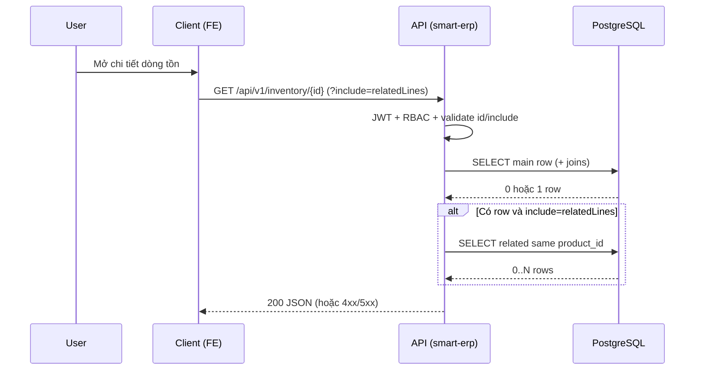

# SRS — Task006 — `GET /api/v1/inventory/{id}` — Chi tiết một dòng tồn (+ `relatedLines`)

> **File:** `backend/docs/srs/SRS_Task006_inventory-get-by-id.md`  
> **Người soạn:** Agent BA + SQL  
> **Ngày:** 25/04/2026  
> **Trạng thái:** Approved  
> **PO duyệt:** Product Owner — 25/04/2026 (chốt theo §4)

---

## 0. Đầu vào & traceability

| Nguồn | Đường dẫn / ghi chú |
| :--- | :--- |
| API spec | [`../../../frontend/docs/api/API_Task006_inventory_get_by_id.md`](../../../frontend/docs/api/API_Task006_inventory_get_by_id.md) |
| Thiết kế API catalog | [`../../../frontend/docs/api/API_PROJECT_DESIGN.md`](../../../frontend/docs/api/API_PROJECT_DESIGN.md) §4.7 |
| UC / DB | [`../../../frontend/docs/UC/Database_Specification.md`](../../../frontend/docs/UC/Database_Specification.md) §16 `Inventory`, §5 `WarehouseLocations`, §7 `Products`, §8 `ProductUnits`, §9 `ProductPriceHistory` |
| Flyway V1 | [`../../smart-erp/src/main/resources/db/migration/V1__baseline_smart_inventory.sql`](../../smart-erp/src/main/resources/db/migration/V1__baseline_smart_inventory.sql) |
| Liên quan | Task005 list — [`../../../frontend/docs/api/API_Task005_inventory_get_list.md`](../../../frontend/docs/api/API_Task005_inventory_get_list.md); Task007 PATCH — [`../../../frontend/docs/api/API_Task007_inventory_patch.md`](../../../frontend/docs/api/API_Task007_inventory_patch.md) |
| UI | UC6 — `StockBatchDetailsDialog` (theo API) |

---

## 1. Tóm tắt điều hành

- **Vấn đề:** Cần **một** bản ghi tồn đủ trường cho popup chi tiết; tùy chọn **các dòng cùng sản phẩm** (`relatedLines`) mà không ghép từ toàn bộ `GET /inventory`.
- **Mục tiêu:** Hợp đồng `GET /api/v1/inventory/{id}` với query `include` đã chốt; read-model `isLowStock`, `isExpiringSoon`, `totalValue` **đồng công thức** Task005.
- **Đối tượng:** Owner / Staff / Admin — đọc tồn UC6 (theo API).

---

## 2. Bóc tách nghiệp vụ (capabilities)

| # | Capability | Kích hoạt bởi | Kết quả mong đợi |
| :---: | :--- | :--- | :--- |
| C1 | Xác thực caller | Mọi request | 401 nếu token không hợp lệ |
| C2 | Kiểm tra quyền đọc tồn UC6 | Sau JWT | 403 nếu không đủ quyền |
| C3 | Validate `id` path | Trước truy DB | 400 + `details.id` nếu không phải số nguyên dương |
| C4 | Validate query `include` | Trước truy DB phụ | 400 + `details.include` nếu có giá trị không thuộc whitelist |
| C5 | Đọc đúng một dòng `Inventory` + join SP / vị trí / đơn vị cơ sở / giá mới nhất | `id` hợp lệ | 200 + `data`; **404** nếu không có dòng hoặc **ngoài phạm vi dữ liệu** (che tồn tại — OQ-1) |
| C6 | Tùy chọn tải `relatedLines` | `include=relatedLines` | Mảng các dòng khác cùng `product_id`, **`quantity > 0`** (OQ-2); có thể `[]` |
| C7 | Map read-model | Sau SELECT | `isLowStock`, `isExpiringSoon`, `totalValue` khớp rule §9 |

---

## 3. Phạm vi

### 3.1 In-scope

- `GET /api/v1/inventory/{id}`, Bearer; path `id`; query `include` (whitelist `relatedLines` theo API).
- Response 200 + lỗi 400, 401, 403, 404, 500 theo envelope thống nhất dự án.

### 3.2 Out-of-scope

- Danh sách phân trang — Task005.
- Ghi meta / số lượng — Task007, 008, 010.
- `GET /inventory/logs` — chưa có Task spec.

---

## 4. Câu hỏi làm rõ cho PO (Open Questions) — **đã chốt**

| ID | Câu hỏi | Ảnh hưởng nếu không trả lời | Blocker? |
| :--- | :--- | :--- | :---: |
| OQ-1 | Khi bản ghi ngoài phạm vi RBAC: trả **404** (che tồn tại) hay **403** (rõ không được phép)? | Dev/Test không biết assert HTTP | ~~Có~~ → đã chốt |
| OQ-2 | `relatedLines`: lọc theo còn hàng / tải thêm lô hết hàng? | Hiển thị & payload | Không |

**Quyết định PO (nguồn sự thật triển khai):**

| ID | Quyết định PO | Ngày |
| :--- | :--- | :--- |
| OQ-1 | Trả **404** khi không có bản ghi **hoặc** bản ghi ngoài phạm vi (không tiết lộ tồn tại). **403** chỉ dùng khi user **không có quyền đọc tồn UC6** nói chung (token hợp lệ nhưng role không được vào chức năng). | 25/04/2026 |
| OQ-2 | Trong response `relatedLines` của Task006: **chỉ** các lô **còn hàng** (`quantity > 0`). Các lô **hết hàng** (`quantity = 0`) sẽ do người dùng bấm **“Xem thêm”** trên UI; nút và luồng gọi API bổ sung do **API_BRIDGE / FE** triển khai sau (ngoài phạm vi endpoint GET này nếu không có thêm query/endpoint). | 25/04/2026 |

**Ghi chú triển khai OQ-2:** Backend Task006 áp dụng điều kiện `i2.quantity > 0` trong SQL `relatedLines`. Không bắt buộc `LIMIT` cứng tại SRS; nếu số lô còn hàng rất lớn, Tech Lead có thể đề xuất pagination/ADR riêng.

---

## 5. Phân tích scope tệp & bằng chứng (Evidence scope)

### 5.1 Tài liệu đã đối chiếu (read)

- `frontend/docs/api/API_Task006_inventory_get_by_id.md`, `API_PROJECT_DESIGN.md` §4.7.
- `frontend/docs/UC/Database_Specification.md` các mục Inventory / Products / WarehouseLocations / ProductUnits / ProductPriceHistory.
- `backend/docs/srs/SRS_Task005_inventory-get-list.md` (đồng bộ read-model).

### 5.2 Mã / migration dự kiến (write / verify)

- Entity/repository `Inventory` (hoặc tương đương) trong `backend/smart-erp/src/main/java/**`.
- Controller bảo vệ `GET /api/v1/inventory/{id}` + map DTO; policy RBAC (Task101 nếu áp dụng).
- **Không** migration mới cho pure read nếu schema đủ V1.

### 5.3 Rủi ro phát hiện sớm

- `batch_number` NULL + UNIQUE — có thể ảnh hưởng seed (đã ghi GAP Task005).

---

## 6. Persona & RBAC

| Vai trò | Quyền / điều kiện | HTTP khi từ chối |
| :--- | :--- | :--- |
| Owner / Staff / Admin | **Không** được quyền đọc tồn UC6 (role / claim) | **403** |
| Owner / Staff / Admin | Được quyền UC6 nhưng **dòng `id` không tồn tại hoặc ngoài phạm vi dữ liệu** | **404** (OQ-1 — che tồn tại) |
| Chưa đăng nhập / token hết hạn | — | **401** |

**Task101:** Map claim / `Roles.permissions` (vd. `can_manage_inventory`) nhất quán với Task005 — một role vào màn tồn → đọc được list và chi tiết trừ khi PO tách sau.

---

## 7. Actor & luồng nghiệp vụ

### 7.1 Danh sách actor

| Actor | Mô tả |
| :--- | :--- |
| End user | Nhân sự kho / quản lý xem chi tiết dòng tồn |
| Client (FE) | Mini-ERP — gọi API khi mở dialog / hydrate |
| API (`smart-erp`) | JWT, RBAC, validation, truy vấn, map JSON |
| Database | PostgreSQL — `Inventory` và bảng join |

### 7.2 Luồng chính (narrative)

1. User mở chi tiết lô → Client gửi `GET /api/v1/inventory/{id}` (header Bearer).
2. API xác thực JWT → kiểm tra quyền đọc tồn.
3. API validate `id`; nếu có `include` thì validate whitelist.
4. API đọc một dòng chính; nếu không có hoặc ngoài phạm vi dữ liệu → **404** (OQ-1).
5. Nếu `include=relatedLines`, API đọc thêm các dòng cùng `product_id` (khác `id`), **chỉ** `quantity > 0` (OQ-2).
6. API map `data` + `relatedLines` (hoặc `[]` nếu không gọi phụ) + read-model → **200**.

### 7.3 Sơ đồ (sequence)



---

## 8. Hợp đồng HTTP & ví dụ JSON

### 8.1 Tổng quan endpoint

| Thuộc tính | Giá trị |
| :--- | :--- |
| Method + path | `GET /api/v1/inventory/{id}` |
| Auth | `Authorization: Bearer <access_token>` |
| Content-Type response | `application/json` |

### 8.2 Request — schema logic

| Field / param | Vị trí | Kiểu | Bắt buộc | Validation |
| :--- | :--- | :--- | :---: | :--- |
| `id` | path | integer > 0 | Có | Số nguyên dương |
| `include` | query | string | Không | Chỉ `relatedLines` hoặc bỏ qua |

### 8.3 Request — ví dụ (không có body)

```http
GET /api/v1/inventory/101?include=relatedLines HTTP/1.1
Host: <api-host>
Authorization: Bearer <your_access_token>
```

_(GET không có JSON body.)_

### 8.4 Response thành công — `200` (ví dụ đầy đủ)

```json
{
  "success": true,
  "data": {
    "id": 101,
    "productId": 12,
    "productName": "Nước suối 500ml",
    "skuCode": "SKU-WAT-500",
    "barcode": "8934563123456",
    "locationId": 3,
    "warehouseCode": "WH01",
    "shelfCode": "A1",
    "batchNumber": "LOT-2026-01",
    "expiryDate": "2026-12-31",
    "quantity": 240,
    "minQuantity": 50,
    "unitId": 5,
    "unitName": "Chai",
    "costPrice": 4500,
    "updatedAt": "2026-04-23T08:00:00Z",
    "isLowStock": false,
    "isExpiringSoon": false,
    "totalValue": 1080000,
    "relatedLines": [
      {
        "id": 102,
        "batchNumber": "LOT-2026-02",
        "quantity": 100,
        "expiryDate": "2027-06-01",
        "warehouseCode": "WH01",
        "shelfCode": "A1"
      }
    ]
  },
  "message": "Thành công"
}
```

**Trường hợp không có `include`:** `relatedLines` phải là `[]` (theo API); không chạy query phụ.

### 8.5 Response lỗi — ví dụ đầy đủ

**400 — `id` hoặc `include` không hợp lệ**

```json
{
  "success": false,
  "error": "BAD_REQUEST",
  "message": "Tham số yêu cầu không hợp lệ",
  "details": {
    "id": "Giá trị phải là số nguyên dương",
    "include": "Giá trị hợp lệ: relatedLines (hoặc bỏ qua tham số)"
  }
}
```

**401**

```json
{
  "success": false,
  "error": "UNAUTHORIZED",
  "message": "Phiên đăng nhập không hợp lệ hoặc đã hết hạn"
}
```

**403**

```json
{
  "success": false,
  "error": "FORBIDDEN",
  "message": "Bạn không có quyền xem bản ghi tồn kho này"
}
```

**404**

```json
{
  "success": false,
  "error": "NOT_FOUND",
  "message": "Không tìm thấy dòng tồn kho yêu cầu"
}
```

**500**

```json
{
  "success": false,
  "error": "INTERNAL_ERROR",
  "message": "Hệ thống đang gặp sự cố. Vui lòng thử lại sau."
}
```

**409:** không áp dụng cho GET read-only.

### 8.6 Ghi chú envelope

Khớp [`API_Task006_inventory_get_by_id.md`](../../../frontend/docs/api/API_Task006_inventory_get_by_id.md) §6–§8; mọi lệch sau này → cập nhật API hoặc ghi GAP §12.

---

## 9. Quy tắc nghiệp vụ (bảng)

| Mã | Điều kiện | Hành động / kết quả |
| :--- | :--- | :--- |
| BR-1 | Không có query `include` | Không query phụ; `relatedLines: []` |
| BR-2 | `include` có giá trị **không** phải `relatedLines` | **400** + `details.include` (theo API) |
| BR-3 | `include=relatedLines` | Chạy query phụ; chỉ dòng **`i2.quantity > 0`**; mỗi phần tử: `id`, `batchNumber`, `quantity`, `expiryDate`, `warehouseCode`, `shelfCode`. Lô `quantity = 0` → **không** nằm trong response này; UI “Xem thêm” / API bổ sung — follow-up FE–API_BRIDGE (OQ-2). |
| BR-4 | Read-model | `isLowStock` ⇔ `0 < quantity <= min_quantity`; `isExpiringSoon` ⇔ `expiry_date` NOT NULL, `<= CURRENT_DATE + 30 days`, `quantity > 0`; `totalValue = quantity * coalesce(costPrice,0)` (cùng nguồn giá Task005) |

---

## 10. Dữ liệu & SQL tham chiếu (Agent SQL)

> Tham số ràng buộc (`:id`, …); `/* rbac */` placeholder — đồng nhất Task005 khi triển khai.

### 10.1 Bảng / quan hệ

| Bảng | Read / Write | Ghi chú |
| :--- | :--- | :--- |
| `Inventory` | Read | Dòng chính + `relatedLines` |
| `Products` | Read | Tên, SKU, barcode |
| `WarehouseLocations` | Read | Mã kho / kệ |
| `ProductUnits` | Read | `is_base_unit = true` |
| `ProductPriceHistory` | Read | LATERAL bản `cost_price` mới nhất |

### 10.2 SQL — một dòng chính

```sql
SELECT
  i.id,
  i.product_id,
  p.name        AS product_name,
  p.sku_code    AS sku_code,
  p.barcode     AS barcode,
  i.location_id,
  wl.warehouse_code,
  wl.shelf_code,
  i.batch_number,
  i.expiry_date,
  i.quantity,
  i.min_quantity,
  pu.id         AS unit_id,
  pu.unit_name  AS unit_name,
  pph.latest_cost AS cost_price,
  i.updated_at
FROM Inventory i
INNER JOIN Products p ON p.id = i.product_id
INNER JOIN WarehouseLocations wl ON wl.id = i.location_id
INNER JOIN ProductUnits pu ON pu.product_id = p.id AND pu.is_base_unit = true
LEFT JOIN LATERAL (
  SELECT pph_1.cost_price AS latest_cost
  FROM ProductPriceHistory pph_1
  WHERE pph_1.product_id = p.id AND pph_1.unit_id = pu.id
  ORDER BY pph_1.effective_date DESC, pph_1.id DESC
  LIMIT 1
) pph ON true
WHERE i.id = :id
  /* rbac */;
```

### 10.3 SQL — `relatedLines` (chỉ khi `include=relatedLines`)

```sql
SELECT
  i2.id,
  i2.batch_number,
  i2.quantity,
  i2.expiry_date,
  wl2.warehouse_code,
  wl2.shelf_code
FROM Inventory i2
INNER JOIN WarehouseLocations wl2 ON wl2.id = i2.location_id
WHERE i2.product_id = :product_id_from_main
  AND i2.id <> :id
  AND i2.quantity > 0
  /* rbac on i2 */
ORDER BY i2.expiry_date NULLS LAST, i2.id;
```

### 10.4 Index & hiệu năng

- `idx_inv_product` trên `Inventory(product_id)` — hỗ trợ bước related.
- Bộ lọc `quantity > 0` giảm payload; nếu vẫn quá nhiều dòng còn hàng, cân nhắc `LIMIT` + pagination trong ADR/CR (không bắt buộc Task006).

### 10.5 Transaction & gọi đọc

- `@Transactional(readOnly = true)`; 1 query chính + tối đa 1 query related; không `FOR UPDATE`.

### 10.6 Kiểm chứng dữ liệu cho Tester

- Seed có ít nhất 2 dòng `Inventory` cùng `product_id` khác `id`, **cả hai `quantity > 0`**, để kiểm `include=relatedLines`; thêm một dòng cùng `product_id` với **`quantity = 0`** — phải **không** xuất hiện trong `relatedLines`.
- Seed một `id` không tồn tại → 404.
- Token hết hạn → 401.

---

## 11. Acceptance criteria (Given / When / Then)

```text
Given đã xác thực và đủ quyền, tồn tại Inventory id hợp lệ trong phạm vi
When GET /api/v1/inventory/{id} không có include
Then HTTP 200, data.id khớp, relatedLines là [], không 500
```

```text
Given cùng điều kiện và có ít nhất một dòng khác cùng product_id với quantity > 0
When GET với ?include=relatedLines
Then HTTP 200, relatedLines không chứa id chính; mọi phần tử có quantity > 0; đủ khóa theo §8.4
```

```text
Given có dòng cùng product_id với quantity = 0
When GET với ?include=relatedLines
Then HTTP 200, relatedLines không chứa dòng quantity = 0
```

```text
Given id không phải số nguyên dương
When GET
Then HTTP 400, details.id
```

```text
Given include có giá trị không thuộc whitelist
When GET
Then HTTP 400, details.include
```

```text
Given id hợp lệ nhưng không có bản ghi hoặc ngoài phạm vi dữ liệu (OQ-1)
When GET
Then HTTP 404, không tiết lộ tồn tại bản ghi
```

```text
Given token hợp lệ nhưng user không có quyền đọc tồn UC6
When GET
Then HTTP 403
```

```text
Given token invalid
When GET
Then HTTP 401
```

```text
Given cùng một bản ghi Inventory
When so sánh read-model với Task005 list
Then isLowStock, isExpiringSoon, totalValue cùng công thức (trừ làm tròn đã chốt dự án)
```

---

## 12. GAP & giả định

| GAP / Giả định | Tác động | Hành động đề xuất |
| :--- | :--- | :--- |
| Lô `quantity = 0` không có trong `relatedLines` | UX “Xem thêm” cần nguồn dữ liệu khác | **API_BRIDGE / FE** bổ sung endpoint hoặc query param / pagination theo backlog PO |
| `relatedLines` không giới hạn cứng số dòng | Nhiều lô còn hàng → payload lớn | Tech Lead cân nhắc `LIMIT` + load more trong CR nếu đo được SLA |
| Đa-tenant | V1 giả định một cửa hàng | CR sau nếu PO bật |

---

## 13. PO sign-off

- [x] Đã trả lời / đóng **OQ-1** (404 ngoài phạm vi; 403 khi không quyền UC6)
- [x] Đã trả lời **OQ-2** (`relatedLines` chỉ lô còn hàng; “Xem thêm” lô hết hàng → follow-up FE/API_BRIDGE)
- [x] JSON §8 khớp ý đồ sản phẩm (kèm điều kiện `quantity > 0` trong `relatedLines`)
- [x] Phạm vi §3 đã đồng ý

**Chữ ký / nhãn PR:** PO — Approved 25/04/2026

---

**Kết bản:** **Approved** — sẵn sàng chuyển **PM** theo `WORKFLOW_RULE.md` §0.
