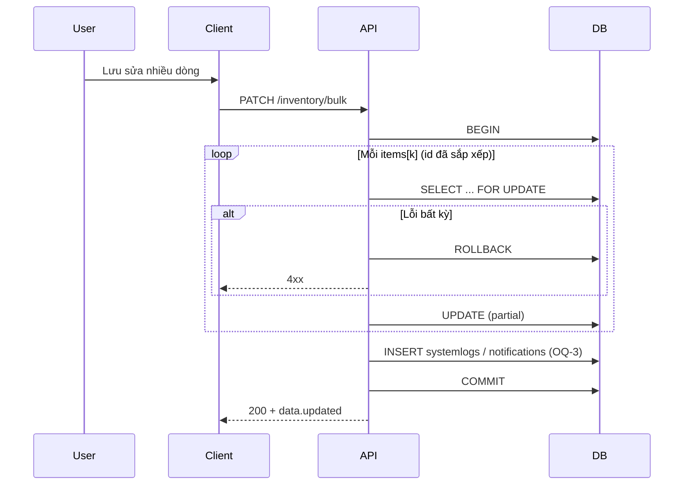

# SRS — Task008 — `PATCH /api/v1/inventory/bulk` — Cập nhật meta nhiều dòng tồn (một transaction)

> **File:** `backend/docs/srs/SRS_Task008_inventory-bulk-patch.md`  
> **Người soạn:** Agent BA + SQL (Draft)  
> **Ngày:** 27/04/2026  
> **Trạng thái:** Draft  
> **PO duyệt (khi Approved):** Approved

---

## 0. Đầu vào & traceability

| Nguồn | Đường dẫn / ghi chú |
| :--- | :--- |
| API spec | [`../../../frontend/docs/api/API_Task008_inventory_bulk_patch.md`](../../../frontend/docs/api/API_Task008_inventory_bulk_patch.md) |
| Thiết kế API | [`../../../frontend/docs/api/API_PROJECT_DESIGN.md`](../../../frontend/docs/api/API_PROJECT_DESIGN.md) §4.7 |
| UC / DB (mô tả) | [`../../../frontend/docs/UC/Database_Specification.md`](../../../frontend/docs/UC/Database_Specification.md) §16 `Inventory`, §5 `WarehouseLocations`, §7 `Products` |
| Flyway (chân lý triển khai) | [`../../smart-erp/src/main/resources/db/migration/V1__baseline_smart_inventory.sql`](../../smart-erp/src/main/resources/db/migration/V1__baseline_smart_inventory.sql) + migration `unit_id` Task007 (`V7__…`) nếu đã merge |
| Luật meta từng dòng | [`SRS_Task007_inventory-patch.md`](SRS_Task007_inventory-patch.md) (PATCH đơn — **cùng** rule nghiệp vụ cho từng phần tử `items[]`) |
| Liên quan | Task005 list; Task006 GET; Task007 PATCH đơn; Task010 `quantity`; Task011/012 audit/notify |

---

## 1. Tóm tắt điều hành

- **Vấn đề:** User chọn **nhiều** dòng tồn và lưu meta (vị trí, định mức, lô, HSD, đơn vị) trong **một** request — tránh N lần gọi Task007 và đảm bảo **all-or-nothing**.
- **Mục tiêu:** `PATCH /api/v1/inventory/bulk` với body `items[]`; mỗi phần tử có `id` + partial giống Task007; **200** khi toàn bộ commit; rollback toàn gói nếu bất kỳ dòng lỗi (mặc định theo API §6).
- **Đối tượng:** Owner / Staff UC6; RBAC đồng nhất `can_manage_inventory` (mặc định giống Task005/007 — addendum nếu PO đổi).

---

## 2. Bóc tách nghiệp vụ (capabilities)

| # | Capability | Kích hoạt | Kết quả |
| :---: | :--- | :--- | :--- |
| C1 | Xác thực JWT | Mọi request | 401 nếu token không hợp lệ |
| C2 | RBAC sửa tồn UC6 | Sau JWT | 403 nếu không đủ quyền |
| C3 | Validate body | Trước ghi | 400 nếu `items` rỗng / thiếu `id` / phần tử không có field cập nhật hợp lệ / field cấm / vượt `maxItems` (OQ-2) |
| C4 | Giới hạn độ dài `items` | Trước vòng lặp DB | 400 + `details.items` nếu vượt ngưỡng (API §7.2) |
| C5 | **Một transaction** | Toàn request | Hoặc tất cả UPDATE hợp lệ commit, hoặc ROLLBACK không đổi dữ liệu |
| C6 | Với từng `items[k]` | Trong TX | Khóa `SELECT … FOR UPDATE` từng `id` theo thứ tự mảng; 404 nếu id không tồn tại → ROLLBACK toàn gói |
| C7 | Rule Task007 / phần tử | Trong TX | `locationId` không tồn tại → **400** `details.items[k].locationId`; inactive product / maintenance / UNIQUE batch / … → **409** → ROLLBACK |
| C8 | `UPDATE` động theo field gửi | Mỗi phần tử | Không đổi `quantity`; cột cho phép giống Task007 |
| C9 | Response 200 | Sau COMMIT | `data.updated` (+ `failed` rỗng nếu all-or-nothing); shape **OQ-1** |
| C10 | Hậu xử lý Task011 + Task012 | Sau khi toàn bộ UPDATE thành công (cùng TX hoặc TX liền sau — OQ-3) | Ghi SystemLogs (một bản ghi tóm tắt **hoặc** theo dòng — OQ-3); Staff → Notifications Owner |

---

## 3. Phạm vi

### 3.1 In-scope

- `PATCH /api/v1/inventory/bulk`, Bearer, `Content-Type: application/json`.
- Body: `{ "items": [ { "id", "locationId"?, "minQuantity"?, "batchNumber"?, "expiryDate"?, "unitId"? }, … ] }`.
- All-or-nothing trong một transaction (mặc định API).
- Mỗi phần tử: **ít nhất một** field cập nhật được phép ngoài `id` (sau loại field cấm) — nếu không có gì để PATCH → 400 cho phần tử đó hoặc toàn request (chốt Dev/PO OQ).

### 3.2 Out-of-scope

- PATCH một dòng — Task007.
- Đổi `quantity` — Task010.
- Mô hình 207 partial success — API ghi “cần spec riêng”; **không** trong task này trừ PO mở OQ.

---

## 4. Câu hỏi làm rõ cho PO (Open Questions)

| ID | Câu hỏi | Ảnh hưởng | Blocker? |
| :--- | :--- | :--- | :--- |
| OQ-1 | Response `data.updated[]`: **tóm tắt** (id, productId, skuCode, vài cột như API mẫu §6) hay **đủ read-model** giống phần tử Task005 (join đầy đủ)? | FE hiển thị / invalidate cache | Không |
| OQ-2 | `maxItems` mặc định **100** (API §7.2) — PO xác nhận hay đổi? | 400 threshold | Không |
| OQ-3 | SystemLogs: **một** dòng `INVENTORY_BULK_META_UPDATE` với `context_data` JSON mảng before/after **hay** N dòng `PATCH_INVENTORY` giống Task007? | Audit, kích thước JSONB | Không |
| OQ-4 | Phần tử `items[k]` có **chỉ** gửi `{ "id": n }` không field meta — coi **400** phần tử hay bỏ qua dòng đó? | Strict validation | Không |

**Trả lời PO (điền khi chốt):**

| ID | Quyết định PO | Ngày |
| :--- | :--- | :--- |
| OQ-1 | **đủ read-model** | |
| OQ-2 | **100** | |
| OQ-3 | N dòng `PATCH_INVENTORY` | |
| OQ-4 | bỏ qua dòng đó | |

---

## 5. Phân tích scope tệp & bằng chứng

### 5.1 Đã đối chiếu

- `API_Task008_inventory_bulk_patch.md` §5–§8.
- `SRS_Task007_inventory-patch.md` (BR, SQL khóa dòng, duplicate UNIQUE, `unit_id`, log/notify).

### 5.2 Dự kiến chỉnh mã (`smart-erp`)

- `InventoryController` — `PATCH /inventory/bulk`.
- Service: validate mảng → vòng lặp tái sử dụng logic Task007 (hoặc gọi service nội bộ chung).
- JDBC: transaction boundary; có thể preload `id` hợp lệ hoặc fail-fast từng `FOR UPDATE`.
- SystemLogs / Notifications — theo OQ-3 và Task012.

### 5.3 Rủi ro

- **Thứ tự khóa:** deadlock nếu hai request bulk khác thứ tự `id` — khuyến nghị **sắp xếp `id` tăng dần** trong service trước khi `FOR UPDATE`.
- **Timeout:** gói lớn — enforce `maxItems` + SLA (NFR TL).

---

## 6. Persona & RBAC

| Điều kiện | HTTP |
| :--- | :--- |
| Không token / token sai | **401** |
| Không quyền `can_manage_inventory` (mặc định đồng Task007) | **403** |
| Một hoặc nhiều `id` không tồn tại (all-or-nothing) | **404** (theo API §8) |

---

## 7. Actor & luồng nghiệp vụ

### 7.1 Actor

| Actor | Vai trò |
| :--- | :--- |
| User | Chọn nhiều dòng, Sửa, Lưu |
| Client | `PATCH /inventory/bulk` + JSON |
| API | Validate, transaction, lặp rule Task007 |
| DB | `inventory` + join kiểm tra |

### 7.2 Sơ đồ



---

## 8. Hợp đồng HTTP & ví dụ JSON

### 8.1 Tổng quan

| Thuộc tính | Giá trị |
| :--- | :--- |
| Method + path | `PATCH /api/v1/inventory/bulk` |
| Auth | `Bearer` |
| Content-Type | `application/json` |

### 8.2 Body — schema (cấp gói)

| Field | Kiểu | Bắt buộc |
| :--- | :--- | :---: |
| `items` | array | Có |
| `items[].id` | int > 0 | Có |
| `items[].locationId` | int | Không |
| `items[].minQuantity` | number ≥ 0 | Không |
| `items[].batchNumber` | string \| null | Không |
| `items[].expiryDate` | string \| null (`YYYY-MM-DD`) | Không |
| `items[].unitId` | int \| null | Không |

**Cấm** trên mỗi phần tử: `quantity`, `costPrice`, `productId`, … — giống Task007 **BR-1**.

### 8.3 Request — ví dụ

```json
{
  "items": [
    {
      "id": 101,
      "locationId": 3,
      "minQuantity": 60,
      "batchNumber": "LOT-2026-01",
      "expiryDate": "2026-12-31",
      "unitId": 5
    },
    {
      "id": 102,
      "minQuantity": 10
    }
  ]
}
```

### 8.4 Response `200` — ví dụ (theo API; chi tiết cột **OQ-1**)

```json
{
  "success": true,
  "data": {
    "updated": [
      {
        "id": 101,
        "productId": 12,
        "skuCode": "SKU-WAT-500",
        "locationId": 3,
        "minQuantity": 60,
        "batchNumber": "LOT-2026-01",
        "expiryDate": "2026-12-31",
        "unitId": 5,
        "updatedAt": "2026-04-23T10:20:00Z"
      }
    ],
    "failed": []
  },
  "message": "Đã cập nhật thông tin tồn kho (hàng loạt)"
}
```

### 8.5 Response lỗi — mẫu `400` (`items` rỗng)

```json
{
  "success": false,
  "error": "BAD_REQUEST",
  "message": "Dữ liệu không hợp lệ",
  "details": {
    "items": "Cần ít nhất một phần tử"
  }
}
```

**401 / 403 / 404 / 409 / 500** — khớp [`API_Task008_inventory_bulk_patch.md`](../../../frontend/docs/api/API_Task008_inventory_bulk_patch.md) §8.

---

## 9. Quy tắc nghiệp vụ

| Mã | Quy tắc |
| :--- | :--- |
| BR-1 | Mỗi phần tử: **cấm** `quantity`, `costPrice`, `productId`, … — 400 + `details`. |
| BR-2 | Mỗi phần tử phải có **ít nhất một** field được phép (ngoài `id`) — nếu không: theo **OQ-4**. |
| BR-3 | `min_quantity >= 0`; `expiry_date` format giống Task007. |
| BR-4 | Sau merge từng dòng: không vi phạm `uq_inventory_product_location_batch` với dòng khác — 409 → ROLLBACK toàn gói. |
| BR-5 | `locationId` không tồn tại → **400** `details.items[k].locationId` (đồng policy Task007 OQ-1). |
| BR-6 | `unitId` phải thuộc `product_id` của dòng — sai → **400** `details.items[k].unitId`. |
| BR-7 | `|items| > maxItems` → **400** `details.items`. |
| BR-8 | Sau COMMIT toàn gói: ghi log + notify Staff theo Task011/012 (OQ-3). |

---

## 10. Dữ liệu & SQL tham chiếu (PostgreSQL)

> Transaction **một**; sort `id` trước khi khóa (tránh deadlock).

### 10.1 Bảng

| Bảng | Read / Write |
| :--- | :--- |
| `inventory` | Read + UPDATE (nhiều dòng) |
| `products`, `warehouselocations`, `productunits` | Read / validate |
| `systemlogs` | INSERT (bulk action) |
| `notifications` | INSERT (Staff → Owner) |

### 10.2 Khóa theo thứ tự (pseudo)

```sql
-- Sau khi sort ids ASC trong ứng dụng:
SELECT i.id, ... FOR UPDATE OF i WHERE i.id = :id_k;
-- validate + UPDATE từng dòng
```

### 10.3 SystemLogs (gợi ý — chi tiết OQ-3)

```sql
INSERT INTO systemlogs (log_level, module, action, user_id, message, context_data)
VALUES (
  'INFO',
  'inventory',
  'INVENTORY_BULK_META_UPDATE',
  :user_id,
  'Cập nhật meta tồn kho (hàng loạt)',
  :context_jsonb
);
```

`context_jsonb`: `{ "count": n, "inventoryIds": [...], "items": [ { "id", "before": {}, "after": {} } ] }` — rút gọn theo Task011.

### 10.4 Transaction

- `BEGIN` → sort `items` by `id` → loop lock → validate → UPDATE từng dòng → INSERT log(s) → (Staff) notifications → `COMMIT` → build `data.updated` (read lại từng id **hoặc** snapshot sau UPDATE — OQ-1).

---

## 11. Acceptance criteria (Given / When / Then)

```text
Given JWT hợp lệ và items gồm 2 id hợp lệ với body hợp lệ
When PATCH bulk
Then 200, data.updated.length = 2, failed rỗng, DB phản ánh cả hai dòng
```

```text
Given một id trong items không tồn tại
When PATCH bulk
Then 404 (hoặc mã PO chốt), không dòng nào bị đổi (ROLLBACK)
```

```text
Given items vượt maxItems
When PATCH bulk
Then 400, details.items
```

```text
Given phần tử gửi quantity
When PATCH bulk
Then 400, details chứa field cấm
```

```text
Given hai dòng sau cập nhật vi phạm UNIQUE
When PATCH bulk
Then 409, ROLLBACK toàn gói
```

---

## 12. GAP & giả định

| GAP | Ghi chú |
| :--- | :--- |
| Response `updated[]` vs Task005 row | OQ-1 — FE Task008 cần khớp sau chốt |
| Phần tử chỉ có `id` | OQ-4 |
| Deadlock | Sort `id` trước `FOR UPDATE` — ghi ADR nếu TL chọn khác |

---

## 13. PO sign-off (khi Approved)

- [ ] OQ-1–OQ-4 đã chốt
- [ ] JSON §8 đã rà soát với PO
- [ ] RBAC bulk đồng nhất Task007 (hoặc addendum)

**Chữ ký / nhãn PR:** _chờ PO_

---

**Kết bản:** **Draft** — chờ PO trả OQ + Approved.
