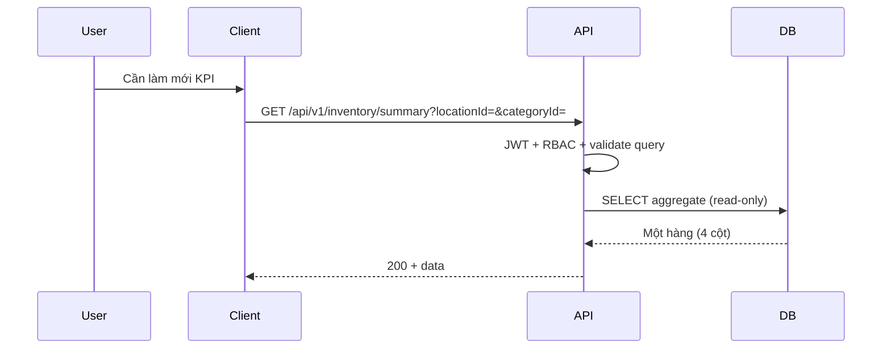

# SRS — Task009 — `GET /api/v1/inventory/summary` — KPI tồn kho (tách payload)

> **File (Spring / `smart-erp`):** `backend/docs/srs/SRS_Task009_inventory-get-summary.md`  
> **Người soạn:** Agent BA_SQL (Draft)  
> **Ngày:** 25/04/2026  
> **Trạng thái:** Draft  
> **PO duyệt (khi Approved):** _chưa_

---

## 0. Đầu vào & traceability

| Nguồn | Đường dẫn / ghi chú |
| :--- | :--- |
| API spec | [`../../../frontend/docs/api/API_Task009_inventory_get_summary.md`](../../../frontend/docs/api/API_Task009_inventory_get_summary.md) |
| KPI đồng nghĩa | [`../../../frontend/docs/api/API_Task005_inventory_get_list.md`](../../../frontend/docs/api/API_Task005_inventory_get_list.md) — `data.summary` (cùng bốn chỉ số, cùng công thức) |
| SRS list (Task005) | [`SRS_Task005_inventory-get-list.md`](SRS_Task005_inventory-get-list.md) — mục 6 (BR), mục 9 (SQL aggregate) |
| UC / DB | [`../../../frontend/docs/UC/Database_Specification.md`](../../../frontend/docs/UC/Database_Specification.md) — tồn kho UC6 (tham chiếu chữ) |
| Flyway | [`../../smart-erp/src/main/resources/db/migration/V1__baseline_smart_inventory.sql`](../../smart-erp/src/main/resources/db/migration/V1__baseline_smart_inventory.sql), [`../../smart-erp/src/main/resources/db/migration/V7__task007_inventory_unit_id.sql`](../../smart-erp/src/main/resources/db/migration/V7__task007_inventory_unit_id.sql) |

---

## 1. Tóm tắt điều hành

- **Vấn đề:** `GET /api/v1/inventory` (Task005) trả `summary` + `items`; khi bảng lớn hoặc FE chỉ cần **làm mới bốn thẻ KPI** (poll sau Task010, v.v.), tải lại cả danh sách là lãng phí.
- **Mục tiêu nghiệp vụ:** Endpoint **chỉ đọc** trả **đúng bốn KPI** trong một response nhẹ, **cùng định nghĩa** với `data.summary` của Task005 trên cùng tập dòng tồn (sau filter được hỗ trợ).
- **Đối tượng:** Staff/Owner/Admin vận hành màn Tồn kho (UC6); client có thể gọi định kỳ mà không kéo `items`.

---

## 2. Bóc tách nghiệp vụ (capabilities)

| # | Capability | Kích hoạt bởi | Kết quả mong đợi | Ghi chú |
| :---: | :--- | :--- | :--- | :--- |
| C1 | Xác thực Bearer | Client gửi `Authorization` | 401 nếu thiếu/invalid/hết hạn | Giống Task005 |
| C2 | Kiểm tra quyền đọc tổng hợp tồn UC6 | JWT + policy dự án | 403 nếu không đủ quyền | Tham chiếu Task101 / `can_manage_inventory` khi triển khai đồng bộ Task005 |
| C3 | Validate query (`stockLevel`, `locationId`, `categoryId`, …) | Query string | 400 + `details` theo convention Task005 | Giống `InventoryListQuery` |
| C4 | Tổng hợp bốn KPI trên tập `Inventory` đã join | Request hợp lệ | Một hàng aggregate → JSON `data` | Không phân trang, không `items` |
| C5 | (Tuỳ chọn triển khai) Cache / materialized view | Tải cao / yêu cầu PO | Giảm tải DB trong TTL | **OQ-1** — không bắt buộc MVP |

---

## 3. Phạm vi

### 3.1 In-scope

- **`GET /api/v1/inventory/summary`**, Bearer bắt buộc.
- Query tùy chọn: **`search`**, **`stockLevel`** (theo Task005), `locationId`, `categoryId` — **PO OQ-2** mở rộng để KPI khớp bảng khi FE lọc.
- Response 200: `data` gồm `totalSkus`, `totalValue`, `lowStockCount`, `expiringSoonCount` — **cùng nghĩa và công thức** như Task005 `data.summary` trên **cùng predicate JOIN + WHERE** (mục 10) với cùng bộ filter.
- Lỗi: **400 / 401 / 403 / 500** theo mẫu API Task009 §8; **404** không áp dụng.

### 3.2 Out-of-scope

- Danh sách phân trang / `items` — Task005.
- Chi tiết một dòng — Task006; ghi meta — Task007/008; điều chỉnh số lượng — Task010.
- Đồng bộ hóa “đếm theo `product_id`” thay vì theo dòng tồn — nếu PO muốn, CR + OQ.

---

## 4. Câu hỏi làm rõ cho PO (Open Questions)

| ID | Câu hỏi | Ảnh hưởng nếu không trả lời | Blocker? |
| :--- | :--- | :--- | :---: |
| OQ-1 | Có bật **cache HTTP** (ETag/Cache-Control) hoặc **cache ứng dụng** (TTL) cho endpoint này không? Nếu có — TTL bao nhiêu giây và khi nào invalidate (vd. sau Task010)? | Dev chọn mặc định “không cache” hoặc tự đặt TTL không thống nhất | Không |
| OQ-2 | Task009 **chỉ** cho `locationId` + `categoryId`. Khi FE đang lọc Task005 theo `search` / `stockLevel`, KPI trên thẻ **không thể** khớp 1:1 qua Task009 trừ khi mở rộng query. PO có muốn **mở rộng** Task009 (thêm `search`, `stockLevel`) để đồng bộ KPI với bảng, hay giữ Task009 **chỉ** cho “toàn kho / theo kho / theo danh mục”? | Hiểu nhầm số KPI giữa poll summary và bảng đang lọc | Không (ghi rõ UX) |
| OQ-3 | Quyền endpoint: tài liệu API ghi “Owner, Staff, Admin”; Task005 triển khai thường gắn `can_manage_inventory`. **Một** authority cho `GET /inventory/summary`? | 403 không nhất quán giữa list và summary | Không |

**Trả lời PO (điền khi chốt):**

| ID | Quyết định PO | Ngày |
| :--- | :--- | :--- |
| OQ-1 | Không bật cache HTTP / cache ứng dụng cho MVP | 25/04/2026 |
| OQ-2 | Mở rộng Task009: thêm `search` + `stockLevel` giống Task005 để KPI đồng bộ bảng | 25/04/2026 |
| OQ-3 | Cùng quyền thao tác màn Tồn kho như Task005: **`can_manage_inventory`** | 25/04/2026 |

---

## 5. Phân tích scope tệp & bằng chứng (Evidence scope)

### 5.1 Tài liệu đã đối chiếu (read)

- `API_Task009_inventory_get_summary.md` (toàn bộ).
- `SRS_Task005_inventory-get-list.md` mục 6 (BR KPI), mục 9 (SQL).
- Flyway V1: `Inventory`, `Products`, `WarehouseLocations`, `ProductUnits`, `ProductPriceHistory`; V7: `inventory.unit_id` (không đổi công thức KPI aggregate trong SRS này — giá vốn vẫn theo base unit + PPH như Task005).

### 5.2 Mã / migration dự kiến (write / verify)

- `InventoryController` (hoặc tách handler): mapping `GET /api/v1/inventory/summary`.
- `InventoryListService` / repository JDBC: tái sử dụng predicate JOIN/WHERE với Task005 **hoặc** trích CTE dùng chung để tránh lệch số.
- Không migration bắt buộc cho MVP; index tùy chọn giống Task005 §9.1.

### 5.3 Rủi ro phát hiện sớm

- Hai endpoint (005 vs 009) nếu **duplicate logic** không tái sử dụng → lệch KPI sau một lần refactor.
- Poll quá dày không cache → tải DB (giảm bằng OQ-1 hoặc giới hạn phía FE).

---

## 6. Persona & RBAC

| Vai trò | Quyền / điều kiện | HTTP khi từ chối |
| :--- | :--- | :--- |
| Người dùng đã đăng nhập | `hasAuthority('can_manage_inventory')` — đồng bộ Task005 / OQ-3 | 403 |
| Chưa đăng nhập / token hỏng | — | 401 |

---

## 7. Actor & luồng nghiệp vụ

### 7.1 Danh sách actor

| Actor | Mô tả ngắn |
| :--- | :--- |
| End user | Xem / làm mới KPI tồn |
| Client (FE) | Gọi `GET /inventory/summary` (poll hoặc sau điều chỉnh tồn) |
| API (`smart-erp`) | Validate → aggregate → JSON |
| Database | PostgreSQL — đọc các bảng mục 10 |

### 7.2 Luồng chính (narrative)

1. Client gửi `GET` kèm Bearer và query tùy chọn.
2. API xác thực JWT; kiểm tra RBAC.
3. Validate query (cùng parser Task005: `stockLevel`, `locationId`, `categoryId`, …); nếu sai → 400.
4. Thực thi **một** truy vấn aggregate (hoặc tách tối thiểu vẫn read-only, cùng snapshot) với JOIN/WHERE mục 10.
5. Map kết quả → `data`; trả 200 + message theo envelope.

### 7.3 Sơ đồ



---

## 8. Hợp đồng HTTP & ví dụ JSON

### 8.1 Tổng quan endpoint

| Thuộc tính | Giá trị |
| :--- | :--- |
| Method + path | `GET /api/v1/inventory/summary` |
| Auth | Bearer |
| Content-Type | _Không có body_ |

### 8.2 Request — schema logic (field-level)

| Field / param | Vị trí | Kiểu | Bắt buộc | Validation | Ghi chú |
| :--- | :--- | :--- | :---: | :--- | :--- |
| `search` | query | string | Không | Trim; ILIKE name/SKU | Giống Task005 |
| `stockLevel` | query | enum string | Không | `all` / `in_stock` / `low_stock` / `out_of_stock` | Giống Task005 |
| `locationId` | query | int | Không | Nếu có: > 0 | Lọc `i.location_id` |
| `categoryId` | query | int | Không | Nếu có: > 0 | Lọc `p.category_id` |

### 8.3 Request — ví dụ (URL)

```http
GET /api/v1/inventory/summary?search=nước&stockLevel=low_stock&locationId=3&categoryId=12
Authorization: Bearer <access_token>
```

### 8.4 Response thành công — ví dụ JSON đầy đủ (`200`)

```json
{
  "success": true,
  "data": {
    "totalSkus": 128,
    "totalValue": 452300000.5,
    "lowStockCount": 12,
    "expiringSoonCount": 5
  },
  "message": "Thành công"
}
```

### 8.5 Response lỗi — ví dụ JSON đầy đủ

**400 — query không hợp lệ**

```json
{
  "success": false,
  "error": "BAD_REQUEST",
  "message": "Tham số truy vấn không hợp lệ",
  "details": {
    "locationId": "Giá trị phải là số nguyên dương"
  }
}
```

**401 Unauthorized**

```json
{
  "success": false,
  "error": "UNAUTHORIZED",
  "message": "Phiên đăng nhập không hợp lệ hoặc đã hết hạn"
}
```

**403 Forbidden**

```json
{
  "success": false,
  "error": "FORBIDDEN",
  "message": "Bạn không có quyền xem tổng hợp KPI tồn kho"
}
```

**500 Internal Server Error**

```json
{
  "success": false,
  "error": "INTERNAL_ERROR",
  "message": "Hệ thống đang gặp sự cố. Vui lòng thử lại sau."
}
```

### 8.6 Ghi chú envelope

- Khớp [`API_RESPONSE_ENVELOPE.md`](../../../frontend/docs/api/API_RESPONSE_ENVELOPE.md) dự án; mã lỗi string theo convention hiện có (`BAD_REQUEST`, …).

---

## 9. Quy tắc nghiệp vụ (bảng)

| Mã | Điều kiện | Hành động / kết quả |
| :--- | :--- | :--- |
| BR-1 | Cùng JOIN `Inventory` → `Products` → `WarehouseLocations` → `ProductUnits` (base) + LATERAL giá mới nhất như Task005 | Bốn KPI tính trên tập dòng thỏa `WHERE` |
| BR-2 | `totalSkus` | `COUNT(*)` các dòng tồn sau filter — đồng nghĩa `data.total` Task005 **khi** cùng `search` / `stockLevel` / `locationId` / `categoryId` |
| BR-3 | `lowStockCount` | `quantity > 0 AND quantity <= min_quantity` |
| BR-4 | `expiringSoonCount` | `expiry_date IS NOT NULL AND expiry_date <= CURRENT_DATE + 30 days AND quantity > 0` |
| BR-5 | `totalValue` | `SUM(quantity * COALESCE(latest_cost, 0))` với `latest_cost` từ `ProductPriceHistory` theo `product_id` + `unit_id` đơn vị cơ sở, `ORDER BY effective_date DESC, id DESC LIMIT 1` |
| BR-6 | `locationId` trong query | Thêm `AND i.location_id = :locationId` |
| BR-7 | `categoryId` trong query | Thêm `AND p.category_id = :categoryId` |
| BR-8 | Read-only | Không `INSERT/UPDATE/DELETE`; `@Transactional(readOnly = true)` khuyến nghị |

---

## 10. Dữ liệu & SQL tham chiếu (phối hợp Agent SQL)

> PostgreSQL, tên bảng/cột theo V1 (+ comment V7). Placeholder `:location_id` / `:category_id` tùy chọn; `/* rbac */` giữ chỗ policy đa-tenant nếu sau này bổ sung (giống Task005).

### 10.1 Bảng / quan hệ (tên Flyway)

| Bảng | Read / Write | Ghi chú |
| :--- | :--- | :--- |
| `Inventory` | Read | `quantity`, `min_quantity`, `location_id`, `expiry_date` |
| `Products` | Read | `category_id`, join `product_id` |
| `WarehouseLocations` | Read | Đồng nhất phạm vi join với Task005 (list) |
| `ProductUnits` | Read | `is_base_unit = true` |
| `ProductPriceHistory` | Read | LATERAL bản mới nhất theo base `unit_id` |

### 10.2 SQL aggregate (hợp đồng tham chiếu)

```sql
SELECT
  COUNT(*)::bigint AS total_skus,
  COALESCE(
    SUM(i.quantity::numeric * COALESCE(pph.latest_cost::numeric, 0)),
    0
  ) AS total_value,
  COUNT(*) FILTER (
    WHERE i.quantity > 0 AND i.quantity <= i.min_quantity
  ) AS low_stock_count,
  COUNT(*) FILTER (
    WHERE i.expiry_date IS NOT NULL
      AND i.expiry_date <= (CURRENT_DATE + INTERVAL '30 days')
      AND i.quantity > 0
  ) AS expiring_soon_count
FROM inventory i
INNER JOIN products p ON p.id = i.product_id
INNER JOIN warehouselocations wl ON wl.id = i.location_id
INNER JOIN productunits pu ON pu.product_id = p.id AND pu.is_base_unit = TRUE
LEFT JOIN LATERAL (
  SELECT pph_1.cost_price AS latest_cost
  FROM productpricehistory pph_1
  WHERE pph_1.product_id = p.id AND pph_1.unit_id = pu.id
  ORDER BY pph_1.effective_date DESC, pph_1.id DESC
  LIMIT 1
) pph ON TRUE
WHERE 1 = 1
  /* rbac */
  /* + điều kiện stockLevel / search / locationId / categoryId — cùng buildFilter Task005 (InventoryListJdbcRepository) */
;
```

_Ghi chú:_ Trên PostgreSQL thực tế, tên vật lý có thể lowercase nếu DDL không quote; Dev đồng bộ đúng tên đang dùng trong JDBC mapper của Task005.

### 10.3 Index & hiệu năng

- Tận dụng `idx_inv_product`, `idx_inv_expiry_date`, `idx_price_lookup` (V1) như Task005 §9.1.
- Nếu filter `category_id` nặng và `EXPLAIN` thiếu index: xem đề xuất `idx_products_category_id` trong Task005 (migration tách nếu PO/TL duyệt).

### 10.4 Transaction & khóa

- Một request: **read-only**, không cần `FOR UPDATE`.
- Snapshot tại thời điểm đọc — chấp nhận lệch nhỏ nếu đồng thời có ghi tồn (Task010), trừ khi PO yêu cầu NFR siết (OQ-1).

### 10.5 Kiểm chứng dữ liệu cho Tester

- Seed có ít nhất 1 dòng low stock, 1 dòng expiring soon, 1 dòng `quantity = 0`; gọi summary không filter → bốn số khớp manual đếm trên cùng dataset với query mục 10.2.
- Với `?locationId=` trỏ tới vị trí chỉ có một phần dòng → `totalSkus` khớp `COUNT` có cùng điều kiện.

---

## 11. Acceptance criteria (Given / When / Then)

```text
Given người dùng đã xác thực và đủ quyền đọc tồn (theo OQ-3 / Task005)
When GET /api/v1/inventory/summary không query
Then HTTP 200, success = true, data có đúng bốn khóa kiểu số, message theo envelope
```

```text
Given dữ liệu seed cố định
When GET summary và chạy SQL aggregate mục 10.2 cùng WHERE (không rbac)
Then totalSkus, totalValue, lowStockCount, expiringSoonCount khớp (sai số totalValue trong giới hạn làm tròn đã thống nhất Task005)
```

```text
Given locationId=abc
When GET /api/v1/inventory/summary
Then HTTP 400 và details.locationId (hoặc key tương đương convention dự án)
```

```text
Given token hết hạn
When GET summary
Then HTTP 401
```

```text
Given role không có quyền đọc tồn
When GET summary
Then HTTP 403
```

---

## 12. GAP & giả định

| GAP / Giả định | Tác động | Hành động đề xuất |
| :--- | :--- | :--- |
| OQ-1..3 đã chốt (mục 4) | — | Triển khai: `InventoryListService#summary` + `GET /inventory/summary` |
| Lỗi 500 `INTERNAL_ERROR` vs mã khác trong codebase | Khác biệt copy | Đối chiếu `GlobalExceptionHandler` khi test thủ công |

---

## 13. PO sign-off (chỉ điền khi Approved)

- [ ] Đã trả lời / đóng các **OQ** ảnh hưởng triển khai
- [ ] JSON response khớp `API_Task009`
- [ ] Phạm vi In/Out đã đồng ý

**Chữ ký / nhãn PR:** _chưa_
