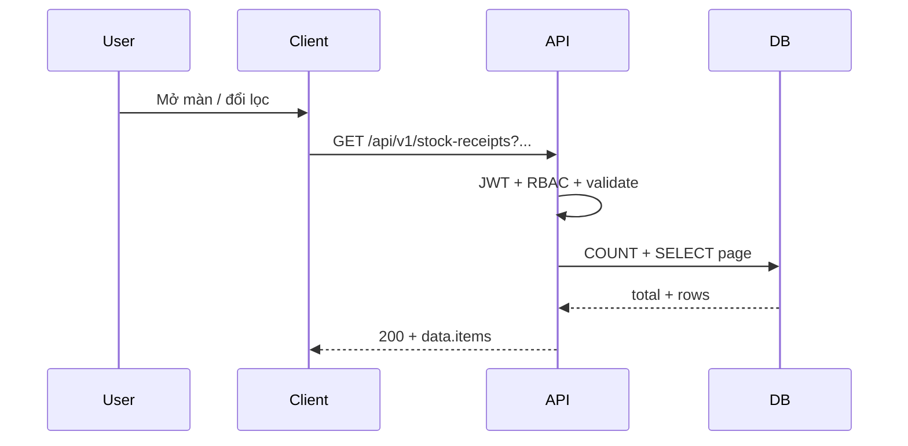

# SRS — Task013 — `GET /api/v1/stock-receipts` — Danh sách phiếu nhập kho

> **File (Spring / `smart-erp`):** `backend/docs/srs/SRS_Task013_stock-receipts-get-list.md`  
> **Người soạn:** Agent BA_SQL (Draft)  
> **Ngày:** 26/04/2026  
> **Trạng thái:** Draft  
> **PO duyệt (khi Approved):** _chưa_

---

## 0. Đầu vào & traceability

| Nguồn | Đường dẫn / ghi chú |
| :--- | :--- |
| API spec | [`../../../frontend/docs/api/API_Task013_stock_receipts_get_list.md`](../../../frontend/docs/api/API_Task013_stock_receipts_get_list.md) |
| UC / UI | UC7 — `InboundPage`, `ReceiptTable` (`frontend/mini-erp/src/features/inventory/pages/InboundPage.tsx`) |
| Thiết kế API | [`../../../frontend/docs/api/API_PROJECT_DESIGN.md`](../../../frontend/docs/api/API_PROJECT_DESIGN.md) §4.8 (nếu có) |
| UC / DB (mô tả bổ sung cột) | [`../../../frontend/docs/UC/Database_Specification.md`](../../../frontend/docs/UC/Database_Specification.md) §17–§18 |
| Flyway thực tế (V1) | [`../../smart-erp/src/main/resources/db/migration/V1__baseline_smart_inventory.sql`](../../smart-erp/src/main/resources/db/migration/V1__baseline_smart_inventory.sql) — `StockReceipts`, `StockReceiptDetails`, `Suppliers`, `Users` |

---

## 1. Tóm tắt điều hành

- **Vấn đề:** Màn Phiếu nhập kho đang dựa mock / lọc client; cần **một endpoint đọc** trả danh sách phiếu có **phân trang**, lọc theo mã/HĐ, trạng thái, ngày, NCC, và **`lineCount`** (không kéo full `StockReceiptDetails`).
- **Mục tiêu:** Hợp đồng `GET /api/v1/stock-receipts` (query §5.2 API), response `items` + `page` / `limit` / `total`, map camelCase, read-only.
- **Đối tượng:** nhân viên kho / Owner / Admin trong phạm vi UC7 (theo API §4).

---

## 2. Bóc tách nghiệp vụ (capabilities)

| # | Capability | Kích hoạt bởi | Kết quả mong đợi | Ghi chú |
| :---: | :--- | :--- | :--- | :--- |
| C1 | Xác thực Bearer | Client | 401 nếu token không hợp lệ | Giống Task005 |
| C2 | RBAC đọc phiếu nhập UC7 | JWT + policy | 403 nếu không đủ quyền | **OQ-2** — tên authority |
| C3 | Validate query (`status`, `page`, `limit`, ngày, `sort`) | Query string | 400 + `details` | Theo API §9 |
| C4 | Đếm tổng phiếu thỏa filter | Sau validate | `total` khớp `COUNT` cùng WHERE với list | Tránh lệch phân trang |
| C5 | Đọc một trang phiếu + join hiển thị + `lineCount` | `page`/`limit` | Mảng `items` read-model | Không SELECT * |
| C6 | Trả envelope thành công | Luồng OK | `success`, `data`, `message` | Theo envelope dự án |

---

## 3. Phạm vi

### 3.1 In-scope

- **`GET /api/v1/stock-receipts`**, Bearer bắt buộc.
- Query: `search`, `status`, `dateFrom`, `dateTo`, `supplierId`, `page`, `limit`, `sort` — theo API Task013 §5.2; mặc định `page=1`, `limit=20`, `sort=receiptDate:desc` (hoặc tương đương nghiệp vụ).
- Response: `data.items[]` đủ field như mẫu API §7; `data.page`, `data.limit`, `data.total`.
- Lỗi: **400 / 401 / 403 / 500** theo API §9; **404** không áp dụng collection.

### 3.2 Out-of-scope

- Chi tiết một phiếu — **Task015**; tạo/sửa/xóa/gửi duyệt/phê duyệt — Task014,016–020.
- Danh sách master NCC/SP — endpoint riêng (API §1 Out of scope).

---

## 4. Câu hỏi làm rõ cho PO (Open Questions)

| ID | Câu hỏi | Ảnh hưởng nếu không trả lời | Blocker? |
| :--- | :--- | :--- | :---: |
| OQ-1 | API/UC mô tả `rejection_reason`, `reviewed_at`, `reviewed_by` trên `StockReceipts`, nhưng **Flyway V1** chưa có các cột này. PO chọn: **(A)** migration Flyway bổ sung cột + index trước Task013, hay **(B)** triển khai list trả các field này **luôn null** đến khi có migration? | JSON lệch DB hoặc DDL thiếu | **Có** (chọn A hoặc B) |
| OQ-2 | Quyền đọc list: dùng chung `can_manage_inventory` với tồn kho, hay quyền riêng UC7 (vd. `can_manage_stock_receipts`)? | 403 / cấu hình Security không nhất quán | Không |
| OQ-3 | `sort` whitelist: chỉ `receiptDate:asc\|desc` và `createdAt:asc\|desc` + `receiptCode`, hay mở rộng? | Dev tự mở rộng không kiểm soát → rủi ro ORDER BY injection / cột lạ | Không |
| OQ-4 | Khi `dateFrom` > `dateTo`: **400** hay trả rỗng? | Hành vi test không rõ | Không |

**Trả lời PO (điền khi chốt):**

| ID | Quyết định PO | Ngày |
| :--- | :--- | :--- |
| OQ-1 | A | |
| OQ-2 | Ai cũng có quyền vào và thao tác với phiếu nhập kho hết | |
| OQ-3 | sort theo ID | |
| OQ-4 | Báo lỗi ở giao diện hiển thị text màu đỏ | |

---

## 5. Phân tích scope tệp & bằng chứng (Evidence scope)

### 5.1 Tài liệu đã đối chiếu (read)

- `API_Task013_stock_receipts_get_list.md` (toàn bộ).
- Flyway V1: `StockReceipts`, `StockReceiptDetails`, `Suppliers`, `Users`.
- `Database_Specification.md` §17 (cột mở rộng so với V1 — xem OQ-1).

### 5.2 Mã / migration dự kiến (write / verify)

- Controller `GET /api/v1/stock-receipts` (package `inventory` hoặc `stock` — **chốt** khi Tech Lead tổ chức module).
- Service + JDBC repository: query list + count; map → DTO/record JSON.
- Nếu **OQ-1 = A**: migration `Vn__stock_receipts_review_columns.sql` theo snippet UC §17 (PostgreSQL).

### 5.3 Rủi ro phát hiện sớm

- Subquery `line_count` trên mỗi dòng list: với bảng lớn cân nhắc **JOIN aggregate** `(SELECT receipt_id, COUNT(*) … GROUP BY receipt_id)` thay vì correlated subquery — đo `EXPLAIN` trên dữ liệu thật.

---

## 6. Persona & RBAC

| Vai trò | Quyền / điều kiện | HTTP khi từ chối |
| :--- | :--- | :--- |
| User đã đăng nhập | Theo **OQ-2** | 403 |
| Token không hợp lệ | — | 401 |

---

## 7. Actor & luồng nghiệp vụ

### 7.1 Danh sách actor

| Actor | Mô tả |
| :--- | :--- |
| End user | Xem / lọc / phân trang phiếu nhập |
| Client (FE) | Gọi `GET /stock-receipts` |
| API | Validate, RBAC, đọc DB |
| DB | PostgreSQL |

### 7.2 Luồng chính

1. Client gửi GET + query + Bearer.
2. API xác thực JWT → RBAC.
3. Validate tham số → 400 nếu sai.
4. `COUNT(*)` với JOIN/WHERE thống nhất.
5. `SELECT` trang + ORDER BY + LIMIT/OFFSET (hoặc keyset nếu ADR sau này).
6. Map → JSON 200.

### 7.3 Sơ đồ



---

## 8. Hợp đồng HTTP & ví dụ JSON

### 8.1 Tổng quan endpoint

| Thuộc tính | Giá trị |
| :--- | :--- |
| Method + path | `GET /api/v1/stock-receipts` |
| Auth | Bearer |
| Body | Không |

### 8.2 Request — schema logic (field-level)

| Param | Kiểu | Bắt buộc | Mặc định | Validation / ghi chú |
| :--- | :--- | :---: | :--- | :--- |
| `search` | string | Không | — | `receipt_code` ILIKE hoặc `invoice_number` ILIKE (API §5.2) |
| `status` | string | Không | `all` | `all` \| `Draft` \| `Pending` \| `Approved` \| `Rejected` |
| `dateFrom` | date (YYYY-MM-DD) | Không | — | `receipt_date >= dateFrom` |
| `dateTo` | date (YYYY-MM-DD) | Không | — | `receipt_date <= dateTo` |
| `supplierId` | int | Không | — | `> 0` → lọc `supplier_id` |
| `page` | int | Không | `1` | ≥ 1 |
| `limit` | int | Không | `20` | 1–100 |
| `sort` | string | Không | `receiptDate:desc` | Whitelist **OQ-3** |

### 8.3 Response thành công — ví dụ JSON (`200`)

Theo [`API_Task013_stock_receipts_get_list.md`](../../../frontend/docs/api/API_Task013_stock_receipts_get_list.md) §7 (nguyên văn cấu trúc `data`).

### 8.4 Response lỗi — ví dụ JSON

**400** — theo mẫu API §9 (vd. `details.status`).

**401 / 403 / 500** — theo mẫu API §9.

### 8.5 Ghi chú envelope

- `success`, `error`, `message`, `details`, `data` — khớp [`API_RESPONSE_ENVELOPE.md`](../../../frontend/docs/api/API_RESPONSE_ENVELOPE.md).

---

## 9. Quy tắc nghiệp vụ (bảng)

| Mã | Điều kiện | Hành động / kết quả |
| :--- | :--- | :--- |
| BR-1 | `status = all` | Không thêm predicate `status` trên `sr.status` |
| BR-2 | `status` cụ thể | `sr.status = :status` (chuỗi khớp CHECK V1) |
| BR-3 | `search` có giá trị (sau trim) | `(sr.receipt_code ILIKE :pat OR sr.invoice_number ILIKE :pat)` — escape `%`/`_` như Task005 `buildSearchPattern` |
| BR-4 | `dateFrom` / `dateTo` | So sánh với `sr.receipt_date` kiểu DATE; timezone: **ngày theo calendar** (OQ nếu cần UTC end-of-day) |
| BR-5 | `supplierId` | `sr.supplier_id = :supplierId` |
| BR-6 | `lineCount` | Số dòng `stock_receipt_details` với `receipt_id = sr.id` — **COUNT(\*)** integer ≥ 0 |
| BR-7 | `staffName` / `supplierName` / tên duyệt | JOIN `users`, `suppliers`; alias display `full_name` / `name` |
| BR-8 | Read-only | `@Transactional(readOnly = true)`; không ghi bảng |

---

## 10. Dữ liệu & SQL tham chiếu (Agent SQL — PostgreSQL / tên bảng thực tế lowercase)

> Điều kiện WHERE `/* rbac */` giữ chỗ đa-tenant nếu sau này bổ sung. Cột `reviewed_*`, `rejection_reason`: chỉ đưa vào SELECT khi đã có migration (**OQ-1**).

### 10.1 Bảng tham gia (V1)

| Bảng | Read | Ghi chú |
| :--- | :--- | :--- |
| `stock_receipts` | ✓ | `receipt_code`, `supplier_id`, `staff_id`, `receipt_date`, `status`, `invoice_number`, `total_amount`, `notes`, `approved_by`, `approved_at`, `created_at`, `updated_at` |
| `suppliers` | ✓ | `name` → `supplierName` |
| `users` | ✓ | Alias staff: `u_staff.full_name`; LEFT JOIN approver `u_appr`; sau migration LEFT JOIN reviewer `u_rev` |
| `stock_receipt_details` | ✓ (aggregate) | Đếm `line_count` |

### 10.2 COUNT (cùng JOIN/WHERE với list)

```sql
SELECT COUNT(*)::bigint
FROM stock_receipts sr
INNER JOIN suppliers s ON s.id = sr.supplier_id
INNER JOIN users u_staff ON u_staff.id = sr.staff_id
LEFT JOIN users u_appr ON u_appr.id = sr.approved_by
WHERE 1 = 1
  /* rbac */
  /* + filters: status, search, dateFrom/dateTo, supplierId */
;
```

### 10.3 SELECT trang (mẫu — correlated count; có thể thay bằng JOIN nhóm sau tối ưu)

```sql
SELECT
  sr.id,
  sr.receipt_code,
  sr.supplier_id,
  s.name AS supplier_name,
  sr.staff_id,
  u_staff.full_name AS staff_name,
  sr.receipt_date,
  sr.status,
  sr.invoice_number,
  sr.total_amount,
  sr.notes,
  sr.approved_by,
  u_appr.full_name AS approved_by_name,
  sr.approved_at,
  sr.created_at,
  sr.updated_at,
  (SELECT COUNT(*)::int FROM stock_receipt_details d WHERE d.receipt_id = sr.id) AS line_count
  /* , sr.rejection_reason, sr.reviewed_by, u_rev.full_name, sr.reviewed_at — khi OQ-1 = A */
FROM stock_receipts sr
INNER JOIN suppliers s ON s.id = sr.supplier_id
INNER JOIN users u_staff ON u_staff.id = sr.staff_id
LEFT JOIN users u_appr ON u_appr.id = sr.approved_by
WHERE 1 = 1
  /* rbac + filters */
ORDER BY sr.receipt_date DESC, sr.id DESC
LIMIT :limit OFFSET :offset;
```

### 10.4 Index đề xuất

- V1 đã có: `idx_sr_supplier`, `idx_sr_status`.
- **Đề xuất bổ sung** (migration riêng nếu `EXPLAIN` thiếu): `CREATE INDEX idx_sr_receipt_date ON stock_receipts (receipt_date DESC, id DESC);` phục vụ sort/lọc ngày.

### 10.5 Transaction

- Read-only; không `FOR UPDATE`.

---

## 11. Acceptance criteria (Given / When / Then)

```text
Given user đã đăng nhập và đủ quyền (OQ-2)
When GET /api/v1/stock-receipts không query
Then 200, data.items là mảng, data.page = 1, data.limit = 20 (mặc định), data.total >= 0
```

```text
Given có ít nhất một phiếu và total > limit
When page=2, limit=20
Then len(items) <= 20, total không đổi, không lệch COUNT
```

```text
Given status=Wrong
When GET
Then 400 và details.status (hoặc key convention dự án)
```

```text
Given token hết hạn
When GET
Then 401
```

---

## 12. GAP & giả định

| GAP / Giả định | Tác động | Hành động đề xuất |
| :--- | :--- | :--- |
| UC §17 vs Flyway V1 thiếu `reviewed_*`, `rejection_reason` | Response JSON §7 có field DB chưa có | **OQ-1** + migration hoặc null tạm |
| `StockReceiptDetails.quantity` V1 là INT; UC §18 ghi DECIMAL | Kiểu map / validation chi tiết phiếu | Ghi nhận; Task015 chi tiết dòng |

---

## 13. PO sign-off (chỉ điền khi Approved)

- [ ] OQ-1 đã chốt (migration hoặc null tạm)
- [ ] JSON list khớp `API_Task013`
- [ ] Phạm vi In/Out đã đồng ý

**Chữ ký / nhãn PR:** _chưa_
