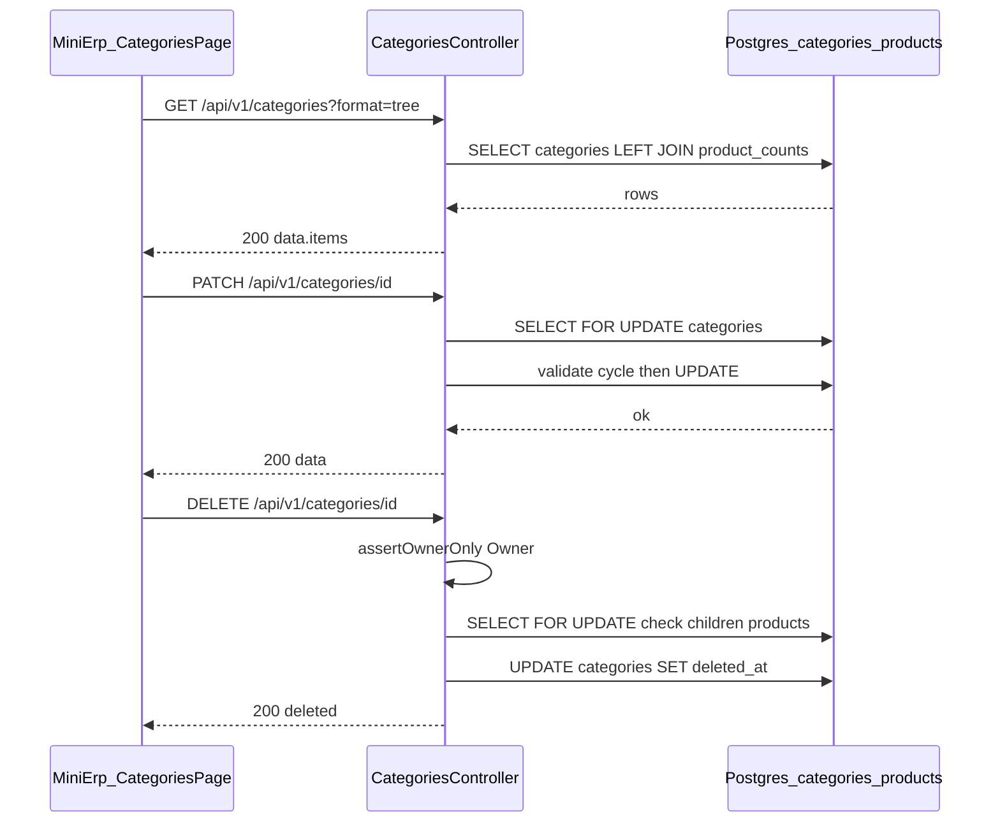

# SRS — Quản lý danh mục sản phẩm (CRUD + cây) — Task029–Task033

> **File (Spring / `smart-erp`):** `backend/docs/srs/SRS_Task029-033_categories-management.md`  
> **Người soạn:** Agent BA + SQL (theo plan)  
> **Ngày:** 26/04/2026  
> **Trạng thái:** Draft  
> **PO duyệt (khi Approved):** _(chưa)_

---

## 0. Đầu vào & traceability

| Nguồn | Đường dẫn / ghi chú |
| :--- | :--- |
| API Task029 | [`../../../frontend/docs/api/API_Task029_categories_get_list.md`](../../../frontend/docs/api/API_Task029_categories_get_list.md) |
| API Task030 | [`../../../frontend/docs/api/API_Task030_categories_post.md`](../../../frontend/docs/api/API_Task030_categories_post.md) |
| API Task031 | [`../../../frontend/docs/api/API_Task031_categories_get_by_id.md`](../../../frontend/docs/api/API_Task031_categories_get_by_id.md) |
| API Task032 | [`../../../frontend/docs/api/API_Task032_categories_patch.md`](../../../frontend/docs/api/API_Task032_categories_patch.md) |
| API Task033 | [`../../../frontend/docs/api/API_Task033_categories_delete.md`](../../../frontend/docs/api/API_Task033_categories_delete.md) |
| Khung API design | [`../../../frontend/docs/api/API_PROJECT_DESIGN.md`](../../../frontend/docs/api/API_PROJECT_DESIGN.md) §4.9 |
| UC / DB tham chiếu | [`../../../frontend/docs/UC/Database_Specification.md`](../../../frontend/docs/UC/Database_Specification.md) §2 `Categories` (đối chiếu Flyway) |
| Flyway thực tế | [`../../smart-erp/src/main/resources/db/migration/V1__baseline_smart_inventory.sql`](../../smart-erp/src/main/resources/db/migration/V1__baseline_smart_inventory.sql) — bảng `Categories` / `Products` (PostgreSQL: tên vật lý **`categories`**, **`products`**) |
| UI index | [`../../../frontend/mini-erp/src/features/FEATURES_UI_INDEX.md`](../../../frontend/mini-erp/src/features/FEATURES_UI_INDEX.md) |
| Quyền seed | Cùng file V1 — `Roles.permissions` có `can_manage_products` |
| PO / chỉ đạo RBAC + xóa + PATCH | **Yêu cầu chỉnh SRS:** xem §1, §4 (**OQ-1–OQ-3 đã chốt**), §6, §10 — mọi user có `can_manage_products` đều được xem / tạo / chi tiết / thêm con / sửa; **chỉ Owner** được `DELETE` (**soft-delete**); **OQ-2-B** + **OQ-3 (a):** không hỗ trợ đưa node lên gốc qua `PATCH` trong v1. |

---

## 1. Tóm tắt điều hành

- **Vấn đề:** Mini-ERP UC8 cần API thật thay mock cho **danh mục phân cấp** (cây / phẳng), **đếm sản phẩm** theo node, **tạo / xem / sửa** và **đánh dấu xóa mềm** với ràng buộc toàn vẹn (chu trình `parent_id`, không xóa cứng khi còn con đang hiệu lực hoặc còn SP gán trực tiếp).
- **Mục tiêu nghiệp vụ:** Cung cấp 5 endpoint REST dưới `/api/v1/categories` khớp envelope dự án; **đọc + POST + PATCH:** mọi user có `can_manage_products` (Owner / Staff / Admin seed — **không** phân biệt vai trò); **`DELETE`:** **chỉ Owner** (`Jwt` claim `role`, pattern `StockReceiptAccessPolicy.assertOwnerOnly`) và thực hiện **soft-delete** (`deleted_at`), không `DELETE` vật lý row trong luồng chuẩn.
- **Đối tượng:** User đã đăng nhập; tầng nghiệp vụ danh mục: **Staff + Owner + Admin** đều có thể xem / tạo / sửa nếu có `can_manage_products`; **Owner** thêm quyền soft-delete.

### 1.1 Giao diện Mini-ERP

| Nhãn menu (Sidebar) | Route | Page (export) | Component / vùng chính | File (dưới `frontend/mini-erp/src/features/`) |
| :--- | :--- | :--- | :--- | :--- |
| Danh mục sản phẩm | `/products/categories` | `CategoriesPage` | `CategoryTable`, `CategoryToolbar`, `CategoryForm`, `CategoryDetailDialog` | `product-management/pages/CategoriesPage.tsx` |

---

## 2. Bóc tách nghiệp vụ (capabilities)

| # | Capability | Kích hoạt bởi | Kết quả mong đợi | Ghi chú |
| :---: | :--- | :--- | :--- | :--- |
| C1 | Liệt kê danh mục dạng cây hoặc phẳng | `GET /categories` + query | `200` + `data.items`; sort `sort_order`, `name`; lọc `status`, `search` | `format=tree` mặc định; `flat` có `parentId` |
| C2 | Giữ nhánh cây khi search | `GET` + `search` + `format=tree` | Chỉ trả các nhánh có node khớp hoặc con cháu khớp | Policy Task029 |
| C3 | Đếm SP trực tiếp theo node | Mọi response có `productCount` | `COUNT(*)` sản phẩm `category_id =` id node, **không** cộng dồn con | Đồng bộ Task029 / Task031 |
| C4 | Tạo danh mục | `POST /categories` | `201` + bản ghi mới; `productCount=0`, `children=[]` | Chặn `parentId` không tồn tại → **400** |
| C5 | Chi tiết một danh mục | `GET /categories/{id}` | `200` + breadcrumb + `parentName` + `productCount` | **404** nếu không tồn tại hoặc đã **soft-delete** (`deleted_at` not null) |
| C6 | Cập nhật một phần | `PATCH /categories/{id}` | `200` + object giống shape POST (không bắt buộc breadcrumb) | `FOR UPDATE`; chặn cycle → **409**; trùng code → **409**; **OQ-3 (a):** không hỗ trợ đưa node lên gốc qua PATCH |
| C7 | Đánh dấu xóa mềm (Owner) | `DELETE /categories/{id}` | `200` + `{ id, deleted: true }`; `UPDATE deleted_at` | **403** nếu không phải Owner; **409** nếu còn **con đang hiệu lực** (`deleted_at IS NULL`) hoặc còn SP `category_id = id` |

---

## 3. Phạm vi

### 3.1 In-scope

- Năm endpoint: Task029–033 như §8.
- Validation query/body; map lỗi 400/401/403/404/409 theo envelope.
- Đọc/ghi bảng `categories` (thêm cột **`deleted_at`** qua Flyway — chưa có trong V1), đọc đếm `products` (không đổi FK trong scope này).

### 3.2 Out-of-scope

- Task034+ (danh sách sản phẩm, bulk xóa SP, …).
- `POST /categories/bulk-delete` (ghi chú FE Task033 — backlog).
- Multi-tenant (Task029 ghi “tenant nếu có” — không v1).

---

## 4. Câu hỏi làm rõ cho PO (Open Questions)

**Trạng thái:** **OQ-1, OQ-2, OQ-3 đã có quyết định PO** — không còn OQ mở cho task này (v1). Mục **4.3** giữ bảng câu hỏi gốc để **traceability**; hành vi chốt nằm ở bảng **Trả lời PO** ngay dưới.

**Trả lời PO:**

| ID | Quyết định PO | Ngày |
| :--- | :--- | :--- |
| OQ-1 | **Chỉ Owner** được gọi `DELETE` (soft-delete). **Mọi** user có `can_manage_products` được GET list/detail + POST + PATCH (tạo, thêm con, sửa) — không kiểm tra `role` cho các endpoint đó. | 26/04/2026 |
| OQ-2 | **Semantic B — «Bỏ qua»:** trong `PATCH`, nếu client gửi **`"description": null`** hoặc **`"parentId": null`** thì backend **không** cập nhật cột tương ứng (coi như không đổi giá trị đang có). Chỉ các field **có giá trị không-null** (hoặc các field khác theo quy ước từng field) mới được merge vào bản ghi. | 26/04/2026 |
| OQ-3 | **Phương án (a):** Trong **v1 không hỗ trợ** đưa danh mục về **cấp gốc** (`parent_id = NULL`) qua `PATCH` — không thêm `setAsRoot`, không ngoại lệ `parentId: null` = gốc. Muốn danh mục ở gốc: tạo mới bằng `POST` với `parentId: null` hoặc backlog **(b)/(c)** cho v2. | 26/04/2026 |

### 4.1 Giải thích OQ-2 (đã chốt — semantic B)

`PATCH` là **cập nhật một phần**: client chỉ gửi các field muốn đổi. Vấn đề nằm ở chỗ **trong JSON có gửi hẳn key với giá trị `null`** — backend hiểu theo hai cách khác nhau:

| Cách | Ý nghĩa khi body có `"description": null` hoặc `"parentId": null` | Ví dụ hành vi |
| :--- | :--- | :--- |
| **A — `null` = ghi vào DB** | Key **có trong** request → coi như “tôi muốn xóa giá trị / gỡ cha”. | `description` trong DB thành `NULL`; `parent_id` thành `NULL` → danh mục thành **gốc** (root). |
| **B — `null` = bỏ qua (không đổi)** | Chỉ khi client **không gửi** key thì field đó giữ nguyên; gửi `null` coi như “không nói gì” / lỗi validation. | Muốn gỡ mô tả phải dùng API khác hoặc gửi sentinel (ít gặp). |

**Ví dụ cụ thể:** Trong DB, `description = 'Mô tả cũ'`, `parent_id = 5`.

- Body **`{ "name": "Tên mới" }`** — cả A và B đều giống nhau: chỉ đổi tên, `description` và `parent_id` **giữ nguyên**.
- Body **`{ "description": null }`** — **A:** xóa mô tả → DB `description = NULL`. **B:** không đụng `description` → vẫn `'Mô tả cũ'`.
- Body **`{ "parentId": null }`** — **A:** đưa node lên **gốc** (`parent_id = NULL`). **B:** không đổi cha (vẫn `5`) trừ khi PO quy định khác.

**Đã chốt:** **B** — merge PATCH: **`null` explicit trong JSON = không đổi cột** (không `SET … = NULL` chỉ vì client gửi `"field": null`). Bảng A/B phía trên giữ làm **tài liệu tham chiếu** (vì sao từng hỏi PO).

### 4.2 Hệ quả OQ-2-B & cách xử lý (cho Dev / FE)

| Nhu cầu | Với OQ-2-B | Phương án khuyến nghị |
| :--- | :--- | :--- |
| Đổi **mô tả** thành rỗng (xóa text) | `"description": null` **không** xóa DB | FE gửi **`"description": ""`** (chuỗi rỗng); BE validate `max` rồi **lưu `NULL`** trong DB (chuẩn hoá empty → NULL). **Hoặc** không gửi `description` nếu không đổi. |
| Đưa danh mục lên **cấp gốc** (`parent_id → NULL`) | `"parentId": null` **không** đổi cha (OQ-2-B) | **Đã chốt OQ-3 (a):** **v1 không hỗ trợ** “lên gốc” qua `PATCH` — chỉ tạo mới ở gốc bằng `POST` (`parentId: null`). V2 có thể mở **(b)** `setAsRoot` hoặc **(c)** ngoại lệ `parentId: null`. |

### 4.3 OQ-3 — Kéo danh mục lên gốc (`parent_id = NULL`) sau OQ-2-B *(đã chốt — lưu traceability)*

| ID | Câu hỏi | Ảnh hưởng | Blocker? |
| :--- | :--- | :--- | :--- |
| OQ-3 | Có cần hỗ trợ **đưa node về gốc** trong v1 không? Nếu có, chọn phương án: **(a)** không hỗ trợ PATCH (chỉ tạo con ở gốc bằng POST); **(b)** thêm field **`setAsRoot: true`** trong body PATCH; **(c)** cho phép **`parentId`: `null` = gốc** (ngoại lệ so với OQ-2 cho một field). | FE/BE biết contract chính xác | Không |

**Chốt:** PO chọn **(a)** — xem bảng **Trả lời PO** ở đầu §4 (cột OQ-3, ngày 26/04/2026).

---

## 5. Phân tích scope tệp & bằng chứng

### 5.1 Tài liệu đã đối chiếu

- Năm file `API_Task029` … `API_Task033` (đã đồng bộ nhỏ: parent invalid **400**; PATCH **200** shape; DELETE **200** envelope; Task031 `productCount`).
- `V1__baseline_smart_inventory.sql` (định nghĩa `categories`, `products`, FK, CHECK `status`).
- `FEATURES_UI_INDEX.md`, `Sidebar.tsx` (nhãn menu).
- `MenuPermissionClaims.java` / seed V1 — `can_manage_products`.

### 5.2 Mã / migration dự kiến

- **Controller mới:** ví dụ `com.example.smart_erp.product.categories.CategoriesController` hoặc `...inventory...` — chốt theo convention team; **hiện chưa có** `CategoriesController` trong repo (grep).
- **Service + repository:** JDBC hoặc JPA — một transaction cho PATCH/DELETE có `FOR UPDATE`.
- **DTO / validation:** query `format`, `status`, `search`; body POST/PATCH camelCase khớp API doc.
- **Migration (bắt buộc cho soft-delete):** Flyway **`V{n+1}__categories_soft_delete.sql`** — thêm `deleted_at TIMESTAMPTZ NULL` trên `categories`; mọi `SELECT` list/detail/build cây lọc `deleted_at IS NULL`. Tuỳ chọn: **partial unique** `category_code` chỉ trên bản ghi chưa xóa mềm — xem §10.1 ghi chú trùng mã.
- **Migration (tuỳ chọn):** index `idx_categories_parent_id` trên `categories(parent_id)` — **§10.3**.

### 5.3 Rủi ro phát hiện sớm

- DB FK `products.category_id` **ON DELETE SET NULL** — nghiệp vụ API **cứng hơn** (không soft-delete nếu còn SP gán trực tiếp); đúng với Task033 (đổi nghĩa thành **cập nhật `deleted_at`**).
- **Trùng `category_code` sau soft-delete:** UNIQUE toàn bảng V1 khiến bản ghi đã `deleted_at` vẫn chiếm mã — đề xuất partial unique (§10.1) hoặc chấp nhận không tái sử dụng mã cũ.
- SQL ví dụ trong API markdown có thể vẫn ghi `Categories` (PascalCase); PG thực thi **`categories`** — SRS §10 dùng lowercase.

---

## 6. Persona & RBAC

> **Chốt PO (SRS):** *Ai cũng có thể* trong phạm vi **đã đăng nhập + có `can_manage_products`** (Owner / Staff / Admin seed V1 **đều** `true`) — **không** phân biệt `role` cho xem / tạo / chi tiết / thêm con / sửa. **Chỉ Owner** được **`DELETE`** (soft-delete), kiểm tra **`StockReceiptAccessPolicy.assertOwnerOnly(jwt)`** trong service (giữ `@PreAuthorize('can_manage_products')` ở controller rồi phân nhánh Owner trong service — cùng pattern SRS phiếu nhập / kiểm kê).

| Endpoint | Điều kiện | HTTP khi từ chối |
| :--- | :--- | :--- |
| `GET /api/v1/categories`, `GET /api/v1/categories/{id}` | `hasAuthority('can_manage_products')` | 403 |
| `POST /api/v1/categories` | `hasAuthority('can_manage_products')` | 403 |
| `PATCH /api/v1/categories/{id}` | `hasAuthority('can_manage_products')` | 403 |
| `DELETE /api/v1/categories/{id}` | `hasAuthority('can_manage_products')` **và** `assertOwnerOnly(jwt)` | **403** (không phải Owner) |

JWT bắt buộc; **401** khi không xác thực — theo [`API_RESPONSE_ENVELOPE.md`](../../../frontend/docs/api/API_RESPONSE_ENVELOPE.md).

---

## 7. Actor & luồng nghiệp vụ

### 7.1 Danh sách actor

| Actor | Mô tả |
| :--- | :--- |
| End user | Staff / Owner / Admin — đọc & ghi danh mục: `can_manage_products`; **soft-delete:** Owner (`role` claim) |
| Client | Mini-ERP `CategoriesPage` |
| API | `smart-erp` REST |
| Database | PostgreSQL `categories`, `products` |

### 7.2 Luồng chính (rút gọn)

1. User mở `/products/categories` → Client gọi `GET /categories?format=tree` (và query lọc).
2. Tạo/sửa → `POST` / `PATCH`; server validate + (PATCH/DELETE) khóa dòng + kiểm tra cycle / con / SP.
3. **Owner** gọi `DELETE` → soft-delete (`deleted_at`) chỉ khi không còn **con đang hiệu lực** và không còn SP gán trực tiếp; Staff gọi `DELETE` → **403**.

### 7.3 Sơ đồ



---

## 8. Hợp đồng HTTP & ví dụ JSON

> Envelope: `success`, `data`, `message`, `error`, `details` — [`API_RESPONSE_ENVELOPE.md`](../../../frontend/docs/api/API_RESPONSE_ENVELOPE.md).

### 8.1 Bảng endpoint

| Task | Tên chức năng | Method | Path |
| :---: | :--- | :--- | :--- |
| 029 | Liệt kê / cây danh mục | GET | `/api/v1/categories` |
| 030 | Tạo danh mục | POST | `/api/v1/categories` |
| 031 | Chi tiết danh mục | GET | `/api/v1/categories/{id}` |
| 032 | Cập nhật danh mục | PATCH | `/api/v1/categories/{id}` |
| 033 | Xóa mềm danh mục (**Owner**) | DELETE | `/api/v1/categories/{id}` |

### 8.2 Task029 — Query & `200` (rút gọn)

Query: `format` = `tree` \| `flat` (mặc định `tree`); `search` (optional); `status` = `all` \| `Active` \| `Inactive` (mặc định `all`).

```json
{
  "success": true,
  "data": {
    "items": [
      {
        "id": 1,
        "categoryCode": "CAT001",
        "name": "Thực phẩm",
        "description": null,
        "parentId": null,
        "sortOrder": 1,
        "status": "Active",
        "productCount": 12,
        "createdAt": "2026-01-10T08:00:00Z",
        "updatedAt": "2026-04-20T10:00:00Z",
        "children": []
      }
    ]
  },
  "message": "Thành công"
}
```

**400 — query không hợp lệ**

```json
{
  "success": false,
  "error": "BAD_REQUEST",
  "message": "Tham số truy vấn không hợp lệ",
  "details": { "format": "Chỉ chấp nhận tree hoặc flat" }
}
```

### 8.3 Task030 — `POST` body & `201`

Request đầy đủ xem API doc; **400** khi `parentId` không tồn tại:

```json
{
  "success": false,
  "error": "BAD_REQUEST",
  "message": "parentId không hợp lệ",
  "details": { "parentId": "Không tồn tại danh mục cha" }
}
```

**409 — trùng `categoryCode`**

```json
{
  "success": false,
  "error": "CONFLICT",
  "message": "Mã danh mục đã tồn tại",
  "details": {}
}
```

### 8.4 Task031 — `404`

```json
{
  "success": false,
  "error": "NOT_FOUND",
  "message": "Không tìm thấy danh mục",
  "details": {}
}
```

### 8.5 Task032 — `409` chu trình

```json
{
  "success": false,
  "error": "CONFLICT",
  "message": "Không thể đặt danh mục cha vì tạo vòng lặp phân cấp",
  "details": {}
}
```

### 8.6 Task033 — `409` còn con hoặc SP

```json
{
  "success": false,
  "error": "CONFLICT",
  "message": "Không thể đánh dấu xóa: còn danh mục con đang hiệu lực hoặc còn sản phẩm gán vào danh mục này",
  "details": {}
}
```

### 8.7 Task033 — `403` (Staff gọi DELETE)

```json
{
  "success": false,
  "error": "FORBIDDEN",
  "message": "Chỉ tài khoản Owner mới được xóa mềm danh mục",
  "details": {}
}
```

### 8.8 `401` / `500`

- **401:** chưa đăng nhập / token không hợp lệ.
- **500:** lỗi server.

**403 (không đủ `can_manage_products`)** — áp dụng cho GET/POST/PATCH khi thiếu authority (khác với 403 Owner ở §8.7).

---

## 9. Quy tắc nghiệp vụ (BR)

| Mã | Điều kiện | Hành động / kết quả |
| :--- | :--- | :--- |
| BR-1 | `GET` list | `format`, `status` sai → 400 |
| BR-2 | `productCount` | Chỉ đếm `products.category_id = id` (trực tiếp) |
| BR-3 | `POST` / `PATCH` | `parent_id` trỏ tới id **không tồn tại** hoặc **đã soft-delete** (khi non-null) → 400 + details |
| BR-4 | `PATCH` | `parent_id` mới nằm trong tập hậu duệ của `id` → 409 (cycle) |
| BR-5 | `PATCH` / `POST` | `category_code` UNIQUE; vi phạm → 409 |
| BR-6 | `DELETE` (soft-delete) | Còn hàng **`categories.parent_id = id` AND `deleted_at IS NULL`** (con đang hiệu lực) → 409 |
| BR-7 | `DELETE` (soft-delete) | Còn hàng `products.category_id = id` → 409 |
| BR-8 | `status` | Chỉ `Active` \| `Inactive` (CHECK DB) |
| BR-9 | `GET` list / cây | Chỉ bản ghi **`deleted_at IS NULL`**; không hiển thị nhánh chỉ còn toàn tổ tiên đã xóa mềm (policy: cha đã xóa → con không còn context hiển thị — Dev có thể ẩn cả cây con hoặc 404 detail con; **chốt tối thiểu:** list không trả node đã xóa) |
| BR-10 | `POST` / `PATCH` `parentId` | `parent_id` trỏ tới danh mục **đã soft-delete** → **400** (coi như cha không hợp lệ) |
| BR-11 | `DELETE` | **Chỉ Owner**; Staff/Admin (không phải Owner) → **403** |
| BR-12 | `PATCH` (OQ-2-B) | Key có trong JSON với giá trị **`null`** → **không** cập nhật cột tương ứng. Cập nhật chỉ từ các field **được gửi với giá trị không phải “bỏ qua null”** (vd. `name`, `sortOrder`, `status`, `categoryCode`, `parentId` là số dương). **`description: ""`** → BE có thể chuẩn hoá thành `NULL` (§4.2). |
| BR-13 | `PATCH` (OQ-3 **a**) | Trong v1 **không** có cách `PATCH` hợp lệ để đặt `parent_id = NULL` (lên gốc). **`"parentId": null`** (OQ-2-B) **không** đổi cha; không thêm `setAsRoot` / ngoại lệ. Muốn bản ghi ở gốc → **`POST`** với `parentId: null` hoặc backlog v2 (phương án b/c trong §4.3). |

---

## 10. Dữ liệu & SQL tham chiếu

### 10.1 Bảng / quan hệ (PostgreSQL)

| Bảng vật lý | Read / Write | Ghi chú |
| :--- | :--- | :--- |
| `categories` | R/W | V1: `parent_id` self-FK `ON DELETE SET NULL`; `status` CHECK. **Migration mới:** `deleted_at TIMESTAMPTZ NULL` — soft-delete. |
| `products` | Read (count), không đổi trong task này | `category_id` FK → `categories`; `ON DELETE SET NULL` |

**DDL gợi ý (Flyway — bắt buộc trước khi triển khai `DELETE` mềm):**

```sql
ALTER TABLE categories
    ADD COLUMN IF NOT EXISTS deleted_at TIMESTAMPTZ NULL;
-- Tuỳ chọn (PO/TL): thả UNIQUE cũ + tạo partial unique để tái sử dụng category_code sau soft-delete
-- CREATE UNIQUE INDEX uq_categories_category_code_active ON categories (category_code) WHERE deleted_at IS NULL;
```

**Ghi chú `category_code`:** UNIQUE hiện tại (V1) áp cả bản ghi đã `deleted_at` — sau soft-delete, **tạo mới trùng mã** vẫn **409** trừ khi team áp dụng **partial unique** như trên (GAP nếu chưa migration).

### 10.2 SQL & transaction

**Đếm SP theo category (dùng trong list/detail)**

```sql
SELECT c.id, c.category_code, c.name, c.description, c.parent_id,
       c.sort_order, c.status, c.created_at, c.updated_at,
       COALESCE(pc.cnt, 0) AS product_count
FROM categories c
LEFT JOIN (
  SELECT category_id, COUNT(*)::int AS cnt
  FROM products
  WHERE category_id IS NOT NULL
  GROUP BY category_id
) pc ON pc.category_id = c.id
WHERE c.deleted_at IS NULL
  AND (:status_filter IS NULL OR c.status = :status_filter)
  AND (:search IS NULL OR c.name ILIKE :search OR c.category_code ILIKE :search);
```

**Breadcrumb / tổ tiên (Task031) — ví dụ recursive**

```sql
WITH RECURSIVE anc AS (
  SELECT id, parent_id, name, category_code, 1 AS lvl
  FROM categories WHERE id = :id AND deleted_at IS NULL
  UNION ALL
  SELECT c.id, c.parent_id, c.name, c.category_code, anc.lvl + 1
  FROM categories c
  INNER JOIN anc ON c.id = anc.parent_id
  WHERE c.deleted_at IS NULL
)
SELECT * FROM anc ORDER BY lvl DESC;
```

**PATCH — khóa + kiểm tra hậu duệ (ý tưởng BFS tập `descendant_ids`)**

- Một transaction: `SELECT * FROM categories WHERE id = :id AND deleted_at IS NULL FOR UPDATE`.
- Merge theo **BR-12 / OQ-2-B:** không dùng `COALESCE($n, col)` cho mọi cột nếu payload JSON có thể chứa `null` nghĩa là “bỏ qua” — chỉ `UPDATE` các cột **thực sự thay đổi** (giá trị mới không-null, hoặc `description` rỗng → NULL theo §4.2).
- Nếu patch `parent_id = :new_parent` và `:new_parent` **là số** (đã quyết định đổi cha): kiểm tra tồn tại cha **`deleted_at IS NULL`**; từ chối nếu `:new_parent` ∈ `descendant_ids` hoặc `:new_parent = :id`.
- `UPDATE categories SET … WHERE id = :id AND deleted_at IS NULL`.

**DELETE (soft-delete — Owner)**

```sql
SELECT id FROM categories WHERE id = :id AND deleted_at IS NULL FOR UPDATE;
SELECT 1 FROM categories WHERE parent_id = :id AND deleted_at IS NULL LIMIT 1;
SELECT 1 FROM products WHERE category_id = :id LIMIT 1;
UPDATE categories SET deleted_at = CURRENT_TIMESTAMP, updated_at = CURRENT_TIMESTAMP WHERE id = :id AND deleted_at IS NULL;
```

### 10.3 Index & hiệu năng

- Đề xuất: `CREATE INDEX IF NOT EXISTS idx_categories_parent_id ON categories (parent_id);` — phục vụ lọc con (`parent_id = ? AND deleted_at IS NULL`), build cây, kiểm tra trước soft-delete. **Flyway mới chỉ khi TL/PM chấp nhận** (V1 hiện không có index riêng trên `parent_id`).
- Đề xuất bổ sung: `CREATE INDEX IF NOT EXISTS idx_categories_deleted_at ON categories (deleted_at);` nếu list filter thường xuyên.

### 10.4 Kiểm chứng dữ liệu cho Tester

- Seed đã có categories/products (V1/V6) — dùng để verify `productCount`, tree, **Owner** `DELETE` → `deleted_at` set; **Staff** `DELETE` → **403**; **409** khi còn SP hoặc con đang hiệu lực.

---

## 11. Acceptance criteria (Given / When / Then)

```text
Given user có can_manage_products và DB có cây danh mục
When GET /api/v1/categories?format=tree
Then 200 và data.items là cây gốc, mỗi node có productCount khớp COUNT products trực tiếp

Given category id không tồn tại
When GET /api/v1/categories/{id}
Then 404 và envelope lỗi

Given parentId không tồn tại
When POST /api/v1/categories với body hợp lệ trừ parentId
Then 400 và details.parentId

Given PATCH parentId trỏ vào hậu duệ của chính id
When PATCH /api/v1/categories/{id}
Then 409 và message chu trình

Given description trong DB là 'Mô tả cũ'
When PATCH /api/v1/categories/{id} với body {"description": null}
Then 200 và description trong DB vẫn là 'Mô tả cũ' (OQ-2-B)

Given description trong DB là 'Mô tả cũ'
When PATCH /api/v1/categories/{id} với body {"description": ""}
Then 200 và description trong DB là NULL (chuẩn hoá §4.2)

Given parent_id trong DB là 5 (node không phải gốc)
When PATCH /api/v1/categories/{id} với body {"parentId": null}
Then 200 và parent_id trong DB vẫn là 5 (OQ-2-B + OQ-3a không mở ngoại lệ)

Given category còn products.category_id trỏ tới id
When DELETE /api/v1/categories/{id}
Then 409 và không xóa dòng categories

Given category không con đang hiệu lực, không SP, user là Owner
When DELETE /api/v1/categories/{id}
Then 200 và data.deleted = true và deleted_at được set trong DB

Given user Staff có can_manage_products
When DELETE /api/v1/categories/{id}
Then 403 (FORBIDDEN) và không đổi deleted_at

Given category đã soft-delete
When GET /api/v1/categories/{id}
Then 404
```

---

## 12. GAP & giả định

| GAP / Giả định | Tác động | Hành động đề xuất |
| :--- | :--- | :--- |
| API markdown SQL còn chữ `Categories` / `Products` (PascalCase) | Nhầm lẫn với tên PG | Giữ ví dụ API cho độc giả; SRS/BE dùng `categories`/`products` |
| [`API_Task033_categories_delete.md`](../../../frontend/docs/api/API_Task033_categories_delete.md) mô tả **DELETE vật lý** + RBAC “Owner hoặc Staff” | Lệch SRS (soft-delete + Owner-only) | **Doc Sync:** cập nhật Task033 + `API_PROJECT_DESIGN` §4.9 khi tới gate Doc Sync |
| SystemLogs (Task030/032/033) ghi “tuỳ chọn” | Không có trong scope tối thiểu | Dev/PM quyết định sau; có thể bổ sung task nhỏ |
| Bulk delete categories (FE note Task033) | Chưa có endpoint | Backlog / task riêng |
| **OQ-3** đã chốt **(a)** — Doc `API_Task032` có thể vẫn không nêu rõ “không lên gốc qua PATCH” | FE kỳ vọng `parentId: null` = gốc | Doc Sync: bổ sung mục hạn chế v1 + tham chiếu SRS §4 |

---

## 13. PO sign-off (chỉ điền khi Approved)

- [ ] Đã trả lời / đóng các **OQ** cần thiết cho release (**OQ-1, OQ-2, OQ-3** đã chốt cho v1)
- [ ] JSON / RBAC khớp ý đồ sản phẩm
- [ ] Phạm vi In/Out đã đồng ý

**Chữ ký / nhãn PR:** _(chưa)_
