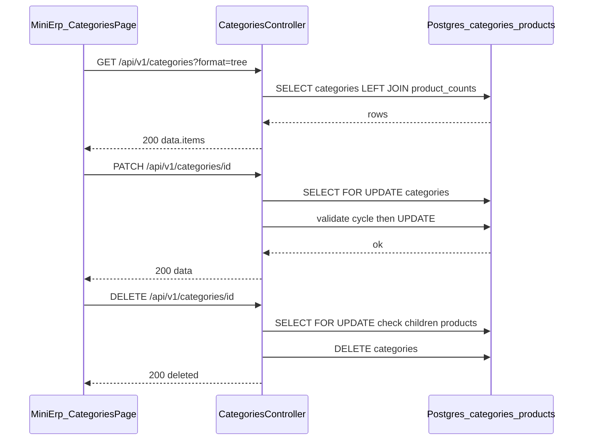

# SRS — Quản lý danh mục sản phẩm (CRUD + cây) — Task029–Task033

> **File (Spring / `smart-erp`):** `backend/docs/srs/SRS_Task029-033_categories-management.md`  
> **Người soạn:** Agent BA + SQL (theo plan)  
> **Ngày:** 26/04/2026  
> **Trạng thái:** Draft  
> **PO duyệt (khi Approved):** _(chưa)_

---

## 0. Đầu vào & traceability

| Nguồn | Đường dẫn / ghi chú |
| :--- | :--- |
| API Task029 | [`../../../frontend/docs/api/API_Task029_categories_get_list.md`](../../../frontend/docs/api/API_Task029_categories_get_list.md) |
| API Task030 | [`../../../frontend/docs/api/API_Task030_categories_post.md`](../../../frontend/docs/api/API_Task030_categories_post.md) |
| API Task031 | [`../../../frontend/docs/api/API_Task031_categories_get_by_id.md`](../../../frontend/docs/api/API_Task031_categories_get_by_id.md) |
| API Task032 | [`../../../frontend/docs/api/API_Task032_categories_patch.md`](../../../frontend/docs/api/API_Task032_categories_patch.md) |
| API Task033 | [`../../../frontend/docs/api/API_Task033_categories_delete.md`](../../../frontend/docs/api/API_Task033_categories_delete.md) |
| Khung API design | [`../../../frontend/docs/api/API_PROJECT_DESIGN.md`](../../../frontend/docs/api/API_PROJECT_DESIGN.md) §4.9 |
| UC / DB tham chiếu | [`../../../frontend/docs/UC/Database_Specification.md`](../../../frontend/docs/UC/Database_Specification.md) §2 `Categories` (đối chiếu Flyway) |
| Flyway thực tế | [`../../smart-erp/src/main/resources/db/migration/V1__baseline_smart_inventory.sql`](../../smart-erp/src/main/resources/db/migration/V1__baseline_smart_inventory.sql) — bảng `Categories` / `Products` (PostgreSQL: tên vật lý **`categories`**, **`products`**) |
| UI index | [`../../../frontend/mini-erp/src/features/FEATURES_UI_INDEX.md`](../../../frontend/mini-erp/src/features/FEATURES_UI_INDEX.md) |
| Quyền seed | Cùng file V1 — `Roles.permissions` có `can_manage_products` |

---

## 1. Tóm tắt điều hành

- **Vấn đề:** Mini-ERP UC8 cần API thật thay mock cho **danh mục phân cấp** (cây / phẳng), **đếm sản phẩm** theo node, **tạo / xem / sửa / xóa** với ràng buộc toàn vẹn (chu trình `parent_id`, xóa an toàn).
- **Mục tiêu nghiệp vụ:** Cung cấp 5 endpoint REST dưới `/api/v1/categories` khớp hợp đồng API markdown; bám envelope dự án; RBAC thống nhất với seed JWT (`can_manage_products`), trừ điểm DELETE chờ PO (OQ-1).
- **Đối tượng:** User đã đăng nhập có quyền quản lý sản phẩm (Owner / Staff / Admin theo seed V1 — đều có `can_manage_products`).

### 1.1 Giao diện Mini-ERP

| Nhãn menu (Sidebar) | Route | Page (export) | Component / vùng chính | File (dưới `frontend/mini-erp/src/features/`) |
| :--- | :--- | :--- | :--- | :--- |
| Danh mục sản phẩm | `/products/categories` | `CategoriesPage` | `CategoryTable`, `CategoryToolbar`, `CategoryForm`, `CategoryDetailDialog` | `product-management/pages/CategoriesPage.tsx` |

---

## 2. Bóc tách nghiệp vụ (capabilities)

| # | Capability | Kích hoạt bởi | Kết quả mong đợi | Ghi chú |
| :---: | :--- | :--- | :--- | :--- |
| C1 | Liệt kê danh mục dạng cây hoặc phẳng | `GET /categories` + query | `200` + `data.items`; sort `sort_order`, `name`; lọc `status`, `search` | `format=tree` mặc định; `flat` có `parentId` |
| C2 | Giữ nhánh cây khi search | `GET` + `search` + `format=tree` | Chỉ trả các nhánh có node khớp hoặc con cháu khớp | Policy Task029 |
| C3 | Đếm SP trực tiếp theo node | Mọi response có `productCount` | `COUNT(*)` sản phẩm `category_id =` id node, **không** cộng dồn con | Đồng bộ Task029 / Task031 |
| C4 | Tạo danh mục | `POST /categories` | `201` + bản ghi mới; `productCount=0`, `children=[]` | Chặn `parentId` không tồn tại → **400** |
| C5 | Chi tiết một danh mục | `GET /categories/{id}` | `200` + breadcrumb + `parentName` + `productCount` | **404** nếu không tồn tại |
| C6 | Cập nhật một phần | `PATCH /categories/{id}` | `200` + object giống shape POST (không bắt buộc breadcrumb) | `FOR UPDATE`; chặn cycle → **409**; trùng code → **409** |
| C7 | Xóa danh mục an toàn | `DELETE /categories/{id}` | `200` + `{ id, deleted: true }` | **409** nếu còn con hoặc còn SP gán trực tiếp |

---

## 3. Phạm vi

### 3.1 In-scope

- Năm endpoint: Task029–033 như §8.
- Validation query/body; map lỗi 400/401/403/404/409 theo envelope.
- Đọc/ghi bảng `categories`, đọc đếm `products` (không xóa sản phẩm trong scope này).

### 3.2 Out-of-scope

- Task034+ (danh sách sản phẩm, bulk xóa SP, …).
- `POST /categories/bulk-delete` (ghi chú FE Task033 — backlog).
- Multi-tenant (Task029 ghi “tenant nếu có” — không v1).

---

## 4. Câu hỏi làm rõ cho PO (Open Questions)

| ID | Câu hỏi | Ảnh hưởng nếu không trả lời | Blocker? |
| :--- | :--- | :--- | :---: |
| OQ-1 | **DELETE** (Task033): Chỉ **Owner** (`Jwt.role` + pattern `assertOwnerOnly` như phiếu nhập) hay **mọi** user có `can_manage_products` (Owner + Staff + Admin seed)? | Khác `@PreAuthorize` / guard service | Không |
| OQ-2 | **PATCH** (Task032): JSON explicit `"description": null` hoặc `"parentId": null` có nghĩa **ghi NULL vào DB** (gỡ mô tả / gỡ cha) hay **bỏ qua** (chỉ cập nhật khi key không gửi)? | Khác chiến lược merge patch + SQL | Không |

**Trả lời PO (điền khi chốt):**

| ID | Quyết định PO | Ngày |
| :--- | :--- | :--- |
| OQ-1 | | |
| OQ-2 | | |

**Gợi ý Dev khi OQ chưa đóng (không thay chữ ký PO):** DELETE dùng `@PreAuthorize("hasAuthority('can_manage_products')")` giống các endpoint còn lại; PATCH dùng semantic “key có trong JSON” = cập nhật (kể cả null) vs “JsonNullable / Optional field” — ghi rõ trong ADR nhỏ nếu cần.

---

## 5. Phân tích scope tệp & bằng chứng

### 5.1 Tài liệu đã đối chiếu

- Năm file `API_Task029` … `API_Task033` (đã đồng bộ nhỏ: parent invalid **400**; PATCH **200** shape; DELETE **200** envelope; Task031 `productCount`).
- `V1__baseline_smart_inventory.sql` (định nghĩa `categories`, `products`, FK, CHECK `status`).
- `FEATURES_UI_INDEX.md`, `Sidebar.tsx` (nhãn menu).
- `MenuPermissionClaims.java` / seed V1 — `can_manage_products`.

### 5.2 Mã / migration dự kiến

- **Controller mới:** ví dụ `com.example.smart_erp.product.categories.CategoriesController` hoặc `...inventory...` — chốt theo convention team; **hiện chưa có** `CategoriesController` trong repo (grep).
- **Service + repository:** JDBC hoặc JPA — một transaction cho PATCH/DELETE có `FOR UPDATE`.
- **DTO / validation:** query `format`, `status`, `search`; body POST/PATCH camelCase khớp API doc.
- **Migration (tuỳ chọn):** index `idx_categories_parent_id` trên `categories(parent_id)` nếu đo được tải list/cây chậm — **đề xuất §10.3**, không bắt buộc trong SRS Draft.

### 5.3 Rủi ro phát hiện sớm

- DB FK `products.category_id` **ON DELETE SET NULL** — nghiệp vụ API **cứng hơn** (không xóa category nếu còn SP); đúng với Task033.
- SQL ví dụ trong API markdown có thể vẫn ghi `Categories` (PascalCase); PG thực thi **`categories`** — SRS §10 dùng lowercase.

---

## 6. Persona & RBAC

| Endpoint | Điều kiện (mặc định Draft) | HTTP khi từ chối |
| :--- | :--- | :--- |
| `GET /api/v1/categories`, `GET /api/v1/categories/{id}` | `hasAuthority('can_manage_products')` | 403 |
| `POST`, `PATCH` | `hasAuthority('can_manage_products')` | 403 |
| `DELETE` | Cùng authority **hoặc** Owner-only sau OQ-1 | 403 |

JWT bắt buộc; 401 khi không xác thực — theo [`API_RESPONSE_ENVELOPE.md`](../../../frontend/docs/api/API_RESPONSE_ENVELOPE.md).

---

## 7. Actor & luồng nghiệp vụ

### 7.1 Danh sách actor

| Actor | Mô tả |
| :--- | :--- |
| End user | Owner / Staff / Admin — quyền `can_manage_products` |
| Client | Mini-ERP `CategoriesPage` |
| API | `smart-erp` REST |
| Database | PostgreSQL `categories`, `products` |

### 7.2 Luồng chính (rút gọn)

1. User mở `/products/categories` → Client gọi `GET /categories?format=tree` (và query lọc).
2. Tạo/sửa → `POST` / `PATCH`; server validate + (PATCH/DELETE) khóa dòng + kiểm tra cycle / con / SP.
3. Xóa → `DELETE` chỉ khi không còn con và không còn SP gán trực tiếp.

### 7.3 Sơ đồ



---

## 8. Hợp đồng HTTP & ví dụ JSON

> Envelope: `success`, `data`, `message`, `error`, `details` — [`API_RESPONSE_ENVELOPE.md`](../../../frontend/docs/api/API_RESPONSE_ENVELOPE.md).

### 8.1 Bảng endpoint

| Task | Tên chức năng | Method | Path |
| :---: | :--- | :--- | :--- |
| 029 | Liệt kê / cây danh mục | GET | `/api/v1/categories` |
| 030 | Tạo danh mục | POST | `/api/v1/categories` |
| 031 | Chi tiết danh mục | GET | `/api/v1/categories/{id}` |
| 032 | Cập nhật danh mục | PATCH | `/api/v1/categories/{id}` |
| 033 | Xóa danh mục | DELETE | `/api/v1/categories/{id}` |

### 8.2 Task029 — Query & `200` (rút gọn)

Query: `format` = `tree` \| `flat` (mặc định `tree`); `search` (optional); `status` = `all` \| `Active` \| `Inactive` (mặc định `all`).

```json
{
  "success": true,
  "data": {
    "items": [
      {
        "id": 1,
        "categoryCode": "CAT001",
        "name": "Thực phẩm",
        "description": null,
        "parentId": null,
        "sortOrder": 1,
        "status": "Active",
        "productCount": 12,
        "createdAt": "2026-01-10T08:00:00Z",
        "updatedAt": "2026-04-20T10:00:00Z",
        "children": []
      }
    ]
  },
  "message": "Thành công"
}
```

**400 — query không hợp lệ**

```json
{
  "success": false,
  "error": "BAD_REQUEST",
  "message": "Tham số truy vấn không hợp lệ",
  "details": { "format": "Chỉ chấp nhận tree hoặc flat" }
}
```

### 8.3 Task030 — `POST` body & `201`

Request đầy đủ xem API doc; **400** khi `parentId` không tồn tại:

```json
{
  "success": false,
  "error": "BAD_REQUEST",
  "message": "parentId không hợp lệ",
  "details": { "parentId": "Không tồn tại danh mục cha" }
}
```

**409 — trùng `categoryCode`**

```json
{
  "success": false,
  "error": "CONFLICT",
  "message": "Mã danh mục đã tồn tại",
  "details": {}
}
```

### 8.4 Task031 — `404`

```json
{
  "success": false,
  "error": "NOT_FOUND",
  "message": "Không tìm thấy danh mục",
  "details": {}
}
```

### 8.5 Task032 — `409` chu trình

```json
{
  "success": false,
  "error": "CONFLICT",
  "message": "Không thể đặt danh mục cha vì tạo vòng lặp phân cấp",
  "details": {}
}
```

### 8.6 Task033 — `409` còn con hoặc SP

```json
{
  "success": false,
  "error": "CONFLICT",
  "message": "Không thể xóa: còn danh mục con hoặc còn sản phẩm gán vào danh mục này",
  "details": {}
}
```

### 8.7 `401` / `403` / `500`

Bám message tiếng Việt chung dự án (vd. 403: không đủ quyền `can_manage_products`).

---

## 9. Quy tắc nghiệp vụ (BR)

| Mã | Điều kiện | Hành động / kết quả |
| :--- | :--- | :--- |
| BR-1 | `GET` list | `format`, `status` sai → 400 |
| BR-2 | `productCount` | Chỉ đếm `products.category_id = id` (trực tiếp) |
| BR-3 | `POST` / `PATCH` | `parent_id` trỏ tới id không tồn tại (khi non-null) → 400 + details |
| BR-4 | `PATCH` | `parent_id` mới nằm trong tập hậu duệ của `id` → 409 (cycle) |
| BR-5 | `PATCH` / `POST` | `category_code` UNIQUE; vi phạm → 409 |
| BR-6 | `DELETE` | Còn hàng `categories.parent_id = id` → 409 |
| BR-7 | `DELETE` | Còn hàng `products.category_id = id` → 409 |
| BR-8 | `status` | Chỉ `Active` \| `Inactive` (CHECK DB) |

---

## 10. Dữ liệu & SQL tham chiếu

### 10.1 Bảng / quan hệ (PostgreSQL)

| Bảng vật lý | Read / Write | Ghi chú |
| :--- | :--- | :--- |
| `categories` | R/W | `parent_id` self-FK `ON DELETE SET NULL`; `status` CHECK |
| `products` | Read (count), không đổi trong task này | `category_id` FK → `categories`; `ON DELETE SET NULL` |

### 10.2 SQL & transaction

**Đếm SP theo category (dùng trong list/detail)**

```sql
SELECT c.id, c.category_code, c.name, c.description, c.parent_id,
       c.sort_order, c.status, c.created_at, c.updated_at,
       COALESCE(pc.cnt, 0) AS product_count
FROM categories c
LEFT JOIN (
  SELECT category_id, COUNT(*)::int AS cnt
  FROM products
  WHERE category_id IS NOT NULL
  GROUP BY category_id
) pc ON pc.category_id = c.id
WHERE (:status_filter IS NULL OR c.status = :status_filter)
  AND (:search IS NULL OR c.name ILIKE :search OR c.category_code ILIKE :search);
```

**Breadcrumb / tổ tiên (Task031) — ví dụ recursive**

```sql
WITH RECURSIVE anc AS (
  SELECT id, parent_id, name, category_code, 1 AS lvl
  FROM categories WHERE id = :id
  UNION ALL
  SELECT c.id, c.parent_id, c.name, c.category_code, anc.lvl + 1
  FROM categories c
  INNER JOIN anc ON c.id = anc.parent_id
)
SELECT * FROM anc ORDER BY lvl DESC;
```

**PATCH — khóa + kiểm tra hậu duệ (ý tưởng BFS tập `descendant_ids`)**

- Một transaction: `SELECT * FROM categories WHERE id = :id FOR UPDATE`.
- Nếu patch `parent_id = :new_parent` và `:new_parent` is not null: từ chối nếu `:new_parent` ∈ `descendant_ids` hoặc `:new_parent = :id`.
- `UPDATE categories SET … WHERE id = :id`.

**DELETE**

```sql
SELECT id FROM categories WHERE id = :id FOR UPDATE;
SELECT 1 FROM categories WHERE parent_id = :id LIMIT 1;
SELECT 1 FROM products WHERE category_id = :id LIMIT 1;
DELETE FROM categories WHERE id = :id;
```

### 10.3 Index & hiệu năng

- Đề xuất: `CREATE INDEX IF NOT EXISTS idx_categories_parent_id ON categories (parent_id);` — phục vụ lọc con, build cây, DELETE check. **Flyway mới chỉ khi TL/PM chấp nhận** (V1 hiện không có index riêng trên `parent_id`).

### 10.4 Kiểm chứng dữ liệu cho Tester

- Seed đã có categories/products (V1/V6) — dùng để verify `productCount`, tree, DELETE 409 khi còn SP.

---

## 11. Acceptance criteria (Given / When / Then)

```text
Given user có can_manage_products và DB có cây danh mục
When GET /api/v1/categories?format=tree
Then 200 và data.items là cây gốc, mỗi node có productCount khớp COUNT products trực tiếp

Given category id không tồn tại
When GET /api/v1/categories/{id}
Then 404 và envelope lỗi

Given parentId không tồn tại
When POST /api/v1/categories với body hợp lệ trừ parentId
Then 400 và details.parentId

Given PATCH parentId trỏ vào hậu duệ của chính id
When PATCH /api/v1/categories/{id}
Then 409 và message chu trình

Given category còn products.category_id trỏ tới id
When DELETE /api/v1/categories/{id}
Then 409 và không xóa dòng categories

Given category không con, không SP, user đủ quyền
When DELETE /api/v1/categories/{id}
Then 200 và data.deleted = true
```

---

## 12. GAP & giả định

| GAP / Giả định | Tác động | Hành động đề xuất |
| :--- | :--- | :--- |
| API markdown SQL còn chữ `Categories` / `Products` (PascalCase) | Nhầm lẫn với tên PG | Giữ ví dụ API cho độc giả; SRS/BE dùng `categories`/`products` |
| SystemLogs (Task030/032/033) ghi “tuỳ chọn” | Không có trong scope tối thiểu | Dev/PM quyết định sau; có thể bổ sung task nhỏ |
| Bulk delete categories (FE note Task033) | Chưa có endpoint | Backlog / task riêng |

---

## 13. PO sign-off (chỉ điền khi Approved)

- [ ] Đã trả lời / đóng các **OQ** cần thiết cho release
- [ ] JSON / RBAC khớp ý đồ sản phẩm
- [ ] Phạm vi In/Out đã đồng ý

**Chữ ký / nhãn PR:** _(chưa)_
