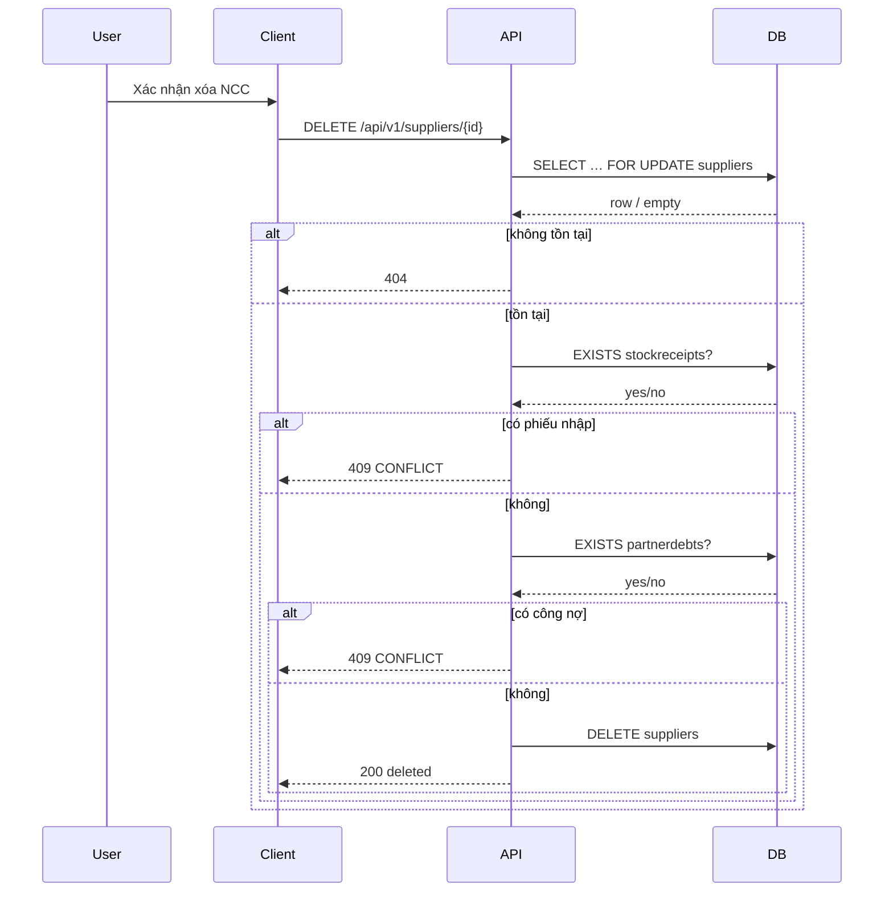

# SRS — Quản lý nhà cung cấp (list / CRUD / xóa & bulk) — Task042–Task047

> **File (Spring / `smart-erp`):** `backend/docs/srs/SRS_Task042-047_suppliers-management.md`  
> **Người soạn:** Agent BA + SQL (theo `backend/AGENTS/BA_AGENT_INSTRUCTIONS.md`, `backend/AGENTS/SQL_AGENT_INSTRUCTIONS.md`)  
> **Ngày:** 27/04/2026  
> **Đồng bộ sau trả lời PO (OQ §4):** 27/04/2026  
> **Trạng thái:** Approved *(OQ đã chốt — chờ ký §13 **Approved**)*  
> **PO duyệt (khi Approved):** `<tên>`, `<ngày>`

---

## 0. Đầu vào & traceability

| Nguồn | Đường dẫn / ghi chú |
| :--- | :--- |
| API Task042 | [`../../../frontend/docs/api/API_Task042_suppliers_get_list.md`](../../../frontend/docs/api/API_Task042_suppliers_get_list.md) |
| API Task043 | [`../../../frontend/docs/api/API_Task043_suppliers_post.md`](../../../frontend/docs/api/API_Task043_suppliers_post.md) |
| API Task044 | [`../../../frontend/docs/api/API_Task044_suppliers_get_by_id.md`](../../../frontend/docs/api/API_Task044_suppliers_get_by_id.md) |
| API Task045 | [`../../../frontend/docs/api/API_Task045_suppliers_patch.md`](../../../frontend/docs/api/API_Task045_suppliers_patch.md) |
| API Task046 | [`../../../frontend/docs/api/API_Task046_suppliers_delete.md`](../../../frontend/docs/api/API_Task046_suppliers_delete.md) |
| API Task047 | [`../../../frontend/docs/api/API_Task047_suppliers_bulk_delete.md`](../../../frontend/docs/api/API_Task047_suppliers_bulk_delete.md) |
| Khung API | [`../../../frontend/docs/api/API_PROJECT_DESIGN.md`](../../../frontend/docs/api/API_PROJECT_DESIGN.md) §4.14 (bảng path `/suppliers`) |
| Envelope | [`../../../frontend/docs/api/API_RESPONSE_ENVELOPE.md`](../../../frontend/docs/api/API_RESPONSE_ENVELOPE.md) |
| UC / DB | [`../../../frontend/docs/UC/Database_Specification.md`](../../../frontend/docs/UC/Database_Specification.md) §3 `Suppliers`; **bổ sung thực tế Flyway:** `partnerdebts.supplier_id` **ON DELETE RESTRICT** (§12.2 — không chỉ `StockReceipts`) |
| Flyway | [`../../smart-erp/src/main/resources/db/migration/V1__baseline_smart_inventory.sql`](../../smart-erp/src/main/resources/db/migration/V1__baseline_smart_inventory.sql) — `suppliers`, `stockreceipts` (FK `supplier_id` → `suppliers`), `partnerdebts` (FK `supplier_id` → `suppliers`, **RESTRICT**) |
| Cùng nhóm quyền catalog | [`SRS_Task034-041_products-management.md`](SRS_Task034-041_products-management.md) — `can_manage_products`; **xóa / bulk-delete: chỉ Owner** — **OQ-1(a) đã chốt** (đồng bộ Task034-041 OQ-6(a)) |
| UI index | [`../../../frontend/mini-erp/src/features/FEATURES_UI_INDEX.md`](../../../frontend/mini-erp/src/features/FEATURES_UI_INDEX.md) |

### 0.1 Đồng bộ đã thực hiện trong phiên này (API markdown ↔ Flyway / SRS)

| Điểm | Trước | Sau (đồng bộ) |
| :--- | :--- | :--- |
| Xóa NCC — ràng buộc DB | API Task046 chỉ nêu `StockReceipts` | Bổ sung kiểm tra **`partnerdebts`**; **409** với `message` tiếng Việt **theo từng lý do** + `details.reason` — **OQ-3(a) đã chốt**; tránh **500** do FK RESTRICT. |
| Task047 bulk-delete | Chưa có ví dụ `200` / policy cụ thể | **OQ-2(a) đã chốt:** **all-or-nothing**; ví dụ JSON trong `API_Task047_suppliers_bulk_delete.md`. |
| Task044 `lastReceiptAt` | Optional trong API gốc | **OQ-4(b) đã chốt:** **`lastReceiptAt`** = `MAX(stockreceipts.created_at)` — SRS §8.4, §10.2; **`API_Task044_suppliers_get_by_id.md`** đã đồng bộ ví dụ JSON + SQL. |
| Task042 `sort` | “Whitelist” không liệt kê | SRS §8.2 + file API Task042 ghi **danh sách** giá trị hợp lệ; giá trị khác → **400**. |

---

## 1. Tóm tắt điều hành

- **Vấn đề:** UC7/UC8 cần API **danh sách phân trang** NCC (kèm `receiptCount`), **tạo**, **chi tiết**, **PATCH**, **xóa một**, **xóa bulk**, thống nhất envelope và RBAC với màn **Nhà cung cấp** trên Mini-ERP.
- **Mục tiêu nghiệp vụ:** Quản trị master data NCC; chặn xóa khi còn **phiếu nhập** và khi còn **bản ghi công nợ đối tác** (`partnerdebts`) — bám FK Flyway.
- **Đối tượng:** User JWT; quyền theo seed `Roles.permissions` (`can_manage_products` cho nhóm sản phẩm/NCC); **xóa NCC: chỉ Owner** (**OQ-1(a)**).

### 1.1 Giao diện Mini-ERP

| Nhãn menu (Sidebar) | Route | Page (export) | Component / vùng chính | File (dưới `frontend/mini-erp/src/features/`) |
| :--- | :--- | :--- | :--- | :--- |
| Nhà cung cấp | `/products/suppliers` | `SuppliersPage` | `SupplierTable`, `SupplierToolbar`, `SupplierForm`, `SupplierDetailDialog` | `product-management/pages/SuppliersPage.tsx` |

*(API Task042–047 tham chiếu `SuppliersPage` / form / dialog — khớp `FEATURES_UI_INDEX.md`.)*

---

## 2. Bóc tách nghiệp vụ (capabilities)

| # | Capability | Kích hoạt bởi | Kết quả mong đợi | Ghi chú |
| :---: | :--- | :--- | :--- | :--- |
| C1 | Phân trang + lọc NCC | `GET /api/v1/suppliers` | `200` + `items`, `page`, `limit`, `total` | `search`, `status`, `sort` whitelist §8.2 |
| C2 | Read-model `receiptCount` | C1, C3 | Mỗi bản ghi: `COUNT` phiếu nhập theo `supplier_id` | Giống Task042 §7 |
| C3 | Chi tiết một NCC | `GET /api/v1/suppliers/{id}` | `200` + object đầy đủ + `receiptCount` + **`lastReceiptAt`** (**OQ-4(b)**) | **404** nếu không tồn tại; `lastReceiptAt` = **`null`** nếu chưa có phiếu nhập |
| C4 | Tạo NCC | `POST /api/v1/suppliers` | `201` + object: `receiptCount: 0`, **`lastReceiptAt: null`**, các trường còn lại như §8.3 | `supplier_code` UNIQUE → **409** |
| C5 | Cập nhật một phần | `PATCH /api/v1/suppliers/{id}` | `200` | Ít nhất một field; đổi mã trùng NCC khác → **409**; transaction **SELECT FOR UPDATE** rồi **UPDATE** |
| C6 | Xóa một NCC | `DELETE /api/v1/suppliers/{id}` | `200` + `{ id, deleted: true }` | Chặn nếu còn `stockreceipts` **hoặc** `partnerdebts` — **409** + `message` / `reason` theo **OQ-3(a)** |
| C7 | Xóa nhiều NCC | `POST /api/v1/suppliers/bulk-delete` | `200` hoặc `409` | **OQ-2(a) đã chốt:** **all-or-nothing**; `ids` trùng → **400** (**OQ-6(a)**) |

---

## 3. Phạm vi

### 3.1 In-scope

- Sáu endpoint Task042–047; validation, phân trang, envelope, mã HTTP như §8.
- Đếm phiếu nhập (`receiptCount`) theo quan hệ `stockreceipts.supplier_id`.
- **`GET /api/v1/suppliers/{id}`:** read-model **`lastReceiptAt`** = `MAX(stockreceipts.created_at)` theo `supplier_id`; không có phiếu → **`null`** (**OQ-4(b)**).
- Kiểm tra toàn vẹn trước `DELETE` gồm **cả** quan hệ RESTRICT từ `partnerdebts` (Flyway V1).
- **`POST/PATCH`:** `contactPerson` **bắt buộc** non-blank trên API (khớp Zod FE) — **OQ-5(a)**.

### 3.2 Out-of-scope

- **Import/export** CSV NCC.
- Đồng bộ **PartnerDebts UI** (màn Công nợ) — chỉ ràng buộc xóa NCC.

---

## 4. Câu hỏi làm rõ cho PO (Open Questions)

### 4.1 Quyết định PO — **đã chốt** (27/04/2026)

| ID | Chốt | Diễn giải triển khai |
| :--- | :--- | :--- |
| **OQ-1** | **(a)** | **`DELETE /api/v1/suppliers/{id}`** và **`POST /api/v1/suppliers/bulk-delete`**: **chỉ Owner** (JWT claim `role` = Owner). User có `can_manage_products` nhưng không phải Owner → **403**. Đồng bộ [`SRS_Task034-041_products-management.md`](SRS_Task034-041_products-management.md) OQ-6(a). |
| **OQ-2** | **(a)** | **All-or-nothing:** một `id` trong bulk không đủ điều kiện → **409**, **không** xóa bản ghi nào. |
| **OQ-3** | **(a)** | **409** `CONFLICT`; **`message` tiếng Việt theo từng lý do** (phiếu nhập vs công nợ); **`details.reason`** ∈ `HAS_RECEIPTS` \| `HAS_PARTNER_DEBTS` để FE map. |
| **OQ-4** | **(b)** | Response **`GET /api/v1/suppliers/{id}`** (và body **200** sau **PATCH** khi trả cùng shape) có **`lastReceiptAt`**: `MAX(stockreceipts.created_at)` theo `supplier_id`; không có phiếu → **`null`**. Kiểu chuỗi **ISO-8601** (offset/Z theo convention dự án). |
| **OQ-5** | **(a)** | **`contactPerson`:** validate backend **bắt buộc**, non-blank, max length khớp Zod Task043 (min 1, max 255). |
| **OQ-6** | **(a)** | **`ids`** bulk-delete: có **trùng lặp** cùng giá trị → **400** `BAD_REQUEST`. |

**Bảng trả lời PO (chữ ký form / ticket):**

| ID | Quyết định PO | Ngày |
| :--- | :--- | :--- |
| OQ-1 | **(a)** — chỉ Owner xóa / bulk-delete | 27/04/2026 |
| OQ-2 | **(a)** — all-or-nothing | 27/04/2026 |
| OQ-3 | **(a)** — message theo lý do + `details.reason` | 27/04/2026 |
| OQ-4 | **(b)** — có `lastReceiptAt` (MAX `created_at`) | 27/04/2026 |
| OQ-5 | **(a)** — backend bắt buộc `contactPerson` | 27/04/2026 |
| OQ-6 | **(a)** — trùng `ids` → 400 | 27/04/2026 |

### 4.2 Lịch sử câu hỏi (tham chiếu)

| ID | Câu hỏi | Phương án (đã chốt **in đậm**) | Ảnh hưởng nếu chưa chốt | Blocker? |
| :--- | :--- | :--- | :--- | :---: |
| **OQ-1** | Ai được xóa / bulk-delete? | **(a)** Chỉ Owner → **403** non-Owner. (b) Staff có `can_manage_products` được xóa. | RBAC | Không |
| **OQ-2** | Bulk policy? | **(a)** All-or-nothing. (b) Partial. | Contract | Không |
| **OQ-3** | Copy lỗi 409? | **(a)** Message theo lý do + `reason`. (b) Message chung. | UI | Không |
| **OQ-4** | `lastReceiptAt`? | (a) Không v1. **(b)** Có field. | Task044 | Không |
| **OQ-5** | `contactPerson` NULL? | **(a)** Backend bắt buộc. (b) Backend cho null. | 400 | Không |
| **OQ-6** | `ids` trùng? | **(a)** 400. (b) Dedupe. | Bulk | Không |

---

## 5. Phân tích scope tệp & bằng chứng

### 5.1 Tài liệu đã đối chiếu (read)

- 6 file API Task042–047; `API_PROJECT_DESIGN.md`; `API_RESPONSE_ENVELOPE.md`; `Database_Specification.md` §3; Flyway **V1** (đoạn `suppliers`, `stockreceipts`, `partnerdebts`); `SRS_Task034-041`; `FEATURES_UI_INDEX.md`; `Sidebar.tsx` (nhãn menu).

### 5.2 Mã / migration dự kiến (khi Dev triển khai)

- Package gợi ý: `com.example.smart_erp.catalog` hoặc module **`suppliers`** tách riêng — **ADR Tech Lead**; cần `*Controller`, `*Service`, JDBC/JPA trên `suppliers`, join `stockreceipts`, đọc `partnerdebts`.
- Policy quyền: `can_manage_products` cho Task042–045; **`assertOwnerOnly`** (hoặc tương đương) cho Task046–047 — **OQ-1(a) đã chốt**.

### 5.3 Rủi ro phát hiện sớm

- Chỉ kiểm `stockreceipts` mà bỏ `partnerdebts` → **500** hoặc lỗi JDBC khi `DELETE` — **bắt buộc** kiểm tra cả hai trước xóa (**BR-2**).
- List + `receiptCount`: subquery aggregate có thể nặng — cần index `stockreceipts(supplier_id)` (đã có `idx_sr_supplier` trên Flyway V1).

---

## 6. Persona & RBAC

| Vai trò / quyền | Điều kiện | Task042–045 (đọc/ghi NCC) | Task046–047 (xóa) |
| :--- | :--- | :--- | :--- |
| Có `can_manage_products` (Staff / Admin, không phải Owner) | JWT + permission seed | **Được** list / detail / create / patch | **403** trên Task046–047 (**OQ-1(a)**) |
| Owner | `role` = Owner + `can_manage_products` | **Được** list / detail / create / patch | **Được** Task046–047 khi không vi phạm **BR-2** |
| Thiếu token / permission | | **401** / **403** | **401** / **403** |

---

## 7. Actor & luồng nghiệp vụ

### 7.1 Actor

| Actor | Mô tả |
| :--- | :--- |
| User | Nhân viên / chủ cửa hàng |
| Client | SPA `mini-erp` |
| API | `smart-erp` |
| DB | PostgreSQL |

### 7.2 Luồng chính (xóa một — narrative)

1. Client gọi `DELETE /api/v1/suppliers/{id}` kèm Bearer.  
2. API kiểm RBAC (**§6** — non-Owner → **403**).  
3. `SELECT id FROM suppliers WHERE id = :id FOR UPDATE` — không có → **404**.  
4. `SELECT 1 FROM stockreceipts WHERE supplier_id = :id LIMIT 1` — có → **409** (`HAS_RECEIPTS`).  
5. `SELECT 1 FROM partnerdebts WHERE supplier_id = :id LIMIT 1` — có → **409** (`HAS_PARTNER_DEBTS`) — message riêng **OQ-3(a)**.  
6. `DELETE FROM suppliers WHERE id = :id` → **200**.

### 7.3 Sơ đồ (xóa một)



---

## 8. Hợp đồng HTTP & ví dụ JSON

### 8.1 Tổng quan endpoint

| Task | Method + path | Auth | Ghi chú |
| :--- | :--- | :--- | :--- |
| 042 | `GET /api/v1/suppliers` | Bearer | Query §8.2 |
| 043 | `POST /api/v1/suppliers` | Bearer | `201` |
| 044 | `GET /api/v1/suppliers/{id}` | Bearer | |
| 045 | `PATCH /api/v1/suppliers/{id}` | Bearer | Partial |
| 046 | `DELETE /api/v1/suppliers/{id}` | Bearer | **Chỉ Owner** — **OQ-1(a)** |
| 047 | `POST /api/v1/suppliers/bulk-delete` | Bearer | Body `{ "ids": [] }` — max **50**; **trùng `ids` → 400** (**OQ-6(a)**); sản phẩm bulk max 100 — **GAP** §12 |

**Content-Type:** `application/json` (trừ GET không body).

### 8.2 `GET /api/v1/suppliers` — query

| Param | Kiểu | Mặc định | Validation |
| :--- | :--- | :--- | :--- |
| `search` | string | — | `ILIKE` trên `name`, `supplier_code`, `phone` |
| `status` | string | `all` | `all` \| `Active` \| `Inactive` |
| `page` | int | `1` | ≥ 1 |
| `limit` | int | `20` | 1–100 |
| `sort` | string | `updatedAt:desc` | **Whitelist:** `name:asc`, `name:desc`, `supplierCode:asc`, `supplierCode:desc`, `updatedAt:asc`, `updatedAt:desc`, `createdAt:asc`, `createdAt:desc` — khác → **400** |

**200 — ví dụ (`data` rút gọn một item):** *(mỗi `items[]` **không** bắt buộc có `lastReceiptAt` — field này chỉ **Task044** / response sau **PATCH** — **OQ-4(b)**.)*

```json
{
  "success": true,
  "data": {
    "items": [
      {
        "id": 3,
        "supplierCode": "NCC0001",
        "name": "Công ty ABC",
        "contactPerson": "Nguyễn A",
        "phone": "0909123456",
        "email": "a@abc.com",
        "address": "Hà Nội",
        "taxCode": "0101234567",
        "status": "Active",
        "receiptCount": 8,
        "createdAt": "2026-01-05T08:00:00Z",
        "updatedAt": "2026-04-01T10:00:00Z"
      }
    ],
    "page": 1,
    "limit": 20,
    "total": 42
  },
  "message": "Thành công"
}
```

**400 — `sort` không hợp lệ**

```json
{
  "success": false,
  "error": "BAD_REQUEST",
  "message": "Tham số sắp xếp không hợp lệ",
  "details": { "sort": "Giá trị không nằm trong whitelist" }
}
```

**401 / 403 / 500** — envelope chuẩn dự án.

### 8.3 `POST /api/v1/suppliers` — body đầy đủ

```json
{
  "supplierCode": "NCC0002",
  "name": "Công ty XYZ",
  "contactPerson": "Trần B",
  "phone": "0911222333",
  "email": "b@xyz.com",
  "address": "TP.HCM",
  "taxCode": null,
  "status": "Active"
}
```

**201 — ví dụ**

```json
{
  "success": true,
  "data": {
    "id": 9,
    "supplierCode": "NCC0002",
    "name": "Công ty XYZ",
    "contactPerson": "Trần B",
    "phone": "0911222333",
    "email": "b@xyz.com",
    "address": "TP.HCM",
    "taxCode": null,
    "status": "Active",
    "receiptCount": 0,
    "lastReceiptAt": null,
    "createdAt": "2026-04-27T10:00:00Z",
    "updatedAt": "2026-04-27T10:00:00Z"
  },
  "message": "Đã tạo nhà cung cấp"
}
```

**400 — validation** *(thiếu / blank `contactPerson` — **OQ-5(a)**)*

```json
{
  "success": false,
  "error": "BAD_REQUEST",
  "message": "Dữ liệu không hợp lệ",
  "details": { "contactPerson": "Bắt buộc" }
}
```

**409 — trùng `supplierCode`**

```json
{
  "success": false,
  "error": "CONFLICT",
  "message": "Mã nhà cung cấp đã tồn tại",
  "details": { "supplierCode": "NCC0002" }
}
```

### 8.4 `GET /api/v1/suppliers/{id}` — 200

Cùng các trường meta như phần tử `items` §8.2, **cộng thêm** **`lastReceiptAt`** (**OQ-4(b)**): `MAX(stockreceipts.created_at)` theo `supplier_id`; không có phiếu → **`null`**.

**200 — ví dụ đầy đủ**

```json
{
  "success": true,
  "data": {
    "id": 3,
    "supplierCode": "NCC0001",
    "name": "Công ty ABC",
    "contactPerson": "Nguyễn A",
    "phone": "0909123456",
    "email": "a@abc.com",
    "address": "Hà Nội",
    "taxCode": "0101234567",
    "status": "Active",
    "receiptCount": 8,
    "lastReceiptAt": "2026-03-15T14:30:00Z",
    "createdAt": "2026-01-05T08:00:00Z",
    "updatedAt": "2026-04-01T10:00:00Z"
  },
  "message": "Thành công"
}
```

**404**

```json
{
  "success": false,
  "error": "NOT_FOUND",
  "message": "Không tìm thấy nhà cung cấp",
  "details": {}
}
```

### 8.5 `PATCH /api/v1/suppliers/{id}` — body ví dụ

```json
{
  "name": "Công ty ABC (mới)",
  "phone": "0909999888",
  "status": "Inactive"
}
```

**400 — không có field nào**

```json
{
  "success": false,
  "error": "BAD_REQUEST",
  "message": "Cần ít nhất một trường cập nhật",
  "details": {}
}
```

**200:** cùng shape **§8.4** (gồm **`lastReceiptAt`**).

**409:** trùng `supplierCode` với NCC khác.

### 8.6 `DELETE /api/v1/suppliers/{id}` — 200

```json
{
  "success": true,
  "data": { "id": 3, "deleted": true },
  "message": "Đã xóa nhà cung cấp"
}
```

**409 — còn phiếu nhập**

```json
{
  "success": false,
  "error": "CONFLICT",
  "message": "Không thể xóa nhà cung cấp đã có phiếu nhập kho",
  "details": { "reason": "HAS_RECEIPTS" }
}
```

**409 — còn công nợ đối tác (partnerdebts)**

```json
{
  "success": false,
  "error": "CONFLICT",
  "message": "Không thể xóa nhà cung cấp đang có công nợ",
  "details": { "reason": "HAS_PARTNER_DEBTS" }
}
```

**403 — không phải Owner** *(Task046 — **OQ-1(a)**)*

```json
{
  "success": false,
  "error": "FORBIDDEN",
  "message": "Chỉ chủ cửa hàng được xóa nhà cung cấp",
  "details": {}
}
```

### 8.7 `POST /api/v1/suppliers/bulk-delete` — body

```json
{
  "ids": [3, 4, 5]
}
```

**200 — all-or-nothing (**OQ-2(a)** đã chốt)**

```json
{
  "success": true,
  "data": { "deletedIds": [3, 4, 5], "deletedCount": 3 },
  "message": "Đã xóa các nhà cung cấp"
}
```

**409 — ít nhất một id không đủ điều kiện (không xóa bản ghi nào)**

```json
{
  "success": false,
  "error": "CONFLICT",
  "message": "Không thể xóa toàn bộ: ít nhất một nhà cung cấp không đủ điều kiện",
  "details": { "failedId": 5, "reason": "HAS_RECEIPTS" }
}
```

**400 — `ids` rỗng / vượt max / trùng lặp** *(trùng lặp: **OQ-6(a)** → **400**)*

```json
{
  "success": false,
  "error": "BAD_REQUEST",
  "message": "Danh sách id không hợp lệ",
  "details": { "ids": "Tối đa 50 id, không được rỗng hoặc trùng lặp" }
}
```

**403** — non-Owner: cùng mẫu JSON §8.6 (**OQ-1(a)**). **401** / **500** — envelope chuẩn dự án.

### 8.8 Ghi chú envelope

- Bám `success`, `data`, `message`, `error`, `details` theo `API_RESPONSE_ENVELOPE.md`.

---

## 9. Quy tắc nghiệp vụ

| Mã | Điều kiện | Hành động / kết quả |
| :--- | :--- | :--- |
| BR-1 | `supplier_code` | UNIQUE toàn hệ thống; format gợi ý **NCC** + digits (Database_Spec §3 — không enforce DB ngoài UNIQUE) |
| BR-2 | Trước `DELETE` supplier | **Cấm** nếu tồn tại `stockreceipts.supplier_id = id` **hoặc** `partnerdebts.supplier_id = id` |
| BR-3 | `email` chuỗi rỗng | Lưu **`NULL`** (Task043) |
| BR-4 | `bulk-delete` | **OQ-2(a):** validate tất cả `id` (tồn tại, không trùng trong payload — **OQ-6(a)**, không còn receipts/debts) → chỉ khi tất cả hợp lệ mới `DELETE … WHERE id = ANY(:ids)` trong **một** transaction |
| BR-5 | `contactPerson` trên **POST/PATCH** | **OQ-5(a):** **POST** — bắt buộc, non-blank, max 255 (khớp Zod Task043). **PATCH** — nếu body có key `contactPerson` thì cùng rule; không gửi key → giữ nguyên giá trị DB |
| BR-6 | `lastReceiptAt` trên **GET `{id}`** và **200 PATCH** | **OQ-4(b):** scalar `MAX(created_at)` từ `stockreceipts` where `supplier_id` = id; không có dòng phiếu → **`null`** |

---

## 10. Dữ liệu & SQL tham chiếu (Agent SQL)

### 10.1 Bảng / quan hệ (Flyway V1 — tên thực thi PostgreSQL thường chữ thường)

| Bảng | Read / Write | Ghi chú |
| :--- | :--- | :--- |
| `suppliers` | R/W | `supplier_code` UNIQUE; `status` IN (`Active`,`Inactive`) |
| `stockreceipts` | R | `supplier_id` NOT NULL, FK → `suppliers`, **ON DELETE RESTRICT** |
| `partnerdebts` | R | `supplier_id` NULL hoặc FK → `suppliers`, **ON DELETE RESTRICT** |

### 10.2 SQL gợi ý — list + receiptCount

```sql
-- Đếm total (cùng predicate filter)
SELECT COUNT(*)::bigint
FROM suppliers s
WHERE (:search IS NULL OR s.name ILIKE '%' || :search || '%'
       OR s.supplier_code ILIKE '%' || :search || '%'
       OR s.phone ILIKE '%' || :search || '%')
  AND (:status = 'all' OR s.status = :status);

-- Trang: LEFT JOIN aggregate receipts
SELECT s.id, s.supplier_code, s.name, s.contact_person, s.phone, s.email,
       s.address, s.tax_code, s.status, s.created_at, s.updated_at,
       COALESCE(rc.cnt, 0)::int AS receipt_count
FROM suppliers s
LEFT JOIN (
  SELECT supplier_id, COUNT(*)::int AS cnt
  FROM stockreceipts
  GROUP BY supplier_id
) rc ON rc.supplier_id = s.id
WHERE /* giống COUNT */
ORDER BY /* map sort whitelist → cột */
LIMIT :limit OFFSET :offset;
```

**Chi tiết một NCC + `receiptCount` + `lastReceiptAt`** (Task044 — **OQ-4(b)**):

```sql
SELECT
  s.id,
  s.supplier_code,
  s.name,
  s.contact_person,
  s.phone,
  s.email,
  s.address,
  s.tax_code,
  s.status,
  s.created_at,
  s.updated_at,
  (SELECT COUNT(*)::int FROM stockreceipts sr WHERE sr.supplier_id = s.id) AS receipt_count,
  (SELECT MAX(sr2.created_at) FROM stockreceipts sr2 WHERE sr2.supplier_id = s.id) AS last_receipt_at
FROM suppliers s
WHERE s.id = :id;
```

*(Map `last_receipt_at` → JSON **`lastReceiptAt`** camelCase; JDBC/ORM alias theo convention module.)*

### 10.3 Index & hiệu năng

- Đã có: `idx_suppliers_name`, `idx_suppliers_phone`, `idx_sr_supplier` trên `stockreceipts(supplier_id)`.
- Cân nhắc thêm composite nếu filter `status` + `order by updated_at` lớn — đo `EXPLAIN` sau triển khai.

### 10.4 Transaction & khóa

- **PATCH / DELETE một:** `SELECT … FROM suppliers WHERE id = :id FOR UPDATE` rồi `UPDATE` / kiểm tra con rồi `DELETE`.
- **bulk-delete:** một transaction; all-or-nothing → rollback hết nếu một id lỗi.

### 10.5 Kiểm chứng cho Tester

- Tạo NCC → list có `receiptCount = 0`; tạo phiếu nhập seed với `supplier_id` → `receiptCount` tăng.
- Xóa NCC có phiếu → **409** `HAS_RECEIPTS`; tạo `partnerdebts` với `supplier_id` không có phiếu → **409** `HAS_PARTNER_DEBTS`.
- `PATCH` trùng `supplierCode` NCC khác → **409**.
- `sort` sai whitelist → **400**.
- **GET `{id}`** / **PATCH 200:** có `lastReceiptAt` đúng **MAX(`stockreceipts.created_at`)** hoặc `null`.
- **POST** thiếu `contactPerson` → **400** (**OQ-5(a)**).
- **Bulk-delete** `ids: [1,1,2]` → **400** (**OQ-6(a)**).
- User Staff có `can_manage_products`, **không** phải Owner: **DELETE** / **bulk-delete** → **403**.

---

## 11. Acceptance criteria (Given / When / Then)

```text
Given user có can_manage_products
When GET /api/v1/suppliers?page=1&limit=20&status=Active
Then 200 và data.total khớp COUNT filter và mỗi item có receiptCount >= 0

Given sort=invalid:value
When GET /api/v1/suppliers
Then 400 và success=false

Given body hợp lệ Task043
When POST /api/v1/suppliers
Then 201 và receiptCount=0 và DB có đúng một dòng suppliers

Given supplier tồn tại
When PATCH /api/v1/suppliers/{id} với { "name": "X" }
Then 200 và name đổi

Given supplier có ít nhất một stockreceipts
When DELETE /api/v1/suppliers/{id}
Then 409 và supplier vẫn tồn tại

Given supplier có partnerdebts (không có receipts)
When DELETE /api/v1/suppliers/{id}
Then 409 và supplier vẫn tồn tại

Given ba id đều xóa được (all-or-nothing OQ-2(a))
When POST /api/v1/suppliers/bulk-delete (Owner)
Then 200 và cả ba bị xóa

Given một trong ba không xóa được
When POST bulk-delete (Owner)
Then 409 và không id nào bị xóa

Given ids có trùng lặp
When POST bulk-delete (Owner)
Then 400

Given supplier có ít nhất một phiếu nhập (created_at max = T)
When GET /api/v1/suppliers/{id}
Then 200 và lastReceiptAt khớp T (ISO-8601)

Given supplier không có phiếu nhập
When GET /api/v1/suppliers/{id}
Then 200 và lastReceiptAt null

Given Staff (can_manage_products) không phải Owner
When DELETE /api/v1/suppliers/{id}
Then 403
```

---

## 12. GAP & giả định

| GAP / Giả định | Tác động | Hành động đề xuất |
| :--- | :--- | :--- |
| `Database_Specification.md` §3 chỉ liệt kê quan hệ **StockReceipts** với ON DELETE | Thiếu `partnerdebts` trong tài liệu UC §3 | Bổ sung hàng quan hệ trong UC (CR tách) hoặc tham chiếu §12.2; SRS đã bám Flyway. |
| Giới hạn **50** id bulk NCC vs **100** id bulk sản phẩm | FE/backend khác nhau | PO chốt thống nhất hoặc giữ nguyên (NCC ít hơn SP) — ghi trong API_BRIDGE khi nối. |
| Trùng lặp trong mảng `ids` bulk-delete | Đã chốt | **OQ-6(a):** **400** — cập nhật `API_Task047` / Zod FE nếu cần `.refine` trùng. |
| Task046 mẫu 409 không có `details` | FE map `reason` | Đã mở rộng ví dụ §8.6; giữ tương thích `message` tiếng Việt. |

---

## 13. PO sign-off (chỉ điền khi Approved)

- [ ] Đã trả lời / đóng các **OQ blocker** (nếu có)
- [ ] JSON request/response khớp ý đồ sản phẩm
- [ ] Phạm vi In/Out đã đồng ý

**Chữ ký / nhãn PR:** …
