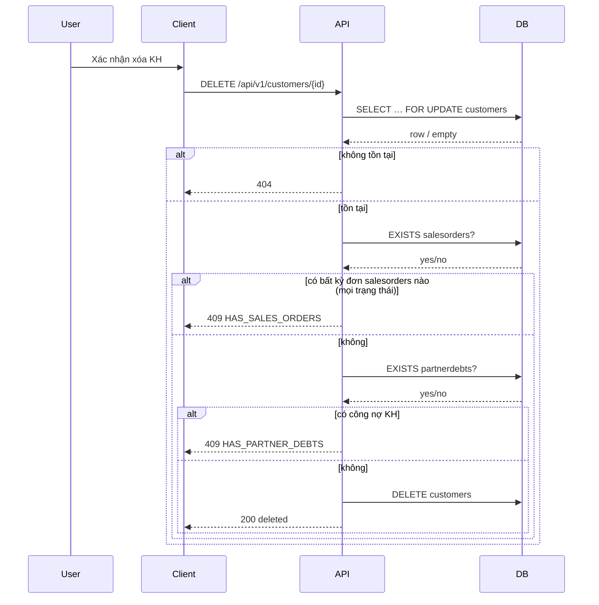

# SRS — Quản lý khách hàng (list / CRUD / xóa & bulk) — Task048–Task053

> **File (Spring / `smart-erp`):** `backend/docs/srs/SRS_Task048-053_customers-management.md`  
> **Người soạn:** Agent BA + SQL (theo `backend/AGENTS/BA_AGENT_INSTRUCTIONS.md`, `backend/AGENTS/SQL_AGENT_INSTRUCTIONS.md`)  
> **Ngày:** 27/04/2026  
> **Đồng bộ sau trả lời PO (OQ §4):** 27/04/2026  
> **Trạng thái:** Approved *(OQ §4.1 — **OQ-4(b)** migration `can_manage_customers`; **OQ-5(b)** dedupe `ids` bulk)*  
> **PO duyệt:** PO — 27/04/2026 *(chữ ký PR/ticket theo quy trình team)*

---

## 0. Đầu vào & traceability

| Nguồn | Đường dẫn / ghi chú |
| :--- | :--- |
| API Task048 | [`../../../frontend/docs/api/API_Task048_customers_get_list.md`](../../../frontend/docs/api/API_Task048_customers_get_list.md) |
| API Task049 | [`../../../frontend/docs/api/API_Task049_customers_post.md`](../../../frontend/docs/api/API_Task049_customers_post.md) |
| API Task050 | [`../../../frontend/docs/api/API_Task050_customers_get_by_id.md`](../../../frontend/docs/api/API_Task050_customers_get_by_id.md) |
| API Task051 | [`../../../frontend/docs/api/API_Task051_customers_patch.md`](../../../frontend/docs/api/API_Task051_customers_patch.md) |
| API Task052 | [`../../../frontend/docs/api/API_Task052_customers_delete.md`](../../../frontend/docs/api/API_Task052_customers_delete.md) |
| API Task053 | [`../../../frontend/docs/api/API_Task053_customers_bulk_delete.md`](../../../frontend/docs/api/API_Task053_customers_bulk_delete.md) |
| Khung API | [`../../../frontend/docs/api/API_PROJECT_DESIGN.md`](../../../frontend/docs/api/API_PROJECT_DESIGN.md) §4.10 |
| Envelope | [`../../../frontend/docs/api/API_RESPONSE_ENVELOPE.md`](../../../frontend/docs/api/API_RESPONSE_ENVELOPE.md) |
| UC / DB tham chiếu | [`../../../frontend/docs/UC/Database_Specification.md`](../../../frontend/docs/UC/Database_Specification.md) §4 (Customers, SalesOrders) — **đối chiếu Flyway** |
| Flyway thực tế | [`../../smart-erp/src/main/resources/db/migration/V1__baseline_smart_inventory.sql`](../../smart-erp/src/main/resources/db/migration/V1__baseline_smart_inventory.sql) — `customers`, `salesorders` (**`fk_so_customer` ON DELETE RESTRICT**), **`partnerdebts`** (**`fk_pd_customer` ON DELETE RESTRICT**) |
| Đồng bộ nhóm catalog | [`SRS_Task034-041_products-management.md`](SRS_Task034-041_products-management.md), [`SRS_Task042-047_suppliers-management.md`](SRS_Task042-047_suppliers-management.md) — NCC/SP dùng `can_manage_products`; **KH:** **`can_manage_customers`** (**OQ-4(b)**); xóa / bulk-delete: **chỉ Owner** (**OQ-1(a)**) |
| UI index | [`../../../frontend/mini-erp/src/features/FEATURES_UI_INDEX.md`](../../../frontend/mini-erp/src/features/FEATURES_UI_INDEX.md) |

### 0.1 GAP / mâu thuẫn nguồn → cách xử lý trong SRS

| Điểm | API / ghi chú | Thực tế / chuẩn dự án | Cách xử lý |
| :--- | :--- | :--- | :--- |
| Task052 chỉ nêu chặn `SalesOrders` | Xóa KH khi không còn đơn | Flyway: **`partnerdebts.customer_id` → `customers` ON DELETE RESTRICT** | Bổ sung kiểm tra **`partnerdebts`** trước `DELETE`; **409** + `details.reason` — **BR-2**, **OQ-3(a)**. |
| Task048 `orderCount` | “COUNT cùng điều kiện (hoặc mọi trạng thái)” | Mâu thuẫn nội bộ spec | **Chốt SRS:** `orderCount` và `totalSpent` **chỉ** tính đơn **`salesorders.status IS DISTINCT FROM 'Cancelled'`** (đồng bộ SQL mẫu Task048/050). |
| Task048 `sort` | “Whitelist” không liệt kê | Cần contract đo được | SRS §8.2 liệt kê **danh sách**; giá trị khác → **400**. |
| Task053 bulk policy | all-or-nothing **hoặc** partial | [`SRS_Task042-047`](SRS_Task042-047_suppliers-management.md) đã chọn all-or-nothing | **Đã chốt OQ-2(a):** all-or-nothing. |
| RBAC Task048 | “Owner, Staff, Admin — đọc” | **OQ-4(b):** permission **`can_manage_customers`** (migration seed) | Task048–051 kiểm JWT claim **`can_manage_customers`**; cập nhật menu Mini-ERP. |
| Task052 RBAC | “Owner (khuyến nghị)” | Sản phẩm/NCC: **chỉ Owner** xóa | **Đã chốt OQ-1(a):** Task052–053 **chỉ Owner** xóa. |
| Task052 vs Task053 `message` 409 | Hai câu tiếng Việt khác nhau | Envelope: một convention | Một **bộ message** theo `details.reason` — §8.5. |

---

## 1. Tóm tắt điều hành

- **Vấn đề:** UC9 cần API **danh sách phân trang** khách hàng (kèm read-model `totalSpent`, `orderCount`, `loyaltyPoints`), **tạo**, **chi tiết**, **PATCH** (RBAC cho `loyaltyPoints`), **xóa một**, **xóa bulk**, thống nhất envelope với màn **Khách hàng** trên Mini-ERP.
- **Mục tiêu nghiệp vụ:** Master data KH; chặn xóa khi còn **đơn bán** (`salesorders`) hoặc **công nợ đối tác** (`partnerdebts` theo `customer_id`) — tránh **500** do FK RESTRICT.
- **Đối tượng:** User JWT; quyền đọc/ghi Task048–051 theo **`can_manage_customers`** (**OQ-4(b)**); xóa Task052–053: **chỉ Owner** (**OQ-1(a)**).

### 1.1 Giao diện Mini-ERP

| Nhãn menu (Sidebar) | Route | Page (export) | Component / vùng chính | File (dưới `frontend/mini-erp/src/features/`) |
| :--- | :--- | :--- | :--- | :--- |
| Khách hàng *(theo `Sidebar` / nhóm sản phẩm)* | `/products/customers` | `CustomersPage` | `CustomerTable`, `CustomerToolbar`, `CustomerForm`, `CustomerDetailDialog` | `product-management/pages/CustomersPage.tsx` |

*(Khớp `FEATURES_UI_INDEX.md` bảng 1 + bảng 2 mục `product-management/` — Khách.)*

---

## 2. Bóc tách nghiệp vụ (capabilities)

| # | Capability | Kích hoạt bởi | Kết quả mong đợi | Ghi chú |
| :---: | :--- | :--- | :--- | :--- |
| C1 | Phân trang + lọc KH | `GET /api/v1/customers` | `200` + `items`, `page`, `limit`, `total` | `search`, `status`, `sort` §8.2 |
| C2 | Read-model chi tiêu / số đơn | C1, C3 | Mỗi bản ghi: `totalSpent`, `orderCount` (loại trừ đơn `Cancelled`); `loyaltyPoints` từ cột DB | JOIN aggregate `salesorders` |
| C3 | Chi tiết một KH | `GET /api/v1/customers/{id}` | `200` + object đầy đủ như list item | **404** nếu không tồn tại |
| C4 | Tạo KH | `POST /api/v1/customers` | `201` + object; `loyaltyPoints: 0` | `customer_code` UNIQUE → **409**; server set `loyalty_points = 0` |
| C5 | Cập nhật một phần | `PATCH /api/v1/customers/{id}` | `200` + object như Task050 | Ít nhất một field; `loyaltyPoints` trong body: **403** nếu **Staff** (JWT `role`) — **Owner** và **Admin** được (**Task051**); đổi `customerCode` trùng KH khác → **409** |
| C6 | Xóa một KH | `DELETE /api/v1/customers/{id}` | `200` + `{ id, deleted: true }` | **Chỉ Owner** (**OQ-1(a)**); chặn nếu còn `salesorders` **hoặc** `partnerdebts` — **BR-2** |
| C7 | Xóa nhiều KH | `POST /api/v1/customers/bulk-delete` | `200` hoặc `409` | **OQ-2(a):** all-or-nothing; sau **dedupe** tối đa **50** id duy nhất (**OQ-5(b)**) |

---

## 3. Phạm vi

### 3.1 In-scope

- Sáu endpoint Task048–053; validation, phân trang, envelope, mã HTTP như §8.
- Read-model từ `salesorders` theo **BR-1**.
- Kiểm tra toàn vẹn trước `DELETE` gồm **`salesorders`** và **`partnerdebts`** (Flyway V1).
- RBAC `loyaltyPoints` trên PATCH theo **BR-3**.
- **OQ-4(b):** Flyway migration mới bổ sung **`can_manage_customers`** vào JSON `Roles.permissions` (Owner / Staff / Admin — giá trị boolean theo policy PM); `JwtTokenService` / `MenuPermissionClaims` (hoặc tương đương) đọc claim; FE route `/products/customers` kiểm quyền theo claim.

### 3.2 Out-of-scope

- Tự động cộng `loyalty_points` từ đơn hàng (comment Flyway: tương lai / batch — không trong task này).
- Import/export CSV khách hàng.
- API đơn hàng (UC9 bán hàng) — chỉ đọc aggregate từ `salesorders`.

---

## 4. Câu hỏi làm rõ cho PO (Open Questions) — **đã trả lời**

### 4.1 Quyết định PO — **đã chốt** (27/04/2026)

| ID | Chốt | Diễn giải triển khai |
| :--- | :--- | :--- |
| **OQ-1** | **(a)** | **`DELETE /api/v1/customers/{id}`** và **`POST /api/v1/customers/bulk-delete`**: **chỉ Owner** (JWT claim `role` = Owner). User có **`can_manage_customers`** nhưng `role` ≠ Owner (Staff / Admin) → **403** trên xóa. |
| **OQ-2** | **(a)** | **All-or-nothing:** một `id` (sau dedupe) không đủ điều kiện → **409**, **không** xóa bản ghi nào. |
| **OQ-3** | **(a)** | **409** `CONFLICT`; **`message` tiếng Việt theo lý do** + **`details.reason`** ∈ `HAS_SALES_ORDERS` \| `HAS_PARTNER_DEBTS`. |
| **OQ-4** | **(b)** | Task048–051 yêu cầu permission **`can_manage_customers`** (tách khỏi `can_manage_products`). **Dev:** Flyway migration cập nhật `roles.permissions`, JWT/menu/FE guard — xem §3.1, §5.2. |
| **OQ-5** | **(b)** | Payload `ids` **được phép trùng**; backend **dedupe** giữ thứ tự xuất hiện đầu tiên của từng id; **sau dedupe** phải có **1–50** id duy nhất — nếu **>50** id duy nhất → **400**; mảng rỗng / không có id hợp lệ → **400**. |

**Bảng trả lời PO (form / ticket):**

| ID | Quyết định PO | Ngày |
| :--- | :--- | :--- |
| OQ-1 | **(a)** — chỉ Owner xóa / bulk-delete | 27/04/2026 |
| OQ-2 | **(a)** — all-or-nothing | 27/04/2026 |
| OQ-3 | **(a)** — message + `details.reason` | 27/04/2026 |
| OQ-4 | **(b)** — `can_manage_customers` + migration | 27/04/2026 |
| OQ-5 | **(b)** — dedupe `ids`, tối đa 50 unique | 27/04/2026 |

### 4.2 Lịch sử câu hỏi (tham chiếu)

| ID | Câu hỏi | Phương án (đã chốt **in đậm**) |
| :--- | :--- | :--- |
| **OQ-1** | Ai được xóa / bulk-delete? | **(a)** Chỉ Owner. (b) Staff/Admin có `can_manage_customers` được xóa. |
| **OQ-2** | Bulk policy? | **(a)** All-or-nothing. (b) Partial. |
| **OQ-3** | Chi tiết 409? | **(a)** Message + `reason`. (b) Message chung. |
| **OQ-4** | Quyền KH? | (a) `can_manage_products`. **(b)** `can_manage_customers`. |
| **OQ-5** | `ids` trùng? | (a) 400. **(b)** Dedupe. |

---

## 5. Phân tích scope tệp & bằng chứng

### 5.1 Tài liệu đã đối chiếu (read)

- 6 file API Task048–053; `API_PROJECT_DESIGN.md` §4.10; `API_RESPONSE_ENVELOPE.md`; Flyway **V1** (`customers`, `salesorders`, `partnerdebts`); migration **mới** (khi Dev) — `can_manage_customers` trên `roles.permissions`; `SRS_Task034-041`, `SRS_Task042-047`; `FEATURES_UI_INDEX.md`.

### 5.2 Mã / migration dự kiến (khi Dev triển khai)

- Package gợi ý: `com.example.smart_erp.catalog` (cùng module sản phẩm/NCC) hoặc package `customers` — **ADR Tech Lead**.
- Thành phần: `CustomersController`, `CustomerService`, JDBC repository trên `customers`; JOIN/subquery `salesorders`; EXISTS `salesorders` + `partnerdebts` trước xóa.
- Policy: **`@PreAuthorize` / `*AccessPolicy`** — **`can_manage_customers`** cho Task048–051 (**OQ-4(b)** — migration JSON `roles.permissions` + đọc claim JWT); **`assertOwnerRole`** (chỉ **Owner**) cho Task052–053 (**OQ-1(a)**).

### 5.3 Rủi ro phát hiện sớm

- Chỉ kiểm `salesorders` mà bỏ `partnerdebts` → lỗi khi `DELETE` khách còn nợ — **bắt buộc** kiểm cả hai (**BR-2**).
- List + aggregate: tải cao khi bảng đơn lớn — dùng index `idx_so_customer`; cân nhắc subquery tối ưu / `COUNT(*) FILTER` trong một round-trip (§10).

---

## 6. Persona & RBAC

| Vai trò / quyền | Điều kiện | Task048–050 (đọc) | Task049, 051 (ghi) | Task051 `loyaltyPoints` | Task052–053 (xóa) |
| :--- | :--- | :--- | :--- | :--- | :--- |
| **Staff** | JWT + **`can_manage_customers`** + `role` = Staff | **Được** | **Được** | **403** nếu body có `loyaltyPoints` (**BR-3**) | **403** (**OQ-1(a)**) |
| **Admin** | JWT + **`can_manage_customers`** + `role` = Admin | **Được** | **Được** | **Được** chỉnh (**BR-3**) | **403** (**OQ-1(a)** — chỉ Owner xóa) |
| **Owner** | JWT + **`can_manage_customers`** + `role` = Owner | **Được** | **Được** | **Được** chỉnh | **Được** khi không vi phạm **BR-2** |
| **Thiếu `can_manage_customers`** | JWT hợp lệ (kể cả chỉ có `can_manage_products`) | **403** | **403** | **403** | **403** |
| Thiếu token / lỗi auth | | **401** | **401** | **401** | **401** |

> **Ghi chú:** **OQ-4(b)** — seed khuyến nghị: Owner / Staff / Admin đều **`can_manage_customers`: true** trừ khi PM muốn giới hạn role (ghi riêng ticket); **OQ-1(a)** — Admin **không** được xóa KH.

---

## 7. Actor & luồng nghiệp vụ

### 7.1 Actor

| Actor | Mô tả |
| :--- | :--- |
| User | Nhân viên / chủ cửa hàng |
| Client | SPA `mini-erp` |
| API | `smart-erp` |
| DB | PostgreSQL |

### 7.2 Luồng chính (xóa một — narrative)

1. Client gọi `DELETE /api/v1/customers/{id}` + Bearer.  
2. API RBAC — không phải Owner → **403** (**OQ-1(a)**).  
3. `SELECT id FROM customers WHERE id = :id FOR UPDATE` — không có → **404**.  
4. `SELECT 1 FROM salesorders WHERE customer_id = :id LIMIT 1` — có → **409** (`HAS_SALES_ORDERS`).  
5. `SELECT 1 FROM partnerdebts WHERE customer_id = :id LIMIT 1` — có → **409** (`HAS_PARTNER_DEBTS`).  
6. `DELETE FROM customers WHERE id = :id` → **200**.

### 7.3 Sơ đồ (xóa một)



> **Lưu ý nghiệp vụ:** Ràng buộc “đã có đơn” nên áp dụng cho đơn **mọi trạng thái** (kể cả `Cancelled`) vì FK vẫn giữ quan hệ — **BR-2** dùng EXISTS trên `salesorders` **không** lọc `Cancelled`. Read-model `totalSpent`/`orderCount` vẫn **loại Cancelled** (**BR-1**).

---

## 8. Hợp đồng HTTP & ví dụ JSON

**Content-Type:** `application/json` (trừ GET không body).  
**Base path:** `/api/v1/customers`.

### 8.1 Tổng quan endpoint

| Task | Method + path | Auth | Ghi chú |
| :--- | :--- | :--- | :--- |
| 048 | `GET /api/v1/customers` | Bearer | Query §8.2 |
| 049 | `POST /api/v1/customers` | Bearer | `201` |
| 050 | `GET /api/v1/customers/{id}` | Bearer | |
| 051 | `PATCH /api/v1/customers/{id}` | Bearer | Partial |
| 052 | `DELETE /api/v1/customers/{id}` | Bearer | **Chỉ Owner** — **OQ-1(a)** |
| 053 | `POST /api/v1/customers/bulk-delete` | Bearer | **≤50 id duy nhất** sau dedupe (**OQ-5(b)**); **OQ-2(a)** |

### 8.2 `GET /api/v1/customers` — query

| Param | Kiểu | Mặc định | Validation |
| :--- | :--- | :--- | :--- |
| `search` | string | — | `ILIKE` trên `name`, `customer_code`, `phone`, `email` (chuỗi rỗng coi như không lọc) |
| `status` | string | `all` | `all` \| `Active` \| `Inactive` |
| `page` | int | `1` | ≥ 1 |
| `limit` | int | `20` | 1–100 |
| `sort` | string | `updatedAt:desc` | **Whitelist:** `name:asc`, `name:desc`, `customerCode:asc`, `customerCode:desc`, `updatedAt:asc`, `updatedAt:desc`, `createdAt:asc`, `createdAt:desc`, `loyaltyPoints:asc`, `loyaltyPoints:desc` — khác → **400**; **tie-break:** `id ASC` |

**200 — ví dụ**

```json
{
  "success": true,
  "data": {
    "items": [
      {
        "id": 10,
        "customerCode": "KH00001",
        "name": "Lê Văn C",
        "phone": "0988111222",
        "email": "c@mail.com",
        "address": "Đà Nẵng",
        "loyaltyPoints": 120,
        "totalSpent": 15000000,
        "orderCount": 6,
        "status": "Active",
        "createdAt": "2026-02-01T08:00:00Z",
        "updatedAt": "2026-04-10T09:00:00Z"
      }
    ],
    "page": 1,
    "limit": 20,
    "total": 200
  },
  "message": "Thành công"
}
```

### 8.3 `POST /api/v1/customers` — body

| Field | Bắt buộc | Validation |
| :--- | :---: | :--- |
| `customerCode` | Có | trim, 1–50, UNIQUE |
| `name` | Có | 1–255 |
| `phone` | Có | 1–20 |
| `email` | Không | email hợp lệ hoặc `""` → lưu `NULL` |
| `address` | Không | text |
| `status` | Không | `Active` \| `Inactive`, mặc định `Active` |

**Request — ví dụ đầy đủ**

```json
{
  "customerCode": "KH00100",
  "name": "Phạm D",
  "phone": "0977888999",
  "email": "d@mail.com",
  "address": "Cần Thơ",
  "status": "Active"
}
```

**201 — ví dụ đầy đủ**

```json
{
  "success": true,
  "data": {
    "id": 101,
    "customerCode": "KH00100",
    "name": "Phạm D",
    "phone": "0977888999",
    "email": "d@mail.com",
    "address": "Cần Thơ",
    "loyaltyPoints": 0,
    "totalSpent": 0,
    "orderCount": 0,
    "status": "Active",
    "createdAt": "2026-04-27T10:00:00Z",
    "updatedAt": "2026-04-27T10:00:00Z"
  },
  "message": "Đã tạo khách hàng"
}
```

**409 — trùng `customerCode`**

```json
{
  "success": false,
  "error": "CONFLICT",
  "message": "Mã khách hàng đã tồn tại",
  "details": { "field": "customerCode" }
}
```

### 8.4 `GET /api/v1/customers/{id}` — params

| Param | Validation |
| :--- | :--- |
| `id` | int path > 0 |

**200 — ví dụ** *(cùng shape một phần tử `items[]` §8.3)*

```json
{
  "success": true,
  "data": {
    "id": 10,
    "customerCode": "KH00001",
    "name": "Lê Văn C",
    "phone": "0988111222",
    "email": "c@mail.com",
    "address": "Đà Nẵng",
    "loyaltyPoints": 120,
    "totalSpent": 15000000,
    "orderCount": 6,
    "status": "Active",
    "createdAt": "2026-02-01T08:00:00Z",
    "updatedAt": "2026-04-10T09:00:00Z"
  },
  "message": "Thành công"
}
```

**404**

```json
{
  "success": false,
  "error": "NOT_FOUND",
  "message": "Không tìm thấy khách hàng",
  "details": {}
}
```

### 8.5 `PATCH /api/v1/customers/{id}` — body (partial)

| Field | Ghi chú |
| :--- | :--- |
| `customerCode`, `name`, `phone`, `email`, `address`, `status`, `loyaltyPoints` | optional; ít nhất một key — không thì **400** |
| `loyaltyPoints` | int ≥ 0; **Staff** → **403**; **Owner** / **Admin** → được (**BR-3**) |

**Request — ví dụ**

```json
{
  "name": "Lê Văn C (VIP)",
  "phone": "0988111222",
  "email": "new@mail.com",
  "address": "Huế",
  "status": "Inactive",
  "loyaltyPoints": 200
}
```

**200** — cùng shape §8.4.

**403 — Staff gửi `loyaltyPoints`**

```json
{
  "success": false,
  "error": "FORBIDDEN",
  "message": "Bạn không có quyền chỉnh điểm tích lũy",
  "details": {}
}
```

**409 — trùng `customerCode`**

```json
{
  "success": false,
  "error": "CONFLICT",
  "message": "Mã khách hàng đã tồn tại",
  "details": { "field": "customerCode" }
}
```

### 8.6 `DELETE /api/v1/customers/{id}`

**200**

```json
{
  "success": true,
  "data": { "id": 10, "deleted": true },
  "message": "Đã xóa khách hàng"
}
```

**409 — còn đơn hàng**

```json
{
  "success": false,
  "error": "CONFLICT",
  "message": "Không thể xóa khách hàng đã phát sinh đơn bán hàng",
  "details": { "reason": "HAS_SALES_ORDERS" }
}
```

**409 — còn công nợ (partnerdebts)**

```json
{
  "success": false,
  "error": "CONFLICT",
  "message": "Không thể xóa khách hàng đang có công nợ",
  "details": { "reason": "HAS_PARTNER_DEBTS" }
}
```

**403 — non-Owner**

```json
{
  "success": false,
  "error": "FORBIDDEN",
  "message": "Chỉ chủ cửa hàng mới được xóa khách hàng",
  "details": {}
}
```

### 8.7 `POST /api/v1/customers/bulk-delete`

**Request — ví dụ đầy đủ** *(trùng lặp hợp lệ — **OQ-5(b)**; backend dedupe trước khi xóa)*

```json
{
  "ids": [10, 11, 10, 12]
}
```

| Field | Validation |
| :--- | :--- |
| `ids` | Mảng int > 0; cho phép **trùng** — backend **dedupe** giữ thứ tự (**OQ-5(b)**); sau dedupe cần **1–50** id **duy nhất**; **>50** unique → **400** |

**200 — all-or-nothing (**OQ-2(a)**)**

```json
{
  "success": true,
  "data": { "deletedIds": [10, 11, 12], "deletedCount": 3 },
  "message": "Đã xóa các khách hàng"
}
```

**409 — ít nhất một id không đủ điều kiện (không xóa bản ghi nào)**

```json
{
  "success": false,
  "error": "CONFLICT",
  "message": "Không thể xóa toàn bộ: ít nhất một khách hàng không đủ điều kiện",
  "details": { "failedId": 12, "reason": "HAS_SALES_ORDERS" }
}
```

**400 — rỗng / sau dedupe không còn id / >50 id duy nhất**

```json
{
  "success": false,
  "error": "BAD_REQUEST",
  "message": "Danh sách id không hợp lệ",
  "details": { "ids": "Cần từ 1 đến 50 id khác nhau (trùng trong mảng sẽ được gộp)" }
}
```

### 8.8 Lỗi chung

**400 — validation** (query `sort`, body PATCH rỗng, …)

```json
{
  "success": false,
  "error": "BAD_REQUEST",
  "message": "Dữ liệu không hợp lệ",
  "details": {}
}
```

**401 / 500** — envelope theo [`API_RESPONSE_ENVELOPE.md`](../../../frontend/docs/api/API_RESPONSE_ENVELOPE.md).

### 8.9 Ghi chú envelope

- Khóa `success`, `error`, `message`, `details`, `data` — bám convention dự án; `message` tiếng Việt, không lộ stack/JDBC.

---

## 9. Quy tắc nghiệp vụ (bảng)

| Mã | Điều kiện | Hành động / kết quả |
| :--- | :--- | :--- |
| BR-1 | Read-model `totalSpent` / `orderCount` | Chỉ tính `salesorders` có **`status IS DISTINCT FROM 'Cancelled'`** |
| BR-2 | `DELETE` / bulk-delete | Chặn nếu **tồn tại** bất kỳ `salesorders.customer_id = id` **hoặc** `partnerdebts.customer_id = id` |
| BR-3 | `PATCH` có field `loyaltyPoints` | JWT `role` ∈ {`Owner`, `Admin`} → cho phép; **`Staff`** → **403** |
| BR-4 | `bulk-delete` | **OQ-5(b):** dedupe `ids` → tập unique **1–50**; **OQ-2(a):** validate toàn bộ id (tồn tại, không vi phạm **BR-2**) trong **một** transaction rồi `DELETE … WHERE id = ANY(:ids)` |
| BR-5 | `POST` / `PATCH` `email` | Chuỗi rỗng / chỉ khoảng trắng → lưu **`NULL`** (khớp Task049 SQL gợi ý) |

---

## 10. Dữ liệu & SQL tham chiếu (Agent SQL)

### 10.1 Bảng / quan hệ (Flyway V1 — identifier thường dùng chữ thường trong JDBC)

| Bảng | Read / Write | Ghi chú |
| :--- | :--- | :--- |
| `customers` | R/W | `customer_code` UNIQUE; `phone` NOT NULL, **không** UNIQUE; `loyalty_points` DEFAULT 0 |
| `salesorders` | R | `customer_id` NOT NULL, FK **`ON DELETE RESTRICT`** |
| `partnerdebts` | R | `customer_id` FK **`ON DELETE RESTRICT`** khi `partner_type = 'Customer'` |

### 10.2 SQL gợi ý — chi tiết + aggregate (PostgreSQL)

```sql
SELECT c.id, c.customer_code, c.name, c.phone, c.email, c.address,
       c.loyalty_points, c.status, c.created_at, c.updated_at,
       COALESCE(SUM(so.total_amount) FILTER (WHERE so.status IS DISTINCT FROM 'Cancelled'), 0) AS total_spent,
       COUNT(so.id) FILTER (WHERE so.status IS DISTINCT FROM 'Cancelled') AS order_count
FROM customers c
LEFT JOIN salesorders so ON so.customer_id = c.id
WHERE c.id = :id
GROUP BY c.id;
```

### 10.3 SQL gợi ý — list + phân trang

- Lớp đếm `total`: `SELECT COUNT(*) FROM customers c WHERE …` (cùng predicate `search` / `status` như list).
- Lớp list: JOIN aggregate (subquery `GROUP BY customer_id` cho `total_spent` / `order_count`) **hoặc** `LEFT JOIN salesorders` + `GROUP BY c.id` — ưu tiên một kế hoạch query để tránh N+1; map `sort` whitelist → cột + **tie-break `c.id ASC`**.

### 10.4 Index & hiệu năng

- Đã có: `idx_so_customer` trên `salesorders(customer_id)`; `idx_customers_phone` trên `customers(phone)`; `idx_partner_debts_customer` trên `partnerdebts(customer_id)`.
- Nếu filter `status` + `updated_at` nhiều: cân nhắc composite index (Tech Lead) — không bắt buộc v1.

### 10.5 Transaction & khóa

- **PATCH / DELETE một:** `SELECT … FROM customers WHERE id = :id FOR UPDATE` rồi `UPDATE` / kiểm tra EXISTS / `DELETE`.
- **Bulk-delete:** một transaction **read committed** (mặc định); rollback toàn bộ khi một id lỗi (**OQ-2(a)**).

### 10.6 Kiểm chứng cho Tester

- Tạo KH → GET list/detail: `orderCount = 0`, `totalSpent = 0`.
- Tạo đơn `salesorders` (không Cancelled) → aggregate tăng; đơn `Cancelled` → không tăng `totalSpent`/`orderCount` (**BR-1**).
- Còn **một** đơn (mọi trạng thái) → **DELETE** / bulk → **409** `HAS_SALES_ORDERS` (**BR-2**).
- Seed `partnerdebts` với `customer_id`, không có đơn → **409** `HAS_PARTNER_DEBTS`.
- Staff PATCH kèm `loyaltyPoints` → **403** (**BR-3**).
- Owner bulk `ids: [1,1,2]` → **200**, `deletedCount` = 2 (dedupe **OQ-5(b)**).
- Owner bulk **>50** id duy nhất sau dedupe → **400**.
- Staff **DELETE** → **403** (**OQ-1(a)**).
- User chỉ có `can_manage_products`, **không** có `can_manage_customers` → **403** GET list (**OQ-4(b)**).

---

## 11. Acceptance criteria (Given / When /Then)

```text
Given người dùng có JWT và can_manage_customers
When GET /api/v1/customers?page=1&limit=20
Then 200 và data.items là mảng, data.total khớp số bản ghi thỏa filter

Given JWT hợp lệ nhưng không có can_manage_customers
When GET /api/v1/customers
Then 403

Given khách id=999 không tồn tại
When GET /api/v1/customers/999
Then 404 và envelope lỗi chuẩn

Given body POST đủ customerCode, name, phone và mã chưa tồn tại
When POST /api/v1/customers
Then 201 và loyaltyPoints = 0

Given customerCode trùng bản ghi khác
When POST /api/v1/customers
Then 409

Given Staff và PATCH {"loyaltyPoints": 100}
When PATCH /api/v1/customers/1
Then 403

Given Owner và PATCH {"loyaltyPoints": 100}
When PATCH /api/v1/customers/1
Then 200 và loyaltyPoints cập nhật

Given KH không có salesorders và không có partnerdebts, user Owner
When DELETE /api/v1/customers/{id}
Then 200 và data.deleted = true

Given KH có ít nhất một salesorder
When DELETE /api/v1/customers/{id}
Then 409 và details.reason = HAS_SALES_ORDERS

Given KH có partnerdebts theo customer_id
When DELETE /api/v1/customers/{id}
Then 409 và details.reason = HAS_PARTNER_DEBTS

Given Owner và bulk ids hợp lệ (sau dedupe), mọi id đều xóa được
When POST /api/v1/customers/bulk-delete
Then 200 và deletedCount bằng số id duy nhất đã xóa

Given Admin (có can_manage_customers) và DELETE hợp lệ
When DELETE /api/v1/customers/{id}
Then 403 (OQ-1(a))

Given một id trong bulk có đơn hàng
When POST /api/v1/customers/bulk-delete
Then 409 và không bản ghi nào bị xóa (all-or-nothing)

Given Owner và bulk ids [10,10,11] đều xóa được
When POST /api/v1/customers/bulk-delete
Then 200 và deletedCount = 2 (dedupe OQ-5(b))

Given Owner và bulk có hơn 50 id duy nhất sau dedupe
When POST /api/v1/customers/bulk-delete
Then 400
```

---

## 12. GAP & giả định

| GAP / Giả định | Tác động | Hành động đề xuất |
| :--- | :--- | :--- |
| API Task052 chưa nêu `partnerdebts` | Drift spec ↔ DB | Cập nhật `API_Task052_customers_delete.md` theo SRS. |
| API Task048 chưa liệt kê `sort` | Drift | Cập nhật Task048 theo §8.2. |
| API Task053 thiếu ví dụ JSON 200/409; policy dedupe | Drift | Đồng bộ từ SRS §8.7 + **OQ-5(b)**. |
| API Task048–051 tham chiếu `can_manage_products` (nếu có) | Drift so với **OQ-4(b)** | Cập nhật API markdown + Zod/FE guard dùng **`can_manage_customers`**. |

---

## 13. PO sign-off *(Approved — 27/04/2026)*

- [x] Đã trả lời / đóng các **OQ** tại §4.1
- [x] JSON request/response khớp ý đồ sản phẩm
- [x] Phạm vi In/Out đã đồng ý

**Chữ ký / nhãn PR:** PO — SRS_Task048-053 — 27/04/2026

---

**Phụ lục:** Không còn mục chờ PO — **OQ-1(a)** / **OQ-4(b)** / **OQ-5(b)** đã ghi nhận toàn SRS.
