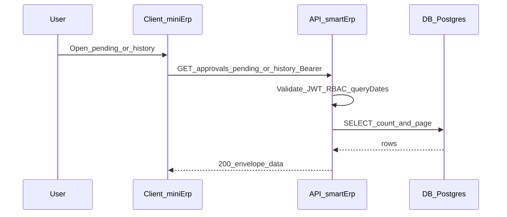

# SRS — UC4 Approvals — danh sách chờ duyệt & lịch sử phê duyệt — Task061–Task062

> **File (Spring / `smart-erp`):** `backend/docs/srs/SRS_Task061-062_approvals-pending-and-history.md`  
> **Người soạn:** Agent BA (+ SQL theo `backend/AGENTS/BA_AGENT_INSTRUCTIONS.md`, `backend/AGENTS/SQL_AGENT_INSTRUCTIONS.md`)  
> **Ngày:** 28/04/2026  
> **Trạng thái:** `Approved`  
> **PO duyệt (khi Approved):** PO (chốt OQ §4 — 28/04/2026), `28/04/2026`

---

## 0. Đầu vào & traceability

| Nguồn | Đường dẫn / ghi chú |
| :--- | :--- |
| API Task061 | [`../../../frontend/docs/api/API_Task061_approvals_pending_get_list.md`](../../../frontend/docs/api/API_Task061_approvals_pending_get_list.md) |
| API Task062 | [`../../../frontend/docs/api/API_Task062_approvals_history_get_list.md`](../../../frontend/docs/api/API_Task062_approvals_history_get_list.md) |
| Khung API / UC4 | [`../../../frontend/docs/api/API_PROJECT_DESIGN.md`](../../../frontend/docs/api/API_PROJECT_DESIGN.md) §4.5 (Approvals) |
| Envelope | [`../../../frontend/docs/api/API_RESPONSE_ENVELOPE.md`](../../../frontend/docs/api/API_RESPONSE_ENVELOPE.md) |
| UC / DB §17 | [`../../../frontend/docs/UC/Database_Specification.md`](../../../frontend/docs/UC/Database_Specification.md) §17 `StockReceipts` |
| Luồng ghi sau duyệt | [`../../../frontend/docs/api/API_Task019_stock_receipts_approve.md`](../../../frontend/docs/api/API_Task019_stock_receipts_approve.md), [`../../../frontend/docs/api/API_Task020_stock_receipts_reject.md`](../../../frontend/docs/api/API_Task020_stock_receipts_reject.md) |
| Flyway | [`../../smart-erp/src/main/resources/db/migration/V1__baseline_smart_inventory.sql`](../../smart-erp/src/main/resources/db/migration/V1__baseline_smart_inventory.sql) — bảng `StockReceipts`; [`../../smart-erp/src/main/resources/db/migration/V9__task013_stock_receipts_review_columns.sql`](../../smart-erp/src/main/resources/db/migration/V9__task013_stock_receipts_review_columns.sql) — `rejection_reason`, `reviewed_at`, `reviewed_by` + backfill một phần |
| UI index | [`../../../frontend/mini-erp/src/features/FEATURES_UI_INDEX.md`](../../../frontend/mini-erp/src/features/FEATURES_UI_INDEX.md) |

### 0.1 Đồng nhất (API markdown ↔ SRS ↔ Flyway)

| Điểm | Trong API markdown | Cách chốt trong SRS / triển khai |
| :--- | :--- | :--- |
| Tên bảng trong ví dụ SQL Task061/062 | `stock_receipts` (snake có gạch dưới) | PostgreSQL từ migration dùng tên thực tế **`stockreceipts`** (không quote, chữ thường) — Dev JPA/native query **bám Flyway**; ví dụ SQL dưới §10 dùng `stockreceipts`. |
| Validation `fromDate` > `toDate` | Task062 có **400**; Task061 không nêu | **Thống nhất dự án:** cả **`GET /approvals/pending`** và **`GET /approvals/history`** trả **400** `BAD_REQUEST` khi **cả hai** tham số có mặt và `fromDate > toDate` (cùng nội dung `message` thân thiện người dùng, có thể kèm `details` field-level theo envelope). |
| Trục thời gian lọc | Task061: `created_at` / policy `receipt_date`; Task062: `reviewed_at` | **Pending:** lọc `fromDate`/`toDate` theo **`receipt_date::date`** (**OQ-2b** đã chốt). Thứ tự hiển thị hàng chờ: **`created_at ASC`** (FIFO theo thời điểm vào hệ thống). Trường JSON **`date`** trong từng item pending: map từ **`receipt_date`** (đầu ngày ISO-8601 theo quy ước BE). **History:** filter theo **`reviewed_at::date`** như Task062. |
| `type` ≠ Inbound | Task061 MVP UNION/rỗng; Task062 trả `items: []`, `total: 0` | **Giữ:** cùng semantics — không lỗi, danh sách rỗng cho Outbound/Return/Debt cho đến task sau. |
| `summary.byType` (Task061) | Đếm theo nhánh | MVP: chỉ nhánh `stock_receipt` → **`Inbound`** có thể > 0; các loại khác **0** cho đến khi có UNION. |

---

## 1. Tóm tắt điều hành

- **Vấn đề:** Mini-ERP UC4 cần hai endpoint đọc thống nhất: **chờ phê duyệt** (badge + bảng) và **lịch sử đã xử lý** (đã duyệt / từ chối), thay mock store.
- **Mục tiêu nghiệp vụ:** Trả envelope chuẩn; RBAC **Owner + Admin** (Staff **403** theo spec); phân trang; lọc an toàn; read-model **`entityType` + `entityId`** để UI gọi Task019/020 cho phiếu nhập.
- **Đối tượng:** User Owner/Admin trên trình duyệt; client `mini-erp`.

### 1.1 Giao diện Mini-ERP

| Nhãn menu (Sidebar) | Route | Page (export) | Component / vùng chính | File (dưới `frontend/mini-erp/src/features/`) |
| :--- | :--- | :--- | :--- | :--- |
| *(nhóm Phê duyệt / UC4 — theo Sidebar thực tế)* | `/approvals/pending` | `PendingApprovalsPage` | Bảng chờ duyệt, map `entityType`/`entityId` → Task019/020 | `approvals/pages/PendingApprovalsPage.tsx` |
| *(tương tự)* | `/approvals/history` | `ApprovalHistoryPage` | Bảng lịch sử, cột xử lý theo `reviewedAt` / `resolution` | `approvals/pages/ApprovalHistoryPage.tsx` |

---

## 2. Bóc tách nghiệp vụ (capabilities)

| # | Capability | Kích hoạt bởi | Kết quả mong đợi | Ghi chú |
| :---: | :--- | :--- | :--- | :--- |
| C1 | Liệt kê chờ duyệt + tổng hợp | `GET /api/v1/approvals/pending` | `200` + `data.summary` + `data.items` + `page`/`limit`/`total` | MVP: chỉ `stock_receipt` / `Pending` |
| C2 | Liệt kê lịch sử đã xử lý | `GET /api/v1/approvals/history` | `200` + `items` + phân trang | Chỉ `Approved` \| `Rejected` và `reviewed_at IS NOT NULL` |
| C3 | Lọc & tìm kiếm | Query params hai endpoint | Filter đúng cột §0.1; `search` ILIKE mã + tên (theo từng endpoint) | History: creator + reviewer name |
| C4 | Từ chối truy cập | Staff hoặc thiếu quyền | **403** envelope | Không leak chi tiết nội bộ |

---

## 3. Phạm vi

### 3.1 In-scope

- Hai GET nêu trên; JSON `data` đúng field camelCase như mục 8; mã lỗi **400** (validation ngày), **401**, **403**, **500**.
- Đọc `stockreceipts` + join `users` (creator; history thêm reviewer).
- Phụ thuộc **V9** đã có trên môi trường triển khai; bản ghi `Approved`/`Rejected` chưa có `reviewed_at` sau migration **không** xuất hiện ở history (theo Task062) — đã backfill một phần trong V9.
- **Tiên quyết go-live (OQ-3c):** mọi `Rejected` có `rejection_reason` non-null trước khi UAT chấp nhận history đầy đủ.

### 3.2 Out-of-scope

- Thực hiện duyệt/từ chối (Task019/020).
- UNION Outbound/Return/Debt (chờ task API nghiệp vụ tương ứng).
- Mở rộng RBAC cho Staff đọc approvals — **đã loại** theo **OQ-1a** (§4); v1 giữ **403** cho Staff.

---

## 4. Câu hỏi cho PO (Open Questions) — **đã chốt 28/04/2026**

> Không còn OQ mở cho v1. Triển khai BE/FE/UAT bám bảng **§4.1**.

### 4.1 Quyết định PO (áp dụng triển khai)

| ID | Quyết định | Diễn giải kỹ thuật |
| :--- | :--- | :--- |
| **OQ-1** | **(a)** | Staff: **403** trên `GET /approvals/pending` và `GET /approvals/history` (không read-only API cho Staff trong v1). |
| **OQ-2** | **(b)** | Lọc ngày pending (`fromDate`/`toDate`): so với **`receipt_date::date`**. JSON **`date`** mỗi item pending: từ **`receipt_date`**. Sắp hàng danh sách chờ: **`created_at ASC`**. |
| **OQ-3** | **(c)** | Trước go-live Task061/062: **backfill / script** đảm bảo mọi bản ghi `Rejected` có **`rejection_reason`** non-null (sau đó Task020 duy trì). UAT: không còn `Rejected` thiếu lý do; response history: với `resolution=Rejected` thì **`rejectionReason`** luôn chuỗi non-empty. |

### 4.2 Bảng chữ ký (mẫu template)

| ID | Quyết định PO | Ngày |
| :--- | :--- | :--- |
| OQ-1 | (a) — Staff 403 hai GET | 28/04/2026 |
| OQ-2 | (b) — Lọc pending theo `receipt_date`; `date` item = `receipt_date`; sort `created_at ASC` | 28/04/2026 |
| OQ-3 | (c) — Data fix đầy đủ `rejection_reason` trước release | 28/04/2026 |

---

## 5. Phân tích scope tệp & bằng chứng

### 5.1 Tài liệu đã đối chiếu (read)

- `API_Task061`, `API_Task062`; `API_RESPONSE_ENVELOPE.md`; `FEATURES_UI_INDEX.md` (approvals); `Database_Specification` §17 (tham chiếu); Flyway **V1** + **V9**.

### 5.2 Mã / migration dự kiến (write / verify)

- Controller (vd. `ApprovalsController` hoặc namespace tương đương), service read-only, repository/JPQL hoặc native query có tham số bind.
- **Không** migration mới nếu V9 đã apply; nếu môi trường cũ thiếu cột → lệch schema: GAP triển khai DevOps.

### 5.3 Rủi ro phát hiện sớm

- Đếm `total` + `summary` phải đồng bộ cùng predicate WHERE (tránh lệch trang).
- Index: tận dụng `idx_sr_reviewed_at`, `idx_sr_status` (V1/V9); thêm composite nếu EXPLAIN báo full scan lớn sau dữ liệu thật.

---

## 6. Persona & RBAC

| Vai trò | Điều kiện gọi API | `GET /approvals/pending` | `GET /approvals/history` |
| :--- | :--- | :--- | :--- |
| Chưa đăng nhập / token invalid | — | **401** | **401** |
| **Owner**, **Admin** | JWT hợp lệ | **200** nếu thỏa validation | **200** nếu thỏa validation |
| **Staff** | JWT hợp lệ | **403** | **403** |
| Thiếu quyền module (nếu có guard riêng) | — | **403** | **403** |

`message` lỗi: tiếng Việt, chức năng — vd. 403 *“Bạn không có quyền xem danh sách phê duyệt”* / history tương tự Task062 mẫu.

---

## 7. Actor & luồng nghiệp vụ

### 7.1 Danh sách actor

| Actor | Mô tả |
| :--- | :--- |
| User | Owner / Admin (API approvals read; Staff không dùng hai GET này) |
| Client | `mini-erp` |
| API | `smart-erp` REST |
| DB | PostgreSQL `stockreceipts`, `users` |

### 7.2 Luồng (narrative)

1. User mở màn chờ duyệt → Client `GET /api/v1/approvals/pending?…` có Bearer.  
2. API kiểm tra JWT + role → đọc DB → trả `summary` + `items` (MVP Inbound).  
3. User mở lịch sử → `GET /api/v1/approvals/history?…` → lọc theo `reviewed_at`, `resolution`, `type`.  
4. UI dùng `entityType`/`entityId` để điều hướng hành động duyệt (Task019/020) — ngoài scope hai GET này.

### 7.3 Sơ đồ



---

## 8. Hợp đồng HTTP & ví dụ JSON

> **Cho agent API_BRIDGE:** mỗi dòng dưới đây là một hàng trong bảng đối chiếu `Path` ↔ file `features/approvals/api/*.ts` ↔ page. Query string **camelCase** như bảng. Response luôn có `success`, `message`; lỗi có `error` (UPPER_SNAKE). Không đọc full SRS — chỉ cần **mục 8** + **§6 RBAC** + **§0.1** khi nối dây.

### 8.0 Khóa ổn định cho client

- **Duy nhất thực thể:** (`entityType`, `entityId`) — vd. `stock_receipt` + `12`.  
- **Không** dùng chung một trường `id` số giữa các bảng khác nhau.

---

### 8.A — `GET /api/v1/approvals/pending` (Task061)

#### 8.A.1 Tổng quan

| Thuộc tính | Giá trị |
| :--- | :--- |
| Method + path | `GET /api/v1/approvals/pending` |
| Auth | `Bearer` |
| Content-Type response | `application/json; charset=UTF-8` |

#### 8.A.2 Query — schema logic

| Param | Kiểu | Mặc định | Validation | Mô tả |
| :--- | :--- | :--- | :--- | :--- |
| `search` | string | — | trim, max length hợp lý (vd. 200) | ILIKE `receipt_code`; MVP có thể mở rộng tên creator |
| `type` | string | `all` | enum `all\|Inbound\|Outbound\|Return\|Debt` | MVP: chỉ Inbound có bản ghi |
| `fromDate` | date `YYYY-MM-DD` | — | optional | So `receipt_date::date` (**OQ-2b**) |
| `toDate` | date `YYYY-MM-DD` | — | optional; inclusive end of day | So `receipt_date::date` (**OQ-2b**) |
| `page` | int | `1` | >= 1 | |
| `limit` | int | `50` | 1–100 | |

**400:** khi có đủ `fromDate` và `toDate` và `fromDate > toDate`.

#### 8.A.3 Request

Không body. Ví dụ URL:

```http
GET /api/v1/approvals/pending?type=Inbound&page=1&limit=50
```

#### 8.A.4 Response 200 — ví dụ JSON đầy đủ

```json
{
  "success": true,
  "data": {
    "summary": {
      "totalPending": 2,
      "byType": { "Inbound": 2, "Outbound": 0, "Return": 0, "Debt": 0 }
    },
    "items": [
      {
        "entityType": "stock_receipt",
        "entityId": 12,
        "transactionCode": "PN-2026-0012",
        "type": "Inbound",
        "creatorName": "Nguyễn Văn Kho",
        "date": "2026-04-19T00:00:00Z",
        "totalAmount": 12500000,
        "status": "Pending",
        "notes": "Nhập hàng sữa từ Vinamilk"
      }
    ],
    "page": 1,
    "limit": 50,
    "total": 2
  },
  "message": "Thành công"
}
```

**Ràng buộc field `data.items[]`:**

| Field | Kiểu | Bắt buộc | Ghi chú |
| :--- | :--- | :---: | :--- |
| `entityType` | string | Có | MVP: `stock_receipt` |
| `entityId` | number | Có | PK phiếu nhập |
| `transactionCode` | string | Có | `receipt_code` |
| `type` | string | Có | Nhãn UI: `Inbound` |
| `creatorName` | string | Có | Từ `users.full_name` |
| `date` | string (ISO-8601) | Có | Nguồn: **`receipt_date`** (OQ-2b; serialize theo quy ước BE, vd. đầu ngày UTC) |
| `totalAmount` | number | Có | DECIMAL |
| `status` | string | Có | Luôn `Pending` trong endpoint này |
| `notes` | string \| null | Có | |

#### 8.A.5 Response lỗi (Task061)

**400 — khoảng ngày không hợp lệ**

```json
{
  "success": false,
  "error": "BAD_REQUEST",
  "message": "Ngày bắt đầu không được sau ngày kết thúc.",
  "details": { "fromDate": "fromDate phải nhỏ hơn hoặc bằng toDate" }
}
```

**401**

```json
{
  "success": false,
  "error": "UNAUTHORIZED",
  "message": "Phiên đăng nhập không hợp lệ hoặc đã hết hạn. Vui lòng đăng nhập lại."
}
```

**403**

```json
{
  "success": false,
  "error": "FORBIDDEN",
  "message": "Bạn không có quyền xem danh sách chờ phê duyệt."
}
```

**500** — theo chuẩn dự án (message không lộ stack).

---

### 8.B — `GET /api/v1/approvals/history` (Task062)

#### 8.B.1 Tổng quan

| Thuộc tính | Giá trị |
| :--- | :--- |
| Method + path | `GET /api/v1/approvals/history` |
| Auth | `Bearer` |

#### 8.B.2 Query — schema logic

| Param | Kiểu | Mặc định | Validation | Mô tả |
| :--- | :--- | :--- | :--- | :--- |
| `resolution` | string | `all` | `all\|Approved\|Rejected` | Map `status` |
| `search` | string | — | | ILIKE mã phiếu, tên creator, tên reviewer |
| `type` | string | `all` | | v1: chỉ `all` và `Inbound` có dữ liệu; khác → rỗng |
| `fromDate` | `YYYY-MM-DD` | — | | `reviewed_at::date >=` |
| `toDate` | `YYYY-MM-DD` | — | inclusive | `reviewed_at::date <=` |
| `page` | int | `1` | >= 1 | |
| `limit` | int | `20` | 1–100 | |

**400:** `fromDate > toDate` khi cả hai có mặt (cùng cấu trúc message như 8.A.5).

#### 8.B.3 Request

```http
GET /api/v1/approvals/history?resolution=all&type=Inbound&page=1&limit=20
```

#### 8.B.4 Response 200 — ví dụ JSON đầy đủ

```json
{
  "success": true,
  "data": {
    "items": [
      {
        "entityType": "stock_receipt",
        "entityId": 8,
        "transactionCode": "PN-2026-0008",
        "type": "Inbound",
        "creatorName": "Nguyễn Văn Kho",
        "date": "2026-04-18T10:00:00Z",
        "reviewedAt": "2026-04-18T11:30:00Z",
        "totalAmount": 8900000,
        "resolution": "Rejected",
        "rejectionReason": "Sai đơn giá so với hợp đồng",
        "notes": "Nhập bánh kẹo Kinh Đô",
        "reviewedByUserId": 2,
        "reviewerName": "Chủ hệ thống",
        "approvedByUserId": null,
        "approvedAt": null
      },
      {
        "entityType": "stock_receipt",
        "entityId": 7,
        "transactionCode": "PN-2026-0007",
        "type": "Inbound",
        "creatorName": "Nguyễn Văn Kho",
        "date": "2026-04-17T09:00:00Z",
        "reviewedAt": "2026-04-17T15:00:00Z",
        "totalAmount": 5000000,
        "resolution": "Approved",
        "rejectionReason": null,
        "notes": null,
        "reviewedByUserId": 2,
        "reviewerName": "Chủ hệ thống",
        "approvedByUserId": 2,
        "approvedAt": "2026-04-17T15:00:00Z"
      }
    ],
    "page": 1,
    "limit": 20,
    "total": 45
  },
  "message": "Thành công"
}
```

**Ràng buộc field `data.items[]` (bổ sung so pending):**

| Field | Kiểu | Bắt buộc | Ghi chú |
| :--- | :--- | :---: | :--- |
| `reviewedAt` | string (ISO-8601) | Có | Luôn non-null trong tập kết quả |
| `resolution` | string | Có | `Approved` \| `Rejected` |
| `rejectionReason` | string \| null | Có | Với `resolution=Rejected`: **non-empty** sau data fix **OQ-3c**; `Approved` → `null` |
| `reviewedByUserId` | number \| null | Có | |
| `reviewerName` | string \| null | Có | JOIN reviewer |
| `approvedByUserId` | number \| null | Có | Thường chỉ khi Approved |
| `approvedAt` | string \| null | Có | |

**Sắp xếp mặc định:** `reviewed_at DESC`.

#### 8.B.5 Response lỗi

Dùng cùng pattern **401** / **403** / **500** như 8.A.5; riêng **403** message gợi ý:

```json
{
  "success": false,
  "error": "FORBIDDEN",
  "message": "Bạn không có quyền xem lịch sử phê duyệt."
}
```

---

## 9. Quy tắc nghiệp vụ

| Mã | Điều kiện | Hành động / kết quả |
| :--- | :--- | :--- |
| BR-1 | `type` ∈ {`Outbound`,`Return`,`Debt`} | Trả **200** với `items: []`, `total: 0` (history); pending: không row từ các loại chưa triển khai |
| BR-2 | Pending | Chỉ `status = 'Pending'` |
| BR-3 | History | `status IN ('Approved','Rejected')` **và** `reviewed_at IS NOT NULL` |
| BR-4 | Cả hai GET | `fromDate` & `toDate` có và `fromDate > toDate` → **400** |
| BR-5 | Phân trang | `total` = COUNT cùng WHERE, không tính sai khi filter |
| BR-6 | `resolution = Rejected` trong history (sau OQ-3c) | `rejection_reason` / JSON `rejectionReason` **non-empty**; không còn bản ghi legacy thiếu lý do trên môi trường được chấp nhận |

---

## 10. Dữ liệu & SQL tham chiếu (Agent SQL / Dev)

> Dialect PostgreSQL; tham số bind — không nối chuỗi. Tên bảng **`stockreceipts`** theo Flyway.

### 10.1 Bảng / quan hệ

| Bảng | Read | Ghi chú |
| :--- | :--- | :--- |
| `stockreceipts` | Có | `status`, `receipt_code`, `staff_id`, `created_at`, `receipt_date`, `total_amount`, `notes`, `approved_by`, `approved_at`, `reviewed_at`, `reviewed_by`, `rejection_reason` |
| `users` | Có | creator + (history) reviewer |

### 10.2 SQL — Pending (MVP)

```sql
-- Đếm total + summary song song hoặc CTE; ví dụ danh sách trang
SELECT
  sr.id AS entity_id,
  sr.receipt_code,
  sr.receipt_date,
  sr.created_at,
  sr.total_amount,
  sr.status,
  sr.notes,
  u.full_name AS creator_name
FROM stockreceipts sr
JOIN users u ON u.id = sr.staff_id
WHERE sr.status = 'Pending'
  AND (:search IS NULL OR sr.receipt_code ILIKE '%' || :search || '%')
  AND (:from_date IS NULL OR sr.receipt_date >= :from_date::date)
  AND (:to_date IS NULL OR sr.receipt_date <= :to_date::date)
ORDER BY sr.created_at ASC
LIMIT :limit OFFSET (:page - 1) * :limit;
```

### 10.3 SQL — History (v1)

```sql
SELECT
  sr.id AS entity_id,
  sr.receipt_code,
  sr.created_at,
  sr.reviewed_at,
  sr.total_amount,
  sr.status AS resolution,
  sr.rejection_reason,
  sr.notes,
  sr.approved_by,
  sr.approved_at,
  sr.reviewed_by,
  u_creator.full_name AS creator_name,
  u_rev.full_name AS reviewer_name
FROM stockreceipts sr
JOIN users u_creator ON u_creator.id = sr.staff_id
LEFT JOIN users u_rev ON u_rev.id = sr.reviewed_by
WHERE sr.status IN ('Approved', 'Rejected')
  AND sr.reviewed_at IS NOT NULL
  AND (:resolution = 'all' OR sr.status = :resolution)
  AND (:search IS NULL OR sr.receipt_code ILIKE '%' || :search || '%'
       OR u_creator.full_name ILIKE '%' || :search || '%'
       OR u_rev.full_name ILIKE '%' || :search || '%')
  AND (:from_date IS NULL OR sr.reviewed_at::date >= :from_date::date)
  AND (:to_date IS NULL OR sr.reviewed_at::date <= :to_date::date)
ORDER BY sr.reviewed_at DESC
LIMIT :limit OFFSET (:page - 1) * :limit;
```

### 10.4 Transaction

- Read-only: `@Transactional(readOnly = true)` cho cả hai endpoint.

### 10.5 Index

- Đã có: `idx_sr_status`, `idx_sr_reviewed_at`, `idx_sr_receipt_date` (V9).  
- Pending lọc theo `receipt_date`: đánh giá composite **`(status, receipt_date)`** (hoặc `(status, receipt_date, created_at)`) nếu EXPLAIN báo cần — ghi ticket nếu thêm index mới qua Flyway.

### 10.6 Kiểm chứng cho Tester

- Seed ít nhất 1 `Pending`, 1 `Approved`, 1 `Rejected` với `reviewed_at` khác null; `Rejected` có `rejection_reason` non-null (**OQ-3c**).  
- Gọi pending/history với Staff → 403.  
- `fromDate` > `toDate` → 400 cả hai endpoint.  
- Pending: hai phiếu `receipt_date` khác nhau — lọc `fromDate`/`toDate` chỉ trả đúng phiếu trong khoảng (**OQ-2b**).

---

## 11. Acceptance criteria (Given / When / Then)

```text
Given Owner đã đăng nhập hợp lệ
When GET /api/v1/approvals/pending không tham số
Then 200 và data.items chỉ chứa phiếu status Pending (MVP stock_receipt)
```

```text
Given có 2 phiếu Pending thỏa filter
When GET /api/v1/approvals/pending?page=1&limit=50
Then data.total = 2 và data.summary.totalPending khớp số bản ghi pending (MVP)
```

```text
Given fromDate và toDate hợp lệ
When GET /api/v1/approvals/pending?fromDate=2026-04-01&toDate=2026-04-30
Then chỉ phiếu có receipt_date trong khoảng fromDate..toDate (OQ-2b)
```

```text
Given fromDate > toDate
When GET /api/v1/approvals/pending (hoặc history) với cả hai param
Then 400 BAD_REQUEST và message thân thiện người dùng
```

```text
Given Staff đăng nhập
When GET /api/v1/approvals/pending hoặc history
Then 403 FORBIDDEN
```

```text
Given Owner và có phiếu Approved/Rejected đã có reviewed_at
When GET /api/v1/approvals/history
Then 200, items sắp reviewedAt giảm dần, mỗi item có entityType stock_receipt
```

```text
Given resolution=Rejected
When GET /api/v1/approvals/history?resolution=Rejected
Then chỉ bản ghi resolution Rejected
```

```text
Given type=Outbound
When GET /api/v1/approvals/history?type=Outbound
Then 200 với items rỗng và total = 0
```

```text
Given đã hoàn tất data fix OQ-3c
When GET /api/v1/approvals/history?resolution=Rejected
Then mọi item có rejectionReason là chuỗi non-empty
```

---

## 12. GAP & giả định

| GAP / Giả định | Tác động | Hành động đề xuất |
| :--- | :--- | :--- |
| Ví dụ SQL trong tài liệu API khác vẫn ghi `stock_receipts` | Nhầm tên bảng khi copy | Dev bám Flyway **`stockreceipts`**; DOC_SYNC dần các file còn lệch |
| `summary.byType` khi có nhiều UNION sau này | Logic đếm phức tạp | SRS v1 giữ MVP; mở rộng CR |
| Đồng bộ Task061 ↔ SRS | — | `API_Task061_approvals_pending_get_list.md` đã khớp **OQ-2b**, bảng `stockreceipts`, **400** khoảng ngày, Zod refine (28/04/2026). |

---

## 13. PO sign-off (chỉ điền khi Approved)

- [x] Đã trả lời / đóng các **OQ** cần thiết cho release (**§4.1–4.2**)
- [x] JSON request/response khớp ý đồ sản phẩm
- [x] Phạm vi In/Out đã đồng ý

**Chữ ký / nhãn PR:** SRS Approved Task061–062 — `28/04/2026`

---

### Phụ lục — Gợi ý prompt API_BRIDGE (sau khi BE sẵn sàng)

Mỗi endpoint một phiên (theo `API_BRIDGE_AGENT_INSTRUCTIONS.md`):

```text
API_BRIDGE | Task=Task061 | Path=/api/v1/approvals/pending | Mode=verify
```

```text
API_BRIDGE | Task=Task062 | Path=/api/v1/approvals/history | Mode=wire-fe
```

Context UI: `FEATURES_UI_INDEX` → `approvals/pages/PendingApprovalsPage.tsx` / `ApprovalHistoryPage.tsx`. File API: `API_Task061_…` / `API_Task062_…`. SRS: chỉ cần **§8** + **§6** cho shape và quyền.
