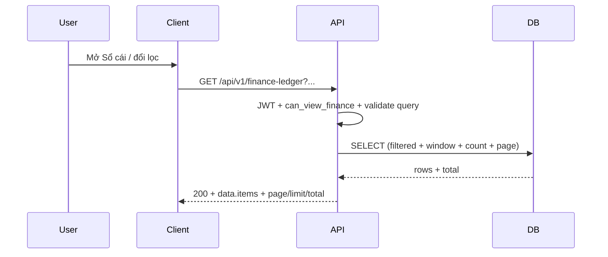

# SRS — Sổ cái tài chính — `GET /api/v1/finance-ledger` (read-only, phân trang, số dư lũy kế) — Task063

> **File (Spring / `smart-erp`):** `backend/docs/srs/SRS_Task063_finance-ledger-get-list.md`  
> **Người soạn:** Agent BA (+ SQL theo `backend/AGENTS/BA_AGENT_INSTRUCTIONS.md`, `backend/AGENTS/SQL_AGENT_INSTRUCTIONS.md`)  
> **Ngày:** 28/04/2026  
> **Trạng thái:** `Approved`  
> **PO duyệt (khi Approved):** PO (chốt OQ §4 — 28/04/2026), `28/04/2026`

---

## 0. Đầu vào & traceability

| Nguồn | Đường dẫn / ghi chú |
| :--- | :--- |
| API Task063 | [`../../../frontend/docs/api/API_Task063_finance_ledger_get_list.md`](../../../frontend/docs/api/API_Task063_finance_ledger_get_list.md) — **Approved**, đồng bộ SRS 28/04/2026 |
| Khung API | [`../../../frontend/docs/api/API_PROJECT_DESIGN.md`](../../../frontend/docs/api/API_PROJECT_DESIGN.md) §4.14 (tham chiếu API doc §3) |
| Envelope | [`../../../frontend/docs/api/API_RESPONSE_ENVELOPE.md`](../../../frontend/docs/api/API_RESPONSE_ENVELOPE.md) |
| UC / DB (tham chiếu) | [`../../../frontend/docs/UC/Database_Specification.md`](../../../frontend/docs/UC/Database_Specification.md) §12 `FinanceLedger` |
| Flyway thực tế | [`../../smart-erp/src/main/resources/db/migration/V1__baseline_smart_inventory.sql`](../../smart-erp/src/main/resources/db/migration/V1__baseline_smart_inventory.sql) — bảng `FinanceLedger` (§10), index `idx_finance_date`, `idx_finance_type`; mã Java hiện có ghi `INSERT INTO financeledger` tại [`StockReceiptLifecycleJdbcRepository.java`](../../smart-erp/src/main/java/com/example/smart_erp/inventory/receipts/lifecycle/StockReceiptLifecycleJdbcRepository.java) |
| UI index | [`../../../frontend/mini-erp/src/features/FEATURES_UI_INDEX.md`](../../../frontend/mini-erp/src/features/FEATURES_UI_INDEX.md) — `cashflow/` |

---

## 1. Tóm tắt điều hành

- **Vấn đề:** Màn **Sổ cái tài chính** cần dữ liệu thật từ DB thay mock; người dùng phải xem bút toán theo thời gian, lọc theo ngày/loại/tham chiếu/tìm kiếm, và thấy **số dư lũy kế** (`balance`) nhất quán với thứ tự nghiệp vụ.
- **Mục tiêu nghiệp vụ:** Một endpoint **đọc** duy nhất, envelope thống nhất, RBAC **`can_view_finance: true`** trong JWT (§4 OQ-2), phân trang có giới hạn; khi client **không** gửi `dateFrom`/`dateTo` → server áp dụng **cửa sổ 90 ngày** mặc định (§4 OQ-1); `balance` tính trên **toàn tập** bản ghi thỏa bộ lọc (sau áp mặc định ngày) rồi mới cắt trang (theo `API_Task063` §2, §8).
- **Đối tượng:** Owner / Admin / kế toán có quyền xem tài chính (seed V1: Owner, Admin có `can_view_finance: true`; Staff `false`).

### 1.1 Giao diện Mini-ERP

> Nhãn / route theo [`FEATURES_UI_INDEX.md`](../../../frontend/mini-erp/src/features/FEATURES_UI_INDEX.md) và `API_Task063` §1, §6.

| Nhãn menu (Sidebar) | Route | Page (export) | Component / vùng chính | File (dưới `frontend/mini-erp/src/features/`) |
| :--- | :--- | :--- | :--- | :--- |
| Sổ cái (nhóm Thu chi) | `/cashflow/ledger` | `LedgerPage` | `LedgerTable`, `LedgerToolbar` | `cashflow/pages/LedgerPage.tsx`; `cashflow/components/LedgerTable.tsx`, `LedgerToolbar.tsx` |

---

## 2. Bóc tách nghiệp vụ (capabilities)

| # | Capability | Kích hoạt bởi | Kết quả mong đợi | Ghi chú |
| :---: | :--- | :--- | :--- | :--- |
| C1 | Xác thực JWT | Mọi request có `Authorization` | **401** nếu thiếu/sai/hết hạn | Chuẩn dự án |
| C2 | Kiểm tra quyền xem tài chính | Sau khi xác thực | **403** nếu JWT không có `can_view_finance: true` | Chỉ claim permission — **OQ-2 đã chốt**; Owner/Admin có quyền qua seed V1, Staff không |
| C3 | Validate query | Tham số URL | **400** nếu `transactionType` ngoài enum, `limit` > 100 hoặc < 1, `page` < 1, `dateFrom` > `dateTo`, định dạng date sai | Khớp Zod `API_Task063` §10 |
| C4 | Lọc bút toán | Query hợp lệ | Tập `filtered` ⊆ `financeledger` theo `transaction_date` trong khoảng **hiệu lực** (`effectiveDateFrom` / `effectiveDateTo` — xem **BR-6**), cộng `transactionType`, `referenceType`, `search` (ILIKE `description`) | Cột thật: `transaction_date`, `transaction_type`, `reference_type`, `description` |
| C5 | Tính số dư lũy kế | Trên tập đã lọc | `balance` = `SUM(amount) OVER (ORDER BY transaction_date ASC, id ASC)` | **Toàn tập filtered**, sau đó mới `LIMIT/OFFSET` — khớp `API_Task063` §2, §8 |
| C6 | Phân trang + tổng | `page`, `limit` | **200** + `data.items`, `data.page`, `data.limit`, `data.total` | `total` = số dòng trong `filtered` |
| C7 | Map Nợ/Có/JSON | Mỗi dòng trả về | `debit` / `credit` từ `amount`: `amount > 0` → `credit = amount`, `debit = 0`; `amount < 0` → `debit = \|amount\|`, `credit = 0` | Khớp `API_Task063` §2 |
| C8 | Mã hiển thị (`transactionCode`) | Read-model | `reference_type = 'SalesOrder'`: **LEFT JOIN** `salesorders` ON `reference_id = id` → `transactionCode = order_code` nếu có bản ghi; orphan → `FL-{id}`. Các `reference_type` khác (v1): **`FL-{id}`** | **OQ-3 đã chốt** |

---

## 3. Phạm vi

### 3.1 In-scope

- `GET /api/v1/finance-ledger` đúng query + response trong `API_Task063`.  
- Đọc bảng `financeledger` (ánh xạ từ DDL `FinanceLedger` trong Flyway V1 — tên vật lý PG thường là chữ thường, xem §10).  
- RBAC **`can_view_finance: true`** trong JWT (**OQ-2 đã chốt** — không ngoại lệ theo `role`).  
- Không ghi DB trong endpoint này.

### 3.2 Out-of-scope

- Ghi sổ tự động từ đơn hàng / phiếu / thu chi (luồng khác; đã có ví dụ INSERT sổ cái từ phiếu nhập trong lifecycle).  
- Sửa/xóa dòng `FinanceLedger` qua REST.  
- Báo cáo tổng hợp dashboard (API riêng nếu có).  
- `meta` tách khỏi `data` — contract hiện dùng `page` / `limit` / `total` **trong** `data` (khớp `API_RESPONSE_ENVELOPE` §2.3 và ví dụ `API_Task063` §7).

---

## 4. Câu hỏi cho PO (Open Questions) — **đã chốt 28/04/2026**

> Không còn OQ mở cho triển khai Task063; bảng dưới là quyết định PO để Dev/Tester bám sát.

### 4.1 Quyết định PO (áp dụng triển khai)

| ID | Quyết định (PO) | Diễn giải kỹ thuật |
| :--- | :--- | :--- |
| **OQ-1** | **(a) Cửa sổ 90 ngày mặc định** | Khi **cả hai** query `dateFrom` và `dateTo` **đều không** gửi: server áp `effectiveDateTo = CURRENT_DATE` và `effectiveDateFrom = CURRENT_DATE - INTERVAL '89 days'` (tính theo **kiểu DATE** của PostgreSQL, **90 ngày liên tiếp** gồm cả hai đầu mốc). Nếu client gửi **một trong hai** hoặc **đủ hai** → dùng đúng giá trị client (sau validate `dateFrom` ≤ `dateTo`). |
| **OQ-2** | **Chỉ `can_view_finance`** | Kiểm tra duy nhất claim **`can_view_finance: true`** trong JWT (`MenuPermissionClaims` / seed `Roles.permissions`). **Không** ngoại lệ riêng theo `role` (Owner không “vượt” bằng tên vai trò nếu thiếu claim). |
| **OQ-3** | **Join `SalesOrders` khi tham chiếu đơn** | Với dòng có `reference_type = 'SalesOrder'` (so khớnh chuỗi **chính xác**): **LEFT JOIN** bảng `salesorders` ON `financeledger.reference_id = salesorders.id`. `transactionCode` = `salesorders.order_code` nếu join ra bản ghi; nếu không (orphan) → `FL-{id}`. Các giá trị `reference_type` khác trong v1: `transactionCode = 'FL-{id}'` (mở rộng join sau này theo CR). |

### 4.2 Bảng chữ ký theo mẫu (đã điền)

| ID | Quyết định PO | Ngày |
| :--- | :--- | :--- |
| OQ-1 | (a) — 90 ngày mặc định khi thiếu cả hai mốc ngày | 28/04/2026 |
| OQ-2 | Chỉ `can_view_finance` trong JWT | 28/04/2026 |
| OQ-3 | Join `SalesOrders` cho `reference_type = 'SalesOrder'`; khác → `FL-{id}` | 28/04/2026 |

---

## 5. Phân tích scope tệp & bằng chứng (Evidence scope)

### 5.1 Tài liệu đã đối chiếu (read)

- `API_Task063_finance_ledger_get_list.md`; `API_RESPONSE_ENVELOPE.md`; `Database_Specification.md` §12 (mô tả logic; **đối chiếu Flyway** cho tên cột — GAP kiểu `BIGSERIAL` vs `SERIAL` tại §12).  
- Flyway V1: định nghĩa `FinanceLedger`, CHECK `transaction_type`, index.  
- `FEATURES_UI_INDEX.md`: `/cashflow/ledger`, `LedgerPage`, `LedgerTable`, `LedgerToolbar`.  
- Code: `StockReceiptLifecycleJdbcRepository` — cách INSERT `financeledger`.

### 5.2 Mã / migration dự kiến (write / verify)

- Controller mới dưới package `finance` hoặc `cashflow` (theo convention team) — `GET` map `/api/v1/finance-ledger`.  
- Service + JDBC/JPA read-only; **không** `@Transactional` ghi hoặc `UPDATE`/`DELETE` ledger.  
- Policy / method security: đọc **`can_view_finance`** từ JWT (**OQ-2**).  
- **Không** migration mới nếu chỉ đọc bảng V1; nếu sau đo `EXPLAIN` với lọc `search` + khoảng 90 ngày vẫn nặng → CR index (composite / full-text) ngoài scope tối thiểu Task063.

### 5.3 Rủi ro phát hiện sớm

- **Window + OFFSET** trên tập lớn: chi phí O(n) mỗi request; đã giảm rủi ro bằng **OQ-1** (mặc định 90 ngày); user gửi khoảng ngày rộng + `search` vẫn có thể chậm — theo dõi `EXPLAIN`.  
- **`transactionCode`**: chỉ join `salesorders` cho một `reference_type` (**OQ-3**); mở rộng `CashTransaction` / phiếu nhập sau theo CR.

---

## 6. Persona & RBAC

| Vai trò / quyền | Điều kiện gọi API | HTTP khi từ chối |
| :--- | :--- | :--- |
| Chưa đăng nhập / token invalid | — | **401** `UNAUTHORIZED` |
| Staff (seed: `can_view_finance: false`) | — | **403** `FORBIDDEN` |
| Owner, Admin (seed: `can_view_finance: true`) | — | **200** nếu query hợp lệ |

---

## 7. Actor & luồng nghiệp vụ

### 7.1 Danh sách actor

| Actor | Mô tả |
| :--- | :--- |
| User | Kế toán / Owner xem sổ cái |
| Client | `mini-erp` |
| API | `smart-erp` |
| DB | PostgreSQL — bảng `financeledger` |

### 7.2 Luồng chính (narrative)

1. User mở `/cashflow/ledger` hoặc đổi bộ lọc / trang.  
2. Client gửi `GET /api/v1/finance-ledger` kèm query (optional) và Bearer.  
3. API xác thực → kiểm tra **`can_view_finance`** → validate query → áp **effectiveDateFrom/To** nếu thiếu cả hai mốc (**BR-6**).  
4. API đọc DB: lọc (kèm LEFT JOIN `salesorders` khi cần mã chứng từ) → window `balance` → đếm `total` → cắt trang → map `debit`/`credit`/`date`/`transactionCode`.  
5. Trả **200** + envelope; client render `LedgerTable` (không tính lại `balance` trên client trừ khi đổi spec).

### 7.3 Sơ đồ



---

## 8. Hợp đồng HTTP & ví dụ JSON

### 8.1 Tổng quan endpoint

| Thuộc tính | Giá trị |
| :--- | :--- |
| Method + path | `GET /api/v1/finance-ledger` |
| Auth | `Bearer` (bắt buộc) |
| Content-Type response | `application/json; charset=UTF-8` |

### 8.2 Request — query (field-level)

| Param | Kiểu | Bắt buộc | Mặc định | Validation | Ghi chú |
| :--- | :--- | :---: | :--- | :--- | :--- |
| `dateFrom` | date (ISO `YYYY-MM-DD`) | Không | — | ≤ `dateTo` nếu cả hai có; nếu **cả hai** `dateFrom` và `dateTo` đều vắng → **BR-6** | `transaction_date >= effectiveDateFrom` |
| `dateTo` | date (ISO) | Không | — | ≥ `dateFrom` nếu cả hai có; nếu **cả hai** vắng → **BR-6** | `transaction_date <= effectiveDateTo` |
| `transactionType` | string | Không | — | Một trong: `SalesRevenue`, `PurchaseCost`, `OperatingExpense`, `Refund` | Khớp CHECK Flyway |
| `referenceType` | string | Không | — | max 50 ký tự (gợi ý) | `reference_type =` (exact) |
| `search` | string | Không | — | ILIKE `%search%` trên `description` | |
| `page` | int | Không | `1` | ≥ 1 | |
| `limit` | int | Không | `20` | 1–100 | |

### 8.3 Request — ví dụ (không có body)

Không có JSON body. Ví dụ URL:

```http
GET /api/v1/finance-ledger?dateFrom=2026-04-01&dateTo=2026-04-30&transactionType=SalesRevenue&page=1&limit=20
Authorization: Bearer <access_token>
```

### 8.4 Response thành công — `200` (ví dụ đầy đủ)

```json
{
  "success": true,
  "data": {
    "items": [
      {
        "id": 1001,
        "date": "2026-04-20",
        "transactionCode": "SO-88",
        "description": "Bán hàng đơn #88",
        "transactionType": "SalesRevenue",
        "referenceType": "SalesOrder",
        "referenceId": 88,
        "amount": 1500000,
        "debit": 0,
        "credit": 1500000,
        "balance": 1500000
      }
    ],
    "page": 1,
    "limit": 20,
    "total": 350
  },
  "message": "Thành công"
}
```

### 8.5 Response lỗi — ví dụ JSON đầy đủ

**400 — validation**

```json
{
  "success": false,
  "error": "BAD_REQUEST",
  "message": "Tham số truy vấn không hợp lệ. Vui lòng kiểm tra ngày, loại giao dịch hoặc kích thước trang.",
  "details": {
    "transactionType": "Giá trị phải là một trong: SalesRevenue, PurchaseCost, OperatingExpense, Refund",
    "limit": "Giá trị phải từ 1 đến 100"
  }
}
```

**401 — chưa đăng nhập / token hết hạn**

```json
{
  "success": false,
  "error": "UNAUTHORIZED",
  "message": "Phiên đăng nhập đã hết hạn. Vui lòng đăng nhập lại.",
  "details": {}
}
```

**403 — không đủ quyền xem tài chính**

```json
{
  "success": false,
  "error": "FORBIDDEN",
  "message": "Bạn không có quyền xem sổ cái tài chính.",
  "details": {}
}
```

**500 — lỗi hệ thống**

```json
{
  "success": false,
  "error": "INTERNAL_SERVER_ERROR",
  "message": "Không thể tải dữ liệu sổ cái. Vui lòng thử lại sau.",
  "details": {}
}
```

### 8.6 Ghi chú envelope

- Khớp [`API_RESPONSE_ENVELOPE.md`](../../../frontend/docs/api/API_RESPONSE_ENVELOPE.md).  
- **404**: không dùng cho list rỗng — trả **200** với `items: []`, `total: 0`.

---

## 9. Quy tắc nghiệp vụ (bảng)

| Mã | Điều kiện | Hành động / kết quả |
| :--- | :--- | :--- |
| BR-1 | `amount > 0` | Thu: `credit = amount`, `debit = 0` |
| BR-2 | `amount < 0` | Chi: `debit = \|amount\|`, `credit = 0` |
| BR-3 | Thứ tự tính `balance` | `ORDER BY transaction_date ASC, id ASC` trên tập đã lọc |
| BR-4 | Phân trang | `balance` trên mỗi dòng phải khớp như khi user xem toàn bộ tập đã lọc rồi cuộn tới dòng đó |
| BR-5 | Read-only | Không `UPDATE`/`DELETE` `financeledger` trong handler endpoint này |
| BR-6 | Thiếu cả `dateFrom` và `dateTo` | Server dùng **90 ngày gần nhất** theo **OQ-1 (a)**: `effectiveDateTo = CURRENT_DATE`, `effectiveDateFrom = CURRENT_DATE - 89` (DATE arithmetic) |

---

## 10. Dữ liệu & SQL tham chiếu (phối hợp Agent SQL)

### 10.1 Bảng / quan hệ (tên Flyway / PG)

| Bảng (DDL V1) | Tên vật lý PG (không quote) | Read / Write | Ghi chú |
| :--- | :--- | :---: | :--- |
| `FinanceLedger` | `financeledger` | R | Cột: `id`, `transaction_date`, `transaction_type`, `reference_type`, `reference_id`, `amount`, `description`, `created_by`, `created_at`, `updated_at` |
| `SalesOrders` | `salesorders` | R (LEFT JOIN) | Chỉ khi build `transactionCode` cho `reference_type = 'SalesOrder'` — lấy `order_code` (**OQ-3**) |
| `Users` | `users` | R (tuỳ join) | Chỉ nếu cần hiển thị người tạo — **ngoài** `API_Task063` tối thiểu |

### 10.2 SQL / ranh giới transaction

- **Read-only:** `@Transactional(readOnly = true)` hoặc tương đương; không khóa ghi.  
- **Mẫu logic (PostgreSQL)** — Dev tinh chỉnh placeholder và tên cột thực tế:

```sql
-- :effFrom / :effTo = sau khi áp BR-6 (hoặc = dateFrom/dateTo do client gửi)
WITH base AS (
  SELECT fl.id, fl.transaction_date, fl.transaction_type, fl.reference_type, fl.reference_id,
         fl.amount, fl.description,
         CASE
           WHEN fl.reference_type = 'SalesOrder' THEN COALESCE(so.order_code, 'FL-' || fl.id::text)
           ELSE 'FL-' || fl.id::text
         END AS transaction_code
  FROM financeledger fl
  LEFT JOIN salesorders so
    ON fl.reference_type = 'SalesOrder' AND fl.reference_id = so.id
  WHERE fl.transaction_date BETWEEN :effFrom AND :effTo
    AND (:transactionType IS NULL OR fl.transaction_type = :transactionType)
    AND (:referenceType IS NULL OR fl.reference_type = :referenceType)
    AND (:search IS NULL OR fl.description ILIKE '%' || :search || '%')
),
with_balance AS (
  SELECT *,
         SUM(amount) OVER (ORDER BY transaction_date ASC, id ASC) AS balance
  FROM base
),
counted AS (
  SELECT COUNT(*) AS total FROM base
)
SELECT wb.*, c.total
FROM with_balance wb
CROSS JOIN counted c
ORDER BY wb.transaction_date ASC, wb.id ASC
LIMIT :limit OFFSET :offset;
```

- **Đếm `total`:** có thể tách `SELECT COUNT(*) FROM base` để tránh nhân bản trong mỗi dòng — tối ưu do Dev.  
- **Tham số `:effFrom` / `:effTo`:** tính trong service — nếu cả `dateFrom` và `dateTo` null thì gán theo **OQ-1**; escape `%`/`_` trong `:search` khi bind.

### 10.3 Index & hiệu năng

- Đã có V1: `idx_finance_date` (`transaction_date`), `idx_finance_type` (`transaction_type`).  
- Khoảng mặc định 90 ngày + `idx_finance_date` giúp giới hạn scan; nếu user chọn khoảng rộng + `search` ILIKE nặng: cân nhắc composite / full-text — CR migration sau đo.

### 10.4 Kiểm chứng dữ liệu cho Tester

- User có `can_view_finance` → **200**, `items` là mảng (có thể rỗng).  
- Hai dòng cùng `transaction_date` khác `id` → thứ tự `balance` theo `id ASC`.  
- `amount` âm và dương trên cùng tập lọc → `balance` là tổng lũy kế có dấu.  
- Staff (không quyền) → **403**.

---

## 11. Acceptance criteria (Given / When / Then)

```text
Given JWT hợp lệ và can_view_finance = true
When GET /api/v1/finance-ledger không gửi dateFrom và dateTo
Then 200; tập lọc = các dòng có transaction_date trong 90 ngày gần nhất (OQ-1); data.total khớp số dòng đó
```

```text
Given có ít nhất hai bút toán với cùng transaction_date khác id
When GET list với lọc bao trùm cả hai
Then balance trên dòng sau = balance dòng trước + amount dòng sau (theo thứ tự id)
```

```text
Given Staff không có can_view_finance
When GET /api/v1/finance-ledger
Then 403, envelope success = false
```

```text
Given limit=101
When GET /api/v1/finance-ledger
Then 400 BAD_REQUEST với details.limit
```

```text
Given dateFrom > dateTo
When GET /api/v1/finance-ledger
Then 400 với message chức năng (khoảng ngày không hợp lệ)
```

```text
Given một dòng financeledger reference_type=SalesOrder và reference_id khớp salesorders.id
When GET list chứa dòng đó
Then item.transactionCode = salesorders.order_code (chuỗi hiển thị)
```

```text
Given reference_type khác SalesOrder (hoặc SalesOrder orphan)
When GET list
Then transactionCode = FL-{id}
```

---

## 12. GAP & giả định

| GAP / Giả định | Tác động | Hành động đề xuất |
| :--- | :--- | :--- |
| `Database_Specification.md` §12 có đoạn ví dụ `BIGSERIAL` / `finance_ledger` snake — Flyway V1 dùng `CREATE TABLE FinanceLedger` + `SERIAL` | Ai đọc nhầm doc UC có thể sai tên bảng | Dev chỉ bám **Flyway V1** + mã `INSERT` hiện có (`financeledger`) |
| `API_Task063` §1 ghi “+ meta” nhưng ví dụ JSON đặt `page`/`limit`/`total` trong `data` | FE/BE lệch từ khóa “meta” | Coi **data** là nguồn chân lý; DOC_SYNC sửa wording API nếu cần |
| (Đã đóng) GAP cũ: OQ-1 mở — không giới hạn ngày | Timeout khi ledger lớn | Đã chốt **90 ngày mặc định** khi thiếu cả `dateFrom` và `dateTo` — §4 |

---

## 13. PO sign-off (Approved — 28/04/2026)

- [x] Đã trả lời / đóng các **OQ** §4.1–4.2 (OQ-1, OQ-2, OQ-3)
- [x] JSON / RBAC / phạm vi In/Out đã đồng ý
- [x] Đồng ý chiến lược hiệu năng: cửa sổ mặc định 90 ngày; index V1; CR bổ sung nếu đo thực tế chậm

**Chữ ký / nhãn PR:** `Approved` — 28/04/2026

---

**Tổng kết nhanh**

- **Đã làm:** SRS Task063 **Approved** (§4 PO, §6 RBAC, §9 BR-6, §10 join `salesorders`, §11 AC, §13); đồng bộ **`API_Task063`** (RBAC, ngày mặc định, tên bảng PG, `transactionCode`).  
- **Việc tiếp theo:** Dev triển khai `GET /api/v1/finance-ledger`; **DOC_SYNC**/samples nếu cần; **API_BRIDGE** nối `LedgerPage`.  
- **Rủi ro:** User gửi khoảng ngày rất rộng + `search` — theo dõi hiệu năng; mở rộng join `transactionCode` theo CR.
