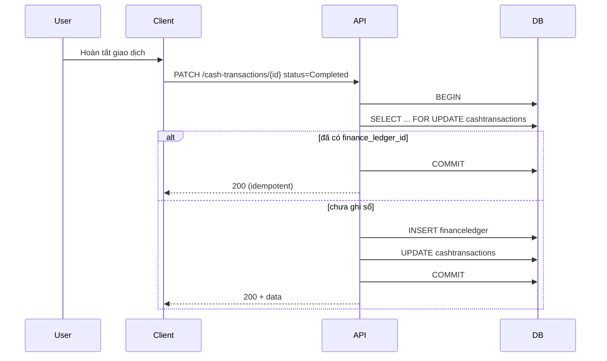

# SRS — Giao dịch thu chi thủ công — `GET|POST|GET|PATCH|DELETE /api/v1/cash-transactions` — Task064–Task068

> **File (Spring / `smart-erp`):** `backend/docs/srs/SRS_Task064-068_cash-transactions-api.md`  
> **Người soạn:** Agent BA (+ SQL theo `backend/AGENTS/BA_AGENT_INSTRUCTIONS.md`, `backend/AGENTS/SQL_AGENT_INSTRUCTIONS.md`)  
> **Ngày:** 30/04/2026  
> **Trạng thái:** `Approved`  
> **PO duyệt (khi Approved):** PO (chốt OQ §4 — 30/04/2026), `30/04/2026`

---

## 0. Đầu vào & traceability

| Nguồn | Đường dẫn / ghi chú |
| :--- | :--- |
| API Task064 | [`../../../frontend/docs/api/API_Task064_cash_transactions_get_list.md`](../../../frontend/docs/api/API_Task064_cash_transactions_get_list.md) |
| API Task065 | [`../../../frontend/docs/api/API_Task065_cash_transactions_post.md`](../../../frontend/docs/api/API_Task065_cash_transactions_post.md) |
| API Task066 | [`../../../frontend/docs/api/API_Task066_cash_transactions_get_by_id.md`](../../../frontend/docs/api/API_Task066_cash_transactions_get_by_id.md) |
| API Task067 | [`../../../frontend/docs/api/API_Task067_cash_transactions_patch.md`](../../../frontend/docs/api/API_Task067_cash_transactions_patch.md) |
| API Task068 | [`../../../frontend/docs/api/API_Task068_cash_transactions_delete.md`](../../../frontend/docs/api/API_Task068_cash_transactions_delete.md) |
| Khung API | [`../../../frontend/docs/api/API_PROJECT_DESIGN.md`](../../../frontend/docs/api/API_PROJECT_DESIGN.md) §4.14 |
| Envelope | [`../../../frontend/docs/api/API_RESPONSE_ENVELOPE.md`](../../../frontend/docs/api/API_RESPONSE_ENVELOPE.md) |
| UC / DB (mô tả nghiệp vụ) | [`../../../frontend/docs/UC/Database_Specification.md`](../../../frontend/docs/UC/Database_Specification.md) §12.1 |
| Flyway thực tế | [`../../smart-erp/src/main/resources/db/migration/V1__baseline_smart_inventory.sql`](../../smart-erp/src/main/resources/db/migration/V1__baseline_smart_inventory.sql) — bảng `CashTransactions`, `FinanceLedger`; seed `Roles` |
| JWT / quyền | [`../../smart-erp/src/main/java/com/example/smart_erp/auth/support/MenuPermissionClaims.java`](../../smart-erp/src/main/java/com/example/smart_erp/auth/support/MenuPermissionClaims.java) — thu chi dùng `can_view_finance` (Staff **bật** sau Flyway **V25**) |
| Sổ cái (đọc) | [`SRS_Task063_finance-ledger-get-list.md`](SRS_Task063_finance-ledger-get-list.md) — cùng domain `financeledger` |
| Ghi sổ mẫu | [`../../smart-erp/src/main/java/com/example/smart_erp/inventory/receipts/lifecycle/StockReceiptLifecycleJdbcRepository.java`](../../smart-erp/src/main/java/com/example/smart_erp/inventory/receipts/lifecycle/StockReceiptLifecycleJdbcRepository.java) — `INSERT INTO financeledger` |
| UI index | [`../../../frontend/mini-erp/src/features/FEATURES_UI_INDEX.md`](../../../frontend/mini-erp/src/features/FEATURES_UI_INDEX.md) — `cashflow/` |
| Triển khai BE | `CashTransactionsController`, `CashTransactionService`, `CashTransactionJdbcRepository` dưới `com.example.smart_erp.finance` (triển khai 30/04/2026); Flyway **V25** (`performed_by` + seed Staff) |

---

## 1. Tóm tắt điều hành

- **Vấn đề:** Màn **Giao dịch thu chi** đang dùng mock; cần CRUD + hoàn tất (ghi `FinanceLedger`) thống nhất envelope, RBAC, transaction DB.
- **Mục tiêu nghiệp vụ:** Người dùng có quyền tài chính tạo phiếu thu/chi, sửa khi chờ, hoàn tất để bút toán vào sổ cái, huỷ hoặc xóa theo rule; danh sách/chi tiết phục vụ bảng và form.
- **Đối tượng:** User có `can_view_finance` (Owner / Admin / Staff sau V25); **ghi** (POST/PATCH/DELETE) chỉ khi user là **người tạo** bản ghi (`created_by`) — **BR-9**.

### 1.1 Giao diện Mini-ERP

| Nhãn menu (Sidebar) | Route | Page (export) | Component / vùng chính | File (dưới `frontend/mini-erp/src/features/`) |
| :--- | :--- | :--- | :--- | :--- |
| Giao dịch thu chi (nhóm Thu chi) | `/cashflow/transactions` | `TransactionsPage` | bảng giao dịch, toolbar, dialog tạo/sửa | `cashflow/pages/TransactionsPage.tsx` |

---

## 2. Bóc tách nghiệp vụ (capabilities)

| # | Capability | Endpoint | Kết quả |
| :---: | :--- | :--- | :--- |
| C1 | Xác thực JWT | Tất cả | 401 nếu thiếu/sai token |
| C2 | Kiểm tra `can_view_finance` | Tất cả | 403 nếu thiếu quyền xem tài chính (**§6**) |
| C3 | Liệt kê có lọc + phân trang + sort theo **BR-11** | GET list | 200 + `items`, `page`, `limit`, `total` |
| C4 | Tạo bản ghi **chỉ** `Pending` (hoàn tất chỉ qua PATCH — **OQ-2 đã chốt**) | POST | 201 + bản ghi đầy đủ |
| C5 | Đọc chi tiết một id | GET by id | 200 hoặc 404 |
| C6 | Cập nhật một phần khi cho phép; chuyển **Completed** → insert `financeledger` + set `finance_ledger_id` (idempotent) | PATCH | 200 hoặc 4xx |
| C7 | Chuyển **Cancelled**; PATCH mô tả khi **Cancelled** — **BR-10** | PATCH | 200 hoặc 409 |
| C8 | Xóa cứng chỉ khi an toàn nghiệp vụ | DELETE | 200 + envelope (**§8**; chuẩn dự án giống delete catalog) |
| C9 | Sinh `transaction_code` unique server-side | POST | Mã `PT-YYYY-NNNN` / `PC-YYYY-NNNN` |
| C10 | Map JSON camelCase ↔ cột snake DB | Tất cả | `paymentMethod` ↔ `payment_method`, v.v. |

---

## 3. Phạm vi

### 3.1 In-scope

- Năm endpoint trong traceability §0.  
- Bảng `cashtransactions` (cột **`performed_by`** từ **V25**) và `financeledger`.  
- Liên kết `reference_type = 'CashTransaction'`, `reference_id = cashtransactions.id` khi ghi sổ.

### 3.2 Out-of-scope

- Sửa/xóa dòng `financeledger` đã tạo (immutable theo spec sổ cái).  
- Import CSV, báo cáo tổng hợp.  
- Multi-store / `owner_id` trên `CashTransactions` (bảng **không** có cột tenant — phạm vi đọc/ghi theo **BR-9** đã chốt).

---

## 4. Quyết định PO (đã chốt — 30/04/2026)

> Các OQ blocker đã đóng; triển khai BE/FE bám **§6–§11** và Flyway **V25**.

| ID | Quyết định PO | Diễn giải kỹ thuật |
| :--- | :--- | :--- |
| **OQ-1** | **(a)** | Mọi endpoint Task064–068 yêu cầu **`mp.can_view_finance === true`** (đồng bộ Task063). **Flyway V25** cập nhật role **Staff** trong `roles.permissions` → `can_view_finance: true`. **Không** thêm khóa `can_manage_cash_transactions` trong v1. |
| **OQ-2** | **Bắt buộc hai bước** | POST **chỉ** tạo `status = Pending` (client **không** được gửi `Completed` / `Cancelled`). Hoàn tất sổ chỉ qua **PATCH** `status: Completed`. |
| **OQ-3** | **Mô tả sau huỷ; không mở lại** | Khi `status = Cancelled`: cho phép PATCH **chỉ** trường `description` (nullable). **Cấm** `Cancelled` → `Pending` hoặc bất kỳ chuyển trạng thái nào khác từ `Cancelled`. |
| **OQ-4** | **Đọc toàn bộ; ghi theo người tạo + cột thực hiện** | GET list/detail: **không** lọc theo `created_by` (mọi user đủ quyền xem hết). POST/PATCH/DELETE: chỉ khi **`created_by` = `sub` (user id JWT)** → nếu không khớp **403**. Thêm cột DB **`performed_by`** (FK `Users`), backfill = `created_by`; mỗi PATCH thành công cập nhật `performed_by` = user hiện tại. API trả **`createdByName`**, **`performedBy`**, **`performedByName`** (JOIN `users.full_name`). **`search`** áp dụng ILIKE thêm trên `full_name` của user tạo **và** user thực hiện. |
| **OQ-5** | **Phân trang + sort theo `created_at` khi không lọc ngày** | Nếu **cả** `dateFrom` **và** `dateTo` đều **không** gửi: `ORDER BY created_at DESC, id DESC` (trang 1 = 20 bản ghi mới nhất; cuộn / “load more” = tăng `page`, cùng `limit` mặc định 20). Nếu client gửi **ít nhất một** trong hai mốc `dateFrom`/`dateTo`: lọc `transaction_date` như spec cũ, **`ORDER BY transaction_date DESC, id DESC`**. |

### 4.1 Bảng chữ ký (mẫu)

| ID | Quyết định PO | Ngày |
| :--- | :--- | :--- |
| OQ-1 | (a) + V25 Staff `can_view_finance` | 30/04/2026 |
| OQ-2 | Chỉ Pending tại POST; Completed qua PATCH | 30/04/2026 |
| OQ-3 | Cho PATCH `description` khi Cancelled; cấm Cancelled → Pending | 30/04/2026 |
| OQ-4 | Read all; mutate theo `created_by`; cột `performed_by` + tìm theo tên user | 30/04/2026 |
| OQ-5 | Không date → sort `created_at`; có date → sort `transaction_date`; phân trang page/limit | 30/04/2026 |

---

## 5. Phân tích scope tệp & bằng chứng (Evidence scope)

### 5.1 Tài liệu đã đối chiếu (read)

- API Task064–068; `API_RESPONSE_ENVELOPE.md`; `Database_Specification.md` §12.1; `API_PROJECT_DESIGN.md` §4.14.  
- Flyway V1: DDL `CashTransactions`, `FinanceLedger`, FK `finance_ledger_id` → `FinanceLedger(id)`.  
- `MenuPermissionClaims.java`, seed `Roles` cuối V1.  
- `FinanceLedgerJdbcRepository` / `FinanceLedgerAccessPolicy` (pattern RBAC Task063).

### 5.2 Mã / migration dự kiến (write / verify)

- Package gợi ý: `com.example.smart_erp.finance.cashtx` (hoặc tương đương) — `*Controller`, `*Service`, `*JdbcRepository`.  
- `SecurityConfig` / method security: `@PreAuthorize("hasAuthority('can_view_finance')")` trên mọi endpoint 064–068; kiểm tra **`created_by`** cho POST (implicit) / PATCH / DELETE (**BR-9**).  
- Flyway **V25** — [`../../smart-erp/src/main/resources/db/migration/V25__task064_068_cash_tx_performed_by_staff_finance.sql`](../../smart-erp/src/main/resources/db/migration/V25__task064_068_cash_tx_performed_by_staff_finance.sql): Staff `can_view_finance`, cột `performed_by`, index `idx_cash_tx_created_at`.

### 5.3 Rủi ro phát hiện sớm

- Race khi sinh `transaction_code`: transaction + sequence theo năm (xem §10).  
- Phân biệt **403** (không phải người tạo) vs **404** (ẩn id) — mặc định **403** nếu id tồn tại nhưng `created_by ≠ sub` trên PATCH/DELETE (**BR-9**).

---

## 6. Persona & RBAC

> Kiểm tra **`can_view_finance`** giống Task063: `FinanceLedgerAccessPolicy.assertCanViewFinanceLedger` (hoặc helper tương đương) cho **cả năm** endpoint. **Sau đó** với **PATCH** và **DELETE**: assert **`created_by` = user id từ JWT** — nếu không → **403** (kể cả Owner/Admin: **không** ngoại lệ theo PO). **POST** gán `created_by`/`performed_by` = sub (không so khớp trước).

| Vai trò / điều kiện | Task064 GET list | Task066 GET | Task065 POST | Task067 PATCH | Task068 DELETE |
| :--- | :--- | :--- | :--- | :--- | :--- |
| Thiếu / hết JWT | 401 | 401 | 401 | 401 | 401 |
| `can_view_finance` false | 403 | 403 | 403 | 403 | 403 |
| Đủ quyền finance nhưng **không** phải người tạo (PATCH/DELETE) | — | — | — | 403 | 403 |
| Đủ quyền | 200 | 200/404 | 201 | 200/404/409 | 200/404/409 |

`message` 403 thiếu quyền module: *Bạn không có quyền thực hiện thao tác này.*  
`message` 403 không phải người tạo: *Chỉ người tạo phiếu mới được thực hiện thao tác này.*

---

## 7. Actor & luồng nghiệp vụ

### 7.1 Danh sách actor

| Actor | Mô tả |
| :--- | :--- |
| End user | Nhân viên / chủ cửa hàng |
| Client | Mini-ERP |
| API | `smart-erp` |
| DB | PostgreSQL |

### 7.2 Luồng chính (hoàn tất thu chi)

1. Client PATCH `{ "status": "Completed" }`.  
2. API xác thực, RBAC, `SELECT … FOR UPDATE` dòng `cashtransactions`.  
3. Nếu đã `finance_ledger_id IS NOT NULL` → 200 idempotent (body bản ghi hiện tại).  
4. Ngược lại: `INSERT financeledger` (amount ký theo `direction`), `UPDATE cashtransactions SET finance_ledger_id, status, updated_at`.  
5. Commit một transaction.

### 7.3 Sơ đồ (PATCH hoàn tất)



---

## 8. Hợp đồng HTTP & ví dụ JSON

### 8.1 Tổng quan endpoint

| Task | Method + path | Auth |
| :--- | :--- | :--- |
| 064 | `GET /api/v1/cash-transactions` | Bearer |
| 065 | `POST /api/v1/cash-transactions` | Bearer |
| 066 | `GET /api/v1/cash-transactions/{id}` | Bearer |
| 067 | `PATCH /api/v1/cash-transactions/{id}` | Bearer |
| 068 | `DELETE /api/v1/cash-transactions/{id}` | Bearer |

### 8.2 Request — schema logic (tóm tắt)

**064 — query**

| Param | Kiểu | Mặc định | Ghi chú |
| :--- | :--- | :--- | :--- |
| `type` | Income \| Expense | — | map `direction` |
| `status` | Pending \| Completed \| Cancelled | — | |
| `dateFrom`, `dateTo` | date | — | inclusive; validate `dateFrom` ≤ `dateTo`; **cả hai đều trống** → không lọc theo `transaction_date`, sort theo **BR-11** |
| `search` | string | — | ILIKE `transaction_code`, `category`, `description`, **`users.full_name`** (người tạo và người thực hiện — JOIN) |
| `page` | int | 1 | ≥ 1; “load more” = `page + 1` (**OQ-5**) |
| `limit` | int | 20 | 1–100 |

**065 — body**

| Field | Bắt buộc | Ghi chú |
| :--- | :---: | :--- |
| `direction`, `amount`, `category`, `transactionDate` | Có | |
| `description`, `paymentMethod` | Không | `paymentMethod` default `Cash` |
| `status` | **Cấm gửi** hoặc chỉ `Pending` | Server luôn lưu **Pending**; gửi `Completed`/`Cancelled` → **400** |

**066 — path** `id` int > 0.

**067 — body** partial; ít nhất một key; rule theo BR-2…BR-5.

**068 — path** `id` int > 0; không body.

### 8.3 Ví dụ JSON — POST (065) đầy đủ

```json
{
  "direction": "Expense",
  "amount": 120000,
  "category": "Chi phí vận hành",
  "description": "Mua văn phòng phẩm",
  "paymentMethod": "Cash",
  "transactionDate": "2026-04-23"
}
```

### 8.4 Response thành công — GET list (064)

```json
{
  "success": true,
  "data": {
    "items": [
      {
        "id": 12,
        "transactionCode": "PT-2026-0003",
        "direction": "Income",
        "amount": 500000,
        "category": "Thu tiền khách lẻ",
        "description": "POS ngày 22/04",
        "paymentMethod": "Cash",
        "status": "Completed",
        "transactionDate": "2026-04-22",
        "financeLedgerId": 1005,
        "createdBy": 3,
        "createdByName": "Nguyễn Văn A",
        "performedBy": 3,
        "performedByName": "Nguyễn Văn A",
        "createdAt": "2026-04-22T10:00:00Z",
        "updatedAt": "2026-04-22T10:00:00Z"
      }
    ],
    "page": 1,
    "limit": 20,
    "total": 4
  },
  "message": "Thành công"
}
```

> **Đồng bộ PO:** `createdBy` / `createdByName` / `performedBy` / `performedByName` trên list và chi tiết (**§4 OQ-4**).

### 8.5 Response thành công — POST 201 (065)

Cùng shape một phần tử như trong `items` (§8.4), không bọc thêm `items`.

### 8.6 Response thành công — PATCH 200 (067)

Giống Task066 — một object `data`.

### 8.7 Response thành công — DELETE 200 (068)

Chuẩn dự án (đồng bộ `ProductsController` / `StockReceiptsController`): **có body JSON**, không dùng `204` cho endpoint này.

```json
{
  "success": true,
  "data": null,
  "message": "Đã xóa giao dịch"
}
```

### 8.8 Response lỗi — mẫu (từng mã)

**400 — query list**

```json
{
  "success": false,
  "error": "BAD_REQUEST",
  "message": "Thông tin không hợp lệ: khoảng ngày không đúng",
  "details": {}
}
```

**400 — PATCH rỗng**

```json
{
  "success": false,
  "error": "BAD_REQUEST",
  "message": "Thông tin không hợp lệ: cần ít nhất một trường cập nhật",
  "details": {}
}
```

**401**

```json
{
  "success": false,
  "error": "UNAUTHORIZED",
  "message": "Phiên đăng nhập đã hết hạn. Vui lòng đăng nhập lại.",
  "details": {}
}
```

**403** — thiếu `can_view_finance`

```json
{
  "success": false,
  "error": "FORBIDDEN",
  "message": "Bạn không có quyền thực hiện thao tác này.",
  "details": {}
}
```

**403** — đủ quyền xem tài chính nhưng **không** phải người tạo phiếu (PATCH/DELETE)

```json
{
  "success": false,
  "error": "FORBIDDEN",
  "message": "Chỉ người tạo phiếu mới được thực hiện thao tác này.",
  "details": {}
}
```

**404 — GET/PATCH/DELETE**

```json
{
  "success": false,
  "error": "NOT_FOUND",
  "message": "Không tìm thấy giao dịch thu chi"
}
```

**409 — PATCH sửa Completed**

```json
{
  "success": false,
  "error": "CONFLICT",
  "message": "Không thể sửa giao dịch đã hoàn tất"
}
```

**409 — DELETE đã ghi sổ / Completed**

```json
{
  "success": false,
  "error": "CONFLICT",
  "message": "Không thể xóa giao dịch đã hoàn tất hoặc đã liên kết sổ cái"
}
```

**500** — envelope chuẩn; `message` nghiệp vụ, không lộ JDBC.

---

## 9. Quy tắc nghiệp vụ (bảng)

| Mã | Điều kiện | Hành động / kết quả |
| :--- | :--- | :--- |
| BR-1 | `amount` luôn > 0 | Dấu thu/chi khi ghi `financeledger` theo `direction` (Income → amount dương, Expense → amount âm) |
| BR-2 | `status = Completed` | Không cho PATCH thay đổi nghiệp vụ (amount, category, `paymentMethod`, `transactionDate`, `status`, …); **409** nếu body đụng các field này; no-op → **200** |
| BR-3 | PATCH → `Completed` | Một transaction: insert `financeledger` nếu `finance_ledger_id IS NULL`; set `finance_ledger_id`, `status`; set **`performed_by`** = user hiện tại |
| BR-4 | PATCH → `Cancelled` | Chỉ từ `Pending`; không insert `financeledger`; `finance_ledger_id` phải null — **409** nếu đã có ledger |
| BR-5 | DELETE | Chỉ khi `(status IN ('Pending','Cancelled')) AND finance_ledger_id IS NULL`; ngược lại **409** |
| BR-6 | `transaction_code` | Server sinh unique trước INSERT |
| BR-7 | `reference_type` / `reference_id` khi ghi sổ | `'CashTransaction'` / `id` bản ghi thu chi |
| BR-8 | `transaction_type` trong ledger | Income → `SalesRevenue`; Expense → `OperatingExpense` (CHECK Flyway `FinanceLedger`) |
| BR-9 | PATCH / DELETE | Chỉ khi **`created_by` = JWT user id**; ngược lại **403** (bản ghi tồn tại). POST: server gán `created_by`/`performed_by` = sub (không kiểm tra trước). GET không kiểm tra người tạo. |
| BR-10 | `status = Cancelled` | Cho PATCH **chỉ** `description` (nullable). **409** nếu body chứa field khác hoặc cố đổi `status`. **Cấm** `Cancelled` → `Pending`. Mỗi PATCH `description` cập nhật `performed_by` = user hiện tại. |
| BR-11 | GET list sort | **Không** có cả `dateFrom` và `dateTo`: `ORDER BY created_at DESC, id DESC`. **Có** ít nhất một mốc ngày: lọc `transaction_date` + `ORDER BY transaction_date DESC, id DESC`. |
| BR-12 | POST body `status` | Không gửi field **hoặc** chỉ gửi `Pending`; gửi `Completed` / `Cancelled` / giá trị khác → **400** (**OQ-2**). |
| BR-13 | POST insert | `created_by` = `performed_by` = user hiện tại (JWT). |

---

## 10. Dữ liệu & SQL tham chiếu (Agent SQL)

### 10.1 Bảng / quan hệ (tên Flyway → JDBC)

| Bảng DDL | Tên dùng trong query JDBC (tham chiếu codebase) | Read / Write |
| :--- | :--- | :--- |
| `CashTransactions` | `cashtransactions` | R/W (cột `performed_by` — **V25**) |
| `FinanceLedger` | `financeledger` | W (insert từ hoàn tất thu chi) |
| `Users` | `users` | R (JOIN `full_name` cho `created_by` / `performed_by`) |

**Kiểu khóa:** `cashtransactions.finance_ledger_id` **INT** FK → `financeledger.id` (SERIAL) — khớp V1; **không** dùng BIGINT như bản mẫu cũ trong `Database_Specification.md` (đã chỉnh §12.1).

### 10.2 SQL / ranh giới transaction

**Đọc list (064) — pseudocode**

```sql
SELECT ct.id, ct.transaction_code, ct.direction, ct.amount, ct.category, ct.description,
       ct.payment_method, ct.status, ct.transaction_date, ct.finance_ledger_id,
       ct.created_by, uc.full_name AS created_by_name,
       ct.performed_by, up.full_name AS performed_by_name,
       ct.created_at, ct.updated_at
FROM cashtransactions ct
LEFT JOIN users uc ON uc.id = ct.created_by
LEFT JOIN users up ON up.id = ct.performed_by
WHERE (:direction::text IS NULL OR ct.direction = :direction)
  AND (:status::text IS NULL OR ct.status = :status)
  AND (
    (:date_from::date IS NULL AND :date_to::date IS NULL)
    OR (
      (:date_from::date IS NULL OR ct.transaction_date >= :date_from)
      AND (:date_to::date IS NULL OR ct.transaction_date <= :date_to)
    )
  )
  AND (
    :search IS NULL OR ct.transaction_code ILIKE :search OR ct.category ILIKE :search OR ct.description ILIKE :search
    OR uc.full_name ILIKE :search OR up.full_name ILIKE :search
  )
ORDER BY
  CASE WHEN :date_from IS NULL AND :date_to IS NULL THEN ct.created_at ELSE ct.transaction_date::timestamp END DESC,
  ct.id DESC
LIMIT :limit OFFSET :offset;
-- COUNT(*) cùng WHERE, không ORDER
```

> **BR-11:** `:date_from`/`:date_to` “trống” = cả hai **NULL** sau khi parse query (không gửi param).

**PATCH hoàn tất (067) — một transaction**

```sql
BEGIN;
SELECT id, status, finance_ledger_id, direction, amount, transaction_date, category, description, created_by
FROM cashtransactions WHERE id = :id FOR UPDATE;
-- nếu finance_ledger_id IS NOT NULL → COMMIT (idempotent 200)
INSERT INTO financeledger (transaction_date, transaction_type, reference_type, reference_id, amount, description, created_by)
VALUES (:td, :ttype, 'CashTransaction', :id, :signed_amount, :desc, :created_by)
RETURNING id;
UPDATE cashtransactions SET finance_ledger_id = :ledger_id, status = 'Completed',
  performed_by = :current_user_id, updated_at = NOW() WHERE id = :id;
COMMIT;
```

`signed_amount` = `amount` nếu Income, `-amount` nếu Expense. `:ttype` = `SalesRevenue` hoặc `OperatingExpense`. PATCH các field khác khi `Pending` cũng set `performed_by = :current_user_id`.

**DELETE (068)**

```sql
DELETE FROM cashtransactions WHERE id = :id AND status IN ('Pending','Cancelled') AND finance_ledger_id IS NULL;
-- Nếu rowcount = 0 → map 404 hoặc 409 tùy tồn tại id (Dev: SELECT trước để phân biệt)
```

### 10.3 Index & hiệu năng

- Đã có: `idx_cash_tx_date`, `idx_cash_tx_status`.  
- Nếu filter kết hợp `(status, transaction_date)` thường xuyên: cân nhắc `CREATE INDEX idx_cash_tx_status_date ON cashtransactions (status, transaction_date DESC, id DESC);` (ADR sau đo tải).

### 10.4 Kiểm chứng dữ liệu cho Tester

- Sau POST Pending: `finance_ledger_id IS NULL`.  
- Sau PATCH Completed: `status=Completed`, `finance_ledger_id` trỏ tới dòng `financeledger` có `reference_type='CashTransaction'`.  
- DELETE thành công: không còn row `cashtransactions` id đó.

---

## 11. Acceptance criteria (Given / When /Then)

```text
Given JWT có can_view_finance và không gửi dateFrom/dateTo
When GET /api/v1/cash-transactions?page=1&limit=20
Then 200 và thứ tự items theo created_at DESC (BR-11) và có createdByName/performedByName khi JOIN có dữ liệu

Given JWT đủ quyền nhưng PATCH bản ghi do user khác tạo
When PATCH /api/v1/cash-transactions/{id}
Then 403 và message “Chỉ người tạo phiếu…”

Given bản ghi Pending
When POST /api/v1/cash-transactions với body hợp lệ (không gửi Completed)
Then 201 và status=Pending và performed_by = created_by = sub

Given POST body có "status":"Completed"
Then 400 (BR-12)

Given bản ghi Pending, cùng created_by với JWT, chưa có finance_ledger_id
When PATCH {"status":"Completed"}
Then 200 và financeLedgerId không null và financeledger.reference đúng

Given bản ghi Completed
When PATCH {"amount": 1} (cùng người tạo)
Then 409

Given bản ghi Cancelled và PATCH chỉ {"description":"…"} (cùng người tạo)
Then 200 và performed_by cập nhật

Given bản ghi Cancelled
When PATCH {"status":"Pending"}
Then 409 (BR-10)

Given bản ghi Pending, finance_ledger_id null, cùng người tạo
When DELETE
Then 200 và không còn row

Given bản ghi Completed
When DELETE (cùng người tạo)
Then 409
```

---

## 12. GAP & giả định

| GAP / Giả định | Tác động | Hành động |
| :--- | :--- | :--- |
| — | REST đã triển khai | Tiếp theo: `mvn verify`, API_BRIDGE verify Task064–068 |
| API & UC đã đồng bộ OQ-1–5 | — | Xem `frontend/docs/api/API_Task064`–`068`, `Database_Specification` §12.1 |
| Task068 | — | Chuẩn **200 + envelope** |

---

## 13. PO sign-off (Approved 30/04/2026)

- [x] Đã trả lời / đóng các **OQ** §4 (OQ-1 đến OQ-5)
- [x] JSON request/response và RBAC / phân quyền người tạo khớp quyết định PO
- [x] Phạm vi In/Out và migration V25 đã thống nhất

**Chữ ký / nhãn PR:** PO — `30/04/2026`
