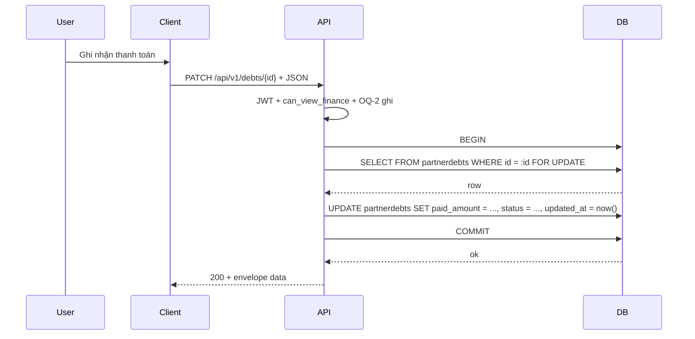

# SRS — Sổ nợ đối tác — `GET|POST|GET|PATCH /api/v1/debts` — Task069–Task072

> **File (Spring / `smart-erp`):** `backend/docs/srs/SRS_Task069-072_debts-api.md`  
> **Người soạn:** Agent BA (+ SQL theo `backend/AGENTS/BA_AGENT_INSTRUCTIONS.md`, `backend/AGENTS/SQL_AGENT_INSTRUCTIONS.md`)  
> **Ngày:** 30/04/2026  
> **Trạng thái:** `Draft`  
> **PO duyệt (khi Approved):** _(chưa)_

---

## 0. Đầu vào & traceability

| Nguồn | Đường dẫn / ghi chú |
| :--- | :--- |
| API Task069 | [`../../../frontend/docs/api/API_Task069_debts_get_list.md`](../../../frontend/docs/api/API_Task069_debts_get_list.md) — **Draft** (đồng bộ tên bảng PG + RBAC 30/04/2026) |
| API Task070 | [`../../../frontend/docs/api/API_Task070_debts_post.md`](../../../frontend/docs/api/API_Task070_debts_post.md) — **Draft** (đồng bộ 30/04/2026) |
| API Task071 | [`../../../frontend/docs/api/API_Task071_debts_get_by_id.md`](../../../frontend/docs/api/API_Task071_debts_get_by_id.md) — **Draft** (đồng bộ 30/04/2026) |
| API Task072 | [`../../../frontend/docs/api/API_Task072_debts_patch.md`](../../../frontend/docs/api/API_Task072_debts_patch.md) — **Draft** (đồng bộ 30/04/2026) |
| Khung API | [`../../../frontend/docs/api/API_PROJECT_DESIGN.md`](../../../frontend/docs/api/API_PROJECT_DESIGN.md) §4.14 |
| Envelope | [`../../../frontend/docs/api/API_RESPONSE_ENVELOPE.md`](../../../frontend/docs/api/API_RESPONSE_ENVELOPE.md) |
| UC / DB (mô tả) | [`../../../frontend/docs/UC/Database_Specification.md`](../../../frontend/docs/UC/Database_Specification.md) §12.2 `PartnerDebts` |
| Flyway thực tế | [`../../smart-erp/src/main/resources/db/migration/V1__baseline_smart_inventory.sql`](../../smart-erp/src/main/resources/db/migration/V1__baseline_smart_inventory.sql) — bảng **`PartnerDebts`** (tên vật lý PostgreSQL mặc định: **`partnerdebts`**), CHECK `chk_partner_debts_partner`, `chk_paid_le_total`, FK `customers` / `suppliers` |
| JWT / quyền | [`../../smart-erp/src/main/java/com/example/smart_erp/auth/support/MenuPermissionClaims.java`](../../smart-erp/src/main/java/com/example/smart_erp/auth/support/MenuPermissionClaims.java) — **`can_view_finance`**; Staff bật qua **V25** (đồng bộ [`SRS_Task064-068_cash-transactions-api.md`](SRS_Task064-068_cash-transactions-api.md) **OQ-1**) |
| Code đã tham chiếu `partnerdebts` | [`CustomerJdbcRepository.java`](../../smart-erp/src/main/java/com/example/smart_erp/catalog/repository/CustomerJdbcRepository.java), [`SupplierJdbcRepository.java`](../../smart-erp/src/main/java/com/example/smart_erp/catalog/repository/SupplierJdbcRepository.java) — `HAS_PARTNER_DEBTS` khi xóa đối tác |
| UI index | [`../../../frontend/mini-erp/src/features/FEATURES_UI_INDEX.md`](../../../frontend/mini-erp/src/features/FEATURES_UI_INDEX.md) — `/cashflow/debt`, `DebtPage` |

---

## 1. Tóm tắt điều hành

- **Vấn đề:** Màn **Sổ nợ** (`DebtPage`) đang mock; cần bốn endpoint REST thống nhất envelope, đọc/ghi bảng công nợ đối tác, join tên KH/NCC, tính **`remainingAmount`**, phân trang và ghi nhận trả nợ an toàn khi đồng thời.
- **Mục tiêu nghiệp vụ:** Người dùng đủ quyền tài chính xem danh sách/chi tiết, tạo khoản nợ (mã `debtCode` server), cập nhật/ghi nhận thanh toán; trạng thái **`Cleared`** khi đã trả đủ; ràng buộc đối tác và `paid ≤ total` khớp DB.
- **Đối tượng:** User có JWT **`mp.can_view_finance === true`** (Owner / Admin / Staff sau V25). **Quyền ghi** (POST/PATCH) phụ thuộc quyết định PO tại **§4 OQ-2** (schema V1 **chưa** có `created_by` trên `partnerdebts`).

### 1.1 Giao diện Mini-ERP

| Nhãn menu (Sidebar) | Route | Page (export) | Component / vùng chính | File (dưới `frontend/mini-erp/src/features/`) |
| :--- | :--- | :--- | :--- | :--- |
| Sổ nợ (nhóm Thu chi) | `/cashflow/debt` | `DebtPage` | `DebtTable`, `DebtToolbar`, `DebtFormDialog`, `DebtDetailDialog` | `cashflow/pages/DebtPage.tsx`; `cashflow/components/DebtTable.tsx`, `DebtToolbar.tsx`, `DebtFormDialog.tsx`, `DebtDetailDialog.tsx` |

---

## 2. Bóc tách nghiệp vụ (capabilities)

| # | Capability | Endpoint | Kết quả |
| :---: | :--- | :--- | :--- |
| C1 | Xác thực JWT | Tất cả | **401** nếu thiếu/sai/hết hạn |
| C2 | Kiểm tra **`can_view_finance`** | Tất cả | **403** nếu thiếu (**§6**, đồng bộ Task063/Task064) |
| C3 | Kiểm tra quyền **ghi** theo **OQ-2** | POST, PATCH | **403** khi user không được phép thao tác ghi theo quyết định PO |
| C4 | Liệt kê có lọc + phân trang; `remainingAmount` = `total_amount - paid_amount` (read-model) | GET list | **200** + `data.items`, `page`, `limit`, `total` |
| C5 | Lọc `search`: `ILIKE` trên `debt_code`, `customers.name` / `suppliers.name`, **`customer_code` / `supplier_code`** (đề xuất — **BR-3**) | GET list | Kết quả khớp tìm kiếm mã + tên |
| C6 | Lọc khoảng hạn thanh toán; validate `dueDateFrom` ≤ `dueDateTo` | GET list | **400** nếu ngược khoảng |
| C7 | Tạo bản ghi; sinh **`debtCode`** unique; set **`status`** theo paid/total | POST | **201** + bản ghi đầy đủ |
| C8 | Kiểm tra FK `customer_id` / `supplier_id` tồn tại và khớp `partner_type` | POST | **400** nếu id không tồn tại hoặc vi phạm cặp KH/NCC |
| C9 | Đọc một `id`; join tên đối tác | GET by id | **200** hoặc **404** |
| C10 | Cập nhật một phần; **`SELECT … FOR UPDATE`**; cấm `paidAmount` **và** `paymentAmount` đồng thời (**BR-4**); cập nhật **`status`** | PATCH | **200** hoặc **4xx** |
| C11 | Khi **`paymentAmount`**: `newPaid = LEAST(paid_amount + paymentAmount, total_amount)` — **cắt trần** theo gợi ý API Task072 (**BR-5**); nếu PO chọn báo lỗi → **OQ-4** | PATCH | Theo OQ-4 |
| C12 | **Không** INSERT `financeledger` trong phạm vi Task069–072 (**GAP / backlog** — Task072 §1) | — | Ghi rõ trong §12 |

---

## 3. Phạm vi

### 3.1 In-scope

- `GET /api/v1/debts`, `POST /api/v1/debts`, `GET /api/v1/debts/{id}`, `PATCH /api/v1/debts/{id}`.  
- Đọc/ghi bảng **`partnerdebts`**; đọc **`customers`**, **`suppliers`** (join tên/mã).  
- Envelope và mã lỗi theo `API_RESPONSE_ENVELOPE.md`.

### 3.2 Out-of-scope

- Ghi **`financeledger`** khi trả nợ (backlog; cần policy + CR riêng).  
- Xóa khoản nợ (`DELETE`) — không có trong API Task069–072.  
- Tự động tạo công nợ từ đơn mua/bán — luồng khác (nếu có).

---

## 4. Câu hỏi làm rõ cho PO (Open Questions)

> BA không chốt thay PO. Dev **ghi** POST/PATCH phải bám **OQ-2**; sinh mã và PATCH khi **Cleared** bám **OQ-1**, **OQ-3**, **OQ-4**.

| ID | Câu hỏi | Ảnh hưởng nếu không trả lời | Blocker? |
| :--- | :--- | :--- | :---: |
| **OQ-1** | Khi **`status = Cleared`**, có cho phép **PATCH** nào không? Đề xuất codebase: **(a)** Cấm mọi thay đổi số tiền (`totalAmount`, `paidAmount`, `paymentAmount`) → **409** `CONFLICT` + message nghiệp vụ; vẫn cho phép sửa **`notes`** / **`dueDate`** (audit nhẹ). **(b)** Cấm mọi PATCH → **409** cho mọi body. **(c)** Cho phép mở lại nợ (giảm `paidAmount` / tăng `totalAmount`) — cần quy trình phê duyệt riêng. | Không thống nhất 409 vs 200 trên UI | Không |
| **OQ-2** | Bảng **`partnerdebts`** (V1) **không có `created_by`**. Quyền **POST/PATCH** thế nào? **(a)** Thêm Flyway **`created_by`** (FK `users`) + mặc định user hiện tại; **chỉ** người tạo được PATCH (giống tinh thần Task064-068 **BR-9**). **(b)** Mọi user có `can_view_finance` đều POST/PATCH mọi khoản. **(c)** Chỉ **`role`** Owner (và Admin nếu PO muốn) được POST/PATCH; Staff chỉ GET. | Dev không biết kiểm tra 403 trên ghi | **Có** (cho triển khai rule ghi rõ ràng) |
| **OQ-3** | Sinh **`debtCode`** dạng `NO-YYYY-NNNN`: chiến lược **tranh chấp concurrent**? **(a)** Một transaction + `SELECT max` theo prefix năm (đơn giản, rủi ro nóng khi QPS cao). **(b)** Khóa advisory Postgres theo key năm. **(c)** Bảng sequence riêng theo năm. | Trùng mã dưới tải đồng thời | Không (v1 ít người) / **Có** nếu PO yêu cầu SLA ghi cao |
| **OQ-4** | Với **`paymentAmount`**: khi `paid_amount + paymentAmount > total_amount`, **đề xuất SRS/BE** áp dụng **cắt trần** `newPaid = total_amount` (silent, đúng gợi ý Task072 §10). PO có muốn **400** nếu vượt số còn lại (`remaining`) không? | Khác hành vi nút “Trả một phần” trên UI | Không |

**Trả lời PO (điền khi chốt):**

| ID | Quyết định PO | Ngày |
| :--- | :--- | :--- |
| OQ-1 | | |
| OQ-2 | | |
| OQ-3 | | |
| OQ-4 | | |

---

## 5. Phân tích scope tệp & bằng chứng (Evidence scope)

### 5.1 Tài liệu đã đối chiếu (read)

- Bốn file `API_Task069` … `API_Task072`; `API_RESPONSE_ENVELOPE.md`; `API_PROJECT_DESIGN.md` §4.14.  
- Flyway V1: `PartnerDebts`, `Customers`, `Suppliers`.  
- `SRS_Task063`, `SRS_Task064-068` — RBAC `can_view_finance` + pattern lỗi.  
- `FEATURES_UI_INDEX.md` — route Sổ nợ.

### 5.2 Mã / migration dự kiến (write / verify)

- Controller + service + JDBC (package `finance` / `cashflow` — theo convention đã dùng cho ledger/cash nếu có).  
- **Nếu OQ-2(a):** Flyway mới (vd. `V26__partner_debts_created_by.sql`) + backfill (vd. `1` / user hệ thống — PO chốt).  
- **Nếu OQ-3(b/c):** migration hoặc helper sinh mã theo lựa chọn.  
- **Index (§10.3):** có thể cần `CREATE INDEX` trên `(updated_at DESC, id DESC)` phục vụ sort mặc định list — chưa có trong V1.

### 5.3 Rủi ro phát hiện sớm

- **Không có `created_by`:** không thể áp “chỉ người tạo” mà không migration (**OQ-2**).  
- **PATCH đồng thời:** bắt buộc **`SELECT … FOR UPDATE`** trong transaction (**Task072**).  
- **Decimal:** map `DECIMAL(15,2)` ↔ JSON number; làm tròn hiển thị theo chuẩn dự án.

---

## 6. Persona & RBAC

| Vai trò / quyền | Điều kiện | HTTP khi từ chối |
| :--- | :--- | :--- |
| Đã đăng nhập | JWT hợp lệ | **401** nếu không |
| Xem sổ nợ | **`mp.can_view_finance === true`** | **403** |
| Tạo / sửa khoản nợ | **Theo OQ-2** (sau khi PO chốt: `created_by`, hoặc role, hoặc mọi finance user) | **403** |

**GAP đã xử lý trong API markdown (30/04/2026):** Task069 ghi “`can_view_finance` hoặc quyền đối tác tương đương” **lệch** chuỗi Task063/064 — đồng bộ về **`can_view_finance` duy nhất** cho cả bốn endpoint (sidebar **Thu chi** = domain tài chính).

---

## 7. Actor & luồng nghiệp vụ

### 7.1 Danh sách actor

| Actor | Mô tả |
| :--- | :--- |
| End user | Nhân viên / chủ cửa hàng thao tác Sổ nợ |
| Client | Mini-ERP (`DebtPage`, dialog) |
| API | `smart-erp` REST |
| Database | PostgreSQL — `partnerdebts`, `customers`, `suppliers` |

### 7.2 Luồng chính (PATCH trả nợ)

1. User mở chi tiết khoản nợ → Client gọi **GET** `…/debts/{id}`.  
2. User nhập “Ghi nhận thanh toán” → Client **PATCH** `{ "paymentAmount": x }`.  
3. API xác thực, RBAC, mở transaction, **`SELECT … FOR UPDATE`**, tính `newPaid`, kiểm tra **OQ-1** (Cleared), **OQ-4** (cắt trần vs 400), `UPDATE`, commit.  
4. Trả **200** + bản ghi mới (`remainingAmount`, `status`).

### 7.3 Sơ đồ (PATCH)



---

## 8. Hợp đồng HTTP & ví dụ JSON

### 8.0 Quy ước chung

- Base path: **`/api/v1/debts`**.  
- `amount` / `totalAmount` / `paidAmount` / `remainingAmount` / `paymentAmount`: số không âm (scale 2 trong DB).  
- Ngày: `dueDate` **chuỗi `YYYY-MM-DD`** (ISO date); timestamp `createdAt` / `updatedAt` **ISO-8601 UTC** (khớp ví dụ Task070).

---

### 8.1 `GET /api/v1/debts` (Task069)

#### Query — schema logic

| Param | Kiểu | Bắt buộc | Validation |
| :--- | :--- | :---: | :--- |
| `partnerType` | `Customer` \| `Supplier` | Không | Enum |
| `status` | `InDebt` \| `Cleared` | Không | Enum |
| `search` | string | Không | Độ dài hợp lý (vd. ≤ 200) |
| `dueDateFrom`, `dueDateTo` | date | Không | Nếu cả hai có → `dueDateFrom` ≤ `dueDateTo` |
| `page` | int | Không | Mặc định **1**, ≥ 1 |
| `limit` | int | Không | Mặc định **20**, 1–100 |

#### Ví dụ **200**

```json
{
  "success": true,
  "data": {
    "items": [
      {
        "id": 5,
        "debtCode": "NO-2026-0001",
        "partnerType": "Customer",
        "customerId": 12,
        "supplierId": null,
        "partnerName": "CT TNHH ABC",
        "totalAmount": 10000000,
        "paidAmount": 2000000,
        "remainingAmount": 8000000,
        "dueDate": "2026-05-01",
        "status": "InDebt",
        "notes": "Công nợ bán sỉ T4",
        "updatedAt": "2026-04-20T15:30:00Z"
      }
    ],
    "page": 1,
    "limit": 20,
    "total": 8
  },
  "message": "Thành công"
}
```

#### Lỗi — **400** (khoảng ngày sai)

```json
{
  "success": false,
  "error": "BAD_REQUEST",
  "message": "Khoảng ngày không hợp lệ: ngày bắt đầu không được sau ngày kết thúc.",
  "details": {
    "dueDateFrom": "Phải nhỏ hơn hoặc bằng dueDateTo"
  }
}
```

#### Lỗi — **401** / **403** / **500**

```json
{
  "success": false,
  "error": "UNAUTHORIZED",
  "message": "Phiên đăng nhập đã hết hạn. Vui lòng đăng nhập lại."
}
```

```json
{
  "success": false,
  "error": "FORBIDDEN",
  "message": "Bạn không có quyền thực hiện thao tác này."
}
```

```json
{
  "success": false,
  "error": "INTERNAL_SERVER_ERROR",
  "message": "Không thể hoàn tất thao tác. Vui lòng thử lại hoặc liên hệ quản trị."
}
```

---

### 8.2 `POST /api/v1/debts` (Task070)

#### Body — schema logic

| Field | Kiểu | Bắt buộc | Ghi chú |
| :--- | :--- | :---: | :--- |
| `partnerType` | enum | Có | |
| `customerId` | int | Điều kiện | Bắt buộc nếu `Customer` |
| `supplierId` | int | Điều kiện | Bắt buộc nếu `Supplier` |
| `totalAmount` | number ≥ 0 | Có | |
| `paidAmount` | number ≥ 0 | Không | Mặc định **0**; ≤ `totalAmount` |
| `dueDate` | date \| null | Không | |
| `notes` | string \| null | Không | Max **5000** ký tự (Zod Task070) |

#### Ví dụ request **đầy đủ**

```json
{
  "partnerType": "Supplier",
  "supplierId": 3,
  "totalAmount": 5000000,
  "paidAmount": 0,
  "dueDate": "2026-04-30",
  "notes": null
}
```

#### Ví dụ **201**

```json
{
  "success": true,
  "data": {
    "id": 6,
    "debtCode": "NO-2026-0004",
    "partnerType": "Supplier",
    "customerId": null,
    "supplierId": 3,
    "partnerName": "NCC XYZ",
    "totalAmount": 5000000,
    "paidAmount": 0,
    "remainingAmount": 5000000,
    "dueDate": "2026-04-30",
    "status": "InDebt",
    "notes": null,
    "createdAt": "2026-04-23T09:00:00Z",
    "updatedAt": "2026-04-23T09:00:00Z"
  },
  "message": "Đã tạo khoản nợ"
}
```

#### Lỗi — **400** (FK / cặp partner)

```json
{
  "success": false,
  "error": "BAD_REQUEST",
  "message": "Thông tin đối tác không hợp lệ hoặc không tồn tại.",
  "details": {
    "supplierId": "Không tìm thấy nhà cung cấp tương ứng"
  }
}
```

---

### 8.3 `GET /api/v1/debts/{id}` (Task071)

**Shape:** Giống một phần tử `items` của §8.1; **bắt buộc** có thêm **`createdAt`** (đồng bộ audit với POST).

#### Ví dụ **200**

```json
{
  "success": true,
  "data": {
    "id": 5,
    "debtCode": "NO-2026-0001",
    "partnerType": "Customer",
    "customerId": 12,
    "supplierId": null,
    "partnerName": "CT TNHH ABC",
    "totalAmount": 10000000,
    "paidAmount": 2000000,
    "remainingAmount": 8000000,
    "dueDate": "2026-05-01",
    "status": "InDebt",
    "notes": "Công nợ bán sỉ T4",
    "createdAt": "2026-04-01T08:00:00Z",
    "updatedAt": "2026-04-20T15:30:00Z"
  },
  "message": "Thành công"
}
```

#### Lỗi — **404**

```json
{
  "success": false,
  "error": "NOT_FOUND",
  "message": "Không tìm thấy khoản nợ"
}
```

---

### 8.4 `PATCH /api/v1/debts/{id}` (Task072)

#### Body — schema logic

| Field | Kiểu | Ghi chú |
| :--- | :--- | :--- |
| `totalAmount` | number ≥ 0 | Không được nhỏ hơn `paidAmount` sau cập nhật |
| `paidAmount` | number ≥ 0 | Set tuyệt đối; **không** dùng cùng lúc với `paymentAmount` |
| `paymentAmount` | number > 0 | Cộng dồn; **mutually exclusive** với `paidAmount` |
| `dueDate` | date \| null | |
| `notes` | string \| null | max 5000 |

Ít nhất một trường trong body (không gửi `{}`).

#### Ví dụ request (trả một phần)

```json
{
  "paymentAmount": 1500000
}
```

#### Ví dụ **200** (sau PATCH)

```json
{
  "success": true,
  "data": {
    "id": 5,
    "debtCode": "NO-2026-0001",
    "partnerType": "Customer",
    "customerId": 12,
    "supplierId": null,
    "partnerName": "CT TNHH ABC",
    "totalAmount": 10000000,
    "paidAmount": 3500000,
    "remainingAmount": 6500000,
    "dueDate": "2026-05-01",
    "status": "InDebt",
    "notes": "Công nợ bán sỉ T4",
    "createdAt": "2026-04-01T08:00:00Z",
    "updatedAt": "2026-04-30T10:15:00Z"
  },
  "message": "Đã cập nhật khoản nợ"
}
```

#### Lỗi — **400** (cả `paidAmount` và `paymentAmount`)

```json
{
  "success": false,
  "error": "BAD_REQUEST",
  "message": "Thông tin không hợp lệ: chỉ được dùng một trong hai trường paidAmount hoặc paymentAmount.",
  "details": {}
}
```

#### Lỗi — **409** (khoản đã đóng — khi PO chọn **OQ-1(b)** hoặc chặn số tiền theo **OQ-1(a)**)

```json
{
  "success": false,
  "error": "CONFLICT",
  "message": "Khoản nợ đã được thanh toán đủ. Không thể ghi nhận thêm số tiền thanh toán."
}
```

---

### 8.5 Ghi chú envelope

- Khớp `API_RESPONSE_ENVELOPE.md`; không trả **200** kèm `success: false`.

---

## 9. Quy tắc nghiệp vụ (bảng)

| Mã | Điều kiện | Hành động / kết quả |
| :--- | :--- | :--- |
| BR-1 | `partner_type = Customer` | `customer_id` NOT NULL, `supplier_id` NULL |
| BR-2 | `partner_type = Supplier` | Ngược lại BR-1 |
| BR-3 | `search` không rỗng | `ILIKE` trên `d.debt_code`, `c.name`, `c.customer_code`, `s.name`, `s.supplier_code` (đề xuất đồng bộ UI “mã hoặc tên”) |
| BR-4 | Body PATCH | Không đồng thời `paidAmount` và `paymentAmount` |
| BR-5 | Chỉ `paymentAmount` | `newPaid = LEAST(paid_amount + paymentAmount, total_amount)` nếu **OQ-4** chọn cắt trần |
| BR-6 | Sau mọi thay đổi `paid`/`total` | Nếu `newPaid >= total` → `status = Cleared`; else `InDebt` |
| BR-7 | `totalAmount` PATCH | `newTotal >= newPaid` (hoặc hiện tại `paid_amount`) |
| BR-8 | Sort list mặc định | `ORDER BY d.updated_at DESC, d.id DESC` |

---

## 10. Dữ liệu & SQL tham chiếu (Agent SQL)

### 10.1 Bảng / quan hệ (tên dùng trong JDBC — chữ thường)

| Bảng | Read / Write | Ghi chú |
| :--- | :--- | :--- |
| `partnerdebts` | R/W | DDL Flyway: `PartnerDebts` |
| `customers` | R | `name`, `customer_code` |
| `suppliers` | R | `name`, `supplier_code` |

**Cột chính `partnerdebts`:** `id`, `debt_code`, `partner_type`, `customer_id`, `supplier_id`, `total_amount`, `paid_amount`, `due_date`, `status`, `notes`, `created_at`, `updated_at`.

### 10.2 SQL mẫu — list (Task069)

```sql
SELECT d.id,
       d.debt_code,
       d.partner_type,
       d.customer_id,
       d.supplier_id,
       COALESCE(c.name, s.name) AS partner_name,
       d.total_amount,
       d.paid_amount,
       (d.total_amount - d.paid_amount) AS remaining_amount,
       d.due_date,
       d.status,
       d.notes,
       d.updated_at
FROM partnerdebts d
LEFT JOIN customers c ON d.customer_id = c.id
LEFT JOIN suppliers s ON d.supplier_id = s.id
WHERE (:partner_type IS NULL OR d.partner_type = :partner_type)
  AND (:status IS NULL OR d.status = :status)
  AND (:due_from IS NULL OR d.due_date >= :due_from)
  AND (:due_to IS NULL OR d.due_date <= :due_to)
  AND (
    :search IS NULL
    OR d.debt_code ILIKE '%' || :search || '%'
    OR c.name ILIKE '%' || :search || '%'
    OR c.customer_code ILIKE '%' || :search || '%'
    OR s.name ILIKE '%' || :search || '%'
    OR s.supplier_code ILIKE '%' || :search || '%'
  )
ORDER BY d.updated_at DESC, d.id DESC
LIMIT :limit OFFSET :offset;
```

Đếm `total`: `SELECT COUNT(*) FROM (` cùng `WHERE` `) t`.

### 10.3 SQL mẫu — PATCH (Task072)

```sql
BEGIN;
SELECT id, total_amount, paid_amount, status
FROM partnerdebts
WHERE id = :id
FOR UPDATE;
-- ứng dụng tính new_paid, new_total, new_status trong service; sau đó:
UPDATE partnerdebts
SET total_amount = :new_total,
    paid_amount = :new_paid,
    due_date = :due_date,
    notes = :notes,
    status = :new_status,
    updated_at = CURRENT_TIMESTAMP
WHERE id = :id;
COMMIT;
```

### 10.4 Index đề xuất

- **`idx_partnerdebts_updated_id`** ON **`partnerdebts (updated_at DESC, id DESC)`** — phục vụ list mặc định (V1 chưa có; thêm Flyway khi triển khai).  
- Giữ index V1: `idx_partner_debts_status`, `idx_partner_debts_customer`, `idx_partner_debts_supplier`.

### 10.5 Transaction & khóa

- **GET:** `readOnly = true`, không khóa.  
- **PATCH:** một transaction; **`SELECT … FOR UPDATE`** trước `UPDATE` — tránh lost update trên `paid_amount` / `total_amount`.

### 10.6 Kiểm chứng dữ liệu cho Tester

- Tạo KH/NCC mẫu → POST debt → GET list thấy `partnerName` đúng.  
- PATCH `paymentAmount` lớn hơn `remaining` → theo **OQ-4**: cắt trần hoặc 400.  
- Khi `paid = total` → `status = Cleared`; GET by id trả đúng.

---

## 11. Acceptance criteria (Given / When / Then)

```text
Given JWT hợp lệ và can_view_finance
When GET /api/v1/debts?page=1&limit=20
Then 200 và data.items là mảng; data.total là số nguyên ≥ 0; mỗi item có remainingAmount = totalAmount - paidAmount
```

```text
Given can_view_finance và POST body hợp lệ Supplier + supplierId tồn tại
When POST /api/v1/debts
Then 201; debtCode khớp pattern NO-YYYY-; status InDebt nếu paid < total; partnerName khớp suppliers.name
```

```text
Given id không tồn tại
When GET /api/v1/debts/999999
Then 404 NOT_FOUND và message tiếng Việt chức năng
```

```text
Given khoản nợ tồn tại và PATCH chỉ paymentAmount
When PATCH với paymentAmount dương
Then 200; paidAmount tăng đúng rule OQ-4; status Cleared khi paid >= total
```

```text
Given JWT không có can_view_finance
When bất kỳ GET/POST/PATCH debts
Then 403 FORBIDDEN
```

```text
Given PATCH gửi cả paidAmount và paymentAmount
Then 400 BAD_REQUEST
```

---

## 12. GAP & giả định

| GAP / Giả định | Tác động | Hành động đề xuất |
| :--- | :--- | :--- |
| API / tài liệu cũ ghi `partner_debts` | Lệch JDBC thực tế (`partnerdebts`) | Đã sửa `API_Task069`–`072` (30/04/2026) |
| Task069 RBAC mơ hồ “quyền đối tác” | Không đồng bộ Task063 | Đã thu hẹp về **`can_view_finance`** trong API |
| Không ghi `financeledger` khi trả nợ | Sổ cái không phản ánh tiền trả nợ | Backlog + SRS tài chính riêng khi PO yêu cầu |
| List **chưa** có index sort `updated_at` | Full scan khi bảng lớn | Flyway index §10.4 khi Dev triển khai |

---

## 13. PO sign-off (chỉ điền khi Approved)

- [ ] Đã trả lời / đóng các **OQ blocker** (đặc biệt **OQ-2**)
- [ ] JSON request/response khớp ý đồ sản phẩm
- [ ] Phạm vi In/Out đã đồng ý

**Chữ ký / nhãn PR:** …
