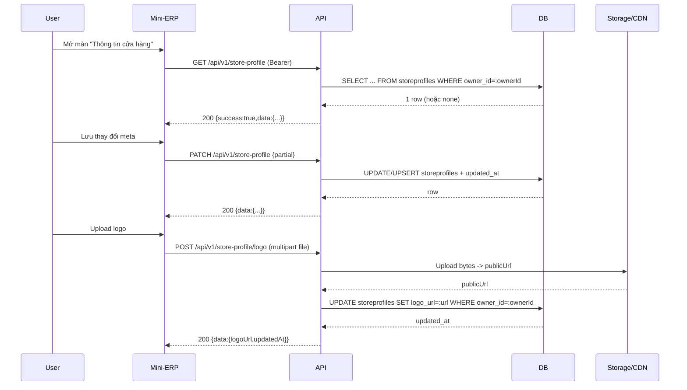

# SRS — Thông tin cửa hàng — `GET|PATCH /api/v1/store-profile`, `POST /api/v1/store-profile/logo` — Task073–Task075

> **File (Spring / `smart-erp`):** `backend/docs/srs/SRS_Task073-075_store-profile-api.md`  
> **Người soạn:** Agent BA (+ SQL theo `backend/AGENTS/BA_AGENT_INSTRUCTIONS.md`, `backend/AGENTS/SQL_AGENT_INSTRUCTIONS.md`)  
> **Ngày:** 30/04/2026  
> **Trạng thái:** `Approved`  
> **PO duyệt (khi Approved):** PO, `30/04/2026`

---

## 0. Đầu vào & traceability

| Nguồn | Đường dẫn / ghi chú |
| :--- | :--- |
| API Task073 | [`../../../frontend/docs/api/API_Task073_store_profile_get.md`](../../../frontend/docs/api/API_Task073_store_profile_get.md) — Draft |
| API Task074 | [`../../../frontend/docs/api/API_Task074_store_profile_patch.md`](../../../frontend/docs/api/API_Task074_store_profile_patch.md) — Draft |
| API Task075 | [`../../../frontend/docs/api/API_Task075_store_profile_post_logo.md`](../../../frontend/docs/api/API_Task075_store_profile_post_logo.md) — Draft |
| Khung API | [`../../../frontend/docs/api/API_PROJECT_DESIGN.md`](../../../frontend/docs/api/API_PROJECT_DESIGN.md) §4.16 |
| Envelope | [`../../../frontend/docs/api/API_RESPONSE_ENVELOPE.md`](../../../frontend/docs/api/API_RESPONSE_ENVELOPE.md) |
| UC / DB spec (mô tả) | [`../../../frontend/docs/UC/Database_Specification.md`](../../../frontend/docs/UC/Database_Specification.md) §6.1 `StoreProfiles` |
| Flyway thực tế | [`../../smart-erp/src/main/resources/db/migration/V1__baseline_smart_inventory.sql`](../../smart-erp/src/main/resources/db/migration/V1__baseline_smart_inventory.sql) — bảng `StoreProfiles` (tên vật lý PostgreSQL: `storeprofiles`), trigger `trg_storeprofiles_updated` |
| Flyway bổ sung | [`../../smart-erp/src/main/resources/db/migration/V20__task090_storeprofiles_default_retail_location.sql`](../../smart-erp/src/main/resources/db/migration/V20__task090_storeprofiles_default_retail_location.sql), [`../../smart-erp/src/main/resources/db/migration/V22__task090_seed_storeprofiles_if_missing.sql`](../../smart-erp/src/main/resources/db/migration/V22__task090_seed_storeprofiles_if_missing.sql) |
| Permission keys (JWT `mp`) | [`../../smart-erp/src/main/java/com/example/smart_erp/auth/support/MenuPermissionClaims.java`](../../smart-erp/src/main/java/com/example/smart_erp/auth/support/MenuPermissionClaims.java) — không có key riêng cho store profile |
| Ảnh upload (Cloudinary) | [`../../smart-erp/src/main/java/com/example/smart_erp/catalog/media/CloudinaryMediaService.java`](../../smart-erp/src/main/java/com/example/smart_erp/catalog/media/CloudinaryMediaService.java), [`../../smart-erp/src/main/java/com/example/smart_erp/config/CloudinaryProperties.java`](../../smart-erp/src/main/java/com/example/smart_erp/config/CloudinaryProperties.java) |
| UI index | [`../../../frontend/mini-erp/src/features/FEATURES_UI_INDEX.md`](../../../frontend/mini-erp/src/features/FEATURES_UI_INDEX.md) — `/settings/store-info`, `StoreInfoPage` |

---

## 1. Tóm tắt điều hành

- **Vấn đề:** Màn **Thông tin cửa hàng** hiện chưa nối backend; cần endpoint đọc/cập nhật hồ sơ cửa hàng theo tenant (Owner) và API upload logo.
- **Mục tiêu nghiệp vụ:** Cho phép người có quyền cấu hình (Owner/Admin) quản lý tên, thông tin liên hệ, MST, footer hoá đơn, mạng xã hội, logo; backend lưu theo `storeprofiles.owner_id`.
- **Đối tượng:** Owner (tenant đơn) và Admin được phép cấu hình theo policy RBAC.

### 1.1 Giao diện Mini-ERP

| Nhãn menu (Sidebar) | Route | Page (export) | Component / vùng chính | File (dưới `frontend/mini-erp/src/features/`) |
| :--- | :--- | :--- | :--- | :--- |
| Thông tin cửa hàng (nhóm Cài đặt) | `/settings/store-info` | `StoreInfoPage` | Trang form cấu hình + upload logo | `settings/pages/StoreInfoPage.tsx` |

---

## 2. Bóc tách nghiệp vụ (capabilities)

| # | Capability | Endpoint | Kết quả mong đợi | Ghi chú |
| :---: | :--- | :--- | :--- | :--- |
| C1 | Xác thực JWT | Tất cả | 401 nếu thiếu/sai/hết hạn | Bám `API_RESPONSE_ENVELOPE.md` |
| C2 | Kiểm tra quyền truy cập “cài đặt cửa hàng” | Tất cả | 403 nếu không đủ quyền | `hasAuthority('can_view_store_profile')` |
| C3 | Lấy hồ sơ cửa hàng theo tenant | `GET /store-profile` | 200 + object | DB đã có seed (V22); vẫn cần xử lý an toàn nếu thiếu |
| C4 | Cập nhật một phần các field meta | `PATCH /store-profile` | 200 + object đầy đủ | Patch body phải có ít nhất 1 field |
| C5 | Upload logo (multipart) và cập nhật `logo_url` | `POST /store-profile/logo` | 200 + `logoUrl`, `updatedAt` | Validate file + upload + update DB |

---

## 3. Phạm vi

### 3.1 In-scope

- 3 endpoint Task073–075 (GET/PATCH store-profile, POST logo).
- Read/write bảng `storeprofiles` (theo Flyway).
- Trả thêm `defaultRetailLocationId` để đồng bộ Task090 (POS).

### 3.2 Out-of-scope

- Quản lý nhiều cửa hàng / multi-tenant phức tạp (1 Owner = 1 store profile).
- Quản lý file khác ngoài logo (banner, gallery).
- CRUD cấu hình kho mặc định POS (nếu muốn UI chỉnh) — cần Task riêng nếu scope lớn.

---

## 4. Câu hỏi làm rõ cho PO (Open Questions)

| ID | Câu hỏi | Ảnh hưởng nếu không trả lời | Blocker? |
| :--- | :--- | :--- | :---: |
| OQ-1 | RBAC cho 3 endpoint: nên yêu cầu **`hasAuthority('can_manage_staff')`** hay key khác? (Hiện `MenuPermissionClaims` không có `can_view_store_profile`.) | Không chốt được policy 403 (Staff có xem được không, Admin có xem được không) | Có |
| OQ-2 | `GET /store-profile` khi DB chưa có dòng (môi trường mới/seed lỗi): **(a)** tự tạo bản ghi tối thiểu và trả 200, hay **(b)** trả 404 `NOT_FOUND`? | Ảnh hưởng logic FE lần đầu và cách đảm bảo data | Không (khuyến nghị a) |
| OQ-3 | Upload logo: backend đang dùng Cloudinary cho ảnh sản phẩm; logo store có dùng cùng Cloudinary không? Nếu có, folder nên là gì (vd. `smart-erp/store-profiles/{ownerId}`)? | Không chốt cách triển khai upload | Có |
| OQ-4 | Có đưa `defaultRetailLocationId` vào `GET/PATCH` store profile không? (DB có cột này và Task090 POS đang đọc từ `storeprofiles`.) | Nếu không trả, FE không thể hiển thị/chỉnh kho mặc định (nếu cần) | Không |
| OQ-5 | Giới hạn file logo: UI gợi ý 2MB nhưng config Cloudinary default 5MB. PO muốn chuẩn server là 2MB hay giữ 5MB? | Ảnh hưởng UX và cấu hình chung upload | Không |

**Trả lời PO (điền khi chốt):**

| ID | Quyết định PO | Ngày |
| :--- | :--- | :--- |
| OQ-1 | Bổ sung permission key **`can_view_store_profile`** (áp dụng cho 3 endpoint store-profile). | 30/04/2026 |
| OQ-2 | (a) Nếu chưa có row store profile thì backend **tạo tối thiểu** và trả **200**. | 30/04/2026 |
| OQ-3 | Dùng **Cloudinary**; folder “tự tạo” theo convention backend. | 30/04/2026 |
| OQ-4 | Có expose và cho cập nhật `defaultRetailLocationId`. | 30/04/2026 |
| OQ-5 | Giữ chuẩn server **5MB**. | 30/04/2026 |

---

## 5. Phân tích scope tệp & bằng chứng (Evidence scope)

### 5.1 Tài liệu đã đối chiếu (read)

- `API_Task073/074/075`, `API_PROJECT_DESIGN.md` §4.16, `API_RESPONSE_ENVELOPE.md`.
- `Database_Specification.md` §6.1.
- Flyway: `V1` (StoreProfiles + trigger), `V20`, `V22`.
- Permission keys thực tế: `MenuPermissionClaims`.
- Upload service hiện hữu: `CloudinaryMediaService`, `CloudinaryProperties`.

### 5.2 Mã / migration dự kiến (write / verify)

- **Backend code (mới)**: controller/service/repository dưới module phù hợp (gợi ý `settings` hoặc `auth`-adjacent cấu hình doanh nghiệp; tránh đặt vào `catalog`/`sales`).  
- **Bổ sung RBAC key** `can_view_store_profile` (PO đã chốt): cần đồng bộ `MenuPermissionClaims` + policy cấp quyền trong `roles.permissions` (qua migration seed/update tuỳ cách team quản lý quyền).
- Schema DB cho store profile **không cần migration mới** (đã có `default_retail_location_id` ở V20).

### 5.3 Rủi ro phát hiện sớm

- **Tên bảng vật lý**: Flyway tạo bảng bằng `CREATE TABLE StoreProfiles` (không quote) ⇒ PostgreSQL dùng `storeprofiles`. Spec/UC có `store_profiles` ⇒ dễ lệch nếu dev copy.  
- **RBAC key**: không có `can_view_store_profile`; nếu thêm mới phải đồng bộ `Roles.permissions`, `MenuPermissionClaims`, seed role trong V1.
- **Upload**: `CloudinaryMediaService` hiện trả message thiên kỹ thuật (không phù hợp để lộ cho end-user theo rule BA) ⇒ cần Dev chuẩn hoá message ở tầng exception/handler (GAP).

---

## 6. Persona & RBAC

| Vai trò | Quyền / điều kiện | HTTP khi từ chối |
| :--- | :--- | :--- |
| Owner | Được xem/cập nhật store profile của chính mình | 403 nếu không đủ quyền theo policy |
| Admin | Theo policy PO: có thể xem/cập nhật store profile tenant demo | 403 |
| Staff | Theo policy PO: thường không có quyền | 403 |

**Policy đã chốt (PO):** yêu cầu `hasAuthority('can_view_store_profile')` cho cả `GET`, `PATCH`, `POST /logo`.

---

## 7. Actor & luồng nghiệp vụ

### 7.1 Danh sách actor

| Actor | Mô tả ngắn |
| :--- | :--- |
| End user | Owner/Admin thao tác màn “Thông tin cửa hàng” |
| Client (Mini-ERP) | `StoreInfoPage` gọi API |
| API (`smart-erp`) | Xử lý RBAC + validation + DB + upload |
| Database | `storeprofiles` |
| Cloudinary/CDN (tuỳ) | Lưu ảnh và trả URL công khai |

### 7.2 Luồng chính (narrative)

1. Người dùng mở màn “Thông tin cửa hàng”, client gọi `GET /store-profile` để lấy dữ liệu.  
2. Người dùng chỉnh field và bấm lưu, client gọi `PATCH /store-profile` với body partial.  
3. Khi đổi logo, client upload file qua `POST /store-profile/logo`, nhận `logoUrl` và gán vào state; (tuỳ) gọi `GET /store-profile` để refresh.

### 7.3 Sơ đồ



---

## 8. Hợp đồng HTTP & ví dụ JSON

### 8.1 Tổng quan endpoint

| Endpoint | Auth | Content-Type | Ghi chú |
| :--- | :--- | :--- | :--- |
| `GET /api/v1/store-profile` | Bearer | — | Trả object store profile |
| `PATCH /api/v1/store-profile` | Bearer | `application/json` | Partial update |
| `POST /api/v1/store-profile/logo` | Bearer | `multipart/form-data` | Upload file field `file` |

### 8.2 Response thành công — ví dụ JSON đầy đủ (`GET` / `PATCH`)

```json
{
  "success": true,
  "data": {
    "id": 1,
    "name": "Cửa hàng ABC",
    "businessCategory": "Bán lẻ",
    "address": "123 Đường ABC, TP.HCM",
    "phone": "028 1234 5678",
    "email": "contact@abc.vn",
    "website": "https://abc.vn",
    "taxCode": "0312345678",
    "footerNote": "Cảm ơn quý khách…",
    "logoUrl": "https://cdn.example.com/stores/1/logo.png",
    "facebookUrl": "https://facebook.com/abc",
    "instagramHandle": "@abc",
    "defaultRetailLocationId": 1,
    "updatedAt": "2026-04-30T08:00:00Z"
  },
  "message": "Thành công"
}
```

### 8.3 Request — ví dụ JSON đầy đủ (`PATCH /store-profile`)

```json
{
  "name": "Cửa hàng ABC",
  "businessCategory": "Bán lẻ",
  "address": "123 Đường ABC, TP.HCM",
  "phone": "028 1234 5678",
  "email": "contact@abc.vn",
  "website": "https://abc.vn",
  "taxCode": "0312345678",
  "footerNote": "Cảm ơn quý khách…",
  "facebookUrl": "https://facebook.com/abc",
  "instagramHandle": "@abc",
  "defaultRetailLocationId": 1
}
```

### 8.4 Response thành công — ví dụ JSON đầy đủ (`POST /store-profile/logo`)

```json
{
  "success": true,
  "data": {
    "logoUrl": "https://cdn.example.com/stores/1/logo-v2.png",
    "updatedAt": "2026-04-30T08:01:00Z"
  },
  "message": "Đã cập nhật logo"
}
```

### 8.5 Response lỗi — ví dụ JSON đầy đủ (mỗi mã áp dụng)

**400 — validation / bad request**

```json
{
  "success": false,
  "error": "BAD_REQUEST",
  "message": "Dữ liệu không hợp lệ",
  "details": {
    "email": "Email không hợp lệ"
  }
}
```

**401 — unauthorized**

```json
{
  "success": false,
  "error": "UNAUTHORIZED",
  "message": "Phiên đăng nhập đã hết hạn. Vui lòng đăng nhập lại."
}
```

**403 — forbidden**

```json
{
  "success": false,
  "error": "FORBIDDEN",
  "message": "Bạn không có quyền thực hiện thao tác này."
}
```

**413 — payload too large** (chỉ `POST /store-profile/logo`)

```json
{
  "success": false,
  "error": "BAD_REQUEST",
  "message": "File vượt quá kích thước cho phép",
  "details": {
    "file": "Tối đa 5 MB"
  }
}
```

**500 — internal server error**

```json
{
  "success": false,
  "error": "INTERNAL_SERVER_ERROR",
  "message": "Không thể hoàn tất thao tác. Vui lòng thử lại sau."
}
```

---

## 9. Quy tắc nghiệp vụ (bảng)

| Mã | Điều kiện | Hành động / kết quả |
| :--- | :--- | :--- |
| BR-1 | `PATCH /store-profile` body rỗng | 400 `BAD_REQUEST`, `details`: `{ "body": "Cần ít nhất một trường" }` (hoặc message tương đương) |
| BR-2 | `email` có giá trị nhưng sai format | 400 |
| BR-3 | `website` có giá trị nhưng sai URL | 400 |
| BR-4 | Upload logo: file rỗng / sai định dạng | 400 với `details.file` |

---

## 10. Dữ liệu & SQL tham chiếu

### 10.1 Bảng / quan hệ (tên Flyway)

| Bảng | Read / Write | Ghi chú |
| :--- | :--- | :--- |
| `storeprofiles` | R/W | `owner_id` UNIQUE; `updated_at` tự cập nhật bởi trigger `trg_storeprofiles_updated` |
| `users` | R | Lấy `sub`/`userId` từ JWT để xác định `owner_id` |
| `warehouselocations` | R (gián tiếp) | Dùng để validate `defaultRetail_location_id` khi PATCH (nếu yêu cầu) |

### 10.2 SQL / ranh giới transaction (tham chiếu)

**GET /store-profile**

```sql
SELECT
  id,
  name,
  business_category,
  address,
  phone,
  email,
  website,
  tax_code,
  footer_note,
  logo_url,
  facebook_url,
  instagram_handle,
  default_retail_location_id,
  updated_at
FROM storeprofiles
WHERE owner_id = :ownerId
LIMIT 1;
```

**PATCH /store-profile** (gợi ý pattern, triển khai cụ thể phụ thuộc cách build SQL partial)

```sql
-- option (an toàn khi có thể thiếu row): tạo tối thiểu rồi update theo field có mặt
INSERT INTO storeprofiles (owner_id, name)
VALUES (:ownerId, :defaultName)
ON CONFLICT (owner_id) DO NOTHING;

-- UPDATE chỉ những cột được gửi (pseudo):
UPDATE storeprofiles
SET
  name = COALESCE(:name, name),
  business_category = COALESCE(:businessCategory, business_category),
  address = COALESCE(:address, address),
  phone = COALESCE(:phone, phone),
  email = COALESCE(:email, email),
  website = COALESCE(:website, website),
  tax_code = COALESCE(:taxCode, tax_code),
  footer_note = COALESCE(:footerNote, footer_note),
  facebook_url = COALESCE(:facebookUrl, facebook_url),
  instagram_handle = COALESCE(:instagramHandle, instagram_handle),
  default_retail_location_id = COALESCE(:defaultRetailLocationId, default_retail_location_id),
  logo_url = COALESCE(:logoUrl, logo_url)
WHERE owner_id = :ownerId;
```

**POST /store-profile/logo**

```sql
UPDATE storeprofiles
SET logo_url = :publicUrl
WHERE owner_id = :ownerId;
```

> `updated_at`: do trigger `fn_update_timestamp()` set tự động trước UPDATE (không cần set tay).

### 10.3 Index & hiệu năng

- `owner_id` UNIQUE đã đủ nhanh cho lookup 1 row.  
- Index `idx_store_profiles_owner` tồn tại trong V1; không cần thêm.

### 10.4 Kiểm chứng dữ liệu cho Tester

- Sau khi chạy Flyway đến V22: với user role `Owner`, DB phải có `storeprofiles.owner_id = <ownerUserId>` (seed tạo tối thiểu).  
- Gọi `PATCH` đổi `name` rồi `GET` phải thấy `updatedAt` tăng và field đổi đúng.

---

## 11. Acceptance criteria (Given / When / Then)

```text
Given user có JWT hợp lệ và đủ quyền (theo OQ-1)
When gọi GET /api/v1/store-profile
Then trả 200 với envelope success=true và data chứa tối thiểu {id, name, updatedAt}
```

```text
Given user đủ quyền
When gọi PATCH /api/v1/store-profile với body rỗng {}
Then trả 400 BAD_REQUEST và details có thông tin "Cần ít nhất một trường"
```

```text
Given user đủ quyền
When gọi PATCH /api/v1/store-profile với email sai format
Then trả 400 BAD_REQUEST và details.email mô tả lỗi
```

```text
Given user đủ quyền
When upload logo bằng POST /api/v1/store-profile/logo với file PNG hợp lệ
Then trả 200 và data.logoUrl là URL https, sau đó GET /store-profile trả logoUrl mới
```

```text
Given user không đủ quyền (theo OQ-1)
When gọi bất kỳ endpoint store-profile
Then trả 403 FORBIDDEN với message tiếng Việt, không lộ chi tiết kỹ thuật
```

---

## 12. GAP & giả định

| GAP / Giả định | Tác động | Hành động đề xuất |
| :--- | :--- | :--- |
| API docs/UC dùng `store_profiles`, Flyway tạo `storeprofiles` | Dev dễ viết sai SQL/table | Đã chuẩn hoá trong SRS + đề nghị chỉnh API docs (đã làm trong PR docs) |
| Chưa có permission key `can_view_store_profile` trong code | Nếu chưa đồng bộ sẽ không enforce RBAC đúng | Dev thêm key vào `MenuPermissionClaims` + đồng bộ cấp quyền trong `roles.permissions` |
| `CloudinaryMediaService` có message thiên kỹ thuật | Message client có thể lộ chi tiết cấu hình | Chuẩn hoá message ở tầng exception/handler cho endpoint logo (hoặc refactor service) |
| FE `StoreInfoPage` hiện mock và field name chưa khớp spec | Khi nối API cần đổi mapping | FE cập nhật theo spec camelCase (businessCategory, taxCode, facebookUrl, instagramHandle) |

---

## 13. PO sign-off (chỉ điền khi Approved)

- [x] Đã trả lời / đóng các **OQ blocker** (OQ-1, OQ-3)
- [x] JSON request/response khớp ý đồ sản phẩm
- [x] Phạm vi In/Out đã đồng ý

**Chữ ký / nhãn PR:** PO — 30/04/2026

