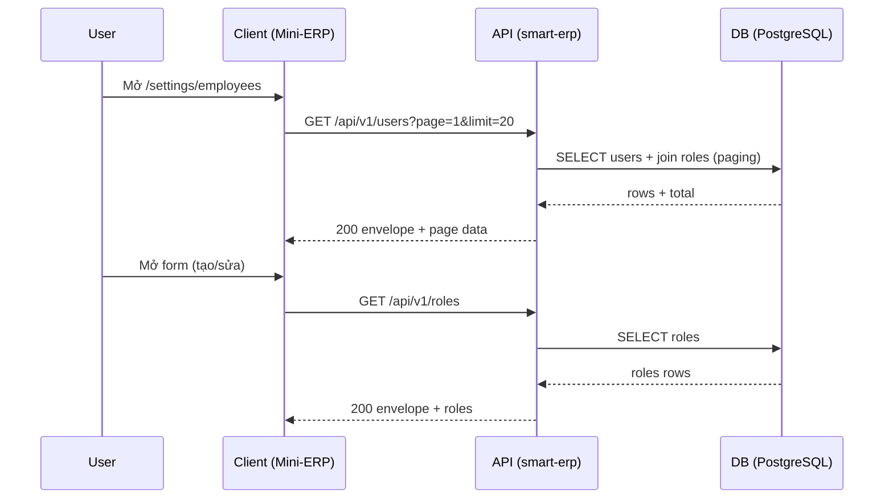

# SRS — Roles & Users management (Task076–081)

> **File (Spring / `smart-erp`)**: `backend/docs/srs/SRS_Task076-081_roles-and-users-management.md`  
> **Người soạn:** Agent BA  
> **Ngày:** 30/04/2026  
> **Trạng thái:** Approved  
> **PO duyệt (khi Approved):** PO, 30/04/2026

---

## 0. Đầu vào & traceability

| Nguồn | Đường dẫn / ghi chú |
| :--- | :--- |
| API spec | `frontend/docs/api/API_Task076_roles_get_list.md` · `API_Task077_users_get_list.md` · `API_Task079_users_get_by_id.md` · `API_Task080_users_patch.md` · `API_Task081_users_delete.md` |
| SRS liên quan | `backend/docs/srs/SRS_Task078_users-post.md` (Approved) · `backend/docs/srs/SRS_Task078-02_next-employee-code-suggestion.md` |
| Mini-ERP UI index | `frontend/mini-erp/src/features/FEATURES_UI_INDEX.md` |
| Flyway / DB | `backend/smart-erp/src/main/resources/db/migration/V1__baseline_smart_inventory.sql` (`roles`, `users`) · `V5__task078_users_staff_code.sql` · `V17__roles_can_manage_customers.sql` |
| Code (RBAC/JWT) | `backend/smart-erp/src/main/java/com/example/smart_erp/auth/support/MenuPermissionClaims.java` · `RolePermissionReader.java` |
| Code (domain) | `backend/smart-erp/src/main/java/com/example/smart_erp/auth/entity/Role.java` · `User.java` |
| Code (users) | `backend/smart-erp/src/main/java/com/example/smart_erp/users/controller/UsersController.java` · `auth/repository/UserRepository.java` · `RoleRepository.java` |
| Envelope | `frontend/docs/api/API_RESPONSE_ENVELOPE.md` |

---

## 1. Tóm tắt điều hành

- **Vấn đề:** Mini‑ERP cần màn “Quản lý nhân viên” để Owner/Admin quản trị tài khoản nhân viên (danh sách/chi tiết/cập nhật/vô hiệu), đồng thời cần danh sách vai trò để render dropdown và kiểm soát RBAC.
- **Mục tiêu nghiệp vụ:** Chuẩn hóa nhóm API Task076–081 theo cùng envelope, RBAC theo JWT claim `mp` (Task101/101_1), và đồng bộ schema `roles.permissions` (JSONB) + `users.status` (`Active`/`Locked`).
- **Đối tượng / persona:** Owner/Admin (có quyền `can_manage_staff`). Một phần chức năng có thể cho phép Staff “xem chính mình” (cần PO chốt).

### 1.1 Giao diện Mini-ERP

| Nhãn menu (Sidebar) | Route | Page (export) | Component / vùng chính | File (dưới `frontend/mini-erp/src/features/`) |
| :--- | :--- | :--- | :--- | :--- |
| Cài đặt → Nhân viên | `/settings/employees` | `EmployeesPage` | `EmployeeTable`, `EmployeeToolbar`, `EmployeeForm`, `EmployeeDetailDialog` | `settings/pages/EmployeesPage.tsx` + `settings/components/*` |

---

## 2. Bóc tách nghiệp vụ (capabilities)

| # | Capability | Kích hoạt bởi | Kết quả mong đợi | Ghi chú |
| :---: | :--- | :--- | :--- | :--- |
| C1 | Lấy danh sách vai trò | FE mở form nhân viên | Trả danh sách `roles` + quyền để FE render dropdown/label | Task076 |
| C2 | Lấy danh sách nhân viên theo filter/paging | FE mở màn nhân viên | Trả page `users` (read-model camelCase) | Task077 |
| C3 | Lấy chi tiết nhân viên | FE xem chi tiết | Trả 1 `user` (không lộ hash) | Task079 |
| C4 | Cập nhật nhân viên (partial) | FE sửa | Update field + trả user mới | Task080 |
| C5 | Vô hiệu hóa nhân viên | FE xóa/vô hiệu | Set `users.status = Locked` (soft lock) | Task081 |

---

## 3. Phạm vi

### 3.1 In-scope

- Task076: `GET /api/v1/roles` (read-only).
- Task077: `GET /api/v1/users` (paging + search + filter).
- Task079: `GET /api/v1/users/{userId}` (detail).
- Task080: `PATCH /api/v1/users/{userId}` (partial update, bao gồm reset password tuỳ policy).
- Task081: `DELETE /api/v1/users/{userId}` (soft-delete bằng khóa tài khoản).
- RBAC theo `hasAuthority('can_manage_staff')` (tương thích code hiện tại ở `UsersController` Task078/078_02).

### 3.2 Out-of-scope

- Bulk delete users (UI hiện có chọn nhiều nhưng chưa có API spec).
- CRUD vai trò (tạo/sửa quyền role) — chỉ read list.
- Đồng bộ UI label `Admin/Manager/Warehouse/Staff` với DB role thực tế (chỉ ghi GAP + đề xuất).

---

## 4. Câu hỏi làm rõ cho PO (Open Questions)

| ID | Câu hỏi | Ảnh hưởng nếu không trả lời | Blocker? |
| :--- | :--- | :--- | :---: |
| OQ-1 | Staff có được gọi `GET /api/v1/users/{id}` để xem **chính mình** không? Nếu có, có được xem danh sách `GET /api/v1/users` không? | Chốt RBAC cho Task079/077; nếu không chốt dễ mở lộ dữ liệu nhân sự | Có |
| OQ-2 | `DELETE /api/v1/users/{id}` có nghĩa là **vô hiệu hóa** (set `Locked`) hay **xóa vật lý**? | Ảnh hưởng FK / audit / khả năng restore | Có |
| OQ-3 | Có cho phép `PATCH` đổi `roleId` sang `Owner` hoặc “chuyển quyền Owner” không? | Rủi ro lock-out / chính sách 1 Owner | Có |
| OQ-4 | Có cho phép `PATCH` cập nhật `email/username/staffCode` khi trùng unique (409) — message/detail cần map field nào? | FE xử lý lỗi field-level | Không |
| OQ-5 | Task076 `roles.permissions` trả về dạng nào? (a) object boolean theo `MenuPermissionClaims` keys, (b) trả nguyên JSON từ DB, (c) chỉ trả `id,name` | Ảnh hưởng payload + FE mapping + backward compatibility | Không |
| OQ-6 | UI đang có 4 nhãn role (`Admin/Manager/Warehouse/Staff`) nhưng DB seed hiện có 3 role (`Owner/Staff/Admin`). PO muốn: (a) thêm role mới trong DB, hay (b) FE map tạm? | Tránh hiểu nhầm phân quyền | Không |

**Trả lời PO (điền khi chốt):**

| ID | Quyết định PO | Ngày |
| :--- | :--- | :--- |
| OQ-1 | Staff được gọi để xem **chính mình**, không xem được của người khác; không có quyền xem danh sách nhân viên | 30/04/2026 |
| OQ-2 | `DELETE /api/v1/users/{id}` là **soft delete** (soft lock) | 30/04/2026 |
| OQ-3 | Chỉ **Owner** được đổi `roleId` khi PATCH | 30/04/2026 |
| OQ-4 | Khi trùng thông tin phải báo lỗi **409** và huỷ quá trình lưu | 30/04/2026 |
| OQ-5 | Trả `permissions` dạng **object boolean** theo keyset `MenuPermissionClaims` | 30/04/2026 |
| OQ-6 | FE bỏ các role thừa (Manager/Warehouse) để đồng bộ seed DB hiện tại | 30/04/2026 |

---

## 5. Phân tích scope tệp & bằng chứng (Evidence scope)

### 5.1 Tài liệu đã đối chiếu (read)

- `frontend/docs/api/API_Task076_roles_get_list.md`
- `frontend/docs/api/API_Task077_users_get_list.md`
- `frontend/docs/api/API_Task079_users_get_by_id.md`
- `frontend/docs/api/API_Task080_users_patch.md`
- `frontend/docs/api/API_Task081_users_delete.md`
- `frontend/mini-erp/src/features/FEATURES_UI_INDEX.md`
- `frontend/docs/api/API_RESPONSE_ENVELOPE.md`

### 5.2 Mã / migration dự kiến (write / verify)

- **Controller mới** (dự kiến): `backend/smart-erp/src/main/java/com/example/smart_erp/users/controller/UsersQueryController.java` hoặc mở rộng `UsersController` cho Task077/079/080/081.
- **Controller mới** (dự kiến): `.../auth/controller/RolesController.java` cho Task076.
- **Service/repo** (dự kiến): query users (paging/filter) — có thể chọn JDBC repository (pattern các module khác) hoặc JPA + custom query.
- **Security**: `@PreAuthorize("hasAuthority('can_manage_staff')")` theo Task078 hiện có; mở rộng self-access nếu PO chốt.
- **Flyway**: không cần thêm cột mới (đã có `users.staff_code` ở V5). Nếu PO muốn thêm role mới (Manager/Warehouse) thì cần migration seed/update `roles`.

### 5.3 Rủi ro phát hiện sớm

- **RBAC mơ hồ** (Staff xem chính mình / danh sách): dễ phát sinh thay đổi lớn ở policy + test.
- **DELETE semantics**: hard delete sẽ đụng FK vì nhiều bảng FK `users(id)` hoặc có nghiệp vụ audit trail; soft lock an toàn hơn.
- **Role label mismatch** giữa UI và DB: nếu không thống nhất seed roles, FE sẽ phải map tạm (đã làm trong `usersApi.ts`).

---

## 6. Persona & RBAC

| Endpoint | Quyền / điều kiện | HTTP khi từ chối |
| :--- | :--- | :--- |
| `GET /api/v1/roles` | `hasAuthority('can_manage_staff')` | 401/403 |
| `GET /api/v1/users` | `hasAuthority('can_manage_staff')` | 401/403 |
| `GET /api/v1/users/{id}` | `can_manage_staff` **hoặc** `id == jwt.sub` (Staff self-view) | 401/403 |
| `PATCH /api/v1/users/{id}` | `hasAuthority('can_manage_staff')` | 401/403 |
| `PATCH /api/v1/users/{id}` (đổi `roleId`) | **Owner** (ví dụ `role.name == 'Owner'`) | 403 |
| `DELETE /api/v1/users/{id}` | `hasAuthority('can_manage_staff')` + **cấm self-delete** + không khóa Owner cuối | 401/403/409 |

---

## 7. Actor & luồng nghiệp vụ

### 7.1 Danh sách actor

| Actor | Mô tả ngắn |
| :--- | :--- |
| End user | Owner/Admin (quản trị nhân viên); có thể Staff (self-view) |
| Client | Mini‑ERP (`/settings/employees`) |
| API | `smart-erp` Spring Boot |
| DB | PostgreSQL (`users`, `roles`) |

### 7.2 Luồng chính (narrative)

1. User mở màn “Nhân viên” → Client gọi `GET /api/v1/users` để lấy danh sách.
2. Khi mở form tạo/sửa → Client gọi `GET /api/v1/roles` để lấy dropdown role.
3. Khi xem chi tiết → Client gọi `GET /api/v1/users/{id}`.
4. Khi lưu sửa → Client gọi `PATCH /api/v1/users/{id}`.
5. Khi “xóa” nhân viên → Client gọi `DELETE /api/v1/users/{id}` (**soft lock**).

### 7.3 Sơ đồ



---

## 8. Hợp đồng HTTP & ví dụ JSON

> **Ghi chú chung**: mọi response bám `API_RESPONSE_ENVELOPE.md`.

### 8.1 `GET /api/v1/roles` (Task076)

| Thuộc tính | Giá trị |
| :--- | :--- |
| Auth | Bearer JWT |
| Quyền | `can_manage_staff` |

**Response 200 (đề xuất đầy đủ)**:

```json
{
  "success": true,
  "data": {
    "items": [
      {
        "id": 1,
        "name": "Owner",
        "permissions": {
          "can_view_dashboard": true,
          "can_use_ai": true,
          "can_manage_inventory": true,
          "can_manage_products": true,
          "can_manage_customers": true,
          "can_manage_orders": true,
          "can_approve": true,
          "can_view_finance": true,
          "can_manage_staff": true,
          "can_configure_alerts": true
        }
      }
    ]
  },
  "message": "Thành công"
}
```

**Response lỗi (ví dụ)**:

```json
{
  "success": false,
  "error": "FORBIDDEN",
  "message": "Bạn không có quyền xem danh sách vai trò"
}
```

### 8.2 `GET /api/v1/users` (Task077)

**Query**: `search`, `status` (`all|Active|Inactive`), `roleId`, `page`, `limit`.

**Response 200 (đề xuất đầy đủ)**:

```json
{
  "success": true,
  "data": {
    "items": [
      {
        "id": 3,
        "employeeCode": "NV001",
        "fullName": "Nguyễn Văn A",
        "email": "vana@minierp.com",
        "phone": "0987654321",
        "roleId": 2,
        "role": "Staff",
        "status": "Active",
        "joinedDate": "2026-04-30",
        "avatar": null
      }
    ],
    "page": 1,
    "limit": 20,
    "total": 4
  },
  "message": "Thành công"
}
```

### 8.3 `GET /api/v1/users/{userId}` (Task079)

**Response 200**: cùng shape một phần tử Task077, có thể thêm `username`, `lastLogin` (ISO string) nếu PO muốn.

```json
{
  "success": true,
  "data": {
    "id": 3,
    "employeeCode": "NV001",
    "fullName": "Nguyễn Văn A",
    "email": "vana@minierp.com",
    "phone": "0987654321",
    "roleId": 2,
    "role": "Staff",
    "status": "Active",
    "joinedDate": "2026-04-30",
    "avatar": null,
    "username": "vana",
    "lastLogin": "2026-04-30T08:12:00Z"
  },
  "message": "Thành công"
}
```

**404**:

```json
{
  "success": false,
  "error": "NOT_FOUND",
  "message": "Không tìm thấy nhân viên"
}
```

### 8.4 `PATCH /api/v1/users/{userId}` (Task080)

**Body**: partial. Ít nhất 1 field.

**Response 200**: trả user sau cập nhật (shape Task079).

**409 (ví dụ trùng email)**:

```json
{
  "success": false,
  "error": "CONFLICT",
  "message": "Dữ liệu đã tồn tại trong hệ thống",
  "details": {
    "email": "Email đã được sử dụng"
  }
}
```

### 8.5 `DELETE /api/v1/users/{userId}` (Task081)

Implement như “vô hiệu hóa” (soft lock) → update `users.status = Locked`.

- **204 No Content** khi thành công (không body).
- **409** nếu cố vô hiệu hóa chính mình hoặc cố khóa Owner cuối cùng (policy).

Ví dụ 409:

```json
{
  "success": false,
  "error": "CONFLICT",
  "message": "Không thể vô hiệu hóa tài khoản này"
}
```

---

## 9. Quy tắc nghiệp vụ (bảng)

| Mã | Điều kiện | Hành động / kết quả |
| :--- | :--- | :--- |
| BR-1 | User không có `can_manage_staff` | 403 |
| BR-2 | `status` API = `Inactive` | Lưu DB `Locked` |
| BR-3 | Không cho phép gán `roleId` trỏ tới role `Owner` khi PATCH/POST | 403 (theo policy hiện có ở Task078) |
| BR-4 | Không cho phép “delete/lock” chính mình | 409 |
| BR-5 | Không cho phép khóa Owner cuối cùng | 409 |
| BR-6 | Đổi `roleId` chỉ cho phép khi actor là **Owner** | 403 |

---

## 10. Dữ liệu & SQL tham chiếu (PostgreSQL)

### 10.1 Bảng / quan hệ (tên Flyway)

| Bảng | Read / Write | Ghi chú |
| :--- | :--- | :--- |
| `roles` | R | `permissions` = JSONB; seed ở V1, update quyền ở V17… |
| `users` | R/W | `status` in (`Active`,`Locked`); `staff_code` (V5), unique index partial |

### 10.2 SQL phác thảo

**Task076**:

```sql
SELECT id, name, permissions
FROM roles
ORDER BY id ASC;
```

**Task077 (paging + filter)**:

```sql
SELECT u.id, u.username, u.staff_code, u.full_name, u.email, u.phone, u.role_id, u.status, u.created_at,
       r.name AS role_name
FROM users u
JOIN roles r ON r.id = u.role_id
WHERE (:search IS NULL OR (
  u.username ILIKE :search OR u.staff_code ILIKE :search OR u.full_name ILIKE :search OR u.email ILIKE :search
))
AND (:role_id IS NULL OR u.role_id = :role_id)
AND (
  :status = 'all'
  OR (:status = 'Active' AND u.status = 'Active')
  OR (:status = 'Inactive' AND u.status = 'Locked')
)
ORDER BY u.created_at DESC
LIMIT :limit OFFSET :offset;
```

**Task081 (soft lock)**:

```sql
UPDATE users
SET status = 'Locked', updated_at = now()
WHERE id = :user_id AND status = 'Active';
```

### 10.3 Index & hiệu năng

- `uq_users_staff_code` partial unique đã có (V5).
- Cân nhắc index phục vụ search: `lower(email)` hoặc trigram nếu dữ liệu lớn (**chưa cần** cho scope đồ án, chỉ ghi chú).

---

## 11. Acceptance criteria (Given / When /Then)

```text
Given Owner/Admin có can_manage_staff
When GET /api/v1/users?page=1&limit=20
Then HTTP 200 và data.items là mảng nhân viên, có page/limit/total
```

```text
Given JWT hợp lệ nhưng không có can_manage_staff
When GET /api/v1/roles
Then HTTP 403 và message nói không đủ quyền
```

```text
Given userId không tồn tại
When GET /api/v1/users/{userId}
Then HTTP 404
```

```text
Given target user đang Active
When DELETE /api/v1/users/{userId}
Then HTTP 204 và DB users.status = Locked
```

---

## 12. GAP & giả định

| GAP / Giả định | Tác động | Hành động đề xuất |
| :--- | :--- | :--- |
| API Task076 mô tả RBAC “Owner/Admin” thay vì claim `can_manage_staff` | Lệch với code hiện tại (Task078/078_02) | Đã sửa API markdown theo claim `can_manage_staff` |
| API Task081 mô tả hard delete | Nguy cơ vỡ FK + mất audit | Đã chốt soft lock và đã sửa API markdown |
| UI role label 4 nhãn, DB seed 3 role | FE map tạm, dễ hiểu nhầm phân quyền | PO chốt: FE bỏ role thừa (Manager/Warehouse) để đồng bộ seed DB |
| Message 401 trong code hiện tại có thể chứa chi tiết kỹ thuật (permit-all/app security mode) | Trái envelope guideline | Dev nên chuẩn hoá thông điệp 401 theo `API_RESPONSE_ENVELOPE.md` |

---

## 13. PO sign-off (chỉ điền khi Approved)

- [x] Đã trả lời / đóng các **OQ blocker** (OQ‑1..3)
- [x] JSON request/response khớp ý đồ sản phẩm
- [x] Phạm vi In/Out đã đồng ý

**Chữ ký / nhãn PR:** PO (30/04/2026)

