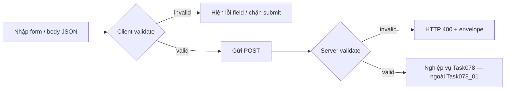

# SRS — Task078_01 — Validate đầu vào tạo tài khoản nhân viên

> **File:** `backend/docs/srs/SRS_Task078-01_validate-create-user-inputs.md`  
> **Người viết:** Agent BA (Draft)  
> **Ngày:** 24/04/2026  
> **Trạng thái:** Approved

**Traceability:** SRS cha [`SRS_Task078_users-post.md`](./SRS_Task078_users-post.md) · API [`../../../frontend/docs/api/API_Task078_users_post.md`](../../../frontend/docs/api/API_Task078_users_post.md) (mục 3, 6, 7) · Envelope lỗi [`../../../frontend/docs/api/API_RESPONSE_ENVELOPE.md`](../../../frontend/docs/api/API_RESPONSE_ENVELOPE.md) · DTO BE `UserCreateRequest` (`jakarta.validation`)

**Phạm vi Task078_01:** chỉ **quy tắc validate** cho body tạo nhân viên (form / JSON request). **Không** mô tả SQL, transaction, hay INSERT — tham chiếu Task078 gốc.

---

## 1. Bối cảnh & phạm vi

### 1.1 Vấn đề

Cần một bản mô tả **đo được** để Dev FE/BE triển khai **cùng một hợp đồng** validate cho luồng tạo tài khoản nhân viên mới, tránh lệch giữa form client, Zod tham chiếu API, và Bean Validation trên server.

### 1.2 In-scope

- Ràng buộc độ dài / định dạng / bắt buộc–tùy chọn từng field của body `POST /api/v1/users`.
- Hành vi kỳ vọng khi vi phạm: **400** + `details` map theo tên field (khi BE hỗ trợ), và/hoặc thông điệp tổng hợp theo envelope.
- Đồng bộ tham chiếu với `UserCreateBodySchema` (API doc) và annotation hiện có trên `UserCreateRequest`.

### 1.3 Out-of-scope

- RBAC, JWT, hash mật khẩu, 201/409 nghiệp vụ trùng user — thuộc SRS Task078 gốc.
- SQL, migration, tên bảng/cột.
- Chỉnh sửa hồ sơ nhân viên đã tồn tại (task khác).

---

## 2. Persona (kế thừa)

| Vai trò | Ghi chú |
| :--- | :--- |
| Owner / Admin có `can_manage_staff` | Người gửi form tạo mới; validate xảy ra trước khi nghiệp vụ “tạo user” chạy. |

---

## 3. Luồng (chỉ lớp validate)



---

## 4. Bảng ràng buộc field (nguồn sự thật: API + DTO BE)

| Field JSON | Bắt buộc | Ràng buộc | Ghi chú đồng bộ |
| :--- | :---: | :--- | :--- |
| `username` | Có | Chuỗi không chỉ khoảng trắng; độ dài **3–100** ký tự (sau khi quyết định chính sách **trim** — xem Open Questions) | Khớp `@NotBlank` + `@Size(min=3,max=100)` |
| `password` | Có | Không blank; độ dài **8–128** ký tự | Khớp `@NotBlank` + `@Size(min=8,max=128)` |
| `fullName` | Có | Không blank; độ dài **1–255** ký tự | Khớp `@NotBlank` + `@Size(min=1,max=255)` |
| `email` | Có | Định dạng **email** chuẩn hóa validation Bean `@Email`; không blank | Khớp `@NotBlank` + `@Email` |
| `phone` | Không | Nếu gửi: tối đa **20** ký tự; cho phép chuỗi rỗng hoặc bỏ key — **[CẦN CHỐT]** PO: `null` vs `""` vs omit | `@Size(max=20)` — không `@NotBlank` |
| `staffCode` | Không | Nếu gửi: tối đa **50** ký tự | `@Size(max=50)` |
| `roleId` | Có | Số nguyên **> 0** (positive) | `@NotNull` + `@Positive` |
| `status` | Không | Chỉ chấp nhận literal **`Active`** hoặc **`Inactive`** nếu field có mặt | `@Pattern(Active\|Inactive)` trên `String` — hành vi khi **omit** field: xem Open Questions |

**GAP (ghi nhận, không tự chốt):** Zod trong `API_Task078_users_post.md` đặt `status` optional với default `Active`; record Java có một field `status` — cần Dev xác nhận giá trị mặc định khi client **không** gửi `status` có khớp nghiệp vụ “Active” hay không.

---

## 5. Hành vi lỗi validate (400)

- Khi bất kỳ ràng buộc mục 4 vi phạm: HTTP **400**, envelope lỗi theo dự án (`success: false`, `error`, `message`, `details` nếu có).
- **Ưu tiên triển khai:** `details` là object key = **tên field JSON** (`username`, `password`, …), value = thông điệp ngắn gọn tiếng Việt (hoặc key i18n — **[CẦN CHỐT]** PO).
- Trùng email/username sau khi đã hợp lệ syntactically là **409** — **không** thuộc Task078_01.

---

## 6. Acceptance Criteria (Given / When / Then)

```text
Given người dùng đang điền form tạo nhân viên
When username ngắn hơn 3 ký tự hoặc dài hơn 100 ký tự (theo chính sách trim đã chốt)
Then client chặn submit hoặc hiển thị lỗi field username; nếu vẫn gửi BE thì HTTP 400 và thông báo/ details thể hiện vi phạm username
```

```text
Given form tạo nhân viên
When password có độ dài < 8 hoặc > 128
Then tương tự: lỗi field password trước submit hoặc 400 từ server
```

```text
Given form tạo nhân viên
When fullName để trống hoặc vượt quá 255 ký tự
Then lỗi field fullName / 400
```

```text
Given form tạo nhân viên
When email không đúng định dạng email hoặc để trống
Then lỗi field email / 400
```

```text
Given form tạo nhân viên
When phone (nếu nhập) dài hơn 20 ký tự
Then lỗi field phone / 400
```

```text
Given form tạo nhân viên
When staffCode (nếu nhập) dài hơn 50 ký tự
Then lỗi field staffCode / 400
```

```text
Given form tạo nhân viên
When roleId không phải số nguyên dương (≤ 0 hoặc thiếu)
Then lỗi field roleId / 400
```

```text
Given form tạo nhân viên
When status được gửi và khác Active và Inactive
Then lỗi field status / 400
```

```text
Given toàn bộ field thỏa mục 4 (và RBAC/ auth đủ)
When submit POST /api/v1/users
Then không còn lỗi validate Task078_01; xử lý tiếp theo thuộc Task078 (201/409/403…)
```

---

## 7. Quyết định PO (đã chốt khi Approved)

1. **Trim:** Có — `username`, `email`, `fullName`, `phone`, `staffCode` được trim trước validate (mật khẩu không trim).
2. **`status` omitted:** Có — server mặc định **Active** (đã có test + `UserCreationService`).
3. **`phone` / `staffCode`:** Cho phép **null** / bỏ key; chuỗi rỗng sau trim coi như không gửi.
4. **Thông điệp:** Tiếng Việt trên annotation `UserCreateRequest` + `details` field từ `MethodArgumentNotValidException`.

---

## 8. Không có mục SQL

Theo phạm vi chỉ định của PO cho Task078_01, tài liệu này **không** chứa mục “Dữ liệu & SQL tham chiếu”. Triển khai persistence vẫn tuân [`SRS_Task078_users-post.md`](./SRS_Task078_users-post.md).
