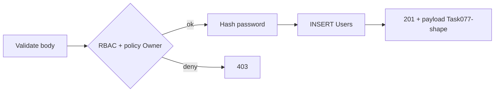

# SRS — `POST /api/v1/users` — Tạo nhân viên (Task078)

> **File**: `backend/docs/srs/SRS_Task078_users-post.md`  
> **Người viết**: Agent BA_SQL (Draft)  
> **Ngày cập nhật**: 24/04/2026  
> **Trạng thái**: Approved

**Traceability:** API [`../../../frontend/docs/api/API_Task078_users_post.md`](../../../frontend/docs/api/API_Task078_users_post.md) · Danh sách / read-model [`../../../frontend/docs/api/API_Task077_users_get_list.md`](../../../frontend/docs/api/API_Task077_users_get_list.md) · UC schema [`../../../frontend/docs/UC/schema.sql`](../../../frontend/docs/UC/schema.sql) (`Users`, `Roles`) · Envelope [`../../../frontend/docs/api/API_RESPONSE_ENVELOPE.md`](../../../frontend/docs/api/API_RESPONSE_ENVELOPE.md)

---

## 1. Tóm tắt

- **Vấn đề**: Owner cần tạo tài khoản nhân viên mới (UC3 — form nhân viên).
- **Mục tiêu**: `POST /api/v1/users` nhận body đã validate, hash mật khẩu, ghi `Users`, trả **201** với dạng một phần tử đồng bộ Task077 (camelCase, không lộ `passwordHash`).
- **Đối tượng**: **Owner** / Admin có `can_manage_staff`.

---

## 2. Phạm vi

### 2.1 In-scope

- Một endpoint `POST /api/v1/users` theo API Task078.
- RBAC, body field, mã lỗi 400/401/403/409/500.
- Transaction insert + bcrypt; audit tối thiểu (nếu policy có `SystemLogs`).

### 2.2 Out-of-scope

- UI chi tiết `EmployeeForm` / `EmployeesPage` — tham chiếu `mini-erp` + `FEATURES_UI_INDEX`; không duplicate wireframe tại đây.
- Đổi mật khẩu / khóa tài khoản sau tạo (task khác).

---

## 3. Persona & RBAC

| Hành động | Quyền |
| :--- | :--- |
| `POST /api/v1/users` | Owner hoặc Admin có **`can_manage_staff`** |
| Tạo thêm **Owner** | **Không** (hoặc policy 1 Owner/tenant — **[CẦN CHỐT]** PO) |

---

## 4. User Stories

- **US1**: Là Owner, tôi muốn tạo nhân viên với username/email/role để họ đăng nhập vào hệ thống.
- **US2**: Là Owner, tôi muốn nhận lỗi **409** rõ ràng khi trùng email/username để sửa form.

---

## 5. Luồng nghiệp vụ



---

## 6. Quy tắc nghiệp vụ

- **Password**: chỉ plaintext trên wire (HTTPS); lưu `password_hash` (bcrypt theo chuẩn dự án).
- **Email**: UNIQUE — trùng → **409** với `details` map field (theo envelope).
- **`status`**: API cho `Active` \| `Inactive`; map DB `Active` \| `Locked` như Task077 mục 3.
- **`staffCode`**: API map `staff_code` — **GAP schema:** bảng `Users` trong `frontend/docs/UC/schema.sql` (đoạn baseline) **chưa** có cột `staff_code`; Task077 DDL gợi ý nằm [`Database_Specification.md`](../../../frontend/docs/UC/Database_Specification.md) §6 — Dev cần Flyway bổ sung trước khi triển khai đủ field; cho đến khi có cột: Open Question hoặc bỏ qua `staffCode` trong INSERT.

---

## 7. API / Response

- **201 Created**: body `data` cùng shape một phần tử như Task077 (id, employeeCode, fullName, email, …) — API Task078 mục 5.
- Không trả `passwordHash` / plaintext.

---

## 8. Edge Cases

- **409**: song song hai request tạo cùng email — một thành công, một 409 (unique index).
- **403**: JWT hợp lệ nhưng không có `can_manage_staff`.

---

## 9. Gợi ý FE (tham chiếu)

| Nơi | Gợi ý |
| :--- | :--- |
| Trang | `settings/pages/EmployeesPage.tsx`, form `EmployeeForm.tsx` |
| API client | `features/settings/api/*` + `apiJson` + Bearer |

---

## 10. Dữ liệu & SQL tham chiếu (PostgreSQL)

**Giả định:** sau migration có `staff_code` (nullable) trên `Users` như Task077; nếu chưa có, INSERT chỉ các cột tồn tại trong Flyway hiện tại.

### 10.1 Kiểm tra trùng (trước INSERT)

```sql
SELECT id FROM Users WHERE lower(email) = lower(:email);
```

### 10.2 INSERT (mẫu — có `staff_code`)

```sql
INSERT INTO Users (
  username, password_hash, full_name, email, phone, staff_code, role_id, status
) VALUES (
  :username, :password_hash, :full_name, :email, :phone, :staff_code, :role_id, :status_db
)
RETURNING id, username, full_name, email, phone, staff_code, role_id, status, created_at;
```

`status_db`: map `Inactive` → `Locked` nếu theo Task077.

### 10.3 Transaction

- Một transaction: check unique + INSERT; lỗi unique → 409, không partial insert.

---

## 11. Acceptance Criteria

```text
Given Owner có can_manage_staff và body hợp lệ
When POST /api/v1/users
Then HTTP 201 và data không chứa password; Users có một dòng mới
```

```text
Given email đã tồn tại
When POST /api/v1/users
Then HTTP 409 và details chứa key email (hoặc username tương tự)
```

```text
Given JWT không đủ quyền
When POST /api/v1/users
Then HTTP 403
```

---

## 12. Open Questions

- **Cột `staff_code`**: thời điểm Flyway + tên bảng thực tế (snake vs Camel) — đồng bộ Task077.
- **Giới hạn 1 Owner / cấm tạo Owner**: policy chi tiết + kiểm tra `role_id`.
- **SystemLogs** khi tạo user: có bắt buộc không — PO/Dev.
