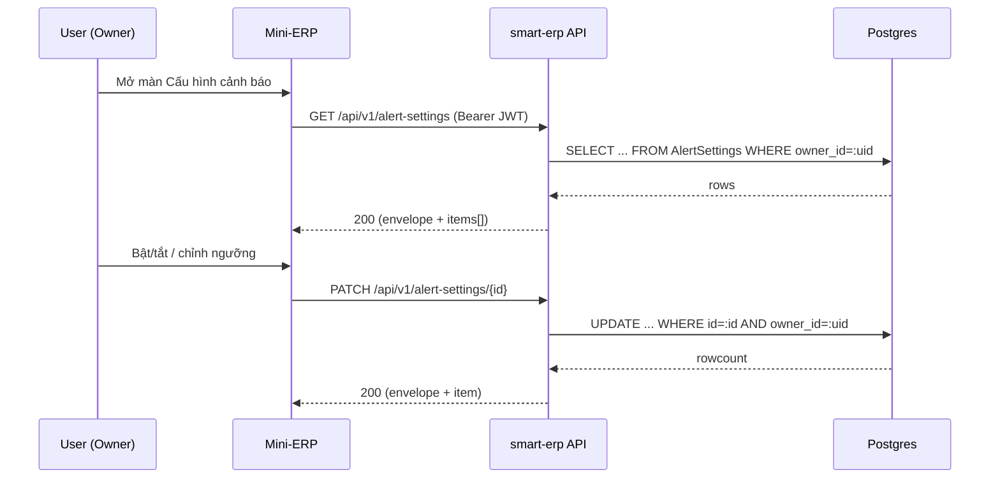

# SRS — Alert settings API (GET list / POST / PATCH / DELETE) — Task082–085

> **File (Spring / `smart-erp`):** `backend/docs/srs/SRS_Task082-085_alert-settings-api.md`  
> **Người soạn:** Agent BA (+ SQL)  
> **Ngày:** 30/04/2026  
> **Trạng thái:** Approved  
> **PO duyệt (khi Approved):** PO, 30/04/2026

---

## 0. Đầu vào & traceability

| Nguồn | Đường dẫn / ghi chú |
| :--- | :--- |
| API spec | `frontend/docs/api/API_Task082_alert_settings_get_list.md` |
| API spec | `frontend/docs/api/API_Task083_alert_settings_post.md` |
| API spec | `frontend/docs/api/API_Task084_alert_settings_patch.md` |
| API spec | `frontend/docs/api/API_Task085_alert_settings_delete.md` |
| Envelope chuẩn | `frontend/docs/api/API_RESPONSE_ENVELOPE.md` |
| UC / DB spec | `frontend/docs/UC/Database_Specification.md` §10 (AlertSettings) |
| Flyway thực tế | `backend/smart-erp/src/main/resources/db/migration/V1__baseline_smart_inventory.sql` (CREATE TABLE `AlertSettings`) |
| RBAC pattern (evidence) | `backend/smart-erp/src/main/java/com/example/smart_erp/inventory/receipts/lifecycle/StockReceiptAccessPolicy.java`, `backend/smart-erp/src/main/java/com/example/smart_erp/sales/SalesOrderAccessPolicy.java` |

---

## 1. Tóm tắt điều hành

- **Vấn đề:** Owner cần cấu hình các rule cảnh báo (bật/tắt, ngưỡng, kênh, tần suất, danh sách người nhận bổ sung) và UI `AlertSettingsPage` cần API CRUD để đồng bộ các switch/rule.
- **Mục tiêu nghiệp vụ:** Quản trị cấu hình cảnh báo theo từng Owner, tránh trùng loại cảnh báo trên cùng Owner, cập nhật nhanh (switch toggle) và hỗ trợ filter khi hiển thị danh sách.
- **Đối tượng / persona:** Owner (chính) và Admin (vận hành / hỗ trợ) — chi tiết RBAC tại §6.

### 1.1 Giao diện Mini-ERP (bắt buộc khi API được gọi từ `mini-erp`)

| Nhãn menu (Sidebar) | Route | Page (export) | Component / vùng chính | File (dưới `frontend/mini-erp/src/features/`) |
| :--- | :--- | :--- | :--- | :--- |
| Cấu hình cảnh báo | `/settings/alerts` | `AlertSettingsPage` | _[GAP]_ chưa đối chiếu component chính | `settings/pages/AlertSettingsPage.tsx` |

---

## 2. Bóc tách nghiệp vụ (capabilities)

| # | Capability | Kích hoạt bởi | Kết quả mong đợi | Ghi chú |
| :---: | :--- | :--- | :--- | :--- |
| C1 | Xem danh sách rule cảnh báo của Owner | UI mở màn / refresh | Trả về `items[]` theo shape chuẩn, hỗ trợ filter `alertType`, `isEnabled` | Task082 |
| C2 | Tạo rule cảnh báo cho Owner | UI thêm rule / seed mặc định | Tạo bản ghi mới; không cho trùng `(owner_id, alert_type)` | Task083 |
| C3 | Cập nhật một rule (partial) | UI toggle / đổi ngưỡng / đổi kênh… | Chỉ cập nhật các field gửi lên; validate ràng buộc theo loại cảnh báo | Task084 |
| C4 | Xóa một rule | UI xóa | Xóa bản ghi thuộc Owner; thao tác idempotent theo `id` scope Owner | Task085 |

---

## 3. Phạm vi

### 3.1 In-scope

- CRUD cho `AlertSettings` theo các endpoint Task082–085.
- Enforce unique `(owner_id, alert_type)` và báo **409** khi tạo trùng.
- Chuẩn hóa response theo envelope dự án (success/data/message; error/success=false).
- Migration DB để **mở rộng CHECK `alert_type`** theo DB spec §10 (vì Flyway V1 hiện đang thiếu các loại mới).

### 3.2 Out-of-scope

- Luồng “bắn cảnh báo” (scheduler/realtime push) và tích hợp kênh Email/SMS/Zalo thật.
- Quản trị “nhóm người nhận” dựa trên entity riêng (hiện `recipients` là JSONB string array).
- UI/UX chi tiết của `AlertSettingsPage` (SRS này chỉ ràng buộc API).

---

## 4. Câu hỏi làm rõ cho PO (Open Questions)

| ID | Câu hỏi | Ảnh hưởng nếu không trả lời | Blocker? |
| :--- | :--- | :--- | :---: |
| OQ-1 | **Ai được quản lý alert settings?** Chỉ `role=Owner` hay Owner + Staff (có quyền) + Admin? | Nếu Staff được phép, cần policy “Staff thao tác trên owner_id nào?” (hiện schema chỉ có `owner_id`, không có `store_id/tenant_id`). | Có |
| OQ-2 | **Admin “đọc toàn cục”**: Chức năng này quyết định liệu Admin có thể xem (GET) danh sách tất cả rule cảnh báo của mọi Owner trong hệ thống (toàn bộ doanh nghiệp) hay không, thay vì chỉ xem các rule thuộc Owner của chính mình. Nếu cho phép, API cần hỗ trợ các tham số lọc (ví dụ: `ownerId`, `username`) để Admin dễ dàng tìm và phân tích cảnh báo của từng Owner cụ thể. Ngược lại, nếu không cung cấp filter, quyền xem sẽ hạn chế — Admin chỉ thấy rule của một Owner duy nhất (không thực sự “toàn cục”). | Có |
| OQ-3 | **`thresholdValue` là ngưỡng cấu hình cho từng rule cảnh báo, ví dụ: số ngày tồn kho tối đa (int, days) hoặc mức tiền cảnh báo (decimal, money).** Nên lưu cùng một cột `DECIMAL(10,2)` như DB spec, mọi loại đều lưu dưới dạng số thập phân; validate/convert kiểu trên BE/FE cho hợp context sử dụng. | Ảnh hưởng validation và hiển thị/rounding trên UI. | Không |
| OQ-4 | `recipients`: nếu chọn dùng **username**, **userId**, hay “mã nhân viên” (`staff_code`) thì mỗi cách sẽ ảnh hưởng gì tới validation, logic lookup và UI hiển thị? | Quyết định này ảnh hưởng đến: (1) Validator phía BE chắc chắn phải đối chiếu đúng trường (userId thì tra bảng id, username thì so khớp theo username v.v.); (2) FE khi render danh sách cần dùng field nào để lookup và hiển thị thông tin người nhận rõ ràng, tránh nhầm lẫn khi cùng tên hoặc đổi username/số id; (3) Nếu backend/save DB chưa đồng bộ spec, việc đổi type có thể gây thiếu sót dữ liệu; (4) Hệ thống khác tích hợp hoặc xuất/nhập liệu cũng phải rõ ràng về trường dùng. | Có |
| OQ-5 | `DELETE`: nếu xóa rule “mặc định hệ thống” (nếu có seed) thì có cho phép không, hay chỉ `isEnabled=false`? | Ảnh hưởng đến thiết kế dữ liệu seed/migration và UX. | Không |

**Trả lời PO (điền khi chốt):**

| ID | Quyết định PO | Ngày |
| :--- | :--- | :--- |
| OQ-1 | Chỉ `role=Owner` được quản lý alert settings | 30/04/2026 |
| OQ-2 | Admin có thể đọc “toàn cục” (xem danh sách của mọi Owner) | 30/04/2026 |
| OQ-3 | Giữ `thresholdValue` theo DB spec (`DECIMAL(10,2)`) | 30/04/2026 |
| OQ-4 | `recipients` dùng **username** | 30/04/2026 |
| OQ-5 | Không xóa vật lý; “xóa” = set `isEnabled=false` | 30/04/2026 |

---

## 5. Phân tích scope tệp & bằng chứng (Evidence scope)

### 5.1 Tài liệu đã đối chiếu (read)

- `frontend/docs/api/API_Task082_alert_settings_get_list.md`
- `frontend/docs/api/API_Task083_alert_settings_post.md`
- `frontend/docs/api/API_Task084_alert_settings_patch.md`
- `frontend/docs/api/API_Task085_alert_settings_delete.md`
- `frontend/docs/api/API_RESPONSE_ENVELOPE.md`
- `frontend/docs/UC/Database_Specification.md` §10
- `backend/smart-erp/src/main/resources/db/migration/V1__baseline_smart_inventory.sql` (table `AlertSettings`)
- RBAC evidence: `StockReceiptAccessPolicy`, `SalesOrderAccessPolicy` (check claim `role`)

### 5.2 Mã / migration dự kiến (write / verify)

- **Flyway**: thêm migration mới (V2+) để:
  - Mở rộng CHECK `alert_type` theo DB spec §10 (thêm `OverStock`, `SalesOrderCreated`, `SystemHealth` nếu chưa có).
  - Thêm UNIQUE constraint `(owner_id, alert_type)`.
  - (Tùy chọn) tạo index composite phục vụ filter theo `owner_id + is_enabled` hoặc `owner_id + alert_type`.
- **Backend packages dự kiến** (gợi ý theo convention hiện có):
  - `com.example.smart_erp.settings.alerts.controller.AlertSettingsController`
  - `com.example.smart_erp.settings.alerts.service.AlertSettingsService`
  - `com.example.smart_erp.settings.alerts.repository.AlertSettingsJdbcRepository` (hoặc JPA tùy team)
  - DTO/response dưới `...settings.alerts.dto|response`

### 5.3 Rủi ro phát hiện sớm

- **Multi-tenant**: schema chỉ có `owner_id` (không có `store_id/tenant_id`). Theo quyết định PO, chỉ Owner thao tác nên không phát sinh mapping Staff→Owner.
- **Enum `alert_type`**: Flyway V1 đang CHECK thiếu loại mới; nếu không migrate trước, POST/PATCH sẽ bị DB reject (400/500 tuỳ mapping).
- **`recipients`** là JSONB array string; PO đã chốt định danh = `username` nên backend cần validate tồn tại `Users.username` nếu có yêu cầu strict.

---

## 6. Persona & RBAC

| Vai trò | Quyền / điều kiện | HTTP khi từ chối |
| :--- | :--- | :--- |
| Owner | CRUD rule thuộc “owner scope” của mình | 403 (không đủ role) / 404 (không tìm thấy trong scope) |
| Admin | **Chỉ đọc** danh sách rule (GET list) của mọi Owner (“toàn cục”) | 403 |

**RBAC kỹ thuật bám codebase:** claim `role` trong JWT (`Owner`/`Admin`/...) theo pattern `StockReceiptAccessPolicy.assertOwnerOnly()` và `SalesOrderAccessPolicy`.

---

## 7. Actor & luồng nghiệp vụ

### 7.1 Danh sách actor

| Actor | Mô tả ngắn |
| :--- | :--- |
| End user | Owner cấu hình cảnh báo |
| Client (Mini-ERP) | `AlertSettingsPage` gọi API CRUD |
| API (`smart-erp`) | Validate RBAC + validation + ghi/đọc DB |
| Database (PostgreSQL) | Lưu bảng `AlertSettings` |

### 7.2 Luồng chính (narrative)

1. User mở màn “Cấu hình cảnh báo”; client gọi `GET /api/v1/alert-settings` để lấy danh sách rule hiện tại.
2. User bật/tắt hoặc chỉnh ngưỡng; client gọi `PATCH /api/v1/alert-settings/{id}` (partial update).
3. Khi tạo rule mới; client gọi `POST /api/v1/alert-settings`; API kiểm tra trùng `(owner_id, alert_type)` và trả 409 nếu trùng.
4. Khi xóa; client gọi `DELETE /api/v1/alert-settings/{id}`; API **vô hiệu hóa** rule (`isEnabled=false`) trong scope owner và trả `204`.

### 7.3 Sơ đồ



---

## 8. Hợp đồng HTTP & ví dụ JSON

> Tất cả response JSON (khi có body) bám `frontend/docs/api/API_RESPONSE_ENVELOPE.md`.

### 8.1 `GET /api/v1/alert-settings` (Task082)

#### 8.1.1 Tổng quan endpoint

| Thuộc tính | Giá trị |
| :--- | :--- |
| Method + path | `GET /api/v1/alert-settings` |
| Auth | Bearer JWT |
| Content-Type | `application/json` |

#### 8.1.2 Request — schema logic (query)

| Field / param | Vị trí | Kiểu | Bắt buộc | Validation | Ghi chú |
| :--- | :--- | :--- | :---: | :--- | :--- |
| `ownerId` | query | int | Không | positive | **Chỉ Admin**: lọc theo Owner cụ thể; nếu bỏ qua thì Admin thấy toàn cục |
| `alertType` | query | string | Không | thuộc enum `alert_type` | Lọc theo loại |
| `isEnabled` | query | boolean | Không | `true|false` | Lọc theo trạng thái |

#### 8.1.3 Response thành công — ví dụ JSON đầy đủ (`200`)

```json
{
  "success": true,
  "data": {
    "items": [
      {
        "id": 10,
        "alertType": "LowStock",
        "thresholdValue": 10,
        "channel": "App",
        "frequency": "Realtime",
        "isEnabled": true,
        "recipients": ["user_2"],
        "updatedAt": "2026-04-20T12:00:00Z"
      }
    ]
  },
  "message": "Thành công"
}
```

#### 8.1.4 Response lỗi — ví dụ JSON đầy đủ

**401 — chưa đăng nhập / JWT hết hạn**

```json
{
  "success": false,
  "error": "UNAUTHORIZED",
  "message": "Phiên đăng nhập không hợp lệ hoặc đã hết hạn"
}
```

**403 — không đủ quyền**

```json
{
  "success": false,
  "error": "FORBIDDEN",
  "message": "Bạn không có quyền thực hiện thao tác này"
}
```

**500 — lỗi hệ thống**

```json
{
  "success": false,
  "error": "INTERNAL_SERVER_ERROR",
  "message": "Dịch vụ tạm thời không khả dụng. Vui lòng thử lại."
}
```

### 8.2 `POST /api/v1/alert-settings` (Task083)

#### 8.2.1 Tổng quan endpoint

| Thuộc tính | Giá trị |
| :--- | :--- |
| Method + path | `POST /api/v1/alert-settings` |
| Auth | Bearer JWT |
| Content-Type | `application/json` |

#### 8.2.2 Request — schema logic (body)

| Field | Vị trí | Kiểu | Bắt buộc | Validation | Ghi chú |
| :--- | :--- | :--- | :---: | :--- | :--- |
| `alertType` | body | string | Có | thuộc enum `alert_type` | |
| `channel` | body | string | Có | `App|Email|SMS|Zalo` | |
| `frequency` | body | string | Không | `Realtime|Daily|Weekly` | default `Realtime` |
| `thresholdValue` | body | number \| null | Tuỳ loại | xem BR-2 | |
| `isEnabled` | body | boolean | Không |  | default `true` |
| `recipients` | body | string[] | Không | max length _[GAP]_ | |

> `ownerId` lấy từ JWT subject (user id), server-side.

#### 8.2.3 Request — ví dụ JSON đầy đủ

```json
{
  "alertType": "HighValueTransaction",
  "channel": "App",
  "frequency": "Realtime",
  "thresholdValue": 50000000,
  "isEnabled": true,
  "recipients": ["user_2", "user_5"]
}
```

#### 8.2.4 Response thành công — ví dụ JSON đầy đủ (`201`)

```json
{
  "success": true,
  "data": {
    "id": 101,
    "alertType": "HighValueTransaction",
    "thresholdValue": 50000000,
    "channel": "App",
    "frequency": "Realtime",
    "isEnabled": true,
    "recipients": ["user_2", "user_5"],
    "updatedAt": "2026-04-30T12:00:00Z"
  },
  "message": "Thao tác thành công"
}
```

#### 8.2.5 Response lỗi — ví dụ JSON đầy đủ

**400 — validation**

```json
{
  "success": false,
  "error": "BAD_REQUEST",
  "message": "Dữ liệu không hợp lệ",
  "details": {
    "alertType": "Không hợp lệ",
    "channel": "Không hợp lệ"
  }
}
```

**409 — trùng loại rule trên cùng Owner**

```json
{
  "success": false,
  "error": "CONFLICT",
  "message": "Bạn đã có cấu hình cho loại cảnh báo này"
}
```

### 8.3 `PATCH /api/v1/alert-settings/{id}` (Task084)

#### 8.3.1 Tổng quan endpoint

| Thuộc tính | Giá trị |
| :--- | :--- |
| Method + path | `PATCH /api/v1/alert-settings/{id}` |
| Auth | Bearer JWT |
| Content-Type | `application/json` |

#### 8.3.2 Request — schema logic

| Field / param | Vị trí | Kiểu | Bắt buộc | Validation | Ghi chú |
| :--- | :--- | :--- | :---: | :--- | :--- |
| `id` | path | int | Có | positive | |
| `thresholdValue` | body | number \| null | Không | xem BR-2 | |
| `channel` | body | string | Không | enum `channel` | |
| `frequency` | body | string | Không | enum `frequency` | |
| `isEnabled` | body | boolean | Không |  | |
| `recipients` | body | string[] \| null | Không |  | null = clear list |

**Rule:** body phải có ít nhất 1 field; nếu rỗng → 400.

#### 8.3.3 Request — ví dụ JSON đầy đủ

```json
{
  "isEnabled": false,
  "thresholdValue": 15
}
```

#### 8.3.4 Response thành công — ví dụ JSON đầy đủ (`200`)

```json
{
  "success": true,
  "data": {
    "id": 10,
    "alertType": "ExpiryDate",
    "thresholdValue": 15,
    "channel": "App",
    "frequency": "Realtime",
    "isEnabled": false,
    "recipients": [],
    "updatedAt": "2026-04-30T12:05:00Z"
  },
  "message": "Thao tác thành công"
}
```

#### 8.3.5 Response lỗi — ví dụ JSON đầy đủ

**404 — không tìm thấy trong scope Owner**

```json
{
  "success": false,
  "error": "NOT_FOUND",
  "message": "Không tìm thấy cấu hình cảnh báo"
}
```

### 8.4 `DELETE /api/v1/alert-settings/{id}` (Task085)

#### 8.4.1 Tổng quan endpoint

| Thuộc tính | Giá trị |
| :--- | :--- |
| Method + path | `DELETE /api/v1/alert-settings/{id}` |
| Auth | Bearer JWT |
| Response | `204 No Content` |

**Hành vi nghiệp vụ:** không xóa vật lý; set `isEnabled=false` (PO OQ-5).

#### 8.4.2 Response lỗi — ví dụ JSON đầy đủ

**404 — không tìm thấy trong scope Owner**

```json
{
  "success": false,
  "error": "NOT_FOUND",
  "message": "Không tìm thấy cấu hình cảnh báo"
}
```

---

## 9. Quy tắc nghiệp vụ (bảng)

| Mã | Điều kiện | Hành động / kết quả |
| :--- | :--- | :--- |
| BR-1 | `(owner_id, alert_type)` đã tồn tại khi tạo mới | Trả 409 `CONFLICT`, message “Bạn đã có cấu hình cho loại cảnh báo này” |
| BR-2 | `thresholdValue` tùy `alertType` | - `LowStock`: số lượng (>= 0)  \| - `ExpiryDate`: số ngày (>= 0) \| - `HighValueTransaction`: số tiền (>= 0) \| - `PartnerDebtDueSoon`: số ngày (>= 0) \| - các loại khác: `thresholdValue` phải là `null` hoặc bị bỏ qua |
| BR-3 | `recipients=null` trong PATCH | Clear danh sách người nhận (set DB `recipients = NULL` hoặc `[]` theo quyết định Dev/PO) |
| BR-4 | PATCH/DELETE không tìm thấy bản ghi thuộc scope owner | Trả 404 `NOT_FOUND` (không phân biệt “không tồn tại” vs “không thuộc owner”) |
| BR-5 | `DELETE` alert setting | Set `is_enabled=false` và cập nhật `updated_at` (không xóa vật lý) |

---

## 10. Dữ liệu & SQL tham chiếu (phối hợp Agent SQL)

### 10.1 Bảng / quan hệ (tên Flyway)

| Bảng | Read / Write | Ghi chú |
| :--- | :--- | :--- |
| `AlertSettings` | R/W | Owner-scoped by `owner_id` |
| `Users` | R | Lấy `owner_id` từ JWT subject (user id) |

### 10.2 SQL / ranh giới transaction

```sql
-- GET list (Task082)
SELECT
  id,
  alert_type,
  threshold_value,
  channel,
  frequency,
  is_enabled,
  recipients,
  updated_at
FROM AlertSettings
WHERE (:ownerId IS NULL OR owner_id = :ownerId)
  AND (:alertType IS NULL OR alert_type = :alertType)
  AND (:isEnabled IS NULL OR is_enabled = :isEnabled)
ORDER BY id ASC;

-- POST create (Task083) - khuyến nghị rely on UNIQUE (owner_id, alert_type)
INSERT INTO AlertSettings (
  owner_id, alert_type, threshold_value, channel, frequency, is_enabled, recipients, created_at, updated_at
)
VALUES (
  :ownerId, :alertType, :thresholdValue, :channel, COALESCE(:frequency, 'Realtime'),
  COALESCE(:isEnabled, TRUE), :recipientsJsonb, CURRENT_TIMESTAMP, CURRENT_TIMESTAMP
)
RETURNING id, alert_type, threshold_value, channel, frequency, is_enabled, recipients, updated_at;

-- PATCH update (Task084)
UPDATE AlertSettings
SET
  threshold_value = COALESCE(:thresholdValue, threshold_value),
  channel = COALESCE(:channel, channel),
  frequency = COALESCE(:frequency, frequency),
  is_enabled = COALESCE(:isEnabled, is_enabled),
  recipients = COALESCE(:recipientsJsonb, recipients),
  updated_at = CURRENT_TIMESTAMP
WHERE id = :id AND owner_id = :ownerId
RETURNING id, alert_type, threshold_value, channel, frequency, is_enabled, recipients, updated_at;

-- DELETE (Task085) - soft disable theo PO (OQ-5)
UPDATE AlertSettings
SET is_enabled = FALSE,
    updated_at = CURRENT_TIMESTAMP
WHERE id = :id AND owner_id = :ownerId;
```

**Transaction:** mỗi request write (POST/PATCH/DELETE) chạy trong 1 transaction mặc định `@Transactional`.

### 10.3 Index & hiệu năng (nếu có)

- Đã có `idx_alert_owner` on `owner_id` trong Flyway V1.
- Đề xuất bổ sung:
  - `UNIQUE (owner_id, alert_type)` để đảm bảo BR-1.
  - (Tùy chọn) `idx_alert_owner_enabled` on `(owner_id, is_enabled)` nếu UI filter `isEnabled` dùng thường xuyên.

### 10.4 Migration/GAP cần xử lý

- Flyway V1 hiện có CHECK `alert_type` chỉ gồm: `LowStock`, `ExpiryDate`, `HighValueTransaction`, `PendingApproval`, `PartnerDebtDueSoon`.
- DB spec §10 đã mở rộng thêm: `OverStock`, `SalesOrderCreated`, `SystemHealth`.
- Cần migration V2+ để drop/add lại CHECK constraint cho `AlertSettings.alert_type` theo danh sách mới (hoặc chuyển sang enum type nếu team chọn).

### 10.5 Kiểm chứng dữ liệu cho Tester

- Seed: tạo 2 rule cho cùng owner (`LowStock`, `ExpiryDate`) và verify GET list trả đủ; filter `alertType=LowStock` chỉ trả 1.
- POST create trùng `alertType` trên cùng owner trả 409.
- PATCH với id không thuộc owner trả 404.
- DELETE (soft disable) trả 204; gọi lại DELETE lần 2 vẫn trả 204 (idempotent).

---

## 11. Acceptance criteria (Given / When /Then)

```text
Given user đăng nhập với role=Owner
When gọi GET /api/v1/alert-settings
Then nhận 200 và data.items là danh sách rule thuộc owner_id=userId trong JWT

Given user đăng nhập với role=Admin
When gọi GET /api/v1/alert-settings (không truyền ownerId)
Then nhận 200 và data.items là danh sách rule của tất cả Owner (toàn cục)

Given user đăng nhập với role=Admin
When gọi GET /api/v1/alert-settings?ownerId=123
Then nhận 200 và data.items chỉ gồm rule có owner_id=123

Given user role=Owner và đã có rule alertType=LowStock
When gọi POST /api/v1/alert-settings với alertType=LowStock
Then nhận 409 CONFLICT và message "Bạn đã có cấu hình cho loại cảnh báo này"

Given user role=Owner và gửi PATCH /api/v1/alert-settings/{id} với body rỗng {}
When gọi API
Then nhận 400 BAD_REQUEST và details/body thể hiện "Cần ít nhất một trường"

Given user role=Owner nhưng id thuộc owner khác (hoặc không tồn tại)
When gọi PATCH hoặc DELETE theo id đó
Then nhận 404 NOT_FOUND và message "Không tìm thấy cấu hình cảnh báo"

Given user role=Owner và xóa rule hợp lệ
When gọi DELETE /api/v1/alert-settings/{id}
Then nhận 204 No Content

Given user role=Owner đã gọi DELETE /api/v1/alert-settings/{id}
When gọi GET /api/v1/alert-settings và tìm item theo id
Then item có isEnabled=false
```

---

## 12. GAP & giả định

| GAP / Giả định | Tác động | Hành động đề xuất |
| :--- | :--- | :--- |
| Admin đọc toàn cục (OQ-2) có thể trả danh sách lớn | Hiệu năng khi dữ liệu lớn | Khuyến nghị: bổ sung paging (page/limit/total) cho admin mode nếu cần sau |
| Component chính trong `AlertSettingsPage` chưa đối chiếu | Thiếu mapping §1.1 | Khi nối FE↔BE, bổ sung theo index feature/settings (không blocker cho BE) |

---

## 13. PO sign-off (chỉ điền khi Approved)

- [x] Đã trả lời / đóng các **OQ blocker** (OQ-1, OQ-2, OQ-4)
- [x] JSON request/response khớp ý đồ sản phẩm
- [x] Phạm vi In/Out đã đồng ý

**Chữ ký / nhãn PR:** Approved by PO (30/04/2026)

