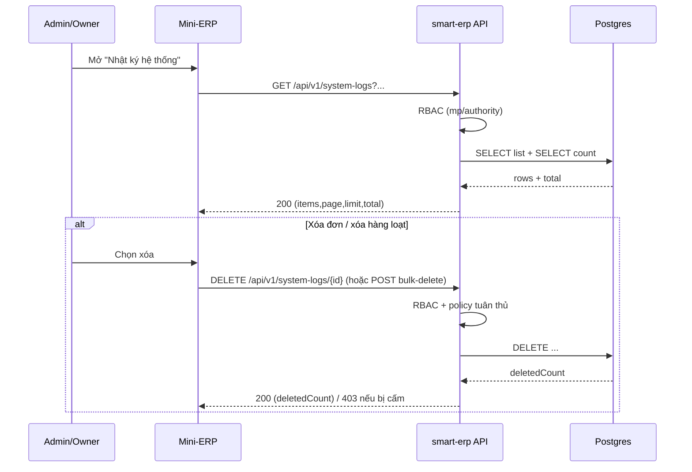

# SRS — System Logs (list + delete) — Task086–088

> **File (Spring / `smart-erp`):** `backend/docs/srs/SRS_Task086_system-logs.md`  
> **Người soạn:** Agent BA (+ SQL theo hướng dẫn)  
> **Ngày:** 30/04/2026  
> **Trạng thái:** Approved  
> **PO duyệt (khi Approved):** —

---

## 0. Đầu vào & traceability


| Nguồn                 | Đường dẫn / ghi chú                                                                                                                                                                                            |
| --------------------- | -------------------------------------------------------------------------------------------------------------------------------------------------------------------------------------------------------------- |
| API spec              | `frontend/docs/api/API_Task086_system_logs_get_list.md` · `frontend/docs/api/API_Task087_system_logs_delete.md` · `frontend/docs/api/API_Task088_system_logs_bulk_delete.md`                                   |
| Flyway thực tế        | `backend/smart-erp/src/main/resources/db/migration/V1__baseline_smart_inventory.sql` (bảng `SystemLogs`)                                                                                                       |
| Mã ghi log hiện có    | `backend/smart-erp/src/main/java/com/example/smart_erp/auth/repository/SystemLogJdbcRepository.java`                                                                                                           |
| RBAC/permission claim | `backend/smart-erp/src/main/java/com/example/smart_erp/auth/support/MenuPermissionClaims.java` · `backend/smart-erp/src/main/java/com/example/smart_erp/config/JwtResourceServerWebSecurityConfiguration.java` |
| UI Mini-ERP           | `frontend/mini-erp/src/features/settings/pages/LogsPage.tsx` · `frontend/mini-erp/src/features/settings/components/LogTable.tsx`                                                                               |


---

## 1. Tóm tắt điều hành

- **Vấn đề:** Admin/Owner cần xem và (tuỳ policy) purge nhật ký hệ thống để tra cứu vận hành/đối soát sự kiện.
- **Mục tiêu nghiệp vụ:** cung cấp danh sách log có lọc/tìm kiếm; thao tác xóa được mô tả trong hợp đồng API nhưng **bị cấm theo policy** (trả 403, UI ẩn nút).
- **Đối tượng / persona:** Admin, Owner.

### 1.1 Giao diện Mini-ERP (bắt buộc khi API được gọi từ `mini-erp`)


| Nhãn menu (Sidebar)        | Route                   | Page (export) | Component / vùng chính | File (dưới `frontend/mini-erp/src/features/`)                      |
| -------------------------- | ----------------------- | ------------- | ---------------------- | ------------------------------------------------------------------ |
| Cài đặt → Nhật ký hệ thống | `/settings/system-logs` | `LogsPage`    | `LogTable` (+ toolbar) | `settings/pages/LogsPage.tsx` · `settings/components/LogTable.tsx` |


---

## 2. Bóc tách nghiệp vụ (capabilities)


| #   | Capability                      | Kích hoạt bởi                                 | Kết quả mong đợi                                          | Ghi chú                                               |
| --- | ------------------------------- | --------------------------------------------- | --------------------------------------------------------- | ----------------------------------------------------- |
| C1  | Xem danh sách system logs       | Admin/Owner mở màn “Nhật ký hệ thống”         | Trả về danh sách phân trang, sort mới nhất trước          | Có lọc theo `logLevel/module/date range`, có `search` |
| C2  | Xóa 1 log theo id               | Admin/Owner thao tác “xóa” trên 1 dòng        | **Bị chặn theo policy** (403)                             | UI ẩn nút xóa                                         |
| C3  | Xóa nhiều log theo danh sách id | Admin/Owner chọn nhiều dòng → “xóa hàng loạt” | **Bị chặn theo policy** (403)                             | UI ẩn nút xóa hàng loạt                               |


---

## 3. Phạm vi

### 3.1 In-scope

- `GET /api/v1/system-logs`: list + filter + search + pagination.
- `DELETE /api/v1/system-logs/{id}`: endpoint tồn tại theo API spec nhưng **bị cấm theo policy** (trả 403).
- `POST /api/v1/system-logs/bulk-delete`: endpoint tồn tại theo API spec nhưng **bị cấm theo policy** (trả 403).

### 3.2 Out-of-scope

- Thay đổi cơ chế **ghi** log (hiện mới ghi một số hành động như login/logout, patch inventory).
- Retention/archiving/partitioning tự động.
- Export log (CSV), stream realtime.

---

## 4. Quyết định PO (đã chốt)

> Các câu hỏi dưới đây được giữ lại để traceability; mọi mục đều **đã có quyết định** ở bảng “Trả lời PO”.


| ID   | Câu hỏi                                                                                                                                                                                                                                                                                                              | Ảnh hưởng nếu không trả lời                                                            | Blocker? |
| ---- | -------------------------------------------------------------------------------------------------------------------------------------------------------------------------------------------------------------------------------------------------------------------------------------------------------------------- | -------------------------------------------------------------------------------------- | -------- |
| OQ-1 | **Policy tuân thủ**: hệ thống có **cho phép xóa log** không? Nếu có thì điều kiện nào (Admin only? Owner? môi trường dev/test only? chỉ xóa “log nghiệp vụ” không phải “log bảo mật”?)                                                                                                                               | Không chốt được hành vi `DELETE`/`bulk-delete` (403 vs thực thi) và UI ẩn/hiện nút xóa | Có       |
| OQ-2 | **RBAC key**: quyền “xem/xóa system logs” map vào claim nào? Hiện JWT chỉ có `mp` theo `MenuPermissionClaims.MENU_KEYS` và **chưa có** `can_view_system_logs`. Chọn: (A) thêm key mới `can_view_system_logs` (+ seed Roles.permissions) hay (B) reuse key hiện có (vd. `can_configure_alerts` vì cùng nhóm Settings) | Nếu không chốt sẽ khó triển khai PreAuthorize/AccessPolicy nhất quán                   | Có       |
| OQ-3 | `dateFrom/dateTo` format: muốn nhận **ngày** (`YYYY-MM-DD`) hay **datetime ISO** (`2026-04-30T00:00:00Z`)? `created_at` trong DB là `TIMESTAMP` (không TZ) → quy ước timezone server/UTC thế nào?                                                                                                                    | Có thể lệch lọc theo ngày và hiển thị timestamp                                        | Có       |
| OQ-4 | `GET detail`: PO có cần endpoint xem chi tiết log (bao gồm `stackTrace`, `contextData`) không? Hiện dải tài liệu Task086–088 **không có** `GET /api/v1/system-logs/{id}`; nhưng request ban đầu có nhắc “get detail”.                                                                                                | Nếu cần mà không có sẽ thiếu màn/detail dialog hoặc thiếu dữ liệu để debug             | Không    |
| OQ-5 | Search scope: `search` cần match những field nào? (message/action/module/user full name) và có cần search trong `context_data` không?                                                                                                                                                                                | Ảnh hưởng SQL + index/performance                                                      | Không    |
| OQ-6 | Giới hạn bulk delete: cố định 100 hay cấu hình? Nếu cấu hình, đặt ở `application.yml` key nào?                                                                                                                                                                                                                       | Ảnh hưởng validation                                                                   | Không    |


**Trả lời PO (đã chốt):**


| ID   | Quyết định PO                                                                                                     | Ngày       |
| ---- | ----------------------------------------------------------------------------------------------------------------- | ---------- |
| OQ-1 | **Không cho phép xóa log** (kể cả Owner).                                                                         | 30/04/2026 |
| OQ-2 | Chọn **A**: thêm permission key mới (ví dụ `can_view_system_logs`) + seed Roles.permissions theo RBAC hiện có.     | 30/04/2026 |
| OQ-3 | `dateFrom/dateTo` nhận **datetime ISO** (ví dụ `2026-04-30T00:00:00Z`).                                           | 30/04/2026 |
| OQ-4 | **Cần endpoint xem chi tiết log** (bao gồm `stackTrace`, `contextData`).                                          | 30/04/2026 |
| OQ-5 | `search` match cả `context_data` (tìm kiếm “bất kì thứ gì” trong JSON/text), ngoài các field message/action/module | 30/04/2026 |
| OQ-6 | **Không được phép delete** → bulk-delete cũng bị cấm theo policy.                                                 | 30/04/2026 |


---

## 5. Phân tích scope tệp & bằng chứng (Evidence scope)

### 5.1 Tài liệu đã đối chiếu (read)

- `frontend/docs/api/API_Task086_system_logs_get_list.md`
- `frontend/docs/api/API_Task087_system_logs_delete.md`
- `frontend/docs/api/API_Task088_system_logs_bulk_delete.md`
- `backend/smart-erp/src/main/resources/db/migration/V1__baseline_smart_inventory.sql` (DDL `SystemLogs`)
- `backend/smart-erp/src/main/java/com/example/smart_erp/auth/repository/SystemLogJdbcRepository.java`
- `backend/smart-erp/src/main/java/com/example/smart_erp/auth/support/MenuPermissionClaims.java`
- `frontend/mini-erp/src/features/FEATURES_UI_INDEX.md` (route `/settings/system-logs`)

### 5.2 Mã / migration dự kiến (write / verify)

- **Controller mới**: `backend/smart-erp/src/main/java/com/example/smart_erp/settings/controller/SystemLogsController.java` (đề xuất package `settings` vì UI nằm Settings).
- **Service mới**: `.../settings/service/SystemLogsService.java` (enforce RBAC/policy + validate).
- **JDBC repo mới**: `.../settings/repository/SystemLogsJdbcRepository.java` (SELECT list/count/detail + DELETE).
- **(Tuỳ chọn theo OQ-2)**: cập nhật `MenuPermissionClaims.MENU_KEYS` + seed `roles.permissions` để có quyền xem logs.
- **(Tuỳ chọn)**: Flyway bổ sung index phục vụ filter/search nếu PO yêu cầu hiệu năng.

### 5.3 Rủi ro phát hiện sớm

- `SystemLogs.created_at` là `TIMESTAMP` không timezone → dễ lệch timezone giữa BE/FE khi trả ISO.
- Search bằng `ILIKE` trên text có thể chậm khi dữ liệu lớn (cần trigram index nếu SLA yêu cầu).
- Policy tuân thủ có thể **cấm xóa log** → endpoint delete phải “feature-flag” hoặc trả 403 theo rule.

---

## 6. Persona & RBAC


| Vai trò     | Quyền / điều kiện                         | HTTP khi từ chối |
| ----------- | ----------------------------------------- | ---------------- |
| Admin/Owner | Có quyền xem nhật ký hệ thống (theo OQ-2) | 403              |
| Staff       | Không có quyền                            | 403              |


> **Ghi chú kỹ thuật:** hiện hệ thống dùng `@PreAuthorize("hasAuthority('can_...')")` dựa trên claim `mp` trong JWT. Nếu PO chọn “key mới” thì cần mở rộng `MenuPermissionClaims.MENU_KEYS`.

---

## 7. Actor & luồng nghiệp vụ

### 7.1 Danh sách actor


| Actor             | Mô tả ngắn                                         |
| ----------------- | -------------------------------------------------- |
| End user          | Admin/Owner thao tác trong Mini-ERP                |
| Client (Mini-ERP) | `LogsPage` gọi API, hiển thị bảng, chọn nhiều dòng |
| API (`smart-erp`) | Validate/RBAC → query DB → trả envelope            |
| Database          | Bảng `systemlogs` + join `users`                   |


### 7.2 Luồng chính (narrative)

1. Admin/Owner mở màn “Nhật ký hệ thống”, client gọi `GET /api/v1/system-logs` với filter/pagination.
2. API kiểm tra quyền, chạy query list + count, trả danh sách `items` + `total`.
3. Nếu người dùng xóa: client gọi `DELETE /api/v1/system-logs/{id}` hoặc `POST /api/v1/system-logs/bulk-delete`.
4. API kiểm tra quyền + policy tuân thủ, thực hiện delete và trả kết quả.

### 7.3 Sơ đồ




---

## 8. Hợp đồng HTTP & ví dụ JSON

> Envelope bám `frontend/docs/api/API_RESPONSE_ENVELOPE.md` (success/data/message; lỗi có `error` + `details` khi cần).

### 8.1 `GET /api/v1/system-logs`


| Thuộc tính    | Giá trị                   |
| ------------- | ------------------------- |
| Method + path | `GET /api/v1/system-logs` |
| Auth          | Bearer JWT                |
| Content-Type  | —                         |


#### 8.1.1 Request — schema logic (query)


| Field / param | Vị trí | Kiểu          | Bắt buộc | Validation         | Ghi chú                                                   |
| ------------- | ------ | ------------- | -------- | ------------------ | --------------------------------------------------------- |
| `search`      | query  | string        | Không    | trim, max ~200     | Match `message/action/module/users.full_name` (theo OQ-5) |
| `module`      | query  | string        | Không    | max ~100           | Exact match (khuyến nghị chuẩn hoá uppercase ở BE)        |
| `logLevel`    | query  | enum          | Không    | `INFO` \| `WARNING` \| `ERROR` (tuỳ DB)                   |
| `dateFrom`    | query  | datetime ISO  | Không    | ISO 8601           | Lọc `created_at >= dateFrom`                              |
| `dateTo`      | query  | datetime ISO  | Không    | ISO 8601           | Lọc `created_at <= dateTo`                                |
| `page`        | query  | int           | Không    | min 1, default 1   | Offset = `(page-1)*limit`                                 |
| `limit`       | query  | int           | Không    | 1..100, default 20 |                                                           |


#### 8.1.2 Response thành công — ví dụ JSON (`200`)

```json
{
  "success": true,
  "data": {
    "items": [
      {
        "id": 101,
        "timestamp": "2026-04-23T10:30:15.000Z",
        "user": "Nguyễn Văn A",
        "action": "LOGIN",
        "module": "AUTH",
        "description": "Người dùng đăng nhập thành công",
        "severity": "Info",
        "ipAddress": "192.168.1.1"
      }
    ],
    "page": 1,
    "limit": 20,
    "total": 5000
  },
  "message": "Thành công"
}
```

> **Mapping DB → response:**  
>
> - `timestamp` = `created_at` (quy ước timezone theo OQ-3)  
> - `user` = `users.full_name` (LEFT JOIN) hoặc `"System"` nếu `user_id` null  
> - `description` = `message`  
> - `severity` = map từ `log_level` sang PascalCase cho FE (`INFO`→`Info`, …)  
> - `ipAddress` = `context_data->>'clientIp'` (nếu không có thì `null`/`""` theo UI)

#### 8.1.3 Response lỗi — ví dụ JSON

**401 — chưa đăng nhập / JWT hết hạn**

```json
{
  "success": false,
  "error": "UNAUTHORIZED",
  "message": "Phiên đăng nhập đã hết hạn. Vui lòng đăng nhập lại.",
  "details": {}
}
```

**403 — không có quyền**

```json
{
  "success": false,
  "error": "FORBIDDEN",
  "message": "Bạn không có quyền xem nhật ký hệ thống.",
  "details": {}
}
```

**400 — query không hợp lệ**

```json
{
  "success": false,
  "error": "BAD_REQUEST",
  "message": "Thông tin không hợp lệ.",
  "details": {
    "limit": "Giới hạn mỗi trang phải từ 1 đến 100"
  }
}
```

### 8.2 `DELETE /api/v1/system-logs/{id}`


| Thuộc tính    | Giá trị                           |
| ------------- | --------------------------------- |
| Method + path | `DELETE /api/v1/system-logs/{id}` |
| Auth          | Bearer JWT                        |
| Content-Type  | —                                 |


#### 8.2.1 Request — schema logic


| Field / param | Vị trí | Kiểu | Bắt buộc | Validation | Ghi chú |
| ------------- | ------ | ---- | -------- | ---------- | ------- |
| `id`          | path   | int  | Có       | positive   |         |


#### 8.2.2 Response

> **Theo quyết định PO:** policy **cấm xóa log** → endpoint `DELETE` luôn trả **403** (UI ẩn nút xóa).

#### 8.2.3 Response lỗi — ví dụ JSON

**404 — không tìm thấy**

```json
{
  "success": false,
  "error": "NOT_FOUND",
  "message": "Không tìm thấy nhật ký hệ thống.",
  "details": {}
}
```

**403 — bị cấm theo policy tuân thủ**

```json
{
  "success": false,
  "error": "FORBIDDEN",
  "message": "Không được phép xóa nhật ký hệ thống theo chính sách hệ thống.",
  "details": {}
}
```

### 8.3 `POST /api/v1/system-logs/bulk-delete`


| Thuộc tính    | Giá trị                                |
| ------------- | -------------------------------------- |
| Method + path | `POST /api/v1/system-logs/bulk-delete` |
| Auth          | Bearer JWT                             |
| Content-Type  | `application/json`                     |


#### 8.3.1 Request — schema logic (body)


| Field / param | Vị trí | Kiểu  | Bắt buộc | Validation                          | Ghi chú                                             |
| ------------- | ------ | ----- | -------- | ----------------------------------- | --------------------------------------------------- |
| `ids`         | body   | int[] | Có       | min 1, max theo OQ-6 (mặc định 100) | Mỗi phần tử positive; có thể dedupe trước khi query |


#### 8.3.2 Request — ví dụ JSON đầy đủ

```json
{
  "ids": [101, 102, 103]
}
```

#### 8.3.3 Response

> **Theo quyết định PO:** policy **cấm xóa log** → endpoint `bulk-delete` luôn trả **403** (UI ẩn nút xóa hàng loạt).

#### 8.3.4 Response lỗi — ví dụ JSON

**400 — ids rỗng / quá giới hạn**

```json
{
  "success": false,
  "error": "BAD_REQUEST",
  "message": "Thông tin không hợp lệ.",
  "details": {
    "ids": "Danh sách id phải có từ 1 đến 100 phần tử"
  }
}
```

---

## 9. Quy tắc nghiệp vụ (bảng)


| Mã   | Điều kiện                    | Hành động / kết quả                                                                                                        |
| ---- | ---------------------------- | -------------------------------------------------------------------------------------------------------------------------- |
| BR-1 | User không có quyền xem logs | Trả 403 cho `GET /system-logs`                                                                                             |
| BR-2 | Policy tuân thủ cấm xóa logs | Trả 403 cho `DELETE` và `bulk-delete`, UI nên ẩn nút xóa                                                                   |
| BR-3 | `page/limit` ngoài range     | Trả 400 + `details` chỉ ra field lỗi                                                                                       |
| BR-4 | (Tương lai) Khi policy cho phép xóa | `DELETE /{id}` trả 404; bulk-delete trả `deletedCount` theo số bản ghi thực sự xóa (không lỗi nếu một số id không tồn tại) |


---

## 10. Dữ liệu & SQL tham chiếu (phối hợp Agent SQL)

### 10.1 Bảng / quan hệ (tên Flyway)


| Bảng                                        | Read / Write | Ghi chú                                                                                       |
| ------------------------------------------- | ------------ | --------------------------------------------------------------------------------------------- |
| `systemlogs` (từ `CREATE TABLE SystemLogs`) | R/W          | Cột: `id, log_level, module, action, user_id, message, stack_trace, context_data, created_at` |
| `users`                                     | R            | Join lấy `full_name` theo `systemlogs.user_id`                                                |


### 10.2 SQL / ranh giới transaction

> `GET list` dùng `@Transactional(readOnly=true)`; delete dùng `@Transactional`.

**List items (offset pagination)**

```sql
-- Params: :search, :module, :logLevel, :dateFrom, :dateTo, :limit, :offset
SELECT
  s.id,
  s.created_at,
  s.log_level,
  s.module,
  s.action,
  s.message,
  s.context_data,
  u.full_name
FROM systemlogs s
LEFT JOIN users u ON u.id = s.user_id
WHERE 1=1
  AND (:module IS NULL OR s.module = :module)
  AND (:logLevel IS NULL OR s.log_level = :logLevel)
  AND (:dateFrom IS NULL OR s.created_at >= :dateFrom)
  AND (:dateTo IS NULL OR s.created_at <= :dateTo)
  AND (
    :search IS NULL OR
    s.message ILIKE ('%' || :search || '%') OR
    s.action  ILIKE ('%' || :search || '%') OR
    s.module  ILIKE ('%' || :search || '%') OR
    COALESCE(u.full_name, '') ILIKE ('%' || :search || '%')
  )
ORDER BY s.created_at DESC
LIMIT :limit OFFSET :offset;
```

**Count total**

```sql
SELECT COUNT(*)
FROM systemlogs s
LEFT JOIN users u ON u.id = s.user_id
WHERE 1=1
  AND (:module IS NULL OR s.module = :module)
  AND (:logLevel IS NULL OR s.log_level = :logLevel)
  AND (:dateFrom IS NULL OR s.created_at >= :dateFrom)
  AND (:dateTo IS NULL OR s.created_at <= :dateTo)
  AND (
    :search IS NULL OR
    s.message ILIKE ('%' || :search || '%') OR
    s.action  ILIKE ('%' || :search || '%') OR
    s.module  ILIKE ('%' || :search || '%') OR
    COALESCE(u.full_name, '') ILIKE ('%' || :search || '%')
  );
```

**Delete single**

```sql
DELETE FROM systemlogs WHERE id = :id;
```

**Bulk delete**

```sql
DELETE FROM systemlogs
WHERE id = ANY(:ids::int[]);
```

### 10.3 Index & hiệu năng (nếu có)

- Hiện có: `idx_syslog_level(log_level)`, `idx_syslog_created_at(created_at)` (từ Flyway).
- Nếu PO yêu cầu search nhanh khi dữ liệu lớn: cân nhắc `pg_trgm` + index trigram cho `message`/`action` và/hoặc `users.full_name`. (**CẦN PO chốt SLA**)
- Nếu filter theo `module` thường xuyên: cân nhắc thêm index `idx_syslog_module(module)`.

### 10.4 Kiểm chứng dữ liệu cho Tester

- Seed: tạo vài bản ghi `systemlogs` với `log_level` khác nhau, `module` khác nhau và `user_id` null/non-null.
- AC phân trang: gọi `GET` với `limit=2` và `page=1/2` phải trả kết quả khác nhau và `total` đúng.
- AC search: `search` theo một cụm trong `message` phải trả đúng bản ghi.

---

## 11. Acceptance criteria (Given / When /Then)

```text
Given user là Admin/Owner và có quyền xem system logs
When gọi GET /api/v1/system-logs với page=1 limit=20
Then trả 200, data.items <= 20, sort createdAt giảm dần, và có total
```

```text
Given user là Staff (không có quyền)
When gọi GET /api/v1/system-logs
Then trả 403 với message "Bạn không có quyền xem nhật ký hệ thống."
```

```text
Given policy cho phép xóa và user có quyền
When gọi DELETE /api/v1/system-logs/{id} với id tồn tại
Then trả 200 (hoặc 204 theo quyết định PO) và bản ghi bị xóa khỏi DB
```

```text
Given policy cấm xóa log
When gọi POST /api/v1/system-logs/bulk-delete
Then trả 403 với message nêu bị cấm theo chính sách
```

```text
Given policy cho phép xóa và user có quyền
When gọi POST /api/v1/system-logs/bulk-delete với ids hợp lệ (<= 100)
Then trả 200 với deletedCount bằng số bản ghi thực sự xóa
```

---

## 12. GAP & giả định


| GAP / Giả định                                                                 | Tác động                       | Hành động đề xuất                                                                           |
| ------------------------------------------------------------------------------ | ------------------------------ | ------------------------------------------------------------------------------------------- |
| API doc có nhắc `ip_address` nhưng Flyway không có cột này                     | Sai mapping                    | Đã sửa doc: dùng `context_data->>'clientIp'`                                                |
| Chưa có permission key “system logs” trong `mp`                                | Không thể `@PreAuthorize` đúng | PO trả lời OQ-2; nếu chọn key mới → cập nhật `MenuPermissionClaims` + seed role permissions |
| Tên Task087 trong repo là “delete”, nhưng yêu cầu ban đầu có nhắc “get detail” | Có thể thiếu endpoint          | PO trả lời OQ-4; nếu cần detail → tạo thêm API doc + SRS bổ sung                            |
| `created_at` không timezone                                                    | Dễ lệch giờ                    | PO trả lời OQ-3 và chuẩn hoá serialization ISO                                              |


