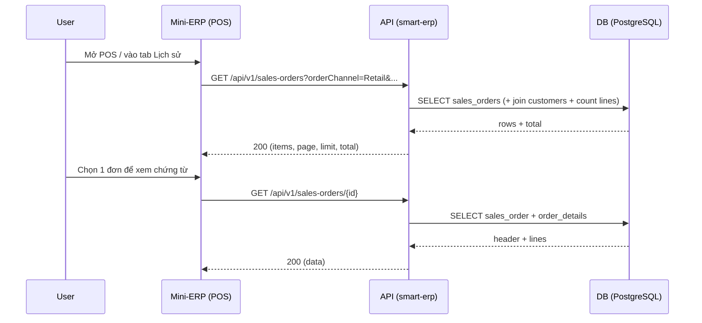

# SRS — UC9 POS bán lẻ — Lịch sử đơn đã bán & xem chứng từ đầy đủ (Retail order history + receipt/detail) — Task091

> **File (Spring / `smart-erp`):** `backend/docs/srs/SRS_Task091_uc9-retail-order-history-and-receipt-details.md`  
> **Người soạn:** Agent BA (+ SQL khi đụng DB)  
> **Ngày:** 29/04/2026  
> **Trạng thái:** `Draft`  
> **PO duyệt (khi Approved):** —, —

---

## 0. Đầu vào & traceability

| Nguồn | Đường dẫn / ghi chú |
| :--- | :--- |
| Requirement (User) | “Tại giao diện đơn bán lẻ (POS) xem lịch sử các đơn hàng đã bán; mỗi đơn hàng phải đầy đủ thông tin giấy tờ” |
| UI index | [`../../../frontend/mini-erp/src/features/FEATURES_UI_INDEX.md`](../../../frontend/mini-erp/src/features/FEATURES_UI_INDEX.md) — route `/orders/retail` |
| API list đơn | [`../../../frontend/docs/api/API_Task054_sales_orders_get_list.md`](../../../frontend/docs/api/API_Task054_sales_orders_get_list.md) — `GET /api/v1/sales-orders` (có `orderChannel=Retail`) |
| API chi tiết đơn | [`../../../frontend/docs/api/API_Task055_sales_orders_get_by_id.md`](../../../frontend/docs/api/API_Task055_sales_orders_get_by_id.md) — `GET /api/v1/sales-orders/{id}` (dùng cho Retail) |
| Checkout POS | [`../../../frontend/docs/api/API_Task060_sales_orders_retail_checkout.md`](../../../frontend/docs/api/API_Task060_sales_orders_retail_checkout.md) — tạo đơn bán lẻ một lần |
| UC / DB spec | [`../../../frontend/docs/UC/Database_Specification.md`](../../../frontend/docs/UC/Database_Specification.md) — §19 `SalesOrders`, §20 `OrderDetails` (tham chiếu) |
| Flyway thực tế | `backend/smart-erp/src/main/resources/db/migration/V*.sql` (cần đối chiếu tên bảng/cột khi triển khai/verify) |

---

## 1. Tóm tắt điều hành

- **Vấn đề:** Màn POS bán lẻ (`/orders/retail`) hiện tập trung vào thao tác checkout; người dùng cần tra cứu lại **lịch sử các đơn đã bán** để đối soát, hỗ trợ khách hàng, và xem/in lại thông tin chứng từ.
- **Mục tiêu nghiệp vụ:** Cho phép user tại POS:
  - Xem **danh sách đơn bán lẻ** theo thời gian/tra cứu.
  - Mở từng đơn để xem **chứng từ đầy đủ** (header + dòng hàng + thông tin liên quan).
- **Đối tượng / persona:** nhân viên bán hàng (Staff), quản lý cửa hàng (Admin/Owner) dùng Mini-ERP.

### 1.1 Giao diện Mini-ERP (bắt buộc khi API được gọi từ `mini-erp`)

| Nhãn menu (Sidebar) | Route | Page (export) | Component / vùng chính | File (dưới `frontend/mini-erp/src/features/`) |
| :--- | :--- | :--- | :--- | :--- |
| Đơn bán lẻ (POS) | `/orders/retail` | `RetailPage` | POS selector + giỏ hàng + (GAP) vùng lịch sử | `orders/pages/RetailPage.tsx`; (tham chiếu) `orders/components/OrderDetailDialog.tsx` |

> **GAP UI:** index hiện không có route riêng cho “Lịch sử bán lẻ”. Nếu PO muốn tách màn, cần chốt route mới (vd. `/orders/retail/history`) và cập nhật `FEATURES_UI_INDEX.md`.

---

## 2. Bóc tách nghiệp vụ (capabilities)

| # | Capability | Kích hoạt bởi | Kết quả mong đợi | Ghi chú |
| :---: | :--- | :--- | :--- | :--- |
| C1 | Xem danh sách lịch sử đơn bán lẻ | User mở màn (tab/section) “Lịch sử” từ POS hoặc route riêng | `200` + danh sách phân trang các đơn `orderChannel=Retail` | Tái sử dụng `GET /sales-orders` (Task054) nếu đủ filter |
| C2 | Tra cứu nhanh lịch sử | User nhập mã đơn / tên KH / filter | Danh sách thay đổi theo filter | Tối thiểu: `search` + phân trang; filter ngày là OQ |
| C3 | Xem chi tiết chứng từ của 1 đơn | User chọn một đơn trong lịch sử | `200` + header + `lines` + các trường “giấy tờ” cần hiển thị | Tái sử dụng `GET /sales-orders/{id}` (Task055) |
| C4 | RBAC xem lịch sử | Sau xác thực JWT | 403 khi không đủ quyền | PO chốt policy: xem mọi đơn hay chỉ đơn mình tạo/ca |
| C5 | Tính đầy đủ “giấy tờ” | Khi hiển thị chi tiết | Đủ trường bắt buộc theo định nghĩa PO | Đây là điểm phải chốt để không hiểu sai |

---

## 3. Phạm vi

### 3.1 In-scope (v1 đề xuất)

- **List lịch sử bán lẻ** dựa trên `GET /api/v1/sales-orders` với `orderChannel=Retail`.
- **Xem chứng từ đầy đủ** dựa trên `GET /api/v1/sales-orders/{id}`.
- Chuẩn hóa “đầy đủ thông tin giấy tờ” thành tập field tối thiểu (PO chốt ở §4).
- Các lỗi chuẩn: 400/401/403/404/500 theo envelope.

### 3.2 Out-of-scope (v1)

- In/print hoá đơn vật lý, xuất PDF/Excel.
- Chỉnh sửa đơn bán lẻ sau khi checkout (nếu có) — theo task khác.
- Nghiệp vụ hoàn tiền/đổi trả từ POS.

---

## 4. Câu hỏi làm rõ cho PO (Open Questions)

| ID | Câu hỏi | Ảnh hưởng nếu không trả lời | Blocker? |
| :--- | :--- | :--- | :---: |
| **OQ-1** | “Đầy đủ thông tin giấy tờ” tối thiểu gồm những field nào? (header, lines, khách, thanh toán, người bán, ca bán, voucher, VAT/invoice?) | Nếu không chốt sẽ dẫn tới UI/BE lệch kỳ vọng, thiếu field khi UAT | **Có** |
| **OQ-2** | RBAC lịch sử bán lẻ: Staff được xem **tất cả** đơn Retail hay chỉ đơn do mình tạo / theo ca (`posShiftRef`) / theo cửa hàng? | Nếu không chốt dễ lộ dữ liệu hoặc làm thiếu chức năng hỗ trợ khách | **Có** |
| **OQ-3** | Lịch sử bán lẻ nằm trong `RetailPage` (tab) hay route riêng? | Ảnh hưởng scope UI + query mặc định | Không |
| **OQ-4** | Có cần filter theo **khoảng ngày** (dateFrom/dateTo) cho lịch sử bán lẻ không? Nếu có: default window bao nhiêu ngày? | Task054 hiện chưa có filter ngày trong query spec → có thể cần CR/đổi contract | **Có** (nếu PO yêu cầu filter ngày) |
| **OQ-5** | “Đã bán” nghĩa là trạng thái nào? (Delivered? Processing? Paid?) | Nếu không chốt, list có thể chứa đơn chưa hoàn tất | Không |

**Trả lời PO (điền khi chốt):**

| ID | Quyết định PO | Ngày |
| :--- | :--- | :--- |
| OQ-1 | — | — |
| OQ-2 | — | — |
| OQ-3 | — | — |
| OQ-4 | — | — |
| OQ-5 | — | — |

---

## 5. Phân tích scope tệp & bằng chứng (Evidence scope)

### 5.1 Tài liệu đã đối chiếu (read)

- `FEATURES_UI_INDEX.md` (route POS).
- `API_Task054_sales_orders_get_list.md` (list + `orderChannel=Retail`).
- `API_Task055_sales_orders_get_by_id.md` (chi tiết + `lines`).
- `API_Task060_sales_orders_retail_checkout.md` (nguồn tạo đơn Retail).

### 5.2 Mã / migration dự kiến (write / verify)

> **Lưu ý:** phần dưới là “dự kiến” theo require; cần grep/verify thực trạng code hiện tại trước khi dev triển khai.

- Backend:
  - Verify `GET /api/v1/sales-orders` đã hỗ trợ `orderChannel=Retail` và đáp ứng RBAC policy PO chốt.
  - Verify `GET /api/v1/sales-orders/{id}` trả đủ field “giấy tờ” (PO chốt) cho Retail.
  - Nếu PO yêu cầu filter ngày/nhân viên/ca mà API chưa có → tạo CR (update API spec + code + test).
- Frontend (ngoài scope BA backend, nhưng liên quan handoff):
  - `frontend/mini-erp/src/features/orders/pages/RetailPage.tsx` — thêm section/tab “Lịch sử”.
  - Dùng lại `OrderDetailDialog` hoặc dialog riêng cho chứng từ.

### 5.3 Rủi ro phát hiện sớm

- RBAC history dễ “mở quá rộng” nếu không chốt OQ-2.
- “Giấy tờ đầy đủ” nếu gồm payment details/invoice/voucher mà DB chưa lưu → cần bổ sung schema hoặc read-model (CR).

---

## 6. Persona & RBAC

| Vai trò | Quyền / điều kiện | HTTP khi từ chối |
| :--- | :--- | :--- |
| Chưa đăng nhập | thiếu/invalid JWT | 401 |
| Staff | **[CẦN CHỐT OQ-2]** có thể xem mọi đơn Retail hoặc giới hạn theo creator/shift | 403 |
| Admin / Owner | xem lịch sử theo policy PO | 403 nếu thiếu permission (nếu áp theo `mp`) |

> **GAP policy:** Các API Task054/055 hiện mô tả RBAC chung “Owner, Staff”. Nếu PO chốt theo permission (`mp`) hoặc theo ownership/shift, cần đồng bộ lại API docs.

---

## 7. Actor & luồng nghiệp vụ

### 7.1 Danh sách actor

| Actor | Mô tả ngắn |
| :--- | :--- |
| User | Nhân viên POS / quản lý muốn tra cứu đơn đã bán |
| Client | Mini-ERP (POS) |
| API | `smart-erp` |
| DB | PostgreSQL (SalesOrders, OrderDetails, Customers, …) |

### 7.2 Luồng chính (narrative)

1. User mở POS bán lẻ.
2. User chuyển sang “Lịch sử” (tab/section) hoặc màn lịch sử bán lẻ.
3. Client gọi `GET /api/v1/sales-orders?orderChannel=Retail` (kèm filter nếu có).
4. User chọn một đơn trong danh sách.
5. Client gọi `GET /api/v1/sales-orders/{id}` để lấy chứng từ chi tiết.
6. UI hiển thị chứng từ; user có thể đóng dialog và tra cứu đơn khác.

### 7.3 Sơ đồ



---

## 8. Hợp đồng HTTP & ví dụ JSON

> **Nguyên tắc:** v1 ưu tiên **tái sử dụng** Task054/Task055. Nếu PO chốt filter ngày/ca/nhân viên mà Task054/Task055 chưa có, ghi **GAP** và tạo task/CR riêng.

### 8.A — `GET /api/v1/sales-orders` (lọc `orderChannel=Retail`) — dùng cho lịch sử bán lẻ

#### 8.A.1 Tổng quan endpoint

| Thuộc tính | Giá trị |
| :--- | :--- |
| Method + path | `GET /api/v1/sales-orders` |
| Auth | `Bearer` |
| Query bắt buộc cho POS history | `orderChannel=Retail` |

#### 8.A.2 Query — schema logic (tối thiểu v1)

| Param | Kiểu | Bắt buộc | Validation | Mô tả |
| :--- | :--- | :---: | :--- | :--- |
| `orderChannel` | string | Có | enum | `Retail` |
| `search` | string | Không | trim | Tìm theo `orderCode`/tên KH theo Task054 |
| `status` | string | Không | theo Task054 | **[CẦN CHỐT OQ-5]** “đã bán” filter trạng thái nào |
| `paymentStatus` | string | Không | theo Task054 | `Paid/Unpaid/Partial` hoặc `all` |
| `page` | int | Không | >= 1 | |
| `limit` | int | Không | 1–100 | |

> **GAP/CR (OQ-4):** nếu cần filter ngày cho POS history, Task054 cần mở rộng query `dateFrom`, `dateTo` (hoặc `createdFrom`, `createdTo`) và định nghĩa cột so sánh.

#### 8.A.3 Response 200 — ví dụ JSON (rút gọn)

```json
{
  "success": true,
  "data": {
    "items": [
      {
        "id": 88,
        "orderCode": "SO-2026-0088",
        "customerId": null,
        "customerName": "Khách lẻ",
        "totalAmount": 1500000,
        "discountAmount": 0,
        "finalAmount": 1500000,
        "status": "Delivered",
        "orderChannel": "Retail",
        "paymentStatus": "Paid",
        "itemsCount": 3,
        "notes": null,
        "createdAt": "2026-04-29T13:20:00Z",
        "updatedAt": "2026-04-29T13:20:00Z"
      }
    ],
    "page": 1,
    "limit": 20,
    "total": 1
  },
  "message": "Thành công"
}
```

#### 8.A.4 Response lỗi (mẫu)

**401**

```json
{
  "success": false,
  "error": "UNAUTHORIZED",
  "message": "Phiên đăng nhập đã hết hạn. Vui lòng đăng nhập lại."
}
```

**403**

```json
{
  "success": false,
  "error": "FORBIDDEN",
  "message": "Bạn không có quyền xem lịch sử đơn bán lẻ."
}
```

---

### 8.B — `GET /api/v1/sales-orders/{id}` — xem chứng từ đầy đủ

#### 8.B.1 Tổng quan

| Thuộc tính | Giá trị |
| :--- | :--- |
| Method + path | `GET /api/v1/sales-orders/{id}` |
| Auth | `Bearer` |

#### 8.B.2 Response 200 — ví dụ JSON (theo Task055, bổ sung yêu cầu “giấy tờ”)

```json
{
  "success": true,
  "data": {
    "id": 88,
    "orderCode": "SO-2026-0088",
    "customerId": null,
    "customerName": "Khách lẻ",
    "totalAmount": 1500000,
    "discountAmount": 0,
    "finalAmount": 1500000,
    "status": "Delivered",
    "orderChannel": "Retail",
    "paymentStatus": "Paid",
    "parentOrderId": null,
    "refSalesOrderId": null,
    "shippingAddress": null,
    "notes": null,
    "createdAt": "2026-04-29T13:20:00Z",
    "updatedAt": "2026-04-29T13:20:00Z",
    "lines": [
      {
        "id": 9001,
        "productId": 5,
        "productName": "Sữa tươi",
        "skuCode": "MLK-001",
        "unitId": 12,
        "unitName": "Hộp",
        "quantity": 3,
        "unitPrice": 500000,
        "lineTotal": 1500000,
        "dispatchedQty": 0
      }
    ]
  },
  "message": "Thành công"
}
```

> **GAP “giấy tờ”:** nếu PO yêu cầu thêm field như `cashierName`, `posShiftRef`, phương thức thanh toán chi tiết, voucher breakdown, số hoá đơn VAT… thì Task055 cần mở rộng response + bổ sung nguồn dữ liệu (DB) — chốt ở OQ-1.

#### 8.B.3 Response lỗi (mẫu)

**404**

```json
{
  "success": false,
  "error": "NOT_FOUND",
  "message": "Không tìm thấy đơn hàng."
}
```

---

## 9. Quy tắc nghiệp vụ (bảng)

| Mã | Điều kiện | Hành động / kết quả |
| :--- | :--- | :--- |
| BR-1 | Lịch sử bán lẻ | `GET /sales-orders` phải lọc `orderChannel=Retail` |
| BR-2 | “Đã bán” | **[CẦN CHỐT OQ-5]** mapping trạng thái được tính là đã bán |
| BR-3 | Chứng từ đầy đủ | **[CẦN CHỐT OQ-1]** tập field bắt buộc phải có trong `GET /sales-orders/{id}` |
| BR-4 | RBAC history | **[CẦN CHỐT OQ-2]** policy dữ liệu theo role/permission/ownership |

---

## 10. Dữ liệu & SQL tham chiếu (nháp)

> Bám Task054/055: `sales_orders` + `order_details` + join `customers`. Nếu PO chốt lọc theo ca/nhân viên, cần xác nhận có cột tương ứng (vd. `created_by`, `pos_shift_ref`) trong schema thật.

---

## 11. Acceptance Criteria (Given/When/Then)

### AC-1 — Xem danh sách lịch sử Retail

- **Given** user có quyền xem lịch sử bán lẻ  
- **When** user mở POS và vào vùng “Lịch sử”  
- **Then** hệ thống trả về danh sách đơn `orderChannel=Retail` có phân trang, hiển thị tối thiểu: `orderCode`, `createdAt`, `finalAmount`, `paymentStatus`, `customerName`.

### AC-2 — Tra cứu theo mã đơn

- **Given** đang ở lịch sử bán lẻ  
- **When** user nhập `search=SO-2026-0088`  
- **Then** danh sách chỉ hiện các đơn khớp `orderCode` (và/hoặc theo quy ước search hiện có của Task054).

### AC-3 — Xem chứng từ đầy đủ

- **Given** user đang ở lịch sử bán lẻ  
- **When** user mở chi tiết một đơn  
- **Then** hiển thị đầy đủ chứng từ: header + `lines` + các field bắt buộc theo quyết định PO (OQ-1).

### AC-4 — Không đủ quyền

- **Given** user không có quyền xem lịch sử bán lẻ  
- **When** gọi `GET /api/v1/sales-orders?orderChannel=Retail` hoặc `GET /api/v1/sales-orders/{id}`  
- **Then** trả `403 FORBIDDEN` với message chức năng.

---

## 12. GAP / giả định / ghi chú đồng bộ

- Task054/055 đang ở trạng thái Draft trong API docs; nếu backend đã triển khai khác contract, cần DOC_SYNC/PM chốt lại.
- Nếu PO bắt buộc filter ngày/ca/nhân viên cho POS history, đây là **thay đổi hợp đồng** của Task054 → cần task riêng để cập nhật `API_Task054` + SRS + code + test.
- “Giấy tờ đầy đủ” có thể đòi hỏi dữ liệu chưa được lưu ở DB (payment details, invoice no., voucher breakdown) → có thể phát sinh migration/CR.

