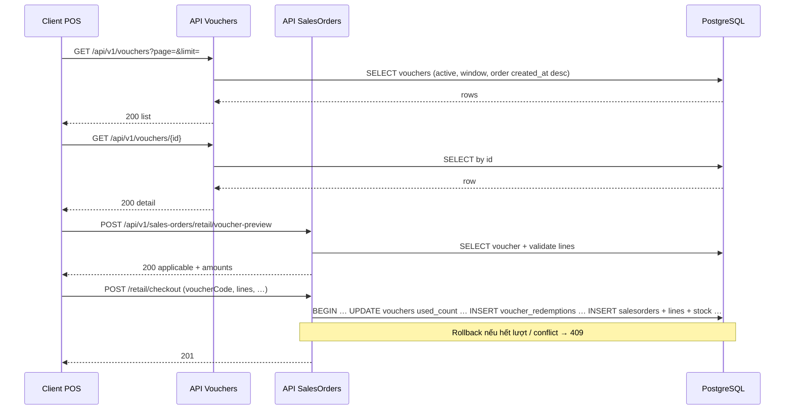

# SRS — UC9 POS / thanh toán hoá đơn lẻ — API danh sách, chi tiết & áp dụng voucher — Task092

> **File (Spring / `smart-erp`):** `backend/docs/srs/SRS_Task092_uc9-retail-voucher-preview.md`  
> **Người soạn:** Agent BA + phân tích SQL  
> **Ngày:** 30/04/2026  
> **Trạng thái:** `Approved`  
> **PO duyệt:** Owner / PO — đồng bộ theo §4.3 (30/04/2026)

---

## 0. Đầu vào & traceability

| Nguồn | Đường dẫn / ghi chú |
| :--- | :--- |
| Yêu cầu chức năng (phiên bản mới) | Owner: màn thanh toán hoá đơn lẻ — **GET danh sách voucher áp dụng được**, **GET/đánh giá chi tiết** (áp dụng + %/tiền), **cơ chế khi bấm thanh toán**; **không** SRS màn quản lý voucher (làm sau) |
| SRS nền UC9 đơn / POS / checkout | [`SRS_Task054-060_sales-orders-pos-and-retail-checkout.md`](SRS_Task054-060_sales-orders-pos-and-retail-checkout.md) — **Approved**; **OQ-3** bảng `vouchers`, áp dụng tại checkout |
| SRS trừ tồn checkout | [`SRS_Task090_uc9-retail-checkout-stock-deduction.md`](SRS_Task090_uc9-retail-checkout-stock-deduction.md) — **Approved** |
| API checkout hiện tại | [`../../../frontend/docs/api/API_Task060_sales_orders_retail_checkout.md`](../../../frontend/docs/api/API_Task060_sales_orders_retail_checkout.md) — body `voucherCode`, ghi `salesorders.voucher_id` |
| Envelope JSON | [`../../../frontend/docs/api/API_RESPONSE_ENVELOPE.md`](../../../frontend/docs/api/API_RESPONSE_ENVELOPE.md) |
| Khung API | [`../../../frontend/docs/api/API_PROJECT_DESIGN.md`](../../../frontend/docs/api/API_PROJECT_DESIGN.md) §4.10 |
| Flyway `vouchers` | [`V19`](../../smart-erp/src/main/resources/db/migration/V19__sales_uc9_vouchers_walkin_pos_shift.sql) (bảng); [`V24`](../../smart-erp/src/main/resources/db/migration/V24__task092_voucher_usage_and_redemptions.sql) (`used_count`, `max_uses`, `voucher_redemptions`) |
| Mã tham chiếu BE | `VoucherJdbcRepository`, `VoucherService`, `VouchersController`, `SalesOrderService.retailCheckout` / `retailVoucherPreview` — **Task092:** lock voucher, `used_count`, `voucher_redemptions` |
| API markdown Task092 | [`../../../frontend/docs/api/API_Task092_vouchers_and_retail_preview.md`](../../../frontend/docs/api/API_Task092_vouchers_and_retail_preview.md) |
| UI index | [`../../../frontend/mini-erp/src/features/FEATURES_UI_INDEX.md`](../../../frontend/mini-erp/src/features/FEATURES_UI_INDEX.md) — `/orders/retail`, `POSCartPanel` |
---


## 1. Tóm tắt điều hành

- **Vấn đề:** Giao diện thanh toán hoá đơn bán lẻ cần **chọn voucher từ danh sách**, **xem chi tiết** (có áp dụng cho giỏ hiện tại không, hiển thị **% hoặc số tiền** giảm), và **thanh toán** đồng bộ checkout + **lượt dùng / log** (**§4.3**). SRS này chốt **GET** catalog + **POST** preview dưới **retail** + checkout hiện có.
- **Mục tiêu nghiệp vụ:** Chuẩn hoá **hợp đồng HTTP** (đọc danh sách, đọc/đánh giá chi tiết có ngữ cảnh giỏ, và **ghi nhận áp dụng voucher** khi thanh toán) **không mâu thuẫn** với checkout Task060 / Task090; đồng bộ công thức giảm với `computeVoucherDiscount`. **Sau chốt PO (§4.3):** danh sách **mới nhất trước** (`created_at DESC`), **phân trang 5** mã/trang; preview **POST** giữ namespace **bán lẻ**; checkout **trừ lượt dùng** voucher và **ghi log** gắn đơn (**OQ-10**).
- **Đối tượng:** Nhân viên POS (`can_manage_orders` như Task060); client Mini-ERP.
- **Ngoài phạm vi SRS này:** Màn **quản trị** CRUD voucher (Owner/Admin) — **làm sau**; không mô tả UI quản lý trong file này.

### 1.1 Giao diện Mini-ERP

| Nhãn menu (Sidebar) | Route | Page (export) | Component / vùng chính | File |
| :--- | :--- | :--- | :--- | :--- |
| Đơn bán lẻ (POS) / thanh toán hoá đơn lẻ | `/orders/retail` | `RetailPage` | `POSCartPanel` — danh sách voucher, chi tiết/preview, nút thanh toán → checkout Task060 | `orders/pages/RetailPage.tsx`, `orders/components/POSCartPanel.tsx` |

---

## 2. Bóc tách nghiệp vụ (capabilities)

| # | Capability | Kích hoạt bởi | Kết quả mong đợi | Ghi chú |
| :---: | :--- | :--- | :--- | :--- |
| **C1** | Liệt kê voucher **đang có thể** dùng cho thanh toán bán lẻ | `GET` danh sách (§8.1) | `200` + danh sách (phân trang) | Tiêu chí “đang áp dụng được” = **active + trong hạn ngày** (cùng logic `findActiveByCodeIgnoreCase` về mặt ngày/active — **không** cần giỏ hàng). **Đã chốt:** sắp xếp **`created_at DESC`**, **5** bản ghi/trang (**§4.3 OQ-2**). |
| **C2** | Xem **chi tiết** một voucher + **có áp dụng được cho giỏ hiện tại không** + **số tiền / %** hiển thị | `GET` theo `id` (§8.2) + **`POST` preview** có `lines` (§8.3) | `200` với metadata + cờ `applicable` + số tiền giảm dự kiến | **Đã chốt (OQ-8A):** `GET` chỉ metadata; **POST preview** (namespace retail — **OQ-9A**) tính áp dụng + tiền. |
| **C3** | **Ghi nhận** voucher khi người dùng bấm **thanh toán** | `POST …/retail/checkout` (đã có) | `201` + `salesorders.voucher_id` | **Đã chốt (OQ-10):** trong transaction checkout — **tăng lượt đã dùng** (giới hạn `max_uses`), **ghi log** dùng voucher cho đơn; chi tiết §3.3, §10.5. |

**Ngoài phạm vi:** CRUD bảng `vouchers` trên UI (task sau).

---

## 3. Phạm vi

### 3.1 In-scope

- **GET** danh sách voucher lọc theo điều kiện thanh toán bán lẻ (§8.1) — phân trang **5**/trang, `created_at DESC`.
- **GET** chi tiết voucher theo `id` (§8.2) — tối thiểu: `code`, `name`, `discountType`, `discountValue`, `validFrom`, `validTo`, `isActive`.
- **POST** đánh giá áp dụng + số tiền trên giỏ — **`POST /api/v1/sales-orders/retail/voucher-preview`** (§8.3, **OQ-9A**).
- **Checkout:** trừ lượt dùng voucher + log sử dụng (**OQ-10**, §3.3, §10.5).
- RBAC: cùng nhóm quyền với checkout bán lẻ (**OQ-4A**).

### 3.2 Out-of-scope

- Màn hình **quản lý** voucher (tạo/sửa/xóa/seed UI).
- Thay đổi công thức tổng tiền đơn ngoài thống nhất Task060 (trừ khi mở CR riêng).

### 3.3 Phân tích codebase & SQL — “update voucher” khi bấm thanh toán

| Hiện trạng (bằng chứng) | Diễn giải |
| :--- | :--- |
| `V19__…` (baseline) | Bảng `vouchers` chưa có `used_count` / `max_uses` / bảng log — **cần Flyway mới** theo §10.5 (**PO đã chốt OQ-10**). |
| `SalesOrderService.retailCheckout` (hiện tại) | `INSERT` `salesorders` kèm `voucher_id`; tính `discount_amount`; **chưa** trừ lượt / log — **bổ sung** theo §10.5. |
| Trigger `trg_vouchers_updated` | Cập nhật `updated_at` khi **UPDATE** dòng `vouchers` (checkout trừ lượt sẽ chạm trigger). |

**Kết luận (Approved):** **Áp dụng voucher khi thanh toán** = **`POST …/retail/checkout`** (Task060 + Task090) **và** trong **cùng transaction**: (1) validate voucher còn lượt; (2) `UPDATE vouchers` tăng `used_count` (hoặc tương đương atomic); (3) **`INSERT` log** liên kết `voucher_id` + `sales_order_id`; (4) nếu hết lượt / race → **409**, rollback toàn bộ. **Không** tách API reserve (**loại C**).

| Phương án | Trạng thái |
| :--- | :--- |
| **A** — Không `UPDATE vouchers` | **Không chọn** (thay bằng B + log). |
| **B** — Trừ lượt + log đơn | **Đã chốt (OQ-10)** — Flyway + §10.5. |
| **C** — Reserve hai bước | **Không áp dụng** SRS này. |

---

## 4. Open Questions — đã chốt (PO / Owner)

> Các phương án lịch sử nằm trong git history / bản Draft. Dưới đây là **hợp đồng SRS** sau khi PO điền §4.3 (30/04/2026).

### 4.1 Tóm tắt quyết định

| ID | Quyết định (đã chốt) |
| :--- | :--- |
| **OQ-1** | **A** — Danh sách chỉ voucher **đang trong hạn** (khớp checkout). |
| **OQ-2** | **Phân trang cố định 5** mã/trang; sắp xếp **mới nhất trước** theo **`created_at DESC`** (và tie-breaker **`id DESC`** ổn định). “Xem thêm” = trang tiếp theo (`page` tăng), mỗi trang **5** bản ghi. |
| **OQ-3** | Cùng **OQ-2** — không dùng `code ASC` cho list POS. |
| **OQ-4** | **A** — RBAC giống Task060: **`can_manage_orders`**. |
| **OQ-5** | **A** — Không rate limit riêng cho list/preview (nội bộ). |
| **OQ-6** | Màn **quản lý** voucher — **out of scope** task này. |
| **OQ-7** | **A** — Checkout chỉ gửi **`voucherCode`** (Task060). |
| **OQ-8** | **A** — `GET …/{id}` metadata; **POST preview** có `lines` để `applicable` + số tiền. |
| **OQ-9** | **A** — **POST preview** giữ namespace **bán lẻ**: **`POST /api/v1/sales-orders/retail/voucher-preview`**. **GET** list + **GET** theo id vẫn dùng **`/api/v1/vouchers`** (đọc catalog voucher). |
| **OQ-10** | **Trừ lượt dùng** khi checkout thành công (`max_uses` / `used_count` hoặc tương đương) + **bảng log** (voucher + đơn hàng). Không reserve hai bước. |

### 4.2 Bổ sung BA (không blocker triển khai — đã ghi §8/§11)

| ID | Quyết định |
| :--- | :--- |
| **OQ-11** | **A** — Preview: voucher hợp lệ nhưng **không** áp dụng được giỏ → **200** + `applicable: false` + `message` ngắn (tiếng Việt). |
| **OQ-12** | **400** — Không tìm thấy / không dùng được voucher theo `voucherCode` hoặc `voucherId` trên **preview** (thống nhất hướng `retailCheckout`). `GET …/{id}` không tồn tại → **404**. |

### 4.3 PO sign-off (bảng gốc — đồng bộ ngôn nghĩa)

| ID | Quyết định PO (nguyên văn đã chuẩn hoá §4.1) | Ngày | Người xác nhận |
| :--- | :--- | :--- | :--- |
| OQ-1 | A — chỉ voucher trong hạn | 30/04/2026 | Owner / PO |
| OQ-2 | Voucher mới nhất theo `created_at`; **5** mã/trang; xem thêm **+5** | 30/04/2026 | Owner / PO |
| OQ-3 | Theo OQ-2 | 30/04/2026 | Owner / PO |
| OQ-4 | A — `can_manage_orders` | 30/04/2026 | Owner / PO |
| OQ-5 | A — không throttle | 30/04/2026 | Owner / PO |
| OQ-6 | Out of scope (task sau) | 30/04/2026 | Owner / PO |
| OQ-7 | A — `voucherCode` | 30/04/2026 | Owner / PO |
| OQ-8 | A — GET + POST preview | 30/04/2026 | Owner / PO |
| OQ-9 | A — POST preview dưới **retail** | 30/04/2026 | Owner / PO |
| OQ-10 | Giới hạn số lần dùng; **giảm lượt** khi dùng; **log** theo đơn | 30/04/2026 | Owner / PO |

---

## 5. Phân tích scope tệp & bằng chứng

### 5.1 Đã đối chiếu

- Flyway **V19** (`vouchers`, `salesorders.voucher_id`), `VoucherJdbcRepository`, `SalesOrderService.retailCheckout`, `RetailCheckoutRequest`, SRS Task054–060, Task090.

### 5.2 Dự kiến chỉnh sửa (Dev)

- Controller **`VouchersController`** (hoặc tương đương) cho **GET** `/api/v1/vouchers`, **GET** `/api/v1/vouchers/{id}`.
- Mở rộng **`SalesOrdersController`** (hoặc service retail) cho **`POST /api/v1/sales-orders/retail/voucher-preview`** (**OQ-9A**).
- `VoucherJdbcRepository`: list theo filter active + hạn + **`ORDER BY created_at DESC, id DESC`** + phân trang; `findById`.
- Service preview: tái dụng `validateLines` / `computeSubtotal` / `computeVoucherDiscount` từ `SalesOrderService` (extract nếu cần).
- **Checkout (`retailCheckout`):** Flyway **`used_count` / `max_uses`** (hoặc tên Tech Lead chốt) + bảng **`voucher_redemptions`** (hoặc tên tương đương) + `UPDATE` + `INSERT` log trong **một transaction**; xử lý **409** hết lượt.

### 5.3 Rủi ro

- Hai nguồn filter “đang áp dụng” (list GET vs validate checkout) lệch → **một hàm** `isVoucherRowCurrentlyUsable(row, today)` dùng chung.
- List lớn không `LIMIT` → full scan.

---

## 6. Persona & RBAC

| Điều kiện | Quyền | HTTP khi từ chối |
| :--- | :--- | :--- |
| JWT hợp lệ + **`can_manage_orders`** (**OQ-4**) | Gọi C1, C2, C3 (preview) + checkout | — |
| Thiếu / hết hạn JWT | — | **401** |
| Không đủ quyền | — | **403** |

---

## 7. Actor & luồng

### 7.1 Actor

| Actor | Vai trò |
| :--- | :--- |
| Nhân viên POS | Chọn voucher, xem detail/preview, thanh toán |
| Client Mini-ERP | GET list, GET detail, POST preview, POST checkout |
| API | Lọc voucher, tính giảm, tạo đơn |
| DB | `SELECT vouchers`; `INSERT salesorders` + **log**; **`UPDATE vouchers`** (trừ lượt) |

### 7.2 Narrative

1. Mở màn thanh toán → **GET** danh sách voucher đang dùng được → hiển thị picker.
2. Chọn một voucher → **GET** metadata theo `id` (tên, %/tiền, hạn).
3. **POST** **`/api/v1/sales-orders/retail/voucher-preview`** với `lines` (+ optional `discountAmount`) để hiển thị **có áp dụng được** + **số tiền giảm** / **thành tiền sau giảm** (**OQ-8A**, **OQ-9A**).
4. Bấm thanh toán → **POST** `…/retail/checkout` với **`voucherCode`** — server **validate lại**; ghi đơn; (Task090) trừ tồn; **trừ lượt voucher** + **ghi log** (**OQ-10**).

### 7.3 Sơ đồ (đã chốt)



---

## 8. Hợp đồng HTTP & ví dụ JSON (Approved)

> **Đã chốt:** **GET** list + **GET** detail → **`/api/v1/vouchers`**. **POST preview** → **`/api/v1/sales-orders/retail/voucher-preview`** (**OQ-9A**). Thanh toán → **`POST /api/v1/sales-orders/retail/checkout`** + **trừ lượt + log** (**OQ-10**).

### 8.1 — C1: `GET /api/v1/vouchers`

**Query**

| Param | Kiểu | Bắt buộc | Mô tả |
| :--- | :--- | :---: | :--- |
| `page` | int | Không | Mặc định **1** (≥ 1) |
| `limit` | int | Không | Mặc định **5**, max **50** — mỗi lần “xem thêm” tăng `page`, giữ `limit=5` (**OQ-2**) |

**200 — ví dụ**

```json
{
  "success": true,
  "data": {
    "items": [
      {
        "id": 1,
        "code": "DISCOUNT10",
        "name": "Giảm 10%",
        "discountType": "Percent",
        "discountValue": 10,
        "validFrom": null,
        "validTo": null,
        "isActive": true,
        "usedCount": 3,
        "maxUses": 100,
        "createdAt": "2026-04-28T10:00:00"
      }
    ],
    "page": 1,
    "limit": 5,
    "total": 1
  },
  "message": "Thao tác thành công"
}
```

**Lọc nghiệp vụ (BR, đồng bộ checkout):** chỉ `is_active = true` **và** `CURRENT_DATE` nằm trong `[valid_from, valid_to]` với null = không giới hạn đầu/cuối (**OQ-1**). **Sắp xếp:** `created_at DESC`, `id DESC` (**OQ-2/OQ-3**).

### 8.2 — C2a: `GET /api/v1/vouchers/{id}`

Sau Flyway **OQ-10**, response nên kèm **`usedCount`** / **`maxUses`** (nullable = không giới hạn) để UI hiển thị lượt còn lại.

**200 — ví dụ**

```json
{
  "success": true,
  "data": {
    "id": 1,
    "code": "DISCOUNT10",
    "name": "Giảm 10%",
    "discountType": "Percent",
    "discountValue": 10,
    "validFrom": null,
    "validTo": null,
    "isActive": true,
    "usedCount": 3,
    "maxUses": 100
  },
  "message": "Thao tác thành công"
}
```

**404** nếu `id` không tồn tại — envelope chuẩn.

### 8.3 — C2b: `POST /api/v1/sales-orders/retail/voucher-preview` (áp dụng cho giỏ + số tiền)

| Field | Kiểu | Bắt buộc | Ghi chú |
| :--- | :--- | :---: | :--- |
| `voucherId` | int | Điều kiện | Một trong `voucherId` **hoặc** `voucherCode` |
| `voucherCode` | string | Điều kiện | Trim, max 50 |
| `lines` | array | Có | Giống Task060 |
| `discountAmount` | decimal | Không | Mặc định 0 (đồng bộ Task060 checkout) |

**200 — ví dụ** (cùng công thức thanh toán Task060; thêm `applicable`)

```json
{
  "success": true,
  "data": {
    "applicable": true,
    "voucherId": 1,
    "voucherCode": "DISCOUNT10",
    "voucherName": "Giảm 10%",
    "discountType": "Percent",
    "discountValue": 10,
    "subtotal": 24000,
    "manualDiscountAmount": 5000,
    "voucherDiscountAmount": 2400,
    "totalDiscountAmount": 7400,
    "payableAmount": 16600
  },
  "message": "Thao tác thành công"
}
```

- **400** — `lines` / catalog không hợp lệ; mã voucher không tồn tại / không trong hạn (**OQ-12**).
- **200** + `applicable: false` — voucher tồn tại và còn hạn nhưng **không áp dụng được** giỏ (điều kiện nghiệp vụ sau này); kèm `message` ngắn (**OQ-11**).

### 8.4 — C3: Thanh toán + trừ lượt + log (**OQ-10**)

- Client gọi **`POST /api/v1/sales-orders/retail/checkout`** như Task060 với `voucherCode` trùng mã đã preview (server validate lại).
- Trong **cùng transaction** với tạo đơn: **atomic** tăng `used_count` (hoặc tương đương) nếu `used_count < max_uses` (hoặc `max_uses IS NULL` = không giới hạn); **INSERT** dòng **log** (`voucher_id`, `sales_order_id`, timestamp); nếu không đủ lượt → **409**, không ghi đơn.
- **Không** bắt buộc `PATCH /api/v1/vouchers/{id}` riêng.

### 8.5 Lỗi (mẫu rút gọn)

- **400** `BAD_REQUEST` — validation; voucher không tìm thấy / không dùng được (preview + checkout).
- **401** / **403** — như envelope chuẩn.
- **404** — `GET /api/v1/vouchers/{id}` không có bản ghi.
- **409** — hết lượt dùng voucher / xung đột cập nhật lượt (**OQ-10**).
- **500** — lỗi không lường trước.

### 8.6 Ghi chú

- **OQ-11 / OQ-12** đã chốt tại §4.2.

---

## 9. Quy tắc nghiệp vụ

| Mã | Điều kiện | Kết quả |
| :--- | :--- | :--- |
| BR-1 | Voucher không thỏa active + ngày | Không xuất hiện trong **GET list** (**OQ-1**); preview/checkout (mã không hợp lệ) → **400** |
| BR-2 | Công thức giảm | Cùng `computeVoucherDiscount` + cap tổng giảm ≤ subtotal như checkout |
| BR-3 | Preview thành công | Checkout vẫn phải validate lại (giá, tồn Task090, voucher, **lượt còn**) |
| BR-4 | **OQ-10** | `UPDATE vouchers` + `INSERT` log **cùng transaction** với tạo đơn; thất bại (hết lượt) → **409**, rollback |

---

## 10. Dữ liệu & SQL tham chiếu (Agent SQL)

### 10.1 Bảng

| Bảng | Read / Write | Ghi chú |
| :--- | :--- | :--- |
| `vouchers` | Read (C1, C2, preview); **Write** tại checkout (**OQ-10**) | V19 + **Flyway mới:** `used_count`, `max_uses` (nullable = không giới hạn) — tên cột do Tech Lead chốt trong migration |
| **`voucher_redemptions`** (hoặc tên tương đương) | **Write** tại checkout | **Flyway mới:** `id`, `voucher_id` FK, `sales_order_id` FK, `created_at` — một dòng mỗi lần áp dụng thành công trên đơn |
| `salesorders` | Write tại checkout | `voucher_id` đã có (V19) |
| `productunits`, `products` | Read | Validate `lines` khi preview |

### 10.2 SELECT danh sách (PostgreSQL — tham chiếu)

```sql
SELECT id, code, name, discount_type, discount_value, is_active, valid_from, valid_to,
       created_at
FROM vouchers
WHERE is_active = TRUE
  AND (valid_from IS NULL OR valid_from <= CURRENT_DATE)
  AND (valid_to IS NULL OR valid_to >= CURRENT_DATE)
ORDER BY created_at DESC, id DESC
LIMIT :limit OFFSET :offset;
```

```sql
SELECT COUNT(*) FROM vouchers
WHERE is_active = TRUE
  AND (valid_from IS NULL OR valid_from <= CURRENT_DATE)
  AND (valid_to IS NULL OR valid_to >= CURRENT_DATE);
```

### 10.3 SELECT theo id

```sql
SELECT id, code, name, discount_type, discount_value, is_active, valid_from, valid_to,
       used_count, max_uses, created_at
FROM vouchers
WHERE id = :id
LIMIT 1;
```

### 10.4 Index (đề xuất)

- List POS: index phục vụ **`ORDER BY created_at DESC, id DESC`** với filter active + cửa sổ ngày — ví dụ composite `(is_active, valid_from, valid_to, created_at DESC)` hoặc partial theo `is_active = TRUE` — **Tech Lead** xác nhận sau `EXPLAIN`.
- Log: index `voucher_redemptions(voucher_id)`, `voucher_redemptions(sales_order_id)`.

### 10.5 Transaction checkout (**OQ-10** — bắt buộc triển khai)

- Trong `@Transactional` của `retailCheckout` (sau khi validate voucher + tồn + giá):
  1. `UPDATE vouchers SET used_count = used_count + 1 WHERE id = :vid AND (max_uses IS NULL OR used_count < max_uses)` (hoặc `UPDATE … WHERE … RETURNING`); nếu **0 dòng** → **409**, rollback toàn bộ.
  2. `INSERT INTO voucher_redemptions (voucher_id, sales_order_id, …) VALUES (…)` sau khi đã có `sales_order_id` (hoặc thứ tự: insert order trước rồi log — **một transaction**).
  3. Khuyến nghị khóa lạc quan: `SELECT id FROM vouchers WHERE id = :vid FOR UPDATE` trước bước (1) nếu tải đồng thời cao.
  4. Thứ tự `INSERT salesorders` / `INSERT` log / `UPDATE` lượt do Tech Lead khớp code `retailCheckout` hiện có, **miễn** toàn bộ nằm trong **một transaction** và **409** rollback hết.

---

## 11. Acceptance criteria (rút gọn)

```text
Given có ít nhất một voucher active trong hạn với created_at khác nhau
When GET /api/v1/vouchers?page=1&limit=5
Then 200, limit=5, items sắp created_at giảm dần, không có voucher inactive / ngoài hạn
```

```text
Given voucher id tồn tại
When GET /api/v1/vouchers/{id}
Then 200 và body khớp bản ghi DB
```

```text
Given giỏ lines hợp lệ và voucher hợp lệ
When POST /api/v1/sales-orders/retail/voucher-preview với voucherId và lines
Then 200, applicable=true, payableAmount khớp công thức checkout
```

```text
Given voucher không áp dụng được giỏ (điều kiện nghiệp vụ sau này)
When POST /api/v1/sales-orders/retail/voucher-preview
Then 200, applicable=false, message tiếng Việt (OQ-11)
```

```text
Given đã preview thành công và voucher còn lượt
When POST retail/checkout với cùng voucherCode và lines
Then 201, salesorders.voucher_id khác null, có bản ghi voucher_redemptions, used_count tăng 1 (OQ-10)
```

```text
Given voucher đã hết lượt
When POST retail/checkout với voucherCode đó
Then 409 (hoặc 400 theo envelope chuẩn dự án), không tạo đơn
```

---

## 12. GAP & giả định

| GAP | Hành động |
| :--- | :--- |
| ~~Chưa có `API_Task092` + catalog~~ | Đã bổ sung `API_Task092_vouchers_and_retail_preview.md` + `API_PROJECT_DESIGN.md` §4.10 |
| ~~Chưa có Flyway lượt dùng~~ | **V24** — kiểm tra `mvn flyway:migrate` trên môi trường |

---

## 13. PO sign-off

- **SRS:** `SRS_Task092_uc9-retail-voucher-preview.md` — **Approved** (30/04/2026).
- **Nội dung chốt:** §4.1–§4.3 (OQ-1…OQ-10) + §4.2 (OQ-11/OQ-12 do BA chuẩn hoá đồng bộ §8).
- **Ký xác nhận:** Owner / PO (theo quy trình dự án).

---

## Phụ lục — OQ-11 / OQ-12

Đã gộp vào **§4.2** (không còn mở).

---

**Brittle zones:** Đồng bộ filter list vs checkout; **race** khi hai POS cùng trừ lượt (**§10.5**).  
**Risks:** Lộ mã marketing qua GET list — đã giảm nhờ **RBAC** (**OQ-4**); không throttle (**OQ-5**).
