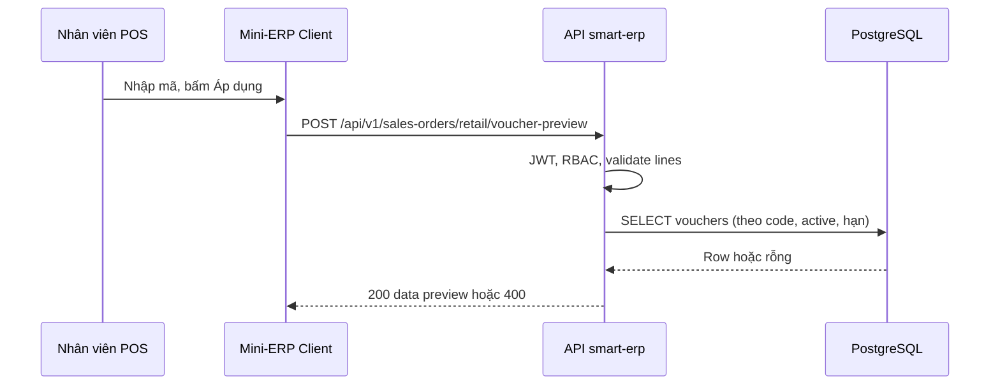

# SRS — UC9 POS — API xem trước / kiểm tra voucher trước checkout bán lẻ — Task092

> **File (Spring / `smart-erp`):** `backend/docs/srs/SRS_Task092_uc9-retail-voucher-preview.md`  
> **Người soạn:** Agent BA (Draft)  
> **Ngày:** 30/04/2026  
> **Trạng thái:** `Draft`  
> **PO duyệt (khi Approved):** *(chưa)*

---

## 0. Đầu vào & traceability

| Nguồn | Đường dẫn / ghi chú |
| :--- | :--- |
| SRS nền UC9 đơn / POS / checkout | [`SRS_Task054-060_sales-orders-pos-and-retail-checkout.md`](SRS_Task054-060_sales-orders-pos-and-retail-checkout.md) — **Approved**; **OQ-3** bảng `vouchers`, áp dụng tại checkout |
| SRS trừ tồn checkout | [`SRS_Task090_uc9-retail-checkout-stock-deduction.md`](SRS_Task090_uc9-retail-checkout-stock-deduction.md) — **Approved**; không đổi công thức voucher |
| API checkout hiện tại | [`../../../frontend/docs/api/API_Task060_sales_orders_retail_checkout.md`](../../../frontend/docs/api/API_Task060_sales_orders_retail_checkout.md) — body `lines`, `discountAmount`, `voucherCode` |
| Envelope JSON | [`../../../frontend/docs/api/API_RESPONSE_ENVELOPE.md`](../../../frontend/docs/api/API_RESPONSE_ENVELOPE.md) |
| Khung API | [`../../../frontend/docs/api/API_PROJECT_DESIGN.md`](../../../frontend/docs/api/API_PROJECT_DESIGN.md) §4.10 |
| Flyway `vouchers` + cột `salesorders.voucher_id` | [`../../smart-erp/src/main/resources/db/migration/V19__sales_uc9_vouchers_walkin_pos_shift.sql`](../../smart-erp/src/main/resources/db/migration/V19__sales_uc9_vouchers_walkin_pos_shift.sql) |
| UI index | [`../../../frontend/mini-erp/src/features/FEATURES_UI_INDEX.md`](../../../frontend/mini-erp/src/features/FEATURES_UI_INDEX.md) — nhóm orders / retail |
| API markdown Task092 | **GAP:** sau khi PO Approved — tạo `frontend/docs/api/API_Task092_sales_orders_retail_voucher_preview.md` (hoặc tên thống nhất PM) và cập nhật `API_PROJECT_DESIGN.md` |

---

## 1. Tóm tắt điều hành

- **Vấn đề:** Màn POS bán lẻ đã gọi `POST …/retail/checkout` với `voucherCode`, nhưng **không** có API tách riêng để kiểm tra mã hoặc **xem trước** số tiền giảm trước khi thanh toán. Người dù
ng chỉ biết mã lỗi khi checkout thất bại (**400**).
- **Mục tiêu nghiệp vụ:** Cung cấp **một endpoint đọc** (không tạo đơn, không trừ tồn) để client gọi khi nhấn «Áp dụng» (hoặc tương đương) trên giỏ POS, trả về thông tin voucher hợp lệ và **các số tiền** tính **cùng công thức** với `retailCheckout` (SRS Task054–060 / mã `SalesOrderService`).
- **Đối tượng:** Nhân viên có quyền bán lẻ (cùng chính sách với Task060); client Mini-ERP.

### 1.1 Giao diện Mini-ERP

> Nhãn menu theo [`Sidebar.tsx`](../../../frontend/mini-erp/src/components/shared/layout/Sidebar.tsx) — nhóm «Đơn hàng».

| Nhãn menu (Sidebar) | Route | Page (export) | Component / vùng chính | File (dưới `frontend/mini-erp/src/features/`) |
| :--- | :--- | :--- | :--- | :--- |
| Đơn bán lẻ (POS) | `/orders/retail` | `RetailPage` | `POSCartPanel` — ô «Mã voucher», nút áp dụng; sau triển khai: gọi **Task092** rồi hiển thị preview / lỗi | `orders/pages/RetailPage.tsx`, `orders/components/POSCartPanel.tsx` |

---

## 2. Bóc tách nghiệp vụ (capabilities)

| # | Capability | Kích hoạt bởi | Kết quả mong đợi | Ghi chú |
| :---: | :--- | :--- | :--- | :--- |
| C1 | Xem trước voucher trên giỏ hiện tại | `POST` endpoint §8.1 | `200` + `data` có breakdown tiền (§8.4) | **Không** `INSERT salesorders`; **không** trừ tồn (Task090) |
| C2 | Từ chối mã không hợp lệ | Cùng endpoint khi mã sai / hết hạn / inactive | `400` + message nghiệp vụ (§8.5) | Giống ngữ nghĩa lỗi voucher tại checkout |
| C3 | Từ chối giỏ không hợp lệ | `lines` rỗng hoặc validation giống checkout dòng hàng | `400` | Reuse rule `validateLines` / `computeSubtotal` (§5.2) |

**Ngoài phạm vi SRS này (tuỳ OQ-6):** CRUD danh sách voucher trên UI Owner/Admin; `GET` công khai danh sách mã.

---

## 3. Phạm vi

### 3.1 In-scope

- Một endpoint **POST** (đề xuất baseline — **OQ-3** cho phép đổi path/method sau khi PO chốt) nhận **`voucherCode`** + **`lines[]`** (+ optional **`discountAmount`**) và trả preview **khớp** checkout về: subtotal, giảm voucher, giảm tay, tổng giảm (cap), số phải thu.
- RBAC **cùng** checkout bán lẻ: JWT + quyền quản lý đơn (`can_manage_orders` — thống nhất Task060; nếu dự án đổi claim → cập nhật §6 + API doc).
- Đọc bảng **`vouchers`** (đã có Flyway **V19**); không migration mới **trừ khi** OQ mở thêm cột (ghi GAP).

### 3.2 Out-of-scope

- Tạo / sửa / xóa bản ghi `vouchers` (trừ khi PO chọn **OQ-6B** — tách SRS / task khác).
- Thay đổi body hoặc semantics **`POST …/retail/checkout`** (Task060).
- Kiểm tra tồn kho tại bước preview (vẫn chỉ ở checkout Task090).

---

## 4. Câu hỏi làm rõ cho PO (Open Questions)

> BA không chốt thay PO. **§8** mô tả **baseline** (hàng **Đề xuất SRS**). Nếu PO chọn phương án khác — Dev/API doc điều chỉnh cho khớp quyết định.

### 4.1 Bảng OQ + phương án

| ID | Câu hỏi | Phương án | Ghi chú ngắn |
| :--- | :--- | :--- | :--- |
| **OQ-1** | Mức độ thông tin trả về? | **A** — Chỉ `valid: true/false` + `message` (không số tiền). **B** — Đủ breakdown như §8.4 (preview tiền). **C** — Chỉ metadata voucher (`name`, `discountType`, `discountValue`) để **client tự nhân** — *không khuyến nghị* (hai nguồn tính). | Đề xuất SRS: **B**. |
| **OQ-2** | Đầu vào tính subtotal? | **A** — Client gửi một trường `subtotal` (đơn giản, dễ lệch giỏ). **B** — Client gửi **`lines[]` giống Task060**; server tính subtotal — *khớp checkout*. | Đề xuất SRS: **B** (baseline §8). |
| **OQ-3** | Method + URL? | **A** — `GET …/vouchers/preview?code=&subtotal=` (chỉ hợp nếu OQ-2A). **B** — `POST /api/v1/sales-orders/retail/voucher-preview` (gắn ngữ cảnh retail). **C** — `POST /api/v1/vouchers/preview` (module voucher trung tính). | Đề xuất SRS: **B**. |
| **OQ-4** | RBAC? | **A** — Giống Task060 (`can_manage_orders`). **B** — Mọi user đăng nhập. **C** — Chỉ Owner/Admin. | Đề xuất SRS: **A**. |
| **OQ-5** | Giới hạn tần suất gọi? | **A** — Không throttle. **B** — Throttle (SRS NFR; ví dụ **429** + `TOO_MANY_REQUESTS`). | Đề xuất SRS: **A** v1; **B** nếu lo brute-force mã. |
| **OQ-6** | Quản lý danh mục voucher? | **A** — Không (seed/SQL như hiện tại). **B** — SRS/task sau: CRUD Owner/Admin. **C** — Chỉ `GET` list read-only. | Không blocker cho C1–C3. |
| **OQ-7** | Preview có gửi `discountAmount` tay không? | **A** — Có (optional); response trả `totalDiscountAmount` / `payableAmount` giống checkout (tổng giảm = tay + voucher, cap subtotal). **B** — Không; preview **chỉ** phần voucher; UI tự cộng tay. | Đề xuất SRS: **A** để một nguồn sự thật với server. |

### 4.2 Blocker

| ID | Mô tả |
| :--- | :--- |
| **OQ-3** | Nếu PO đổi path hoặc method so **§8.1** → cập nhật §8 toàn bộ + file `API_Task092` + `API_PROJECT_DESIGN.md` trước khi coi SRS đồng bộ triển khai. |

### 4.3 Trả lời PO (điền khi chốt)

| ID | Quyết định PO | Ngày |
| :--- | :--- | :--- |
| OQ-1 | | |
| OQ-2 | | |
| OQ-3 | | |
| OQ-4 | | |
| OQ-5 | | |
| OQ-6 | | |
| OQ-7 | | |

---

## 5. Phân tích scope tệp & bằng chứng (Evidence scope)

### 5.1 Tài liệu đã đối chiếu (read)

- `SRS_Task054-060`, `API_Task060`, `API_RESPONSE_ENVELOPE`, `FEATURES_UI_INDEX`, Flyway **V19**, mã tham chiếu `SalesOrderService.retailCheckout`, `VoucherJdbcRepository.findActiveByCodeIgnoreCase`, `computeVoucherDiscount` (logic tính voucher).

### 5.2 Mã / migration dự kiến (write / verify)

- **BE:** `SalesOrdersController` (mapping mới) hoặc controller con; `SalesOrderService` (method `previewRetailVoucher` hoặc tách `VoucherPreviewService`) — **reuse** validation dòng hàng + `computeSubtotal` + lookup voucher + `computeVoucherDiscount` để tránh lệch công thức.
- **FE:** `salesOrdersApi.ts` — hàm `postRetailVoucherPreview`; `POSCartPanel.tsx` — gọi API khi áp mã; hiển thị lỗi / breakdown.
- **Test:** WebMvcTest / slice test 400/200; có thể tái dụng fixture seed `DISCOUNT10` từ V19.

### 5.3 Rủi ro phát hiện sớm

- Hai nhánh tính voucher (checkout vs preview) nếu copy-paste → lệch số; **mitigation:** một hàm dùng chung (package `sales` util hoặc method `protected`/`package` — Tech Lead chọn).
- Preview **không** thay thế xác nhận cuối lúc checkout: giá/ tồn vẫn có thể đổi giữa hai request → SRS **BR-4**.

---

## 6. Persona & RBAC

| Vai trò / điều kiện | Quyền | HTTP khi từ chối |
| :--- | :--- | :--- |
| Đã đăng nhập, JWT hợp lệ, **`can_manage_orders: true`** (cùng policy Task060) | Gọi endpoint preview | — |
| Thiếu / hết hạn JWT | Không | **401** `UNAUTHORIZED` |
| JWT hợp lệ nhưng không đủ quyền | Không | **403** `FORBIDDEN` |

---

## 7. Actor & luồng nghiệp vụ

### 7.1 Danh sách actor

| Actor | Mô tả |
| :--- | :--- |
| Nhân viên POS | Nhập mã voucher, xem preview trên giỏ |
| Client Mini-ERP | Gửi `POST` JSON |
| API `smart-erp` | Validate, tra `vouchers`, tính tiền |
| PostgreSQL | `SELECT` `vouchers` (và validation dòng hàng qua bảng catalog hiện có) |

### 7.2 Luồng chính (narrative)

1. Nhân viên có giỏ `lines` trên POS; nhập `voucherCode` và nhấn áp dụng.
2. Client gửi `POST` kèm `lines` + `voucherCode` (+ optional `discountAmount`).
3. API xác thực JWT + RBAC; validate `lines`; tính `subtotal`.
4. API tra voucher theo mã (active, hạn) — **cùng** logic `findActiveByCodeIgnoreCase`.
5. API tính `voucherDiscount`, cộng `manualDiscount`, cap; trả JSON **200** (§8.4).
6. Nếu mã không hợp lệ → **400** với message người dùng đọc được (không lộ stack/SQL).

### 7.3 Sơ đồ



---

## 8. Hợp đồng HTTP & ví dụ JSON

### 8.1 Tổng quan endpoint (baseline — chờ OQ-3)

| Thuộc tính | Giá trị |
| :--- | :--- |
| Method + path | `POST /api/v1/sales-orders/retail/voucher-preview` |
| Auth | Bearer JWT |
| Content-Type | `application/json` |

### 8.2 Request — schema logic (field-level)

| Field | Vị trí | Kiểu | Bắt buộc | Validation | Ghi chú |
| :--- | :--- | :--- | :---: | :--- | :--- |
| `voucherCode` | body | string | Có | trim, độ dài tối đa **50** (khớp `RetailCheckoutRequest`) | Không cho rỗng / chỉ khoảng trắng |
| `lines` | body | array | Có | Giống Task060: mỗi phần tử `productId`, `unitId`, `quantity`, `unitPrice`; `quantity` > 0; đơn vị thuộc sản phẩm | Cùng rule `validateLines` như checkout |
| `discountAmount` | body | number (decimal) | Không | ≥ 0, ≤ `subtotal` sau khi tính từ `lines` | Mặc định **0**; **OQ-7** nếu PO chọn B thì bỏ field khỏi contract |

### 8.3 Request — ví dụ JSON đầy đủ

```json
{
  "voucherCode": "DISCOUNT10",
  "discountAmount": 5000,
  "lines": [
    {
      "productId": 12,
      "unitId": 101,
      "quantity": 2,
      "unitPrice": 6000
    }
  ]
}
```

### 8.4 Response thành công — ví dụ JSON đầy đủ (`200`)

**Quy tắc số (bắt buộc khớp checkout):**

- `subtotal` = Σ (`quantity` × `unitPrice`).
- `voucherDiscountAmount` = hàm tương đương `computeVoucherDiscount(subtotal, voucherRow)` — `Percent` làm tròn **2 chữ số** HALF_UP; `FixedAmount` = min(value, subtotal), không âm.
- `manualDiscountAmount` = `discountAmount` từ request (hoặc 0).
- `totalDiscountAmount` = min(`manualDiscountAmount` + `voucherDiscountAmount`, `subtotal`).
- `payableAmount` = `subtotal` − `totalDiscountAmount`.

*Ví dụ:* `subtotal` = 24000, `discountAmount` = 5000, voucher 10% → `voucherDiscountAmount` = 2400; `totalDiscountAmount` = min(7400, 24000) = 7400; `payableAmount` = 16600.

```json
{
  "success": true,
  "data": {
    "voucherId": 1,
    "voucherCode": "DISCOUNT10",
    "voucherName": "Giảm 10%",
    "discountType": "Percent",
    "discountValue": 10,
    "subtotal": 24000,
    "manualDiscountAmount": 5000,
    "voucherDiscountAmount": 2400,
    "totalDiscountAmount": 7400,
    "payableAmount": 16600
  },
  "message": "Thao tác thành công"
}
```

### 8.5 Response lỗi — ví dụ JSON đầy đủ

**400 — `BAD_REQUEST` (mã voucher không hợp lệ)**

```json
{
  "success": false,
  "error": "BAD_REQUEST",
  "message": "Mã giảm giá không hợp lệ hoặc đã hết hiệu lực.",
  "details": {}
}
```

**400 — `BAD_REQUEST` (lines rỗng / validation)**

```json
{
  "success": false,
  "error": "BAD_REQUEST",
  "message": "Thông tin không hợp lệ: kiểm tra lại giỏ hàng và số lượng.",
  "details": {
    "lines": "Danh sách dòng hàng không được rỗng"
  }
}
```

**401 — `UNAUTHORIZED`**

```json
{
  "success": false,
  "error": "UNAUTHORIZED",
  "message": "Phiên đăng nhập đã hết hạn. Vui lòng đăng nhập lại.",
  "details": {}
}
```

**403 — `FORBIDDEN`**

```json
{
  "success": false,
  "error": "FORBIDDEN",
  "message": "Bạn không có quyền thực hiện thao tác này.",
  "details": {}
}
```

**429 — `TOO_MANY_REQUESTS`** *(chỉ khi PO chọn **OQ-5B**)*

```json
{
  "success": false,
  "error": "TOO_MANY_REQUESTS",
  "message": "Bạn thao tác quá nhanh. Vui lòng thử lại sau ít phút.",
  "details": {}
}
```

**500 — `INTERNAL_SERVER_ERROR`**

```json
{
  "success": false,
  "error": "INTERNAL_SERVER_ERROR",
  "message": "Không thể hoàn tất thao tác. Vui lòng thử lại hoặc liên hệ quản trị.",
  "details": {}
}
```

### 8.6 Ghi chú envelope

- Bám [`API_RESPONSE_ENVELOPE.md`](../../../frontend/docs/api/API_RESPONSE_ENVELOPE.md). **`404`** không dùng cho «mã voucher sai» — dùng **400** (nghiệp vụ validation) để thống nhất với checkout hiện tại.

---

## 9. Quy tắc nghiệp vụ (bảng)

| Mã | Điều kiện | Hành động / kết quả |
| :--- | :--- | :--- |
| BR-1 | `voucherCode` không tìm thấy bản ghi **active** trong hạn | **400**, message chức năng (§8.5) |
| BR-2 | `discountAmount` < 0 hoặc > `subtotal` | **400** |
| BR-3 | `lines` không thỏa rule đơn vị / sản phẩm như checkout | **400** (cùng family message với Task060 khi có thể) |
| BR-4 | Preview thành công | **Không** cam kết checkout sau đó vẫn **201** — giá/tồn/voucher có thể thay đổi; client vẫn phải xử lý lỗi checkout |

---

## 10. Dữ liệu & SQL tham chiếu (phối hợp Agent SQL)

### 10.1 Bảng / quan hệ (tên Flyway thực tế)

| Bảng | Read / Write | Ghi chú |
| :--- | :--- | :--- |
| `vouchers` | **Read** | Lookup theo `code` (case-insensitive), `is_active`, `valid_from`, `valid_to` — logic hiện có trong `VoucherJdbcRepository` |
| `productunits`, `products` | **Read** | Chỉ phục vụ validation `lines` (giống checkout) |

### 10.2 SQL / ranh giới transaction

- **Chỉ đọc**; không bắt buộc transaction dài; có thể dùng một query voucher + các query tồn tại validate line.
- Tham chiếu seed / từ chối: [`../../AGENTS/SQL_AGENT_INSTRUCTIONS.md`](../../AGENTS/SQL_AGENT_INSTRUCTIONS.md) mục seed `vouchers` nếu Tester cần.

### 10.3 Index

- Đã có index/policy theo V19; không bắt buộc migration mới cho preview.

### 10.4 Kiểm chứng dữ liệu cho Tester

- Given seed `DISCOUNT10` active, When preview với `lines` subtotal 100000, Then `voucherDiscountAmount` = 10000 (Percent 10), `payableAmount` = 90000 (không có tay).

---

## 11. Acceptance criteria (Given / When / Then)

```text
Given nhân viên đã đăng nhập và có can_manage_orders
And giỏ có ít nhất một dòng hợp lệ
When POST preview với voucherCode hợp lệ và discountAmount = 0
Then 200 và voucherDiscountAmount + payableAmount khớp công thức §8.4
```

```text
Given cùng điều kiện
When POST preview với voucherCode không tồn tại
Then 400 và message không tiết lộ chi tiết kỹ thuật server
```

```text
Given JWT hợp lệ nhưng không có quyền quản lý đơn
When POST preview
Then 403 FORBIDDEN
```

```text
Given không gửi Authorization
When POST preview
Then 401 UNAUTHORIZED
```

```text
Given lines rỗng
When POST preview
Then 400 BAD_REQUEST
```

---

## 12. GAP & giả định

| GAP / Giả định | Tác động | Hành động đề xuất |
| :--- | :--- | :--- |
| Chưa có `API_Task092_*.md` | FE / API_BRIDGE chưa có hợp đồng chính thức | Sau Approved: thêm file API + mục trong `API_PROJECT_DESIGN.md` |
| `401` từ filter Spring có thể chưa envelope | UI có thể parse lỗi khác | Theo roadmap Security — ngoài scope Task092 trừ khi Owner gộp |
| OQ-1A (chỉ valid bit) | §8.4 phải rút gọn | PO chọn A → sửa §2, §8.4, §11 |

---

## 13. PO sign-off (chỉ điền khi Approved)

- [ ] Đã trả lời / đóng các **OQ blocker** (OQ-3 nếu đổi URL/method)
- [ ] JSON request/response khớp ý đồ sản phẩm
- [ ] Phạm vi In/Out đã đồng ý

**Chữ ký / nhãn PR:** *(chưa)*

---

**Brittle zones:** 1) Đồng bộ công thức voucher với `retailCheckout`. 2) Client bỏ qua preview vẫn có thể checkout — hành vi hợp lệ.

**Risks:** Brute-force mã voucher nếu không throttle (**OQ-5**).
