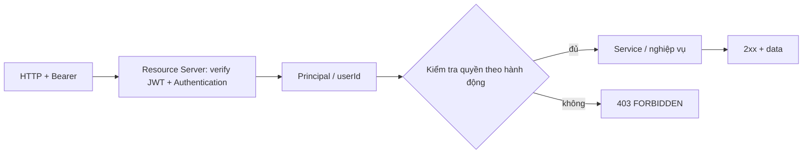

# SRS — Kiểm tra Role/Permission mỗi request API (Task101_1)

> **File**: `backend/docs/srs/SRS_Task101_1_api-permission-per-request.md`  
> **Người viết**: Agent BA (Draft)  
> **Ngày cập nhật**: 25/04/2026 (bổ sung **§5.1** hướng xử lý thiếu quyền)  
> **Trạng thái**: Approved

**Traceability**

- Nguồn nghiệp vụ: [`SRS_Task101_role-based-side-menu-visibility.md`](./SRS_Task101_role-based-side-menu-visibility.md) — mục **7.1** (mỗi request BE kiểm tra Role/Permission; tách Task101_1) và **§10** bảng quyết định #1.  
- Code hiện tại:  
  - Cấp security: `JwtResourceServerWebSecurityConfiguration` — `anyRequest().authenticated()` khi `app.security.api-protection=jwt-api` (chỉ xác thực JWT, **chưa** phân quyền theo từng tính năng tại tầng filter mặc định).  
  - Mẫu kiểm tra từng dịch vụ: `RolePermissionReader` + `UserCreationService` / `NextStaffCodeService` (quyền tạo/quản lý nhân viên tương ứng `can_manage_staff`).  
- Envelope lỗi: `ApiErrorCode.FORBIDDEN` — [`ApiErrorCode.java`](../../smart-erp/src/main/java/com/example/smart_erp/common/api/ApiErrorCode.java) / [`API_RESPONSE_ENVELOPE.md`](../../../frontend/docs/api/API_RESPONSE_ENVELOPE.md).

---

## 1. Tóm tắt

- **Vấn đề**: Sau Task101, client có claim **`mp`** trong access JWT để vẽ menu; tầng bảo mật hiện chỉ đảm bảo **đã đăng nhập** (Bearer hợp lệ), không đảm bảo user có **quyền nghiệp vụ** cho từng endpoint. Tin tưởng UI/`mp` trên client là **không đủ** (SRS Task101).  
- **Mục tiêu (Task101_1)**: Chuẩn hóa **bắt buộc** kiểm tra **Role và/hoặc boolean trong `Roles.permissions` (DB)** tương ứng với từng hành động API được bảo vệ; từ chối bằng **403** + mã/field lỗi theo hợp đồng dự án, trừ endpoint được liệt kê **public** hoặc **chỉ cần authenticated mà không gắn quyền bổ sung** (nếu có — **[CẦN CHỐT]** từng URL).  
- **Đối tượng**: Tất cả user gọi API bảo vệ JWT; hệ thống single-tenant/đơn cửa hàng theo bối cảnh đồ án (không mở rộng multi-tenant nếu chưa có trong tài liệu).

---

## 2. Phạm vi

### 2.1 In-scope

- **Nguyên tắc bảo mật**: mọi thao tác cần quyền phải **kiểm tra ở server** trước khi thực thi nghiệp vụ; không dùng claim `mp` hoặc `role` thuần từ JWT làm bằng chứng **duy nhất** mà **không** đối chiếu nguồn dữ liệu đã thống nhất (mục 4).  
- **Bản đồ gán** (cần bảo trì theo từng task API): endpoint / nhóm hành động → **một** hoặc nhiều key trong `Roles.permissions` (hoặc rule tên `Roles.name` nếu task cũ vẫn dùng — ưu tiên **bám JSON**; ghi **GAP** nếu chỉ còn rule theo tên role).  
- **Hợp đồng 403**: thông nhất cách trả lỗi (body envelope, mã `FORBIDDEN` hoặc tương đương đã dùng trong dự án) để FE hiển thị toast/redirect.  
- **Cơ chế triển khai** (đã chốt bổ sung, **mục 9**): **`@PreAuthorize` trên Controller** + method security; lớp service vẫn bảo toàn nghiệp vụ. ADR ngắn ghi cách nạp authority/permission từ JWT/DB.

### 2.2 Out-of-scope (phiên bản Task101_1 tài liệu này)

- Liệt kê **toàn bộ** endpoint tương lai (inventory, sales, …) khi chưa có tài liệu API/UC tương ứng — thay bằng quy ước bổ sung dần + ma trận tham chiếu.  
- **Route guard** SPA (chặn deep link) — theo Task101 §9.2, có thể follow-up; Task101_1 tập trung **API**.  
- Tối ưu hạ tầng cache (Redis, v.v.) nếu chưa nằm trong kiến trúc hiện có — thể hiện Open Question.  
- Task **Manager/Warehouse** seed — thuộc **Task101_2** (SRS Task101).

---

## 3. GAP (hiện trạng code / SRS)

| # | Mô tả | Hệ quả |
| :--- | :--- | :--- |
| G1 | `JwtResourceServer…` chỉ yêu cầu `authenticated()`. | User hợp lệ **có thể** gọi bất kỳ API non-auth nào nếu không có chặn thủ công trong service. |
| G2 | Một số dịch vụ đã dùng `RolePermissionReader.canManageStaff` (có ngoại lệ **Owner** theo tên role). | **Không** thống nhất với quyết định Task101 “menu **không** bypass Owner theo tên” — cần **mục mâu thuẫn / hướng hợp nhất** (Open Question hoặc task refactor). |
| G3 | `MenuPermissionClaims` / claim `mp` trên JWT là **subset** từ DB tại thời điểm cấp token. | Phù hợp cho UI; **không** thay thế kiểm tra server-side cho nghiệp vụ. |

---

## 4. Nguyên tắc nguồn sự thật (để PO/Tech Lead chốt cơ chế)

1. **Ưu tiên đọc quyền từ DB** (`users` + `roles.permissions` / entity `User` + `Role` đã load) cho thao tác **ghi** và dữ liệu nhạy cảm — vì đồng bộ thay đổi quyền ở DB sớm hơn hết hạn access token.  
2. Nếu dùng thêm dữ liệu từ **JWT** (sau khi parse/verify) để **giảm tải DB** trên từng request: phải ghi rõ **mức rủi ro “trễ đến hết TTL”** theo Task101 mục 7.1 và cách thu hẹp (tái kiểm tra tại refresh, hoặc bắt buộc tải lại role ở các endpoint quy định).  
3. **Key boolean** dùng **cùng tên** với cột `Roles.permissions` (JSONB) trong Flyway, không tạo từ mới nếu chưa migration.

**[CẦN CHỐT]**: mức tối thiểu “mỗi request” = **mỗi request có bearer** tới **resource cần quyền** hay cả request **GET** thuần đọc theo từng tài nguyên — áp theo từng lớp endpoint khi lập ma trận (tránh 2 lớp policy xung đột Public vs Authenticated).

---

## 5. Luồng tham chiếu (bảo mật)



### 5.1 Hướng xử lý khi user **không** có quyền thao tác (đã nêu rải rác — gom tại đây)

| Nguồn | Nội dung |
| :--- | :--- |
| Trong SRS này | **§1** (403 + envelope), **§2.1** (toast/redirect phía client), sơ đồ **§5** (nhánh “không” → 403), **§7.2** (BDD: `success=false`, mã **FORBIDDEN**), bảng **mục 9** câu 5 (401 so với 403 / tài khoản Locked). |
| Cơ chế Spring (`@PreAuthorize` — §9.1a) | Khi biểu thức không thỏa, framework ném `AccessDeniedException` **sau** khi JWT hợp lệ. |
| Code hiện tại (cần giữ đồng bộ) | `GlobalExceptionHandler` bắt `AccessDeniedException` → **HTTP 403** + thân theo hợp đồng dự án, thông điệp tối thiểu: *"Bạn không có quyền thực hiện thao tác này"* — tham [`GlobalExceptionHandler.java`](../../smart-erp/src/main/java/com/example/smart_erp/common/exception/GlobalExceptionHandler.java) (`ApiErrorCode.FORBIDDEN`). |
| Dịch vụ ném `BusinessException` với `FORBIDDEN` | Các luồng còn kiểm tra trong **service** (trước/ngoài annotation) dùng cùng mã/kiểu envelope. |
| **FE** (Mini-ERP) | Client dùng `apiJson` / lớp lỗi thống nhất: khi `status === 403` hiển thị **toast** cảnh báo (cùng tinh thần [SRS_Task101 §7.3](SRS_Task101_role-based-side-menu-visibility.md) về 403) — **không** ghi chi tiết nội bộ/“thiếu quyền cụ thể” ra UI nếu chưa có yêu cầu từ PO. |
| **Không lẫn** | Thiếu/invalid token → **401**; Có token hợp lệ nhưng **không đủ quyền nghiệp vụ** (hoặc tài khoản Locked theo cột 5 mục 9) → **403** (theo policy đã thống nhất). |

**Ghi chú triển khai:** nếu sau này đổi copy tiếng Việt / thêm mã lỗi con (`details`) cho audit, cập nhật **cùng lúc** `GlobalExceptionHandler`, doc `API_RESPONSE_ENVELOPE` và bài test `GlobalExceptionHandlerWebMvcTest` (nếu có kịch bản tương ứng).

---

## 6. Dữ liệu & SQL tham chiếu (đọc quyền tại thời điểm xử lý)

> Giữ nguyên câu truy vấn từ [SRS Task101 §8](SRS_Task101_role-based-side-menu-visibility.md); Dev có thể cache read-only tối thiểu ở tầng ứng dụng nếu có **ADR** + đo p95 — không bắt buộc trong mục SRS này.

```sql
SELECT
  u.id,
  u.status,
  r.id   AS role_id,
  r.name AS role_name,
  r.permissions
FROM users u
JOIN roles r ON r.id = u.role_id
WHERE u.id = :userId
  AND u.status = 'Active';
```

- **Ghi chú toàn vẹn**: nếu user bị `Locked` sau khi đã cấp JWT, tầng kiểm tra tải từ DB sẽ **không** tìm thấy bản ghi `Active` → từ chối theo cùng policy **401/403** đã dùng cho “phiên hết hiệu lực / tài khoản” — thống nhất với Auth hiện tại (**[CẦN CHỐT]** tách mã 401 vs 403 theo từng tình huống).

---

## 7. Acceptance criteria (BDD) — tối thiểu tích hợp

### 7.1 Happy path (đủ quyền)

```gherkin
Given tài khoản Active, role trên DB có "can_manage_staff": true
When gọi API tạo nhân viên cần quyền đó (cùng policy task User/Task078)
Then 2xx/201 theo tài liệu API
```

```gherkin
Given tài khoản Active, permissions đáp ứng endpoint đọc
When gọi GET tài nguyên được ánh xạ
Then 200 và payload hợp lệ
```

### 7.2 Unhappy path (thiếu quyền)

```gherkin
Given tài khoản Active, permissions trên DB không có "can_manage_staff" (và không có ngoại lệ policy theo từng spec module)
When gọi cùng API tạo user ở trên
Then 403 và envelope success=false với mã tương ứng FORBIDDEN
```

```gherkin
Given thiếu/invalid Bearer
When gọi API bảo vệ
Then 401 theo hợp đồng
```

```gherkin
Given truy cập endpoint public liệt kê trong tài liệu auth (ví dụ /api/v1/auth/login)
When không có token
Then không phát sinh kiểm tra quyền ở phạm vi Task101_1 (vẫn 200/4xx theo auth spec)
```

---

## 8. Bảo trì ma trận ánh xạ (khuyến nghí)

- Bảng **Method / Path pattern → `permission` key (hoặc quy ước thay thế)** nên tồn tại ở một tài liệu/ADR duy nhất; mỗi khi thêm task API, cập nhật dòng.  
- Cross-check với tài liệu API từng `API_TaskNNN_*.md` cột **RBAC** (nhiều file đã ghi “Owner/Staff + can_*”).

---

## 9. Open Questions & quyết định (đã cập nhật)

Các câu **1, 2, 3, 5** phía dưới đã có hướng trả lời. **Câu 4** gồm: (1) mô tả rollout theo module — **§9.1**; (2) **yêu cầu kỹ thuật bổ sung:** dùng **`@PreAuthorize` ở Controller** — **§9.1a**; (3) checklist số hóa đợt — **§9.2** (còn tick khi PO điền số thứ tự chi tiết).

| # | Nội dung tóm tắt | Quyết định (ghi nhận) |
| :---: | :--- | :--- |
| 1 | Cơ chế mặc định: service vs `MethodSecurity` vs filter? | **Bổ sung/điều chỉnh (PO):** ưu tiên **`@PreAuthorize` trên tầng Controller** để chặn theo permission trước khi vào nghiệp vụ. Lớp **service** vẫn giữ validation nghiệp vụ (và trùng khớp cùng nguồn `Roles.permissions` / JSON trong JWT theo cột 2–3). Cần **bật** `@EnableMethodSecurity` (Spring Boot 3) + wiring `PermissionEvaluator` hoặc `SecurityExpressionHandler` tùy thiết kế — mô tả tại **9.1a** và ADR triển khai. |
| 2 | `RolePermissionReader` / Owner vs Task101? | **Bám JSON** `Roles.permissions` theo từng `Role` (mỗi role một bộ quyền; không còn phụ thuộc “menu không bypass Owner” như một mình rule — API phải cùng nguồn dữ liệu JSON, refactor reader cho khớp). |
| 3 | Full permission trong JWT hay mỗi request tải DB? | **Đưa đủ (toàn bộ) permission từ DB vào access JWT** (cùng cách suy nghĩ: không chỉ subset `mp`); lưu ý rủi ro **trễ tới hết TTL** nếu đổi quyền trên DB — nghiệp vụ vẫn ưu tiên **xác thực lại từ DB** ở thao tác nguy hiểm nếu cần (bổ sung ở ADR). |
| 5 | 401 vs 403, kể cả tài khoản **Locked**? | Ngoài **401** (phiên/token hết hiệu lực, bearer sai): **khi tài khoản `Locked` hoặc hành vi gọi tài nguyên không thuộc quyền, dùng 403 thể hiện “bị từ chối hành động / truy cập tài nguyên” (gom “thiếu quyền” theo nghĩa bảo mật nghiệp vụ) — cần đồng bộ message/code trong `GlobalExceptionHandler` / doc API. **Chi tiết phân tách 401/403/403 Locked** theo từng mã nếu cần audit. |

### 9.1 Câu 4 — Ưu tiên rollout **Task101_1** theo thứ tự **module** (mô tả kỹ)

**Vì sao câu 4 tồn tại?**  
Task101_1 là công việc **bọc toàn bộ** endpoint bảo vệ: không thể sửa cùng lúc 100% route chưa có tài liệu RBAC. Cần **đợt (wave) triển khai**; “module” phải được **định nghĩa rõ** thì PO mới chốt thứ tự.

**“Module” trong đồ án này nghĩa là gì?**

| Góc nhìn | Ví dụ (repo `smart-erp` / tài liệu kèm) | Ghi chú |
| :--- | :--- | :--- |
| **Package / bounded context** (Java) | `auth`, `users`, tương lai `inventory`, `sales`, … theo cấu trúc dưới `com.example.smart_erp.*` | Trùng với thư mục mã, dễ ước lượng công. |
| **Cụm tính năng / API theo tài liệu** | Một nhóm `API_TaskNNN_*.md` cùng domain: User/Task078, các tài khoản; tồn kho/phiếu; đơn bán; cấu hình cửa hàng, … | Khi tài liệu RBAC còn thiếu, ưu tiên module **đã có spec cột “RBAC/Owner/Staff + can\_\*”** trước. |
| **Biên Mini-ERP (FE)** (tham chiếu) | Cài đặt / Nhân viên / Kho / Đơn hàng, … | Chỉ là **bản đồ người dùng**; bắt buộc ánh xạ ngược 1-1 tới `path` + controller BE — không dùng FE để ưu tiên kỹ thuật nếu mã chưa có. |

**Tiêu chí gợi ý khi sắp thứ tự (mức ưu tiên cao → thấp — định tính):**

1. **Mức thiệt hại dữ liệu**: thao tác **ghi** (POST/PUT/PATCH/DELETE) tài sản, tiền, tồn, nhân sự **trước**; GET nhạy cảm hơn trước GET công cộng.  
2. **Hiện trạng tài liệu**: ưu tiên module/endpoint **đã có** mô tả RBAC trong `API_*.md` (tránh tự bịa chính sách tại mã).  
3. **Hiện trạng mã**: module **đã có** service như `UserCreationService` / `NextStaffCodeService` — hoàn thiện, chuẩn hóa, rồi lan sang module **chỉ mới** `permitAll`/JWT trơ.  
4. **Phụ thuộc**: ví dụ **Users & Auth** (cấp token, sửa `Role`, khóa tài khoản) thường cần **sớm** để các bước sau tin được “ai được làm gì”.

**Bảng sóng mẫu (minh hoạ, không bắt buộc — cần PO/TL gán số ưu tiên thực tế):**

| Sóng (mẫu) | Phạm vi mẫu | Mục đích công việc Task101_1 tại sóng này |
| :---: | :--- | :--- |
| **0** | `users` + các endpoint đã gắn `RolePermissionReader` (Task078, Task078_02) | Một mạch: đọc `permissions` từ DB/JWT, loại bỏ ngoại lệ Owner không khớp JSON, ma trận ánh xạ rõ ràng (có thể gắn `@PreAuthorize` — **§9.1a**). |
| **1** | Các `GET/POST/...` **còn mở** theo tài liệu đã có mà chưa bật kiểm tra từng nghiệp vụ (theo từng `API_*.md`) | Chọn theo ưu tiên PO: thường từ **cấu hình / tài chính / tồn** tùy UC đồ án. |
| **2+** | `inventory` / `sales` / phần còn thiếu tài liệu RBAC | Bổ sung tài liệu API cột RBAC (hoặc tối thiểu 1 câu) **trước** khi cài check server — tránh mâu thuẫn. |

**PO cần nêu rõ (còn [CẦN CHỐT] tại repo):**  
(1) **Thứ tự ưu tiên 1, 2, 3…** giữa: Users & Auth, Kho, Đơn, Báo cáo, Cấu hình, …; (2) **Định nghĩa “xong” đợt 1** Task101_1 (ví dụ: “mọi endpoint dưới `users` + 3 endpoint tồn kho đã ánh xạ can\_\*”); (3) Có **hard deadline** (demo/milestone) hay không.  
Sau khi bảng ưu tiên chính thức, cập nhật **mục 8 (ma trận)** + ticket Dev theo từng **wave** để Tester đối chiếu.

#### 9.1a Yêu cầu kỹ thuật bổ sung (trả lời câu 4 / điều chỉnh câu 1)

**PO/team dùng `@PreAuthorize` tại tầng Controller** để từ chối sớm khi thiếu quyền, trùng mục tiêu “filter permission từng request” ở ranh giới API.

- **Cấu hình Spring Security 3 / Boot 3:** bật `@EnableMethodSecurity` (thay thế cấu hình `prePostEnabled` cũ) để kích hoạt `@PreAuthorize` / `@PostAuthorize`.  
- **Biểu thức gợi ý (minh hoạ, không bắt buộc đúng 1-1 tên hàm):**  
  - `hasAuthority('can_manage_staff')` nếu dùng `GrantedAuthority` từ JWT/DB; **hoặc**  
  - Hàm tùy biến: `@PreAuthorize("@perm.can(authentication, 'can_manage_staff')")` với bean `PermissionEvaluator` (hoặc tương đương) đọc từ **JWT đầy đủ** / đối chiếu **DB** theo §3 bảng trên.  
- **Giao thoa với cột 1 (trước khi sửa):** trước ghi “ưu tiên lớp service (A)”; nay **ưu tiên lớp Controller bằng annotation**, service vẫn **không bỏ** quy tắc nghiệp vụ (trùng lặp có thể gọn nếu `@PreAuthorize` đã bao hết; tránh 2 tầng mâu thuẫn).  
- **Ghi chú từ vựng:** annotation chuẩn là `@PreAuthorize` (chữ **A** hoa, một dòng mỗi phương thức cần chặn). Lỗi chính tả *permission* → **permission** trong code comment/tài liệu nội bộ.  
- **Hệ quả doc:** cập nhật ADR “Task101_1 + Method security” + ví dụ 1 controller trong PR template.

### 9.2 Hàng từng từng (checklist) — còn chờ số từ PO (nội dung câu 4)

- [ ] Danh sách thứ tự module/đợt **đã số hóa** (1, 2, 3) trong cuộc họp hoặc bình luận trên tài liệu này.  
- [ ] Với từng module trong đợt 1: danh sách **path** hoặc mã trích yếu đã ánh xạ tới từng `can_*` (có thể bám file `API_Task*.md`).  
- [ ] Các module **hẹn** sang đợt 2 (gắn lý do: chưa có API doc / chưa ổn định nghiệp vụ) — ghi ở đây.

---

## 10. Mục tài liệu hóa sau khi chốt kỹ thuật

- Cập nhật/ADR ngắn: “RBAC trên `smart-erp` — cách tải `Role` trong request”.  
- Link từ từng `API_Task*.md` về bảng ma trận nếu team dùng Doc Sync.  
- **Không** tự tạo endpoint mới nếu không có nhu cầu — Task101_1 trước hết là **policy + ánh xạ** trên mã/endpoint hiện hoặc sắp có.

---

**Hết — SRS Task101_1 (Draft, chờ PO Approved).**
