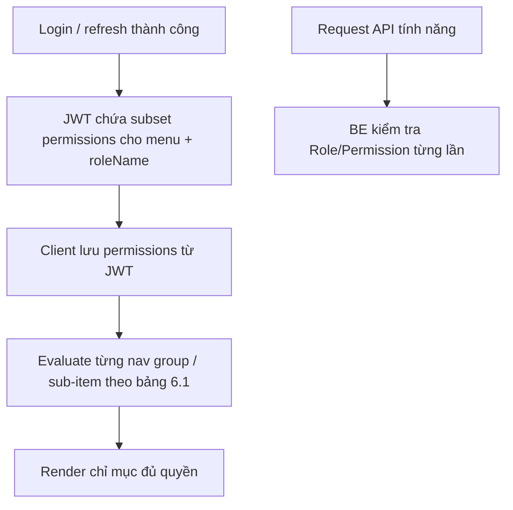

# SRS — Hiển thị side menu theo quyền (Role & Permissions) — Task101

> **File**: `backend/docs/srs/SRS_Task101_role-based-side-menu-visibility.md`  
> **Người viết**: Agent BA (+ phần SQL tham chiếu theo `SQL_AGENT_INSTRUCTIONS.md`)  
> **Ngày cập nhật**: 25/04/2026  
> **Trạng thái**: Approved (đã tích hợp trả lời Open Questions — 25/04/2026)

**Traceability:**  
- Code UI: `frontend/mini-erp/src/components/shared/layout/Sidebar.tsx`, `frontend/mini-erp/src/store/sidebarStore.ts`, `frontend/mini-erp/src/features/auth/store/useAuthStore.ts`  
- DB (Flyway): `backend/smart-erp/src/main/resources/db/migration/V1__baseline_smart_inventory.sql` — bảng `Roles`, cột `permissions` (JSONB)  
- Auth hiện tại: `LoginUserDto` chỉ có `role` (tên); **mục tiêu** Task101: bổ sung **subset permission cho menu** trong **JWT** (mục 7.1) — có thể đồng thời mở rộng DTO login (tuỳ Dev) — [`LoginResult.java`](../../smart-erp/src/main/java/com/example/smart_erp/auth/service/LoginResult.java)  
- API: `can_view_system_logs` — [`API_Task086`](../../../frontend/docs/api/API_Task086_system_logs_get_list.md); **menu** tạm hiện mục *Nhật ký* (mục 6.1) dù chưa có key trong seed V1.  
- `RolePermissionReader` (Java): có ngoại lệ **Owner** cho `canManageStaff` — **side menu** (Task101) **không** dùng bypass theo tên role; nếu sau này cần thống nhất toàn hệ, ghi việc trong task RBAC tổng thể.

---

## 1. Tóm tắt

- **Vấn đề**: Side menu (Mini ERP) đang **lọc theo tên role cứng** (ví dụ ẩn "Phê duyệt" nếu không phải Owner, ẩn "Dòng tiền" nếu là Staff) thay vì theo **permissions** trong `Roles.permissions`. Dữ liệu quyền đã có ở DB nhưng **chưa** dùng để quyết định menu trên client (JWT hiện chỉ có claim `role` dạng chuỗi — sẽ bổ sung subset theo mục 7.1 / mục 10).
- **Mục tiêu**: Mỗi mục / nhóm menu (và tối thiểu: các mục con trong **Cài đặt**) chỉ hiện khi user có **đúng quyền boolean** tương ứng (theo bảng mapping dưới đây, bám khóa trong seed Flyway V1).
- **Đối tượng**: Mọi user đã đăng nhập; quy tắc hiển thị menu **chỉ dựa trên** object `permissions` từ DB (truyền xuống qua JWT — mục 6 & 7.1) — **không** ngoại lệ bypass theo tên `Owner` trên tầng menu.

---

## 2. Phạm vi

### 2.1 In-scope

- Định nghĩa **bảng mapping** `NavItemKey` (và mục con trong Settings) → key trong JSON `permissions` (booleans) — mục 6.1.
- **Quy ước thiếu key**: nếu một khóa boolean không có trong JSON `permissions` thì coi như `false` (mặc định an toàn).
- Hành vi UI: **Ẩn hoàn toàn** nhóm menu / sub-item không đủ quyền (không render); không dùng “disabled mờ” làm thay thế mặc định (ngoại lệ tạm thời: xem 6.1 mục *Nhật ký hệ thống*).
- Cập nhật client: khi **đăng nhập thành công** (và khi cần đồng bộ từ refresh) BE đưa **chỉ các flag permission cần cho menu** (subset) **vào JWT**; FE parse và lưu cùng session. Phía BE **mỗi request** (hoặc filter bảo mật tương đương) phải kiểm tra Role/Permission cho hành động; nếu tách nhỏ → **Task101_1** (và tùy cần Task101_1b…) — xem mục 10.

### 2.2 Out-of-scope (phiên bản này)

- **Chỉnh sửa nội dung seed** `Roles` trên môi trường đã tồn tại (có thể cần migration / script data — tách task).
- Thiết kế UI mới (icon, thứ tự nhóm) — giữ cấu trúc `navItems` hiện tại.
- Bảo vệ **route** (chặn deep link) có thể là follow-up; vẫn ưu tiên đồng bộ với cùng nguồn `permissions` khi triển khai Task101/101_1.
- Đồng bộ type/seed role **Manager** / **Warehouse** với DB: **Task101_2** (mục 10).

---

## 3. Persona & RBAC

| Vai trò (tên) | Nguồn | Ghi chú |
| :--- | :--- | :--- |
| Owner, Staff, Admin; Manager / Warehouse | Bảng `Roles.name` + `Users.role_id` | GAP FE vs DB: **Task101_2** — cập nhật `Roles` (migration/seed) + đồng bộ `UserRole` & mapping UI. |

**Xử lý từ chối ở API** (khi user gọi tính năng) giữ 403 theo từng task API; nguồn đối chiếu là **`Roles.permissions` (DB)**, thống nhất với cùng tập quyền mà server đóng gói vào JWT (subset menu) khi cấp token.

---

## 4. User Stories

- **US1**: Là **Staff** chỉ làm kho, tôi chỉ thấy menu **Kho hàng** / khu vực nghiệp vụ tương ứng, không thấy **Dòng tiền** / **Phê duyệt** nếu `permissions` không cho phép.
- **US2**: Là **Owner/Admin** có đủ `can_view_finance`, tôi thấy **Dòng tiền**; không cần hardcode `user.role === 'Owner'`.
- **US3**: Là user vào **Cài đặt → Quản lý nhân viên**, tôi chỉ thấy mục này khi có `can_manage_staff` (cùng policy với API Task078).

---

## 5. Luồng nghiệp vụ



*(Nội dung khác biệt theo từng role trên màn *Dashboard* / *AI Insights* — **chưa** thuộc phạm vi layout menu; xử lý sau.)*

---

## 6. Quy tắc nghiệp vụ

### 6.1 Bảng mapping (đã chốt cho Task101, trừ ghi chú “tạm / follow-up”)

Các khóa boolean dùng tên **theo cột** `Roles.permissions` (JSONB) trong Flyway; tên bám seed V1 / migration bổ sung.

| Nhóm menu / mục con | Điều kiện hiển thị | Ghi chú |
| :--- | :--- | :--- |
| `dashboard` (cha) | `can_view_dashboard` **hoặc** `can_use_ai` | *Tổng quan* hiện nếu ít nhất một quyền tương ứng hai mục con. |
| → *Dashboard* | `can_view_dashboard` | Mục con. |
| → *AI Insights* (trong nhóm tổng quan) | `can_use_ai` | Cùng nhóm với *Dashboard* hoặc đường dẫn tương ứng trong code. Nội dung theo role (khác nhau) — **task sau**, không chặn hiển thị cấu trúc menu. |
| `inventory` | `can_manage_inventory` | |
| `products` | `can_manage_products` | |
| `orders` | `can_manage_orders` | |
| `approvals` | `can_approve` | Thay thế `user.role === 'Owner'`. |
| `cashflow` | `can_view_finance` | Thay thế lọc cứng theo tên `Staff`. |
| `ai-tools` | `can_use_ai` | (Nếu trùng màn *AI Insights* trong *dashboard*, vẫn cùng key.) |
| `settings` (cha) | Có **≥1** mục con hợp lệ; do *Thông tin cửa hàng* (không cần flag) **luôn tính là hợp lệ** với user đã đăng nhập | Thực tế nhóm *Cài đặt* **gần như luôn** hiện; các mục còn lại vẫn tách theo từng quyền. |
| → *Thông tin cửa hàng* | **Luôn hiển thị** (với mọi user đã đăng nhập, trong nhóm *Cài đặt*) — không cần key JSON | Mọi user nội bộ **xem** được; **chỉ Owner sửa** thông tin — nghiệp vụ ở trang/API (Task073/074). |
| → *Quản lý nhân viên* | `can_manage_staff` | Cùng Task078. |
| → *Cấu hình cảnh báo* | `can_configure_alerts` | |
| → *Nhật ký hệ thống* | **Tạm: luôn hiện** khi *Cài đặt* hiện; sau khi có `can_view_system_logs` đầy đủ trong DB + BE gating, chuyển sang `can_view_system_logs` === true | Bổ sung key + gating: migration/seed + đồng bộ API Task086. |

**Quy ước boolean (đã chốt)**: thiếu key trong JSON `permissions` → `false`.

### 6.2 GAP mã nguồn hiện tại (Sidebar)

```129:135:frontend/mini-erp/src/components/shared/layout/Sidebar.tsx
  const filteredNavItems = useMemo(() => {
    return navItems.filter(item => {
      if (item.id === 'approvals' && user?.role !== 'Owner') return false
      if (item.id === 'cashflow' && user?.role === 'Staff') return false
      return true
    })
  }, [user?.role])
```

- Filter chỉ theo `user.role` (string), không đọc `permissions`.
- `useAuthStore` đang **mock** user Owner — dev phải chuyển sang dữ liệu thật từ login/refresh trước khi UAT theo quyền thật.

---

## 7. Ràng buộc kỹ thuật (Frontend)

- `NavItemKey` trong `sidebarStore.ts` giữ nguyên; có thể mở rộng cấu trúc `subItems` để gắn `requiredPermission?: keyof RolePermissions` (sau khi type được đồng bộ với BE).
- Nguồn `permissions` ổn định (không thay mỗi lần render): lưu trong `useAuthStore` cùng user sau login, hoặc query `staleTime` dài nếu dùng API.

## 7.1 Ràng buộc kỹ thuật (Backend) — đã chốt hướng xử lý

- Mở rộng cấp token khi đăng nhập/refresh: JWT chứa **tên role** (giữ) **+ subset các boolean phục vụ đánh giá side menu** (lấy từ `Roles.permissions` tại thời điểm phát hành token) — cài đặt cụ thể tại `JwtTokenService` / nơi tạo access token. Tham chiếu hiện trạng: [`JwtTokenService`](../../smart-erp/src/main/java/com/example/smart_erp/auth/support/JwtTokenService.java) mới có `role` — **cần chỉnh** (có thể tách subtask).
- **Mỗi request** API: BE phải **xác thực Role + Permission** phù hợp tính năng (tránh tin tưởng 100% client/claim menu). Nếu tách từng lớp filter, ghi ràng buộc trong **Task101_1** (hoặc tách theo module).
- Khi đổi quyền user trên DB, token cũ vẫn còn TTL: client/BE chấp nhận trễ đồng bộ **đến hết hạn** access token (hoặc cơ chế revoke / refresh bắt buộc tải lại quyền — tùy policy, có thể Open Question kỹ thuật nhỏ, không chặn Task101).

---

## 8. Dữ liệu & SQL tham chiếu (PostgreSQL — theo migration V1)

**Bảng / cột thực tế**

- `Roles (id, name, permissions JSONB, …)`
- `Users (id, role_id, status, …)` — `status = 'Active'` mới coi session hợp lệ cho ứng dụng (đồng bộ với nghiệp vụ auth).

**Đọc quyền cho user đăng nhập (một userId đã xác thực)**

```sql
SELECT
  u.id,
  u.username,
  r.id   AS role_id,
  r.name AS role_name,
  r.permissions
FROM users u
JOIN roles r ON r.id = u.role_id
WHERE u.id = :userId
  AND u.status = 'Active';
```

- `permissions` trả dạng JSONB — app/server có thể `::text` gửi client hoặc map object.
- **Index:** `users(id)` PK; `users(role_id)` thường đã lợi từ FK (nếu thiếu, đề xuất `idx_users_role_id` khi có nhiều lọc theo role). Không cần index trên JSONB chỉ với 3 hàng `Roles` seed; nếu sau này phân tích theo key JSON trên bảng lớn, cân nhắc GIN (ngoài phạm vi Task101 tối thiểu).

**Transaction / khóa**

- Đọc menu: **read-only**; `SELECT` trong transaction read-only nếu gói chung với thao tác auth.

**Kiểm thử dữ liệu**

- Sau seed V1: user `admin` gắn `role_id` trùng dòng `Owner` trong chèn mẫu (kiểm tra từng môi trường — dòng INSERT Users trong V1 gán `role_id` = 1, trùng `Owner` nếu thứ tự `SERIAL` bắt đầu từ 1).

---

## 9. Acceptance Criteria (BDD)

### 9.1 Happy path

```gherkin
Given user đã đăng nhập và client đã lưu cờ quyền từ JWT (subset ánh xạ từ Roles.permissions)
When can_view_finance = true trên session đó
Then nhóm menu "Dòng tiền" (cashflow) hiển thị trên side menu
```

```gherkin
Given can_approve = false
When user xem side menu
Then nhóm "Phê duyệt" (approvals) không hiển thị
```

```gherkin
Given can_manage_staff = true và can_configure_alerts = false
When user mở nhóm Cài đặt
Then thấy mục "Quản lý nhân viên" và không thấy "Cấu hình cảnh báo" và vẫn thấy "Thông tin cửa hàng" nếu nhóm Cài đặt được render
```

```gherkin
Given can_view_dashboard = false và can_use_ai = true (như seed Staff mẫu)
When user xem Tổng quan
Then thấy mục con "AI Insights" và không thấy mục con "Dashboard" (nội dung từng màn theo role — tách task sau)
```

### 9.2 Unhappy / an toàn

```gherkin
Given permissions thiếu hẳn key can_view_finance
When render menu
Then coi can_view_finance = false và ẩn nhóm "Dòng tiền"
```

```gherkin
Given user cố mở URL tới tính năng không thuộc quyền
Then API trả 403 theo từng module; ưu tiên route guard đồng bộ cùng nguồn quyền (follow-up nếu chưa kịp cùng sprint với menu)
```

---

## 10. Quyết định (trả lời Open Questions)

| # | Nội dung | Quyết định |
| :---: | :--- | :--- |
| 1 | Cách đưa quyền xuống FE; kiểm tra từng request | Chỉ đưa **subset permission cần cho side menu** vào **JWT** tại bước đăng nhập thành công; **mỗi request** BE vẫn phải kiểm tra Role/Permission. Phần phức tạp **tách Task101_1** (và tùy tách thêm) — không bắt buộc gom hết một PR. |
| 2 | Owner có bypass quyền ở menu? | **Không** — chỉ dựa trên nội dung JSON `permissions` (cùng cách bảo toàn: Owner trong DB vẫn thường `true` hết cờ cần thiết). |
| 3 | *Thông tin cửa hàng* / key JSON | Mọi user nội bộ **xem** được; **chỉ Owner sửa**; menu không dùng flag tách *xem*; chi tiết sửa ở trang/API. |
| 4 | *Nhật ký hệ thống* / `can_view_system_logs` | **Tạm hiện** mục menu; chuẩn hóa theo `can_view_system_logs` + seed/migration + gating sau. |
| 5 | `Manager` / `Warehouse` trên FE | **Task101_2** — migration/seed + đồng bộ type và mapping. |
| 6 | *Dashboard* vs *AI Insights* | Cả hai đều có thể dùng được theo từng `can_view_dashboard` / `can_use_ai`; nội dung hiển thị theo **khác** role xử lý ở **task sau** (không chặn Task101 layout cơ bản). |

**Phụ thuộc tài liệu hóa:** cập nhật API **login/refresh** (khi sẵn) để mô tả cấu trúc claim/subject chứa subset permissions; có thể tham chiếu từ bridge doc sau khi Dev chốt form JWT.

---

## 11. GAP / hiện trạng tới mục tiêu

| Nguồn | Trước khi triển khai Task101 | Mục tiêu / ghi chú |
| :--- | :--- | :--- |
| UI | Lọc theo tên `role` (cứng) | Lọc theo quyền từ session (sau parse JWT) + bảng 6.1. |
| JWT / Login | Chỉ `role` (tên) | Bổ sung **subset** boolean cho menu + vẫn mỗi request kiểm tra server. |
| DB / menu *Nhật ký* | Key `can_view_system_logs` chưa trong seed V1 | Tạm **hiện** mục menu; sau bổ sung key + gating theo 6.1. |
| docs / Flyway | `roles.md` ví dụ rút gọn | **Flyway** là nguồn sự thật. |
| FE type `UserRole` | Có `Manager` / `Warehouse` | **Task101_2** (migration/seed + đồng bộ). |

---

## 12. Hướng dẫn Agent SQL (khi triển khai BE/DB)

- Mọi thay đổi keys `permissions` mới → **Flyway mới** + cập nhật seed/ALTER policy (không sửa trực tiếp production ad-hoc).  
- **Ưu tiên** bổ sung `can_view_system_logs` (khớp API Task086) khi chuẩn hóa gating *Nhật ký* (thay cho rule tạm “luôn hiện” ở 6.1).  
- Đối chiếu `frontend/docs/database/tables/roles.md` với migration sau mỗi thay đổi JSON role.
- **Task101_2:** `INSERT`/`UPDATE` bảng `Roles` nếu thêm `Manager` / `Warehouse` (cùng `permissions` mặc định tối thiểu theo nghiệp vụ).

---

**Kết thúc SRS Task101 (Draft).**
