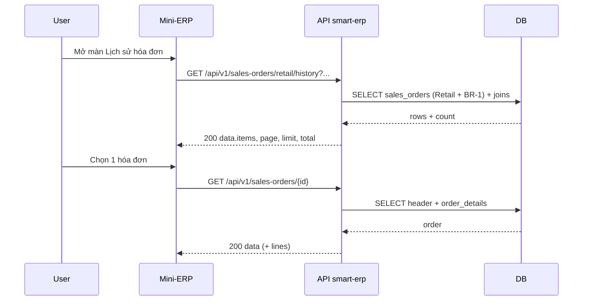

# SRS — UC9 — Lịch sử hóa đơn bán lẻ (API danh sách chuyên biệt + xem chi tiết chỉ đọc) — Task102

> **File (Spring / `smart-erp`):** `backend/docs/srs/SRS_Task102_retail-invoice-history.md`  
> **Người soạn:** Agent BA  
> **Ngày:** 02/05/2026  
> **Trạng thái:** `Approved`  
> **PO duyệt (khi Approved):** Owner (đồng bộ phiên), 02/05/2026

---

## 0. Đầu vào & traceability

| Nguồn | Đường dẫn / ghi chú |
| :--- | :--- |
| PRD / quyết địch PO (Owner) | Bỏ UX tách “bán lẻ / bán sỉ”; màn thay `WholesalePage` hiển thị **lịch sử** toàn bộ hóa đơn phát sinh từ **Đơn bán lẻ** (POS); **không** hiển thị đơn bán sỉ; **API list mới**; bảng giống các màn list khác; **read-only** (không sửa/xóa); **mọi user đã đăng nhập** được xem; **không** yêu cầu lọc theo trạng thái đơn trên UI — đơn bán lẻ coi là đã giao tại chỗ. |
| API list | [`../../../frontend/docs/api/API_Task102_sales_orders_retail_history_get_list.md`](../../../frontend/docs/api/API_Task102_sales_orders_retail_history_get_list.md) |
| API chi tiết (tái sử dụng) | [`../../../frontend/docs/api/API_Task055_sales_orders_get_by_id.md`](../../../frontend/docs/api/API_Task055_sales_orders_get_by_id.md) — `GET /api/v1/sales-orders/{id}` |
| Checkout POS (nguồn tạo đơn) | [`../../../frontend/docs/api/API_Task060_sales_orders_retail_checkout.md`](../../../frontend/docs/api/API_Task060_sales_orders_retail_checkout.md) |
| SRS liên quan | [`SRS_Task054-060_sales-orders-pos-and-retail-checkout.md`](SRS_Task054-060_sales-orders-pos-and-retail-checkout.md); [`SRS_Task091_uc9-retail-order-history-and-receipt-details.md`](SRS_Task091_uc9-retail-order-history-and-receipt-details.md) — **§0.1** đồng bộ: list chính thức = **Task102**. |
| Trừ tồn / hủy POS | [`SRS_Task090_uc9-retail-checkout-stock-deduction.md`](SRS_Task090_uc9-retail-checkout-stock-deduction.md) |
| UC / DB spec | [`../../../frontend/docs/UC/Database_Specification.md`](../../../frontend/docs/UC/Database_Specification.md) — §19 `SalesOrders`, §20 `OrderDetails` |
| Flyway thực tế | `backend/smart-erp/src/main/resources/db/migration/V1__baseline_smart_inventory.sql` — bảng `SalesOrders`, cột `order_channel`, index `idx_so_order_channel` |
| Envelope JSON | [`../../../frontend/docs/api/API_RESPONSE_ENVELOPE.md`](../../../frontend/docs/api/API_RESPONSE_ENVELOPE.md) |
| UI index | [`../../../frontend/mini-erp/src/features/FEATURES_UI_INDEX.md`](../../../frontend/mini-erp/src/features/FEATURES_UI_INDEX.md) |

---

## 1. Tóm tắt điều hành

- **Vấn đề:** Mini-ERP có POS bán lẻ nhưng thiếu màn **lịch sử hóa đơn** tập trung; màn **Đơn bán sỉ** không còn phù hợp sản phẩm (không hiển thị đơn sỉ nữa).
- **Mục tiêu nghiệp vụ:** Cung cấp **một endpoint đọc danh sách** chỉ chứa hóa đơn **kênh Retail** (POS), read-model tối giản cho bảng lịch sử; người dùng **xem chi tiết** chứng từ (read-only); **không** mutation từ màn này.
- **Đối tượng / persona:** Mọi nhân viên / quản lý **đã đăng nhập** và truy cập được module đơn hàng (theo cấu hình menu Task101 nếu áp dụng).

### 1.1 Giao diện Mini-ERP (bắt buộc khi API được gọi từ `mini-erp`)

| Nhãn menu (Sidebar) | Route | Page (export) | Component / vùng chính | File (dưới `frontend/mini-erp/src/features/`) |
| :--- | :--- | :--- | :--- | :--- |
| **Lịch sử hóa đơn** (đổi từ *Đơn bán sỉ*) | **`/orders/wholesale`** — **giữ URL** theo quyết định PO (OQ-1) | **`WholesalePage`** (export có thể đổi tên file sau) | `OrderTable`, `OrderToolbar`, `OrderDetailDialog` (read-only) | `orders/pages/WholesalePage.tsx` |

- **Đồng bộ index/menu:** đã cập nhật `FEATURES_UI_INDEX.md`, `Sidebar.tsx` nhãn **Lịch sử hóa đơn**; route không đổi để tránh gãy bookmark.

---

## 2. Bóc tách nghiệp vụ (capabilities)

| # | Capability | Kích hoạt bởi | Kết quả mong đợi | Ghi chú |
| :---: | :--- | :--- | :--- | :--- |
| C1 | Liệt kê lịch sử hóa đơn bán lẻ (phân trang) | Client gọi **GET mới** §8.1 | `200` + `items` chỉ đơn **Retail**, không có Wholesale/Return | Server **cố định** filter kênh; không nhận `orderChannel` từ client |
| C2 | Tra cứu theo mã / tên KH | Query `search` (tuỳ chọn) | Kết quả lọc theo rule §9 | Giống tinh thần Task054 (`orderCode`, tên KH) |
| C3 | Sắp xếp / phân trang; lọc theo ngày (v1) | `page`, `limit`, `sort`, `dateFrom`, `dateTo` | Meta `page`, `limit`, `total` | Mặc định mới nhất trước |
| C4 | Xem chi tiết chứng từ | User chọn một dòng | `GET /api/v1/sales-orders/{id}` `200` | Read-only UI; payload có thể chứa `status` (DB) — **cột trạng thái không hiển thị** trên table list theo PRD |
| C5 | RBAC đọc | JWT hợp lệ | Bất kỳ role nào **được phép gọi API** (xem §6); không phân biệt chỉ Owner xem lịch sử | Không có edit/delete trên màn |
| C6 | Không “lọt” đơn ngoài Retail lên màn lịch sử | List Task102 + FE chỉ mở `id` từ list | Đạt bằng filter server list; chi tiết dùng Task055 — **§4 quyết định OQ-2** | Backlog: endpoint chi tiết scoped Retail nếu cần hardening |

---

## 3. Phạm vi

### 3.1 In-scope

- Thiết kế & triển khai **`GET /api/v1/sales-orders/retail/history`** (tên path chính xác có thể điều chỉnh trong `API_Task102` miễn đăng ký trong `API_PROJECT_DESIGN.md` §4.10).
- Read-model **danh sách**: không expose tham số lọc `status` / `paymentStatus` cho client; server áp rule nội bộ **BR-1**.
- FE: màn table + toolbar tìm kiếm + chi tiết read-only; **loại bỏ** hiển thị đơn bán sỉ khỏi màn này.
- Tái sử dụng **Task055** cho body chi tiết + `lines`.

### 3.2 Out-of-scope

- Tạo/sửa/xóa/hủy đơn từ màn lịch sử.
- In PDF / hóa đơn điện tử GTGT (nếu có task riêng).
- **Danh sách đơn bán sỉ / trả hàng** trên màn này (Wholesale, Return).
- Thay đổi luồng **Task060** checkout.

---

## 4. Quyết định PO (đã chốt — 02/05/2026)

| ID | Câu hỏi (lịch sử) | Quyết định PO | Ghi chú triển khai |
| :--- | :--- | :--- | :--- |
| **OQ-1** | Route menu lịch sử | **Giữ** URL **`/orders/wholesale`**; đổi nhãn menu + nội dung trang. | Cập nhật `Sidebar`, `FEATURES_UI_INDEX`. |
| **OQ-2** | `GET /sales-orders/{id}` khi không phải Retail | **Không hiển thị** đơn ngoài bán lẻ trên màn Task102: đạt bằng **list đã lọc Retail** + FE **chỉ** mở chi tiết các `id` trả về từ `GET …/retail/history`. | **Không** thay đổi breaking hành vi **Task055** toàn cục (màn **Trả hàng** và luồng khác vẫn cần đọc đơn `Return`/`Wholesale`). *Backlog:* `GET …/retail/history/{id}` nếu PO sau này yêu cầu chặn cứng tại BE. |
| **OQ-3** | Retail **Cancelled** trong list? | **Có** — đơn Retail đã hủy **vẫn** xuất hiện trong lịch sử. | BR-1 gồm `Delivered` và `Cancelled`. |
| **OQ-4** | Filter ngày v1? | **Có** — tham số `dateFrom`, `dateTo` (`yyyy-MM-dd`) trên API Task102. | Validation: nếu cả hai có mặt thì `dateFrom` ≤ `dateTo`. |

**Open Questions còn lại:** không.

---

## 5. Phân tích scope tệp & bằng chứng (Evidence scope)

### 5.1 Tài liệu đã đối chiếu (read)

- `FEATURES_UI_INDEX.md` — `/orders/retail`, `/orders/wholesale`.
- `API_Task054`, `API_Task055`, `API_Task060`, `API_RESPONSE_ENVELOPE.md`.
- `SRS_Task054-060`, `SRS_Task091`, Flyway **V1** (`order_channel`, index).

### 5.2 Mã / migration dự kiến (write / verify)

- Backend: `SalesOrder*` controller/service/repository — thêm method list **Retail history**; không xóa endpoint Task054 (có thể vẫn dùng cho Returns / báo cáo nội bộ).
- **Không** migration bắt buộc nếu chỉ đọc `SalesOrders` hiện có.
- Frontend: `orders/pages/WholesalePage.tsx` (hoặc page mới), `orders/api/salesOrdersApi.ts`, `Sidebar.tsx`, `App.tsx`, hooks list.

### 5.3 Rủi ro phát hiện sớm

- **Trùng lặp với Task091:** đã cập nhật Task091 **§0.1** + C1 + §3.1 — Task102 là nguồn chính cho **contract list** màn lịch sử.
- **Task101 menu:** nếu ẩn module “Đơn hàng” với một số role, user đó không vào được màn — khác với “ai cũng xem được” trong phạm vi **đã vào app**.

---

## 6. Persona & RBAC

| Vai trò | Quyền / điều kiện | HTTP khi từ chối |
| :--- | :--- | :--- |
| Chưa đăng nhập | Không có / JWT invalid | **401** `UNAUTHORIZED` |
| Owner / Staff / … (đã đăng nhập) | **Đọc** list + detail cho màn lịch sử; không yêu cầu `can_manage_orders` cho **read** trừ khi PO đổi ý | **403** chỉ khi policy toàn cục (vd. Task101_1 chặn route) — ghi rõ trong triển khai |
| Không áp dụng | Edit/Delete trên màn này | N/A (UI không gửi) |

---

## 7. Actor & luồng nghiệp vụ

### 7.1 Danh sách actor

| Actor | Mô tả ngắn |
| :--- | :--- |
| User | NV bán hàng / quản lý tra cứu hóa đơn đã bán |
| Client | Mini-ERP SPA |
| API | `smart-erp` |
| DB | PostgreSQL |

### 7.2 Luồng chính (narrative)

1. User mở màn **Lịch sử hóa đơn bán lẻ** (Sidebar).
2. Client gọi `GET /api/v1/sales-orders/retail/history?page=1&limit=20`.
3. API xác thực JWT, áp filter **BR-1**, trả danh sách + `total`.
4. User nhập `search` và/hoặc `dateFrom`/`dateTo` (tuỳ chọn) → client gọi lại với query mới.
5. User click một dòng → client gọi `GET /api/v1/sales-orders/{id}`.
6. UI hiển thị dialog/panel chi tiết **chỉ đọc**.

### 7.3 Sơ đồ



---

## 8. Hợp đồng HTTP & ví dụ JSON

### 8.1 Tổng quan endpoint (mới)

| Thuộc tính | Giá trị |
| :--- | :--- |
| Method + path | `GET /api/v1/sales-orders/retail/history` |
| Auth | `Bearer` |
| Content-Type | `application/json` (response) |

### 8.2 Query — schema logic

| Param | Kiểu | Bắt buộc | Validation | Mô tả |
| :--- | :--- | :---: | :--- | :--- |
| `search` | string | Không | trim, max length **100** (gợi ý) | ILIKE `order_code`, tên khách (`customers.name`) |
| `dateFrom` | string | Không | `yyyy-MM-dd` | Lọc `created_at` từ đầu ngày (múi giờ chốt khi Dev — ghi trong API_Task102). |
| `dateTo` | string | Không | `yyyy-MM-dd` | Lọc đến cuối ngày `dateTo`. |
| `page` | int | Không | ≥ 1, mặc định **1** | |
| `limit` | int | Không | 1–100, mặc định **20** | |
| `sort` | string | Không | whitelist, mặc định **`createdAt:desc`** | Chỉ `createdAt:asc` \| `createdAt:desc` \| `finalAmount:asc` \| `finalAmount:desc` |

**Không** có query: `orderChannel`, `status`, `paymentStatus` (client không được lọc theo các field này).

**Quy tắc ngày:** nếu **cả** `dateFrom` và `dateTo` được gửi, bắt buộc `dateFrom` ≤ `dateTo`; sai → **400**.

### 8.3 Request — body

Không có body (GET).

### 8.4 Response thành công — ví dụ JSON đầy đủ (`200`)

```json
{
  "success": true,
  "data": {
    "items": [
      {
        "id": 501,
        "orderCode": "SO-2026-0501",
        "customerName": "Khách lẻ",
        "finalAmount": 185000,
        "itemsCount": 3,
        "createdAt": "2026-05-02T08:15:00Z"
      }
    ],
    "page": 1,
    "limit": 20,
    "total": 1
  },
  "message": "Thao tác thành công"
}
```

> **Ghi chú field:** `items` **không bắt buộc** có `status` / `orderChannel` — nếu Dev thấy cần `orderChannel` cố định `"Retail"` cho debug FE, có thể thêm nhưng **không** hiển thị cột trạng thái trên UI theo PRD.

### 8.5 Response lỗi — ví dụ JSON đầy đủ

**400 — validation query**

```json
{
  "success": false,
  "error": "BAD_REQUEST",
  "message": "Dữ liệu không hợp lệ",
  "details": {
    "page": "Trang phải là số nguyên ≥ 1",
    "sort": "Giá trị sắp xếp không được hỗ trợ"
  }
}
```

**400 — `dateFrom` > `dateTo`**

```json
{
  "success": false,
  "error": "BAD_REQUEST",
  "message": "Dữ liệu không hợp lệ",
  "details": {
    "dateTo": "Ngày kết thúc phải sau hoặc bằng ngày bắt đầu"
  }
}
```

**401 — chưa đăng nhập / JWT hết hạn**

```json
{
  "success": false,
  "error": "UNAUTHORIZED",
  "message": "Phiên đăng nhập đã hết hạn. Vui lòng đăng nhập lại.",
  "details": {}
}
```

**403 — không đủ quyền truy cập API / module (nếu áp dụng)**

```json
{
  "success": false,
  "error": "FORBIDDEN",
  "message": "Bạn không có quyền thực hiện thao tác này.",
  "details": {}
}
```

**500 — lỗi không lường trước**

```json
{
  "success": false,
  "error": "INTERNAL_SERVER_ERROR",
  "message": "Không thể hoàn tất thao tác. Vui lòng thử lại sau hoặc liên hệ quản trị viên.",
  "details": {}
}
```

### 8.6 Chi tiết đơn (tái sử dụng Task055)

- **`GET /api/v1/sales-orders/{id}`** — tham chiếu [`API_Task055_sales_orders_get_by_id.md`](../../../frontend/docs/api/API_Task055_sales_orders_get_by_id.md).
- **404** khi không tồn tại `id`.
- **Đơn không phải Retail:** không đổi envelope Task055 toàn cục — xem **§4 OQ-2** (kỷ luật list + FE; backlog endpoint scoped nếu cần).

### 8.7 Ghi chú envelope

- Bám [`API_RESPONSE_ENVELOPE.md`](../../../frontend/docs/api/API_RESPONSE_ENVELOPE.md) §2 (thành công) và §3 (lỗi).

---

## 9. Quy tắc nghiệp vụ (bảng)

| Mã | Điều kiện | Hành động / kết quả |
| :--- | :--- | :--- |
| BR-1 | `order_channel = 'Retail'` và `status IN ('Delivered', 'Cancelled')` | Được đưa vào list endpoint Task102 (theo PO §4 OQ-3) |
| BR-2 | `order_channel` ∈ {`Wholesale`, `Return`} | **Luôn loại** khỏi response list |
| BR-3 | `dateFrom` / `dateTo` (tuỳ chọn) | Khi có đủ cả hai: `dateFrom` ≤ `dateTo`; áp lọc theo `created_at` |
| BR-4 | `search` rỗng / null | Không áp điều kiện text search |
| BR-5 | Retail trạng thái khác `Delivered`/`Cancelled` (vd. `Pending`) | **Loại** khỏi list (POS chuẩn: đơn hoàn tất hoặc đã hủy sau khi tạo) |

---

## 10. Dữ liệu & SQL tham chiếu (phối hợp Agent SQL)

### 10.1 Bảng / quan hệ (tên Flyway)

| Bảng | Read / Write | Ghi chú |
| :--- | :--- | :--- |
| `SalesOrders` | Read | Filter `order_channel`, `status` (BR-1, BR-5), `created_at` (BR-3) |
| `Customers` | Read | Join lấy `customer_name` cho list + search |
| `OrderDetails` | Read | Chỉ **COUNT\*** hoặc subquery cho `itemsCount` |

### 10.2 SQL / ranh giới transaction

```sql
-- List (khung logic; Dev điều chỉnh alias/schema)
SELECT so.id,
       so.order_code,
       c.name       AS customer_name,
       so.final_amount,
       (SELECT COUNT(*) FROM order_details od WHERE od.order_id = so.id) AS items_count,
       so.created_at
FROM sales_orders so
JOIN customers c ON c.id = so.customer_id
WHERE so.order_channel = 'Retail'
  AND so.status IN ('Delivered', 'Cancelled')
  AND (:date_from IS NULL OR so.created_at >= :date_from_start_of_day)
  AND (:date_to IS NULL OR so.created_at <= :date_to_end_of_day)
  AND (:search IS NULL OR :search = ''
       OR so.order_code ILIKE '%' || :search || '%'
       OR c.name ILIKE '%' || :search || '%')
ORDER BY so.created_at DESC
LIMIT :limit OFFSET :offset;
```

### 10.3 Index & hiệu năng

- Đã có `idx_so_order_channel` (V1). Đề xuất SQL Agent đánh giá composite `(order_channel, status, created_at DESC)` nếu volume lớn.

### 10.4 Kiểm chứng dữ liệu cho Tester

- Sau khi **Task060** tạo đơn Retail `Delivered`, bản ghi xuất hiện ở page 1 của history API.
- Đơn Retail **Cancelled** (nếu có trong DB) xuất hiện trong list.
- Không có bản ghi Wholesale trong response.
- Gọi list với `dateFrom`/`dateTo` hợp lệ chỉ trả đơn trong khoảng ngày.

---

## 11. Acceptance criteria (Given / When /Then)

```text
Given user đã đăng nhập hợp lệ
When GET /api/v1/sales-orders/retail/history?page=1&limit=20
Then HTTP 200, success=true, data.items chỉ chứa đơn Retail thỏa BR-1 (Delivered hoặc Cancelled), data.total khớp số bản ghi
```

```text
Given có ít nhất 1 đơn Wholesale trong DB
When GET /api/v1/sales-orders/retail/history
Then không có phần tử nào mapping tới đơn Wholesale
```

```text
Given search trùng mã hóa đơn Retail
When GET .../retail/history?search=SO-2026-0501
Then HTTP 200 và danh sách chỉ các đơn khớp search
```

```text
Given page=0 hoặc sort không thuộc whitelist
When GET .../retail/history
Then HTTP 400, error=BAD_REQUEST, message tiếng Việt, details chỉ rõ field
```

```text
Given JWT không hợp lệ
When GET .../retail/history
Then HTTP 401 theo envelope
```

```text
Given user chọn id từ list history
When GET /api/v1/sales-orders/{id}
Then HTTP 200 và payload có lines phục vụ read-only detail (Task055)
```

```text
Given dateFrom=2026-05-01 và dateTo=2026-05-02 hợp lệ
When GET /api/v1/sales-orders/retail/history?dateFrom=2026-05-01&dateTo=2026-05-02
Then HTTP 200 và mọi phần tử có createdAt trong khoảng ngày (theo quy ước timezone đã chốt khi Dev)
```

```text
Given dateFrom=2026-05-10 và dateTo=2026-05-02
When GET /api/v1/sales-orders/retail/history?dateFrom=2026-05-10&dateTo=2026-05-02
Then HTTP 400 và details chỉ rõ dateTo
```

---

## 12. GAP & giả định

| GAP / Giả định | Tác động | Hành động / trạng thái |
| :--- | :--- | :--- |
| **GAP-1** | File API Task102 | **Đã tạo:** [`API_Task102_sales_orders_retail_history_get_list.md`](../../../frontend/docs/api/API_Task102_sales_orders_retail_history_get_list.md); đã đăng ký `API_PROJECT_DESIGN.md` §4.10 + catalog. |
| **GAP-2** | `SRS_Task091` vs Task102 | **Đã đồng bộ:** Task091 §0.1 — nguồn list lịch sử bán lẻ chính thức là **Task102**; C1 Task091 không còn khuyến nghị `GET /sales-orders?orderChannel=Retail` cho màn Task102. |
| **GAP-3** | “Ai cũng xem” vs Task101 | **Chấp nhận:** user chỉ xem được khi role có menu/module Đơn hàng (Task101); trong phạm vi đó không phân tầng read thêm. |
| **Backlog** | Hardening chi tiết Retail-only | Endpoint `GET …/retail/history/{id}` hoặc rule Task055 nếu PO yêu cầu sau này. |
| **Giả định** | Múi giờ cắt `dateFrom`/`dateTo` | Dev chốt và ghi vào [`API_Task102_sales_orders_retail_history_get_list.md`](../../../frontend/docs/api/API_Task102_sales_orders_retail_history_get_list.md) **§5.1**. |

---

## 13. PO sign-off (chỉ điền khi Approved)

- [x] Đã trả lời / đóng các **OQ** (§4); BR-1 / filter ngày / chi tiết (OQ-2) đã phản ánh vào §8–§11
- [x] JSON response list khớp ý đồ sản phẩm (cột bảng tối thiểu)
- [x] Phạm vi In/Out đã đồng ý; quan hệ Task091 đã ghi nhận (§12 GAP-2)

**Chữ ký / nhãn PR:** Owner — Approved 02/05/2026 (đồng bộ tài liệu phiên)
