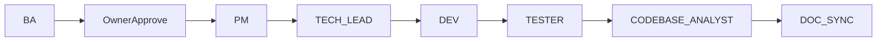

# WORKFLOW_RULE — Điều phối Agent Mini-ERP (bản chuẩn)

> **Phiên bản**: 2.3  
> **Vai trò**: Đây là **một nguồn duy nhất** mà AI phải tuân theo khi Owner/User yêu cầu:  
> *"Làm theo `WORKFLOW_RULE.md`"*, *"Chạy workflow"*, *"PM_RUN"*, hoặc tương đương.  
> **Chi tiết từng bước (sơ đồ dài)**: xem [`FLOW_GUIDE.md`](FLOW_GUIDE.md) khi cần tra cứu sâu.  
> **Nhánh Spring Boot (`backend/smart-erp`)**: luồng agent + gate — [`../../backend/AGENTS/WORKFLOW_RULE.md`](../../backend/AGENTS/WORKFLOW_RULE.md). **Ngoại lệ repo**: task **chỉ** thiết kế tài liệu API (`frontend/docs/api/`) vẫn theo hợp đồng chung; khi triển khai Java hãy bám **chuỗi BA → … → Doc Sync** trong file backend trên (Gate G-BA vẫn áp dụng khi có SRS/brief cần phê duyệt).

---

## 1. Giới hạn thực tế (Cursor / IDE)

- **Không có process nền** tự spawn nhiều agent song song.  
- **Cách “tự động” khả thi**: trong **một phiên chat**, AI đọc file này rồi **đóng vai tuần tự** BA → PM → TECH_LEAD → DEV → TESTER → CODEBASE_ANALYST → DOC_SYNC, báo rõ từng bước.  
- **Điểm dừng bắt buộc**: sau **BA** (tài liệu cần Owner duyệt **hoặc** đã duyệt qua **Agent Planner** — xem [`PLANNER_AGENT_INSTRUCTIONS.md`](PLANNER_AGENT_INSTRUCTIONS.md)) — AI **không** được tự sang PM nếu chưa có xác nhận SRS / brief Approved tương đương Gate G1.

---

## 2. Chuỗi Agent (sau khi BA xong và Owner đã duyệt)

Thứ tự **bắt buộc** (trừ BA):

`PM → TECH_LEAD → DEV → TESTER → CODEBASE_ANALYST → DOC_SYNC`

---

## 3. Gate tối thiểu (điều kiện chuyển bước)

| Gate | Từ | Sang | Điều kiện |
| :--- | :--- | :--- | :--- |
| G0 | BA | Owner | Output BA đạt QA nội bộ; **SRS** (hoặc bộ BA v2) sẵn sàng duyệt |
| G1 | Owner | PM | Owner nói rõ **Đồng ý / Approve / Tiếp tục** (hoặc SRS header `Approved`). **Luồng Planner**: BA từ **`AGENTS/docs/planner/PLANNER_BRIEF_*` đã `Approved`** bỏ qua duyệt Owner *giữa các trụ BA*; **trước PM** vẫn cần SRS sẵn sàng và Owner **một lần** chốt **SRS Approved** (có thể ngay sau khi BA nộp SRS nếu Owner tin cậy brief + QA BA). |
| G2 | PM | TECH_LEAD | Đã tạo **3 file** `TASKS/Task*.md` (UNIT → FEATURE → E2E) + metadata `Depends on` |
| G3 | TECH_LEAD | DEV | Nếu có ảnh hưởng kiến trúc/contract: **ADR** đủ **5 NFR** theo [`docs/adr/ADR_TEMPLATE.md`](../docs/adr/ADR_TEMPLATE.md); nếu không cần ADR → ghi rõ **N/A + lý do** |
| G4 | DEV | TESTER | Test pass, **coverage ≥ 80%**, `lint` + `build` pass (theo [`DEVELOPER_AGENT_INSTRUCTIONS.md`](DEVELOPER_AGENT_INSTRUCTIONS.md)) |
| G5 | TESTER | CODEBASE_ANALYST | AC / E2E / smoke theo vai **Tester**; nhánh Spring: [`../../backend/AGENTS/TESTER_AGENT_INSTRUCTIONS.md`](../../backend/AGENTS/TESTER_AGENT_INSTRUCTIONS.md) |
| G6 | CODEBASE_ANALYST | DOC_SYNC | Báo cáo 10-phase đã xuất (path trong mục 5) |
| G7 | DOC_SYNC | Kết thúc | Báo cáo drift đã xuất; PM cập nhật trạng thái SRS / PM_RUN nếu có |

---

## 4. Agent BA — hai chế độ (chọn một)

### 4.1 Luồng đầy đủ v2.0 (6 Trụ Cột)

Theo [`BA_AGENT_INSTRUCTIONS.md`](BA_AGENT_INSTRUCTIONS.md): Elicitation → PRD → Prototype → USS → (CR/Integration khi cần) → tổng hợp **SRS** tại `docs/srs/SRS_TaskXXX_<slug>.md`.

### 4.2 Luồng rút gọn (yêu cầu đã rõ)

Bỏ qua trụ không cần thiết; vẫn phải ra **SRS** cùng quy ước tên file và QA BA.

**Sau BA**: **dừng** và hiển thị path SRS + checklist — **chờ Owner (Gate G1)** *trừ khi* BA chạy trong **luồng Planner** với `AGENTS/docs/planner/PLANNER_BRIEF_*` đã Approved (khi đó G1 đã được coi là đóng cho phạm vi Task trong brief sau khi SRS sẵn sàng — Owner vẫn có thể yêu cầu chỉnh sửa như mọi tài liệu).

---

## 5. Output bắt buộc theo agent (tóm tắt)

| Agent | Output chính | Đường dẫn |
| :--- | :--- | :--- |
| BA | SRS (và tài liệu trụ nếu chạy v2) | `docs/srs/SRS_TaskXXX_<slug>.md`, `docs/ba/**` nếu có |
| PM | 3 Task UNIT / FEATURE / E2E | `TASKS/TaskXXX.md` (+2 file liên tiếp) |
| TECH_LEAD | ADR (khi cần) + guardrails | `docs/adr/ADR-XXXX_<slug>.md` |
| DEV | Code + test + báo cáo coverage | `mini-erp/src/**` + `*.test.ts` / e2e |
| TESTER | AC + E2E + smoke (và Postman body cho API khi có) | `e2e/**`, `docs/postman/**`, báo cáo smoke theo task |
| CODEBASE_ANALYST | Báo cáo brownfield 10 phase | `docs/analysis/ANALYSIS_TaskXXX.md` |
| DOC_SYNC | Báo cáo drift | `docs/sync_reports/SYNC_REPORT_TaskXXX.md` |

*(Tạo thư mục `docs/analysis/`, `docs/sync_reports/` nếu chưa tồn tại.)*

---

## 6. File trigger (khuyến nghị)

- Hướng dẫn trigger: [`AGENT_TRIGGERS/README.md`](../AGENT_TRIGGERS/README.md)  
- PM orchestration: `AGENT_TRIGGERS/PM_RUN_SRS_TaskXXX_<slug>.md` (template: `PM_RUN_TEMPLATE.md`)

Khi mở/ghi file `PM_RUN_*`, AI đóng vai **PM** và thực hiện checklist trong file đó **sau khi** SRS đã `Approved`.

---

## 7. Instruction từng agent (không trùng nội dung ở đây)

| Agent | File |
| :--- | :--- |
| PLANNER | [`PLANNER_AGENT_INSTRUCTIONS.md`](PLANNER_AGENT_INSTRUCTIONS.md) |
| BA | [`BA_AGENT_INSTRUCTIONS.md`](BA_AGENT_INSTRUCTIONS.md) |
| PM | [`PM_AGENT_INSTRUCTIONS.md`](PM_AGENT_INSTRUCTIONS.md) |
| TECH_LEAD | [`TECH_LEAD_AGENT_INSTRUCTIONS.md`](TECH_LEAD_AGENT_INSTRUCTIONS.md) |
| DEV | [`DEVELOPER_AGENT_INSTRUCTIONS.md`](DEVELOPER_AGENT_INSTRUCTIONS.md) |
| TESTER (Spring) | [`../../backend/AGENTS/TESTER_AGENT_INSTRUCTIONS.md`](../../backend/AGENTS/TESTER_AGENT_INSTRUCTIONS.md) |
| CODEBASE_ANALYST | [`CODEBASE_ANALYST_AGENT_INSTRUCTIONS.md`](CODEBASE_ANALYST_AGENT_INSTRUCTIONS.md) |
| DOC_SYNC | [`DOC_SYNC_AGENT_INSTRUCTIONS.md`](DOC_SYNC_AGENT_INSTRUCTIONS.md) |

---

## 8. Cú pháp gọi nhanh (Owner / User)

- Bắt đầu từ yêu cầu thô (có hoặc không Planner):  
  `Làm theo WORKFLOW_RULE.md — Agent PLANNER: [Feature]` **hoặc** `… — Agent BA: [mô tả / path requirement]`
- Sau khi duyệt SRS:  
  `Làm theo WORKFLOW_RULE.md — đã Approve SRS docs/srs/SRS_Task017_xxx.md — tiếp tục từ PM`
- Một lệnh orchestrate (một phiên):  
  `WORKFLOW_RULE: chạy full sau Gate Owner (PM → … → TESTER → … → DOC_SYNC) cho SRS …`

---

## 9. Nguyên tắc vàng (mọi agent)

- **No hallucination**: DB/route/feature chỉ từ `docs/database/`, `FUNCTIONAL_SUMMARY.md`, code thực tế.  
- **Human-in-the-Loop**: không tự commit thay đổi DB destructive từ AI; có Draft/Pending + Confirm khi áp dụng.  
- **RULES.md**: UI/TS/test discipline cho code trong `mini-erp/`.
- **Syntax Integrity**: Luôn kiểm tra đóng thẻ HTML/JSX đầy đủ và đúng cấu trúc lồng nhau để đảm bảo giao diện không bị lỗi/vỡ.
