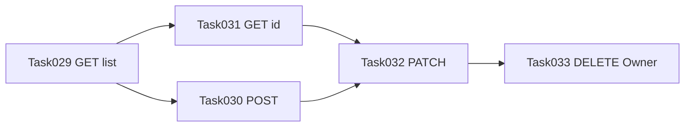

# Prompt đủ cho 5 Task — Categories (Task029–033)

Tham chiếu workflow: [`backend/AGENTS/API_BRIDGE_AGENT_INSTRUCTIONS.md`](../../../../backend/AGENTS/API_BRIDGE_AGENT_INSTRUCTIONS.md).

---

## Ngữ cảnh SRS (copy vào đầu phiên hoặc nhắc trong từng prompt)

[`backend/docs/srs/SRS_Task029-033_categories-management.md`](../../../../backend/docs/srs/SRS_Task029-033_categories-management.md) — §8.1 endpoint; §6 RBAC (`can_manage_products` cho GET/POST/PATCH; **DELETE chỉ Owner** `assertOwnerOnly`); §4 OQ-2-B (PATCH `null` = không đổi), OQ-3(a) (không lên gốc qua PATCH). UI §1.1: `/products/categories`, `product-management/pages/CategoriesPage.tsx`, tra [`frontend/mini-erp/src/features/FEATURES_UI_INDEX.md`](../../mini-erp/src/features/FEATURES_UI_INDEX.md).

**Quy ước API_BRIDGE:** đọc [`FE_API_CONNECTION_GUIDE.md`](./FE_API_CONNECTION_GUIDE.md) trước; `Grep` path trong `frontend/mini-erp/src`, không Glob cả `features/`; output [`frontend/docs/api/bridge/BRIDGE_TaskXXX_<slug>.md`](../../docs/api/bridge/) đúng mục 5 (bảng).

---

## Task029 — GET list/cây

### Verify

```text
Vai trò: API_BRIDGE. Tuân @backend/AGENTS/API_BRIDGE_AGENT_INSTRUCTIONS.md.

API_BRIDGE | Task=Task029 | Path=GET /api/v1/categories | Mode=verify
Context SRS: @backend/docs/srs/SRS_Task029-033_categories-management.md §8.1 Task029, §2 C1–C3 (tree/flat, search nhánh, productCount).

Đọc theo thứ tự:
@frontend/AGENTS/docs/FE_API_CONNECTION_GUIDE.md
@frontend/docs/api/API_Task029_categories_get_list.md (chỉ mục endpoint GET /api/v1/categories)
Grep GET /categories hoặc /api/v1/categories trong @backend/smart-erp/src/main/java (controller + 1 DTO/query nếu cần)
Grep /api/v1/categories trong @frontend/mini-erp/src

Output: @frontend/docs/api/bridge/BRIDGE_Task029_categories_get_list.md (bảng: doc | BE | FE | Khớp | Hành động). Không sửa code trừ khi chuyển Mode=wire-fe.
```

### Wire-fe

```text
Vai trò: API_BRIDGE. Tuân @backend/AGENTS/API_BRIDGE_AGENT_INSTRUCTIONS.md.

API_BRIDGE | Task=Task029 | Path=GET /api/v1/categories | Mode=wire-fe
Context UI: Danh mục sản phẩm — `/products/categories` — `CategoriesPage` / bảng + toolbar (theo @frontend/mini-erp/src/features/FEATURES_UI_INDEX.md).

Đọc theo thứ tự:
@frontend/AGENTS/docs/FE_API_CONNECTION_GUIDE.md
@frontend/mini-erp/src/features/FEATURES_UI_INDEX.md
@frontend/docs/api/API_Task029_categories_get_list.md (chỉ mục Path GET list)

Thực hiện:
1. features/product-management/api — hàm getCategories (query: format, search, status, … đúng spec).
2. Móc vào page/component đã định vị (useQuery / state), map items → tree hoặc flat theo UI.
3. Grep Path trong @frontend/mini-erp/src — không Glob cả features/.

Output: @frontend/docs/api/bridge/BRIDGE_Task029_categories_get_list.md đúng mục 5.
```

---

## Task030 — POST tạo danh mục

### Verify

```text - đã chạy
Vai trò: API_BRIDGE. Tuân @backend/AGENTS/API_BRIDGE_AGENT_INSTRUCTIONS.md.

API_BRIDGE | Task=Task030 | Path=POST /api/v1/categories | Mode=verify
Context SRS: @backend/docs/srs/SRS_Task029-033_categories-management.md §8.1 Task030, §2 C4.

Đọc theo thứ tự:
@frontend/AGENTS/docs/FE_API_CONNECTION_GUIDE.md
@frontend/docs/api/API_Task030_categories_post.md (chỉ mục POST)
Grep POST /categories hoặc CategoriesController trong @backend/smart-erp/src/main/java
Grep /api/v1/categories trong @frontend/mini-erp/src

Output: @frontend/docs/api/bridge/BRIDGE_Task030_categories_post.md
```

### Wire-fe

```text
Vai trò: API_BRIDGE. Tuân @backend/AGENTS/API_BRIDGE_AGENT_INSTRUCTIONS.md.

API_BRIDGE | Task=Task030 | Path=POST /api/v1/categories | Mode=wire-fe
Context UI: Form tạo danh mục (CategoryForm / dialog trên CategoriesPage — theo FEATURES_UI_INDEX).

Đọc:
@frontend/AGENTS/docs/FE_API_CONNECTION_GUIDE.md
@frontend/mini-erp/src/features/FEATURES_UI_INDEX.md
@frontend/docs/api/API_Task030_categories_post.md (chỉ mục Path)

Thực hiện:
1. postCategory / createCategory trong features/product-management/api/*.ts (body camelCase khớp BE).
2. Submit form → useMutation → invalidate query list/detail theo guide.
3. Grep Path trong @frontend/mini-erp/src — không Glob cả features/.

Output: @frontend/docs/api/bridge/BRIDGE_Task030_categories_post.md
```

---

## Task031 — GET chi tiết theo id - đã chạy

### Verify

```text
Vai trò: API_BRIDGE. Tuân @backend/AGENTS/API_BRIDGE_AGENT_INSTRUCTIONS.md.

API_BRIDGE | Task=Task031 | Path=GET /api/v1/categories/{id} | Mode=verify
Context SRS: §8.1 Task031, §2 C5 (breadcrumb, parentName, productCount; 404 nếu soft-deleted).

Đọc:
@frontend/AGENTS/docs/FE_API_CONNECTION_GUIDE.md
@frontend/docs/api/API_Task031_categories_get_by_id.md (chỉ mục GET by id)
Grep GET "/categories/" hoặc method getById trong backend catalog/categories
Grep categories trong @frontend/mini-erp/src/features/product-management

Output: @frontend/docs/api/bridge/BRIDGE_Task031_categories_get_by_id.md
```

### Wire-fe

```text
Vai trò: API_BRIDGE. Tuân @backend/AGENTS/API_BRIDGE_AGENT_INSTRUCTIONS.md.

API_BRIDGE | Task=Task031 | Path=GET /api/v1/categories/{id} | Mode=wire-fe
Context UI: CategoryDetailDialog hoặc panel chi tiết trên CategoriesPage (FEATURES_UI_INDEX).

Đọc:
@frontend/AGENTS/docs/FE_API_CONNECTION_GUIDE.md
@frontend/mini-erp/src/features/FEATURES_UI_INDEX.md
@frontend/docs/api/API_Task031_categories_get_by_id.md

Thực hiện:
1. getCategoryById trong api/*.ts.
2. useQuery khi mở chi tiết / chọn node; hiển thị breadcrumb + productCount theo response.
3. Grep Path trong @frontend/mini-erp/src — không Glob cả features/.

Output: @frontend/docs/api/bridge/BRIDGE_Task031_categories_get_by_id.md
```

---

## Task032 — PATCH cập nhật - đã chạy

### Verify

```text
Vai trò: API_BRIDGE. Tuân @backend/AGENTS/API_BRIDGE_AGENT_INSTRUCTIONS.md.

API_BRIDGE | Task=Task032 | Path=PATCH /api/v1/categories/{id} | Mode=verify
Context SRS: §4 OQ-2-B (null = không đổi), OQ-3(a) (không đưa về gốc qua PATCH); §2 C6 (cycle 409, trùng code 409).

Đọc:
@frontend/AGENTS/docs/FE_API_CONNECTION_GUIDE.md
@frontend/docs/api/API_Task032_categories_patch.md
Grep PATCH categories trong @backend/smart-erp/src/main/java

Output: @frontend/docs/api/bridge/BRIDGE_Task032_categories_patch.md
```

### Wire-fe

```text
Vai trò: API_BRIDGE. Tuân @backend/AGENTS/API_BRIDGE_AGENT_INSTRUCTIONS.md.

API_BRIDGE | Task=Task032 | Path=PATCH /api/v1/categories/{id} | Mode=wire-fe
Context UI: Form sửa / CategoryForm edit mode trên CategoriesPage.
Lưu ý SRS: xóa mô tả → gửi description: "" nếu BE chuẩn hoá empty→NULL; không dùng PATCH để đặt parentId null = gốc (v1).

Đọc:
@frontend/AGENTS/docs/FE_API_CONNECTION_GUIDE.md
@frontend/mini-erp/src/features/FEATURES_UI_INDEX.md
@frontend/docs/api/API_Task032_categories_patch.md

Thực hiện:
1. patchCategory trong api/*.ts (partial body).
2. useMutation + invalidate list/detail; toast lỗi 409/400 theo envelope.
3. Grep Path trong @frontend/mini-erp/src — không Glob cả features/.

Output: @frontend/docs/api/bridge/BRIDGE_Task032_categories_patch.md
```

---

## Task033 — DELETE soft (Owner)

### Verify

```text
Vai trò: API_BRIDGE. Tuân @backend/AGENTS/API_BRIDGE_AGENT_INSTRUCTIONS.md.

API_BRIDGE | Task=Task033 | Path=DELETE /api/v1/categories/{id} | Mode=verify
Context SRS: §6 DELETE Owner-only; §2 C7 (409 con còn hiệu lực hoặc còn SP gán node).

Đọc:
@frontend/AGENTS/docs/FE_API_CONNECTION_GUIDE.md
@frontend/docs/api/API_Task033_categories_delete.md
Grep DELETE categories trong @backend/smart-erp/src/main/java

Output: @frontend/docs/api/bridge/BRIDGE_Task033_categories_delete.md
```

### Wire-fe

```text
Vai trò: API_BRIDGE. Tuân @backend/AGENTS/API_BRIDGE_AGENT_INSTRUCTIONS.md.

API_BRIDGE | Task=Task033 | Path=DELETE /api/v1/categories/{id} | Mode=wire-fe
Context UI: Nút xóa mềm trên CategoriesPage / dialog chi tiết — chỉ hiện khi user.role === "Owner" (khớp JWT assertOwnerOnly); Staff gọi → 403.

Đọc:
@frontend/AGENTS/docs/FE_API_CONNECTION_GUIDE.md
@frontend/mini-erp/src/features/FEATURES_UI_INDEX.md
@frontend/docs/api/API_Task033_categories_delete.md

Thực hiện:
1. deleteCategorySoft hoặc deleteCategory trong api/*.ts (DELETE path đúng spec).
2. Confirm dialog + useMutation; invalidate list; đóng chi tiết nếu cần.
3. Grep Path trong @frontend/mini-erp/src — không Glob cả features/.

Output: @frontend/docs/api/bridge/BRIDGE_Task033_categories_delete.md
```

---

## Thứ tự chạy thực tế



029 nền cho cây; 031 cho chi tiết; 030/032 form; 033 cuối (RBAC Owner).
