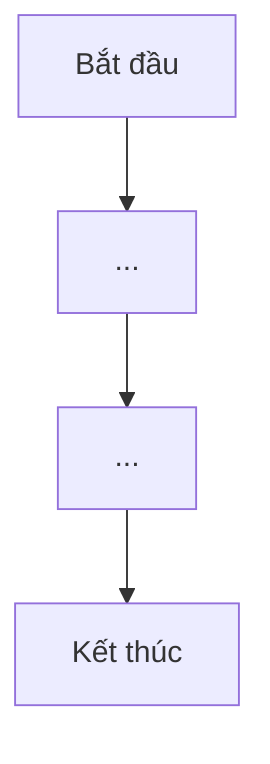

# ELICITATION SUMMARY - <Tên tính năng / Domain>

> **File**: `docs/ba/elicitation/ELICITATION_TaskXXX_<slug>.md`
> **Người thực hiện**: Agent BA
> **Ngày tạo**: <DD/MM/YYYY>
> **Trạng thái**: In-Progress | Done
> **Số vòng Q&A**: <N>

---

## 1. Thông tin ban đầu

- **Mã Task**: `TaskXXX`
- **Tính năng / Domain**: <Tên tính năng hoặc domain>
- **Người yêu cầu**: <Tên / vai trò stakeholder>
- **Ngữ cảnh**: <Mô tả ngắn gọn tại sao cần tính năng này, bối cảnh dự án>

---

## 2. Nguồn Input đã phân tích

| Loại tài liệu | Nguồn | Ghi chú |
| :--- | :--- | :--- |
| Yêu cầu thô (văn bản/chat) | `Requirements/...` | |
| Tài liệu Stakeholder | `docs/...` | |
| Nghiên cứu domain | (Kết quả /bmad-X-research) | |
| Tài liệu nghiệp vụ hiện có | `FUNCTIONAL_SUMMARY.md`, `overall-project.md` | |

---

## 3. Actors & Stakeholders

| Actor | Vai trò | Pain Point chính |
| :--- | :--- | :--- |
| <Vai trò 1> | <Mô tả> | <Nỗi đau cụ thể> |
| <Vai trò 2> | <Mô tả> | <Nỗi đau cụ thể> |

---

## 4. Kết quả Q&A (theo vòng)

### Vòng 1

**Câu hỏi do Agent BA đặt ra:**

1. <Câu hỏi 1>
2. <Câu hỏi 2>
3. <Câu hỏi 3>

**Trả lời của User/Stakeholder:**

1. <Trả lời 1>
2. <Trả lời 2>
3. <Trả lời 3>

---

### Vòng 2 (nếu cần)

**Câu hỏi tiếp theo:**

1. <Câu hỏi>

**Trả lời:**

1. <Trả lời>

---

## 5. Tổng hợp Yêu cầu (Elicitation Summary)

### 5.1 Goals (Mục tiêu) — MoSCoW

| Mức độ | Mục tiêu |
| :--- | :--- |
| **Must Have** | <Yêu cầu bắt buộc phải có> |
| **Should Have** | <Yêu cầu nên có> |
| **Could Have** | <Yêu cầu có thể có> |
| **Won't Have** | <Yêu cầu KHÔNG có trong lần này> |

### 5.2 Luồng nghiệp vụ sơ bộ

### 5.3 Ràng buộc & Giả định

- **Ràng buộc kỹ thuật**: <VD: phải dùng bảng hiện có, không thêm table mới>
- **Ràng buộc nghiệp vụ**: <VD: chỉ Owner mới được duyệt>
- **Giả định**: <VD: user đã đăng nhập khi truy cập>

### 5.4 Rủi ro sơ bộ

| Rủi ro | Mức độ | Hướng giải quyết |
| :--- | :--- | :--- |
| <Rủi ro 1> | Cao / Trung / Thấp | <Giải pháp> |

---

## 6. Điểm còn mở (Open Questions)

- <Câu hỏi chưa được trả lời, cần làm rõ ở vòng sau hoặc khi viết PRD>

---

## 7. Kế tiếp (Next Steps)

- [ ] Chuyển sang **Trụ 2: Tạo PRD** — tạo file `docs/ba/prd/PRD_TaskXXX_<slug>.md`
- [ ] Cover các Open Questions ở mục 6 trong PRD
