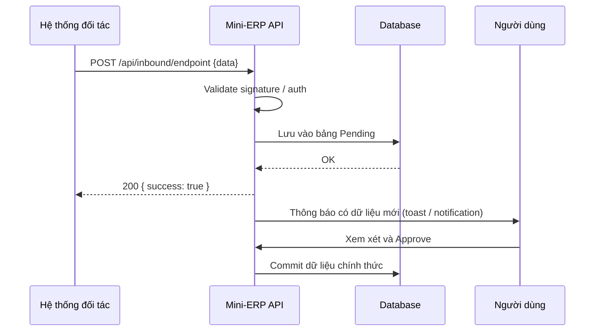

# Integration Specification - <Tên tích hợp>

> **File**: `docs/ba/integration/INTEGRATION_TaskXXX_<slug>.md`
> **Người viết**: Agent BA
> **Ngày tạo**: <DD/MM/YYYY>
> **Trạng thái**: Draft | Approved
> **Nguồn PRD**: `docs/ba/prd/PRD_TaskXXX_<slug>.md`

---

## 1. Tổng quan Tích hợp

- **Hệ thống tích hợp**: <Tên hệ thống đối tác / bên thứ ba>
- **Loại tích hợp**: REST API / Webhook / SDK / File Exchange
- **Hướng**: 
  - [ ] Mini-ERP **gọi ra** (Outbound) — gọi API của đối tác
  - [ ] Đối tác **gọi vào** (Inbound) — đối tác call API của Mini-ERP
  - [ ] Hai chiều (Bidirectional)
- **Mục đích**: <Tính năng nghiệp vụ cần tích hợp để đạt được>

---

## 2. Partner API Analysis (Outbound — Gọi API đối tác ra)

> *Điền nếu Mini-ERP gọi ra API của bên đối tác.*

### 2.1 Thông tin API đối tác

| Mục | Thông tin |
| :--- | :--- |
| Base URL | `https://api.partner.com/v1` |
| Authentication | Bearer Token / OAuth2 / API Key |
| Rate Limit | <ví dụ: 100 request/phút> |
| Documentation | <URL tài liệu> |

### 2.2 Danh sách Endpoint sử dụng

| Endpoint | Method | Mục đích |
| :--- | :--- | :--- |
| `/api/endpoint1` | GET | <Lấy dữ liệu gì> |
| `/api/endpoint2` | POST | <Gửi dữ liệu gì> |

### 2.3 Mapping dữ liệu (Partner → Mini-ERP)

| Field đối tác | Field trong hệ thống | Bảng DB | Transform |
| :--- | :--- | :--- | :--- |
| `partner_field_1` | `our_field_1` | `<TableName>` | None / formatDate / ... |
| `partner_field_2` | `our_field_2` | `<TableName>` | <mô tả transform> |

---

## 3. Integration Spec (Inbound — Đối tác gọi vào)

> *Điền nếu Mini-ERP mở API cho đối tác gọi vào.*

### 3.1 Endpoint Mini-ERP cung cấp

| Endpoint | Method | Mô tả | Auth |
| :--- | :--- | :--- | :--- |
| `/api/inbound/endpoint1` | POST | <Nhận dữ liệu gì> | API Key / Token |

### 3.2 Request Schema (Inbound)

```json
{
  "field1": "string — required",
  "field2": "number — required, > 0",
  "field3": "string — optional"
}
```

### 3.3 Response Schema

```json
{
  "success": true,
  "message": "Tiếp nhận thành công",
  "data": {
    "id": "string"
  }
}
```

---

## 4. Luồng Tích hợp (Sequence Diagram)



---

## 5. Error Handling & Retry

| Lỗi | Xử lý |
| :--- | :--- |
| Đối tác không phản hồi (timeout) | Retry 3 lần với backoff, sau đó alert admin |
| Đối tác trả về lỗi 4xx | Log error, toast cho user, không retry |
| Đối tác trả về lỗi 5xx | Retry 3 lần, sau đó mark failed |
| Data không hợp lệ (schema mismatch) | Reject, log chi tiết, không lưu DB |

---

## 6. Security

- [ ] Mọi outbound request đều dùng HTTPS
- [ ] Không lưu API Key / Secret dưới dạng plaintext (dùng env variable)
- [ ] Inbound requests được validate signature / API Key
- [ ] Dữ liệu nhạy cảm được mask trong logs

---

## 7. Audit & Monitoring

| Loại log | Bảng / Service | Nội dung |
| :--- | :--- | :--- |
| Inbound request | `SystemLogs` / `IntegrationLogs` | timestamp, partner_id, payload hash, status |
| Outbound request | `SystemLogs` | endpoint, status_code, response_time |
| Data mapping errors | `SystemLogs` | field, expected_type, actual_value |

---

## 8. Quy tắc Nghiệp vụ (Business Rules)

- **BR01**: Dữ liệu từ đối tác KHÔNG được tự động commit vào DB chính. Phải qua bước **Human-in-the-Loop** (Pending → User Review → Confirm).
- **BR02**: <Ràng buộc nghiệp vụ cụ thể>
- **BR03**: <Ràng buộc tần suất / rate limit>

---

## 9. Acceptance Criteria

```gherkin
Scenario: Nhận dữ liệu từ đối tác thành công
  Given đối tác gửi request hợp lệ đến /api/inbound/endpoint
  When API validate thành công
  Then dữ liệu được lưu trạng thái Pending
  And người dùng nhận được thông báo có dữ liệu mới

Scenario: Đối tác gửi dữ liệu không hợp lệ
  Given đối tác gửi request thiếu field bắt buộc
  When API validate
  Then trả về 400 Bad Request với mô tả lỗi cụ thể
  And không lưu gì vào DB

Scenario: Đối tác gọi sai API Key
  Given request không có API Key hợp lệ
  When API nhận request
  Then trả về 401 Unauthorized
  And log lại attempt này
```

---

## 10. Open Questions

- <Câu hỏi về API đối tác chưa được giải đáp>

---

## 11. Kế tiếp (Next Steps)

- [ ] Confirm thông tin API với đối tác
- [ ] **Agent TECH_LEAD** review Integration Spec này để viết ADR nếu cần
- [ ] **Agent DEV** implement theo spec này + TDD
