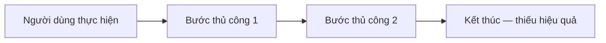
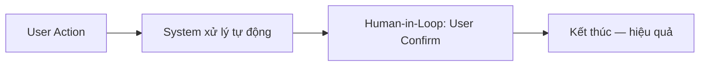
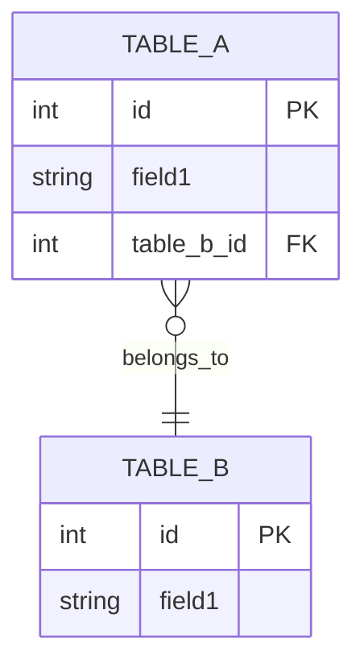
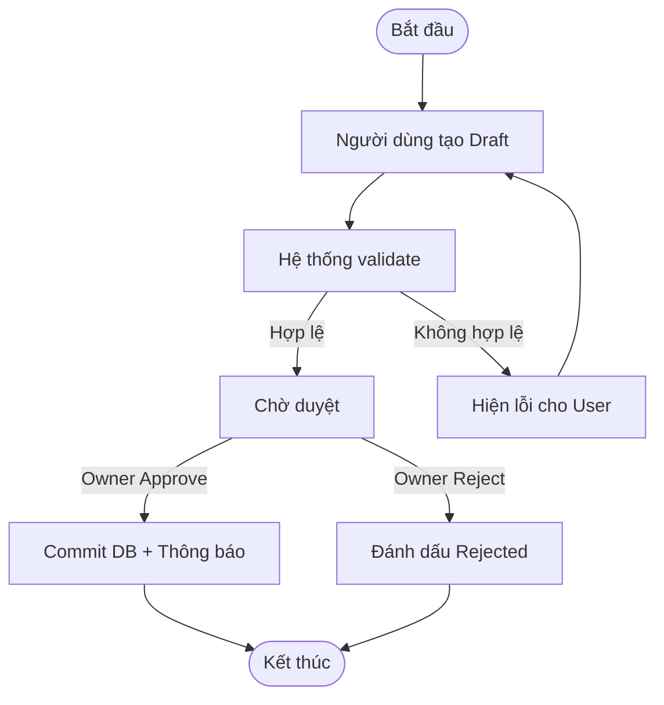

# PRD - <Tên sản phẩm / Tính năng>

> **File**: `docs/ba/prd/PRD_TaskXXX_<slug>.md`
> **Người viết**: Agent BA
> **Ngày tạo**: <DD/MM/YYYY>
> **Phiên bản**: 1.0
> **Trạng thái**: Draft | Approved | Deprecated
> **Nguồn Elicitation**: `docs/ba/elicitation/ELICITATION_TaskXXX_<slug>.md`

---

## 1. Tổng quan sản phẩm (Product Overview)

### 1.1 Vấn đề cần giải quyết

> *Mô tả nỗi đau (pain point) cụ thể của người dùng. Trả lời: "Ai đang gặp vấn đề gì và tại sao nó quan trọng?"*

<Mô tả vấn đề cụ thể>

### 1.2 Mục tiêu kinh doanh

- **Mục tiêu chính**: <Ví dụ: Giảm thời gian nhập liệu thủ công 50%>
- **Mục tiêu phụ**: <Ví dụ: Tăng độ chính xác dữ liệu tồn kho>
- **Đo lường thành công**: <KPI cụ thể, ví dụ: < 3 click để hoàn thành task X>

### 1.3 Stakeholders

| Stakeholder | Vai trò | Mối quan tâm chính |
| :--- | :--- | :--- |
| Owner | Phê duyệt, quyết định | Độ tin cậy, bảo mật |
| Staff | Người dùng chính | Dễ dùng, nhanh, mobile |
| Admin | Quản trị hệ thống | Phân quyền, audit log |

---

## 2. Phạm vi (Scope)

### 2.1 In-scope (Làm trong lần này)

- <Tính năng 1>
- <Tính năng 2>
- <Tính năng 3>

### 2.2 Out-of-scope (KHÔNG làm để tránh bloat)

- <Tính năng X — lý do không làm>
- <Tính năng Y — để lại sprint sau>

---

## 3. Phân tích Quy trình (Process Analysis)

### 3.1 Quy trình hiện tại (AS-IS)

> **Điểm đau AS-IS**: <Liệt kê vấn đề của quy trình hiện tại>

### 3.2 Quy trình đề xuất (TO-BE)

> **Cải tiến TO-BE**: <Liệt kê điểm cải tiến so với AS-IS>

---

## 4. Danh sách Use Cases

| ID | Use Case | Actor chính | Mức độ ưu tiên |
| :--- | :--- | :--- | :--- |
| UC01 | <Tên Use Case 1> | Owner / Staff / Admin | Must |
| UC02 | <Tên Use Case 2> | <Actor> | Should |
| UC03 | <Tên Use Case 3> | <Actor> | Could |

---

## 5. Sơ đồ Thực thể (ERD)

> *Liệt kê bảng DB bị ảnh hưởng. Bảng phải tồn tại trong `docs/database/tables/*.md`.*

| Bảng | Tác động | Ghi chú |
| :--- | :--- | :--- |
| `<TableName>` | INSERT / UPDATE / READ | <Trường quan trọng, constraint> |

---

## 6. Danh sách Epic & User Stories

### Epic 1: <Tên Epic>

- **US01**: Là một <vai trò>, tôi muốn <hành động> để <giá trị>.
- **US02**: Là một <vai trò>, tôi muốn <hành động> để <giá trị>.

### Epic 2: <Tên Epic>

- **US03**: Là một <vai trò>, tôi muốn <hành động> để <giá trị>.

---

## 7. Phân quyền (RBAC)

| Hành động | Owner | Staff | Admin |
| :--- | :---: | :---: | :---: |
| <Hành động 1> | ✅ | ✅ | ✅ |
| <Hành động 2> (Approve) | ✅ | ❌ | ✅ |
| <Hành động 3> | ❌ | ✅ | ✅ |

- **Xử lý thiếu quyền (403)**: Toast: "Bạn không có quyền thực hiện hành động này"

---

## 8. Quy tắc Nghiệp vụ (Business Rules)

- **BR01**: <Ràng buộc dữ liệu — ví dụ: quantity > 0>
- **BR02**: <Điều kiện nghiệp vụ — ví dụ: không thể xóa khi đang có đơn hàng liên quan>
- **BR03**: <Human-in-the-Loop — khi nào cần user confirm>
- **BR04**: <Transaction — khi nào cần rollback>

---

## 9. Quy trình Nghiệp vụ Đầy đủ (Business Flow BPMN)

---

## 10. Non-Functional Requirements (NFR)

| NFR | Yêu cầu |
| :--- | :--- |
| **Performance** | Trang load < 2s, API response < 500ms |
| **Mobile-First** | Responsive tất cả breakpoints (< 640px, 640–1024px, > 1024px) |
| **Accessibility** | Touch targets ≥ 44px, aria-label cho icon buttons |
| **Security** | Role-based access, audit log khi có thay đổi dữ liệu |

---

## 11. Open Questions

- <Câu hỏi chưa rõ — sẽ cover trong User Story Spec>

---

## 12. Kế tiếp (Next Steps)

- [ ] **Owner review & approve PRD này**
- [ ] Chuyển sang **Trụ 3: Prototype** — tạo Mockup Prompt theo Epic/Story list ở mục 6
- [ ] Sau khi Prototype xong → **Trụ 4: User Story Spec** cho từng Story
- [ ] Sau khi USS xong → Bàn giao **Agent PM** tạo Task
