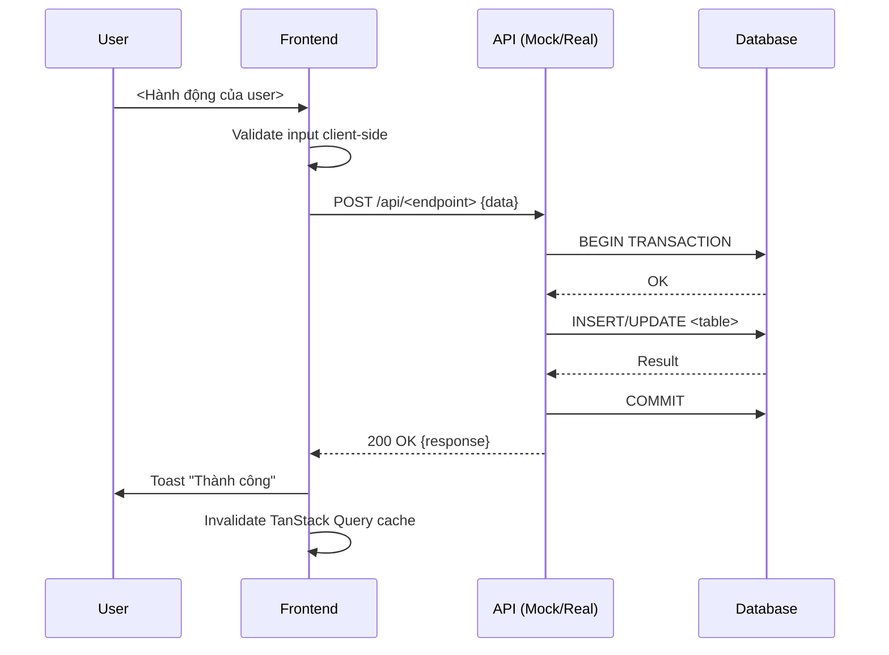

# User Story Specification - <Tên Story>

> **File**: `docs/ba/user-story-specs/USS_TaskXXX_StoryYYY_<slug>.md`
> **Người viết**: Agent BA
> **Ngày tạo**: <DD/MM/YYYY>
> **Nguồn PRD**: `docs/ba/prd/PRD_TaskXXX_<slug>.md`
> **Nguồn Mockup**: `docs/ba/prototype/PROTO_TaskXXX_<slug>.md`
> **Trạng thái**: Draft | Ready for Dev | Done

---

## 1. User Story

> **Là một** `<vai trò>`, **tôi muốn** `<hành động>` **để** `<giá trị>`.

- **Mã Story**: `StoryYYY`
- **Epic**: `<Tên Epic>`
- **Mức độ ưu tiên**: Must / Should / Could
- **Story Points**: <ước lượng>

---

## 2. Data Model (Dữ liệu liên quan)

| Bảng | Thao tác | Fields chính |
| :--- | :--- | :--- |
| `<TableName>` | INSERT / UPDATE / READ | `field1`, `field2` |

> *Bảng phải tồn tại trong `docs/database/tables/*.md`*

---

## 3. UI Spec (Đặc tả Giao diện)

### 3.1 Layout theo Breakpoint

**Mobile (< 640px):**
- Bố cục: <1 cột / card view / bottom sheet>
- Ẩn/hiện: <danh sách cột bị ẩn trên mobile>
- Hành động nhanh: <nút nổi, swipe action>

**Tablet (640–1024px):**
- Bố cục: <2 cột / sidebar thu gọn>
- <Điều chỉnh cụ thể>

**Desktop (> 1024px):**
- Bố cục: <bảng đầy đủ / sidebar rộng>
- <Điều chỉnh cụ thể>

### 3.2 Components (Shadcn UI)

| Component | Mục đích | Props / Config quan trọng |
| :--- | :--- | :--- |
| `<Button>` | <Hành động> | `variant="default"`, `size="sm"` |
| `<Dialog>` | <Popup xác nhận> | `open`, `onOpenChange` |
| `<DataTable>` | <Hiển thị danh sách> | `columns`, `data`, `pagination` |
| `<Toast>` (sonner) | <Thông báo kết quả> | `toast.success()`, `toast.error()` |
| `<Select>` | <Dropdown lọc> | `onValueChange` |
| `<Input>` | <Ô nhập liệu> | `placeholder`, `type`, validation |

### 3.3 States bắt buộc

| State | Hiển thị | Chi tiết |
| :--- | :--- | :--- |
| **Loading** | Skeleton / Spinner | `<Skeleton>` trong lúc fetch |
| **Empty** | Empty State + CTA | Text: "Chưa có dữ liệu. [Thêm mới]" |
| **Error 401** | Redirect | `→ /login` |
| **Error 403** | Toast | "Bạn không có quyền thực hiện hành động này" |
| **Error 500** | Toast | "Hệ thống đang bận, vui lòng thử lại sau" |
| **Success** | Toast | "<Hành động> thành công!" |

---

## 4. Sequence Spec (Luồng Dữ liệu)



---

## 5. Activity Rule Spec (Quy tắc Hành động)

### 5.1 Validation Rules (Client-side)

| Field | Rule | Thông báo lỗi |
| :--- | :--- | :--- |
| `<field1>` | Required, minLength: 1 | "Trường này không được để trống" |
| `<field2>` | Must be > 0 | "Giá trị phải lớn hơn 0" |
| `<field3>` | Valid date format | "Định dạng ngày không hợp lệ" |

### 5.2 Business Logic (Server-side / Frontend)

| Điều kiện | Hành động |
| :--- | :--- |
| `<Điều kiện 1>` | `<Hành động hệ thống>` |
| `<Điều kiện 2>` | `<Thông báo / block / redirect>` |

### 5.3 Concurrency / Edge Cases

| Tình huống | Xử lý |
| :--- | :--- |
| 2 user cùng sửa 1 record | Toast "Dữ liệu đã bị thay đổi. Tải lại trang." + reload |
| Mạng lỗi khi submit | Retry tự động 1 lần, nếu vẫn lỗi → Toast + giữ form |
| Dữ liệu quá lớn | Phân trang, default pageSize=20 |

---

## 6. Technical Mapping (Frontend)

- **Route**: `<ví dụ: /inventory/inbound>`
- **Feature folder**: `mini-erp/src/features/<feature>/`
  - **Page**: `pages/<PageName>.tsx`
  - **Components**: `components/<ComponentName>.tsx`
  - **Types**: `types.ts`
  - **API Hook**: `api/use<Feature>Query.ts` (TanStack Query v5)
- **State management**:
  - Server state: **TanStack Query v5** (`useQuery`, `useMutation`, `invalidateQueries`)
  - Client UI state: **Zustand** (nếu cần — ví dụ: filter state, modal open/close)
- **Optimistic Updates**: `onMutate` + `onError rollback` nếu có mutation quan trọng

---

## 7. Acceptance Criteria (BDD / Gherkin)

### 7.1 Happy Paths

```gherkin
Scenario: <Tên kịch bản thành công>
  Given <điều kiện ban đầu hợp lệ>
  When <hành động của user>
  Then <kết quả mong đợi>
  And <trạng thái UI sau>
```

```gherkin
Scenario: <Tên kịch bản thành công 2>
  Given <điều kiện ban đầu>
  When <hành động>
  Then <kết quả>
```

### 7.2 Unhappy Paths

```gherkin
Scenario: <Tên kịch bản lỗi — thiếu quyền>
  Given user không có quyền thực hiện <hành động>
  When user cố gắng thực hiện <hành động>
  Then hiển thị Toast: "Bạn không có quyền thực hiện hành động này"
  And dữ liệu không thay đổi
```

```gherkin
Scenario: <Tên kịch bản lỗi — dữ liệu sai>
  Given user nhập <dữ liệu không hợp lệ>
  When user submit form
  Then hiển thị lỗi validation: "<Thông báo lỗi cụ thể>"
  And form không bị reset
```

```gherkin
Scenario: <Tên kịch bản lỗi — server error>
  Given server trả về lỗi 500
  When user thực hiện <hành động>
  Then Toast: "Hệ thống đang bận, vui lòng thử lại sau"
  And dữ liệu không bị thay đổi
```

---

## 8. Open Questions

- <Điểm chưa rõ — cần hỏi thêm trước khi DEV implement>

---

## 9. Definition of Done (DoD)

- [ ] UI render đúng trên 3 breakpoint (Mobile / Tablet / Desktop)
- [ ] Loading skeleton hiển thị trong lúc fetch
- [ ] Empty state hiển thị khi không có dữ liệu
- [ ] Toast thành công / lỗi theo đúng spec
- [ ] Validation client-side hoạt động đúng
- [ ] Không có horizontal scroll trên mobile
- [ ] Touch targets ≥ 44px
- [ ] Không vi phạm RULES.md
