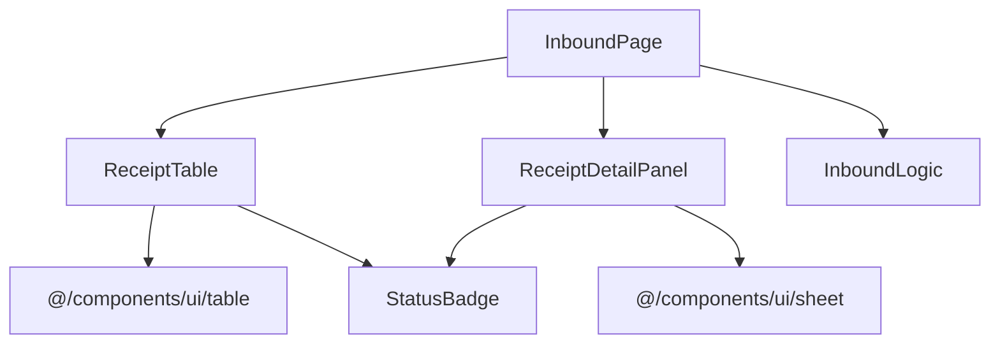

# CODEBASE ANALYSIS REPORT - Task025: Inbound Table Layout Refactor

**Status: Completed**
**Author:** Agent CODEBASE_ANALYST (acting via Antigravity)

## 1. Introduction
Phân tích hiện trạng codebase sau khi refactor giao diện Phiếu nhập kho từ dạng Card sang Table layout với Detail Panel (Sheet).

## 2. Inventory & Entry Points (Phase 1)
- **Primary Page**: `mini-erp/src/features/inventory/pages/InboundPage.tsx`
- **Core Components**:
  - `ReceiptTable.tsx`: Rendering table data, sticky headers, infinite scroll integration.
  - `ReceiptDetailPanel.tsx`: Sheet-based details, workflow visualization, approval actions.
- **Related Logic**: `mini-erp/src/features/inventory/mockData.ts` (data source).

## 3. Module Mapping & Dependencies (Phase 2)

## 4. Domain Model & Business Logic (Phase 3 & 4)
- **Domain**: `StockReceipt` (Mã phiếu, Nhà cung cấp, Ngày nhập, Người tạo, Tổng tiền, Trạng thái).
- **Business Rule (Workflow)**: 
  - Chỉ hiển thị nút Phê duyệt/Từ chối khi trạng thái là `Pending` và User có quyền `canApprove`.
  - Quy trình 4 bước: Nháp -> Chờ duyệt -> Phê duyệt / Từ chối.
- **UI Logic (Infinite Scroll)**: Load thêm 10 bản ghi khi người dùng cuộn xuống cuối danh sách (giới hạn 30 bản ghi trong mock).

## 5. Contract Surfaces (Phase 6)
- **ReceiptTable Contract**: 
  - Input: `StockReceipt[]`
  - Output: `onAction(receipt)` - Được kích hoạt khi click hàng hoặc nút con mắt.
- **ReceiptDetailPanel Contract**:
  - Input: `receipt`, `isOpen`, `onClose`, `canApprove`. (Currently `canApprove` is hardcoded to `true` in `InboundPage`).

## 6. Brittleness Hotspots (Phase 7)
- **CSS Coupling**: Sticky header dựa vào `overflow-y-auto` của container cha. Nếu container này bị đổi sang `overflow-hidden` hoặc bọc thêm layer không đúng, sticky sẽ hỏng.
- **Performance**: Việc render 30+ hàng kèm Badge có thể gây lag nhẹ trên thiết bị yếu nếu không sử dụng virtual list (tuy nhiên với 30-50 dòng thì chưa cần thiết).

## 7. Test Assessment (Phase 8 & 9)
- **Unit Tests**:
  - `ReceiptTable.test.tsx`: Đã kiểm tra render header, row count, click action.
  - `ReceiptDetailPanel.test.tsx`: Đã kiểm tra visibility, data rendering, RBAC buttons, close event.
- **E2E Tests**:
  - `inbound-table.spec.ts`: Playwright test chuyển đổi sang Table, mở Panel, infinite scroll.
- **Gaps**: 
  - Chưa test các trường hợp `receipt` null/undefined (về lý thuyết type TS đã chặn nhưng logic runtime cần check).
  - Chưa test mobile responsive layout của Table (hiện Table Shadcn dùng scroll ngang).

## 8. Recommendations (Phase 10)
1. **Quick Win**: Chuyển logic infinite scroll trong `InboundPage.tsx` thành một custom hook `useInfiniteScroll` để tái sử dụng cho các trang khác.
2. **Refactor**: Tách workflow stepper trong `ReceiptDetailPanel` thành component riêng để dùng cho Sales Order.
3. **Tech Debt**: Tích hợp thực tế với Auth store thay vì truyền `canApprove={true}`.

---
**CODEBASE_ANALYST done.** Brittle zones: 1 (CSS sticky dependence). Risks: 1 (Hardcoded RBAC).
