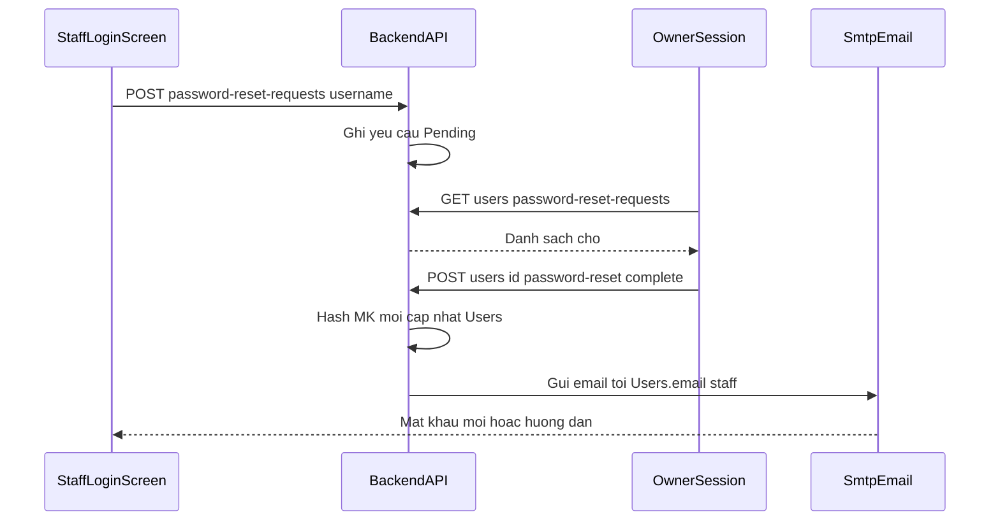

# 📄 API SPEC: Đặt lại mật khẩu nhân viên qua Owner (Staff → Owner → Email) - Task004

> **Trạng thái**: Approved  
> **Feature**: Authentication / UC3 Manage Staff Accounts  
> **Tags**: RESTful, Auth, Owner, Staff, Email

**Khung thiết kế dự án**: [`API_PROJECT_DESIGN.md`](API_PROJECT_DESIGN.md) §2–§3, §4.1, §4.4 (bổ sung cho UC3 — *Reset Account* khi nhân viên không đăng nhập được).

**Phạm vi nghiệp vụ**: Trong dự án này, **nhân viên (Staff)** không có luồng tự phục hồi mật khẩu qua email/link trên màn hình đăng nhập; **chỉ** có đường **gửi yêu cầu cho Owner** → Owner cấp mật khẩu mới → hệ thống **gửi email** tới `Users.email` của nhân viên.

---

## 0. Luồng nghiệp vụ (đã chốt)



1. **Staff** (chưa có phiên hợp lệ / quên MK / không đăng nhập được): bấm **“Gửi yêu cầu cho Owner”** → gọi **§1** (public, chỉ cần biết `username` của mình).  
2. **Owner** đăng nhập bình thường → xem danh sách yêu cầu (**§2**) → chọn nhân viên → **§3** hệ thống sinh mật khẩu mới (đủ độ phức tạp), `UPDATE Users.password_hash`, gửi **email tới `Users.email`** của nhân viên, thu hồi phiên cũ của nhân viên (an toàn).  
3. Staff đăng nhập lại bằng mật khẩu mới nhận qua email.

---

## 1. Endpoint §1 — Staff gửi yêu cầu (Public)

| Thuộc tính         | Giá trị                                      |
| :----------------- | :------------------------------------------- |
| **Endpoint**       | `/api/v1/auth/password-reset-requests`       |
| **Method**         | `POST`                                       |
| **Authentication** | `None`                                       |
| **RBAC**           | Public (chỉ dùng khi chưa đăng nhập)         |

### 1.1 Request Body

```json
{
  "username": "staff01",
  "message": "Em quên mật khẩu, nhờ anh/chị reset giúp."
}
```

- `username`: **bắt buộc** (khớp `Users.username`).  
- `message`: tuỳ chọn, hiển thị cho Owner trong hàng chờ.

### 1.2 Thành công — `200 OK`

```json
{
  "success": true,
  "data": {},
  "message": "Nếu tài khoản tồn tại, yêu cầu đã được gửi tới Owner. Bạn sẽ nhận email khi Owner xử lý xong."
}
```

**Bảo mật**: Luôn trả **cùng một** message thành công dù username có tồn tại hay không (giảm dò username), theo tinh thần **không tiết lộ** tài khoản có hay không.

### 1.3 Lỗi

- **400**: Thiếu `username` hoặc định dạng không hợp lệ.  
- **429** (tuỳ chọn triển khai): Quá nhiều yêu cầu từ cùng IP/username trong khoảng thời gian ngắn.

### 1.4 Logic DB (§1)

- Tra `SELECT id, status, role_id FROM Users WHERE username = ?` (cột tối thiểu).  
- Nếu không có user → **vẫn 200** + message chung (không tiết lộ).  
- Nếu user là **Owner** (hoặc role không phải nhân viên theo policy dự án): có thể **200** im lặng không tạo yêu cầu, hoặc **403** — cần thống nhất; **khuyến nghị**: chỉ cho phép role **Staff** (và tương đương) tạo yêu cầu; **Owner** quên mật khẩu xử lý **ngoài phạm vi spec này** (kênh nội bộ / quản trị hệ thống — không có endpoint self-service trong catalog hiện tại).  
- **INSERT** bảng lưu yêu cầu (xem §4 dưới). Trạng thái `Pending`.  
- Ghi `SystemLogs` (không ghi plaintext password).

---

## 2. Endpoint §2 — Owner xem hàng chờ

| Thuộc tính         | Giá trị                                      |
| :----------------- | :------------------------------------------- |
| **Endpoint**       | `/api/v1/users/password-reset-requests`      |
| **Method**         | `GET`                                        |
| **Authentication** | `Bearer` (bắt buộc)                            |
| **RBAC**           | **Owner** (và Admin nếu policy cho phép thay Owner) |

### 2.1 Query Parameters

| Tham số | Kiểu | Bắt buộc | Mô tả |
| :------ | :--- | :------- | :---- |
| `status` | string | Không | Mặc định `Pending` — lọc `Pending` / `Processed` / `Cancelled` |
| `page`, `limit` | int | Không | Phân trang |

### 2.2 Thành công — `200 OK`

```json
{
  "success": true,
  "data": {
    "items": [
      {
        "id": 1,
        "userId": 5,
        "username": "staff01",
        "fullName": "Nguyễn A",
        "message": "Em quên mật khẩu...",
        "status": "Pending",
        "createdAt": "2026-04-23T10:00:00Z"
      }
    ],
    "page": 1,
    "total": 1
  },
  "message": "Thành công"
}
```

### 2.3 Lỗi

- **401 / 403**: Không phải Owner (hoặc không đủ quyền).

### 2.4 Logic DB (§2)

- **SELECT** từ bảng yêu cầu (§4), join `Users` để lấy `username`, `full_name` (không trả `password_hash`).

---

## 3. Endpoint §3 — Owner hoàn tất: cấp mật khẩu mới + gửi email

| Thuộc tính         | Giá trị                                      |
| :----------------- | :------------------------------------------- |
| **Endpoint**       | `/api/v1/users/{userId}/password-reset/complete` |
| **Method**         | `POST`                                       |
| **Authentication** | `Bearer` (Owner)                             |
| **RBAC**           | **Owner**                                    |

### 3.1 Request Body

```json
{
  "requestId": 1
}
```

- `requestId`: id bản ghi yêu cầu từ §2 (đảm bảo Owner xử lý đúng hàng chờ). **Bắt buộc** nếu có nhiều yêu cầu cho cùng user; nếu hệ thống chỉ cho 1 `Pending`/user thì có thể chỉ cần `userId` trên path — **khuyến nghị** giữ `requestId` để idempotent.

### 3.2 Thành công — `200 OK`

```json
{
  "success": true,
  "data": {
    "userId": 5,
    "emailSentTo": "staff@domain.com"
  },
  "message": "Đã cấp mật khẩu mới và gửi email cho nhân viên."
}
```

**Lưu ý**: Không trả plaintext mật khẩu trong JSON response (chỉ gửi qua email). Nếu email lỗi SMTP, trả **502** hoặc **500** kèm message tiếng Việt và **không** commit đổi mật khẩu (transaction).

### 3.3 Lỗi

- **400**: `requestId` không khớp `userId` hoặc trạng thái không còn `Pending`.  
- **403**: Owner không được reset user ngoài phạm vi (nếu sau này đa cửa hàng). Đơn cửa hàng: mọi Owner reset mọi Staff.  
- **404**: Không tìm thấy user/request.

### 3.4 Logic DB (§3)

1. Khóa transaction.  
2. Kiểm tra request `Pending` thuộc `userId`.  
3. Sinh **mật khẩu ngẫu nhiên** đủ độ dài (ví dụ 12 ký tự, chữ + số + ký tự đặc biệt theo policy).  
4. `UPDATE Users SET password_hash = ?, updated_at = NOW() WHERE id = ?`.  
5. Gửi email tới `Users.email` (nội dung: username + mật khẩu mới tạm + khuyến nghị đổi sau khi đăng nhập — nếu sau này có cột `must_change_password` thì set tại đây).  
6. Đánh dấu request `Processed`, `processed_by = Owner.id`, `processed_at = NOW()`.  
7. Thu hồi refresh / xóa session nhân viên (đồng bộ **Task002** — `DEL current_session:user:{staffId}`).  
8. `SystemLogs` action ví dụ `OWNER_PASSWORD_RESET`.

---

## 4. Bảng dữ liệu đề xuất (chưa có trong `schema.sql` hiện tại)

Backend Spring Boot nên thêm migration, ví dụ:

```sql
CREATE TABLE staff_password_reset_requests (
    id            SERIAL PRIMARY KEY,
    user_id       INT NOT NULL REFERENCES Users(id) ON DELETE CASCADE,
    message       TEXT,
    status        VARCHAR(20) NOT NULL DEFAULT 'Pending'
                  CHECK (status IN ('Pending', 'Processed', 'Cancelled')),
    processed_by  INT REFERENCES Users(id) ON DELETE SET NULL,
    created_at    TIMESTAMP NOT NULL DEFAULT CURRENT_TIMESTAMP,
    processed_at  TIMESTAMP
);
CREATE INDEX idx_sp_reset_user_status ON staff_password_reset_requests(user_id, status);
```

Cho đến khi có bảng: có thể lưu tạm trong Redis + id sequence — spec này ưu tiên **bảng** để Owner reload sau restart.

---

## 5. Zod Schema (Frontend)

```typescript
import { z } from "zod";

export const PasswordResetRequestSchema = z.object({
  username: z.string().min(1, "Vui lòng nhập tên đăng nhập"),
  message: z.string().max(500).optional(),
});

export const OwnerCompletePasswordResetSchema = z.object({
  requestId: z.number().int().positive("Mã yêu cầu không hợp lệ"),
});
```
