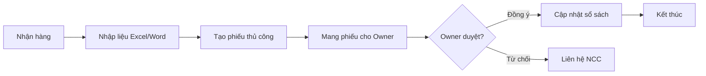
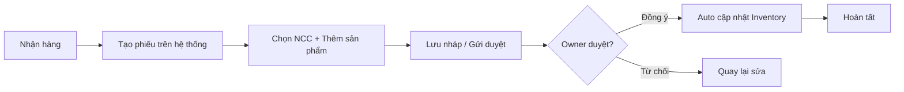
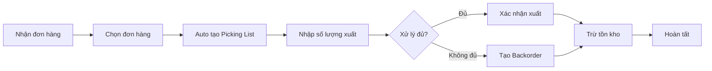
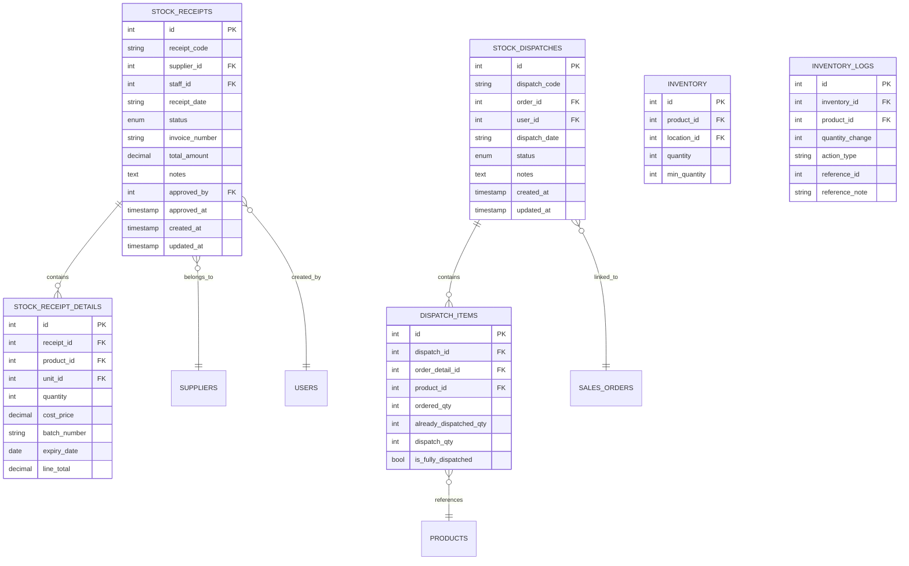
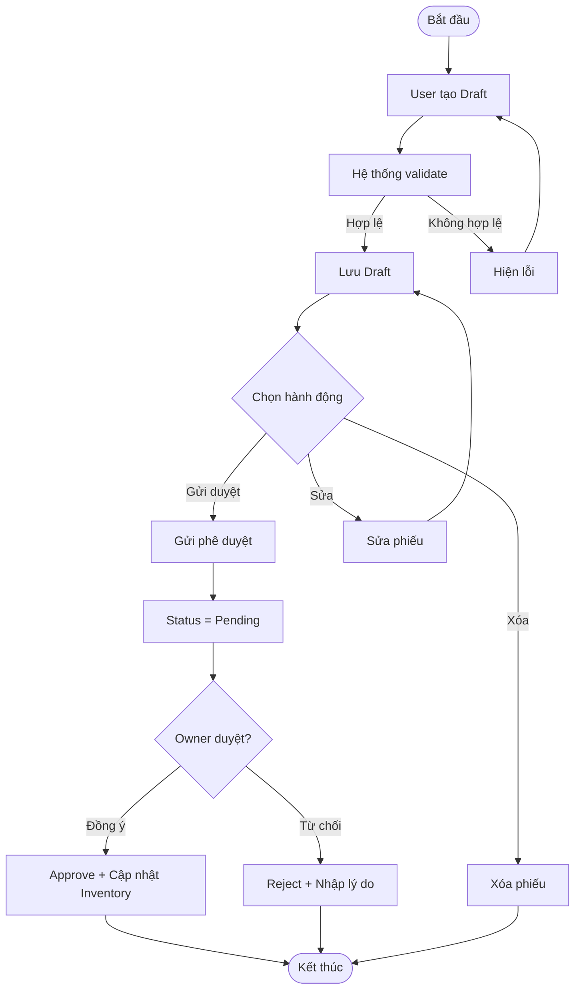

# PRD - CRUD Phiếu Nhập Kho & Xuất Kho

> **File**: `docs/ba/prd/PRD_Task039_inbound-dispatch-crud.md`
> **Người viết**: Agent BA
> **Ngày tạo**: 18/04/2026
> **Phiên bản**: 1.0
> **Trạng thái**: Approved ✅
> **Nguồn Elicitation**: `docs/ba/elicitation/ELICITATION_Task039_inbound-dispatch-crud.md`

---

## 1. Tổng quan sản phẩm (Product Overview)

### 1.1 Vấn đề cần giải quyết

Hiện tại, giao diện **Phiếu Nhập Kho** và **Xuất Kho** mới chỉ có chức năng **Read** (xem danh sách + xem chi tiết). Các chức năng **Create/Update/Delete** và **Workflow** (phê duyệt/từ chối) chưa được triển khai. Nhân viên kho không thể:
- Tạo phiếu nhập khi nhận hàng từ nhà cung cấp
- Tạo phiếu xuất khi giao hàng cho khách
- Gửi phiếu phê duyệt (workflow)
- Xác nhận xuất kho (trừ tồn kho)

### 1.2 Mục tiêu kinh doanh

- **Mục tiêu chính**: Cho phép Staff tạo/sửa/xóa phiếu nhập/xuất kho trực tiếp trên hệ thống
- **Mục tiêu phụ**: Triển khai workflow phê duyệt để Owner kiểm soát
- **Đo lường thành công**: Tạo phiếu mới trong < 1 phút, không cần nhập liệu thủ công

### 1.3 Stakeholders

| Stakeholder | Vai trò | Mối quan tâm chính |
| :--- | :--- | :--- |
| Owner | Phê duyệt phiếu nhập, giám sát tồn kho | Độ chính xác dữ liệu, kiểm soát chi phí |
| Staff | Tạo phiếu, xuất/nhập kho | Thao tác nhanh trên mobile |
| Kế toán | Theo dõi chi phí nhập hàng | Đối chiếu công nợ |

---

## 2. Phạm vi (Scope)

### 2.1 In-scope (Làm trong lần này)

**Module Phiếu Nhập Kho:**
- Tạo phiếu nhập mới (Create)
- Sửa phiếu nhập (Update) - chỉ Draft
- Xóa phiếu nhập (Delete) - chỉ Draft
- Gửi phê duyệt (Submit) - Draft → Pending
- Phê duyệt (Approve) - Pending → Approved + cập nhật Inventory
- Từ chối (Reject) - Pending → Rejected + nhập lý do
- Hủy phiếu (Cancel) - Draft/Pending → Cancelled

**Module Phiếu Xuất Kho:**
- Tạo phiếu xuất mới (Create) - chọn từ đơn hàng
- Nhập số lượng xuất thực tế (Update)
- Xác nhận xuất kho (Confirm) - trừ tồn kho
- Hủy phiếu (Cancel) - Pending → Cancelled
- Xem Picking List (vị trí lấy hàng)
- Xử lý Partial (xuất không đủ → tạo backorder)

**Chung cho cả 2 module:**
- Export danh sách (Excel/CSV)
- Import danh sách (Excel/CSV)
- In phiếu (PDF) - placeholder

### 2.2 Out-of-scope (KHÔNG làm để tránh bloat)

- **Scan OCR** - Button có nhưng để lại phase sau (cần API bên ngoài)
- **Auto-generate từ đơn đặt hàng** - có thể tích hợp sau
- **Tích hợp với máy in mã vạch** - phase sau
- **SMS/Email notifications** - phase sau
- **Báo cáo chi tiết** - phase sau

---

## 3. Phân tích Quy trình (Process Analysis)

### 3.1 Quy trình Phiếu Nhập Kho (AS-IS)

> **Điểm đau AS-IS**: Nhập liệu thủ công, dễ sai sót, mất thời gian

### 3.2 Quy trình Phiếu Nhập Kho (TO-BE)

> **Cải tiến TO-BE**: Không nhập liệu thủ công, tự động cập nhật tồn kho

### 3.3 Quy trình Phiếu Xuất Kho (TO-BE)

> **Cải tiến TO-BE**: Picking List tự động, trừ tồn kho ngay

---

## 4. Danh sách Use Cases

| ID | Use Case | Actor chính | Mức độ ưu tiên |
| :--- | :--- | :--- | :--- |
| UC01 | Tạo phiếu nhập mới | Staff | Must |
| UC02 | Sửa phiếu nhập Draft | Staff | Must |
| UC03 | Xóa phiếu nhập Draft | Staff | Must |
| UC04 | Gửi phê duyệt phiếu nhập | Staff | Must |
| UC05 | Phê duyệt phiếu nhập | Owner | Must |
| UC06 | Từ chối phiếu nhập | Owner | Must |
| UC07 | Hủy phiếu nhập | Staff/Owner | Should |
| UC08 | Tạo phiếu xuất từ đơn hàng | Staff | Must |
| UC09 | Nhập số lượng xuất thực tế | Staff | Must |
| UC10 | Xác nhận xuất kho | Staff | Must |
| UC11 | Hủy phiếu xuất | Staff/Owner | Should |
| UC12 | Xem Picking List | Staff | Must |
| UC13 | Xử lý xuất một phần (Partial) | Staff | Could |
| UC14 | Export phiếu | Staff/Owner | Should |
| UC15 | Import phiếu | Staff/Owner | Could |

---

## 5. Sơ đồ Thực thể (ERD)

| Bảng | Tác động | Ghi chú |
| :--- | :--- | :--- |
| `stock_receipts` | INSERT, UPDATE, DELETE | Core table cho phiếu nhập |
| `stock_receipt_details` | INSERT, DELETE | Chi tiết từng dòng nhập |
| `stock_dispatches` | INSERT, UPDATE, DELETE | Core table cho phiếu xuất |
| `dispatch_items` | INSERT, UPDATE | Chi tiết từng dòng xuất |
| `inventory` | UPDATE | Cập nhật tồn kho khi duyệt nhập/xuất |
| `inventory_logs` | INSERT | Audit trail cho mọi thay đổi |

---

## 6. Danh sách Epic & User Stories

### Epic 1: Quản lý Phiếu Nhập Kho

- **US01**: Là một Staff, tôi muốn tạo phiếu nhập mới để ghi nhận hàng nhập từ NCC.
- **US02**: Là một Staff, tôi muốn sửa phiếu nhập đang ở trạng thái Draft để chỉnh sửa sai sót.
- **US03**: Là một Staff, tôi muốn xóa phiếu nhập Draft để loại bỏ phiếu không hợp lệ.
- **US04**: Là một Staff, tôi muốn gửi phiếu nhập để Owner phê duyệt.
- **US05**: Là một Owner, tôi muốn phê duyệt phiếu nhập để cập nhật tồn kho.
- **US06**: Là một Owner, tôi muốn từ chối phiếu nhập để yêu cầu chỉnh sửa.

### Epic 2: Quản lý Phiếu Xuất Kho

- **US07**: Là một Staff, tôi muốn tạo phiếu xuất từ đơn hàng để ghi nhận xuất hàng.
- **US08**: Là một Staff, tôi muốn nhập số lượng xuất thực tế để xác nhận đã lấy hàng.
- **US09**: Là một Staff, tôi muốn xác nhận xuất kho để trừ tồn kho.
- **US10**: Là một Staff, tôi muốn xem Picking List để biết lấy hàng ở đâu.
- **US11**: Là một Staff, tôi muốn xử lý xuất một phần khi không đủ hàng.

### Epic 3: Workflow & Actions

- **US12**: Là một Staff, tôi muốn hủy phiếu khi có sai sót để đình chỉ giao dịch.
- **US13**: Là một Owner, tôi muốn hủy phiếu của Staff để quản lý.

---

## 7. Phân quyền (RBAC)

| Hành động | Owner | Staff | Admin |
| :--- | :---: | :---: | :---: |
| Tạo phiếu nhập | ✅ | ✅ | ✅ |
| Sửa phiếu Draft | ✅ | ✅ | ✅ |
| Xóa phiếu Draft | ✅ | ✅ | ✅ |
| Gửi phê duyệt | ✅ | ✅ | ✅ |
| Phê duyệt phiếu | ✅ | ❌ | ✅ |
| Từ chối phiếu | ✅ | ❌ | ✅ |
| Hủy phiếu Pending | ✅ | ✅ | ✅ |
| Hủy phiếu Approved | ✅ | ❌ | ✅ |
| Tạo phiếu xuất | ✅ | ✅ | ✅ |
| Nhập số lượng xuất | ✅ | ✅ | ✅ |
| Xác nhận xuất kho | ✅ | ✅ | ✅ |
| Xem Picking List | ✅ | ✅ | ✅ |
| Export/Import | ✅ | ✅ | ✅ |

- **Xử lý thiếu quyền (403)**: Toast: "Bạn không có quyền thực hiện hành động này"

---

## 8. Quy tắc Nghiệp vụ (Business Rules)

- **BR01**: Chỉ sửa/xóa được phiếu khi `status = Draft`
- **BR02**: Sau khi phê duyệt phiếu nhập → Tự động UPDATE `inventory.quantity += receiptQty`
- **BR03**: Sau khi xác nhận xuất phiếu → Tự động UPDATE `inventory.quantity -= dispatchQty`
- **BR04**: Tất cả thay đổi tồn kho phải ghi `inventory_logs` (audit trail)
- **BR05**: Khi xuất không đủ (`dispatchQty < remainingQty`) → Tạo Backorder record
- **BR06**: Không thể sửa phiếu khi `status = Approved` hoặc `status = Full`
- **BR07**: Workflow tuyến tính: Draft → Pending → Approved/Rejected (không nhảy bước)
- **BR08**: Total amount tự động tính từ SUM(details.quantity × details.costPrice)

---

## 9. Quy trình Nghiệp vụ Đầy đủ (Business Flow BPMN)

---

## 10. Non-Functional Requirements (NFR)

| NFR | Yêu cầu |
| :--- | :--- |
| **Performance** | Trang load < 2s, API response < 500ms |
| **Mobile-First** | Responsive tất cả breakpoints (< 640px, 640–1024px, > 1024px) |
| **Accessibility** | Touch targets ≥ 44px, aria-label cho icon buttons |
| **Security** | Role-based access, audit log khi có thay đổi dữ liệu |
| **Data Integrity** | Transaction rollback nếu lỗi, không để lại orphaned records |

---

## 11. Open Questions

- [ ] **OCR**: Có cần tích hợp OCR ngay trong phase này không?
- [ ] **Email/SMS**: Có gửi notification khi phiếu được duyệt/từ chối không?
- [ ] **In phiếu**: Format PDF như thế nào? (để placeholder)

---

## 12. Kế tiếp (Next Steps)

- [ ] **Owner review & approve PRD này**
- [ ] Chuyển sang **Trụ 3: Prototype** — tạo Mockup Prompt theo Epic/Story list ở mục 6
- [ ] Sau khi Prototype xong → **Trụ 4: User Story Spec** cho từng Story
- [ ] Sau khi USS xong → Bàn giao **Agent PM** tạo Task

---

> **Status**: ✅ PRD Complete - Ready for Prototype