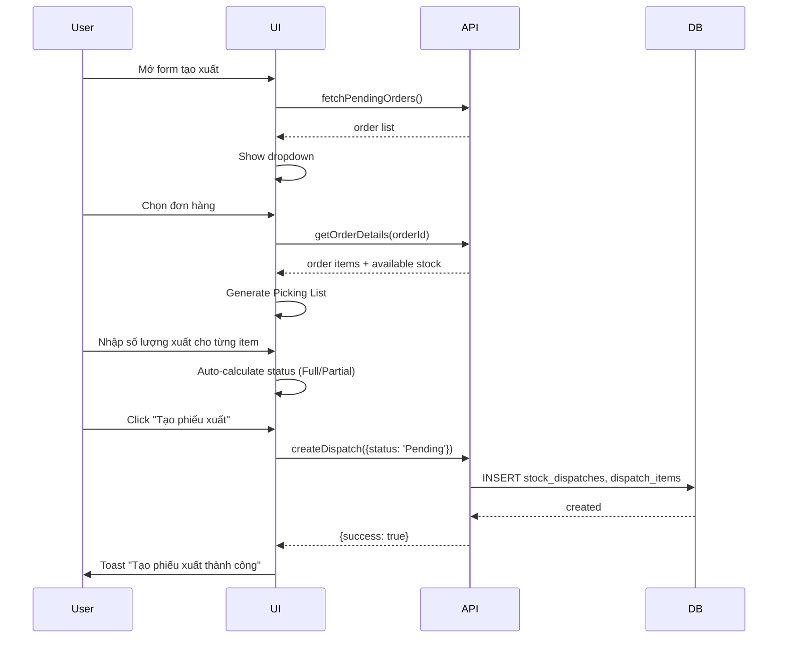
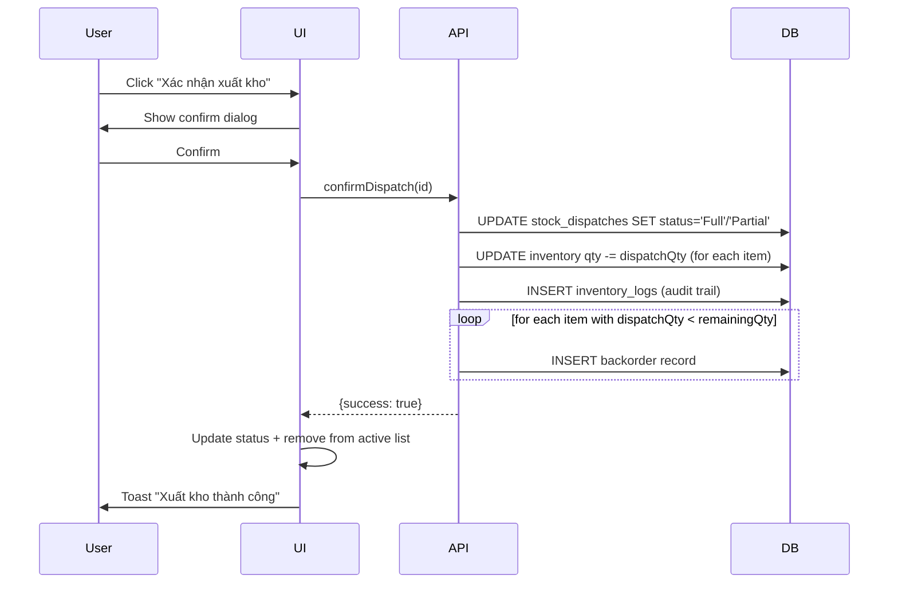

# USER STORY SPEC - CRUD Phiếu Xuất Kho

> **File**: `docs/ba/user-story-specs/USS_Task039_dispatch-crud.md`
> **Người viết**: Agent BA
> **Ngày tạo**: 18/04/2026
> **Phiên bản**: 1.0
> **Trạng thái**: Approved ✅
> **Epic**: Quản lý Phiếu Xuất Kho (Dispatch)

---

## 1. US07: Tạo phiếu xuất từ đơn hàng

### 1.1 Mô tả

> **Là một Staff, tôi muốn tạo phiếu xuất từ đơn hàng để ghi nhận xuất hàng.**

### 1.2 UI Specification

**Screen**: `DispatchForm.tsx` (Dialog/Sheet)

| Breakpoint | Layout |
|----------|--------|
| Mobile (< 640px) | Single column, scrollable |
| Desktop (≥ 640px) | 2 columns: Left=Picking List, Right=Form |

**Components**:
- `Dialog` (Shadcn)
- `Select` dropdown cho Sales Order (filter: status = Pending/Processing/Partial)
- `PickingListCard` hiển thị items cần xuất
- `Input` number cho từng item

**Fields**:
| Field | Type | Validation | Required |
|-------|------|-----------|---------|
| orderId | Select | reference to SalesOrders | ✅ |
| dispatchDate | DatePicker | không được > hôm nay | ✅ |
| notes | Textarea | max 500 | ❌ |
| items[] | Array | from order details | ✅ |

**Picking List Item Display**:
```
┌────────────────────────────────────┐
│ 📦 [Tên sản phẩm]                  │
│    SKU: SP001 | Tồn kho: 150       │
│ ──────────────────────────────────│
│ 📍 Vị trí: WH01-A1    Batch: B001 │
│ ──────────────────────────────────│
│ Cần xuất: 20  | Đã xuất: 0      │
│ ┌────────────────────────────────┐│
│ │ Số lượng xuất: [____]          ││
│ └────────────────────────────────┘│
└────────────────────────────────────┘
```

---

### 1.3 Sequence Specification



---

### 1.4 Activity Rule Specification

**Auto-Generated Fields**:
- `dispatchCode`: PX-YYYY-NNNN
- `remainingQty = orderedQty - alreadyDispatchedQty`
- `availableStock`: từ `inventory.quantity`
- `warehouseLocation`: từ `inventory.location`

**Validation**:
- `BR01`: Chỉ chọn order có `status ∈ ['Pending', 'Processing', 'Partial']`
- `BR02`: `dispatchQty ≤ availableStock` (nếu > → warning)
- `BR03`: Line được mark là `isFullyDispatched` khi `dispatchQty === remainingQty`

---

## 2. US08: Nhập số lượng xuất thực tế

### 2.1 Mô tả

> **Là một Staff, tôi muốn nhập số lượng xuất thực tế để xác nhận đã lấy hàng.**

### 2.2 UI Specification

- Mỗi item trong Picking List có Input number để nhập `dispatchQty`
- Real-time validation: `dispatchQty ≤ availableStock`

**States**:
| Condition | UI Behavior |
|-----------|-------------|
| `dispatchQty = 0` | Warning: "Chưa nhập số lượng xuất" |
| `dispatchQty > availableStock` | Error: "Không đủ hàng" (disable submit) |
| `dispatchQty < remainingQty` | Show warning: "Sẽ tạo backorder" |

---

### 2.3 Activity Rule Specification

**Auto-calculate**:
```typescript
remainingQty = orderedQty - alreadyDispatchedQty
isFullyDispatched = dispatchQty === remainingQty
newStatus = items.every(i => i.isFullyDispatched) ? 'Full' : 'Partial'
```

---

## 3. US09: Xác nhận xuất kho

### 3.1 Mô tả

> **Là một Staff, tôi muốn xác nhận xuất kho để trừ tồn kho.**

### 3.2 UI Specification

**Confirm Dialog** (trước khi xác nhận):
```
┌─────────────────────────────────────┐
│ Xác nhận xuất kho                   │
│                                     │
│ Mã phiếu: PX-2026-0001            │
│ Đơn hàng: SO-2026-0001           │
│ Khách hàng: Nguyễn Thị C         │
│                                     │
│ Tổng số mặt hàng: 3             │
│ Tổng số lượng: 70               │
│                                     │
│ ⚠️ Hành động này sẽ trừ tồn kho  │
│ ngay lập tức.                    │
│                                     │
│ [Hủy]           [Xác nhận]      │
└─────────────────────────────────────┘
```

---

### 3.3 Sequence Specification



---

### 3.4 Activity Rule Specification

**Business Rules**:
- `BR01`: Chỉ xác nhận được khi `status === 'Pending'`
- `BR02`: Update `inventory.quantity -= dispatchQty` cho mỗi item
- `BR03`: Insert `inventory_logs` với `action_type = 'DISPATCH_CONFIRM'`
- `BR04`: **Human-in-the-Loop** → confirm dialog bắt buộc

**Backorder Handling**:
- Khi `dispatchQty < remainingQty` → Create Backorder (table `sales_orders` hoặc separate)
- Flow: Partial → Auto-create backorder → Link to original order

---

## 4. US10: Xem Picking List

### 4.1 Mô tả

> **Là một Staff, tôi muốn xem Picking List để biết lấy hàng ở đâu.**

### 4.2 UI Specification

**Picking List Card** (trong DispatchDetailPanel):

```
┌─────────────────────────────────────────┐
│ 📦 Picking List                        │
├─────────────────────────────────────────┤
│ 📦 Sữa Ông Thọ Hộp Giấy               │
│    SKU: SP001 | SL: 20 hộp              │
│ ──────────────────────────���─��──────────│
│ 📍 Vị trí: WH01 - Kệ A1               │
│    Batch: B2026001 | HSD: 31/12/2026   │
│ ───────────────────────────────────────│
│ [✅] Đã lấy (15/20)                   │
│    ┌──────────────────┐               │
│    │ Nhập SL: [___]   │ ← Input       │
│    └──────────────────┘               │
├─────────────────────────────────────────┤
│ Progress: 2/3 items đã lấy           │
└─────────────────────────────────────────┘
```

---

### 4.3 Activity Rule Specification

**Display**:
- Warehouse Code (từ `inventory.warehouseCode`)
- Shelf Code (từ `inventory.shelfCode`)
- Batch Number
- Expiry Date

**Checklist**:
- Checkbox "Đã lấy" cho mỗi item
- Progress bar: "X/Y items đã lấy"

---

## 5. US11: Xử lý xuất một phần (Partial)

### 5.1 Mô tả

> **Là một Staff, tôi muốn xử lý xuất một phần khi không đủ hàng để tạo backorder.**

### 5.2 UI Specification

**Warning Dialog**:
```
┌─────────────────────────────────────────┐
│ ⚠️ Cảnh báo: Không đủ hàng             │
│                                         │
│ Sản phẩm: Nước Ngọt Coca Cola 1.5L    │
│ Cần xuất: 60                          │
│ Tồn kho: 45                           │
│                                         │
│ ✓ Tạo backorder cho 15 chai còn thiếu  │
│                                         │
│ [Tiếp tục xuất một phần]  [Hủy]        │
└─────────────────────────────────────────┘
```

---

### 5.3 Activity Rule Specification

**Business Rules**:
- `BR01`: Show warning khi `dispatchQty < remainingQty`
- `BR02`: Khi submit → Status = 'Partial'
- `BR03`: Auto-create backorder record

---

## 6. US12: Hủy phiếu xuất

### 6.1 Mô tả

> **Là một Staff/Owner, tôi muốn hủy phiếu xuất khi có sai sót.**

### 6.2 UI Specification

**Cancel Dialog**:
```
┌─────────────────────────────────────────┐
│ Hủy phiếu xuất kho                    │
│                                         │
│ Lý do hủy:                            │
│ ┌─────────────────────────────────┐   │
│ │ (Textarea - required)            │   │
│ └─────────────────────────────────┘   │
│                                         │
│ ⚠️ Lưu ý: Phiếu sẽ bị hủy,        │
│ không ảnh hưởng tồn kho.           │
│                                         │
│ [Hủy bỏ]          [Xác nhận hủy]  │
└─────────────────────────────────────────┘
```

---

### 6.3 Activity Rule Specification

**Rules**:
- `BR01`: Có thể hủy khi `status === 'Pending'`
- `BR02`: Không được hủy khi `status === 'Full'` (đã trừ tồn kho)
- `BR03`: Khi hủy → `status = 'Cancelled'`

---

## 7. QA Checklist - Tổng hợp

- [ ] UI RULES.md compliance (touch ≥ 44px, mobile-first)?
- [ ] Validation đầy đủ (quantity, price)?
- [ ] Inventory update đúng khi confirm xuất?
- [ ] Audit trail được ghi?
- [ ] Backorder auto-created khi partial?
- [ ] Workflow: Pending → Full/Partial/Cancelled?
- [ ] 100% Vietnamese UI?
- [ ] Responsive mobile/tablet/desktop?

---

> **Status**: ✅ User Story Spec Complete - Ready for Dev