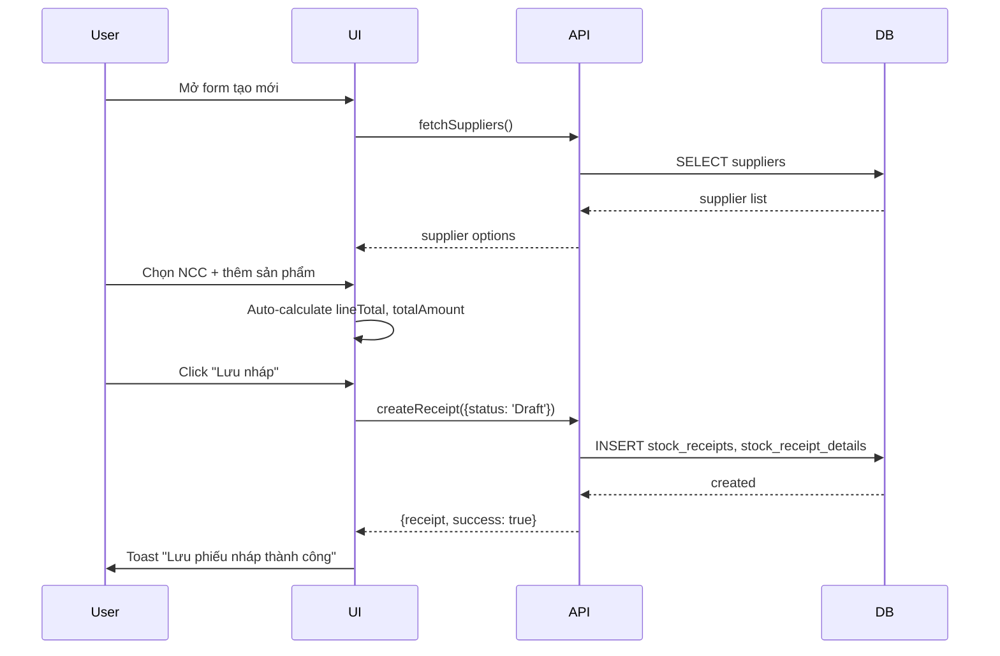
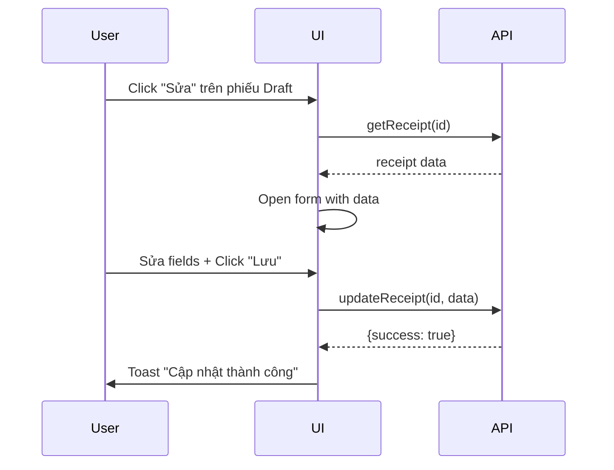
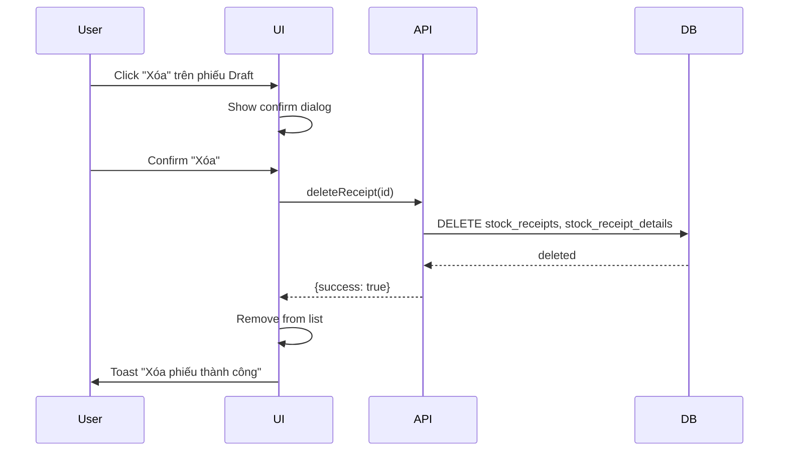
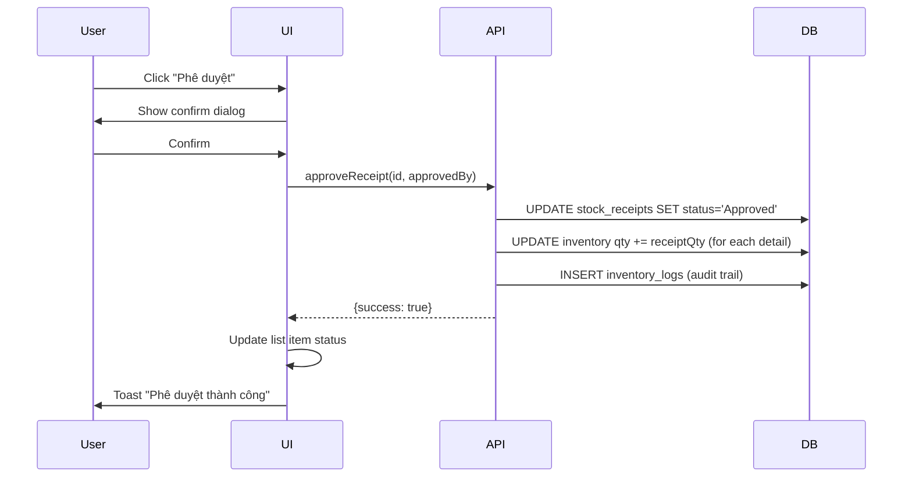

# USER STORY SPEC - CRUD Phiếu Nhập Kho

> **File**: `docs/ba/user-story-specs/USS_Task039_inbound-crud.md`
> **Người viết**: Agent BA
> **Ngày tạo**: 18/04/2026
> **Phiên bản**: 1.0
> **Trạng thái**: Approved ✅
> **Epic**: Quản lý Phiếu Nhập Kho (Inbound)

---

## 1. US01: Tạo phiếu nhập mới

### 1.1 Mô tả

> **Là một Staff, tôi muốn tạo phiếu nhập mới để ghi nhận hàng nhập từ nhà cung cấp.**

### 1.2 UI Specification

**Screen**: `ReceiptForm.tsx` (Dialog/Sheet)

| Breakpoint | Layout |
|----------|--------|
| Mobile (< 640px) | Single column, scrollable |
| Desktop (≥ 640px) | 2-column grid |

**Components**:
- `Dialog` (Shadcn) - mở rộng toàn màn hình trên mobile
- `Form` (React Hook Form + Zod)
- `Input` text fields
- `Select` dropdown cho Supplier
- `DatePicker` cho receiptDate
- `Dynamic Table` cho details (thêm/xóa dòng)
- `Button` actions

**Fields**:
| Field | Type | Validation | Required |
|-------|------|-----------|---------|
| supplierId | Select | reference to Suppliers | ✅ |
| receiptDate | DatePicker | không được > hôm nay | ✅ |
| invoiceNumber | Input | string, max 50 | ❌ |
| notes | Textarea | string, max 500 | ❌ |
| details[] | Array | min 1 item | ✅ |

**Detail Row Fields**:
| Field | Type | Validation | Required |
|-------|------|-----------|---------|
| productId | Select/Search | reference to Products | ✅ |
| unitId | Select | reference to ProductUnits | ✅ |
| quantity | Input number | > 0 | ✅ |
| costPrice | Input number | ≥ 0 | ✅ |
| batchNumber | Input | string | ❌ |
| expiryDate | DatePicker | ❌ | ❌ |

**States**:
- `default`: Form trống, ready to input
- `loading`: Đang tải danh mục NCC/sản phẩm
- `submitting`: Đang lưu (disable button)
- `error`: Hiển thị lỗi validation

---

### 1.3 Sequence Specification



---

### 1.4 Activity Rule Specification

**Validation Rules**:
- `BR01`: Supplier phải tồn tại trong `suppliers` table
- `BR02`: Mỗi detail row phải có `quantity > 0` và `costPrice >= 0`
- `BR03`: Tổng amount = SUM(quantity × costPrice)
- `BR04`: Không trùng receiptCode (auto-generate: PN-YYYY-NNNN)

**Trigger Conditions**:
| Action | Trigger |
|--------|----------|
| Auto-generate receiptCode | Khi submit form thành công |
| Calculate lineTotal | Khi thay đổi quantity hoặc costPrice |
| Calculate totalAmount | Khi thêm/xóa/sửa detail row |

---

## 2. US02: Sửa phiếu nhập Draft

### 2.1 Mô tả

> **Là một Staff, tôi muốn sửa phiếu nhập đang ở trạng thái Draft để chỉnh sửa sai sót.**

### 2.2 UI Specification

- Reuse `ReceiptForm.tsx` nhưng pre-filled data
- Chỉ enable fields khi `status === 'Draft'`
- Nếu `status !== 'Draft'` → disable all fields + show toast

**States**:
- `editable`: status = 'Draft'
- `readonly`: status ≠ 'Draft', show badge + disable fields

---

### 2.3 Sequence Specification



---

### 2.4 Activity Rule Specification

**Validation Rules**:
- `BR01`: Chỉ sửa được khi `status === 'Draft'`
- `BR02`: Nếu đã gửi duyệt rồi → revert về Draft để sửa

---

## 3. US03: Xóa phiếu nhập Draft

### 3.1 Mô tả

> **Là một Staff, tôi muốn xóa phiếu nhập Draft để loại bỏ phiếu không hợp lệ.**

### 3.2 UI Specification

**Confirmation Dialog**:
```
┌─────────────────────────────────┐
│ Xóa phiếu nhập?                  │
│                                 │
│ Mã phiếu: PN-2026-0001          │
│ NCC: Công ty Vinamilk            │
│                                 │
│ ⚠️ Lưu ý: Hành động này     │
│ không thể hoàn tác.            │
│                                 │
│ [Hủy]            [Xóa]       │
└─────────────────────────────────┘
```

---

### 3.3 Sequence Specification



---

### 3.4 Activity Rule Specification

**Validation Rules**:
- `BR01`: Chỉ xóa được khi `status === 'Draft'`
- `BR02`: Xóa cả parent + child records (transactions)
- `BR03`: Soft delete hoặc hard delete? → **Hard delete** (vì Draft)

---

## 4. US04: Gửi phê duyệt phiếu nhập

### 4.1 Mô tả

> **Là một Staff, tôi muốn gửi phiếu nhập để Owner phê duyệt.**

### 4.2 UI Specification

- Button "Gửi phê duyệt" chỉ hiện khi `status === 'Draft'`
- Sau khi click → `status` đổi thành `'Pending'`

---

### 4.3 Activity Rule Specification

**Workflow**:
```
Draft →(Gửi duyệt)→ Pending
```

---

## 5. US05: Phê duyệt phiếu nhập

### 5.1 Mô tả

> **Là một Owner, tôi muốn phê duyệt phiếu nhập để cập nhật tồn kho.**

### 5.2 UI Specification

**Trong ReceiptDetailPanel**:
- Button "Phê duyệt" (màu xanh) - chỉ khi `status === 'Pending'` và `canApprove === true`
- Khi click → Show confirm dialog + trigger update

---

### 5.3 Sequence Specification



---

### 5.4 Activity Rule Specification

**Business Rules**:
- `BR01`: Chỉ phê duyệt được khi `status === 'Pending'`
- `BR02`: Khi phê duyệt → UPDATE `inventory.quantity += detail.quantity`
- `BR03`: INSERT `inventory_logs` với `action_type = 'RECEIPT_APPROVE'`
- `BR04`: **Human-in-the-Loop** → confirm trước khi commit DB

---

## 6. US06: Từ chối phiếu nhập

### 6.1 Mô tả

> **Là một Owner, tôi muốn từ chối phiếu nhập để yêu cầu chỉnh sửa.**

### 6.2 UI Specification

**Reject Dialog**:
```
┌─────────────────────────────────┐
│ Từ chối phiếu nhập              │
│                                 │
│ Lý do từ chối:                 │
│ ┌───────────────────────────┐   │
│ │ (Textarea - required)      │   │
│ └───────────────────────────┘   │
│                                 │
│ [Hủy]            [Từ chối]     │
└─────────────────────────────────┘
```

---

### 6.3 Activity Rule Specification

**Validation**:
- `BR01`: Lý do từ chối bắt buộc nhập (required)
- `BR02`: Khi từ chối → `status = 'Rejected'`, lưu reason vào `notes`

---

## 7. QA Checklist

- [ ] UI tuân thủ RULES.md (touch targets ≥ 44px)?
- [ ] Form validation đầy đủ?
- [ ] Workflow đúng: Draft → Pending → Approved/Rejected?
- [ ] Inventory update đúng khi approve?
- [ ] Audit trail được ghi?
- [ ] 100% tiếng Việt?
- [ ] Responsive mobile?

---

> **Status**: ✅ User Story Spec Complete - Ready for Dev