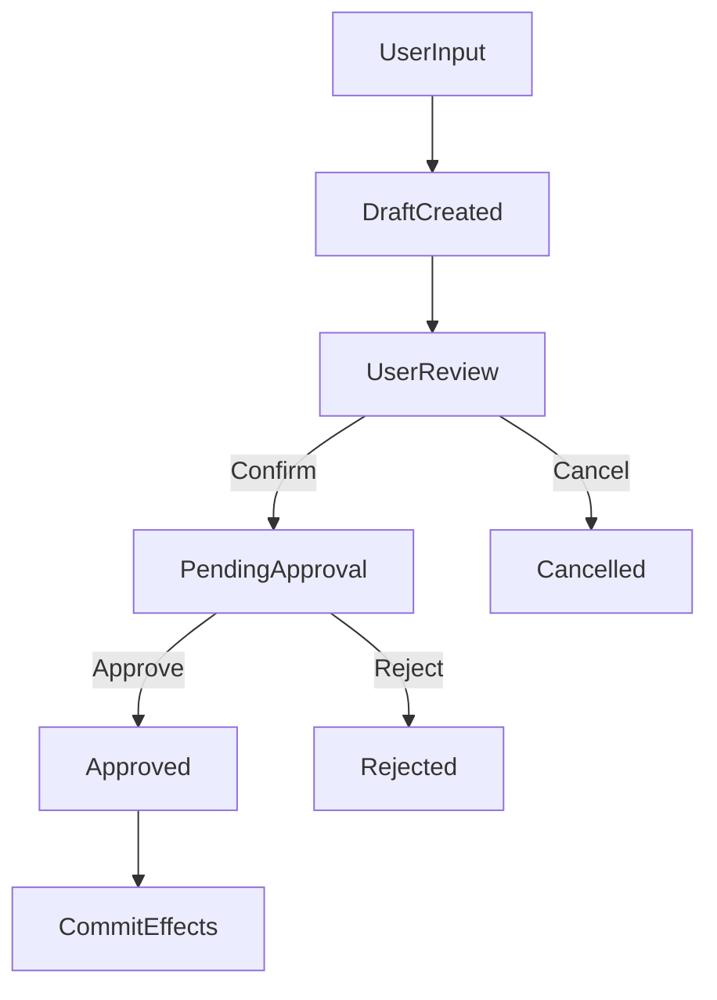

# SRS - <Tên tính năng>

> **SRS Spring / API (`smart-erp`):** dùng mẫu [`../../../backend/docs/srs/SRS_TEMPLATE.md`](../../../backend/docs/srs/SRS_TEMPLATE.md) (bóc tách nghiệp vụ, OQ PO, JSON HTTP, SQL). File này ưu tiên **UI Mini-ERP** (breakpoint, component, state).

> **File**: `docs/srs/SRS_TaskXXX_<slug>.md`  
> **Người viết**: Agent BA  
> **Ngày cập nhật**: <DD/MM/YYYY>  
> **Trạng thái**: Draft | Approved

## 1. Tóm tắt

- **Vấn đề**: <Nỗi đau cụ thể của user (ngắn gọn)>
- **Mục tiêu**: <Mục tiêu kinh doanh + giá trị>
- **Đối tượng**: <Owner/Staff/Admin hoặc persona liên quan>

## 2. Phạm vi

### 2.1 In-scope

- <Danh sách những gì sẽ làm trong lần này>

### 2.2 Out-of-scope

- <Những gì KHÔNG làm để tránh bloat>

## 3. Persona & Quyền (RBAC)

- **Vai trò liên quan**: Owner | Staff | Admin
- **Quyền bắt buộc**:
  - <hành động> → <quyền/role>
- **Xử lý thiếu quyền**:
  - 403 → Toast: “Bạn không có quyền thực hiện hành động này”

## 4. User Stories

- **US1 (chính)**: Là một <vai trò>, tôi muốn <hành động> để <giá trị>.
- **US2 (phụ)**: ...

## 5. Luồng nghiệp vụ (Business Flow)

Yêu cầu: bám “Human-in-the-Loop”. Nếu AI/nhân viên tạo dữ liệu nháp thì phải có bước user Confirm/Approve trước khi commit DB.



## 6. Quy tắc nghiệp vụ (Business Rules)

- **Ràng buộc dữ liệu**: <vd: quantity > 0, min_quantity, status transitions>
- **Tính toán**: <vd: line_total, final_amount, dispatched_qty>
- **Concurrency / race**: <khi 2 user thao tác cùng record thì xử lý thế nào>
- **Transaction**: <khi nào cần rollback toàn bộ>

## 7. UI/UX Spec (Mobile-first)

> Bắt buộc mô tả theo breakpoint và tuân thủ `RULES.md` (touch targets ≥ 44px, không horizontal overflow, loading/skeleton, a11y).

### 7.1 Layout theo breakpoint

- **Mobile (<640px)**:
  - <bố cục 1 cột, ưu tiên thao tác nhanh>
  - <nếu có bảng: card view / ẩn cột phụ / show more>
- **Tablet (640–1024px)**:
  - <2 cột khi hợp lý, lọc/tìm kiếm rõ ràng>
- **Desktop (>1024px)**:
  - <table đầy đủ, toolbar, phân trang>

### 7.2 Component/UI kit (Shadcn UI)

- **Danh sách component**:
  - `<Button>`, `<Input>`, `<Select>`, `<Dialog>`, `<Card>`, `<Toast>` (sonner), ...
- **Thông báo**:
  - Thành công/thất bại → Toast rõ ràng, có retry nếu phù hợp

### 7.3 States bắt buộc

- **Loading**: skeleton/spinner
- **Empty**: empty state có CTA
- **Error**:
  - 401 → redirect `/login`
  - 403 → toast “Bạn không có quyền thực hiện hành động này”
  - 500 → toast “Hệ thống đang bận, vui lòng thử lại sau”

## 8. Edge Cases

- **Dữ liệu lớn**: bắt buộc phân trang/lọc
- **Sai định dạng / thiếu trường**: validation rõ
- **Mạng lỗi / timeout**: retry + thông báo
- **Xung đột dữ liệu**: xử lý theo rule ở mục 6

## 9. Technical Mapping (Frontend)

- **Route/page dự kiến**: <ví dụ `/inventory/inbound`>
- **Feature folder**: `mini-erp/src/features/<feature>/`
  - **Pages**: `pages/<PageName>.tsx`
  - **Components**: `components/*`
  - **Types**: `types.ts`
  - **(Nếu có API thật)**: `api/*` với TanStack Query hooks
- **State**:
  - Server state: **TanStack Query v5** (caching/optimistic nếu có mutation)
  - Client UI state: **Zustand** (nếu cần)

## 10. Data & Database Mapping

> Tên bảng bắt buộc tồn tại trong `docs/database/tables/*.md`.

- **Bảng bị ảnh hưởng**:
  - `<Table1>`: <insert/update/readonly + fields liên quan>
  - `<Table2>`: ...
- **Audit trail/log**:
  - <vd: `InventoryLogs`, `SystemLogs`, `MediaAudits`, `Notifications`>
- **Transaction boundary**:
  - <vd: khi Approve thì update nhiều bảng trong 1 transaction, lỗi thì rollback>

## 11. Acceptance Criteria (BDD/Gherkin)

### 11.1 Happy paths

```gherkin
Given <điều kiện ban đầu>
When <hành động>
Then <kết quả>
```

### 11.2 Unhappy paths

```gherkin
Given <điều kiện lỗi>
When <hành động>
Then <thông báo/không thay đổi dữ liệu/rollback>
```

## 12. Open Questions (nếu còn)

- <Chỉ liệt kê nếu không thể chốt mà vẫn đảm bảo “không bịa”>

