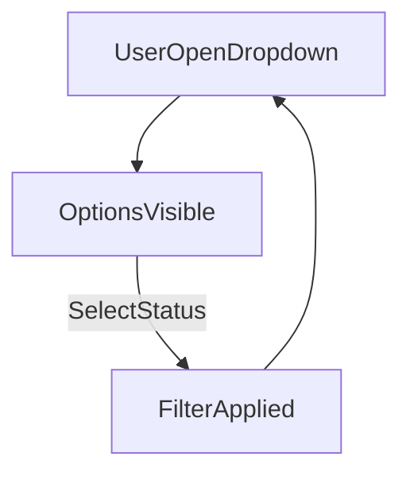

# SRS - Sửa lỗi dropdown “Trạng thái” (Tồn kho)

> **File**: `docs/srs/SRS_Task016_fix-stock-status-dropdown-visibility.md`  
> **Người viết**: Agent BA  
> **Ngày cập nhật**: 15/04/2026  
> **Trạng thái**: Completed

## 1. Tóm tắt

- **Vấn đề**: 
  - Dropdown lọc **“Trạng thái”** trên màn hình **Danh sách tồn kho (Stock)** hiển thị nền bị mờ/không đọc được chữ.
  - **Lỗi không nhất quán**: Mỗi khi chọn một trạng thái khác nhau, thanh dropdown (SelectTrigger) lại hiển thị kiểu dáng khác nhau (vd: màu sắc, border hoặc padding thay đổi). Hình ảnh minh chứng tại `BUG/Bug_Task016_01.png`.
- **Mục tiêu**: Dropdown phải luôn **dễ đọc**, **nhất quán tuyệt đối** dù đang chọn bất kỳ trạng thái nào, đúng **Design Tokens Monochrome** và tuân thủ `RULES.md`.
- **Đối tượng**: Owner/Staff/Admin.

## 2. Phạm vi

### 2.1 In-scope

- Sửa hiển thị dropdown lọc “Trạng thái” trên trang tồn kho:
  - Nền (background), chữ (foreground), border/shadow, focus/hover states.
  - Đảm bảo khi mở lại dropdown sau khi chọn value thì UI vẫn đúng và dễ đọc.
- Đảm bảo tuân thủ `RULES.md` về responsive và touch target.

### 2.2 Out-of-scope

- Thay đổi logic lọc tồn kho (trừ khi xác định nguyên nhân lỗi là do state/logic).
- Refactor lớn UI của trang tồn kho ngoài dropdown.
- Thay đổi design system toàn cục (chỉ làm nếu bắt buộc để sửa root-cause ở token).

## 3. Persona & Quyền (RBAC)

- **Vai trò liên quan**: Owner | Staff | Admin
- **Quyền**: Ai vào trang tồn kho thì đều dùng được filter (read-only UI).
- **Thiếu quyền (403)**: Không áp dụng trực tiếp cho UI filter (nhưng nếu tương lai gọi API, phải tuân theo `RULES.md`).

## 4. User Stories

- **US1 (chính)**: Là một nhân viên kho, tôi muốn lọc tồn kho theo trạng thái để nhanh chóng tìm mặt hàng cần xử lý.
- **US2 (phụ)**: Là một người dùng không rành công nghệ, tôi muốn dropdown hiển thị rõ ràng, dễ đọc để tránh thao tác sai.

## 5. Luồng nghiệp vụ (Business Flow)

Dropdown filter là thao tác UI thuần (không commit DB). Luồng chỉ ảnh hưởng dữ liệu hiển thị.



## 6. Quy tắc nghiệp vụ (Business Rules)

- **Giá trị filter hợp lệ**: `all` | `in-stock` | `low-stock` | `out-of-stock`.
- **Hiển thị nhất quán**: Dù selected value là gì, dropdown content luôn có nền/ chữ dễ đọc, không phụ thuộc trạng thái.
- **A11y tối thiểu**:
  - Có focus ring rõ ràng khi dùng keyboard.
  - Tương phản màu đảm bảo đọc được trên nền trắng/slate.

## 7. UI/UX Spec (Mobile-first)

### 7.1 Layout theo breakpoint

- **Mobile (<640px)**:
  - Dropdown chiếm full width (`w-full`) như hiện tại.
  - Touch target ≥ 44px (đã có `min-h-[44px]`).
- **Tablet (640–1024px)**:
  - Dropdown có thể cố định width ~200px (đã có `sm:w-[200px]`).
- **Desktop (>1024px)**:
  - Không thay đổi bố cục; ưu tiên độ rõ và nhất quán.

### 7.2 Component/UI kit (Shadcn UI)

- Component: `Select`, `SelectTrigger`, `SelectContent`, `SelectItem` (Radix Select).
- Yêu cầu style (Monochrome):
  - `SelectTrigger`: nền **trắng** (`bg-white`), chữ `text-slate-900`, border `border-slate-200`.
  - `SelectContent`: nền **trắng** (`bg-white`), chữ `text-slate-900`, border `border-slate-200`, shadow vừa đủ để tách khỏi nền.
  - `SelectItem`: hover/focus dùng slate nhẹ (`bg-slate-50`/`bg-slate-100`), chữ vẫn `text-slate-900`.

### 7.3 States bắt buộc

- **Open state**: options đọc rõ, không “mờ nền”.
- **Selected state**: hiển thị selected label rõ trong trigger.
- **Re-open state**: mở lại dropdown sau khi chọn vẫn hiển thị đúng như lần đầu.

## 8. Edge Cases

- **Trigger nằm trong container có border/rounded**: dropdown không bị cắt (Radix portal thường không bị overflow).
- **Theme token `bg-popover`/`text-popover-foreground`** bị cấu hình sai:
  - Nếu root-cause do token, cần sửa token để `SelectContent` không bị trong suốt/mờ.
- **Dark mode**: hiện tại dự án ưu tiên nền trắng; nếu có dark mode sau này, phải đảm bảo không phá vỡ (ưu tiên override bằng slate/white theo `RULES.md` hiện tại).

## 9. Technical Mapping (Frontend)

- **Trang**: `mini-erp/src/features/inventory/pages/StockPage.tsx`
- **Component liên quan**: `mini-erp/src/features/inventory/components/StockToolbar.tsx`
  - Dropdown “Trạng thái” đang dùng `Select` từ `mini-erp/src/components/ui/select.tsx`.
- **Vị trí cần sửa (dự kiến)**:
  - Thêm/điều chỉnh `className` cho `SelectTrigger` và `SelectContent` tại `StockToolbar.tsx` để override nền/chữ/border theo Slate.
  - Nếu vẫn lỗi: kiểm tra token `bg-popover`, `text-popover-foreground` trong CSS theme (vd `src/index.css` @theme) và chuẩn hoá theo nền trắng.

## 10. Data & Database Mapping

- Không tác động DB.

## 11. Acceptance Criteria (BDD/Gherkin)

### 11.1 Happy paths

```gherkin
Given Tôi đang ở trang "Danh sách tồn kho"
When Tôi lần lượt chọn các trạng thái "Tất cả", "Còn hàng", "Sắp hết", "Hết hàng"
Then Thanh dropdown (SelectTrigger) phải giữ nguyên kiểu dáng (nền trắng, chữ slate-900, border-slate-200) và không bị nhảy UI.

Given Tôi bấm lại dropdown "Trạng thái" sau khi đã chọn
Then Dropdown mở ra với danh sách option hiển thị nhất quán, dễ đọc và không bị mờ nền.
```

### 11.2 Unhappy paths

```gherkin
Given Theme token popover bị cấu hình sai khiến nền dropdown trong suốt
When Tôi mở dropdown "Trạng thái"
Then UI vẫn phải override để option đọc được (bg-white, text-slate-900, border-slate-200)
```

## 12. Open Questions (nếu còn)

- (Nếu cần xác nhận root-cause) Ảnh minh hoạ `Bug_Task016.png` hiện chưa có trong repo; cần đặt đúng path `BUG/Bug_Task016.png` hoặc cung cấp để đối chiếu chính xác trạng thái “hiển thị lỗi sau khi click lại”.

