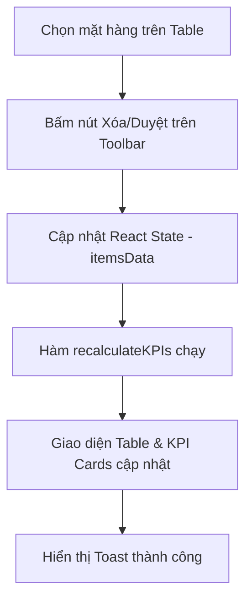

# SRS - Hiện thực hóa logic chức năng trên Mock Data (Stock)

> **File**: `docs/srs/SRS_Task017_stock-interface-functional-implementation.md`  
> **Người viết**: Agent BA  
> **Ngày cập nhật**: 15/04/2026  
> **Trạng thái**: Completed

## 1. Tóm tắt

- **Vấn đề**: Các nút trên thanh Toolbar (Phê duyệt, Xóa, Nhập/Xuất...) của trang Tồn kho hiện mới chỉ hiển thị thông báo "Toast" mà không tác động thực tế đến dữ liệu hiển thị.
- **Mục tiêu**: Triển khai logic xử lý dữ liệu cục bộ (Local State). Khi người dùng thực hiện thao tác trên thanh công cụ, các mặt hàng mẫu (Mock data) sẽ được cập nhật, xóa hoặc thay đổi trạng thái ngay lập tức trên UI.
- **Đối tượng**: Người dùng trải nghiệm hệ thống.

## 2. Phạm vi

### 2.1 In-scope

- **Chuyển đổi Mock Data sang State**: Đưa dữ liệu từ `mockData.ts` vào React State (`useState`) tại `StockPage.tsx`.
- **Triển khai Logic Toolbar**:
  - **Phê duyệt**: Đổi trạng thái `isDraft` (nếu có) hoặc `status` của các bản ghi được chọn sang 'Active'.
  - **Xoá**: Loại bỏ các bản ghi được chọn khỏi State hiện tại.
  - **Sửa**: (Cần bổ sung) Cho phép thay đổi nhanh thông tên hoặc số lượng của bản ghi.
- **KPIs Dynamic**: Cập nhật lại các chỉ số KPI Cards (Tổng mặt hàng, Tổng giá trị...) ngay khi State dữ liệu thay đổi.
- **Table Sync**: Bảng dữ liệu tự động render lại theo State mới.

### 2.2 Out-of-scope

- Kết nối APIBackend và Database PostgreSQL (đặc tả ở Task sau).
- Lưu trữ dữ liệu lâu dài (Persistence) qua LocalStorage.

## 3. Persona & Quyền (RBAC)

- **Owner/Staff**: Có thể thực hiện các thao tác Xóa/Duyệt/Sửa trên dữ liệu cục bộ để quan sát sự thay đổi UI.

## 4. User Stories

- **Là một người dùng**, tôi muốn bấm nút "Xóa" sau khi chọn 2 sản phẩm và thấy chúng biến mất khỏi danh sách để kiểm chứng luồng hoạt động của app.
- **Là một quản lý**, tôi muốn thấy tổng giá trị kho giảm đi tương ứng khi xóa một lô hàng lớn.

## 5. Luồng nghiệp vụ (Business Flow)

## 6. Quy tắc nghiệp vụ (Business Rules)

- **Xóa**: Bản ghi sẽ bị loại bỏ hoàn toàn khỏi State ở Client-side.
- **Phê duyệt**: Chỉ thay đổi thuộc tính `status` hoặc cờ hiệu của bản ghi; không làm mất bản ghi.
- **Số liệu**: Tổng giá trị kho phải luôn bằng `Σ(quantity * costPrice)` của tất cả các mặt hàng còn lại trong State.

## 7. Technical Mapping (Frontend)

- **Location**: `mini-erp/src/features/inventory/pages/StockPage.tsx`
- **Logic**:
  - Khởi tạo: `const [inventoryItems, setInventoryItems] = useState(mockInventory)`.
  - Delete logic: `setInventoryItems(prev => prev.filter(i => !selectedIds.includes(i.id)))`.
  - Approve logic: `setInventoryItems(prev => prev.map(i => selectedIds.includes(i.id) ? {...i, status: 'Active'} : i))`.
- **Performance**: Việc filter dữ liệu mock (~50-100 items) diễn ra tức thì, không cần loading state phức tạp.

## 8. Acceptance Criteria (BDD)

### 8.1 Xóa hàng loạt

- **Given**: Tôi đang ở trang Tồn kho với dữ liệu mẫu.
- **When**: Tôi chọn 3 mặt hàng và bấm nút "Xoá".
- **Then**: Bảng chỉ còn lại các mặt hàng khác.
- **And**: `KPI: Tổng mặt hàng` giảm đi 3.

### 8.2 Phê duyệt hàng loạt

- **Given**: Tôi chọn 2 mặt hàng đang ở trạng thái nháp.
- **When**: Tôi bấm "Phê duyệt".
- **Then**: Cột trạng thái của 2 hàng đó chuyển sang 'Chính thức'.

## 9. Open Questions (nếu còn)

- Việc "Sửa" có cần một form Dialog đầy đủ không? (Đề xuất: Một Dialog đơn giản chỉnh nhanh Số lượng và Tên là đủ cho Phase này).
