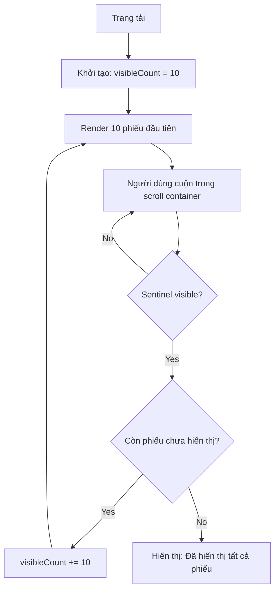

# SRS - Cải thiện giao diện Phiếu nhập kho (Inbound Receipts)

> **File**: `docs/srs/SRS_Task022_inbound-receipt-ui-enhancement.md`  
> **Người viết**: Agent BA  
> **Ngày cập nhật**: 15/04/2026  
> **Trạng thái**: Completed

## 1. Tóm tắt

- **Vấn đề**: Trang Phiếu nhập kho (`/inventory/inbound`) hiện có 3 vấn đề chính:
  1. Thẻ phiếu nhập (Receipt Card) hiển thị quá ít thông tin khi ở trạng thái thu gọn (collapsed), gây khó nhận diện nhanh.
  2. Danh sách phiếu render toàn bộ cùng lúc, không có cơ chế phân trang/lazy load — tiềm ẩn hiệu năng kém khi dữ liệu lớn.
  3. Danh sách phiếu nằm trong flow chính của trang, không có scroll container riêng, khiến người dùng phải cuộn cả trang.
- **Mục tiêu**: Cải thiện UI/UX tổng thể, bổ sung dữ liệu mock đầy đủ hơn, và triển khai Infinite Scroll trên Mock Data.
- **Đối tượng**: Nhân viên kho (Staff), Chủ cửa hàng (Owner).

## 2. Phạm vi

### 2.1 In-scope

- **Thiết kế lại Receipt Card**: Thẻ ở trạng thái collapsed phải hiển thị đủ thông tin nhận diện nhanh.
- **Bổ sung Mock Data**: Tăng số lượng phiếu nhập kho trong `mockData.ts` lên tối thiểu 20 bản ghi để kiểm chứng Infinite Scroll.
- **Infinite Scroll**: Hiển thị 10 phiếu đầu tiên khi trang load; khi người dùng cuộn đến cuối scroll container, tải thêm 10 phiếu.
- **Scroll Container riêng**: Tách danh sách phiếu vào một `div` cuộn độc lập, Header + Filter cố định (không cuộn cùng).

### 2.2 Out-of-scope

- Kết nối API Backend thật (sẽ làm ở Task sau).
- Tính năng tạo/sửa phiếu nhập mới.
- Xuất/Nhập Excel (đã có placeholder, giữ nguyên).
- Quét hóa đơn OCR (đã có placeholder, giữ nguyên).

## 3. Persona & Quyền (RBAC)

- **Staff/Owner**: Đều có quyền xem danh sách phiếu nhập. Không có thay đổi về phân quyền.

## 4. User Stories

- **US1 (chính)**: Là một nhân viên kho, tôi muốn thấy thông tin key của từng phiếu nhập ngay trên thẻ thu gọn (mã phiếu, NCC, ngày nhập, số tiền, trạng thái) để tìm nhanh mà không cần mở rộng.
- **US2 (phụ)**: Là một chủ cửa hàng, tôi muốn cuộn trong vùng danh sách phiếu mà không làm cuộn toàn bộ trang, để có thể xem bộ lọc và tiêu đề mọi lúc.
- **US3 (phụ)**: Là một người dùng, tôi muốn danh sách tải tự động khi tôi cuộn xuống cuối, không cần bấm nút "Xem thêm".

## 5. Luồng nghiệp vụ (Business Flow)



## 6. Quy tắc nghiệp vụ (Business Rules)

- **Sắp xếp mặc định**: Phiếu mới nhất (theo `receiptDate`) hiển thị trước.
- **Số lượng mỗi lần tải**: 10 phiếu.
- **Sentinel**: Một `div` vô hình ở cuối danh sách, được theo dõi bởi `IntersectionObserver`. Khi 10% của sentinel vào viewport → trigger load thêm.
- **Khi đã hết dữ liệu**: Hiển thị dòng "Đã hiển thị toàn bộ `N` phiếu" thay vì tiếp tục load.

## 7. UI/UX Spec (Mobile-first)

### 7.1 Thiết kế Receipt Card (Collapsed State)

Thông tin hiển thị khi thẻ thu gọn (ưu tiên thứ tự):

```
┌─────────────────────────────────────────────────────────┐
│ [Icon] PN-2026-0001              [Badge: Đã duyệt]      │
│        Công ty Vinamilk          15/04/2026              │
│        6.050.000 ₫ • 2 dòng SP  Người tạo: Nguyễn A     │
└─────────────────────────────────────────────────────────┘
```

**Các trường bắt buộc hiển thị ở collapsed**:

- Mã phiếu (`receiptCode`) — font mono, nổi bật.
- Tên nhà cung cấp (`supplierName`).
- Tổng tiền (`totalAmount`) — định dạng tiền Việt.
- Số dòng chi tiết (`details.length`) — ví dụ "2 dòng SP".
- Ngày nhập (`receiptDate`).
- Người tạo (`staffName`).
- **Badge trạng thái** — sử dụng `StatusBadge` component hiện có.
- **Số hóa đơn** (`invoiceNumber`) — hiển thị nếu có, ẩn nếu không.

### 7.2 Scroll Container

- **Desktop**: `max-h: 70vh`, `overflow-y: auto`, có thanh cuộn tuỳ chỉnh (`scrollbar-thin`).
- **Mobile**: `max-h: 60vh` hoặc tính động theo viewport.
- **Header + Filter**: Nằm **ngoài** scroll container, cố định ở trên.

### 7.3 Layout theo breakpoint

- **Mobile (<640px)**: Thẻ 1 cột, thông tin xếp dọc. Ẩn bớt trường phụ (Số HĐ).
- **Tablet (640–1024px)**: Thẻ 2 cột thông tin trong collapsed.
- **Desktop (>1024px)**: Thẻ hiển thị đầy đủ, thông tin ngang hàng nhau.

### 7.4 Component/UI Kit (Shadcn UI)

- `<Badge>`: Giữ nguyên `StatusBadge` component.
- `<Skeleton>`: Hiển thị khi đang loading thêm (trong Infinite Scroll trigger).
- `IntersectionObserver` (native API): Không cần thêm thư viện.

### 7.5 States bắt buộc

- **Loading thêm**: Hiện 2-3 skeleton card khi đang tải thêm dữ liệu mock.
- **End of list**: Dòng văn bản mờ: "Đã hiển thị toàn bộ X phiếu".
- **Empty**: Giữ nguyên empty state hiện có.

## 8. Edge Cases

- **Tìm kiếm/Lọc kết hợp Infinite Scroll**: Khi người dùng thay đổi filter, `visibleCount` phải reset về 10 và scroll về đầu container.
- **Ít hơn 10 phiếu**: Hiển thị tất cả, sentinel không trigger thêm.
- **Mạng chậm (tương lai)**: Loading skeleton đủ 44px height để không gây layout shift.

## 9. Technical Mapping (Frontend)

- **Feature folder**: `mini-erp/src/features/inventory/`
- **Files thay đổi**:
  - `pages/InboundPage.tsx` — Refactor layout, thêm scroll container, Infinite Scroll logic.
  - `mockData.ts` — Bổ sung 16 phiếu nhập kho mới (tổng ≥ 20).
- **Logic Infinite Scroll**:

  ```ts
  const [visibleCount, setVisibleCount] = useState(10);
  const sentinelRef = useRef<HTMLDivElement>(null);

  useEffect(() => {
    const observer = new IntersectionObserver(
      ([entry]) => {
        if (entry.isIntersecting) setVisibleCount((prev) => prev + 10);
      },
      { threshold: 0.1 },
    );
    if (sentinelRef.current) observer.observe(sentinelRef.current);
    return () => observer.disconnect();
  }, []);

  const visibleReceipts = filteredReceipts.slice(0, visibleCount);
  ```

- **Reset khi filter thay đổi**: `useEffect` theo dõi `[search, statusFilter, dateFrom, dateTo]` để reset `visibleCount = 10`.

## 10. Data & Database Mapping

- **Bảng bị ảnh hưởng (tương lai)**: `StockReceipts`, `StockReceiptDetails`.
- **Hiện tại**: Chỉ thao tác trên `mockStockReceipts` trong `mockData.ts`. Không write xuống DB.

## 11. Acceptance Criteria (BDD)

### 11.1 Happy paths

```gherkin
Given Tôi đang ở trang Phiếu nhập kho với 20 phiếu mock
When Trang load lần đầu
Then Chỉ hiển thị 10 phiếu đầu tiên trong scroll container riêng
And Header, Filter vẫn cố định không cuộn

When Tôi cuộn xuống cuối scroll container
Then 10 phiếu tiếp theo xuất hiện tự động (không cần bấm nút)

When Tôi đã xem hết 20 phiếu
Then Hiển thị dòng "Đã hiển thị toàn bộ 20 phiếu"

When Tôi xem thẻ thu gọn của bất kỳ phiếu nào
Then Thấy: mã phiếu, tên NCC, ngày nhập, tổng tiền, số dòng SP, badge trạng thái
```

### 11.2 Unhappy paths

```gherkin
Given Tôi đang lọc theo trạng thái "Đã duyệt" (chỉ 1 phiếu)
When Tôi thay đổi filter sang "Tất cả"
Then Danh sách reset về 10 phiếu đầu tiên và scroll về đầu container
```

## 12. Open Questions

- Thẻ phiếu có cần thumbnail ảnh hóa đơn (nếu đã quét OCR) không? (Đề xuất: Không, để đơn giản cho Phase này).
