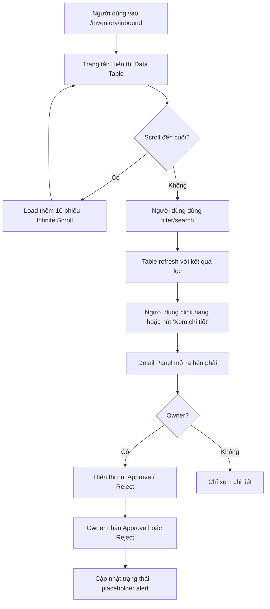

# SRS — Task025: Nâng cấp giao diện Phiếu nhập kho — Dạng bảng (Table Layout)

> **Mã Task**: Task025
> **Ngày tạo**: 16/04/2026
> **Tác giả**: Agent BA v2.0
> **Trạng thái**: ✅ Completed (Refactored to Table Layout)
> **Nguồn**: `Requirements/BA_RAW_REQUIREMENT_TASK025.md`
> **Elicitation**: `docs/ba/elicitation/ELICITATION_Task025_inbound-table-layout.md`
> **Route**: `/inventory/inbound`

---

## 1. Tầm nhìn (Vision)

Trang Phiếu nhập kho hiện dùng dạng Card rời rạc, khó quét và so sánh nhiều phiếu cùng lúc. Task025 chuyển toàn bộ danh sách sang **Data Table chuẩn** với sticky header — giúp người dùng nhanh chóng nắm bắt tổng quan tất cả phiếu nhập, sau đó xem chi tiết khi cần.

---

## 2. Phạm vi (Scope)

### ✅ In-scope

- Thay thế component `ReceiptCard` (accordion card) bằng **Data Table** trong scroll container hiện có.
- Table có **sticky header** (header cố định khi scroll dọc, cột cố định khi scroll ngang nếu cần).
- Click vào hàng hoặc nút "Xem chi tiết" → mở **Detail Panel** (slide-over / sheet bên phải).
- Detail Panel hiển thị: thông tin đầy đủ của phiếu + danh sách sản phẩm + workflow trạng thái.
- Bổ sung **≥ 30 bản ghi mock** vào `mockData.ts` để test scroll và pagination.
- Giữ nguyên infinite scroll (sentinel + IntersectionObserver) — chỉ đổi cách render.
- Giữ nguyên toàn bộ filter bar (search, status, dateFrom, dateTo, supplier).

### ❌ Out-of-scope

- Thay đổi logic nghiệp vụ (approve/reject workflow).
- Tích hợp API thực.
- Thay đổi cấu trúc type `StockReceipt`.
- Thêm bảng DB mới.
- Tính năng sắp xếp cột (column sort) — để sau.
- Tính năng chọn nhiều hàng (multi-select) — để sau.

---

## 3. Persona & Quyền (RBAC)

| Persona | Vai trò | Quyền trên màn hình này |
| :--- | :--- | :--- |
| Nhân viên kho (Staff) | `staff` | Xem danh sách, xem chi tiết, tạo phiếu Draft |
| Chủ cửa hàng (Owner) | `owner` | Xem tất cả, Approve/Reject (nút hành động trong Detail Panel) |

---

## 4. Luồng nghiệp vụ (Business Flow)



---

## 5. UI/UX Specification

### 5.1 Cấu trúc trang (giữ nguyên từ Task022)

```
┌─────────────────────────────────────────────────┐
│ Header (sticky): Tiêu đề + Toolbar buttons       │ ← shrink-0
├─────────────────────────────────────────────────┤
│ Filter Bar (sticky): Search + Status + Date...   │ ← shrink-0
├─────────────────────────────────────────────────┤
│                                                  │
│  [Scroll Container — flex-1 overflow-y-auto]     │
│  ┌───────────────────────────────────────────┐   │
│  │ TABLE HEADER (sticky top-0 trong container)│  │
│  │ Mã phiếu | NCC | Ngày | NTạo | HĐ | SP | Tiền | TT | ...│
│  ├───────────────────────────────────────────┤   │
│  │ Row 1    │ ... │ ... │ ... │...│...│...│...│   │
│  │ Row 2    │ ... │ ... │ ... │...│...│...│...│   │
│  │ ...      │     │     │     │   │   │   │   │   │
│  │ Sentinel (infinite scroll trigger)        │   │
│  │ End of list message                       │   │
│  └───────────────────────────────────────────┘   │
│                                                  │
└─────────────────────────────────────────────────┘

[Detail Panel — Sheet phải, overlay]
┌──────────────────────────────────┐
│ Chi tiết phiếu: PN-2026-0001     │
│ Workflow indicator               │
│ Thông tin sơ bộ (grid 2 cột)    │
│ Danh sách sản phẩm (inner table) │
│ [Approve] [Reject] (Owner only)  │
└──────────────────────────────────┘
```

### 5.2 Cột của Table

| STT | Cột | Nội dung | Độ rộng | Ghi chú |
| :- | :--- | :--- | :--- | :--- |
| 1 | **Mã phiếu** | `receiptCode` (font mono) | 140px | |
| 2 | **Nhà cung cấp** | `supplierName` | min 160px | Truncate nếu dài |
| 3 | **Ngày nhập** | `receiptDate` (dd/mm/yyyy) | 110px | |
| 4 | **Người tạo** | `staffName` | 140px | |
| 5 | **Số HĐ** | `invoiceNumber` (—nếu không có) | 120px | |
| 6 | **Số dòng SP** | `details.length` + icon Package | 90px | Center align |
| 7 | **Tổng tiền** | `totalAmount` (formatCurrency) | 130px | Right align, font semibold |
| 8 | **Trạng thái** | `StatusBadge` | 110px | Center align |
| 9 | **Hành động** | Nút icon "Xem chi tiết" | 60px | Center align, sticky right |

### 5.3 Sticky Header

- Header `<thead>` của bảng có class `sticky top-0 z-10 bg-white shadow-sm`.
- Scroll container bọc ngoài: `overflow-y-auto overflow-x-auto`.
- Trên mobile: Scroll ngang nếu cần (không ẩn cột).

### 5.4 Responsive

| Breakpoint | Hành vi |
| :--- | :--- |
| Mobile (`< sm`) | Scroll ngang (horizontal scroll) toàn bảng |
| Tablet (`sm – lg`) | Hiển thị đủ cột, có thể cần scroll ngang nhẹ |
| Desktop (`≥ lg`) | Đủ 9 cột, không cần scroll ngang |

### 5.5 Detail Panel (Sheet)

- Dùng Shadcn UI `<Sheet side="right" />` (hoặc tương đương).
- Độ rộng: `w-full max-w-[560px]`.
- Nội dung:
  - **Tiêu đề**: `Mã phiếu: PN-2026-XXXX` + `StatusBadge`
  - **Workflow indicator** (Draft → Pending → Approved/Rejected) — giữ nguyên từ ReceiptCard.
  - **Grid thông tin** (2 cột): NCC, Ngày nhập, Người tạo, Số HĐ, Tổng tiền, Ngày tạo, Ghi chú.
  - **Người duyệt** (nếu Approved): Tên + ngày duyệt.
  - **Bảng chi tiết sản phẩm** (inner table): Sản phẩm, SKU, ĐVT, SL, Đơn giá, Thành tiền.
  - **Nút hành động** (Owner only, Pending status): `Phê duyệt` (green) + `Từ chối` (red).

### 5.6 States

| State | Hiển thị |
| :--- | :--- |
| Loading ban đầu | Skeleton rows (3–5 rows) |
| Không có dữ liệu | Empty state: icon + text + nút "Tạo phiếu nhập" |
| Load thêm (infinite scroll) | 2 Skeleton rows ở cuối bảng |
| Hết dữ liệu | "Đã hiển thị toàn bộ X phiếu" ở cuối |

---

## 6. Acceptance Criteria (BDD/Gherkin)

```gherkin
Feature: Danh sách Phiếu nhập kho dạng bảng

  Scenario: Xem danh sách dạng bảng với sticky header
    Given người dùng ở trang /inventory/inbound
    When trang tải xong
    Then hiển thị Data Table với đủ 9 cột
    And header bảng luôn hiển thị khi cuộn xuống
    And bảng nằm trong scroll container riêng (không cuộn toàn trang)

  Scenario: Xem chi tiết phiếu
    Given Danh sách đang hiển thị
    When người dùng click vào hàng hoặc nút "Xem chi tiết"
    Then Detail Panel mở ra bên phải
    And hiển thị đầy đủ thông tin phiếu
    And hiển thị danh sách sản phẩm trong phiếu

  Scenario: Đóng Detail Panel
    Given Detail Panel đang mở
    When người dùng click nút đóng hoặc click ra ngoài
    Then Detail Panel đóng lại

  Scenario: Infinite scroll trong bảng
    Given danh sách có hơn 10 phiếu
    When người dùng cuộn đến cuối bảng
    Then Load thêm 10 phiếu tiếp theo
    And Skeleton rows hiển thị trong thời gian load

  Scenario: Filter vẫn hoạt động bình thường
    Given Danh sách đang hiển thị
    When người dùng nhập từ khóa vào ô tìm kiếm
    Then Bảng lọc kết quả theo từ khóa
    And Số lượng kết quả hiển thị đúng

  Scenario: Không có kết quả
    Given Bộ lọc không có kết quả phù hợp
    Then Hiển thị empty state với icon + text
    And Nút "Tạo phiếu nhập" hiển thị
```

---

## 7. Technical Mapping

| Mục | Giá trị |
| :--- | :--- |
| **Route** | `/inventory/inbound` |
| **Feature folder** | `mini-erp/src/features/inventory/` |
| **File thay đổi chính** | `pages/InboundPage.tsx` |
| **Component mới** | `components/ReceiptTable.tsx` (thay thế ReceiptCard) |
| **Component mới** | `components/ReceiptDetailPanel.tsx` (Sheet detail) |
| **File mock data** | `mockData.ts` (bổ sung ≥ 30 records) |
| **Logic giữ nguyên** | `inboundLogic.ts` (filterReceipts, paginateReceipts, sortByDate) |
| **Types** | `types.ts` (không thay đổi) |
| **State** | Local state (`useState`) — không cần Zustand/TanStack Query |
| **UI Primitives** | `<Sheet>` (Shadcn), `<Table>/<TableHeader>/<TableRow>/<TableCell>` |

---

## 8. Data & Database Mapping

- **Không thay đổi DB** — tính năng chỉ tác động UI layer.
- **Bảng liên quan** (tham khảo, không thay đổi):
  - `StockReceipts` — thông tin phiếu
  - `StockReceiptDetails` — chi tiết sản phẩm
  - `Suppliers` — tên NCC
  - `Users` — staffName, approvedByName

---

## 9. QA Checklist (BA Self-check)

- [x] Output đủ thông tin để DEV implement ngay không cần hỏi thêm.
- [x] Tuân thủ `RULES.md`: Mobile-first (scroll ngang), touch targets ≥ 44px (nút hành động), TypeScript strict.
- [x] Không tạo bảng DB mới.
- [x] Route `/inventory/inbound` khớp với `FUNCTIONAL_SUMMARY.md`.
- [x] In-scope/Out-of-scope rõ ràng.
- [x] Acceptance Criteria có đủ happy + unhappy paths (empty state, load more, filter).
- [x] Human-in-the-Loop: Phê duyệt vẫn là Owner manual confirm (không thay đổi).
- [x] Ngôn ngữ 100% tiếng Việt.
